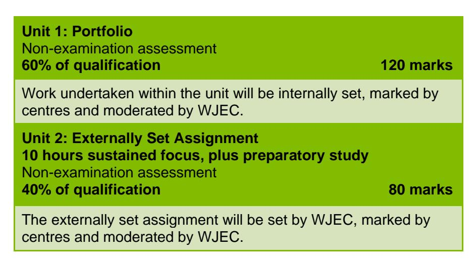
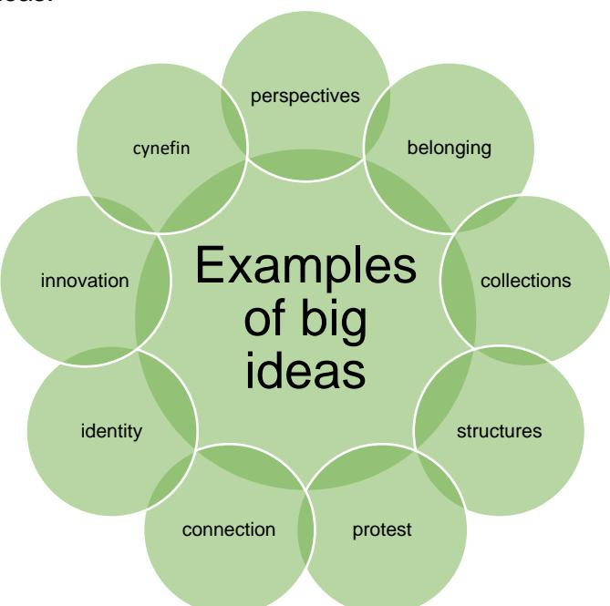
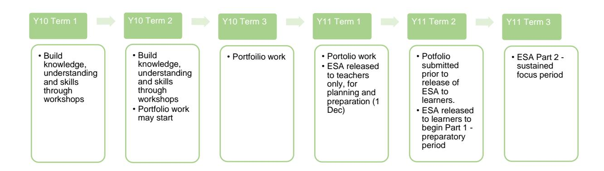
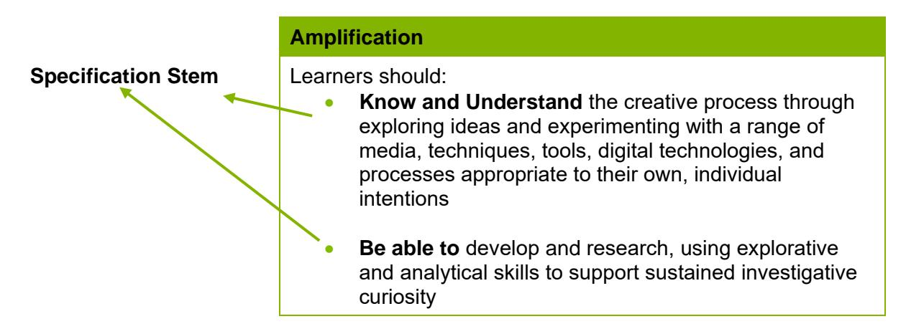

{1}------------------------------------------------

# WJEC GCSE Art and Design

Approved by Qualifications Wales

# Delivery Guide

Teaching from 2025 For award from 2027

Ready for the world. This Qualifications Wales regulated qualification is not available to centres in England.

Made for Wales.

{2}------------------------------------------------

{3}------------------------------------------------

# Contents

| Aims of the Delivery Guide                                   | 1  |
|--------------------------------------------------------------|----|
| Qualification Structure                                      | 1  |
| Pathways                                                     | 1  |
| Unit 1 Overview                                              | 2  |
| Unit 1: Arrangements for non-examination assessment          | 2  |
| Unit 2 Overview                                              | 3  |
| Summary of assessment                                        | 4  |
| Unit 2: Arrangements for non-examination assessment          | 4  |
| Assessment Objectives (contribution to entire qualification) | 6  |
| Unit 1                                                       | 6  |
| Unit 2                                                       | 6  |
| Specification and Assessment Pack                            | 7  |
| Understanding the specification amplification                | 7  |
| Specification Stems                                          | 7  |
| Mark Schemes                                                 | 8  |
| Important Dates                                              | 11 |

{4}------------------------------------------------

# Aims of the Delivery Guide

The aim of the Delivery Guide is to give an overview of the qualification and to help teachers understand how we assess the GCSE. It will offer an introduction to the specification, an assessment overview, and will support teachers in better understanding how to prepare their learners for the assessment of the different units. More information on each unit can be found in the accompanying Qualification Guide.

# Qualification Structure

WJEC GCSE Art and Design consists of 2 units:

This is a linear qualification. It is not tiered.

The Externally Set Assignment will be released to centres in the autumn term (December) of each series. The first release will be in the autumn term (December) 2026.

Unit 1: Portfolio must be completed before Unit 2: Externally Set Assignment is presented to learners.

The qualification will be first awarded in summer 2027.

# Pathways

The GCSE Art and Design qualification is available in the following pathways with no prohibited entry combination:

- Art, craft, and design
- Fine art
- Graphic communication
- Textile design
- Three-dimensional design
- Photography

Learners must select a pathway. The subject content in 1.1, 1.2 and 1.3 must be followed for each pathway.

{5}------------------------------------------------

# Unit 1 Overview

## Portfolio

Assessment Type: Non-examination assessment 60% of qualification 120 marks

This unit is designed to enable learners to develop their knowledge, understanding and skills within the creative process. Learners should be encouraged to make personal discoveries and take creative risks through their own investigations.

Learners will be required to produce a portfolio:

- through a sustained project demonstrating development, refinement, reflection and presentation
- that is internally set, in consultation with the teacher from personal and/or given starting point
- based on a theme, concept or specific design brief.

## Unit 1: Arrangements for non-examination assessment

Learners should start developing their portfolio after they have been introduced to the knowledge, understanding and skills outlined in the subject content. Learners should be provided with opportunities to develop and expand practical knowledge and understanding through workshops in the chosen pathway.

Teachers can review learners' work and provide oral and written advice at a general level in order to secure a functional outcome.

The centre must ensure that the work a learner submits for assessment is their own.

Learners can have access to resources and/preparatory notes.

There is no set time limit for the completion of the portfolio. It is recommended that portfolio work should begin during the spring or summer term in the first year of study The portfolio must be completed before Unit 2 (Externally Set Assignment) is released to learners in the spring term of the final year of study. Candidates work should be stored securely after submission and during the marking, moderation and review periods. Candidates work should not be released until the Review of Marking and Moderation period has expired.

{6}------------------------------------------------

# Unit 2 Overview

## Externally Set Assignment

Assessment Type: Non-examination assessment 40% of qualification 80 marks

The purpose of this unit is to undertake contextual and practical research and supporting studies during a preparatory period. This will inform the learner's response during a 10-hour period of sustained focus.

The Externally Set Assignment contains five overarching big ideas. Learners must choose one big idea only and use any of the stimuli from the big idea as a starting point to inform their work.

Learners will be required to produce a response:

- demonstrating development, refinement, reflection and presentation
- that is based on one of the big ideas.

In this unit, learners will apply the knowledge, understanding and skills developed during Unit 1 in response to the big ideas set by WJEC.

The Externally Set Assignment will be released to centres prior to the end of the autumn term in the final year of the course to allow for planning and preparation of supporting materials. The Externally Set Assignment should be released to learners during the spring term in the final year of study.

## Examples of Big Ideas:

These are examples of big ideas that could be included in the Externally Set Assignment.

{7}------------------------------------------------

# Summary of assessment

The framework below is the suggested schedule for centres.

There is no restriction on content, format or scale of work or the amount of evidence to be selected and presented, although emphasis should be on quality rather than quantity.

Units could be presented in any appropriate format(s) such as:

- display sheets
- visual diaries
- sketchbook(s)/workbook(s)
- a digital portfolio
- mounted exhibitions
- installations
- digital presentation.

## Unit 2: Arrangements for non-examination assessment

The Externally Set Assignment will be released on the WJEC Portal on December 1st in the final year of each series. This is strictly for teachers only, to prepare resources for learners.

The Externally Set Assignment should be introduced to learners after the submission of the portfolio, during the second term of the final year of study.

Learners are required to select one of the big ideas and develop it in the form of:

- a personal response
- a specific design brief
- or another suitable approach.

## PART 1: preparatory study period

Learners will develop their response over a preparatory study period. The amount of time allocated to this is determined by the centre.

Responses will be researched, developed and refined during the preparatory study period. They should take the form of practical, critical and contextual preparatory work/supporting studies along with reflections on the process. Only work produced during the preparatory period can be used and taken forward to Part 2.

{8}------------------------------------------------

Part 1 of Unit 2 has the same controls as Unit 1 as stated in the Assessment Pack.

## PART 2: sustained focus period

This must be undertaken with direct supervision.

The teacher cannot provide any advice or feedback on learners' work.

Learners can have access to resources and/preparatory notes produced in Part 1 only.

Learners have a maximum of 10 hours to produce their outcome, which must begin with a minimum 2-hour session. Part 1 and Part 2 **must** be assessed together.

## Submission of marks

Centres are required to submit marks for both internally assessed units online during the summer term of the final year of study in preparation for moderation.

When marks have been submitted to WJEC, the online system will apply the sample formula based on the overall rank order for the total entry and immediately identify the sample of candidates whose work is selected for moderation.

{9}------------------------------------------------

# Assessment Objectives (contribution to entire qualification)

## Unit 1 The distribution of the assessment objectives for this unit is:

| AO1 | AO2 | AO3 | AO4 | Total |
|-----|-----|-----|-----|-------|
| 15% | 15% | 15% | 15% | 60%   |

## Unit 2 The distribution of the assessment objectives for this unit is:

| AO1 | AO2 | AO3 | AO4 | Total |
|-----|-----|-----|-----|-------|
| 10% | 10% | 10% | 10% | 40%   |

{10}------------------------------------------------

# Specification and Assessment Pack

When we develop new qualifications, we produce the following documents:

- Specification this covers all the information and skills that learners are expected to know by the end of their course.
- Assessment Pack this contains the Sample Assessment Materials(SAMs) i.e.: sample exam papers and sample NEA tasks, relevant controls for the NEA and, mark schemes

This guide builds upon the information in the specification and assessment pack to help further your understanding of said documents.

# Understanding the specification amplification

Learners should be made aware of:

- the specification stems
- what the specification stems mean.

# Specification Stems

When you look through the specification you will notice in the amplification column, we use a variety of wording before the list of content learners need to know; we call this a stem:

Each stem is used for a slightly different reason:

| Specification Stem                        | When it is used                                                                                                                                                                                                                                     |
|----------------------------------------------|-----------------------------------------------------------------------------------------------------------------------------------------------------------------------------------------------------------------------------------------------------|
| Learners should know and understand | When learners are required to demonstrate their knowledge and use it to apply to familiar and unfamiliar contexts.                                                                                                                               |
| Learners should be able to                | When learners need to apply their knowledge and understanding to situations or demonstrate application of practical skills and techniques.                                                                                                    |
| Learners should be aware of               | When learners should expand knowledge of the specified content through a range of contexts. Teachers should refer to Guidance for Teaching documents for further guidance on the depth and breadth to which this content should be taught. |

{11}------------------------------------------------

# Mark Schemes

Mark schemes and/or assessment criteria test the intended learning outcomes for a component. They describe the knowledge and skills (and possibly attitude) that a candidate is expected to demonstrate in their responses and they are then used in marking the work.

## Levels based mark schemes

For questions requiring extended responses

| Mark Scheme for GCSE ART AND DESIGN |                                                                                                                                                                                                                          |                                                                                                                                                                                                                                                                                                                                                                                               |                                                                                                                                                                                                                                                                                              |                                                                                                                                                                                                                                                                                                           | Unit One: Portfolio (Total Marks = 120) |  |  |  |  |
|-------------------------------------|--------------------------------------------------------------------------------------------------------------------------------------------------------------------------------------------------------------------------|-----------------------------------------------------------------------------------------------------------------------------------------------------------------------------------------------------------------------------------------------------------------------------------------------------------------------------------------------------------------------------------------------|----------------------------------------------------------------------------------------------------------------------------------------------------------------------------------------------------------------------------------------------------------------------------------------------|-----------------------------------------------------------------------------------------------------------------------------------------------------------------------------------------------------------------------------------------------------------------------------------------------------------|-----------------------------------------|--|--|--|--|
| Band                                | AO1                                                                                                                                                                                                                      | AO2                                                                                                                                                                                                                                                                                                                                                                                           | AO3                                                                                                                                                                                                                                                                                          | AO4                                                                                                                                                                                                                                                                                                       |                                         |  |  |  |  |
|                                     | Develop ideas and demonstrate critical and contextual understanding of sources                                                                                                                                           | Refine work by exploring ideas, selecting and experimenting with appropriate media, techniques, tools, digital technologies, and processes                                                                                                                                                                                                                                                    | Reflect on own work, and record ideas, observations and insights relevant to intentions as work progresses                                                                                                                                                                                   | Present a personal and meaningful response that realises intentions and demonstrates understanding of visual language                                                                                                                                                                                     |                                         |  |  |  |  |
| 5                                   | 25-30 marks                                                                                                                                                                                                              | 25-30 marks                                                                                                                                                                                                                                                                                                                                                                                   | 25-30 marks                                                                                                                                                                                                                                                                                  | 25-30 marks                                                                                                                                                                                                                                                                                               |                                         |  |  |  |  |
|                                     | Sophisticated and thorough development of ideas through sustained, focused and coherent investigations. Perceptive and rigorous critical analysis of sources, providing the basis for assured, independent responses. | Ideas are refined and explored through rigorous selection and purposeful, creative experimentation. Perceptive and sophisticated use of media, materials, techniques and processes that are skilfully controlled and imaginatively exploited. Perceptive and discriminating ongoing review and evaluation consistently informs the refinement and development of work as it progresses. | Sophisticated recording of ideas, observations and insights through extensive, coherent research and enquiry that is highly relevant to personal intentions. Perceptive, rigorous and effective critical reflection as work progresses, demonstrating depth of understanding and meaning. | Highly imaginative, personal and meaningful response which realises intentions in a sophisticated, coherent and assured manner. The presentation shows a perceptive and thorough understanding of visual language and the purpose and intention of the work is very clearly and convincingly conveyed. |                                         |  |  |  |  |

{12}------------------------------------------------

| 4                                                                                                                                                   | 19-24 marks                                                                                                                                                                                                                                                             |                                                                                                                                                                                                                                                                                                                                                        |                                                                                                                                                                                                                                                                                                              |                                                                                                                                                                                                                                                                                     |
|-----------------------------------------------------------------------------------------------------------------------------------------------------|-------------------------------------------------------------------------------------------------------------------------------------------------------------------------------------------------------------------------------------------------------------------------|--------------------------------------------------------------------------------------------------------------------------------------------------------------------------------------------------------------------------------------------------------------------------------------------------------------------------------------------------------|--------------------------------------------------------------------------------------------------------------------------------------------------------------------------------------------------------------------------------------------------------------------------------------------------------------|-------------------------------------------------------------------------------------------------------------------------------------------------------------------------------------------------------------------------------------------------------------------------------------|
|                                                                                                                                                     | Effective and thorough development of ideas through sustained and focused investigations. Confident and rigorous critical analysis of sources, providing the basis for purposeful, independent responses.                                          | Ideas are refined and explored through relevant selection and creative experimentation. Effective use of media, materials, techniques and processes are that confidently controlled and exploited. Effective and thorough ongoing review and evaluation informs the refinement and development of work as it progresses. | Confident recording of ideas, observations and insights by appropriate means through effective research and enquiry that is relevant to personal intentions. Rigorous and effective critical reflection as work progresses, demonstrating a good level of understanding and meaning. | Imaginative, personal and meaningful response which realises intentions in a confident and effective manner. The presentation shows a good understanding of visual language and the purpose and intention of the work is clearly and convincingly conveyed. |
| 3                                                                                                                                                   | 13-18 marks                                                                                                                                                                                                                                                             |                                                                                                                                                                                                                                                                                                                                                        |                                                                                                                                                                                                                                                                                                              |                                                                                                                                                                                                                                                                                     |
|                                                                                                                                                     | Reasonable development of ideas through investigations which are generally sustained. Reasonable critical analysis of sources, providing the basis for satisfactory and generally independent responses.                                              | Ideas are refined and explored through relevant selection and experimentation. Appropriate use of media, materials, techniques and processes are reasonably controlled and exploited. Reasonable ongoing review and evaluation of explorations supports the refinement and development of work as it progresses.         | Reasonable recording of ideas, observations and insights by appropriate means through research and enquiry that is generally relevant to personal intentions. Reasonably critical reflection on work as it progresses, generally demonstrating understanding and meaning.         | Reasonably imaginative personal and meaningful response which realises intentions in a satisfactory manner. The presentation shows a reasonable understanding of visual language and the purpose and intention of the work is reasonably conveyed.          |
| 2                                                                                                                                                   | 7-12 marks                                                                                                                                                                                                                                                              | 7-12 marks                                                                                                                                                                                                                                                                                                                                             | 7-12 marks                                                                                                                                                                                                                                                                                                   | 7-12 marks                                                                                                                                                                                                                                                                          |
| Some development of ideas through partially sustained investigations. Some analysis of sources, partially informing basic responses. | Ideas are partially refined and explored through selection and experimentation. Some attempt to control and exploit media, materials, techniques and processes. Some ongoing review and evaluation partially informs the work as it progresses. | Basic recording of ideas, observations and insights by appropriate means through research and enquiry that is sometimes relevant to personal intentions. Some reflection on work as it progresses, which sometimes demonstrates understanding and meaning.                                                                  | The response is to some extent, personal and meaningful and intentions are realised in a basic manner. The presentation shows some understanding of visual language and the purpose and intention of the work is conveyed in a partly convincing way.                                |                                                                                                                                                                                                                                                                                     |
| 1                                                                                                                                                   | 1-6 marks                                                                                                                                                                                                                                                               | 1-6 marks                                                                                                                                                                                                                                                                                                                                              | 1-6 marks                                                                                                                                                                                                                                                                                                    | 1-6 marks                                                                                                                                                                                                                                                                           |
| Limited development of ideas through investigations. Limited analysis of sources which have had minimal influence on responses.         | Limited refinement and exploration of ideas. Limited attempt to control and exploit media, materials, techniques and processes. Limited ongoing review and evaluation, with minimal impact on the work as it progresses.                           | Limited recording of ideas, observations and insights by appropriate means through research and enquiry that has limited relevance to personal intentions. Limited reflection on work as it progresses, which demonstrates limited understanding and meaning.                                                               | A limited personal response, with minimal attempts to show meaning, and which realises intentions in a limited manner. The presentation shows limited understanding of visual language and the purpose and intention of the work is conveyed in a limited way.                       |                                                                                                                                                                                                                                                                                     |
| 0                                                                                                                                                   | 0 marks                                                                                                                                                                                                                                                                 | 0 marks                                                                                                                                                                                                                                                                                                                                                | 0 marks                                                                                                                                                                                                                                                                                                      | 0 marks                                                                                                                                                                                                                                                                             |
| Response not worthy of credit or not attempted.                                                                                                  | Response not worthy of credit or not attempted.                                                                                                                                                                                                                      | Response not worthy of credit or not attempted.                                                                                                                                                                                                                                                                                                     | Response not worthy of credit or not attempted.                                                                                                                                                                                                                                                           |                                                                                                                                                                                                                                                                                     |

{13}------------------------------------------------

{14}------------------------------------------------

# Important Dates

| First Teaching of WJEC GCSE Art and Design        | 2025         |
|---------------------------------------------------|--------------|
| First assessment for Unit 1(internal assessment)  | Summer 2027  |
| First assessment for Unit 2 (external assessment) | Summer 2027  |
| First release of Unit 2 NEA assignment brief      | January 2027 |
| First submission of Unit 1 NEA                    | May 2027     |
| First submission of Unit 2 NEA                    | May 2027     |
| First Certification                               | 2027         |