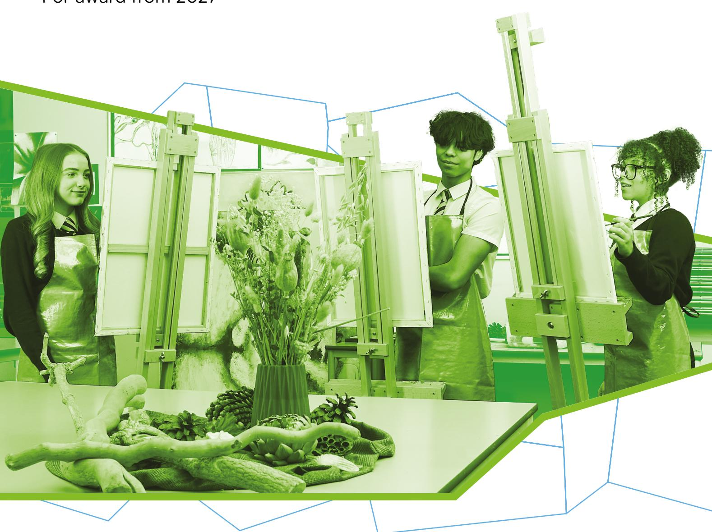

{0}------------------------------------------------

# WJEC GCSE Art and Design

Approved by Qualifications Wales

Guidance for Teaching

Teaching from 2025 For award from 2027

Ready for the world. This Qualifications Wales regulated qualification is not available to centres in England.

Made for Wales.

{1}------------------------------------------------

{2}------------------------------------------------

# Contents

| Section                                                          | Page |
|------------------------------------------------------------------|------|
| Introduction                                                     | 1    |
| Aims of the Guidance for Teaching                                | 1    |
| Additional ways that WJEC can offer support:                     | 1    |
| Quick links                                                      | 1    |
| Assessment                                                       | 2    |
| Summary of Assessment                                            | 2    |
| Overview of Unit 1                                               | 2    |
| Overview of Unit 2                                               | 2    |
| Qualification Assessment Objectives and Weightings               | 3    |
| Specification Content Teacher Guidance                           | 4    |
| Learning Experiences                                             | 18   |
| Opportunities for Embedding Elements of the Curriculum for Wales | 28   |
| Interpretation of Assessment Objectives in Pathways              | 66   |
| AO1                                                              | 66   |
| AO2                                                              | 66   |
| AO3                                                              | 67   |
| AO4                                                              | 67   |

{3}------------------------------------------------

# Introduction

The WJEC GCSE Art and Design has been approved by Qualifications Wales and is available to all centres in Wales. It will be awarded for the first time in Summer 2027, using grades A\* to G.

### Aims of the Guidance for Teaching

The principal aim of the Guidance for Teaching is to support teachers in the delivery of WJEC GCSE Art and Design and to offer guidance on the requirements of the qualification and the assessment process. The Guidance for Teaching is **not intended as a comprehensive reference**, but as support for teachers to develop stimulating and exciting courses tailored to the needs and skills of their learners. The guide offers possible classroom activities and links to useful resources (including our own, freely available digital materials and some from external sources) to provide ideas for immersive and engaging lessons.

### Additional ways that WJEC can offer support:

- sample assessment materials and mark schemes
- professional learning events
- examiners' reports on each unit
- direct access to the subject officer
- free online resources
- Exam Results Analysis
- Online Examination Review

### Quick links

- [Cross-cutting themes](#page-30-1) pathway specific resources embedded into sections
- [Cross-curricular skills](#page-42-0) pathway specific resources embedded into sections

{4}------------------------------------------------

# Assessment Summary of Assessment

#### **Unit 1: Portfolio**

Non-examination assessment

**60% of qualification 120 marks**

120 marks

Work undertaken within the unit will be internally set, marked by centres and moderated by WJEC.

**Unit 2: Externally Set Assignment**

**10 hours sustained focus, plus preparatory study**

Non-examination assessment

**40% of qualification 80 marks**

80 marks

The externally set assignment will be set by WJEC, marked by centres and moderated by WJEC.

# Overview of Unit 1

This unit is designed to enable learners to develop their knowledge, understanding and skills within the creative process. Learners should be encouraged to make personal discoveries and take creative risks through their own investigations.

Learners will be required to produce a portfolio:

- through a sustained project demonstrating development, refinement, reflection and presentation
- that is internally set, in consultation with the teacher from personal and/or given starting point
- based on a theme, concept or specific design brief.

# Overview of Unit 2

The purpose of this unit is to undertake contextual and practical research and supporting studies during a preparatory period. This will inform the learner's response during a 10-hour period of sustained focus.

The Externally Set Assignment contains five overarching big ideas. Learners must choose one big idea only and use any of the stimuli from the big idea as a starting point to inform their work.

Learners will be required to produce a response:

- demonstrating development, refinement, reflection and presentation
- that is based on one of the big ideas.

{5}------------------------------------------------

In this unit, learners will apply the knowledge, understanding and skills developed during Unit 1 in response to the big ideas set by WJEC.

The Externally Set Assignment will be released to centres prior to the end of the autumn term in the final year of the course to allow for planning and preparation of supporting materials. The Externally Set Assignment should be released to learners during the spring term in the final year of study.

#### Examples of Big Ideas

These are examples of big ideas that could be included in the Externally Set Assignment.

# Qualification Assessment Objectives and Weightings

|     |                                                                                                                                                  | Unit 1 | Unit 2 | Total |
|-----|--------------------------------------------------------------------------------------------------------------------------------------------------|--------|--------|-------|
| AO1 | Develop ideas and demonstrate critical and contextual understanding of sources                                                                | 15%    | 10%    | 25%   |
| AO2 | Refine work by exploring ideas, selecting and experimenting with appropriate media, techniques, tools, digital technologies, and processes | 15%    | 10%    | 25%   |
| AO3 | Reflect on own work, and record ideas, observations and insights relevant to intentions as work progresses                                 | 15%    | 10%    | 25%   |
| AO4 | Present a personal and meaningful response that realises intentions and demonstrates understanding of visual language                      | 15%    | 10%    | 25%   |

{6}------------------------------------------------

# Specification Content Teacher Guidance

| 1.1   |                                                                                                                                                                                                                                         |                                                                                                                                                                                                                                                                                                                                                                                                                                                                                                                                                                                                                                                                                                                                                                                                                   |
|-------|-----------------------------------------------------------------------------------------------------------------------------------------------------------------------------------------------------------------------------------------|-------------------------------------------------------------------------------------------------------------------------------------------------------------------------------------------------------------------------------------------------------------------------------------------------------------------------------------------------------------------------------------------------------------------------------------------------------------------------------------------------------------------------------------------------------------------------------------------------------------------------------------------------------------------------------------------------------------------------------------------------------------------------------------------------------------------|
|       | Content Amplification                                                                                                                                                                                                                   | Teacher Guidance                                                                                                                                                                                                                                                                                                                                                                                                                                                                                                                                                                                                                                                                                                                                                                                                  |
| 1.1.1 | Learners should know and understand: • the creative process through exploring ideas and experimenting with a range of media, techniques, tools, digital technologies, and processes appropriate to their own, individual intentions. | This is the most fundamental of the requirements within the specification. Learners should find ways of developing their own ideas and be able to work with a wide range of art and design disciplines. This will enable them to access new skills to capture their imagination so that they become independent creators. It is important that they respond to the specification requirements in their own personal way. Learning should be both analogue and digital and must equip learners with the skills to negotiate a creative future, whether or not they continue to study Art and Design. To best support learners, it is helpful if you are able to keep your own practice and/or creative interests as fresh as possible so that you can best inspire and encourage learners to do the same. |

{7}------------------------------------------------

1.1.2 Learners should know and understand: how art, craft, and design from a range of diverse cultures, societies, and times:

- reflects the context within which it was created
- influences present cultures and societies
- influences learners' responses.

A variety of different sources of inspiration should be provided to stimulate and inform learners – these should include both contemporary and historical artefacts, images, documents and references. These should address social, cultural, political and religious issues.

Looking at work from other contexts outside their own knowledge helps learners to increase knowledge and understanding of art and design to help inspire new ideas. Learners should be encouraged to understand the significance of a piece of art and design within its place in time, society and culture.

To successfully meet this requirement, teachers must reach far beyond the European tradition, avoiding unconscious bias towards this. Equally, teachers must embrace cynefin and the impact of local artists and designers on learners' identity and work.

It is important to note that learners will come from a variety of cultural backgrounds and encouraging this to be celebrated will support an independent and individual approach to their work.

{8}------------------------------------------------

#### 1.1.3 Learners should know and understand:

• how meaning is communicated through a broad range of creative work and how it influences their own work and creative intentions.

'Meaning' in art or design can be defined as having significance or conveying a particular message. This 'meaning' will be portrayed by the creator and the person engaging with the artefact. It is likely to be 'expressive, having a purpose, worthwhile'. This idea of 'meaning' can be amplified to learners through discussion while reviewing other art or design works in the classroom, galleries, studios or workshops.

In order to fully understand and respond to 'meaning' in their work, learners are expected to be fully involved in what they are aiming to achieve. When learners are working on a project that captures their imagination, the project becomes meaningful automatically.

The best way to achieve this in both the Portfolio and the ESA is to allow learners to explore their own individually selected ideas. While set tasks can be appropriate in the early stages of the GCSE (i.e: in the first two terms of Year 10), it is unlikely that an appropriate level of 'meaning' will be found when learners are carrying out teacher directed research and tasks.

{9}------------------------------------------------

#### 1.1.4 Learners should know and understand:

• how to critically analyse and reflect on their own and others work.

In order to understand and improve their own work, learners need to learn how to look at their own work critically, breaking it down into its component parts and thinking about the various different elements that go together to make up the whole piece.

When they can do this, they will begin to identify synergies in different aspects of their work, areas that require deeper creative input and areas of strength to build on. They may notice serendipitous outcomes, recognising that choices initially considered 'mistakes' have developed advantageously.

From this, they can move forward to improve on their work, building upon elements identified as positives and refocusing where necessary. If learners are able to do this through their own identification, their outcomes will be much more successful through their ownership of this growth. In the early stages this should be supported by teacher input.

Learners could also be encouraged to review each other's work, ensuring that such experiences remain a positive experience, during the skill building phase

This skill applies not only in Art and Design, so opportunities to discuss how to deliver this with other subject teachers would be helpful to forge integration across Areas of Learning Experiences and support the four purposes.

This ability to analyse art and design work will build the foundations for critical review outlined in 1.2.6 below.

{10}------------------------------------------------

| 1.2   |                                                                                                                                              |                                                                                                                                                                                                                                                                                                                                                                                                                                                                                                                                                                                                                                                                                                                                                                                                                                                                                                                                                                                                                                                                                                                                                        |
|-------|----------------------------------------------------------------------------------------------------------------------------------------------|--------------------------------------------------------------------------------------------------------------------------------------------------------------------------------------------------------------------------------------------------------------------------------------------------------------------------------------------------------------------------------------------------------------------------------------------------------------------------------------------------------------------------------------------------------------------------------------------------------------------------------------------------------------------------------------------------------------------------------------------------------------------------------------------------------------------------------------------------------------------------------------------------------------------------------------------------------------------------------------------------------------------------------------------------------------------------------------------------------------------------------------------------------|
|       | Content Amplification                                                                                                                        | Teacher Guidance                                                                                                                                                                                                                                                                                                                                                                                                                                                                                                                                                                                                                                                                                                                                                                                                                                                                                                                                                                                                                                                                                                                                       |
| 1.2.1 | Learners should be able to: • develop and research, using explorative and analytical skills to support sustained investigative curiosity. | Assessment Objective 1 demands that learners ‘demonstrate critical and contextual understanding of sources’. This often requires the exploration and analysis of certain artists, genres or ideas that are contextually important to the learners' project (in both the Portfolio and the ESA).  To fully embrace the four purposes as well as to respond to AO1, learners should be supported and encouraged to select their own sources, with support, so that they have the opportunity to satisfy this curiosity. Teachers should be open to learner’s choice of direction whilst providing guidance on the appropriateness of suggested artists and designers.  It is important that Primary sources are sought wherever possible – an interview or logged conversation with a gallery or contemporary artist may well be of more value to the learner than a list of biographical notes of someone unavailable. This should be considered on an individual basis and follow appropriate procedures. Equally, seeing work in real life is irreplaceable, despite the breadth of available artists and designers through the internet. |

{11}------------------------------------------------

Similarly, AO2 requires that learners 'explore ideas, selecting and experimenting with appropriate media'. While it is clear that schools will not have access to every technique available, learners should be encouraged to try out using new materials and styles within the parameters that the school can offer.

While it is vital that learners are open to a variety of workshop experiences and demonstrations in the early part of the GCSE course, there is no advantage to demonstrating many different techniques within the learner's portfolio unless the investigations have purpose and are evident in developing an outcome.

{12}------------------------------------------------

#### 1.2.2 Learners should be able to:

• develop and refine practical and technical skills, communicating artistic intent with purpose.

The suggested structure of the course allows for the first two terms of Year 10 to be dedicated to building skills in the selected Pathway. These sessions are most likely to be delivered by the teacher in demonstrations of techniques that they are knowledgeable about or they might be delivered by outside agencies. This may include specialisms such as (this list is not limited to the following):

- painting on canvas
- relief or intaglio printmaking
- digital machine embroidery
- digital graphics programmes such as Photoshop
- model making
- using an enlarger to print light-based media.

This opportunity to use time to develop and refine practical skills should include drawing – a requirement of the Specification. Each Pathway will have a slightly different approach - digital resources provided by WJEC can be used to support this.

As learners move forward into the Portfolio phase of the course, these skills are likely to be developed further – either supported by the teacher or driven by the independent wishes of the learner.

{13}------------------------------------------------

Where this development and refinement is introduced by the teacher, while initial skill gathering may be taught to the whole cohort, in order to successfully respond to Assessment Objective 2 through experimentation, each learner should be encouraged to take their initial learning and develop it in a way that grows into and supports their own personal project.

Where exploration is driven by the learner, it is incumbent on teachers to support this wherever appropriate. Teachers don't have to possess the skills to demonstrate all possible techniques, but instead can encourage learners to research and investigate for themselves – there are many, many, practical tutorials online covering a vast array of techniques for each Pathway. In this way learners are able to develop desired skills that are meaningful to them.

In either case, learners should ensure that their experimentation is meaningful, and that investigations and refinement are carried out with purpose. The development of non-related samples for the sake of experimentation itself should not be encouraged as part of Unit 1 or Unit 2.

{14}------------------------------------------------

1.2.3 Learners should be able to:

• use and adapt drawing skills for different needs and purposes.

The importance of drawing, used in its widest sense as a recording tool and means of exploring visual language, is emphasised here.

The ability to draw is a requirement of the Art and Design Specification. In every Pathway, learners must show evidence of drawing within both Unit 1 and Unit 2. There are a variety of ways to respond to this and every Pathway offers the opportunity to develop different drawing skills of various kinds – resources provided by WJEC can be used to support this. Drawing is not assessed separately from the body of work presented but should be embedded within it.

Drawing fulfils a variety of roles and serves many different purposes. It may take the form of sketches, analytical observational studies, storyboards, thumbnail sketches, layouts, roughs, experimental or expressive studies, two or three-dimensional modelling, detailed designs and drawing with light. Drawings can be made using digital tools or traditional media or using a combination of both.

{15}------------------------------------------------

|       | Wherever possible, learners should be encouraged to draw from primary sources, regardless of the Pathway followed. Opportunities to take advantage of this may not be immediately obvious to the learner, so teachers should support learners to reflect on the possibilities that could be considered, for example:figure drawingdrawing from a musical sourcemachine drawing Colossal articledigital drawingworking drawingsfound drawings |                                                                                                                                                                                                                                                                                                                                                                                                                                                                                                                                                                                                                                                                                                                                                                                                                                                                                                                                                                                                                                                                                                                                                      |
|-------|----------------------------------------------------------------------------------------------------------------------------------------------------------------------------------------------------------------------------------------------------------------------------------------------------------------------------------------------------------------------------------------------------------------------------------------------|------------------------------------------------------------------------------------------------------------------------------------------------------------------------------------------------------------------------------------------------------------------------------------------------------------------------------------------------------------------------------------------------------------------------------------------------------------------------------------------------------------------------------------------------------------------------------------------------------------------------------------------------------------------------------------------------------------------------------------------------------------------------------------------------------------------------------------------------------------------------------------------------------------------------------------------------------------------------------------------------------------------------------------------------------------------------------------------------------------------------------------------------------|
| 1.2.4 | Learners should be able to:develop imaginative and intuitive personal creative responses to stimuli.                                                                                                                                                                                                                                                                                                                                         | In order to support learners to fulfil this imaginative and intuitive response, it is likely that the learner will need to make the decisions on their work because they feel enabled to be impassioned, interested and invested in what they are doing. This does not only apply to those who are technically strong; all work where the learners' personal interests are clear are stronger than where teachers have led learners down a guided path. It can be challenging to find stimuli that might inspire learners. Topics for Unit 1 can be taken from previously issued ESA papers, developed from a local situation or circumstance, or inspired by a visit to a gallery or studio/workshop to see other artists and designers' work. Many learners have interests outside of the classroom into which they can be immersed for their Unit 1 work and it might be in the skill of the teacher to 'know their learners' in order to help stimulate an appropriate starting point. As learners will have to work on Unit 1 for a significant period of time, it is advisable to ensure that they are fully engaged with what they are doing. |

{16}------------------------------------------------

1.2.5 Learners should be able to:

• use creative thinking when using tools, materials, and techniques to create, refine and realise outcomes which exhibit clear purpose and intent and demonstrate understanding of visual language.

In the development of skills using any kind of media within each Pathway, in order to successfully refine work to fully respond to AO2, the exploration of techniques through experimenting with different tools, materials and techniques should be directional. Decisions should be made, after reflection, about what will best suit the learners' project and move it forward in an interesting and possibly innovative direction.

Annotation of work in progress can help to clarify progress to the learner as they reflect on their work and can aid the assessing teacher and moderator in the learners' intention.

Repetition to create volume in development work is not required or credited; it is preferable to curate samples to explain the direction the learner has taken and the reasons for the decisions they have made. Links should be clearly made between the initial context, the exploration and experimental phase, the reflection of these intentions and the fulfilment of a meaningful response. Changes of direction can certainly be taken on board, but a visible lack of purpose or intent would suggest that the highest mark bands are unlikely to be reached.

{17}------------------------------------------------

1.2.6 Learners should be able to:

• apply critical thinking to a wide variety of art, craft, and design from diverse contexts, including sources influenced by other people, from different places and different times.

Critical thinking requires learners to:

- be aware of the reasons for what they think and what they do
- question and critically evaluate their own thoughts and actions
- clearly present to others the reasons for their thoughts and actions

As part of the contextual investigation which happens, usually, in the early stages of Unit 1 and Unit 2 developing an understanding of:

- why work has been carried out,
- what has influenced it,
- where was the artist or designer working and what in this is relevant
- who else was working in similar circumstances at that time (contemporary or historical)
- how successfully the work was carried out using the relevant techniques and media

This pattern (or one similar) should be taught in the early stages of year 10 so that this approach is embedded by the time that Unit 1 begins. Support should be given to learners in how to respond to artworks, designed products, craft outcomes and photographic works so that they develop these critical skills in response to the work of others and that of themselves.

As investigations unfold and learners' own work develops, the application of critical thinking in order to reflect and develop insight is highly valuable in AO3. The same questions can be adapted to support learners to reflect and apply critical analysis to their own work.

{18}------------------------------------------------

1.2.7 Learners should be able to:

• consider their own creative intentions and how to convey these to an audience through effective and appropriate presentation, exhibition and/or sharing of own creative work.

It is not anticipated that all work carried out during Unit 1 or Unit 2 is presented for assessment. Learners should, in conjunction with their teacher, select an appropriate level of work which clearly demonstrates their intentions and outcomes. Each Assessment Objective should be clearly met and evidence shown – albeit in a holistic nature across the work as a whole

Learners should consider the visual impact of their work and the preparation and outcomes of Unit 1 and Unit 2 should be presented in an appropriate way.

There is no specific requirement to use sketchbooks or folders, or the nature of the display, however learners should become aware of the impact of their work on audience.

Display types are likely to be significantly different across Pathways and provision made for two dimensional as well as three dimensional work should be made. Every effort should be made to show digital work on screen.

{19}------------------------------------------------

| 1.2.8  | Learners should be able to: • reflect on, refine, and evaluate their own work.                                                                                                                                                                                                                                                                                              | The ability to reflect on your work is a skill that is important in all areas of life and used in many other subjects. Speak to colleagues to share resources and ideas to reinforce the importance of evaluation in order to refine work.  Teachers can demonstrate their own reflective practice by showing learners that they continually evaluate their approaches to their teaching as well as to any practical work that they undertake. |
|--------|--------------------------------------------------------------------------------------------------------------------------------------------------------------------------------------------------------------------------------------------------------------------------------------------------------------------------------------------------------------------------------|------------------------------------------------------------------------------------------------------------------------------------------------------------------------------------------------------------------------------------------------------------------------------------------------------------------------------------------------------------------------------------------------------------------------------------------------------|
| 1.2.9  | Learners should be able to: • acknowledge how work can be interpreted and responded to by an audience.                                                                                                                                                                                                                                                                      | This is closely linked to 1.2.7 above.                                                                                                                                                                                                                                                                                                                                                                                                               |
| 1.2.10 | Learners should be able to: • critically analyse and reflect on their own and others work to: • inform the development of ideas • evaluate the effectiveness of the processes and outcomes of creative work • consider if it effectively communicates the intended meaning and purpose • review how work can be interpreted by and responded to by an audience. | This is closely linked to 1.2.6 – 1.2.8 above.                                                                                                                                                                                                                                                                                                                                                                                                       |

{20}------------------------------------------------

## Learning Experiences

Learners should be encouraged to consider the following learning experiences and skills to further develop their understanding, appreciation and awareness of the subject content. Information in the table below provides opportunities for teachers to integrate the learning experiences into delivery.

### **Learning Experience Exemplification of Learning Experience** Experience a variety of professional works through workshops and gallery/exhibitions/museum visits either in person or onscreen The specification allows teachers to develop a curriculum that provides opportunities for a full range of artistic creative encounters of varying scope, duration and intensity. Examples of professional works include the online workshops run by the [Tate Modern](https://www.tate.org.uk/about-us/learning-programmes) and resources developed for the qualification. There are also resources such as ['Go and See'](https://hwb.gov.wales/playlists/view/1407f64f-8419-4c61-bc67-e1894de4f3d7/en/2?options=CNIQ39k7rbEp4zsz8OdGxip83XDxyAM%252BxyuNqUgoOrvEtxGXwma9Q0UtNK7LrNnQ2JYtTCNaiXCWtRE9GZN%252BqqZTG4TctPVM6O9eOnOrYXFGG6WTjJTFrJVUe0Q4uslebQEo3ZRuDB0n6%252FDH8FKfwTyxUh5119HChyzZyPfej9PAz5rPzZ6i6IKOCXLNHpQgSW6wZpIt3TDnzWnfrs5RRg%253D%253D) on Hwb, which is a virtual collection from the Arts Council of Wales that offers live resources for both teachers and learners. These experiences show learners how other artists and designers go about developing their ideas and may inspire them to develop their own ideas. There are resources on [BBC Bitesize](https://www.bbc.co.uk/bitesize/guides/z6h39ty/revision/1)[1](#page-20-1) where young people reveal their sources of inspiration. There are young people's programmes in many Welsh art galleries such as: • [The Mission Gallery, Swansea](https://www.missiongallery.co.uk/learning/) • [MOMA, Machynlleth](https://moma.cymru/en/plan-your-visit/learning/) • [Mostyn, Llandudno](https://mostyn.org/learn/resources/) • [The Rodd, Presteigne](https://www.sidneynolantrust.org/learning/cultivate/) Where possible, teachers should invite working artists and designers to come in to visit schools to talk about how to develop their ideas through the media that they use. Centres can apply for [Have-a-go](https://arts.wales/funding/creative-learning/have-a-go) funding which will support new hands-on activities if they are not available in school. Current BA or MA students are often happy to come into schools to discuss their practice – especially if they are school alumni. Develop your own skills – workshops are often available either through local makers or art colleges

• [Surface Pattern Design, UWTSD](https://www.uwtsd.ac.uk/swansea-college-art/art-after-dark)

1 BBC Bitesize has Eduqas resources for use, however, please be aware that there are differences between specifications.

{21}------------------------------------------------

Develop confidence in giving and receiving feedback, promoting independent thinking, originality and creative resilience

The design of the specification allows for learners to develop imaginative and intuitive personal creative responses to stimuli, linking these responses to potential career pathways and workrelated experiences. Opportunities should be given for classroom feedback, peer review and assessment for learning2 [.](#page-21-0)

The best way that learners develop as artists and designers is to reflect on their work. There are several ways to encourage that:

- Guided reflective evaluation and analysis
- Teacher general feedback
- Peer review
- Visiting artist/designer/teacher review

It's vital that all of these experiences become positive for learners so that they feel free to talk about their work and become confident in presenting their work for feedback as well as equipped to critique the work of others (peers included).

**Guided reflection and analysis** can be supported in the early stages of the GCSE course through providing structured evaluation handouts; there are many available on resource sharing sites such as [TES](https://www.tes.com/resources/search/?displayCountry=GB&q=art%20evaluation&years=GB%7C0%7C11-14%7C&years=GB%7C0%7C14-16%7C&years=GB%7C0%7C16%2B%7C) and these can be adapted to suit your cohort. Teachers should ensure that these can support differentiated outcomes.

Sentence starters could be provided to support learners to begin talking about their work. Use of the 5Ws help them remember this:

- Who will see it? Who is the audience?
- What have they done? So far ... what will they do next?
- Where are their sources from? Reflect on contexts.
- Why have they done it? What inspired this stage of work?
- When will they complete the phase? Do they have a plan?

By embedding this approach in learning in the first phase of Year 10, learners will be able to integrate reflection to their work when they begin Unit 1. This could be carried out through annotation across the sketchbook/preparatory studies or more formally.

**Peer review** during the skill building phase, can be seen as challenging however approached carefully, can be highly influential. Learners should be given time to review each other's work at key phases in the project. Encourage learners to present their work to the group and, using the [5Ws](#page-21-1) identified above (in the first instance) explain what they are aiming to achieve. Encourage peers to provide positive comments, basing their input on the assessment objectives, offering ideas on how to achieve them. This will not only provide peer insight but will reinforce understanding of how to meet the Aos, by both recipients and providers of the feedback.

{22}------------------------------------------------

**Visiting artist/designer/teacher review** can offer an alternative and supplementary perspective than that of the main class teacher. This could be provided by any visitors providing workshops, art students, or even other related teachers within the school. In order to make this effective, the reviewer should be provided with some general information in advance, so that the overall direction is maintained.

There is a useful resource to support 'Analysing and evaluating' in [BBC Bitesize](https://www.bbc.co.uk/bitesize/guides/z6srdnb/revision/1)3 .

As a plenary to lessons, learners could be prompted to evaluate what they have achieved during that lesson, against the timescale that they are working to and identify something to work on with a selfimposed deadline, giving experience of decision making and selfdiscipline.

#### **Teacher formative feedback [JCQ Guidelines](https://www.jcq.org.uk/exams-office/non-examination-assessments/)**

Teachers may:

- review candidates' work and provide oral and written advice at a general level.
- provide advice at a general level, allowing candidates to revise and re-draft work.

General advice of this nature does not need to be recorded or taken into account when the work is marked. If teachers give any assistance which goes beyond general advice, then they must record this assistance and take it into account when marking the work or submit it to the external examiner.

Examples of this assistance include:

- providing detailed specific advice on how to improve drafts to meet the assessment criteria.
- giving detailed feedback on errors and omissions which limits candidates' opportunities to show initiative themselves.
- intervening personally to improve the presentation or content of work.

Guidance by teachers or others to evaluate progress and identify broad approaches to improvement is not allowed during the entirety of Unit 2.

3 BBC Bitesize has Eduqas resources for use, however, please be aware that there are differences between specifications.

{23}------------------------------------------------

Opportunities to investigate, take risks and overcome creative challenges

By focusing on experimentation, risk-taking, drawing, and the application of formal elements, the design of the qualification empowers learners to investigate purposeful and meaningful themes that help lead to fulfilling lives as valued members of society.

Part of the exploration and study of art and design is a development of the understanding of creative risks that artists and designers have taken throughout history and in the present day to question and challenge society, perceptions and social norms.

This can be done through the study of artists and designers such as:

- William Blake
- The Impressionists and the Salon des Refuses
- Gwen John: amongst men
- The avant-garde and radicalism
- The Bauhaus and modernism
- The Abstract Expressionists radical approach to painting
- Superstars and creative morality: Warhol to Hirst.

From studying artists such as these, learners should gain understanding of the rise from obscurity or ridicule to achieve greatness and influence. These are important lessons to learn in art and form a critical part of the social and cultural aspect of qualification.

Aligned with this is the ability of art and design to address issues, i.e: racism and gender stereotyping through art. Exploration of the antiracist print work of Paul Peter Piech (an arranged visit to the [Cynon](https://cynonvalleymuseum.wales/2021/11/05/the-work-of-paul-peter-piech/)  [Valley Museum\)](https://cynonvalleymuseum.wales/2021/11/05/the-work-of-paul-peter-piech/) resource would enable learners to explore and address these societal issues.

Much of these discussions are closely aligned with other areas in the Expressive Arts AoLE, including subjects such as Dance, Drama, Digital Film and Media and Music.

Integration of performers such as John Cale and William Bracewell as well as companies such as the National Theatre Wales, and events like the Cardiff Music City Festival provide appropriate contextual references and sources for visits and study.

Through contextual understanding, artists and designers who have taken risks to successfully develop their work, recognition of what it might feel like to take a risk becomes possible. Learners should understand that taking considered risks can enable disproportionate achievement leaps (while being supported to fail in the search for personal development at appropriate times in the course) and is an invaluable lesson across all the arts.

{24}------------------------------------------------

Gain an awareness of the different careers, roles and individual work practices associated with the production of art, craft, and design in the creative and cultural industries

The design of the specification allows for learners to develop imaginative and intuitive personal creative responses to stimuli, linking these responses to potential career pathways and workrelated experiences.

Each of the pathways within the GCSE Art and Design course suggests different future career routes, however at this level the links between pathways are strong and the selection of one pathway does not preclude future movement to another.

The broadest of pathways, *Art Craft and Design* seeks to encompass all the various pathways and disciplines within Art and Design. *Fine art* suggests career routes into painting and sculpture, installation, film making, illustration and curation. *Textile design* most obviously leads to fashion design as well as printed and woven textile design and textile engineering.

The development of sustainable, innovative textiles is a vastly growing area closely aligned with science and technology. Closely linked to this, *Three-dimensional design* can lead learners towards architecture, jewellery design, ceramics or furniture design and the exploration of materials and how they behave. *Graphic communication* in the digital age is central to our societal need for community, the sharing of information and use of visual language to create messages and marketing materials. *Photography's* potential as both an analogue and digital communication of image has exploded both commercially and artistically, enabling learners to explore the related disciplines of film and animation, through commercial, documentary and editorial approaches.

The use of digital technology in art informs many career routes and experience of these sophisticated apps and programmes will be highly beneficial in careers both within and outside the arts. Digital image manipulation for photographs, generation of digital characters through graphic communication and animation techniques, the use of three-dimensional design programmes to explore ideas in real life situations will all contribute to digital futures.

So that learners can explore career routes, each of the Big Ideas within the Externally Set Assignment has an option of responding to a written brief. In the Sample Assessment Materials, these options address (not conclusive nor exhaustive):

- A local character which might invite a response in the 3D Design pathway which explores temporary sanctuary; or a photography response which supports editorial to highlight issues.
- A museum collection could involve a response from the Fine art pathway which considers a response to a current exhibition; or a Graphic communication response to create advertising material to support a coming event.
- Celebrate a structure could investigate a structure from natural forms, inspiring a Textile design response to create a garment, or an Art, craft and design outcome which explores pattern created by structures through the medium of printmaking.

{25}------------------------------------------------

• A community event - suggests a response to, amongst other things, a pride rally through the medium of Photography to celebrate diversity or; through Art, craft and design to design flags and banners for display.

Learners could be shown resources such as the [Creative Careers](https://discovercreative.careers/about/) website and a list of careers available through the [NSEAD Careers](https://www.nsead.org/files/bf4a2e492ac149bab88d7b247fd914e5.pdf)  [List](https://www.nsead.org/files/bf4a2e492ac149bab88d7b247fd914e5.pdf) to help them explore future careers within the subject. As well as this, [Tate have created a short film,](https://youtu.be/vKjkx6PzajE?si=AiD2EF_m9lzDBeqU) with the assistance of Bob and Roberta Smith, about the importance art education.

An inspiring quote to share with learners, or have displayed in the classroom could be:

*'It was really when I was at art school that I started to see the relationship between history, philosophy, politics and art. Prior to that I thought that art was just making pretty pictures – actually art is connected to life.'*

Yinka Shonibare

{26}------------------------------------------------

Use of digital technology as appropriate to the chosen pathway

The design of the specification allows for consideration of a centre's access to digital technology and how it could be used in the chosen pathway. Pathways such as Graphic design and Photography are more likely to use digital technology at a centres discretion.

Digital technology is applicable to *all* pathways within GCSE Art and Design. It is not necessary to show evidence of the use of digital technology, however it is desirable to show the integration and understanding of the use of technology in a variety of elements applicable to both Unit 1 and 2. If digital resources are not available within a centre, there will be no impact of the possible achievement levels of learners.

Various ways of approaching digital technology in Art and Design:

- Tablets can be used for drawings of any type, using specialist apps.
- Desktop computers might be considered for more heavyweight illustration or CAD programmes.
- Research can be carried out on the internet, both at home and in schools, and digital scrapbooks made on Pinterest to record secondary sources if applicable.
- Cameras on phones are entirely acceptable as digital photography resources, though it is still useful to learn to use a digital SLR if available.
- Manipulation of photographs can be carried out, though if this is achieved automatically though the use of AI , this must be explained on the candidate declaration form as a form of Artificial Intelligence (AI).

Digital technology increasingly enables learners to work in their own time, on their own devices. It falls to the teacher to authenticate this work, so it is important to understand the capabilities of learners to avoid inconsistency and see them doing at least some of the work in class time.

Artificial Intelligence is fully integrated into learner's lives, even though they may not be aware that they are using it. Again, knowing the learner and what their usual approach is will be vital. Where learners make unexpected leaps, it is important to see evidence. This will form part of the authentication requirements.

The use of AI as both a research mechanism, a digital tool or an image generator is permitted however it **MUST** be declared and reference made to its use in the relevant annotation in the sketchbook/preparatory work.

[AI Use in Assessments: Protecting the Integrity of Qualifications -](https://www.jcq.org.uk/exams-office/malpractice/artificial-intelligence/) [JCQ Joint Council for Qualifications](https://www.jcq.org.uk/exams-office/malpractice/artificial-intelligence/)

{27}------------------------------------------------

Digital technology can be used during Unit 2, part 2, however this can be problematic. The rules that must be followed are:

- Candidates own devices are not permitted.
- During the sustained focus period, candidates can access webbased software applications, however no other use of the Internet is allowed.
- There must be no possible access to the work between sessions.

Additional precautions need to be taken if the centre permits candidates to use computers to store work. This may involve collecting memory sticks for secure storage between sessions or restricting candidates' access to a specific area of the centre's IT network [\(JCQ\)](https://www.jcq.org.uk/exams-office/non-examination-assessments/).

Compliance with all of the above requirements is the centre's responsibility and teachers will sign the candidate declaration form to acknowledge this. Non-compliance with this in any way, even in error, will be considered as suspected malpractice.

{28}------------------------------------------------

Gain a basic awareness of ethical and legal considerations as appropriate

Learners, while refining techniques, should also become informed citizens with a strong sense of ethics, understanding their role in the broader world and contributing positively to society.

During the GCSE course of study, learners should be taught a basic understanding of what intellectual property is and how it is protected through rules such as copyright. This should be considered in relation to their own work and that of others.

**Plagiarism** is a form of intellectual property breach and this must be made clear to learners. This extends to the copying verbatim of information from websites, particularly where it is presented as research. Learners need to be made aware that no credit will be given where they are attempting to submit such work as their own. Where plagiarism is evident within a learners work, and where a learner has signed the declaration of authentication, it must be reported to WJEC using the relevant JCQ suspected candidate malpractice form.

Learners must also be reminded that any unacknowledged copying from or reproduction of material from an unacknowledged AI tool, where a learner is attempting to submit such work as their own, and where a learner has signed the declaration of authentication, is also considered as suspected candidate malpractice. Such incidents must also be reported to WJEC using the relevant JCQ suspected candidate malpractice form.

Where this type of plagiarism is seen frequently across all work in a centre, this can be considered as suspected centre/centre staff malpractice. Where the copied work is presented as studied transcription, this is permitted however it is expected that candidates will show what they have learned in the process. Annotation must explain that the transcribed work is not the candidates own original idea. Where final outcomes are found to be copied from other artists or designers' work, no mark will be given for that element of the work. Plagiarism in Assessments - [JCQ Joint Council for Qualifications](https://www.jcq.org.uk/exams-office/malpractice/plagiarism-in-assessments---guidance-for-teachersassessors/)

The use of AI is covered above, this should be addressed in class and outlined as an issue of ethics as well as explaining its use in assessed work.

Learners should be supported to develop growing social awareness. It is important to have a developing understanding of societal norms of the past to give context to their current work. As in other subject areas, changing attitudes in society through racism, sexism, colonialism, class and gender is clearly seen through a historic lens and should be addressed with learners as the opportunity for discussion arises (in an age appropriate way).

#### Examples could be:

- Paul Gaugin and the Tahitian women that he painted,
- the male gaze in art,
- the work of the Guerilla girls,
- Rex Whistler's mural in the Tate dining room.

{29}------------------------------------------------

|  | Discussion of these topics will support learners to be thoughtful citizens with the ability to safely and ethically develop their work to realise their ambitions.  A quote that could be shared with learners or have displayed in the classroom could be:  'If anything, art is about morals, about our belief in humanity. Without that, there simply is no art.' Ai Weiwei |
|--|-----------------------------------------------------------------------------------------------------------------------------------------------------------------------------------------------------------------------------------------------------------------------------------------------------------------------------------------------------------------------------------------------|
|--|-----------------------------------------------------------------------------------------------------------------------------------------------------------------------------------------------------------------------------------------------------------------------------------------------------------------------------------------------------------------------------------------------|

{30}------------------------------------------------

#### **Curriculum for Wales Strands**

#### **Cross-cutting Themes**

**There are many opportunities to include Local, National and International Contexts in GCSE Art and Design. These opportunities are important to Learners because, in responding to both the Portfolio and Externally Set Assignment, Art and Design demands a wide contextual understanding from learners to interpret their own cynefin and, in understanding the work of artists and designers from diverse cultures and backgrounds, to translate this into meaningful and personal responses.**

**Below are some examples of how Local, National and International Contexts can be embedded into teaching and learning:**

| Local, National & International Contexts | Specification Reference | Amplification                                                                                                                                        | Example:                                                                                                                                                                                                                                                                                                                                                                                                                                                                                                                                                                                                                                                                                                                                                                                                                                                                                                                    |
|------------------------------------------------|----------------------------|------------------------------------------------------------------------------------------------------------------------------------------------------|-----------------------------------------------------------------------------------------------------------------------------------------------------------------------------------------------------------------------------------------------------------------------------------------------------------------------------------------------------------------------------------------------------------------------------------------------------------------------------------------------------------------------------------------------------------------------------------------------------------------------------------------------------------------------------------------------------------------------------------------------------------------------------------------------------------------------------------------------------------------------------------------------------------------------------|
|                                                | 1.1.2                      | Art, craft, and design investigation must arise from a range of diverse cultures, societies, and times to influences learners' responses | Fine Art Example: Learners may choose to investigate the work of Gus Payne, a Welsh figurative artist whose work 'references from myth, fairy-tale folklore, religion and our shared history'. Following this, they may choose to research the work from a national context which focuses on similar areas of interest such as Paula Rego. 'A painter of "stories", her characters enact a variety of roles and depict disquieting tensions below the surface.'  The learner might go on to search responses to narrative painting from a wider international context, in order to fully understand approaches which could inform their own work. They could look at the work of Amy Sherald, who explores contemporary life and stories of Black Americans through portraits. 'Imagination allows you to bend the rules of the temporal world. I just want them to see that a |

{31}------------------------------------------------

*[environment.](https://www.artnet.com/galleries/hauser-wirth-zurich-london-new-york/artist-amy-sherald/)'*

*[more beautiful world exists beyond the confines of your](https://www.artnet.com/galleries/hauser-wirth-zurich-london-new-york/artist-amy-sherald/)* 

This would enable learners to broaden their understanding of diverse cultures, societies and times and would provide opportunities for meaningful and fully informed responses.

#### *Textiles Example:*

A learner might choose to develop skills in mixed media textile work. To support this, they may explore the work of [Delita](https://blackboxpressstudio.com/)  [Martin,](https://blackboxpressstudio.com/) an American mixed media artist who prints, stitches, draws and paints onto paper.

Through this research, they may decide to explore their own history and place in their community, looking at the work of [Haf](https://hafanhaf.com/)  [Weighton,](https://hafanhaf.com/) the local environment and what it means to them. This would provide learners to understand how diverse cultures and societies can be investigated in a practical context and experiences contrasted and compared to enable developmental growth as well as to provide positive reference with local skills and practitioners.

1.2.6 *Applying critical thinking to a wide variety of art, craft, and design must come from diverse contexts, including sources influenced by other people, from different places and different times*

## *Art, Craft and Design Example:*

While developing practical skills in ceramics in the early stages of the GCSE course, learners might investigate creating hand-built vessels. They could be introduced to the work of Welsh ceramicist [Paul Taylor,](https://www.makersguildinwales.org.uk/paul-taylor.html) who creates heavily textured slab-based work.

They could look at an alternative hand building technique such as coil pots through the work of [Kate Malone.](https://www.katemaloneceramics.com/)

To develop this further, learners could be directed to understand the historical roots of hand building pots and investigating West African pottery techniques or Chinese Folk Pottery.

{32}------------------------------------------------

There is an outstanding ceramic collection and archive at [Aberystwyth University](https://ceramics-aberystwyth.com/) (Arts Centre) is well worth a visit – there are usually temporary exhibitions in the galleries from a variety of Art and Design disciplines.

This would provide learners to understand how arts and crafts from different places and times can be used to influence learners' own work, through critical thinking.

#### *Graphic Communications Example:*

Learners could be introduced to the origins of the modernist design movement which had huge influence on the development of graphic design and typography. While investigating the importance of [The](https://artsandculture.google.com/story/bauhaus-the-school-of-modernism/6gIi8UW9Rfa-Kw)  [Bauhaus](https://artsandculture.google.com/story/bauhaus-the-school-of-modernism/6gIi8UW9Rfa-Kw) on twentieth century design in Europe and North America, learners could be introduced to the context in which the Bauhaus was operating – between WW1 and WW2, the end of the Weimar Republic and the rise of the Nazi party in Germany.

Consideration of the influence that this group of designers (see [Herbert Bayer\)](https://www.moma.org/artists/399) had on the [development of modern graphic design](https://letterformarchive.org/news/bauhaus-typefaces-part-two/) could be developed into the work of current graphic design agencies and how typography is used to influence brand design.

Learners could look at contemporary design agencies such as [Smorgasbord Studio,](https://www.smorgasbordstudio.com/) based in West Wales and Amsterdam and [Graphic Thought Facility](https://graphicthoughtfacility.com/) in London to help them develop inspiration and ideas for a corporate identity project.

This would enable learners to recognise the importance of diverse contexts while reviewing the work of artists and designers while recognising the links that can be applied across different societies and time.

{33}------------------------------------------------

| There are many opportunities to include Sustainability in GCSE Art and Design. These opportunities are important to Learners because as we continue to move towards a more sustainable future, the practical requirements within art and design must develop to be part of a more responsible society. Below are some examples of how Sustainability can be embedded into teaching and learning: |                            |                                                                                                                                                                                 |                                                                                                                                                                                                                                                                                                                                                                                                                                                                                                                                                                                                                                                                                                                                                                                                                                                                                                                                                                                                                                                                                                                                                                                          |
|-----------------------------------------------------------------------------------------------------------------------------------------------------------------------------------------------------------------------------------------------------------------------------------------------------------------------------------------------------------------------------------------------------------------|----------------------------|---------------------------------------------------------------------------------------------------------------------------------------------------------------------------------|------------------------------------------------------------------------------------------------------------------------------------------------------------------------------------------------------------------------------------------------------------------------------------------------------------------------------------------------------------------------------------------------------------------------------------------------------------------------------------------------------------------------------------------------------------------------------------------------------------------------------------------------------------------------------------------------------------------------------------------------------------------------------------------------------------------------------------------------------------------------------------------------------------------------------------------------------------------------------------------------------------------------------------------------------------------------------------------------------------------------------------------------------------------------------------------|
| Sustainability                                                                                                                                                                                                                                                                                                                                                                                                  | Specification Reference | Amplification                                                                                                                                                                   | Example                                                                                                                                                                                                                                                                                                                                                                                                                                                                                                                                                                                                                                                                                                                                                                                                                                                                                                                                                                                                                                                                                                                                                                                  |
|                                                                                                                                                                                                                                                                                                                                                                                                                 | 1.1.1                      | Exploring ideas and experimenting with a range of media, techniques, tools, digital technologies should be carried out with responsibility to the environment | Fine Art Example: It is a huge challenge to use materials and tools that are fully sustainable in the fine art world. Learners should develop their practical skills to have a sustainable attitude to using wherever possible. General practice should encourage the following: • Limiting the mixing of specialist colour and inks to what is needed and store any excess in recycled containers for further use. • Using eco-friendly pigments and non toxic materials wherever possible. • Working with recycled papers • Considering the use of recycled canvas It is important to consider the sourcing and longevity of suppliers – check the credentials of brands to ensure that they are supporting change towards improved packaging, cleaner processes, sourcing materials and products responsibly and avoiding waste. In order to continue to be a relevant and responsible subject, it is vital that we encourage learners to take this approach or we risk the methods and materials that we use being challenged in an increasingly environmentally conscious world. |

{34}------------------------------------------------

### 1.2.2 *Development and refinement of practical skills should be mindful of the need to create purposeful work Textile Design Example:* Textile designers are increasingly turning to natural products and materials in order to create their work. The use of natural dyes and pigments in the process of colour making is a growing area of interest. Textile specialists like [Felin Fach](https://www.felinfach.com/pages/natural-plant-dyes) have focused on the creation of plant based pigments and offer insight into its use. Recycling fibres is another area of growth in the textile industry and encouraging learners to understand the opportunities that might arise from this approach could be inspired by [Melin](https://melintregwynt.co.uk/blogs/projects/our-adfer-recycled-wool-project) [Tregwynt's Adfer](https://melintregwynt.co.uk/blogs/projects/our-adfer-recycled-wool-project) recycled wool project. Indeed, the study of Melin Tregwynt as a wholly sustainable textile design venture, from the sourcing of the raw materials to the provision of local employment and the celebration of local traditional craft. Textile design has been one of the most unethical and polluting industries in the past. This is changing. Learners have the opportunity to be part of leading that change for the future. Wales offers many inspirational opportunities to do this so it is a good time to enable Welsh learners to take advantage of this. *Art, Craft and Design Example:* Having a sustainable attitude in Art, Craft and Design should influence how learners approach their projects and encourage them to be mindful of the decisions they make. They should: • Limit the development of practical skills using materials to those which are needed to take work to the next stage – avoid experimentation and material waste for the sake of it • Consider the materials that they are using and explore whether they can apply sustainable methodologies to it (ie: re-use, recycle, reclaim).

{35}------------------------------------------------

Teachers can encourage learners to explore sustainable crafts that can shape learners' futures. Makers such as <u>Colette</u> <u>Davies</u> and <u>Sasha Kingston</u> are Welsh makers who are using sustainable materials to create beautiful works of art, craft and design.

#### 3D Design Example:

Like other areas of art and design, some 3D Design practise has had a history of waste, irresponsible material usage and short term trends. This has changed in recent years due to organisations like <u>Practical Action</u>, designers such as <u>Thomas Heatherwick</u> and architects including <u>Francis Kéré</u>.

It is important to encourage learners to have a sustainable approach to using materials in 3D Design. In the development of their designs, they should

- Address the 6Rs reduce, reuse, recycle, repair, rethink and refuse in all of the work that they create.
- Consider their products life cycle how are materials sourced, how is it used, does it rely on unnecessary energy, can it be repaired or dismantled, or recycled (if absolutely necessary).

In the creative making of their designs, learners should

- Use recycled materials wherever possible, or materials from sustainable sources such as: <a href="eco-craft">eco-craft</a> and <a href="kitronik">kitronik</a>.
- Use CAD technology to assist with generating design outcomes where relevant, such as <u>Sketch Up</u> or <u>Tinkercad</u>.
- Avoid the use of digital printing such as laser cutting or 3D
  printing until components are in the later stages of development
  through the use of early development paper and card mock ups.

#### **Graphic Communication Example:**

{36}------------------------------------------------

|       |                                                                   | When presenting work to an audience (which includes                                                                                                                                                                                                                                                                                                                                                                                                                                                                                                        |
|-------|-------------------------------------------------------------------|------------------------------------------------------------------------------------------------------------------------------------------------------------------------------------------------------------------------------------------------------------------------------------------------------------------------------------------------------------------------------------------------------------------------------------------------------------------------------------------------------------------------------------------------------------|
| 1.2.7 | Conveying creative intentions to an audience in a sustainable way | assessment) learners should be encouraged to:                                                                                                                                                                                                                                                                                                                                                                                                                                                                                                              |
|       |                                                                   | Design layouts to ensure minimal paper or board offcuts.When designing packaging, explore how this can be done in an environmentally responsible wayDiscuss modern, low VOC based inks and teach learners why this is importantConsider the use of digital displays such as tablets or screens to avoid excessive printing.Reflect on the size of the work to be displayed – can mock ups or maquettes be used as an alternativeAddress what will or would happen to the materials and equipment in a real or imagined display, to ensure minimal wastage. |
|       |                                                                   | Useful sources of information can be found:                                                                                                                                                                                                                                                                                                                                                                                                                                                                                                                |
|       |                                                                   | Creative Review Design Week London Design Festival                                                                                                                                                                                                                                                                                                                                                                                                                                                                                                   |
|       |                                                                   | Photography Example:                                                                                                                                                                                                                                                                                                                                                                                                                                                                                                                                       |
|       |                                                                   | Photography relies on the transfer of a two dimensional light based image onto paper through the use of chemicals and chemical processes which are notoriously toxic. Much research has been carried out into sustainable darkroom practices and teachers should consider the integration of this into their foundation workshops. Learners could be introduced to techniques such as developing film with coffee and soda crystals and chlorophyll prints amongst many other photographic techniques. Further sources of information can be found here:   |
|       |                                                                   | https://sustainabledarkroom.com/https://www.hannahfletcher.com/.                                                                                                                                                                                                                                                                                                                                                                                                                                                                                           |

{37}------------------------------------------------

**There are many opportunities to include Relationships and Sexuality Education (RSE) in GCSE Art and Design. These opportunities are important to Learners because RSE affects us all and all learners should take the opportunity to explore some of the issues raised through their art and design practise. Art and Design has a long history of using visual language to promote discussion and can enable learners to explore ideas and concepts safely.**

**Below are some examples of how RSE can be embedded into teaching and learning:**

| Below are some examples of how RSE can be embedded into teaching and learning: |                            |                                                                            |                                                                                                                                                                                                                                                                                                                                                                                                                                                                                                                                                                                                                                                                                                                                                                                                                                                                                                                                                                                                                                                                                                                                                                                                                                                                                                                                                            |
|--------------------------------------------------------------------------------|----------------------------|----------------------------------------------------------------------------|------------------------------------------------------------------------------------------------------------------------------------------------------------------------------------------------------------------------------------------------------------------------------------------------------------------------------------------------------------------------------------------------------------------------------------------------------------------------------------------------------------------------------------------------------------------------------------------------------------------------------------------------------------------------------------------------------------------------------------------------------------------------------------------------------------------------------------------------------------------------------------------------------------------------------------------------------------------------------------------------------------------------------------------------------------------------------------------------------------------------------------------------------------------------------------------------------------------------------------------------------------------------------------------------------------------------------------------------------------|
|                                                                                | Specification Reference | Amplification                                                              | Example                                                                                                                                                                                                                                                                                                                                                                                                                                                                                                                                                                                                                                                                                                                                                                                                                                                                                                                                                                                                                                                                                                                                                                                                                                                                                                                                                    |
| Relationships and Sexuality Education                                    | 1.1.2                      | How art, craft, and design influences present cultures and societies | Fine Art Example: While relationship and sexuality education is not explicitly taught in art and design, there is no doubt that throughout the history of fine art and photography in particular, the dynamics of relationships of every kind has been the subject of many works. While some of these works are unsuitable to be covered within the GCSE syllabus, many historic and contemporary artists and designers have successfully explored the nature of diverse relationships and issues of sexuality and gender. The Welsh artist Gwen John was attracted to both women and men. She painted women who were independent and educated. She also had a relationship with the French sculptor Rodin. While her work itself does not depict any relationships, investigating her life and work would provide a rich starting point for learners to explore and discuss whether her relationships had any bearing on the work that she created. Comparison with the Mexican artist Frida Kahlo, whose liberated approach to sexuality and gender is well documented, might provide insight into the differences between a single generation of women artists as well as the cultural differences between Latin America and Europe at the early part of the twentieth century. |

{38}------------------------------------------------

| Graphic Communication Example: Graphic design has had an important role to play in the breakdown of stigma around sexual health since the 1980's when the 'Don't Die of Ignorance' campaign created posters and videos alerting the public to the emerging health crisis of HIV/AIDS. |
|------------------------------------------------------------------------------------------------------------------------------------------------------------------------------------------------------------------------------------------------------------------------------------------|
| Learners could be asked to design a public safety campaign to raise awareness of the issue of Consent to younger teenagers, aiming to promote healthy relationships for young people. Welsh Womens Aid - Healthy Relationships                                                        |

{39}------------------------------------------------

| There are many opportunities to include Human Rights Education and Diversity in GCSE Art and Design. These          |
|---------------------------------------------------------------------------------------------------------------------|
| opportunities are important to Learners because all learners have a right to a fair society and learners in Art and |
| Design have skills that can help broadcast that message to society as a whole.                                      |

**Below are some examples of how Human Rights Education and Diversity can be embedded into teaching and learning:**

|                                            | and learning: |                                                                                                                                      |                                                                                                                                                                                                                                                                                                                                                                                                                                                                                                                                                                                                                                                                                                                                                                                                                                                                                                                                                                                                                                                                                                                                                                          |
|--------------------------------------------|---------------|--------------------------------------------------------------------------------------------------------------------------------------|--------------------------------------------------------------------------------------------------------------------------------------------------------------------------------------------------------------------------------------------------------------------------------------------------------------------------------------------------------------------------------------------------------------------------------------------------------------------------------------------------------------------------------------------------------------------------------------------------------------------------------------------------------------------------------------------------------------------------------------------------------------------------------------------------------------------------------------------------------------------------------------------------------------------------------------------------------------------------------------------------------------------------------------------------------------------------------------------------------------------------------------------------------------------------|
| Specification Reference                 | Amplification | Example                                                                                                                              |                                                                                                                                                                                                                                                                                                                                                                                                                                                                                                                                                                                                                                                                                                                                                                                                                                                                                                                                                                                                                                                                                                                                                                          |
| Human Rights Education and Diversity | 1.1.2         | How art, craft, and design from a range of diverse cultures, societies and times, influences present cultures and societies | Graphic Communication Example: Art and Design can be used to discuss and promote Human Rights, to help ensure that we all live in a fairer society. Many graphic communicators have designed materials to support campaigns – often from government – successfully.  Learners could consider what is meant by Human Rights in Wales and design communication material for distribution in schools. To help inspire them, they could look at the work of: • Frank Duffy: who designed material for the 'At Blant Y Byd' exhibition. • Shepard Fairey: who creates posters as an activist and humanitarian in the USA. • Fons Hickman: who, in the past, created graphic communication for Amnesty International.  Photography Example: Through war, documentary or even street photography, the raising awareness of human rights has become vital for many photographers and history changing images have shaped world events. Learners could explore the work of other photographers in response to Human Rights and Diversity, providing opportunities for some teacher supported critical thinking through evaluating other people's work. |

{40}------------------------------------------------

|  | Learners could be introduced to the work shown by the United Nations which are a response to a competition: 4-humanity 2023 or Photos from the Civil Rights Movement on Google Arts and Culture: photos from the civil rights movement or the Through Our Eyes project: through-our-eyes-project showing positive representation for and by people with learning disabilities in Wales. |
|--|--------------------------------------------------------------------------------------------------------------------------------------------------------------------------------------------------------------------------------------------------------------------------------------------------------------------------------------------------------------------------------------------------------------------------------|
|--|--------------------------------------------------------------------------------------------------------------------------------------------------------------------------------------------------------------------------------------------------------------------------------------------------------------------------------------------------------------------------------------------------------------------------------|

{41}------------------------------------------------

**There are many opportunities to include Career and Work-Related Experiences (CWRE) in GCSE Art and Design. These opportunities are important to Learners because it is important to develop skills that will contribute to personal career achievement as well as to society as a whole. There is a perception that Art and Design does not have good career prospects. In reality, careers are wide and varied and the creative industries contribute enormously to the economic success of Wales and the UK.**

| Below are some examples of how CWRE can be embedded into teaching and learning: |                            |                                                                                                                          |                                                                                                                                                                                                                                                                                                                                                                                                                                                                                                                                                                                                                                                                                                                                                                                                                                                                                                                                                                                                                 |
|---------------------------------------------------------------------------------|----------------------------|--------------------------------------------------------------------------------------------------------------------------|-----------------------------------------------------------------------------------------------------------------------------------------------------------------------------------------------------------------------------------------------------------------------------------------------------------------------------------------------------------------------------------------------------------------------------------------------------------------------------------------------------------------------------------------------------------------------------------------------------------------------------------------------------------------------------------------------------------------------------------------------------------------------------------------------------------------------------------------------------------------------------------------------------------------------------------------------------------------------------------------------------------------|
|                                                                                 | Specification Reference | Amplification                                                                                                            | Example                                                                                                                                                                                                                                                                                                                                                                                                                                                                                                                                                                                                                                                                                                                                                                                                                                                                                                                                                                                                         |
| Careers and Work-Related Experiences                                      | 1.2.7                      | Developing creative intentions and conveying them to an audience through effective and appropriate presentation | 3D Design Example: Perhaps one of the more obvious routes to a career through art and design, 3D design encompasses study towards possible success in: • Architecture • Furniture design • Product design • Theatre design • Prop and model making for animation and film • Automotive design • Interior design • Lighting designer • Jewellery design • Textile engineering • UX designer. These possibilities are made possible through design thinking skills that are initially developed through meeting each of the Assessment Objectives in Art and Design. These same requirements: developing ideas, refining and exploring these ideas, reflecting on work and presenting a meaningful response to a given brief are exactly those which are required in professional design practise. The ability to respond to this design process at an early age will stand the learner in good |

{42}------------------------------------------------

stead when approaching future career options in the design industry. The following page from the international design consultancy IDEO identifies what this means: [design thinking.](https://designthinking.ideo.com/#designers-mindset)

#### *Fine Art Example:*

The skills involved in developing a response to a selected or given starting point, researching this through primary sources wherever possible, exploring different ways of achieving an outcome, reflecting upon work as it is developed and finally producing an outcome of a high quality and within a given timeframe, is entirely relevant to independent and professional careers of all kinds. Few subjects give learners the opportunity to develop these skills so directly however learners in Fine Art have to develop their outcomes without direction from their teachers and, in the best instances, develop ideas that can be truly innovative. This is useful in all areas of academia as well as in professional practise.

There is a video produced by [Tate,](https://www.tate.org.uk/art/talking-point/why-study-art) which points out that studying art makes links between philosophical areas such as history, politics and art. It explains that the ability to find something inside of yourself to express creatively to the world is unique to art and design. Additionally, critical thinking is a fundamental requirement to sophisticated reasoning required to develop innovative thinking. As John Ruskin is quoted at the end of the film, 'Art shows us what it is to be human'.

{43}------------------------------------------------

### **Cross-curricular Skills – Literacy**

**There are many opportunities to include Literacy in GCSE Art and Design. These opportunities are important to Learners because art and literature are connected to each other, enabling us as humans to understand the world around us and our experiences in it.** 

|           | Below are some examples of how Literacy can be embedded into teaching and learning: |                                                                                                                                                        |                                                                                                                                                                                                                                                                                                                                                                                                                                                                                                         |
|-----------|-------------------------------------------------------------------------------------|--------------------------------------------------------------------------------------------------------------------------------------------------------|---------------------------------------------------------------------------------------------------------------------------------------------------------------------------------------------------------------------------------------------------------------------------------------------------------------------------------------------------------------------------------------------------------------------------------------------------------------------------------------------------------|
|           | Specification Reference                                                          | Amplification                                                                                                                                          | Example                                                                                                                                                                                                                                                                                                                                                                                                                                                                                                 |
|           | 1.1.3                                                                               | Understand how meaning is communicated through a broad range of creative work and how it influences their own work and creative intentions | An excellent way to learn about other artists and designers and how they work is to listen to them talk about it. When learners hear other artists and designers explain their work and techniques, the immediacy brings the work to life and inspires learners to test out the theory of what they have listened to.                                                                                                                                                              |
|           |                                                                                     |                                                                                                                                                        | It also provides learners with a deeper insight into the meaning of other artists' and designers' work as they can hear first hand what experiences they have gone through to enable them to make their work, developing an understanding of the expression and emotions involved.                                                                                                                                                                                                 |
| Listening |                                                                                     |                                                                                                                                                        | Fine Art Example: Learners could listen to the following interviews; Welsh artists Mike Jones, who says: "In drawing and painting, I endeavour to give emotions, ideas and memories a permanent form. I find inspiration in simple subject matter, women scrubbing steps, figures sitting in waiting rooms, men and women, places and times of my childhood and imagination. Through my art I try to convey emotion and attitude which I hope will connect with the viewer." |
|           |                                                                                     |                                                                                                                                                        | Additionally, learners could listen to Lubaina Himid talk about her work exploring black representation in art and how her background affects her work:                                                                                                                                                                                                                                                                                                                                     |
|           |                                                                                     |                                                                                                                                                        | 3D Design Example: Listening to an architect/designer talk about their work – Welsh architect Keith Griffiths, who founded international architectural firm Aedas, talks about the power of sketching in architecture. Alternatively, learners who are interested in furniture design might listen to Tom Dixon (Space, Habitat, Design Research Studio) talk about why he became a designer.                                                                       |
|           | Specification Reference                                                          | Amplification                                                                                                                                          | Example                                                                                                                                                                                                                                                                                                                                                                                                                                                                                                 |
|           | 1.2.1                                                                               | Develop and research, using explorative and analytical skills to support sustained investigative curiosity                                    | As with every area of Learning and Experience, reading is central to how learners gain knowledge, encouraging learners to be curious and exploratory. It helps learners make connections between genres and research areas of personal interest.                                                                                                                                                                                                                                         |
| Reading   |                                                                                     |                                                                                                                                                        | Reading does not have to take place through books alone – the internet has a variety of online magazines and journals which are inspiring and, by their very nature, absolutely contemporary. Sites such as Colossal provide inspiration across the art and design disciplines and are worth a periodic visit to see updated content.                                                                                                                                        |
|           |                                                                                     |                                                                                                                                                        | Textile Design Example: There are fantastic books and magazines available that cover this pathway, a few are listed here: Selvedge Magazine Jen Jones, Welsh Quilts: Rosie James, 'Stitch Draw' Ekta Kaul, Kantha Cas Holmes, Stitch Stories.                                                                                                                                                                                                                             |

{44}------------------------------------------------

{45}------------------------------------------------

|          |                            |                                                                                                                                          | Art Craft and Design Example: The Crafts Council produce a fantastic monthly magazine, which some schools subscribe to. It has a synopsis on its website. David Moore: Art for Wales – The Legacy of Derek Williams. Ai Weiwei, 40th Ed. Rosalie Kim, Hallyu!: The Korean Wave.                                                                                                                                                                                                                                                                                                                                                                                                                                                                                                                                                                                                                                                                                                                                                                                                                                                                                                   |
|----------|----------------------------|------------------------------------------------------------------------------------------------------------------------------------------|--------------------------------------------------------------------------------------------------------------------------------------------------------------------------------------------------------------------------------------------------------------------------------------------------------------------------------------------------------------------------------------------------------------------------------------------------------------------------------------------------------------------------------------------------------------------------------------------------------------------------------------------------------------------------------------------------------------------------------------------------------------------------------------------------------------------------------------------------------------------------------------------------------------------------------------------------------------------------------------------------------------------------------------------------------------------------------------------------------------------------------------------------------------------------------------------------------------|
|          | Specification Reference | Amplification                                                                                                                            | Example                                                                                                                                                                                                                                                                                                                                                                                                                                                                                                                                                                                                                                                                                                                                                                                                                                                                                                                                                                                                                                                                                                                                                                                                      |
| Speaking | 1.2.7                      | Consider their own creative intentions and how to convey these to an audience through effective and appropriate presentation | When presenting work as an artist or designer, it is important to use language carefully to convey ideas without ambiguity. This is seen in writing (below) as annotation, and in the spoken word when presenting work to an audience. All Pathways example: To help learners understand the Assessment Objectives, it can be helpful to encourage learners to present their work visually and verbally by showing what they are working on in 'crit' format. This can occur during the early stages of the course so that learners are able to receive feedback and act on it. Through developing an understanding of the spoken feedback from teachers and peers, learners are quickly able to develop knowledge of what is required to meet the AOs and the language within. In order to encourage learners to take advantage of this, it should be noted that feedback should remain positive and the teacher should create guidelines to ensure that this is a constructive learning experience. There are some helpful guidelines on Access Art which support the crit process through a contemporary sculpture project. |

{46}------------------------------------------------

|         | Specification Reference | Amplification                                                                                                                                     | All pathways Example:                                                                                                                                                                                                                                                                                                                                                                                                                                                                                                                                      |
|---------|----------------------------|---------------------------------------------------------------------------------------------------------------------------------------------------|---------------------------------------------------------------------------------------------------------------------------------------------------------------------------------------------------------------------------------------------------------------------------------------------------------------------------------------------------------------------------------------------------------------------------------------------------------------------------------------------------------------------------------------------------------------|
| Writing | 1.1.4                      | Critically analyse and reflect on their own and others work                                                                                    | So that learners can meet Assessment Objective 1 where they need to demonstrate that they have a critical and contextual understanding of their sources, learners need to show that they have carried out research and are conscious of the intentions of the artist or designer, their techniques and the relative success of their outcomes. This is carried out through writing and must be in the learners own words – copying verbatim of information from websites, particularly where it is presented as research, |
|         | 1.2.8                      | Reflect on, refine, and evaluate their own work                                                                                                | learners need to be made aware that no credit will be given where they are attempting to submit such work as their own. As a general rule, biographical information alone is not adequate and where it is considered to be relevant, should be woven through the learners writing about the artists work.                                                                                                                                                                                                                                   |
|         | 1.2.10                     | Critically analyse and reflect on their own and others work evaluate the effectiveness of the processes and outcomes of creative work | In order to successfully meet all of the Assessment Objectives, it is important to use annotation to support sketchbook/ preparatory work. Opportunities to develop writing skills will be found here. Writing does not have to be in essay format – notes created 'in the moment' can have as much fluency as paragraphs written in retrospect. This type of reflection is expected to be evident in AO1, AO2 and AO3.                                                                                                               |
|         |                            |                                                                                                                                                   | BBC Bitesize4 have some useful pages that should provide further guidance for learners in this area.                                                                                                                                                                                                                                                                                                                                                                                                                                                       |
|         |                            |                                                                                                                                                   | On conclusion of the final outcome of both Units 1 and 2, it is expected that learners will create an evaluation of their work. This will encompass the preparation and sketchbook work, how the learner has approached their project, whether or not the                                                                                                                                                                                                                                                                                         |

4 BBC Bitesize has Eduqas resources for use, however, please be aware that there are differences between specifications.

{47}------------------------------------------------

| techniques that they have used have been appropriate and successful and finally, the quality of their completed outcome.                                                                                                                                                                                                    |               |                                                           |                                                                                                                                                                                                                                                                                                                                                                                                                                                                                                                                                                                                                                                                                                                                                                                                                                                       |
|-----------------------------------------------------------------------------------------------------------------------------------------------------------------------------------------------------------------------------------------------------------------------------------------------------------------------------------|---------------|-----------------------------------------------------------|-------------------------------------------------------------------------------------------------------------------------------------------------------------------------------------------------------------------------------------------------------------------------------------------------------------------------------------------------------------------------------------------------------------------------------------------------------------------------------------------------------------------------------------------------------------------------------------------------------------------------------------------------------------------------------------------------------------------------------------------------------------------------------------------------------------------------------------------------------|
| Cross-curricular Skills – Numeracy                                                                                                                                                                                                                                                                                                |               |                                                           |                                                                                                                                                                                                                                                                                                                                                                                                                                                                                                                                                                                                                                                                                                                                                                                                                                                       |
| There are many opportunities to include Numeracy in GCSE Art and Design. These opportunities are important to Learners because numbers are at the base of how we interpret and communicate the world we live in and enable us to make sense of naturally occurring phenomena so that we can represent it visually. |               |                                                           |                                                                                                                                                                                                                                                                                                                                                                                                                                                                                                                                                                                                                                                                                                                                                                                                                                                       |
| Below are some examples of how Numeracy can be embedded into teaching and learning:                                                                                                                                                                                                                                               |               |                                                           |                                                                                                                                                                                                                                                                                                                                                                                                                                                                                                                                                                                                                                                                                                                                                                                                                                                       |
| Specification Reference                                                                                                                                                                                                                                                                                                        | Amplification | All pathways Example                                   |                                                                                                                                                                                                                                                                                                                                                                                                                                                                                                                                                                                                                                                                                                                                                                                                                                                       |
| Developing Mathematical Proficiency                                                                                                                                                                                                                                                                                         | 1.2.2         | Developing and refining practical and technical skills | Throughout art and design, the use of practical mathematical skills is often overlooked and sometimes taken for granted. The size of paper and it's orientation and relationship to the work upon it, the considered proportion within a composition (i.e: rule of thirds/golden ratio) and the viewpoint, the measuring of a border around display work. The following mathematical concepts occur frequently: SymmetryPatternPerspectiveProportionScaleShape and formGeometry and anglesFractals.It is important to point out to learners that they are using mathematical skills and tools constantly within art and design. There is often a misconception that proficiency in maths and art are mutually exclusive. This helps neither the learner or subject and should be challenged. |

{48}------------------------------------------------

| Certain artists and designers are linked specifically with mathematics: • Leonardo da Vinci • MC Escher • Pablo Picasso (and the Cubists) • Giorgio de Chirico • Salvador Dali • Rene Magritte • Bridget Riley • Zaha Hadid (and all architects). The following video illustrates this: Maths in Art. |               |                                                                                                                         |                                                                                                                                                                                                                                                                                                                                                                                                                                                                                                                                                                                                                                                                                                                                                                                                                                                              |
|----------------------------------------------------------------------------------------------------------------------------------------------------------------------------------------------------------------------------------------------------------------------------------------------------------------------------------|---------------|-------------------------------------------------------------------------------------------------------------------------|--------------------------------------------------------------------------------------------------------------------------------------------------------------------------------------------------------------------------------------------------------------------------------------------------------------------------------------------------------------------------------------------------------------------------------------------------------------------------------------------------------------------------------------------------------------------------------------------------------------------------------------------------------------------------------------------------------------------------------------------------------------------------------------------------------------------------------------------------------------|
| Specification Reference                                                                                                                                                                                                                                                                                                          | Amplification | Example                                                                                                                 |                                                                                                                                                                                                                                                                                                                                                                                                                                                                                                                                                                                                                                                                                                                                                                                                                                                              |
| Understanding the number system helps us to represent and compare relationships between numbers and quantities                                                                                                                                                                                                                   | 1.1.2         | Art, craft, and design from a range of diverse cultures, societies, and times influences present cultures and societies | Textile Design Example: Through the study of Islamic design, learners will develop mathematical understanding of pattern repeat, the use of grids and a ruler, and set of compasses. This can be taught at a wide variety of levels, starting with colouring in pre-designed patterns, through to the construction of Islamic design layouts. Even the colouring exercise, if done carefully, will develop a quick understanding of geometrical repeat pattern.  The most obvious application for this is for surface pattern repeat, perhaps through screen printing or other repeat methods. This could lead on to developing understanding of different types of pattern repeats and the geometries involved. BBC bitesize5 provides a revision guide for patterns in art and design. Additionally, here is an example of repeat print patterns. |

5 BBC Bitesize has Eduqas resources for use, however, please be aware that there are differences between specifications.

{49}------------------------------------------------

#### *Fine Art Example:*

Across the history of art, symmetry has played a vital and sometimes sacred role in painting and sculpture. From the tombs and sarcophagi of the ancient Egyptians, Medieval paintings of stories from the Bible (sometimes as tryptichs), the sculptural forms of Barbara Hepworth, the 'zip' paintings of Barnett Newman (which pose questions on the balance of paintings) to the kaleidoscopic paintings of Damien Hirst, all use symmetry as a formula for composition.

It is useful to consider what is meant by symmetry through exploring it in art and design as it is present in every area. Within Fine Art, consideration should be made about how symmetry affects composition, balance and how it can be manipulated to create tension and interest in a work.

Equally, the different forms of symmetry and asymmetry could be explored:

- Reflective
- Rotational/radial
- Translational (related to pattern)
- Inverted
- Biaxial.

The following revision guide from [BBC Bitesize](https://www.bbc.co.uk/bitesize/guides/znw6fdm/revision/1)[6](#page-49-0) explores symmetry and balance in art and design.

6 BBC Bitesize has Eduqas resources for use, however, please be aware that there are differences between specifications.

{50}------------------------------------------------

|                                                                                                                                                                  | Specification Reference | Amplification                                                    | Example                                                                                                                                                                                                                                                                                                                                                                                                                                                                                                                                                                                                                                                                                                                                                                                                                                                                                                                                                                                                                                                                                                                                                                                                                                                                     |
|------------------------------------------------------------------------------------------------------------------------------------------------------------------|----------------------------|------------------------------------------------------------------|-----------------------------------------------------------------------------------------------------------------------------------------------------------------------------------------------------------------------------------------------------------------------------------------------------------------------------------------------------------------------------------------------------------------------------------------------------------------------------------------------------------------------------------------------------------------------------------------------------------------------------------------------------------------------------------------------------------------------------------------------------------------------------------------------------------------------------------------------------------------------------------------------------------------------------------------------------------------------------------------------------------------------------------------------------------------------------------------------------------------------------------------------------------------------------------------------------------------------------------------------------------------------------|
| Learning about geometry helps us understand shape, space and position and learning about measurement helps us quantify in the real world | 1.2.3                      | Use and adapt drawing skills for different needs and purposes | 3D Design Example: Within the 3D Design pathway (though not exclusively) using geometric and orthographic drawing can show high levels of skill and should be encouraged. The following types of drawing make use of geometry to assist understanding of design ideas – both in sketch form to the learner themselves and in presentation form to the intended audience. They can be created by hand, or by using Computer Aided Design (CAD). IsometricAxonometricPlanometricPerspectiveFirst or third angle projection.It is not anticipated that all of these methods would be used, nor is it compulsory that any of them are. To complement and assist this, learner should be able to show that they understand the concept of 'scale', whether through drawing or through modelmaking, using appropriate scales from 1:2 for ie: construction detail ideas for furniture through to 1:100 for large architectural concepts. Fine Art Example: Within fine art (and photography), using perspective to represent three dimensional shapes on a 2 dimensional plan (paper, canvas etc) is a technique which is used to create realism, provide drama and to place objects and people in a 'real' environment. |

{51}------------------------------------------------

|                                                                                                                                                      | Specification Reference | Amplification                                                                                                                                                                                                      | Example                                                                                                                                                                                                                                                                                                                                                                                                                                                                                                                                                                                                                                                                                                                                                                                                                                                                                                                                                                                        |
|------------------------------------------------------------------------------------------------------------------------------------------------------|----------------------------|--------------------------------------------------------------------------------------------------------------------------------------------------------------------------------------------------------------------|------------------------------------------------------------------------------------------------------------------------------------------------------------------------------------------------------------------------------------------------------------------------------------------------------------------------------------------------------------------------------------------------------------------------------------------------------------------------------------------------------------------------------------------------------------------------------------------------------------------------------------------------------------------------------------------------------------------------------------------------------------------------------------------------------------------------------------------------------------------------------------------------------------------------------------------------------------------------------------------------|
| Learning that statistics represent data and that probability models chance help us make informed inferences and decisions | 1.2.5                      | Use creative thinking when using tools, materials, and techniques to create, refine and realise outcomes which exhibit clear purpose and intent and demonstrate understanding of visual language | Graphic Communication Example: The ability to communicate information to people in a way that is clear and concise is a skill which is increasingly important in an age of information overload. New careers in this area are developing frequently and communication design is a popular degree choice. You may see the following careers referred to: • Information design • Data visualisation • Information experience design • Infographics • Experience design • UX • Wayfinding design. A solid understanding of how to interpret data and subsequent statistics will help inform learners of how they can provide important information through visually clear messages. It may be interesting for learners to be introduced to this through the visually stimulating 'Information is Beautiful', who create beautiful diagrams to explain information or to use the BBC's Infographic Guidelines. |

{52}------------------------------------------------

#### *3D Design example:*

Statistics are used throughout 3D Design in order to gain information in order to appropriate design a product or building, to consider user information through the interpretation of anthropometric data into ergonomic requirements or to measure an artifacts popularity or effectiveness with consumers.

Learners could make show their understanding of statistical research at various stages of projects:

- Market research finding out what is needed or wanted
- Asking potential users for their requirements
- Measuring and analysing how users use similar products,
- Using anthropometric data to ensure the product, artifact or building will be designed ergonomically (to fit the human body)
- Assessing the success of the product, artifact or building through measurement and testing.

For GCSE, this can be carried out in a rudimentary way – what is important is that learners (and teachers) recognise that they are creating a design solution (which responds to a requirement or need) rather than an expressive or instinctive response. This [archive document](https://www.wjec.co.uk/media/xlklvz3x/wjec-3d-design-resource-1.pptx) from WJEC should help to illustrate this.

{53}------------------------------------------------

#### **Cross-curricular Skills – Digital Competence**

**There are many opportunities to include Digital Competence in GCSE Art and Design. These opportunities are important to Learners because in an increasing digital world, we need to learn to use technology safely so that we can harness its possibilities to improve the world we live in.**

| Below are some examples of how Digital Competence can be embedded into teaching and learning: |               |                                                                               |                                                                                                                                                                                                                                                                                                                                                                                                                                                                                                                                                                                                                                                                                                                                                                                                                                                                                                                                                                                                                                                                                                                                                                                                                                          |
|-----------------------------------------------------------------------------------------------|---------------|-------------------------------------------------------------------------------|------------------------------------------------------------------------------------------------------------------------------------------------------------------------------------------------------------------------------------------------------------------------------------------------------------------------------------------------------------------------------------------------------------------------------------------------------------------------------------------------------------------------------------------------------------------------------------------------------------------------------------------------------------------------------------------------------------------------------------------------------------------------------------------------------------------------------------------------------------------------------------------------------------------------------------------------------------------------------------------------------------------------------------------------------------------------------------------------------------------------------------------------------------------------------------------------------------------------------------------|
| Specification Reference                                                                    | Amplification | Example                                                                       |                                                                                                                                                                                                                                                                                                                                                                                                                                                                                                                                                                                                                                                                                                                                                                                                                                                                                                                                                                                                                                                                                                                                                                                                                                          |
| Citizenship                                                                                   | 1.2.9         | Acknowledge how work can be interpreted and responded to by an audience | 3D Design Example: In the previous paragraph we looked at how elements of 3D Design responded to human factors, such as user's needs and ergonomic consideration. Equally important in the development of 3D Design solutions are the societal impacts that the products/buildings/artifacts. We can use digital technologies to help us do this. Learners should recognise issues such as: • Sustainability, by being able to assess carbon footprints • Life cycle, with materials being tracked and monitored • Inclusive design, through the use of CAD modelling • Cultural influences, using global communication tools • Responsible manufacturing by using digital technology to reduce waste • Emerging materials and technologies to futureproof product development. Learners should show that they have considered these issues (at a basic level) in their preparation work. Some useful resources looking at sustainability and responsible design shown below – ask learners how a digital response could support these initiatives to go even further: Patagonia - Fair Trade: The First Step |

{54}------------------------------------------------

[Practical Action –](https://practicalaction.org/learning/waste/the-6-rs/) The 6Rs Design Museum – [S'up Spoon:Design It, Make it, Use It.](https://youtu.be/C8nNlWw6KbA?feature=shared)

#### *Art, Craft and Design Example:*

This pathway provides an extremely flexible approach to learning in Art and Design digitally. Here, learners can benefit from a range of approaches to how Art, Craft and Design can be used to communicate with an audience to suggest ways to interpret and respond to creative work that addresses the world we live in and our responsibilities in society.

The Royal Academy provides a useful webpage which considers how artists and designers address issues within democracy, such as protest, decision making and collaboration through looking at the processes of the election of Royal Academicians. This [resource](https://www.royalacademy.org.uk/page/citizenship-teaching-resource) can involve creating a design solution to a posed problem, working in small groups.

This is another area of developing career opportunities within Art and Design, where innovation and creative approaches to design are harnessed to look at the wider societal needs as a whole by using digitally generated experience design to consider how we approach new solutions in our digital world.

{55}------------------------------------------------

### *Specification Reference*

### *Amplification All Pathways Example:*

1,2,5

1.2.5 *Use creative thinking when using tools, materials, and techniques to create, refine and realise outcomes which exhibit clear purpose and intent and demonstrate understanding of visual language*

Art and Design in the classroom, should always have elements of a collaborative approach. So, while it is true that collaboration itself is not permitted in Unit 2, collaboration in Unit 1 can be achieved.

Interacting and Collaborating

> This might take place in a collaborative project set during the introductory skill building phase, where learners work together to create a response to a 'whole school' project, such as a school production, an externally set competition, a school community art opportunity, working with a local primary school. Much of this work can be carried out digitally, where learners communicate through collaborative platforms such as [Google Classroom](https://edu.google.com/intl/ALL_uk/workspace-for-education/classroom/) or [Microsoft](https://www.microsoft.com/en-gb/education/products/teams)  [Teams.](https://www.microsoft.com/en-gb/education/products/teams)

{56}------------------------------------------------

The opportunities for working across pathways can also be explored. Using the example of a school production, those following the Fine Art pathway might create the backdrop, 3D Designers the props, Textile Designers could support the design and make of the costumes, Graphic Communication learners could produce the marketing and publicity materials, Photographers could record and publicise, learners following Art Craft and Design could take part in any of the disciplines mentioned. Progress could be tracked and discussed online, managed by learners and reviewed by teachers.

The opportunity to be part of a wider community and to contribute to a 'whole school' event can help to build bonds and foster a sense of cohesion in the group. It will enable learners to develop new digital collaboration skills and to develop pride in their collective outcomes as well as to create memories that will outlast many of their regular lessons.

If this approach is to be carried out during Unit 1, each learner **must** be assessed for the contribution that **they made personally** and not assessed as part of the group as a whole.

Collaboration of any kind is **NOT** allowed in Unit 2.

{57}------------------------------------------------

|           | Specification Reference | Amplification                                                                                                                                                                                                                                            | Example                                                                                                                                                                                                                                                                                                                                                                                                                                                                                                                                                                              |
|-----------|----------------------------|----------------------------------------------------------------------------------------------------------------------------------------------------------------------------------------------------------------------------------------------------------|--------------------------------------------------------------------------------------------------------------------------------------------------------------------------------------------------------------------------------------------------------------------------------------------------------------------------------------------------------------------------------------------------------------------------------------------------------------------------------------------------------------------------------------------------------------------------------------|
| Producing | 1.1.1                      | Learners should know and understand the creative process through exploring ideas and experimenting with a range of media, techniques, tools, digital technologies, and processes appropriate to their own, individual intentions | Textile Design Example: Textile Design within GCSE Art and Design comprises of the creation of designs and products for woven, knitted, stitched or surface printing and involves an understanding of fibres, yarns and fabrics. Learners could explore relevant sources, such as the work of contemporary textile designers and makers who use CAD. There are a wealth of high quality textile artists and designers in Wales, for example Makers Guild Wales use CAD in the development of their design or manufacturing work.  |
|           | 1.2.5                      | Learners should be able to use creative thinking when using tools, materials, and techniques to create, refine and realise outcomes which exhibit clear purpose and intent and demonstrate understanding of visual language         | To support the close links between constructed, embellished, printed, sewn and dyed methods of textile design, projects could be set to respond to a given brief. This could enable attention to be focused on other areas of digital textile design other than fashion (such as decorative textiles, upholstery, rugs and curtain fabrics).                                                                                                                                                                                                                    |
|           | 1.2.7                      | Learners should be able to consider their own creative intentions and how to convey these to an audience through effective and appropriate presentation, exhibition and/or sharing of own creative work                                | An example of this might be: 'A new boutique hotel is opening which will cater for those seeking sustainable tourism. Suggest a suite of fabrics which will co-ordinate with each other as well as provide a recognisable identity to each area within the hotel such as: reception, restaurant, café/bar, bedrooms. Consider textiles which are created from local sources and therefore reflect cynefin, promoting Welsh heritage in a fresh and modern way. Presentations could be created digitally, with analogue samples incorporated.' |
|           |                            |                                                                                                                                                                                                                                                          | Learners must demonstrate the ability to work creatively with different digital processes and techniques. This could apply to: weaving, surface printing, pattern making and cutting, embroidery (machine) and knitting.                                                                                                                                                                                                                                                                                                                                     |

{58}------------------------------------------------

#### *Photography Example:*

Photography for GCSE Art and Design is the practice of creating images by drawing with light . This can be with or without a camera and in this instance it should be digitally produced.

Learners must explore relevant contextual sources such as the work of contemporary photographers or methods of making digital lens based images. Welsh photographers have contributed enormously to the development of the traditional genre, such as this resource created by the [National Library of Wales](https://g.co/arts/TbJeAaeKi6kBTiJo7) .

How could this be updated for the digital age?

In order that learners might understand the idea of *producing* a digital outcome, they might be set a brief that they are required to respond to.

An example of this might be:

*'A new boutique hotel is opening which will cater for those seeking sustainable tourism. Create high quality images (stills and/or moving) through your preferred digital method which capture the essence of the environment. The images could be used in the marketing campaign surrounding the launch of the hotel to attract eco -conscious travellers and convey the cynefin. Images could suggest the mood and style of the hotel, be either portrait or landscape, black and white or colour, wide angle or detailed. Images could appear on the web or be projected within the hotel as large format images. '*

Learners must demonstrate the ability to work creatively with digital processes and techniques such as time -lapse photography, video, photomontage and digital manipulation in order to show understanding of creative making in response to producing digital and commercial outcome s .

{59}------------------------------------------------

| Data and Computational Thinking | 1.2.9 Learners should be able to acknowledge how work can be interpreted and responded to by an audience | Graphic Communications Example:                                                                                                                                                                                                                                                                                                                                                                                                                                                                                                                                                                                                                                                                                                                                                                                                                                                                                                                                                                                                                                                                                                                                                                                                                                                                                                                                                                                                                                                                                                                                                                                                                                                                                                                                                                       |  |
|---------------------------------------|----------------------------------------------------------------------------------------------------------------------|-------------------------------------------------------------------------------------------------------------------------------------------------------------------------------------------------------------------------------------------------------------------------------------------------------------------------------------------------------------------------------------------------------------------------------------------------------------------------------------------------------------------------------------------------------------------------------------------------------------------------------------------------------------------------------------------------------------------------------------------------------------------------------------------------------------------------------------------------------------------------------------------------------------------------------------------------------------------------------------------------------------------------------------------------------------------------------------------------------------------------------------------------------------------------------------------------------------------------------------------------------------------------------------------------------------------------------------------------------------------------------------------------------------------------------------------------------------------------------------------------------------------------------------------------------------------------------------------------------------------------------------------------------------------------------------------------------------------------------------------------------------------------------------------------------|--|
|                                       |                                                                                                                      | A key part of skill development in Graphic Communication is to find ways to communicate messages to an audience, often the public. The ability to problem-solve is key within this pathway and learners will be required to fully understand the issue that they need to communicate. This will often involve the communication of complex data in a way that is captivating and immediate. Often, this data is provided through digital graphs or scales which can be difficult for the general public to visualise. Learners will need to be able to interpret statements, tables, charts, spreadsheets and basic databases so that they can design outcomes that are more easily understandable. We refer earlier to the design agency 'Information is beautiful', their work would be relevant here. Further graphic devices that use data to support the delivery of interesting graphic messages is 'We are Dorothy' who create commercially driven posters for various niche markets. Their collaboration with Google Arts and Culture, 'Music, Makers, Machines' demonstrates how graphic communication can be used to support computational thinking for specific audiences. Learners should understand the importance of being able to deliver this often dry information in a visually appealing way – consider setting a project based around a current topic. Have a look at Data Cymru to help you consider some topics. <b>3D Design Example:</b> Using data to support design development in the architecture, product and furniture industries is vital to its success. Learners could benefit from an introduction to this concept and a basic understanding of how data is used as a design tool. |  |

{60}------------------------------------------------

Learners could be encouraged to gather anthropometric data and to generate a log to show evidence to support the design decisions they are making. This might be the 'reach' of an arm when designing a task light, the diameter of wrists when designing jewellery or appropriate special requirements when moving around a building. As this is an enormous area of research, it is not anticipated that learners would investigate in depth, however learners could show, through the use of graphs or diagrams, that they understand that data is important in the development of products. A useful book to support this in architecture projects is the ['New Metric Handbook'.](https://www.ribabooks.com/metric-handbook-planning-and-design-data_9780367511395)

Support for this topic can be found on [BBC Bitesize](https://www.bbc.co.uk/bitesize/guides/z6hxh39/revision/2)[7](#page-60-0) .

7 BBC Bitesize has Eduqas resources for use, however, please be aware that there are differences between specifications.

{61}------------------------------------------------

| Integral Skills                                                                                                                                                                                                                                                                                                                                                                                                                                           |                                                                                                                                                                                                                                                                                                                                                                                                                                              |                                                                                                                                                                                                                                                                                                                                                                                                                                                                                                                                                                                                                                                                                                                                                                                                                                                                                                                                                                                 |                                                                                                                                                                                                                                                                                                                                                                                                                                                                                                                                                            |
|-----------------------------------------------------------------------------------------------------------------------------------------------------------------------------------------------------------------------------------------------------------------------------------------------------------------------------------------------------------------------------------------------------------------------------------------------------------|----------------------------------------------------------------------------------------------------------------------------------------------------------------------------------------------------------------------------------------------------------------------------------------------------------------------------------------------------------------------------------------------------------------------------------------------|---------------------------------------------------------------------------------------------------------------------------------------------------------------------------------------------------------------------------------------------------------------------------------------------------------------------------------------------------------------------------------------------------------------------------------------------------------------------------------------------------------------------------------------------------------------------------------------------------------------------------------------------------------------------------------------------------------------------------------------------------------------------------------------------------------------------------------------------------------------------------------------------------------------------------------------------------------------------------------|------------------------------------------------------------------------------------------------------------------------------------------------------------------------------------------------------------------------------------------------------------------------------------------------------------------------------------------------------------------------------------------------------------------------------------------------------------------------------------------------------------------------------------------------------------|
| There are many opportunities to include Creativity and Innovation in GCSE Art and Design. These opportunities are important to Learners because a Wales of the future depends on the innovation and creative thinking of its workforce – confidence to use these skills will reap economic and cultural benefits individually and within society. Below are some examples of how Creativity and Innovation can be embedded into teaching and learning: |                                                                                                                                                                                                                                                                                                                                                                                                                                              |                                                                                                                                                                                                                                                                                                                                                                                                                                                                                                                                                                                                                                                                                                                                                                                                                                                                                                                                                                                 |                                                                                                                                                                                                                                                                                                                                                                                                                                                                                                                                                            |
| Specification Reference                                                                                                                                                                                                                                                                                                                                                                                                                                | Amplification                                                                                                                                                                                                                                                                                                                                                                                                                                | All Pathways Example                                                                                                                                                                                                                                                                                                                                                                                                                                                                                                                                                                                                                                                                                                                                                                                                                                                                                                                                                            |                                                                                                                                                                                                                                                                                                                                                                                                                                                                                                                                                            |
| Creativity and Innovation                                                                                                                                                                                                                                                                                                                                                                                                                              | All                                                                                                                                                                                                                                                                                                                                                                                                                                          | All aspects of learning within Art and Design are driven by the requirements set out in the Assessment Objectives for creativity and innovation: AO1 Develop ideas and demonstrate critical and contextual understanding of sources AO2 Refine work by exploring ideas, selecting and experimenting with appropriate media, techniques, tools, digital technologies, and processes AO3 Reflect on own work, and record ideas, observations and insights relevant to intentions as work progresses AO4 Present a personal and meaningful response that realises intentions and demonstrates understanding of visual language. To meet the AOs above, learners should be encouraged to be curious and inquisitive, exploring their personally driven interests so that they are invested to be creative. Having a personal involvement in their own work will release learners to investigate freely and to see opportunities for creative thinking as they arise. |                                                                                                                                                                                                                                                                                                                                                                                                                                                                                                                                                            |
| Integral Skills                                                                                                                                                                                                                                                                                                                                                                                                                                           |                                                                                                                                                                                                                                                                                                                                                                                                                                              |                                                                                                                                                                                                                                                                                                                                                                                                                                                                                                                                                                                                                                                                                                                                                                                                                                                                                                                                                                                 |                                                                                                                                                                                                                                                                                                                                                                                                                                                                                                                                                            |
|                                                                                                                                                                                                                                                                                                                                                                                                                                                           | Learner experiences in the classroom should always support creativity and innovation. Teachers must try to defend this when funding, specialism or timetable challenges are raised. Astute decisions about planning, learner independence, opportunities outside of the classroom and engaging alternative approaches will need to be made.                                                                                                  |                                                                                                                                                                                                                                                                                                                                                                                                                                                                                                                                                                                                                                                                                                                                                                                                                                                                                                                                                                                 |                                                                                                                                                                                                                                                                                                                                                                                                                                                                                                                                                            |
|                                                                                                                                                                                                                                                                                                                                                                                                                                                           | Creative thinking does not come about through teachers bestowing knowledge on learners. Instead, learners must be encouraged to explore, experiment, develop skills and realise outcomes that they drive – and that the teacher facilitates. Each member of a cohort should be supported to have their own individual approach to their projects – even where an 'umbrella' project is in place.                                             |                                                                                                                                                                                                                                                                                                                                                                                                                                                                                                                                                                                                                                                                                                                                                                                                                                                                                                                                                                                 |                                                                                                                                                                                                                                                                                                                                                                                                                                                                                                                                                            |
|                                                                                                                                                                                                                                                                                                                                                                                                                                                           | To enable the confidence and resilience to do this with sophistication, this approach to learning should be adopted well before the GCSE course begins and the KS3 curriculum should be designed around this exploratory and independent approach. Consider if learning in KS3 could be developed through projects that emulate the units in the GCSE. This will enable learners to approach the GCSE with experience upon entering Year 10. |                                                                                                                                                                                                                                                                                                                                                                                                                                                                                                                                                                                                                                                                                                                                                                                                                                                                                                                                                                                 |                                                                                                                                                                                                                                                                                                                                                                                                                                                                                                                                                            |
|                                                                                                                                                                                                                                                                                                                                                                                                                                                           | Specification Reference                                                                                                                                                                                                                                                                                                                                                                                                                   | Amplification                                                                                                                                                                                                                                                                                                                                                                                                                                                                                                                                                                                                                                                                                                                                                                                                                                                                                                                                                                   | All Pathways Example                                                                                                                                                                                                                                                                                                                                                                                                                                                                                                                                       |
| Critical Thinking and Problem Solving                                                                                                                                                                                                                                                                                                                                                                                                               | 1.1.4                                                                                                                                                                                                                                                                                                                                                                                                                                        | Learners should understand how to critically analyse and reflect on their own and others work                                                                                                                                                                                                                                                                                                                                                                                                                                                                                                                                                                                                                                                                                                                                                                                                                                                                          | In order to successfully meet the Assessment Objectives, learners must use critical thinking in all areas of their work. In order to help them achieve this skill to enable learners to use this independently within Units 1 and 2, opportunities should be given within the early foundation skills phase of the course. Guidance has been provided in the Content Amplification                                                                                                                                                          |
| Critical Thinking and Problem Solving                                                                                                                                                                                                                                                                                                                                                                                                               | 1.2.6                                                                                                                                                                                                                                                                                                                                                                                                                                        | Learners should be able to apply critical thinking to a wide variety of art, craft, and design from diverse contexts, including sources influenced by other people, from different places and different times                                                                                                                                                                                                                                                                                                                                                                                                                                                                                                                                                                                                                                                                                                                                                 | section of this document, to support learners in this area. In the first instance, learners can learn to analyse other artists work, supported by the teacher and when a pattern has been established (whether using prompts, sentence starters, acronyms), methods of analysis can evolve into a natural and spontaneous response.                                                                                                                                                                                                         |
|                                                                                                                                                                                                                                                                                                                                                                                                                                                           | 1.2.10                                                                                                                                                                                                                                                                                                                                                                                                                                       | Learners should be able to critically analyse and reflect on their own and others work                                                                                                                                                                                                                                                                                                                                                                                                                                                                                                                                                                                                                                                                                                                                                                                                                                                                                    | Learners should apply critical thinking and evaluation to the work of other artists, designers, movements, genres or styles in order to demonstrate that they understand the contextual references that they are working with (AO1). This can be shown through annotation or more formal writing in their sketch book or preparatory work. It is much, much more valuable to have a single sentence of opinion on a designers work than a list of biographical detail (especially if it has simply been copied from the internet). |

{62}------------------------------------------------

{63}------------------------------------------------

**There are many opportunities to include Critical Thinking and Problem Solving in GCSE Art and Design. These opportunities are important to Learners because this skill enables us to analyse our work, reflecting on improvements, enabling us to synthesise ideas to develop original thinking.**

**Below are some examples of how Critical Thinking and Problem Solving can be embedded into teaching and learning:**

{64}------------------------------------------------

Reflection should also be applied in the exploring and experimenting phases (**AO2**). Learners can annotate their sketchbooks with their thoughts on their achievements, where they are pleased with an outcomes, where things have gone wrong and how they are planning on moving to the next stage.

**AO3** is where there is a formal requirement to 'reflect on own work, and record ideas, observations and insights relevant to intentions as work progresses '. This is assessed across the whole portfolio/ESA submission and is not expected to be a stand -alone piece of work. The reflection of work should be seen, as mentioned above, in annotation throughout the AOs. The recording of ideas could be written, recorded drawings or photo s, these could be diagrams to demonstrate thinking and reflecting on design development or they could be diarised entries into a blog, audio recording or other digital media. This recording can include possible approaches to solving problems, projection of different outcomes and an approach to planning which is adaptable and explorative.

Critical evaluation can take place at the end of a project (though there is no formal requirement to do this). Learners are allowed to do this on completion of Unit 1 and Unit 2. In Unit 1, this must take place in the time period within the allotted time for the project (and time can be given to this at the teacher's discretion). In Unit 2, final evaluation can take place after the supervised time period . Teachers can insert the final evaluation into the work on behalf of the learner prior to assessment. Writing frames or prompt guidance for this evaluation is not permitted and must be carried out in a supervised environment so that the use of AI or generative software is not available.

{65}------------------------------------------------

**There are many opportunities to include Planning and Organisation in GCSE Art and Design. These opportunities are important to Learners because within many professions and specifically in Design and Architecture, projects and presentations are set as deadlines. Failing to meet deadlines can jeopardise commercial opportunities and let clients and other stakeholders down.**

**Below are some examples of how Planning and Organisation can be embedded into teaching and learning:**

| Below are some examples of how Planning and Organisation can be embedded into teaching and learning: |               |                                                                                                                                                                                                         |                                                                                                                                                                                                                                                                                                                                                                                                                                                                                                                                                                                                                                                                                                                                                                                                                                                                                                                                                                                                                                                                                                           |
|------------------------------------------------------------------------------------------------------|---------------|---------------------------------------------------------------------------------------------------------------------------------------------------------------------------------------------------------|-----------------------------------------------------------------------------------------------------------------------------------------------------------------------------------------------------------------------------------------------------------------------------------------------------------------------------------------------------------------------------------------------------------------------------------------------------------------------------------------------------------------------------------------------------------------------------------------------------------------------------------------------------------------------------------------------------------------------------------------------------------------------------------------------------------------------------------------------------------------------------------------------------------------------------------------------------------------------------------------------------------------------------------------------------------------------------------------------------------|
| Specification Reference                                                                              | Amplification | All Pathways Example                                                                                                                                                                                    |                                                                                                                                                                                                                                                                                                                                                                                                                                                                                                                                                                                                                                                                                                                                                                                                                                                                                                                                                                                                                                                                                                           |
| Planning and Organisation                                                                            | 1.2.1         | Learners should be able to develop and research, using explorative and analytical skills to support sustained investigative curiosity                                                                   | In order to meet the stringent deadline of Unit 2, the Externally Set Assignment, learners must approach their project planning methodically and purposefully. Selection from the 'Big Idea' must be made quickly, initial research undertaken promptly and time for exploratory investigations identified.                                                                                                                                                                                                                                                                                                                                                                                                                                                                                                                                                                                                                                                                                                                                                                                               |
|                                                                                                      | 1.2.7         | Learners should be able to consider their own creative intentions and how to convey these to an audience through effective and appropriate presentation, exhibition and/or sharing of own creative work | Depending on specific centre needs, there is approximately 12 weeks between releasing the ESA to learners at the beginning of the spring term and the allocation of the supervised time period (10 hours). Each centre will have specific events to consider within that – mock exams etc. The teacher can provide learners with a guided outline of the project with a weekly headline. Within that, it is up to the learner to add detail to the programme and to measure their progress against it. The teacher can guide the cohort i.e: 'You should be coming to a conclusion with your initial research by this stage', however more specific guidance is not allowed.  All Pathways: During the course of both Units, but particularly Unit 2, as plans materialise for the development of the final outcome, consideration should be given to how the work will be viewed by the intended audience and plans made for its display. Simple mounts can be made after the supervised period in Unit 2 however anything more complex than this must be planned and made within the 10 hours. |

{66}------------------------------------------------

Learners should already have experience of planning for Unit 2 as a whole, planning of the 10 hours itself is a more detailed skill but is essentially a simple plan broken down into phases, depending on the Pathway and learners intended outcome. No guidance at all can be given on this within the supervised time period – even if timings are going badly wrong!

The Supervised time period provides learners with an uncertain situation and can prove stressful. Planning for this, learning to build in time for things not to go as intended, will help learners to make informed creative decisions on the day. If they know their intentions, have projected different possible outcomes and have planned for various eventualities – even in a rudimentary fashion – they will gain resilience and be able to respond positively to change as it arises.

{67}------------------------------------------------

**There are many opportunities to include Personal Effectiveness in GCSE Art and Design. These opportunities are important to Learners because it enables learners to develop their understanding of how they can contribute the society and the world of work, with the skills to reflect on their performance and develop an attitude of continuous improvement.**

**Below are some examples of how Personal Effectiveness can be embedded into teaching and learning:**

| Below are some examples of how Personal Effectiveness can be embedded into teaching and learning: |               |                                                                                               |                                                                                                                                                                                                                                                                                                                                                                                                                                                                                                                                                                                                                                                                                                                                                                                                         |
|---------------------------------------------------------------------------------------------------|---------------|-----------------------------------------------------------------------------------------------|---------------------------------------------------------------------------------------------------------------------------------------------------------------------------------------------------------------------------------------------------------------------------------------------------------------------------------------------------------------------------------------------------------------------------------------------------------------------------------------------------------------------------------------------------------------------------------------------------------------------------------------------------------------------------------------------------------------------------------------------------------------------------------------------------------|
| Specification Reference                                                                        | Amplification | All Pathways Example                                                                          |                                                                                                                                                                                                                                                                                                                                                                                                                                                                                                                                                                                                                                                                                                                                                                                                         |
| Personal Effectiveness                                                                         | 1.1.4         | Learners should know how to critically analyse and reflect on their own and others work | Within the section above, 'Critical Thinking and Problem Solving' and in the 'Content Amplification', we have considered how critical analysis supports learners to develop skills in evaluation. This too, will help learners to measure their personal effectiveness. In the early stages of the course, this can be developed collaboratively, encouraging critique and debate about other artists and each other's work, in a 'crit' situation – though this needs to be carefully managed to ensure a positive experience.                                                                                                                                                                                                                                        |
|                                                                                                   | 1.2.8         | Learners should be able to reflect on, refine, and evaluate their own work              | Later in the course and within Unit 1, this will become more reflective, however the more often it is practiced, the more confident learners will become in understanding the intent of evaluation and be able to work to improve the subsequent phases of their project.  If a summative evaluation is carried out at the end of Unit 1, this can be used be learners to inform their approach to the impending Unit 2. Areas of success and requirements for improvement will be fresh in their memory. This can be incorporated in learner's personalised planning for Unit 2, giving them responsibility and autonomous decision making for their own outcomes, exactly what is required to be seen in evidence to attain the top mark bands. |

{68}------------------------------------------------

# Interpretation of Assessment Objectives in Pathways

# **AO1**

## **Develop ideas and demonstrate critical and contextual understanding of sources.**

Develop ideas that are informed by investigating contextual studies of art and design relevant to the selected areas of study in leaners' local, national and international settings. This can include sources such as architecture, music, dance, drama, film and published media.

Explore a variety of work produced by artists and designers. Identify their methods, approaches, purposes and intentions and why it is relevant to the learners' investigations.

Show evidence of analytical skills by evaluating, comparing and contrasting the work of relevant artists, craftspeople and designers and/or other historical and contextual sources. Explain how this evidence informs their own work.

Increase awareness of the wide variety of art and design processes and outcomes and the differences between specialist areas within the various pathways, i.e:

- craft metal working, drawing and painting and installation within art, craft and design
- sculpture, ceramics, printmaking and painting within fine art
- printed surface pattern, woven textiles and fashion design within textile design
- product design, architecture, puppetry within 3D design
- illustration, web design and packaging design in graphic communication.
- Photojournalism, filmmaking and video artists

## **AO2**

**Refine work by exploring ideas, selecting and experimenting with appropriate media, techniques, tools, digital technologies, and processes.**

Refine and reflect upon work as it progresses by exploring ideas through selecting and experimenting with appropriate media, materials, techniques and processes. Use these safely and skilfully to maximise creative potential and produce quality outcomes.

Explore a stimulating and rich variety of resources to initiate and develop innovative ideas. Pay due regard to line, tone, colour, shape, texture and other visual elements, using drawing to explore and communicate ideas.

Provide evidence of appropriate depth and breadth of study, demonstrate control of media and techniques appropriate to the selected pathway, i.e:

- Refining the design and production of ceramic pieces in art craft and design
- Using tone or colour effectively in fine art
- Refining detail in the development of a surface pattern in textile design
- Through consideration of appropriate materials in 3D design
- Establishing relationships between typography and images in graphic communication.
- Refining digital or chemical processes, composition and the use of lighting in photography

Show discrimination in reviewing ideas as work develops. Explain key decisions visually or using annotation.

{69}------------------------------------------------

# **AO3**

#### **Reflect on own work, and record ideas, observations and insights relevant to intentions as work progresses**.

Through thoughtful personal research, gather, select, organise and communicate information from a variety of primary sources.

Record ideas, observations, insights and judgments through drawing, photographs and annotation or other suitable means, to support personal intentions and relevant to the selected pathway i.e:

- Through line, colour, tonal and textural studies in art, craft and design
- Through daily sketchbook journals in fine art
- Through combining layers and stitch using free-arm embroidery in textile design
- Through sketches, diagrams and technical drawings in 3D Design
- Through thumbnail sketches and storyboards in graphic communication
- Through annotated contact sheets in photography

Critically reflect on work as it progresses to review what has been learned and to consider how to move forward, identifying opportunities to transfer knowledge, skills and understanding to new contexts.

# **AO4**

#### **Present a personal and meaningful response that realises intentions and demonstrates understanding of visual language.**

Present personal and imaginative final outcomes that, together with selective evidence of the thinking and production processes, effectively realise the student's stated intentions and demonstrate critical understanding of visual, tactile and, where appropriate, other forms of communication.

Make explicit connections between the different elements of the submission, including contextual, practical and written responses, presenting work that is meaningful, wellinformed and in a sequence that can be easily followed.

Consider different presentational formats and select the most appropriate for the submission. Consideration should be given to how to engage the interest of a real or imagined audience. This will be for different purposes and is likely to take different forms depending on the selected pathway i.e:

- Installation of printed banners in a space for the general public in an art, craft and design submission.
- A portrait painting of a family member, communicating with a general audience at a fine art exhibition.
- A theatre costume for a school production for a textile design submission, addressing a school community.
- Demonstrating combination of aesthetic and function of furniture for customers of a suggested retailer in 3D Design.
- The representative display of full size poster or online advertising for a music festival, for a graphic communication submission.
- Projecting images through analogue or digital slides for a general audience at exhibition.