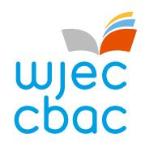

{0}------------------------------------------------

# WJEC GCSE Art and Design

Approved by Qualifications Wales

# Sample Assessment Materials

Unit 2: Externally Set Assignment Teaching from 2025 For award from 2027

Ready for the world. This Qualifications Wales regulated qualification is not available to centres in England.

Made for Wales.

{1}------------------------------------------------

{2}------------------------------------------------

## Contents

| About this pack: information for teachers  |    |
|--------------------------------------------|----|
| Managing the assessment                    |    |
| Unit 2 – Externally Set Assignment         |    |
| Part 1 (preparatory period)                | 4  |
| Part 2 (sustained focus period)            | 5  |
| What should be included in the Unit 2 ESA? | 5  |
| Submitting the ESA                         | 5  |
| Internal Standardisation                   | 6  |
| Mark Scheme                                | 7  |
| Candidate Assessment Pack                  | 12 |

{3}------------------------------------------------

## About this pack: information for teachers

This pack contains the assessment materials for Unit 2 – Externally Set Assignment.

Within this pack, you will find:

- information for teachers on how to manage arrangements for assessment
- a mark record sheet
- a **candidate pack** which includes:
  - details of the assignment
  - information for candidates, which tells candidates about things that they must and must not do when they are completing the assessment
  - the mark scheme which must be used to assess candidate work
  - a Candidate Declaration Form
  - a Candidate Time Record sheet.

### You must provide each candidate with a copy of the complete candidate assessment pack.

## Managing the assessment

This is a centre-marked (internal) non-examination assessment. The following arrangements must be followed when managing and marking the assessment.

### Supervision

Unit 2, Part 1, no controls. Work may be completed outside of the centre without direct supervision. Where no supervision is specified, candidates may normally:

- have unlimited access to electronic and printed resources
- use the internet without restriction
- work in groups.

Unit 2, Part 2, direct supervision. The use of resources is tightly prescribed to the work done in Part 1.

The centre must ensure that:

- all candidates are within direct sight of the supervisor throughout the session(s)
- display materials which might provide assistance are removed or covered
- there is no access to e-mail, the internet or mobile phones
- candidates complete their work independently
- interaction with other candidates does not occur
- no assistance of any description is provided.
- candidates' work must remain within the centre at all times and must be stored securely between timetabled sessions.

### Guidance

You should not provide input or guidance to candidates during the assessment time. This includes providing formative feedback on the evidence being produced. You can provide guidance on the requirements of the task and remind candidates of the mark bands and how they can be interpreted.

Candidates can review and redraft evidence independently within the time controls for the assessment.

{4}------------------------------------------------

### Resources

In Unit 2, Part 1 candidates will need to gather information from published sources when researching and planning their tasks.

Candidates are allowed access to the internet and any electronic and printed resources available to them during Unit 2, Part 1.

### Collaboration

Collaboration is not permitted in Unit 2.

### Time

The total time candidates are allowed to spend on Unit 2, Part 2 assessment is 10 hours.

There are no set timings for Unit 2, Part 1, but centres are encouraged to follow the suggested framework in the specification to ensure that time for learners is manageable.

### Authentication

Supervision must be in place to ensure the authenticity of evidence produced for summative assessment.

Candidates must sign the declaration to confirm that all evidence submitted for moderation is their own work and that any sources used have been acknowledged.

Assessors must sign the declaration to confirm that evidence submitted for moderation was completed under the controlled conditions set out in this assessment.

### Summary of controls

| Controls      | Unit 2 – Externally set assignment                                                                                                                                                                                                                 |
|---------------|----------------------------------------------------------------------------------------------------------------------------------------------------------------------------------------------------------------------------------------------------|
| Supervision   | Part 1 - no controls Part 2 – direct                                                                                                                                                                                                            |
| Guidance      | Not permitted – teachers cannot tell learners what intention to pursue, though teachers may support a candidate to ensure that their chosen intention is appropriate in terms of themes, practicality, access to resources and, health and safety. |
| Resources     | Part 1 - no controls Part 2 – permitted                                                                                                                                                                                                         |
| Collaboration | Not permitted                                                                                                                                                                                                                                      |
| Timing        | Part 1 - not controlled Part 2 – controlled                                                                                                                                                                                                     |

{5}------------------------------------------------

### Marking the assessment

The marking scheme for this assessment are included in the candidate pack.

All marking of evidence must be made against the marking scheme provided. Evidence marked must comply with any requirements set out in the assessment pack. Written evidence must be annotated to show how it relates to the mark band requirements. Marking should only be undertaken by a designated assessor. An assessor should have appropriate expertise in the subject and level for a specified unit. The assessor is responsible for ensuring that:

- assessment is conducted under the controls specified in the task table
- they are clear about the requirements of the assessment and marking scheme prior to commencing assessment
- evidence presented for assessment is valid, authentic; reliable and credible
- assessment decisions are accurately recorded
- evidence is appropriately annotated
- judgements are only made against the mark band statements

A mark record sheet must be completed for each candidate.

### Further information

You should refer the JCQ Instructions for conducting non-examination assessment for further information on managing assessment within our GCSE Qualifications.

**This pack is a sample. It must not be used for live assessment.**

{6}------------------------------------------------

## Unit 2 – Externally Set Assignment

### Assessment details

### Unit 2: Externally Set Assignment

Non-examination assessment **40% of qualification 80 marks**

80 marks

The externally set assignment will be set by WJEC, marked by centres and moderated by WJEC.

### Overview of unit

The Unit 2 Externally Set Assignment (ESA) builds on the knowledge, understanding and skills used and developed in Unit 1.

The ESA has two parts. The centre must monitor the learners' work throughout both parts of the ESA to ensure that work is entirely their own.

## Part 1 (preparatory period)

In Part 1 (the preparatory period) the learner is presented with five big ideas set by WJEC. The ESA will be released to centres via in a digital format on Portal on December 1 in the final year of study. This will give teachers/assessors the opportunity to plan and prepare only.

The ESA must then be presented to learners during the spring term of the final year of study. Learners should choose one of the big ideas. They may use any of the stimuli in the chosen big idea. The preparatory work during this period must be used to inform the personal response produced in Part 2.

The duration of the preparatory period is determined by the centre. During this period learners will need to research, plan and develop preparatory work from one of the big ideas relevant to their chosen pathway. Teachers must not tell learners what intention to pursue, though teachers may support a candidate to ensure that their chosen intention is appropriate in terms of themes, practicality, access to resources and, health and safety.

It is important that the learner selects their work carefully at the end of the preparatory period, which should then be stored securely, as this is the only work they can use to support Part 2. Work cannot be amended after Part 2 begins.

{7}------------------------------------------------

### Part 2 (sustained focus period)

In Part 2 (sustained focus period) the learner has 10 hours in supervised time to produce a personal response. The supervised time must start with at least a consecutive two-hour session.

The learner must not access any of their work outside of the designated sustained focus work sessions. No additional work can be added during the supervised sessions.

All selected work for the unit, from both Part 1 and Part 2, must be submitted for the assessment. Learners should ensure that their submission clearly covers all four assessment objectives.

As in Unit 1, learners must identify and acknowledge any sources that are not their own.

## What should be included in the Unit 2 ESA?

The following needs to be taken into consideration when developing the ESA:

- the work submitted from Part 1 and Part 2 must contain evidence of how the learner has met each of the assessment objectives
- the learner must complete the final response during Part 2 (sustained focus period)
- annotating their work will help learners meet elements of the assessment objectives
- work must be selected and presented for assessment by the learner.

## Submitting the ESA

- The outcome does not have to be a finished piece of work but there should be enough completed to demonstrate the learner's ability to take the assignment through to a resolved conclusion.
- Each piece of work must be clearly identified with centre and candidate names and numbers. The work produced during the sustained focus period must be identified in the submission.
- If a learner is entered for more than one pathway, they must undertake a different assignment for each one.
- Using the *Candidate Declaration Form* the learner should declare that their work was completed independently and without any assistance beyond what should be permitted. They should clearly reference any sources and any Artificial Intelligence tools used in the work. The learner should understand that a false declaration should be considered a form of malpractice. All work should be their own, except for any non-original material that should be clearly credited in the form. This work should not be submitted for any other qualification.

{8}------------------------------------------------

## Internal Standardisation

Centres should ensure consistency in marking across all pathways and teaching groups. This helps maintain a uniform understanding and application of the marking criteria. Centres must carry out internal standardisation to make sure that the marks given by different teachers are accurate and consistent for all learners taking the unit/qualification. The WJEC website will include exemplar material to support standardisation.

| Controls      | Unit 2 – Externally set assignment                                                                                                                                                                                                                 |
|---------------|----------------------------------------------------------------------------------------------------------------------------------------------------------------------------------------------------------------------------------------------------|
| Supervision   | Part 1 - no controls Part 2 - direct                                                                                                                                                                                                            |
| Guidance      | Not permitted – teachers cannot tell learners what intention to pursue, though teachers may support a candidate to ensure that their chosen intention is appropriate in terms of themes, practicality, access to resources and, health and safety. |
| Resources     | Part 1 - no controls Part 2 - permitted                                                                                                                                                                                                         |
| Collaboration | Not permitted                                                                                                                                                                                                                                      |
| Timing        | Part 1 - not controlled Part 2 - controlled                                                                                                                                                                                                     |

{9}------------------------------------------------

### Mark Scheme

### Guidance for Assessors

### Generic marking principles

- Marks awarded are always whole marks (not half marks, or other fractions).
- Marks should be awarded using the full range of marks defined in the mark scheme for the question (however; the use of the full mark range may be limited according to the quality of the candidate responses seen).
- Marks awarded are based solely on the requirements as defined in the mark scheme. Marks should not be awarded with grade thresholds or grade descriptors in mind.

### Positive marking

It should be remembered that candidates are producing responses under high control conditions and credit should be given for what the candidate produces, rather than adopting the approach of penalising candidates for any omissions. It should be possible for a very good response to achieve full marks and a very poor one to achieve zero marks. Marks should not be deducted for a less than perfect response if it satisfies the criteria of the mark scheme.

### Banded mark schemes

To reach the highest level of the mark scheme a candidate must meet the requirements of the highest mark band. Where a response is not creditworthy, that is, it contains nothing of any significance to the mark scheme, or where no response has been provided, no marks should be awarded.

Marking should always be positive. This means that, for each candidate's response, marks are accumulated for the demonstration of relevant skills, knowledge and understanding: they are not deducted from a maximum on the basis of errors or omissions.

An assessor should first look at and make notes about the candidate's response holistically to pick out the evidence that is being assessed. The mark scheme can then be applied. This is done as a two-stage process.

### Stage 1 – Deciding on the band

Beginning at the lowest band, Assessors should look at the candidate's response and check whether it matches the descriptors for that band. If the descriptors at the lowest band are satisfied, Assessors should move up to the next band and repeat this process for each band until the descriptors most closely match the work.

### Stage 2 – Deciding on the mark

Having determined the appropriate band, deciding on the mark within a band will be made on the basis of a 'best fit' procedure, weaknesses in some areas being compensated for by strengths in others.

{10}------------------------------------------------

Assessors should use the full range of marks available to them. The awarding of marks must be directly related to the marking criteria, and all responses must be marked according to the banded levels provided.

Standardising material that has already been awarded a mark will be provided during standardising and this should be used as a reference material when assessing work. Assessors are reminded of the need to revisit the standardising material as they apply the mark scheme in order to confirm that the band and the mark allocated is appropriate to the work submitted.

Candidates are free to choose any approach that is relevant to the set task.

{11}------------------------------------------------

| Mark Scheme for GCSE ART AND DESIGN                                                                                                  |                                                                                                                                                                                                                                                 |                                                                                                                                                                                                                                                                                                                                                                                               |                                                                                                                                                                                                                                                                                              |                                                                                                                                                                                                                                                                                                           |
|--------------------------------------------------------------------------------------------------------------------------------------|-------------------------------------------------------------------------------------------------------------------------------------------------------------------------------------------------------------------------------------------------|-----------------------------------------------------------------------------------------------------------------------------------------------------------------------------------------------------------------------------------------------------------------------------------------------------------------------------------------------------------------------------------------------|----------------------------------------------------------------------------------------------------------------------------------------------------------------------------------------------------------------------------------------------------------------------------------------------|-----------------------------------------------------------------------------------------------------------------------------------------------------------------------------------------------------------------------------------------------------------------------------------------------------------|
| Unit Two: Externally Set Assignment (Total Marks = 80)                                                                               |                                                                                                                                                                                                                                                 |                                                                                                                                                                                                                                                                                                                                                                                               |                                                                                                                                                                                                                                                                                              |                                                                                                                                                                                                                                                                                                           |
| Band                                                                                                                                 | AO1                                                                                                                                                                                                                                             | AO2                                                                                                                                                                                                                                                                                                                                                                                           | AO3                                                                                                                                                                                                                                                                                          | AO4                                                                                                                                                                                                                                                                                                       |
|                                                                                                                                      | Develop ideas and demonstrate critical and contextual understanding of sources                                                                                                                                                                  | Refine work by exploring ideas, selecting and experimenting with appropriate media, techniques, tools, digital technologies, and processes                                                                                                                                                                                                                                                    | Reflect on own work, and record ideas, observations and insights relevant to intentions as work progresses                                                                                                                                                                                   | Present a personal and meaningful response that realises intentions and demonstrates understanding of visual language                                                                                                                                                                                     |
| 5                                                                                                                                    | 17-20 marks                                                                                                                                                                                                                                     | 17-20 marks                                                                                                                                                                                                                                                                                                                                                                                   | 17-20 marks                                                                                                                                                                                                                                                                                  | 17-20 marks                                                                                                                                                                                                                                                                                               |
|                                                                                                                                      | Sophisticated and thorough development of ideas through sustained, focused and coherent investigations. Perceptive and rigorous critical analysis of sources, providing the basis for assured, independent responses.                        | Ideas are refined and explored through rigorous selection and purposeful, creative experimentation. Perceptive and sophisticated use of media, materials, techniques and processes that are skilfully controlled and imaginatively exploited. Perceptive and discriminating ongoing review and evaluation consistently informs the refinement and development of work as it progresses. | Sophisticated recording of ideas, observations and insights through extensive, coherent research and enquiry that is highly relevant to personal intentions. Perceptive, rigorous and effective critical reflection as work progresses, demonstrating depth of understanding and meaning. | Highly imaginative, personal and meaningful response which realises intentions in a sophisticated, coherent and assured manner. The presentation shows a perceptive and thorough understanding of visual language and the purpose and intention of the work is very clearly and convincingly conveyed. |
| 4                                                                                                                                    | 13-16 marks                                                                                                                                                                                                                                     | 13-16 marks                                                                                                                                                                                                                                                                                                                                                                                   | 13-16 marks                                                                                                                                                                                                                                                                                  | 13-16 marks                                                                                                                                                                                                                                                                                               |
|                                                                                                                                      | Effective and thorough development of ideas through sustained and focused investigations. Confident and rigorous critical analysis of sources, providing the basis for purposeful, independent responses.                                    | Ideas are refined and explored through relevant selection and creative experimentation. Effective use of media, materials, techniques and processes are that confidently controlled and exploited. Effective and thorough ongoing review and evaluation informs the refinement and development of work as it progresses.                                                                | Confident recording of ideas, observations and insights by appropriate means through effective research and enquiry that is relevant to personal intentions. Rigorous and effective critical reflection as work progresses, demonstrating a good level of understanding and meaning.      | Imaginative, personal and meaningful response which realises intentions in a confident and effective manner. The presentation shows a good understanding of visual language and the purpose and intention of the work is clearly and convincingly conveyed.                                            |
| 3                                                                                                                                    | 9-12 marks                                                                                                                                                                                                                                      |                                                                                                                                                                                                                                                                                                                                                                                               |                                                                                                                                                                                                                                                                                              |                                                                                                                                                                                                                                                                                                           |
| Reasonable development of ideas through investigations which are generally sustained.                                                | Ideas are refined and explored through relevant selection and experimentation.                                                                                                                                                                  | Reasonable recording of ideas, observations and insights by appropriate means through research and enquiry that is generally relevant to personal intentions.                                                                                                                                                                                                                                 | Reasonably critical reflection on work as it progresses, generally demonstrating understanding and meaning.                                                                                                                                                                                  | Reasonably imaginative personal and meaningful response which realises intentions in a satisfactory manner. The presentation shows a reasonable understanding of visual language and the purpose and intention of the work is reasonably conveyed.                                                        |
| 2                                                                                                                                    | 5-8 marks                                                                                                                                                                                                                                       |                                                                                                                                                                                                                                                                                                                                                                                               |                                                                                                                                                                                                                                                                                              |                                                                                                                                                                                                                                                                                                           |
| Some development of ideas through partially sustained investigations. Some analysis of sources, partially informing basic responses. | Ideas are partially refined and explored through selection and experimentation. Some attempt to control and exploit media, materials, techniques and processes. Some ongoing review and evaluation partially informs the work as it progresses. | Basic recording of ideas, observations and insights by appropriate means through research and enquiry that is sometimes relevant to personal intentions. Some reflection on work as it progresses, which sometimes demonstrates understanding and meaning.                                                                                                                                    | The response is to some extent, personal and meaningful and intentions are realised in a basic manner. The presentation shows some understanding of visual language and the purpose and intention of the work is conveyed in a partly convincing way.                                        |                                                                                                                                                                                                                                                                                                           |

{12}------------------------------------------------

{13}------------------------------------------------

| 1 | 1–4 marks                                                                        | 1–4 marks                                                                                                                                                                                  | 1–4 marks                                                                                                                                                           | 1–4 marks                                                                                                                                        |
|---|----------------------------------------------------------------------------------|--------------------------------------------------------------------------------------------------------------------------------------------------------------------------------------------|---------------------------------------------------------------------------------------------------------------------------------------------------------------------|--------------------------------------------------------------------------------------------------------------------------------------------------|
|   | Limited development of ideas through investigations.                          | Limited refinement and exploration of ideas.                                                                                                                                            | Limited recording of ideas, observations and insights by appropriate means through research and enquiry that has limited relevance to personal intentions. | A limited personal response, with minimal attempts to show meaning, and which realises intentions in a limited manner.                     |
|   | Limited analysis of sources which have had minimal influence on responses. | Limited attempt to control and exploit media, materials, techniques and processes. Limited ongoing review and evaluation, with minimal impact on the work as it progresses. | Limited reflection on work as it progresses, which demonstrates limited understanding and meaning.                                                            | The presentation shows limited understanding of visual language and the purpose and intention of the work is conveyed in a limited way. |
| 0 | 0 marks                                                                          | 0 marks                                                                                                                                                                                    | 0 marks                                                                                                                                                             | 0 marks                                                                                                                                          |
|   | Response not worthy of credit or not attempted.                               | Response not worthy of credit or not attempted.                                                                                                                                         | Response not worthy of credit or not attempted.                                                                                                                  | Response not worthy of credit or not attempted.                                                                                               |

{14}------------------------------------------------

# WJEC Art and Design

# Candidate Assessment Pack

Unit 2: Externally Set Assignment

Art, Craft and Design **(3610QSL-2)** Fine Art **(3611QSL-2)** Textile Design **(3612QSL-2)**  Graphic Communication **(3613QSL-2)** Three-Dimensional Design **(3614QSL-2)**  Photography **(3615QSL-2)** 

{15}------------------------------------------------

## About this pack: information and instructions for candidates

This candidate assessment pack is for candidates completing Unit 2 – Externally Set Assignment.

Within this pack, you will find details of:

- what you should include in your work
- information for candidates, which tells you about things that you must and must not do when you are completing the assessment
- the mark scheme which will be used to assess your work
- a Candidate Declaration Form
- a Time Record sheet.

Your teacher is allowed to help you to understand the assessment requirements, but there are rules about the kind of help and how much they can give you. You should speak to your teacher if you have any questions about what you are and are not allowed to do as you are completing the tasks, as they will know how much help they are allowed to give you.

It is important that you work independently from other candidates and the work produced should be your own unaided work. You and your teacher will be required to sign a declaration that all work presented is your own work.

You are advised to check your work carefully to make sure that it is accurate and correct.

## What is the Unit 2 Externally Set Assignment (ESA)?

The Unit 2 Externally Set Assignment (ESA) builds on the knowledge, understanding and skills that you have developed through the qualification and in Unit 1.

The ESA has two parts. You should speak to your teacher if you have any questions about what you are and are not allowed to do as you are completing the portfolio, as they will know how much help they are allowed to give you.

It is important that you work independently from other candidates and the work produced must be your own unaided work. You and your teacher will be required to sign a declaration that all work presented is your own work.

## Part 1 (preparatory period)

In Part 1 (the preparatory period) you will be presented with five big ideas set by WJEC. You should choose one of the big ideas. You may use any of the stimuli as a prompt to respond to your chosen big idea if you wish. The preparatory work during this period must be used to inform the outcome produced in Part 2. Any work produced during the preparatory period cannot be amended after Part 2 begins.

The duration of the preparatory period is determined by the centre.

You will need to produce preparatory work relevant to your chosen pathway.

{16}------------------------------------------------

### Part 2 (sustained focus period)

In Part 2 (sustained focus period) you will have 10 hours of supervised time to produce an outcome. The supervised time must start with at least a consecutive two-hour session.

You cannot access any of your work outside the designated sustained focus work sessions.

### What should be included in the Unit 2 ESA?

The following needs to be taken into consideration when developing the ESA:

- · Work must be selected and presented for assessment by you, the learner
- You must complete your outcome during Part 2 (sustained focus period)
- You must annotate your work. This will help you meet elements of the assessment objectives
- The work submitted must contain evidence of how you have met each of the assessment objectives below.

The guidance in the graphic below will outlines what your work should include.

{17}------------------------------------------------

### Submitting the Portfolio

- The outcome does not have to be a finished piece of work but there should be enough completed to demonstrate your ability to take the assignment through to a resolved conclusion.
- Each piece of work must be clearly identified with your centre and candidate names and numbers. The work produced during the sustained focus period must be identified in the submission.
- If you are entered for more than one title you must undertake a different assignment for each one.
- Using the *Candidate Declaration Form* you should declare that the work was completed independently and without any assistance beyond what should be permitted. You should clearly reference any sources and any Artificial Intelligence tools used in the work. A false declaration should be considered a form of malpractice. All work must be your own, except for any non-original material that should be clearly credited in the form. This work should not be submitted for any other qualification.

{18}------------------------------------------------

### Information for candidates

The following information has been taken from the [JCQ Information for candidates –](https://www.jcq.org.uk/wp-content/uploads/2021/08/IFC-NE_Assessments_2021_v4.pdf) non[examination assessments](https://www.jcq.org.uk/wp-content/uploads/2021/08/IFC-NE_Assessments_2021_v4.pdf) and the [JCQ Artificial Intelligence \(AI\) Use in Assessments:](https://www.jcq.org.uk/exams-office/malpractice/artificial-intelligence/)  [Protecting the Integrity of Qualifications.](https://www.jcq.org.uk/exams-office/malpractice/artificial-intelligence/) This tells you about things that you **must** and **must not** do when you are completing your assessment. If there is anything that you do not understand, you **must** ask your teacher.

#### Preparing your work

- When you submit your work and sign your candidate declaration form, you need to ensure that your final product reflects your own independent work and isn't copied or paraphrased from another source such as an AI tool.
- If you receive help and guidance from someone other than your teacher, you **must** tell your teacher who will then record the nature of the assistance given to you.
- If you worked as part of a group on a task, you **must** each write up your own account of the assignment. Even if the data you have is the same, you **must** describe in your own words how that data was obtained, and you **must** independently draw your own conclusions from the data.
- Take care of your work and keep it safe. **Do not** leave it lying around where your classmates can find it or share it with anyone, including posting it on social media. You **must** always keep your work secure and confidential whilst you are preparing it; **do not** share it with your classmates. If it is stored on the computer network, keep your password secure. Collect all copies from the printer and destroy those you do not need.
- **Do not** be tempted to use pre-prepared online solutions (such as those produced by AI tools and chatbots) – this is cheating. Electronic tools used by WJEC can detect this sort of copying.
- You **must not** write inappropriate, offensive or obscene material.

#### Plagiarism

Plagiarism involves taking someone else's words, thoughts or ideas and trying to pass them off as your own. **It is a form of cheating which is taken very seriously.** Don't think you won't be caught; there are many ways to detect plagiarism:

- Markers can spot changes in the style of writing and use of language.
- Markers are highly experienced subject specialists they may have read the source you are using, or even marked the work you have copied from!
- Internet search engines and specialised computer software can be used to match phrases or pieces of text with original sources and to detect changes in the grammar and style of writing or punctuation.

#### Penalties for breaking the regulations

If it is discovered that you have broken the regulations, one of the following penalties will be applied:

- the piece of work will be awarded zero marks
- you will be disqualified from that unit for the assessment series in question
- you will be disqualified from the whole subject for that assessment series
- you will be disqualified from all subjects and barred from entering again for a period of time.

WJEC will decide which penalty is appropriate.

**Remember – it's your qualification so it needs to be your own work.**

{19}------------------------------------------------

## GCSE Art and Design

## GCSE Art and Design – Unit 2 Externally Set Assignment

## SAMPLE ASSESSMENT MATERIALS

#### Part 1: PREPARATORY STUDY PERIOD

Time allocated to be determined by the centre.

#### Part 2: SUSTAINED FOCUS WORK 10 hours under supervised examination conditions.

Both Part 1 and Part 2 of the assignment must be submitted for assessment.

#### Additional materials

• Appropriate Art, Craft and Design Materials

#### Instructions to candidates

- This paper contains 5 big ideas. Choose ONE big idea only. You may use any of the stimuli from the big idea to inform your work. You should produce a response demonstrating development, refinement, reflection and presentation.
- The 5 big ideas cover the following pathways:

Art, Craft & Design Fine Art Graphic Communication Textile Design Three-Dimensional Design Photography.

{20}------------------------------------------------

## 1. Big Idea – Habitat

#### HABITAT

**A habitat is a natural home or environment of an animal, plant, or other [organism.](https://www.google.com/search?safe=active&sca_esv=6182fbdd58dbe34a&rlz=1C1GCEU_en-GBGB921GB929&q=organism&si=ACC90nwZKElgOcNXBU934ENhMNgqFByXnAmb40hQi8sJ_4Q7KS59YpdO92tg6yW9suQSkkpmXwQ49KVCvl7SO1AWkACmtfD4ot5PEdHFhAHTulbI_P_3d0w%3D&expnd=1&sa=X&ved=2ahUKEwir5rHy7fSGAxXvWkEAHZdXB2MQyecJegQIEBAO) A habitat can be diverse, offering unique features and supporting different forms of life**. **The main components of a habitat are shelter, water, food, and space**. **What does it mean to you?**

The following five threads are designed to help you explore and develop your own ideas based on the concept of Habitat.

The following visuals are prompts to help you to explore and develop your own ideas based on the concept of Habitat.

WJEC GCSE Art and Design Unit 2 – Externally set assignment

{21}------------------------------------------------

The following written brief is to help you to explore and develop your own ideas in a specific direction.

#### Written Brief A local character

Communities often have key individuals who, through their actions and attitudes, help support groups and encourage people to work together to improve the local environment. From your research, create a personal response that reflects your chosen character and their achievements.

#### Contextual References • Efa Lois

- Sirkka-Liisa Konttinen
- Neville Brody
- Grayson Perry
- The Singh Twins

{22}------------------------------------------------

## 2. Big Idea – Collections

**A collection means a group of objects, or an amount of material accumulated in one location, especially for some purpose or as a result of some purpose.**

The following five threads are designed to help you explore and develop your own ideas based on the concept of Collections.

The following visuals are prompts to help you to explore and develop your own ideas based on the concept of Collections.

{23}------------------------------------------------

The following written brief is to help you to explore and develop your own ideas in a specific direction.

**Written Brief**

#### Written Brief A museum collection

Investigate a local exhibition, gallery, or museum that you are familiar with and use this information to produce a creative response using materials of your choice.

#### Contextual References • Lisa Milroy

- Wayne Thiebaud
- Lee John Phillips
- El Anatsui
- Nick Cave

{24}------------------------------------------------

## 3. Big Idea - Structures

**A structure is something of many parts that is put together.**

The following five threads are designed to help you explore and develop your own ideas based on the concept of x

The following visuals are prompts to help you to explore and develop your own ideas based on the concept of x

{25}------------------------------------------------

The following written brief is to help you to explore and develop your own ideas in a specific direction.

#### Written Brief Celebrate a structure

Investigate a structure which is important to you and from your investigations produce a personal response which celebrates its history and purpose.

#### Contextual References • Andrea Joseph

- Richard Estes
- Ian Murphy
- Harriet Popham
- Sally Blake

{26}------------------------------------------------

## 4. Big Idea - Belonging

**Belonging is a feeling of being happy or comfortable as part of a particular group or having an affinity for a place or situation***.*

The following five threads are designed to help you explore and develop your own ideas based on the concept of Belonging.

The following visuals are prompts to help you to explore and develop your own ideas based on the concept of Belonging.

{27}------------------------------------------------

The following written brief is to help you to explore and develop your own ideas in a specific direction.

#### Written Brief A community event

Research a community event, such as a carnival, an eisteddfod, a music festival, or a pride rally, and celebrate the occasion by creating a personal response which reflects its atmosphere and ideals.

#### Contextual References • Alfred Conteh

- Lubaina Himid
- Andrew Mashigo
- Irene Hoff
- L.S. Lowry

{28}------------------------------------------------

## 5. Big Idea - Perspective

**Perspective can be how objects are represented, such as angle, depth or dimension. It can also mean a point of view or attitude of a person or group.**

The following five threads are designed to help you explore and develop your own ideas based on the concept of x

The following visuals are prompts to help you to explore and develop your own ideas based on the concept of Perspective

{29}------------------------------------------------

The following written brief is to help you to explore and develop your own ideas in a specific direction.

#### Written Brief Changing Perspective

How could you change the perspective of an individual or group for positive change. Develop work in response to changing perspectives.

#### Contextual References • Andreas Gursky

- Lorna Simpson
- Giorgio de Chirico
- Issy Miyake
- Banksy

{30}------------------------------------------------

| Mark Scheme for GCSE ART AND DESIGN Unit Two: Externally Set Assignment (Total Marks = 80) |                                                                                                                                                                                                                                            |                                                                                                                                                                                                                                                                                                                                                                                                                       |                                                                                                                                                                                                                                                                                                                   |                                                                                                                                                                                                                                                                                                                                |
|-----------------------------------------------------------------------------------------------|--------------------------------------------------------------------------------------------------------------------------------------------------------------------------------------------------------------------------------------------|-----------------------------------------------------------------------------------------------------------------------------------------------------------------------------------------------------------------------------------------------------------------------------------------------------------------------------------------------------------------------------------------------------------------------|-------------------------------------------------------------------------------------------------------------------------------------------------------------------------------------------------------------------------------------------------------------------------------------------------------------------|--------------------------------------------------------------------------------------------------------------------------------------------------------------------------------------------------------------------------------------------------------------------------------------------------------------------------------|
| Band                                                                                          | AO1                                                                                                                                                                                                                                        | AO2                                                                                                                                                                                                                                                                                                                                                                                                                   | AO3                                                                                                                                                                                                                                                                                                               | AO4                                                                                                                                                                                                                                                                                                                            |
|                                                                                               | Develop ideas and demonstrate critical and contextual understanding of sources                                                                                                                                                       | Refine work by exploring ideas, selecting and experimenting with appropriate media, techniques, tools, digital technologies, and processes                                                                                                                                                                                                                                                                | Reflect on own work, and record ideas, observations and insights relevant to intentions as work progresses                                                                                                                                                                                               | Present a personal and meaningful response that realises intentions and demonstrates understanding of visual language                                                                                                                                                                                                 |
| 5                                                                                             | 17-20 marks                                                                                                                                                                                                                                | 17-20 marks                                                                                                                                                                                                                                                                                                                                                                                                           | 17-20 marks                                                                                                                                                                                                                                                                                                       | 17-20 marks                                                                                                                                                                                                                                                                                                                    |
|                                                                                               | Sophisticated and thorough development of ideas through sustained, focused and coherent investigations. Perceptive and rigorous critical analysis of sources, providing the basis for assured, independent responses. | Ideas are refined and explored through rigorous selection and purposeful, creative experimentation. Perceptive and sophisticated use of media, materials, techniques and processes that are skilfully controlled and imaginatively exploited. Perceptive and discriminating ongoing review and evaluation consistently informs the refinement and development of work as it progresses. | Sophisticated recording of ideas, observations and insights through extensive, coherent research and enquiry that is highly relevant to personal intentions. Perceptive, rigorous and effective critical reflection as work progresses, demonstrating depth of understanding and meaning. | Highly imaginative, personal and meaningful response which realises intentions in a sophisticated, coherent and assured manner. The presentation shows a perceptive and thorough understanding of visual language and the purpose and intention of the work is very clearly and convincingly conveyed. |
| 4                                                                                             | 13-16 marks                                                                                                                                                                                                                                | 13-16 marks                                                                                                                                                                                                                                                                                                                                                                                                           | 13-16 marks                                                                                                                                                                                                                                                                                                       | 13-16 marks                                                                                                                                                                                                                                                                                                                    |
|                                                                                               | Effective and thorough development of ideas through sustained and focused investigations. Confident and rigorous critical analysis of sources, providing the basis for purposeful, independent responses.                   | Ideas are refined and explored through relevant selection and creative experimentation. Effective use of media, materials, techniques and processes are that confidently controlled and exploited. Effective and thorough ongoing review and evaluation informs the refinement and development of work as it progresses.                                                                   | Confident recording of ideas, observations and insights by appropriate means through effective research and enquiry that is relevant to personal intentions. Rigorous and effective critical reflection as work progresses, demonstrating a good level of understanding and meaning.      | Imaginative, personal and meaningful response which realises intentions in a confident and effective manner. The presentation shows a good understanding of visual language and the purpose and intention of the work is clearly and convincingly conveyed.                                                  |
| 3                                                                                             | 9-12 marks                                                                                                                                                                                                                                 | 9-12 marks                                                                                                                                                                                                                                                                                                                                                                                                            | 9-12 marks                                                                                                                                                                                                                                                                                                        | 9-12 marks                                                                                                                                                                                                                                                                                                                     |
|                                                                                               | Reasonable development of ideas through investigations which are generally sustained. Reasonable critical analysis of sources, providing the basis for satisfactory and generally independent responses.                                | Ideas are refined and explored through relevant selection and experimentation. Appropriate use of media, materials, techniques and processes are reasonably controlled and exploited. Reasonable ongoing review and evaluation of explorations supports the refinement and development of work as it progresses.                                                                                                | Reasonable recording of ideas, observations and insights by appropriate means through research and enquiry that is generally relevant to personal intentions. Reasonably critical reflection on work as it progresses, generally demonstrating understanding and meaning.                                      | Reasonably imaginative personal and meaningful response which realises intentions in a satisfactory manner. The presentation shows a reasonable understanding of visual language and the purpose and intention of the work is reasonably conveyed.                                                                          |
| 2                                                                                             | 5-8 marks                                                                                                                                                                                                                                  | 5-8 marks                                                                                                                                                                                                                                                                                                                                                                                                             | 5-8 marks                                                                                                                                                                                                                                                                                                         | 5-8 marks                                                                                                                                                                                                                                                                                                                      |
|                                                                                               | Some development of ideas through partially sustained investigations. Some analysis of sources, partially informing basic responses.                                                                                                    | Ideas are partially refined and explored through selection and experimentation. Some attempt to control and exploit media, materials, techniques and processes. Some ongoing review and evaluation partially informs the work as it progresses.                                                                                                                                                                 | Basic recording of ideas, observations and insights by appropriate means through research and enquiry that is sometimes relevant to personal intentions. Some reflection on work as it progresses, which sometimes demonstrates understanding and meaning.                                                     | The response is to some extent, personal and meaningful and intentions are realised in a basic manner. The presentation shows some understanding of visual language and the purpose and intention of the work is conveyed in a partly convincing way.                                                                       |

{31}------------------------------------------------

{32}------------------------------------------------

| 1 | 1–4 marks                                                                        | 1–4 marks                                                                                                                                                                                  | 1–4 marks                                                                                                                                                           | 1–4 marks                                                                                                                                        |
|---|----------------------------------------------------------------------------------|--------------------------------------------------------------------------------------------------------------------------------------------------------------------------------------------|---------------------------------------------------------------------------------------------------------------------------------------------------------------------|--------------------------------------------------------------------------------------------------------------------------------------------------|
|   | Limited development of ideas through investigations.                          | Limited refinement and exploration of ideas.                                                                                                                                            | Limited recording of ideas, observations and insights by appropriate means through research and enquiry that has limited relevance to personal intentions. | A limited personal response, with minimal attempts to show meaning, and which realises intentions in a limited manner.                     |
|   | Limited analysis of sources which have had minimal influence on responses. | Limited attempt to control and exploit media, materials, techniques and processes. Limited ongoing review and evaluation, with minimal impact on the work as it progresses. | Limited reflection on work as it progresses, which demonstrates limited understanding and meaning.                                                            | The presentation shows limited understanding of visual language and the purpose and intention of the work is conveyed in a limited way. |
| 0 | 0 marks                                                                          | 0 marks                                                                                                                                                                                    | 0 marks                                                                                                                                                             | 0 marks                                                                                                                                          |
|   | Response not worthy of credit or not attempted.                               | Response not worthy of credit or not attempted.                                                                                                                                         | Response not worthy of credit or not attempted.                                                                                                                  | Response not worthy of credit or not attempted.                                                                                               |

{33}------------------------------------------------

### Candidate Declaration Form

#### You must complete Part A and Part B of this form

| Centre No:                                                                                                                                                                                                                                                                                                                                                                                                                                                     |  |  |  |  | Centre Name:                                                                                                                         |  |  |  |  |
|----------------------------------------------------------------------------------------------------------------------------------------------------------------------------------------------------------------------------------------------------------------------------------------------------------------------------------------------------------------------------------------------------------------------------------------------------------------|--|--|--|--|--------------------------------------------------------------------------------------------------------------------------------------|--|--|--|--|
| Candidate No:                                                                                                                                                                                                                                                                                                                                                                                                                                                  |  |  |  |  | Candidate Name:                                                                                                                      |  |  |  |  |
| Unit Title:                                                                                                                                                                                                                                                                                                                                                                                                                                                    |  |  |  |  |                                                                                                                                      |  |  |  |  |
| <b>Part A: Candidate Declaration</b>                                                                                                                                                                                                                                                                                                                                                                                                                           |  |  |  |  |                                                                                                                                      |  |  |  |  |
| <b>References:</b> Give details of the exact source of any non-original material used in the assignment.                                                                                                                                                                                                                                                                                                                                                       |  |  |  |  | <b>List of software packages/AI tools/chatbots1:</b> Give brief details of how these have been used in the assignment. |  |  |  |  |
|                                                                                                                                                                                                                                                                                                                                                                                                                                                                |  |  |  |  |                                                                                                                                      |  |  |  |  |
| <b>Authentication Declaration</b> I declare that my work was completed independently and without any assistance beyond that which was permitted. All work is my own, except for any non-original material clearly credited above. This work has not been submitted for any other qualification. I have clearly referenced any sources and any Artificial Intelligence tools used in the work. I understand that false declaration is a form of malpractice. |  |  |  |  |                                                                                                                                      |  |  |  |  |
| Candidate Signature:                                                                                                                                                                                                                                                                                                                                                                                                                                           |  |  |  |  | Date:                                                                                                                                |  |  |  |  |

1 Where you have used AI tools as a source of information, you must show the name of the AI source used and the date the content was generated. For example: ChatGPT 3.5 [\(https://openai.com/blog/chatgpt/\)](https://openai.com/blog/chatgpt/), 25/01/2023. You must, retain a copy of the question(s) and computer-generated content for reference and authentication purposes, in a noneditable format (such as a screenshot) and provide a brief explanation of how it has been used. This must be submitted with your work, so your teacher/assessor is able to review the work, the AI-generated content and how it has been used.

{34}------------------------------------------------

#### Part B: GDPR Consent

- WJEC may select your work for use at teacher training events and subsequently upload it onto WJEC's secure website (accessible only to teachers via a secure login). Your name would be removed from your work before we use it. All materials are reviewed regularly and are removed when no longer relevant to our qualifications.
- WJEC may select your work for use in teaching and learning resources published on the WJEC public website. Your name would be removed from your work before we use it. All materials are reviewed regularly and are removed when no longer relevant to our qualifications.
- You understand that this agreement may be terminated at any time through written request2 [.](#page-34-0)
- For further details about how we process your data please read WJEC's [privacy notice.](http://www.eduqas.co.uk/home/privacy-policy/)

If you prefer that WJEC does not use your work in this way, please tick here: 

SAMPLE2 You must be over 13 to provide consent. You may withdraw your consent at any time by contacting WJEC on [qualifications@wjec.co.uk.](mailto:qualifications@wjec.co.uk) Please include the title of the work, the year of assessment, centre name and number, candidate name and the unit title in the communication. The work will then be removed from the secure website.

{35}------------------------------------------------

## Candidate Time Record Sheet

**(for centre use for Unit 2 Part B)**

| Centre No:      |                                                                  |  |
|-----------------|------------------------------------------------------------------|--|
| Centre Name:    |                                                                  |  |
| Candidate No:   |                                                                  |  |
| Candidate Name: |                                                                  |  |
| Unit Name:      | GCSE Art and Design, Unit 2 – Externally Set Assignment, Part B. |  |

The timed, supervised hours took place as follows:

| Tasks | Dates |    | Time |            |
|-------|-------|----|------|------------|
| DD    | MM    | YY | Hour | Minutes    |
|       |       |    |      |            |
|       |       |    |      |            |
|       |       |    |      |            |
|       |       |    |      |            |
|       |       |    |      |            |
|       |       |    |      |            |
|       |       |    |      |            |
|       |       |    |      |            |
|       |       |    |      |            |
|       |       |    |      |            |
|       |       |    |      |            |
| Total |       |    |      | (10 hours) |

{36}------------------------------------------------

#### End of Candidate Assessment Pack

