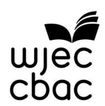

{1}------------------------------------------------

# WJEC GCSE English Language and Literature (Single and Double Award)

Approved by Qualifications Wales

Sample Assessment Materials

Unit 3: Influence and Power

Ready for the world. This Qualifications Wales regulated qualification is not available to centres in England.

Made for Wales.

{2}------------------------------------------------

{3}------------------------------------------------

## Contents

| Task A                                                                          | 2  |
|---------------------------------------------------------------------------------|----|
| Task B                                                                          | 5  |
| Mark scheme                                                                     | 10 |
| Mapping of questions to specification content and assessment objectives: Unit 3 | 15 |
| Observation Record                                                              | 16 |
| Candidate Mark Record Sheet                                                     | 17 |
| Candidate Assessment Pack (3750U3)                                              | 18 |
| Copyright                                                                       |    |
| © WJEC CBAC Limited 2025.                                                       |    |

{4}------------------------------------------------

# SUMMARY OF AMENDMENTS

| Version | Description                                                                      | Page number |
|---------|----------------------------------------------------------------------------------|-------------|
| 2       | First paragraph on page 3 inserted to provide additional teacher instructions | 4           |

{5}------------------------------------------------

## Task A

### Overview

Task A is a group discussion of 6-10 minutes. For the purposes of this task, a group must consist of 3-4 learners.

Centres must make an audio-visual recording of all group discussions.

The total time learners are allowed to spend on the research and planning stage is **3 hours.**

The total time learners are allowed to spend on the task-taking stage is **6-10 minutes.**

Marks available: **32**

### The task

WJEC will provide a choice from two selected themes as the discussion stimuli for this task, along with one prescribed text to be used in the discussion for each selection. These will be published in April for assessment in the following academic year. The same task will remain for two years. Centres are required to ensure they use the correct task for each series. Centres have the flexibility to decide when during the year learners undertake the task.

To stimulate the discussion and provide evidence for the learner's argument/counterargument. Centres must ensure the following are used:

- one text from the anthology prescribed by WJEC for the chosen theme
- one further text from the anthology must be used
- at least one of the texts referenced in the discussion must be non-continuous.

Learners may include a third text from within or outside the anthology.

The group discussion will focus on the concept of **Influence and Power,** with reference to the prescribed and selected texts.

### Sample task

© WJEC CBAC Ltd 2025.

### Selected theme 1. – Work and Sustainability

"Young people have a duty to live more sustainably." Do you agree? Explain what has influenced your views.

Prescribed text: Text A from the anthology

The NEA released in April will include an additional theme as a choice.

{6}------------------------------------------------

## Learners should:

- evidence engagement with the texts studied
- use linguistic and literary approaches
- discuss their own and alternative views
- show an understanding of the ways in which they have been influenced.

### Preparing for the Assessment – Research and planning stage

Learners are allowed **3 hours** for the research and planning stage of this task. This does not include time taken reading, studying and preparing texts with the learners.

While in the research and planning stage for this task, learners must work under indirect supervision. Learners may make use of research materials, and teachers may give advice of a general kind. The work of individual learners may be informed by working with others, but learners must then provide an individual response.

Learners are not permitted to complete any of the research and planning work related to the NEA outside of the centre.

### Resources

During the research and planning stage of this task:

- learners may gather information from published sources when researching and planning
- learners are allowed unrestricted access to the internet and any electronic and printed resources available to them. They should, however, be advised that all work must be their own – copying and pasting from internet sources, using comments from critics without acknowledgement and/or reproducing someone else's essay is plagiarism
- the use of AI to generate responses is prohibited and will be treated as malpractice
- learners' work must remain within the centre at all times and must be stored securely between timetabled sessions.

If learners are provided with worksheets/scaffolding for their assessment, copies of the assistance they have been given must be included with the moderation sample. Such worksheets are not permitted as part of the notes for task-taking. Comments as to the nature and amount of help given should be made on the Unit 3 non-examination assessment Candidate Mark Record Sheet. Cover sheets for each series must be downloaded from the WJEC website.

### Supervision

For the research and planning stage of this task, learners must be indirectly supervised.

The centre must ensure that:

- all learners participate in the assessment
- there is sufficient supervision to ensure that work can be authenticated
- the work an individual learner submits for assessment is their own.

### Task Taking – Discussion

Learners are required to respond to one of the stimuli provided by WJEC.

The discussion is expected to last between **6 and 10 minutes**. Contributions that significantly exceed or fall short of these times will be self-penalising.

{7}------------------------------------------------

To ensure fair assessment of all learners, teachers must intervene and draw the task to a close if the suggested time is exceeded. During the task, it is permissible to warn learners that their time is coming to an end.

| Learners                                                                                                                                                                                                                               | Teachers                                                                                                                                                                                                                                                                                                                                             |
|----------------------------------------------------------------------------------------------------------------------------------------------------------------------------------------------------------------------------------------|------------------------------------------------------------------------------------------------------------------------------------------------------------------------------------------------------------------------------------------------------------------------------------------------------------------------------------------------------|
| Learners are permitted to use annotated texts and brief notes made during the preparatory stages to inform their discussion. Annotations may focus on, for example, statistics, facts, examples or relevant quotations. | During the group discussion, the teacher should: • make an audio-visual recording of the discussion • give learners the opportunity for independent discussion • ensure that learners do not read their contributions • ensure that learners are not responding to a script • interrupt or prompt only when necessary. |
| Learners must not use scripted notes of any kind for this assessment.                                                                                                                                                               | Teachers should retain all notes and annotated texts used by learners after the discussion.                                                                                                                                                                                                                                                    |

During the discussion, the teacher may:

- stimulate discussion or prompt participants
- encourage a change of direction
- ask a learner to provide evidence to corroborate ideas or to develop an argument.

### Resources

© WJEC CBAC Ltd 2025.

During the task taking stage:

- learners have access to resources and/or preparatory notes as directed by the guidance above
- learners' work must remain within the centre at all times and must be stored securely.

### Supervision during task taking

For the task taking stage, learners must be directly supervised.

The centre must ensure that:

- all candidates are within direct sight of the supervisor throughout the session(s)
- display materials which might provide assistance are removed or covered
- there is no access to e-mail, the internet or mobile phones
- candidates complete their work independently
- no assistance of any description is provided.
- candidates' work must remain within the centre at all times and must be stored securely between timetabled sessions.

{8}------------------------------------------------

## Task B

### Overview

Task B is a creative non-fiction writing response.

The suggested length is 400-500 words.

The total time learners are allowed to spend on preparation and planning is **1 hour.**

The total time learners are allowed to spend on drafting, editing and redrafting the final assessment is **1 hour 45 minutes.**

Marks available: **18**

### The task

WJEC will prescribe a list of stimuli for this task, from which learners will select one. Types of task may include, but are not limited to, persuasion, argument, advice, advertising, opinion or campaign writing.

The stimuli will be released during the first week of April for assessment in the following academic year. The same task will remain for two years. Centres are required to ensure they use the correct task for each series. Centres have the flexibility to decide when during the year learners undertake the task.

Tasks will reflect one of the following themes:

- 1. Diversity
- 2. Human Rights
- 3. Relationships

© WJEC CBAC Ltd 2025.

- 4. Wales and Global Contexts
- 5. Work and Sustainability

Learners do not have to select the same theme for this task as for their group discussion task.

In this creative non-fiction writing task, learners will write a text designed to be delivered orally, for example a speech, talk, podcast. They will apply what they have learned about **Influence and Power** to their own writing. Using a range of linguistic and literary approaches, learners will apply their knowledge and understanding of the ways of influencing a reader or listener and/or of demonstrating power in a writer/speaker/audience relationship, using ideas, opinions and techniques which they have explored in their reading of texts from the anthology.

{9}------------------------------------------------

| Diversity                    | "The power of stories to allow us to relate to experiences that don't resemble our own is phenomenal and every time we see those experiences, it reminds us that what unites us is far, far greater than what divides us." Write a speech to be delivered to your Member of the Senedd persuading them to support greater diversity and representation in the film and television productions produced in this country. |
|------------------------------|-------------------------------------------------------------------------------------------------------------------------------------------------------------------------------------------------------------------------------------------------------------------------------------------------------------------------------------------------------------------------------------------------------------------------------------------|
| Human Rights                 | "Cancel culture is a term bounced around by people afraid of accountability. But freedom of speech does not mean freedom from consequences." Monisha Rajesh. Write a script for a vlog giving your views on cancel culture and persuading your listener of the importance of freedom of speech.                                                                                                                               |
| Relationships                | A healthy friendship needs careful maintenance. Using this title, write a talk to be broadcast to teenagers giving guidance on the best ways to look after a friendship.                                                                                                                                                                                                                                                            |
| Wales and Global Contexts | Write an opening statement for a panel discussion considering whether artificial intelligence could contribute to an increase in Welsh speakers.                                                                                                                                                                                                                                                                                    |
| Work and Sustainability   | Write a script for an advertisement campaign on how to achieve a healthy work-life balance.                                                                                                                                                                                                                                                                                                                                            |

## Learners should:

© WJEC CBAC Ltd 2025.

- evidence engagement with the specified theme
- write from a position of knowledge and apply their understanding of the ways of influencing a reader/listener
- make decisions on appropriate language and register for their audience
- demonstrate their ability to influence
- show clear awareness of structure and the necessity for organised writing.

### Preparing for the Assessment – Research and planning

Learners are allowed **1 hour** for the research and planning stage of this task.

While in the planning stage for this task, learners must work under indirect supervision. Learners may make use of research materials, and teachers may give advice of a general kind. The work of individual learners may be informed by working with others, but learners must then provide an individual response.

Learners are not permitted to complete any of the planning work related to the NEA outside of the centre.

{10}------------------------------------------------

### Resources

During the planning stage of this task:

- learners have access to resources and/or preparatory notes as directed by the brief or unit guidance. They should, however, be advised that all work must be their own – copying and pasting from internet sources, using comments from critics without acknowledgement and/or reproducing someone else's essay is plagiarism
- the use of AI to generate responses is prohibited and will be treated as malpractice
- learners may have access to dictionaries and thesauri
- learners' work must remain within the centre at all times and must be stored securely between timetabled sessions.

If learners are provided with worksheets/scaffolding for their assessment, copies of the assistance they have been given must be included with the moderation sample. Such worksheets are not permitted as part of the notes for task-taking. Comments as to the nature and amount of help given should be made on the Unit 3 non-examination assessment coversheet. Cover sheets for each series must be downloaded from the WJEC website.

### Supervision

For the planning stage of this task, learners must be indirectly supervised.

The centre must ensure that:

- all learners participate in the assessment
- there is sufficient supervision to ensure that work can be authenticated
- the work an individual learner submits for assessment is their own.

### Task Taking – drafting, editing and writing

The final task must be completed under direct supervision.

Learners are allowed a total of **1 hour 45 minutes** to complete this task. This time allowance may be split up into shorter periods to suit the centre and may include any redrafting if required. If the assessment session is broken up into shorter periods of time, all learners' work must be collected and kept securely within the centre.

Work may be handwritten or digitally produced. Grammar and spell check programmes and access to the Internet must be disabled. Once the work is completed by the learner in this 1 hour 45 minute period, it may not be revised.

### Resources

During the task taking stage of this task:

- learners may have access to notes made during the research and planning stage, but not to other resources
- work may be handwritten or digitally produced. No access to dictionaries or thesauri is permitted during task-taking, and digital grammar and spell check programmes must be disabled
- if learners bring their own computers or other electronic devices into supervised sessions, appropriate checks must be carried out to ensure that all material stored on the devices is permissible.

{11}------------------------------------------------

### Supervision

For the task taking stage, learners must be directly supervised.

The centre must ensure that:

- all candidates are within direct sight of the supervisor throughout the session(s)
- display materials which might provide assistance are removed or covered
- there is no access to e-mail, the internet or mobile phones
- candidates complete their work independently
- interaction with other candidates does not occur
- no assistance of any description is provided.

### Marking

Task A and Task B will be marked by the centre and moderated by WJEC. Teachers must use the assessment criteria provided by WJEC (see page 80). Relevant comments justifying the mark awarded should be completed on each unit coversheet.

The assessment of Task A can be carried out either directly at the time of the response or by listening to the audio-visual recording at a later time. Teachers should make notes on the assessment including references to any teacher intervention – for example, to prompt a learner. This should be noted and taken into consideration when the assessment is made.

The assessment of Task B must contain **both in-text annotations and a summative comment**. When assessing the final draft, it is important that only the candidate's own work is rewarded.

The work for this unit should be marked by teachers according to the marking criteria using a 'best fit' approach. Teachers select the band descriptors that most closely describes the quality of the work being marked.

- Where the candidate's work convincingly meets the descriptors, the highest mark should be awarded.
- Where the candidate's work adequately meets the descriptors, the mark in the middle range should be awarded where appropriate.
- Where the candidate's work just meets the descriptors, the lowest mark should be awarded.

Marking should be positive, rewarding achievement rather than penalising failure or omissions. The awarding of marks must be directly related to the assessment criteria.

### Moderation

Moderation will take place at two levels:

- within the centre to ensure that a uniform standard has been applied across teaching groups – this must be done in good time so that marks and samples can be submitted for WJEC's deadline
- through moderation of a sample of work by WJEC.

All learners are required to sign an authentication form to confirm that the work submitted is their own. Teachers are required to confirm that the work assessed is solely that of the learner concerned and was conducted under the required conditions.

{12}------------------------------------------------

A copy of the authentication form, which forms part of the cover sheet for each learner's work, must be downloaded from the WJEC website.

Malpractice discovered prior to the learner signing the declaration of authentication need not be reported to WJEC but must be dealt with in accordance with the centre's internal procedures.

### Teacher Guidance

The level of guidance teachers may give throughout the assessment of this unit are as follows:

| Review candidates' work and provide oral and written advice at a general level in order to secure a functional outcome.  | ✓ |
|-----------------------------------------------------------------------------------------------------------------------------|---|
| Evaluate progress to date and propose broad approaches for improvement.                                                     | ✓ |
| Provide detailed specific advice on how to improve drafts to meet assessment criteria.                                   | x |
| Give detailed feedback on errors and omissions which leave candidates with no opportunity to show initiative themselves. | x |
| Intervene personally to improve the presentation or content of work.                                                        | x |

### Collaboration during the tasks

#### For Task A:

Collaboration is permitted. During both preparation and task-taking learners are permitted to work in groups.

#### However:

- although it is acceptable for all members of the group to use the same research, each learner must use their own words to present their ideas and draw their own conclusions
- preparation time should not be used to rehearse the discussion.

Whilst group work may be permitted, group assessment is not. Members of the group will have made different contributions and the work of each learner must be individually assessed and therefore will not receive the same mark.

The teacher's record must describe the individual learner's contribution to any group work.

#### For Task B:

Collaboration is not permitted. Learners must not collaborate in any way during the task.

{13}------------------------------------------------

## Mark scheme

The following mark scheme will be used to assess your work.

### Task A

**Unit 3 Task A** Marks available: **32**

AO2: Learners participate in a group discussion of 6-10 minutes based on the study of texts within a theme selected from WJEC's non-fiction anthology.

| Band                                                                           | AO2                                                                                                                                                                                                                                                                                                                                                                                                                                                                                                                                                                                                                                                                                 |
|--------------------------------------------------------------------------------|-------------------------------------------------------------------------------------------------------------------------------------------------------------------------------------------------------------------------------------------------------------------------------------------------------------------------------------------------------------------------------------------------------------------------------------------------------------------------------------------------------------------------------------------------------------------------------------------------------------------------------------------------------------------------------------|
| 5                                                                              | 18-22 marks                                                                                                                                                                                                                                                                                                                                                                                                                                                                                                                                                                                                                                                                         |
|                                                                                | • Communication is consistently clear, with confident and persuasive use of language for effect, and evidence of originality of imagination.                                                                                                                                                                                                                                                                                                                                                                                                                                                                                                                                        |
|                                                                                | • Candidates make well-considered choices of forms, vocabulary and/or techniques, showing sophisticated awareness of audience engagement.                                                                                                                                                                                                                                                                                                                                                                                                                                                                                                                                           |
|                                                                                | • Candidates consistently and creatively adapt communication, purposefully selecting appropriate register, vocabulary and techniques.                                                                                                                                                                                                                                                                                                                                                                                                                                                                                                                                               |
|                                                                                | • Communication is consistently coherent, purposefully organised with a wide variety of sophisticated linguistic and structural features.                                                                                                                                                                                                                                                                                                                                                                                                                                                                                                                                           |
|                                                                                | • Candidates confidently use a wide range of sentence structures, that thoughtfully enhance clarity, and successfully support purpose and create effect.                                                                                                                                                                                                                                                                                                                                                                                                                                                                                                                            |
| • Candidates consistently and purposefully use appropriate grammar and syntax. |                                                                                                                                                                                                                                                                                                                                                                                                                                                                                                                                                                                                                                                                                     |
| 4                                                                              | 14-17 marks                                                                                                                                                                                                                                                                                                                                                                                                                                                                                                                                                                                                                                                                         |
|                                                                                | • Communication is clear, with secure use of language for effect and evidence of sustained and interesting imagination.                                                                                                                                                                                                                                                                                                                                                                                                                                                                                                                                                             |
|                                                                                | • Candidates use a broad range of well-chosen forms, vocabulary and/or techniques, with secure awareness of audience engagement.                                                                                                                                                                                                                                                                                                                                                                                                                                                                                                                                                    |
|                                                                                | • Candidates adapt communication securely, and show some confidence in selecting appropriate register, vocabulary and techniques.                                                                                                                                                                                                                                                                                                                                                                                                                                                                                                                                                   |
|                                                                                | • Communication is mostly coherent, effectively organised with a variety of well-chosen linguistic and structural features.                                                                                                                                                                                                                                                                                                                                                                                                                                                                                                                                                         |
|                                                                                | • Candidates use a range of sentence structures, that enhance clarity, and are deliberately used for purpose and effect.                                                                                                                                                                                                                                                                                                                                                                                                                                                                                                                                                            |
| • Candidates use appropriate grammar and syntax.                               |                                                                                                                                                                                                                                                                                                                                                                                                                                                                                                                                                                                                                                                                                     |
|                                                                                | 10-13 marks                                                                                                                                                                                                                                                                                                                                                                                                                                                                                                                                                                                                                                                                         |
| 3                                                                              | Communication is mostly clear, with appropriate use of language for effect and evidence of engaging imagination.Candidates use a range of appropriate forms, vocabulary and/or techniques, with clear awareness of audience engagement.Candidates adapt communication, showing some evidence of selecting appropriate register, vocabulary and techniques.Communication is generally coherent, organised with some use of linguistic and/or structural features.Candidates use varied sentence structures, which sometimes enhance clarity, and may be used for specific purpose or effect.Candidates generally use appropriate grammar and syntax.                                 |
| 2                                                                              | Communication shows basic clarity, with some effective use of language and some evidence of imagination emerging.Candidates use some appropriate forms, vocabulary and/or techniques, which demonstrate some awareness of audience engagement.Candidates begin to adapt communication, with some basic attempts to select appropriate register, vocabulary and techniques.Communication shows some coherence with occasional use of basic linguistic and/or structural features.Candidates use basic sentence structures which do not always enhance clarity, purpose and/or effect.Candidates occasionally use appropriate grammar and syntax, but it is inconsistent in accuracy. |
| 1                                                                              | Communication shows limited clarity, with limited effectiveness in use of language and little evidence of imagination.Forms, vocabulary and/or techniques are often inappropriate, ineffective and inconsistent, and show limited awareness of audience.Candidates rarely adapt communication; register, vocabulary or techniques may not be appropriate.Communication shows occasional coherence, but this may be limited by the lack of organisation. Linguistic and structural features are limited and may be inaccurate.Candidates show limited ability to vary sentence structures.Candidates rarely use appropriate grammar and syntax and errors may impede meaning.        |
| 0                                                                              | Nothing worthy of credit.                                                                                                                                                                                                                                                                                                                                                                                                                                                                                                                                                                                                                                                           |

{14}------------------------------------------------

{15}------------------------------------------------

AO1: Learners refer effectively to the source texts in support of their argument and as an illustration of their understanding of Influence and Power.

| Band | AO1                                                                                                                                                                                                                                                                                                                                              | Band | AO2                                                                                                                                                                                                                                                                                                                                                                                                                                                                                                                                                                                                                                                                                                                                                                                                                                                                                                                                                       |
|------|--------------------------------------------------------------------------------------------------------------------------------------------------------------------------------------------------------------------------------------------------------------------------------------------------------------------------------------------------|------|-----------------------------------------------------------------------------------------------------------------------------------------------------------------------------------------------------------------------------------------------------------------------------------------------------------------------------------------------------------------------------------------------------------------------------------------------------------------------------------------------------------------------------------------------------------------------------------------------------------------------------------------------------------------------------------------------------------------------------------------------------------------------------------------------------------------------------------------------------------------------------------------------------------------------------------------------------------|
| 5    | 9-10 marks Candidates: offer a full and competent selection of relevant points, along with detailed and interesting development of ideasshow a thorough understanding of how language, structure and form have an impact on the reader/viewer/listener. They make detailed reference to source texts to support their views.               | 5    | 16-18 marks Communication is consistently clear, with confident and persuasive use of language for effect, and evidence of originality of imagination.Candidates make well-considered choices of forms, vocabulary and/or techniques, showing sophisticated awareness of audience engagement.Candidates consistently and creatively adapt communication, purposefully selecting appropriate register, vocabulary and techniques.Communication is consistently coherent, purposefully organised with a wide variety of sophisticated linguistic and structural features.Candidates confidently use a wide range of sentence structures, that thoughtfully enhance clarity, and successfully support purpose and create effect.Candidates consistently and purposefully use appropriate grammar and syntax.A wide range of punctuation is used confidently and accurately. Spelling is almost always correct, including that of complex/irregular words. |
| 4    | 7-8 marks Candidates: offer a convincing selection of points, and sustained development of ideasmake relevant observations about language, structure and form, giving some explanation of how these have an impact on the reader/viewer and listener response. They make appropriate reference to the source texts to support their views. | 4    | 12-15 marks Communication is clear, with secure use of language for effect and evidence of sustained and interesting imagination.Candidates use a broad range of well-chosen forms, vocabulary and/or techniques, with secure awareness of audience engagement.Candidates adapt communication securely, and show some confidence in selecting appropriate register, vocabulary and techniques.Communication is mostly coherent, effectively organised with a variety of well-chosen linguistic and structural features.Candidates use a range of sentence structures, that enhance clarity, and are deliberately used for purpose and effect.Candidates use appropriate grammar and syntax.A range of punctuation is used accurately and spelling is secure.                                                                                                                                                                                           |
| 3    | 5-6 marks Candidates: offer a broad range of appropriate points and clear development of ideasmake some suitable observations about language, structure and form showing awareness of the impact on the reader/listener. They make some reference to the source texts to support their views.                                              |      |                                                                                                                                                                                                                                                                                                                                                                                                                                                                                                                                                                                                                                                                                                                                                                                                                                                                                                                                                           |
| 2    | 3-4 marks Candidates: offer a limited range of points with some evidence of development of ideasmake basic comments on language, structure and form with some reference to the impact on the reader/listener. They make occasional reference to source texts to support their views.                                                       |      |                                                                                                                                                                                                                                                                                                                                                                                                                                                                                                                                                                                                                                                                                                                                                                                                                                                                                                                                                           |
| 1    | 1-2 marks Candidates: make a minimal number of points, without development or evaluationmake limited comments on language, structure and form with little reference to how it impacts the reader/listener. There is minimal reference to source texts.                                                                                     |      |                                                                                                                                                                                                                                                                                                                                                                                                                                                                                                                                                                                                                                                                                                                                                                                                                                                                                                                                                           |
| 0    | 0 marks Nothing worthy of credit.                                                                                                                                                                                                                                                                                                             |      |                                                                                                                                                                                                                                                                                                                                                                                                                                                                                                                                                                                                                                                                                                                                                                                                                                                                                                                                                           |

{16}------------------------------------------------

### Task B

**Unit 3 Task B** Marks available: **18**

AO2: Learners complete a creative non-fiction writing response based on ideas and opinions gained from their reading of texts from Task A. Using a range of linguistic and literary approaches, learners will apply their knowledge and understanding of how to influence a reader or listener and how to demonstrate power in a writer/audience relationship.

{17}------------------------------------------------

| 3 | 8-11 marks • Communication is mostly clear, with appropriate use of language for effect and evidence of engaging imagination. • Candidates use a range of appropriate forms, vocabulary and/or techniques, with clear awareness of audience engagement. • Candidates adapt communication, showing some evidence of selecting appropriate register, vocabulary and techniques. • Communication is generally coherent, organised with some use of linguistic and/or structural features. • Candidates use varied sentence structures, which sometimes enhance clarity, and may be used for specific purpose or effect. • Candidates generally use appropriate grammar and syntax. • Punctuation and spelling are generally accurate with occasional errors, which do not impede meaning.       |
|---|-------------------------------------------------------------------------------------------------------------------------------------------------------------------------------------------------------------------------------------------------------------------------------------------------------------------------------------------------------------------------------------------------------------------------------------------------------------------------------------------------------------------------------------------------------------------------------------------------------------------------------------------------------------------------------------------------------------------------------------------------------------------------------------------------------------------|
| 2 | 4-7 marks • Communication shows basic clarity, with some effective use of language and some evidence of imagination emerging. • Candidates use some appropriate forms, vocabulary and/or techniques, which demonstrate some awareness of audience engagement. • Candidates begin to adapt communication, with some basic attempts to select appropriate register, vocabulary and techniques. • Communication shows some coherence with occasional use of basic linguistic and/or structural features. • Candidates use basic sentence structures which do not always enhance clarity, purpose and/or effect. • Candidates occasionally use appropriate grammar and syntax, but it is inconsistent in accuracy. • Punctuation and spelling have frequent errors but meaning is largely clear. |
| 1 | 1-3 marks • Communication shows limited clarity, with limited effectiveness in use of language and little evidence of imagination. • Forms, vocabulary and/or techniques are often inappropriate, ineffective and inconsistent, and show limited awareness of audience. • Candidates rarely adapt communication; register, vocabulary or techniques may not be appropriate. • Communication shows occasional coherence, but this may be limited by the lack of organisation. Linguistic and structural features are limited and may be inaccurate. • Candidates show limited ability to vary sentence structures. • Candidates rarely use appropriate grammar and syntax and errors may impede meaning. • Errors in punctuation and spelling are likely to impede clarity or meaning.        |
| 0 | Nothing worthy of credit.                                                                                                                                                                                                                                                                                                                                                                                                                                                                                                                                                                                                                                                                                                                                                                                         |

{18}------------------------------------------------

Mapping of questions to specification content and assessment objectives: Unit 3

| Question    | Topic and Section |     |     | Total Marks | AO Marks |     |
|-------------|-------------------|-----|-----|-------------|----------|-----|
|             | 3.1               | 3.2 | 3.3 |             | AO1      | AO2 |
| Task A      |                   | 32  |     | 32          | 10       | 22  |
| Task B      |                   |     | 18  | 18          |          | 18  |
| Total marks |                   |     |     | 50          | 10       | 40  |

{19}------------------------------------------------

## Observation Record

| Candidate Name:                                                   |       |
|-------------------------------------------------------------------|-------|
|                                                                   | Mark  |
| Task X(X)                                                         | xx/xx |
| Task X(X)                                                         | xx/xx |
| Insert task headers as appropriate                                |       |
| Overall Assessment Commentary (including conduct/confidentiality) |       |
| Assessor Signature                                                |       |
| Name (printed)                                                    |       |
| Date                                                              | / /20 |

{20}------------------------------------------------

## Candidate Mark Record Sheet

| Centre No:       |  |  |  |  |  |  |  |  |  | Centre Name:       |  |
|------------------|--|--|--|--|--|--|--|--|--|--------------------|--|
| Candidate No: |  |  |  |  |  |  |  |  |  | Candidate Name: |  |
| Unit Title:      |  |  |  |  |  |  |  |  |  |                    |  |

| Task       | Mark Awarded |
|------------|--------------|
|            | /xx          |
|            | /xx          |
|            | /xx          |
|            | /xx          |
|            | /xx          |
|            | /xx          |
|            | /xx          |
|            | /xx          |
|            | /xx          |
|            | /xx          |
| Total Mark | /xx          |

I have authenticated the candidate's work and am satisfied that to the best of my knowledge the work produced is solely that of the candidate. The candidate has clearly referenced any sources and any AI tools used in the work. I understand that false declaration is a form of malpractice

| Assessor Signature |   |     |
|--------------------|---|-----|
| Name (printed)     |   |     |
| Date               | / | /20 |

{21}------------------------------------------------

# WJEC English Language and Literature

Candidate Assessment Pack (3750U3)

Unit 3: Influence and Power

{22}------------------------------------------------

## About this pack: information and instructions for candidates

This candidate assessment pack is for candidates completing Unit 3 – Influence and Power.

Within this pack, you will find:

- a detailed breakdown of each task, the evidence requirements, and the conditions (controls) under which the task is to be completed
- information for candidates, which tells you about things that you must and must not do when you are completing the assessment
- the mark scheme which will be used to assess your work
- a Declaration Form
- a Time Record sheet.

### Task A

**You will have just over 3 hours in total to complete this assessment.** You should spend approximately:

- 3 hours completing the research and planning
- 6-10 minutes completing the final assessment

### Task B

**You will have 2 hours 45 mins in total to complete this assessment.** You should spend approximately:

- 1 hour completing the research and planning
- 1 hour 45 minutes completing the final assessment

You will be supervised throughout the assessment.

Your teacher is allowed to help you to understand the assessment requirements and the tasks, but there are rules about the kind of help and how much they can give you. You should speak to your teacher if you have any questions about what you are and are not allowed to do as you are completing the tasks, as they will know how much help they are allowed to give you.

It is important that you work independently from other candidates and the work produced should be your own unaided work. You and your teacher will be required to sign a declaration that all work presented is your own work.

You are advised to check your work carefully to make sure that it is accurate and correct.

**You must not discuss or share any details of the brief until after 5 May 202X.**

{23}------------------------------------------------

## Information for candidates

The following information has been taken from the [JCQ Information for candidates –](https://www.jcq.org.uk/wp-content/uploads/2021/08/IFC-NE_Assessments_2021_v4.pdf) non[examination assessments](https://www.jcq.org.uk/wp-content/uploads/2021/08/IFC-NE_Assessments_2021_v4.pdf) and the [JCQ Artificial Intelligence \(AI\) Use in Assessments:](https://www.jcq.org.uk/exams-office/malpractice/artificial-intelligence/)  [Protecting the Integrity of Qualifications.](https://www.jcq.org.uk/exams-office/malpractice/artificial-intelligence/) This tells you about things that you **must** and **must not** do when you are completing your assessment. If there is anything that you do not understand, you **must** ask your teacher.

### Preparing your work

- When you submit your work and sign your candidate declaration form, you need to ensure that your final product reflects your own independent work and isn't copied or paraphrased from another source such as an AI tool.
- If you receive help and guidance from someone other than your teacher, you **must** tell your teacher who will then record the nature of the assistance given to you.
- If you worked as part of a group on a task, you **must** each write up your own account of the assignment. Even if the data you have is the same, you **must** describe in your own words how that data was obtained, and you **must** independently draw your own conclusions from the data.
- Take care of your work and keep it safe. **Do not** leave it lying around where your classmates can find it or share it with anyone, including posting it on social media. You **must** always keep your work secure and confidential whilst you are preparing it; **do not** share it with your classmates. If it is stored on the computer network, keep your password secure. Collect all copies from the printer and destroy those you do not need.
- **Do not** be tempted to use pre-prepared online solutions (such as those produced by AI tools and chatbots) – this is cheating. Electronic tools used by WJEC can detect this sort of copying.
- You **must not** write inappropriate, offensive or obscene material.

### Plagiarism

Plagiarism involves taking someone else's words, thoughts or ideas and trying to pass them off as your own. **It is a form of cheating which is taken very seriously.** Don't think you won't be caught; there are many ways to detect plagiarism:

- Markers can spot changes in the style of writing and use of language.
- Markers are highly experienced subject specialists they may have read the source you are using, or even marked the work you have copied from!
- Internet search engines and specialised computer software can be used to match phrases or pieces of text with original sources and to detect changes in the grammar and style of writing or punctuation.

## Penalties for breaking the regulations

If it is discovered that you have broken the regulations, one of the following penalties will be applied:

- the piece of work will be awarded zero marks
- you will be disqualified from that unit for the assessment series in question
- you will be disqualified from the whole subject for that assessment series
- you will be disqualified from all subjects and barred from entering again for a period of time.

WJEC will decide which penalty is appropriate.

© WJEC CBAC Ltd 2025.

### Remember – it's your qualification so it needs to be your own work.

{24}------------------------------------------------

## Candidate Declaration Form

### You must complete Part A and Part B of this form

| Centre No:    |  |  |  |  |  | Centre Name:    |  |
|---------------|--|--|--|--|--|-----------------|--|
| Candidate No: |  |  |  |  |  | Candidate Name: |  |
| Unit Title:   |  |  |  |  |  |                 |  |

### Part A: Candidate Declaration

| References: Give details of the exact source of any non-original material used in the assignment. | List of software packages/AI tools/chatbots 1 : Give brief details of how these have been used in the assignment. |
|------------------------------------------------------------------------------------------------------|------------------------------------------------------------------------------------------------------------------------------------|
|                                                                                                      |                                                                                                                                    |

### Authentication Declaration

I declare that my work was completed independently and without any assistance beyond that which was permitted. All work is my own, except for any non-original material clearly credited above. This work has not been submitted for any other qualification. I have clearly referenced any sources and any Artificial Intelligence tools used in the work. I understand that false declaration is a form of malpractice.

| Candidate Signature: |  |
|----------------------|--|
| Date:                |  |

1 Where you have used AI tools as a source of information, you must show the name of the AI source used and the date the content was generated. For example: ChatGPT 3.5 [\(https://openai.com/blog/chatgpt/\)](https://openai.com/blog/chatgpt/), 25/01/2023. You must, retain a copy of the question(s) and computer-generated content for reference and authentication purposes, in a noneditable format (such as a screenshot) and provide a brief explanation of how it has been used. This must be submitted with your work, so your teacher/assessor is able to review the work, the AI-generated content and how it has been used.

{25}------------------------------------------------

## Candidate Time Record Sheet

| Centre No:    |  |  |  |  | Centre Name:    |  |  |  |  |
|---------------|--|--|--|--|-----------------|--|--|--|--|
| Candidate No: |  |  |  |  | Candidate Name: |  |  |  |  |
| Unit Title:   |  |  |  |  |                 |  |  |  |  |

The timed, supervised hours took place as follows:

| Tasks | Dates |    |    | Time |         |  |  |
|-------|-------|----|----|------|---------|--|--|
|       | DD    | MM | YY | Hour | Minutes |  |  |
|       |       |    |    |      |         |  |  |
|       |       |    |    |      |         |  |  |
|       |       |    |    |      |         |  |  |
|       |       |    |    |      |         |  |  |
|       |       |    |    |      |         |  |  |
|       |       |    |    |      |         |  |  |
|       |       |    |    |      |         |  |  |
|       |       |    |    |      |         |  |  |
|       |       |    |    |      |         |  |  |
|       |       |    |    |      |         |  |  |
|       |       |    |    |      | Total   |  |  |

I certify that this is a true account of time spent on this assessment.

| Assessor Name:      |  |  |  |  |  |       |  |  |
|---------------------|--|--|--|--|--|-------|--|--|
| Assessor Signature: |  |  |  |  |  | Date: |  |  |

**End of Candidate Assessment Pack**