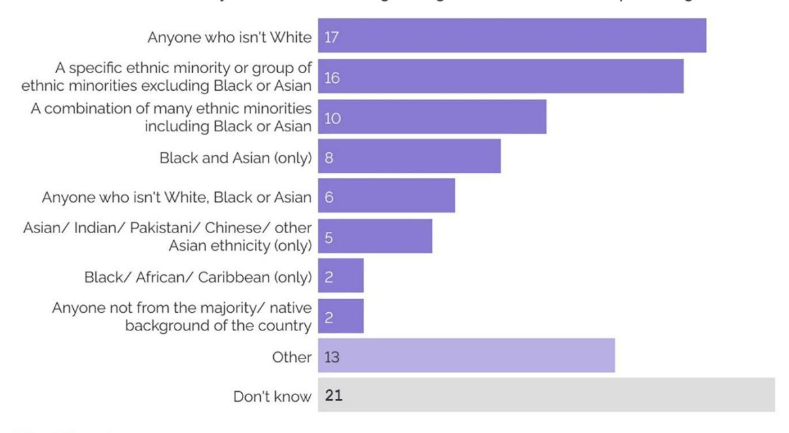

{0}------------------------------------------------

# WJEC GCSE English Language and Literature (Double Award Only)

Approved by Qualifications Wales

Sample Assessment Materials

Unit 6: Connections Teaching from 2025

Ready for the world. This Qualifications Wales regulated qualification is not available to centres in England.

Made for Wales.

{1}------------------------------------------------

{2}------------------------------------------------

#### Contents

| Question paper1                                                                   |  |
|-----------------------------------------------------------------------------------|--|
| Resource Folder17                                                                 |  |
| MARK SCHEME22                                                                     |  |
| Mapping of questions to specification content and assessment objectives: Unit 636 |  |

#### **Copyright**

© WJEC CBAC Limited 2025.

{3}------------------------------------------------

| Surname | Centre number | Candidate number |
|---------------|------------------|---------------------|
| First name(s) |                  | 0                   |

#### **GCSE**

#### **3750U6**

**English Language and Literature - Unit 6 (Double Award Only) Connections**

### Time 1hour 30 minutes **SAMPLE ASSESSMENT MATERIALS**

#### **Instructions to candidates**

Use black ink or black ball-point pen. Do **not** use gel pen or correction fluid.

Write your name, centre number and candidate number in the spaces provided at the top of this page.

Answer **all** questions.

|               | For examiner's use only |                 |
|---------------|-------------------------|-----------------|
| Question | Maximum mark | Mark awarded |
| 1.            | 2                       |                 |
| 2.            | 1                       |                 |
| 3.            | 1                       |                 |
| 4a, 4b | 1 + 1 |  |
| 5.            | 3                       |                 |
| 6.            | 5                       |                 |
| 7.            | 5                       |                 |
| 8.            | 1                       |                 |
| 9.            | 13                      |                 |
| 10.           | 13                      |                 |
| 11. or 12. | 34 |  |
| Total         | 80                      |                 |

Write your answers in the spaces in this booklet. If you need more space, use the additional page(s) at the back of this booklet. Number the question(s) correctly.

#### **Information for candidates**

The number of marks is given in brackets at the end of each question or part-question.

The total number of marks available is **80.**

You should think carefully about how you use your time.

{4}------------------------------------------------

Read each text carefully and answer all the questions below.

#### **Section A**

#### **TEXT A**

| A are NOT | Read the following statements based on Text A. Which of the statements about Text true? Tick (✓) two boxes. |  |  | Examiner [2] |
|------------|---------------------------------------------------------------------------------------------------------------------------------------------------------------|--------------|---------------|-----------------|
| BAME very | 83% of ethnic minority Britons understand the term or fairly well. |  |  |  |
| 19% of | ethnic minority Britons over 65 lack understanding about the term BAME. |  |  |  |
| 23% of all | ethnic minority Britons do not understand the term Ethnic Minority. |  |  |  |
|  | 15% of ethnic minority Britons over 65 do not understand the term Ethnic Minority. |  |  |  |
|            |                                                                                                                                                               |              |               |                 |
|  | 75% of ethnic minority Britons under the age of 16 prefer the term Ethnic Minority. What percentage of Pakistani people think that BAME "Is | a helpful | term to use"? | [1] |
|            |                                                                                                                                                               |              |               |                 |
|  | In the final paragraph, the writer refers to "oversimplification". Which of the following best describes the meaning of "oversimplification". Tick (✓) one | box. |  | [1] |
| easy       |                                                                                                                                                               |              |               |                 |
| misleading |                                                                                                                                                               |              |               |                 |
| made-up    |                                                                                                                                                               |              |               |                 |

{5}------------------------------------------------

#### **TEXT B**

| 4. | (a) | What technique is used in the following sentence: "blood, sweat, tears, hopes and fears are baked into the bricks in this building."? | Tick (✓) one box. | [1] |
|----|-----|------------------------------------------------------------------------------------------------------------------------------------------|---------------------------------------|-----|
|    |     | Simile                                                                                                                                   |                                       |     |
|    |     | Metaphor                                                                                                                                 |                                       |     |
|    |     | Repetition                                                                                                                               |                                       |     |
|    |     | Personification                                                                                                                          |                                       |     |
|  | (b) | Explain what the speaker means when he fears are baked into the bricks in this building." | says: "blood, sweat, tears, hopes and | [1] |
|  |  |  |  |  |
|    |     |                                                                                                                                          |                                       |     |

{6}------------------------------------------------

| 2, 25.00 | graph which sum cting one word to |  | is provided bel | low. Complete the para | ngraph [3] |
|-----------|--------------------------------------|------------------|------------------|--------------------------|------------|
| Riz Ahm   | ned believes we                      | need a           | w                | here everyone feels      |            |
| valued.   | He believes tha                      | t if people do n | ot feel represen | ted, they are at risk of |            |
| feeling _ |                                      | He thinks th     | at every human   | is                       |            |
| and that  | t is why we are                      | all important.   |                  |                          |            |
|           | people                               | culture          | variety          | alienated                |            |
|           | unique                               | words            | diversity        | popular                  |            |
|           |                                      |                  |                  |                          |            |
|           |                                      |                  |                  |                          |            |
|           |                                      |                  |                  |                          |            |
|           |                                      |                  |                  |                          |            |
|           |                                      |                  |                  |                          |            |
|           |                                      |                  |                  |                          |            |
|           |                                      |                  |                  |                          |            |
|           |                                      |                  |                  |                          |            |
|           |                                      |                  |                  |                          |            |

{7}------------------------------------------------

| 7. | To answer this question you should refer to the whole of Text B.                                | [5] | Examiner only |
|----|-------------------------------------------------------------------------------------------------|-----|---------------|
|    | Summarise what the speaker suggests will happen if we do not take action to value every person? |     |               |
|    |                                                                                                 |     |               |
|    |                                                                                                 |     |               |
|    |                                                                                                 |     |               |
|    |                                                                                                 |     |               |
|    |                                                                                                 |     |               |
|    |                                                                                                 |     |               |
|    |                                                                                                 |     |               |
|    |                                                                                                 |     |               |
|    |                                                                                                 |     |               |
|    |                                                                                                 |     |               |
|    |                                                                                                 |     |               |
|    |                                                                                                 |     |               |
|    |                                                                                                 |     |               |
|    |                                                                                                 |     |               |

{8}------------------------------------------------

#### **TEXT C**

**8.** In line 2, the writer tells us that his mother asked him to "haggle" down the price of his school uniform. Which of the following best describes the meaning of "haggle". Tick (✓) one box.

| [1] | Examiner |
|-----|----------|
|     | only     |

| to find an alternative school uniform                                      |  |
|----------------------------------------------------------------------------|--|
| to pay for the school uniform using shopping vouchers |  |
| to try and agree a lower price for the school uniform                      |  |
| to describe how two or more shops enter a price war over school uniform |  |

{9}------------------------------------------------

| 9. | Using linguistic and literary approaches, explore how the writer of Text C presents his school experience as difficult. | [13] | Examiner only |
|----|-------------------------------------------------------------------------------------------------------------------------|------|------------------|
|    | Refer closely to the text in your answer. The accuracy and organisation of your writing are assessed.                   |      |                  |
|    |                                                                                                                         |      |                  |
|    |                                                                                                                         |      |                  |
|    |                                                                                                                         |      |                  |
|    |                                                                                                                         |      |                  |
|    |                                                                                                                         |      |                  |
|    |                                                                                                                         |      |                  |
|    |                                                                                                                         |      |                  |
|    |                                                                                                                         |      |                  |
|    |                                                                                                                         |      |                  |
|    |                                                                                                                         |      |                  |
|    |                                                                                                                         |      |                  |
|    |                                                                                                                         |      |                  |
|    |                                                                                                                         |      |                  |
|    |                                                                                                                         |      |                  |
|    |                                                                                                                         |      |                  |
|    |                                                                                                                         |      |                  |
|    |                                                                                                                         |      |                  |
|    |                                                                                                                         |      |                  |
|    |                                                                                                                         |      |                  |
|    |                                                                                                                         |      |                  |
|    |                                                                                                                         |      |                  |

{10}------------------------------------------------

| 10. | Compare how multicultural Britain is presented in Text B and Text C.                                     | [13] | Examiner only |
|-----|----------------------------------------------------------------------------------------------------------|------|---------------|
|     | You must refer to both texts in your answer. The accuracy and organisation of your writing are assessed. |      |               |
|     |                                                                                                          |      |               |
|     |                                                                                                          |      |               |
|     |                                                                                                          |      |               |
|     |                                                                                                          |      |               |
|     |                                                                                                          |      |               |
|     |                                                                                                          |      |               |
|     |                                                                                                          |      |               |
|     |                                                                                                          |      |               |
|     |                                                                                                          |      |               |
|     |                                                                                                          |      |               |
|     |                                                                                                          |      |               |
|     |                                                                                                          |      |               |
|     |                                                                                                          |      |               |
|     |                                                                                                          |      |               |
|     |                                                                                                          |      |               |
|     |                                                                                                          |      |               |
|     |                                                                                                          |      |               |
|     |                                                                                                          |      |               |
|     |                                                                                                          |      |               |
|     |                                                                                                          |      |               |
|     |                                                                                                          |      |               |
|     |                                                                                                          |      |               |

{11}------------------------------------------------

#### **SECTION B**

In this section you will be assessed for the quality of your **writing** skills. **Answer question 11 or 12.** 

You should aim to write between 300–400 words. You should aim to spend 5 minutes planning your writing.

| Complete one of the following: |  |
|-------------------------------------------------------------------------------------------------|--|
| Either:                                                                                         |  |
| 11.                                                                                             |  |
| Write a talk for your classmates in which you persuade them of the importance of music. [34] |  |
| Or:                                                                                             |  |

Write a guide for Year 6 pupils giving advice on how to survive their first day at secondary school.

**[34]**

*The space below can be used to plan your work before starting your writing on the next page.*

**12.** 

{12}------------------------------------------------

{13}------------------------------------------------

{14}------------------------------------------------

{15}------------------------------------------------

{16}------------------------------------------------

| Examiner only |
|---------------|
|               |
|               |
|               |
|               |
|               |
|               |
|               |
|               |
|               |
|               |
|               |
|               |
|               |
|               |
|               |
|               |
|               |
|               |
|               |
|               |
|               |
|               |
|               |
|               |
|               |

{17}------------------------------------------------

{18}------------------------------------------------

| Question number | Additional page, if required. Write the question number(s) in the left-hand margin. |  |  |  |  |
|-----------------|-------------------------------------------------------------------------------------|--|--|--|--|
|                 |                                                                                     |  |  |  |  |
|                 |                                                                                     |  |  |  |  |
|                 |                                                                                     |  |  |  |  |
|                 |                                                                                     |  |  |  |  |
|                 |                                                                                     |  |  |  |  |
|                 |                                                                                     |  |  |  |  |
|                 |                                                                                     |  |  |  |  |
|                 |                                                                                     |  |  |  |  |
|                 |                                                                                     |  |  |  |  |
|                 |                                                                                     |  |  |  |  |
|                 |                                                                                     |  |  |  |  |
|                 |                                                                                     |  |  |  |  |
|                 |                                                                                     |  |  |  |  |
|                 |                                                                                     |  |  |  |  |
|                 |                                                                                     |  |  |  |  |
|                 |                                                                                     |  |  |  |  |
|                 |                                                                                     |  |  |  |  |
|                 |                                                                                     |  |  |  |  |
|                 |                                                                                     |  |  |  |  |
|                 |                                                                                     |  |  |  |  |
|                 |                                                                                     |  |  |  |  |
|                 |                                                                                     |  |  |  |  |
|                 |                                                                                     |  |  |  |  |

{19}------------------------------------------------

## WJEC GCSE English Language and Literature

Resource Folder

Unit 6

{20}------------------------------------------------

#### **Unit 6 – Accompanying Texts**

#### **Text A –**

is non-continuous text produced by YouGov, a company that surveys public opinion and provides data. This text presents data gathered about the outdated terms 'BAME' and 'Minority Ethnic'.

### **How do ethnic minority Britons feel about the term 'BAME'?**

#### **What does BAME mean?**

The vast majority of ethnic minority Britons (83%) say they understand the term BAME (Black, Asian and Minority Ethnic) very or fairly well, whilst 13% say they lack understanding. This uncertainty increases with age; 8% of those aged 18 to 24 have this view compared to 19% of those aged 65 and above.

Slightly more ethnic minority Britons say that they don't understand what is meant by the term 'Minority Ethnic' (17%). The youngest age group say they don't understand it, 23% of those aged 18 to 24; compared to 14% of 50-64 year olds and 15% of those aged 65 and above.

{21}------------------------------------------------

#### **Is it acceptable to use the term BAME?**

Attitudes here appear contradictory. While ethnic minority Britons tend to think it is acceptable to use as an umbrella term for the portion of the British population that is non-white (by 49% to 31%), it is not their preferred term, which goes to simply "ethnic minorities" by 58% to 27%.

The tendency to see BAME as an oversimplification is clear across all ethnic groups. All ethnic groups tend to see the term as a short-term fix.

{22}------------------------------------------------

**Text B** – This is a transcript of a speech given by actor Riz Ahmed to Members of Parliament. In this speech Ahmed presents his views about the importance of diverse representation in the media.

Riz Ahmed Diversity Speech to the House of Commons

R:

if you're **used** to seeing yourself reflected in culture (.) you **really** (.) I **really** want you to just take a **minute** to to kind of understand how much it **means** (.) to someone who **doesn't** (.) see **themselves** reflected **back** (1) every time you **see** yourself in a magazine a billboard tv film (2) it's a message that (.) that you **matter** (.) you're part of a national story that you're **valued** (1) you feel **represented** (1) now (.) if we **fail** (1) to represent people (.) in our **mainstream** narratives they'll switch off they'll retreat to **fringe** narratives (2) it's not just important to show people **themselves** and to send a signal that they are (.) **valued** and **worthwhile** and represented (.) it's also **really** important I think to **show** (.) people (.) **characters** (.) and **stories** that don't resemble them at all (.) the power of **stories** to allow us to relate to experiences that don't resemble our own is **phenomenal** (.) and every time we **see** those experiences it **reminds** us that what **unites** us is far far greater than what **divides** us (2) culture is a place where you can put yourself in someone else's **shoes** (1) and a **one**size shoe shop just doesn't make any sense (3) over a **million** Indians fought and died for Great Britain in World War One no one ever told me that at school (1) we never learned about the British Empire we never learned about whose blood sweat tears hopes and fears are **baked** into the bricks in this building (1) if we **did** learn about that then maybe we wouldn't think about diversity and throwing people crumbs out of **politeness** maybe we'd think about giving people their **due** (1) and **representing** them (2) it was only recently that I learned the first Indian MP was in the 1850s the first black footballer was in the 1860s Edward the Seventh had a black trumpeter ironically named (.) John Blanke (1) and er actually **even** our England's first border **patrol** force was a North African legion (1) fighting for the **Italian** Roman army (.) to keep the **Scots** on the other side of Hadrian's Wall so even our anti-immigration movement has been really multicultural for **thousands** of years (2) that's how deep it goes (1) so (.) I think we need to (.) kind of (.) take a leaf out the book of our music industry (2) drum and base (1) grime (.) dubstep (.) these are (.) **worldconquering** musical genres that are only possible by tapping into our multiculturalism (2) and (.) just (.) once again to reiterate that this is about the bottom line the creative industries make up **seven** (.) **per cent** of our GDP (3) we're really at a very **critical** moment in our nation's history (.) if we don't step up (.) and tell a **representative** story (.) we're going to start **losing** people (1) to **other** stories (.) we're at this critical moment (2) let's not allow future generations to look back and judge us when centrifugal forces (.) are threatening to tear us apart because they **really** are (.) I can **feel** it (.) and I know a lot of you can too (1) we need you to **step** up **decisively** and **act** (2) let's do what's **right** (.) let's **represent** (.) thank you very much.

#### Key

bold emphatic stress

- (.) micropause
- (1) timed pause (in seconds)

{23}------------------------------------------------

**Text C** – This text is taken from his novel written by Sathnam Sangehera, *The Boy with the Topknot* (a topknot is a hair bun often worn by Sikhs). In this text he shares some of his secondary school experiences where he is just one of a few non-white children.

Things were going badly for me at my new school, and had been from the moment I went to buy the uniform from Beatties department store in town and Mum asked me to haggle down the price, only for the assistant to retort: 'This isn't Wolverhampton market, madam.' Into my second year, I still felt bewildered by the school: the way the music teacher gave us a keyboard and just expected us to be able to read and write music; the way some of the kids patted the corners of their mouths at the end of their packed lunch; the way, frankly, they were so white. Until I went to Wolverhampton Grammar, I hadn't really been aware of being different. Largely because, even with my topknot, I wasn't. In my final class at Woden Primary, there were two of us (boys) in my class alone with long hair and, if anything, my classmates found my name – translating as 'god', and bearing an admittedly hilarious likeness to 'Batman' ('Satman!) – more amusing than my hair. But now I was just one of a few topknots in the whole school, and my days were marked by taunts of 'Oi turbinator' and 'Is that your packed lunch on your head?'

In this new environment, I felt I could do nothing right. When we were asked to wrap our textbooks for protection, I did so in 1970s floral wallpaper, while the boys around me came back with theirs expertly wrapped in plastic. While the other kids who had packed lunches came with neatly packed sandwiches, Mum gave me omelette sandwiches and aloo gobi parathas, which stank out the packed lunch area, so much so that I ate alone outside. After several months I had managed to make only one proper friend – James Lockley, or Lock, as we called each other by surnames, who caught the bus to school from a similarly crap part of town and shared my pop music obsession.

From wanting to be centre of attention, I became timid and speechless. At junior school, parents' evenings had been the absolute highlight of my year, as exciting as a birthday and Christmas combined. I would whip myself into a state of high excitement as mum disappeared down the road with my sister Puli – who went to translate – and almost shake with pleasure as mum returned to repeat every comment with a smile and a congratulatory 'Shabaash'. But now I couldn't stand them.

{24}------------------------------------------------

#### MARK SCHEME

#### **Guidance for examiners**

#### **Generic marking principles**

- Marks awarded are always whole marks (not half marks, or other fractions).
- Answers should only be judged on the quality of spelling, punctuation and grammar when these features are specifically assessed by the question as indicated by the mark scheme. The meaning, however, should be unambiguous.
- Marks should be awarded using the full range of marks defined in the mark scheme for the question (however; the use of the full mark range may be limited according to the quality of the candidate responses seen).
- Marks awarded are based solely on the requirements as defined in the mark scheme. Marks should not be awarded with grade thresholds or grade descriptors in mind.

#### **Positive marking**

It should be remembered that candidates are writing under examination conditions and credit should be given for what the candidate writes, rather than adopting the approach of penalising candidates for any omissions. It should be possible for a very good response to achieve full marks and a very poor one to achieve zero marks. Marks should not be deducted for a less than perfect answer if it satisfies the criteria of the mark scheme.

For questions that are objective or points-based, the mark scheme should be applied precisely. Marks should be awarded as indicated and no further subdivision made.

Mark schemes often list points which may be included in candidates' answers. The list is not exhaustive. The inclusion of *'Credit any other valid response.*' (or similar instruction) within mark schemes allows for the possible variation in candidates' responses. Credit should be given according to the accuracy and relevance of candidates' answers.

Appropriate terminology is reflected in exemplar responses in mark schemes. However, unless there is a specific requirement within a question, candidates may be awarded marks where the answer is accurate but expressed in their own words.

#### **Banded mark schemes**

For band marked questions mark schemes are in two parts; the indicative content and the assessment grid.

The indicative content suggests the range of points and issues which may be included in candidates' answers. It can be used to assess the quality of the candidate's response. As noted above, indicative content is not intended to be exhaustive and candidates do not have to include all the indicative content to reach the highest level of the mark scheme.

However, to reach the highest level of the mark scheme a candidate must meet the requirements of the highest mark band. Where a response is not creditworthy, that is, it contains nothing of any significance to the mark scheme, or where no response has been provided, no marks should be awarded.

{25}------------------------------------------------

The marking of banded mark questions should always be positive. This means that, for each candidate's response, marks are accumulated for the demonstration of relevant skills, knowledge and understanding: they are not deducted from a maximum on the basis of errors or omissions.

Examiners should first read and annotate the candidate's answer to pick out the evidence that is being assessed in that question. The mark scheme can then be applied. This is done as a two-stage process.

#### **Stage 1 – Deciding on the band**

Beginning at the lowest band, examiners should look at the candidate's answer and check whether it matches the descriptors for that band. If the descriptors at the lowest band are satisfied, examiners should move up to the next band and repeat this process for each band until the descriptors most closely matches the work.

#### **Stage 2 – Deciding on the mark**

Having determined the appropriate band, deciding on the mark within a band will be made on the basis of a 'best fit' procedure, weaknesses in some areas being compensated for by strengths in others.

Examiners should use the full range of marks available to them. Marking should be positive, rewarding achievement rather that penalising failure or omissions. The awarding of marks must be directly related to the marking criteria, and all responses must be marked according to the banded levels provided for each question.

Standardising material that has already been awarded a mark will be provided during standardising and this should be used as a reference material when assessing work. Examiners are reminded of the need to revisit the standardising material as they apply the mark scheme in order to confirm that the band and the mark allocated is appropriate to the work submitted.

This mark scheme instructs examiners to look for and reward valid alternatives where indicative content is suggested for an answer. This is not a checklist for expected content in an answer, or set out as a 'model answer', as responses must be marked in the banded levels of response provided for each question. Where a candidate provides a response that contains aspects or approaches not included in the indicative content, examiners should use their professional judgement to determine the validity of the response in light of the task and reward as directed by the bands. Candidates are free to choose any approach that is relevant to the set task. Candidates can (and will most likely) incorporate ideas other than those mentioned in the mark scheme.

{26}------------------------------------------------

#### **Section A**

#### **TEXT A**

| Question |  | Answer | AO1 | AO2 | Total Mark |
|----------|-------------------------------------------------------------------------------------------------------------------------------------|--------------------------------------------------------------------------------------------------------------------------------------------------------------------------|-----|-----|---------------|
| 1. | Read the following statements based on Text A. Which of the statements about Text A are NOT true? Tick (✓) two statements. |  | [2] |  | [2] |
|  |  | Award one mark for each of the following to a maximum of two: |  |  |  |
|  | • | 23% of all Britons do not understand the term Ethnic Minority. |  |  |  |
|  | • | 75% of ethnic minority Britons under the age of 16 prefer the term Ethnic Minority. |  |  |  |
|  |  | Candidates who tick more than two boxes cannot be awarded any marks. Only credit two correct answers. |  |  |  |
| 2. |  | What percent of Pakistani people think that BAME is a "helpful term to use"? | [1] |  | [1] |
|  | 39 (%) | Award one mark for the correct answer: |  |  |  |
| 3. |  | In the final paragraph, the writer refers to "oversimplification". Which of the following best describes the meaning of "oversimplification". Tick (✓) one box. | [1] |  | [1] |
|  |  | Award one mark for the correct answer: |  |  |  |
|          | •                                                                                                                                   | misleading.                                                                                                                                                              |     |     |               |

{27}------------------------------------------------

#### **TEXT B**

| Question |  | Answer | AO1 | AO2 | Total Mark |
|----------|-----|--------------------------------------------------------------------------------------------------------------------------------------------------------------------------------------------------------------------------------------------------------------------------------------------------------------------------------------------------------------------------------------------------------------------------------------------------------------------------------------------------------------------------------------------------------------------------------------------------------------------------------------------------------------------------------------------------------------------------------|-----|-----|---------------|
| 4. | (a) | What technique is used in the following sentence: "blood, sweat, tears, hopes and fears are baked into the bricks in this building."? Tick (✓) box. Award one mark for the correct answer: <ul><li>metaphor.</li></ul> | [1] |  | [1] |
|  | (b) | Explain what the writer means when they say: "blood, sweat, tears, hopes and fears are baked into the bricks in this building. Award one mark for a valid explanation of the effect of the metaphor: <ul><li>the metaphor makes the reader realise that the decisions made by parliament are linked to people's experiences and emotions</li><li>our constitution has had a huge impact on many people's lives</li><li>people who have suffered are a part of our history</li><li>the contributions of these people are why our society exists as it does today</li><li>the foundations of our society are based on the people who suffered to create it. Reward valid alternative explanations.</li></ul> | [1] |  | [1] |
| 5. |  | Complete the following paragraph to show your understanding of Text B. Complete the paragraph by selecting one word to fill each gap. Award one mark for each of the correct words to a maximum total of three. Riz Ahmed believes we need a culture where everyone feels valued. He feels that if people do not feel represented, they are at risk of feeling alienated. He thinks that every human is unique and that is why we are all important. | [3] |  | [3] |

{28}------------------------------------------------

|  | Question | Answer | AO1 | AO2 | Total Mark |
|----|------------|-------------------------------------------------------------------|-----|-----|---------------|
| 6. | education? | Look at lines 13-24. What impression does the speaker give of his | 5   |     | 5             |

#### **Points that candidates may consider:**

- he was not taught about the contributions of people of colour to British wartime efforts "No one ever taught me that at school", the scale of which is emphasised to shock the audience "over a million"
- "we never learned about the British Empire" shows this subject was not something commonly taught / the plight of indigenous people were whitewashed in history teaching
- repeated use of plural pronoun "we" to highlight that the lack of knowledge about this is widespread / including the audience in the shame of not knowing this history
- repetition of "we never learned" to emphasise the profound effect of narrow education
- use of hypothetical sentence, "If we did learn about that then maybe we wouldn't think about diversity … of politeness", to show what could be achieved if these subjects had been taught / looks at education from a different angle helps us consider how things could have been different/positive
- passive voice "no-one ever taught me that" to stress gaps in education when he was young
- use of metaphor "we never learned about whose blood…" gives a stark image of the history that hasn't been shared – especially relating to diversity; audience will question their own education
- "maybe we'd think" gives the impression that a lack of education when young has lifelong repercussions
- "It was only recently I learned…" gives the impression of a continuing education
- active voice "I learned…" to show that he is now in control of what he learns (subjects that he is interested in)
- use of timed pauses throughout the extract to allow the audience to register the significance of what Ahmed is saying.

Look for and reward valid alternatives.

| Mark | Descriptor                                                                                                                                       |
|------|--------------------------------------------------------------------------------------------------------------------------------------------------|
| 5 | Candidates give well-reasoned and persuasive explanations of a comprehensive range of examples of the impact of language, structure and form. |
| 4 | Candidates give secure explanations of a range of relevant examples of the impact of language, structure and form. |
| 3 | Candidates give straightforward explanations about the impact of language, structure and form. |
| 2 | Candidates make basic comments on the impact of language, structure and form, although not all will be clear or relevant. |
| 1    | Candidates make limited comments on the impact of language, structure and form.                                                                  |
| 0    | Nothing worthy of credit                                                                                                                         |

{29}------------------------------------------------

| Question |  | Answer | AO1 | AO2 | Total Mark |
|----------|---------------------------------|--------------------------------------------------------------------------------------------------------------------------------------------------------------------------------------------------------------------------------------------------------------------------------------------------------------------------------------------------------------------------------------------------------------------------------------------------------------------------------------------------------------------------------------------------------------------------------------------------------------------------------------------------------------------------------------------------------------------------------------------------------------------------------------------------------------------------------------------|-----|-----|---------------|
| 7. | • • • • • • • | To answer this question you should refer to the whole of Text B. Summarise what the speaker suggests will happen if we do not take action to value every person? Points that candidates may consider: people will not feel valued / important / involved people will switch off and become disenfranchised/disengaged people will become marginalized and feel insignificant people won't see the value in others we will have a narrow view of the world we will lose an idea of who we are/lose our identity people could resort to less desirable behaviours/actions. Successful answers will be brief and will only include key details. These answers may be presented in bullet points. Candidates will cover a range of details from across the whole text. Reward valid alternatives. | [5] |  | [5] |

| Mark | Descriptor                                                                                                                                                                                       |  |
|------|--------------------------------------------------------------------------------------------------------------------------------------------------------------------------------------------------|--|
| 5 | Synthesis and/or summary of information, ideas and themes is sustained and thoughtful, using appropriate details to explain the relevance and impact of the links and/or comparisons made. |  |
| 4 | Synthesis and/or summary of information, ideas and themes is accurate, with some attempt to explain the relevance and impact of the links and/or comparisons made. |  |
| 3    | Synthesis and/or summary of information, ideas and themes is clear and appropriate.                                                                                                              |  |
| 2 | Synthesis and/or summary of information, ideas and themes is basic and may contain some errors. |  |
| 1 | Synthesis and/or summary of information, ideas and themes is limited and often inaccurate. |  |
| 0    | Nothing worthy of credit                                                                                                                                                                         |  |

{30}------------------------------------------------

| Question |  | Answer | AO1 | AO2 | Total Mark |
|----------|---------------------------------------------------------------------------------------------------------------------------------------------------------------------------------------------------|-------------------------------------------------------------------------------------------------------------------------------|-----|-----|---------------|
| 8. | In line 2, the writer tells us that his mother asked him to "haggle" down the price of his school uniform. Which of the following best describes the meaning of "haggle". Tick (✓) one box. |  | [1] |  | [1] |
|  | to find an alternative school uniform to pay for the school uniform using shopping vouchers |  |  |  |  |
|  | to try and agree a lower price for the school uniform ✓ |  |  |  |  |
|  | to describe how two or more shops enter a price war over school uniform |  |  |  |  |
| Question |  | Answer | AO1 | AO2 | Total Mark |
| 9. |  | Using linguistic and literary approaches, explore how the writer of Text C presents his school experience as difficult. | 10 | 3 | 13 |

#### **Points that candidates may consider:**

- direct (declarative) statement "things were going badly for me at school"; the reader is left in no doubt
- even buying the uniform was a source of cultural embarrassment when his mum asked him to "haggle the price…"
- uses the adjective "bewildered" to suggest his unease with and confusion about school
- his teachers' expectations were high "just expected to be able to read and write music" which makes him feel substandard
- he feels alienated by the manners of some other pupils who "patted the corners of their mouths at the end of their packed lunch"
- he highlights the stark cultural differences between different ethnicities with the adverb *so* "they were so white"
- he is made to feel "different"
- racial slurs are pervasive and wide-ranging, from comments about his "topknot" to more abusive challenge "Oi turbinator"
- he feels personally incapable "I could do nothing right"
- he lists points of contrast to emphasis the differences between himself and the other boys: "floral wallpaper" and "expertly wrapped in plastic" / "neatly packed sandwiches" and "aloo gobi parathas" suggests acute consciousness of differences between social and ethnic groups
- "one proper friend" isolated from the others/quite lonely in school
- his one friend came from "a similarly crap part of town": more affluent children did not socialise with him
- the effects on being so miserable at school left him "timid and speechless"
- the change from the excitement of parents' evenings to now feeling "I couldn't stand them" suggests a disenfranchisement from his education / a lack of pride or self-worth.

Look for and reward valid alternatives.

{31}------------------------------------------------

| Marks | AO1                                                                                                                                                                                                                                                                                                                                                      |  |  |
|-------|----------------------------------------------------------------------------------------------------------------------------------------------------------------------------------------------------------------------------------------------------------------------------------------------------------------------------------------------------------|--|--|
| 9-10 | <ul><li>Candidates offer well-reasoned explanations of how a comprehensive range of aspects of language, structure and form contribute to the presentation of information, ideas and themes.</li><li>Candidates give well-reasoned and persuasive explanations of a comprehensive range of examples of the impact of language, structure and form.</li></ul> |  |  |
| 7-8 | <ul><li>Candidates offer detailed explanations of how a range of relevant aspects of language, structure and form contribute to the presentation of information, ideas and themes.</li><li>Candidates give secure explanations of a range of relevant examples of the impact of language, structure and form.</li></ul> |  |  |
| 5-6 | <ul><li>Candidates offer straightforward explanations of how different aspects of language, structure and form contribute to the presentation of information, ideas and themes.</li><li>Candidates give straightforward explanations about the impact of language, structure and form.</li></ul> |  |  |
| 3-4 | <ul><li>Candidates comment on some basic examples of how language, structure and form contribute to the presentation of information, ideas and themes.</li><li>Candidates make basic comments on the impact of language, structure and form, although not all will be clear or relevant.</li></ul> |  |  |
| 1-2 | <ul><li>Candidates make simple and limited comments on how language, structure and form contribute to the presentation of information, ideas and themes.</li><li>Candidates make limited comments on the impact of language, structure and form.</li></ul> |  |  |
| 0     | Nothing worthy of credit                                                                                                                                                                                                                                                                                                                                 |  |  |

| Marks | AO2                                                                                                                                                                                                                                        |  |  |
|-------|--------------------------------------------------------------------------------------------------------------------------------------------------------------------------------------------------------------------------------------------|--|--|
| 3 | <ul><li>Candidates consistently and purposefully use appropriate grammar and syntax.</li><li>A wide range of punctuation is used confidently and accurately. Spelling is almost always correct, including that of complex/irregular words.</li></ul> |  |  |
| 2 | <ul><li>Candidates use appropriate grammar and syntax.</li><li>A range of punctuation is used accurately and spelling is secure.</li></ul> |  |  |
| 1 | <ul><li>Candidates rarely use appropriate grammar and syntax and errors may impede meaning.</li><li>Errors in punctuation and spelling are likely to impede clarity or meaning.</li></ul> |  |  |
| 0     | Nothing worthy of credit.                                                                                                                                                                                                                  |  |  |

{32}------------------------------------------------

|  | Question | Answer | AO1 | AO2 | Total Mark |
|-----|-----------------------------------------------------------------------|--------|-----|-----|---------------|
| 10. | Compare how multi-cultural Britain is presented in Text B and Text C. |        | 10  | 3   | 13            |
|     | Ideas that candidates may compare:                                    |        |     |     |               |

| Points of similarity / difference | TEXT B | TEXT C |
|--------------------------------------|----------------------------------------------------------------------------------------------------------------------------------------------------------------------------------------------|--------------------------------------------------------------------------------------------------------------------------------------------------------------------|
| Inclusion | First and foremost, we are all human beings "what unites us is far, far greater than what divides us" | Pride taken in education in primary school "parents' evenings had been the absolute highlight of my year" |
| Cultural value | British music industry is representative and produces "world-conquering musical genres" | He sees his culture as separating him from students who eat "neatly packed sandwiches" whilst he has "aloo gobi parathas" for lunch |
| Division / Isolation | If individuals do not feel included in British society we run the risk of "losing people to extremism" | Sense of isolation in school as the vast majority of students were "so white" |
| Historic / Identity | People of colour have contributed to British society for hundreds, if not thousands, of years – often unrecognised "Over a million Indians fought and died for Great Britain" | his sister "went to translate" at parents' evenings indicating the value his parents placed on retaining their language and cultural identity |
| Social views | Inclusion and representing multicultural Britain is morally right: "Let's do what's right" | He is socially limited to people from "a similarly crap part of town" |
| Effects of under representation | If people of colour aren't represented "they'll switch off" from mainstream society | He feels a changed person "In this new environment, I felt I could do nothing right" and becomes "timid and speechless" |
| Representation / Visibility | White population of Britain are represented in "billboard[s], TV, film" whereas people of colour are not. | He is viewed as other/different and assigned an identity based on his racial appearance "I was just one of a few topknots" |
| Diversity | The importance of showing people "characters and stories that don't resemble them at all" to foster tolerance and understanding | In his primary school he "hadn't really been aware of being different" as there was greater diversity in the cultural and racial backgrounds of pupils |
| Education | Education excludes historically problematic events "we never learned about the British Empire" | He is marginalised at school "I ate alone outside" |

{33}------------------------------------------------

#### Overview:

Text B – aware of problems but hopeful for the future. Encourages people to make a difference and change. See the dangers of not embracing different cultures.

Text C – acutely aware of cultural differences. Shows how people can really struggle to fit in – culture can make people feel isolated.

Look for and reward valid comparisons.

| Marks | AO1                                                                                                            |  |  |  |
|-------|----------------------------------------------------------------------------------------------------------------|--|--|--|
| 9-10 | Candidates make developed and sustained comparisons and/or links with detailed and persuasive explanations. |  |  |  |
| 7-8 | Candidates make appropriate and meaningful comparisons and/or links with clear explanations. |  |  |  |
| 5-6   | Candidates make appropriate comparisons and/or links with some explanation.                                    |  |  |  |
| 3-4   | Candidates make some basic comparisons and/or links with little explanation.                                   |  |  |  |
| 1-2 | Candidates make a limited number of basic comparisons and/or links often without explanation. |  |  |  |
| 0     | Nothing worthy of credit                                                                                       |  |  |  |

| Marks | AO2                                                                                                                                                                                                                                           |  |  |
|-------|-----------------------------------------------------------------------------------------------------------------------------------------------------------------------------------------------------------------------------------------------|--|--|
| 3 | <ul><li>Candidates consistently and purposefully use appropriate grammar and syntax.</li><li>A wide range of punctuation is used confidently and accurately. Spelling is almost always correct, including that of complex/irregular words.</li></ul> |  |  |
| 2 | <ul><li>Candidates use appropriate grammar and syntax.</li><li>A range of punctuation is used accurately and spelling is secure.</li></ul> |  |  |
| 1 | <ul><li>Candidates rarely use appropriate grammar and syntax and errors may impede meaning.</li><li>Errors in punctuation and spelling are likely to impede clarity or meaning.</li></ul> |  |  |
| 0     | Nothing worthy of credit.                                                                                                                                                                                                                     |  |  |

{34}------------------------------------------------

#### **SECTION B**

Complete **one** of the following:

#### **Unit 6 Section B**

In this section you will be assessed for the quality of your **writing** skills.

You should aim to write between 300-400 words. You should aim to spend 5 minutes planning your writing.

Complete **one** of the following

Either:

11.

Write a talk for your classmates in which you persuade them of the importance of music.

Or:

12.

Write a guide for Year 6 pupils giving advice on how to survive their first day at secondary school.

Marks available: **34**

{35}------------------------------------------------

| Band | AO2 Communication and expression                                                                                                                                                                                                                                                                                                                                                                                                                                                                                                                                                                                                   | AO2 Accuracy                                                                                                                                                                                                                                                                                                                                                                                                               |  |  |
|------|------------------------------------------------------------------------------------------------------------------------------------------------------------------------------------------------------------------------------------------------------------------------------------------------------------------------------------------------------------------------------------------------------------------------------------------------------------------------------------------------------------------------------------------------------------------------------------------------------------------------------------|----------------------------------------------------------------------------------------------------------------------------------------------------------------------------------------------------------------------------------------------------------------------------------------------------------------------------------------------------------------------------------------------------------------------------|--|--|
| 5 | 22-26 marks <ul><li>Communication is consistently clear, with confident and persuasive use of language for effect, and evidence of originality of imagination.</li><li>Candidates make well-considered choices of forms, vocabulary and/or techniques, showing sophisticated awareness of audience engagement.</li><li>Candidates consistently and creatively adapt communication, purposefully selecting appropriate register, vocabulary and techniques.</li><li>Communication is consistently coherent, purposefully organised with a wide variety of sophisticated linguistic and structural features.</li></ul> | 7-8 marks <ul><li>Candidates confidently use a wide range of sentence structures, that thoughtfully enhance clarity, and successfully support purpose and create effect.</li><li>Candidates consistently and purposefully use appropriate grammar.</li><li>A wide range of punctuation is used confidently and accurately. Spelling is almost always correct, including that of complex/irregular words.</li></ul> |  |  |
| 4 | 17-21 marks <ul><li>Communication is clear, with secure use of language for effect and evidence of sustained and interesting imagination.</li><li>Candidates use a broad range of well-chosen forms, vocabulary and/or techniques, with secure awareness of audience engagement.</li><li>Candidates adapt communication securely, and show some confidence in selecting appropriate register, vocabulary and techniques.</li><li>Communication is mostly coherent, effectively organised with a variety of well-chosen linguistic and structural features.</li></ul> | 5-6 marks <ul><li>Candidates use a range of sentence structures, that enhance clarity, and are deliberately used for purpose and effect.</li><li>Candidates use appropriate grammar.</li><li>A range of punctuation is used accurately, and spelling is secure.</li></ul> |  |  |

{36}------------------------------------------------

| 3 | 12-16 marks <ul><li>Communication is mostly clear, with appropriate use of language for effect and evidence of engaging imagination.</li><li>Candidates use a range of appropriate forms, vocabulary and/or techniques, with clear awareness of audience engagement.</li><li>Candidates adapt communication, showing some evidence of selecting appropriate register, vocabulary and techniques.</li><li>Communication is generally coherent, organised with some use of linguistic and/or structural features.</li></ul> | 4 marks <ul><li>Candidates use varied sentence structures, which sometimes enhance clarity, and may be used for specific purpose or effect.</li><li>Candidates generally use appropriate grammar.</li><li>Punctuation and spelling are generally accurate with occasional errors, which do not impede meaning.</li></ul> |
|---|--------------------------------------------------------------------------------------------------------------------------------------------------------------------------------------------------------------------------------------------------------------------------------------------------------------------------------------------------------------------------------------------------------------------------------------------------------------------------------------------------------------------------------------------------|----------------------------------------------------------------------------------------------------------------------------------------------------------------------------------------------------------------------------------------------------------------------------------------------------------------------------|
| 2 | 7-11 marks <ul><li>Communication shows basic clarity, with some effective use of language and some evidence of imagination emerging.</li><li>Candidates use some appropriate forms, vocabulary and/or techniques, which demonstrate some awareness of audience engagement.</li><li>Candidates begin to adapt communication, with some basic attempts to select appropriate register, vocabulary and techniques.</li><li>Communication shows some coherence with occasional use of basic linguistic and/or structural features.</li></ul> | 3 marks <ul><li>Candidates use basic sentence structures which do not always enhance clarity, purpose and / or effect.</li><li>Candidates occasionally use appropriate grammar, but it is inconsistent in accuracy.</li><li>Punctuation and spelling have frequent errors, but meaning is largely clear.</li></ul> |

{37}------------------------------------------------

| 1 | 1-6 marks <ul><li>Communication shows limited clarity, with limited effectiveness in use of language and little evidence of imagination.</li><li>Forms, vocabulary and/or techniques are often inappropriate, ineffective and inconsistent, and show limited awareness of audience.</li><li>Candidates rarely adapt communication; register, vocabulary or techniques may not be appropriate.</li><li>Communication shows occasional coherence, but this may be limited by the lack of organisation. Linguistic and structural features are limited and may be inaccurate.</li></ul> | 1-2 marks <ul><li>Candidates show limited ability to vary sentence structures.</li><li>Candidates rarely use appropriate grammar and errors may impede meaning.</li><li>Errors in punctuation and spelling are likely to impede clarity or meaning.</li></ul> |  |
|---|----------------------------------------------------------------------------------------------------------------------------------------------------------------------------------------------------------------------------------------------------------------------------------------------------------------------------------------------------------------------------------------------------------------------------------------------------------------------------------------------------------------------------------------------------------------------------------------------|--------------------------------------------------------------------------------------------------------------------------------------------------------------------------------------------------------------------------------------------------------------|--|
| 0 | Nothing worthy of credit.                                                                                                                                                                                                                                                                                                                                                                                                                                                                                                                                                                    |                                                                                                                                                                                                                                                              |  |

{38}------------------------------------------------

## Mapping of questions to specification content and assessment objectives: Unit 6

|          | SECTION A & B |                   |     |       |       |       |       |  |
|----------|---------------|-------------------|-----|-------|-------|-------|-------|--|
| Question |               | Topic and Section |     | Total | AO1   | AO2   |       |  |
|          |               | 6.1               | 6.2 | 6.3   | Marks | Marks | Marks |  |
|          | Section A     |                   |     |       |       |       |       |  |
| 1        |               |                   | 2   |       | 2     | 2     |       |  |
| 2        |               |                   | 1   |       | 1     | 1     |       |  |
| 3        |               |                   | 1   |       | 1     | 1     |       |  |
| 4        | (a)           |                   | 1   |       | 1     | 1     |       |  |
|          | (b)           |                   | 1   |       | 1     | 1     |       |  |
| 5        |               |                   | 3   |       | 3     | 3     |       |  |
| 6        |               |                   | 5   |       | 5     | 5     |       |  |
| 7        |               |                   | 5   |       | 5     | 5     |       |  |

{39}------------------------------------------------

| 8           |  |  | 1  |    | 1  | 1  |    |
|-------------|--|--|----|----|----|----|----|
| 9           |  |  | 13 |    | 13 | 10 | 3  |
| 10          |  |  | 13 |    | 13 | 10 | 3  |
| Section B   |  |  |    |    |    |    |    |
| B1          |  |  |    | 34 | 34 |    | 34 |
| OR          |  |  |    |    |    |    |    |
| B2          |  |  |    |    |    |    |    |
| Total marks |  |  | 46 | 34 | 80 | 40 | 40 |