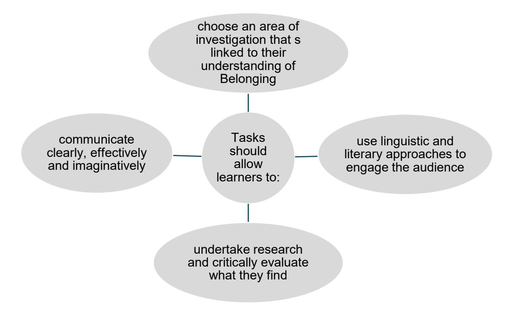
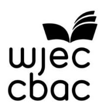

{0}------------------------------------------------

# WJEC GCSE English Language and Literature (Single and Double Award)

Approved by Qualifications Wales

Non-Examination Assessment Handbook

Unit 2: Belonging (3750U2)

Ready for the world. This Qualifications Wales regulated qualification is not available to centres in England.

Made for Wales.

{1}------------------------------------------------

{2}------------------------------------------------

## Contents

| Instructions for teachers | 1  |
|---------------------------|----|
| Task A                    | 2  |
| Task B                    | 5  |
| Marking instructions      | 8  |
| Learner Assessment Pack   | 10 |
| Mark schemes              | 13 |

# Copyright

© WJEC CBAC Limited 2025

{3}------------------------------------------------

# Instructions for teachers

Along with the instructions in this handbook teachers must read the relevant details in the specification for the Single and Double award of this qualification.

Teachers must also read the JCQ document, [Instructions for conducting](https://www.jcq.org.uk/exams-office/non-examination-assessments/) non-examination [assessments](https://www.jcq.org.uk/exams-office/non-examination-assessments/) for detailed advice relating to the administration of non-examination assessment.

Assessment will be based on two tasks. For Task A, learners will be required to respond to one of two prescribed tasks on their studied prose text.

For Task B, the learners will be required to deliver an individually researched presentation based on the theme of **Belonging** and linked to their text studied for Task A; teachers should work with learners on aspects of **Belonging** that interest them in developing a title for this task. An audio-visual recording must be made for each learner.

The assessment criteria for both tasks can be found on page 15.

Teachers must complete the Unit 2 Assessment Record Sheet for **all learners** (found on the WJEC GCSE English Language and Literature webpage) and submit to WJEC for those learners included in the moderation sample.

**The submission deadline for Unit 2 samples of work is 17 March annually. The work must be uploaded by e-submission.** 

{4}------------------------------------------------

# **Assessment Overview**

|  | Task A | Task B |
|-----------------------|----------------|-------------|
| Type of NEA           | Essay          | Oracy IRP   |
| Suggested length      | 750-1000 words | 4-6 minutes |
| Research and planning | 3 hours        | 2 hours     |
| Task-taking           | 2 hours        | 4-6 minutes |
| Marks available       | 30             | 30          |

#### Task A

#### **The task**

The essay task will be prescribed by WJEC. Centres may tailor the title of the task to suit their chosen text ensuring accessibility and relevance for their learners while maintaining the required level of analytical depth and rigour.

The task will be released in April the year before assessment. The same task will remain for two years. Centres are required to ensure they use the correct task for each series. Centres have the flexibility to decide when during the course learners undertake the task.

The essay will be linked to learners' understanding of **Belonging** developed through the study of a prose text from the longlist. Learners will use a range of linguistic and literary approaches to demonstrate their knowledge and understanding of the whole text, exploring the theme of **Belonging** through the study of character(s) and/or setting.

Areas based on the theme of **Belonging** that could be considered include, but are not limited to:

- a) familial belonging
- b) cultural belonging
- c) social belonging
- d) locational belonging
- e) self-belonging
- f) anything counter to belonging such as: exclusion, isolation, alienation, disconnection.

#### Learners should:

- give a sustained response, reflecting an understanding of the text as a whole
- use linguistic and literary approaches, including an analysis of the language, structure and form choices made by the writer and the effect of these on the reader
- use context to inform analysis of the prose text
- have a clear and developing argument that addresses the question directly and a conclusion summing up the content of the response and drawing the analysis/evaluation together.

In tailoring the generic task, there is no expectation that all learners in a centre will use the same text or the same title in completing this unit.

{5}------------------------------------------------

#### **Preparing for the assessment – Research and planning stage**

It is important that centres have already read, studied and prepared the texts with learners before they start this process.

Learners are allowed **3 hours** for the research and planning stage of this task. This does not include time taken reading, studying and preparing texts with the learners.

Learners are not permitted to complete any of the research and planning work related to the NEA outside of the centre.

#### **Resources**

During the research and planning stage of this task:

- learners may have access to dictionaries and thesauri
- learners can have access to resources and/or preparatory notes. They should, however, be advised that all work must be their own – copying and pasting from internet sources, using comments from critics without acknowledgement and/or reproducing someone else's essay is plagiarism
- the use of AI to generate responses is prohibited and will be treated as malpractice
- learners' work must remain within the centre at all times and must be stored securely between timetabled sessions.

If learners are provided with worksheets/scaffolding for the preparation of the assessment, copies of the assistance they have been given must be included with the moderation sample. Such worksheets are not permitted as part of the notes for task-taking. Comments as to the nature and amount of help given should be made on the Unit 2 Assessment Record Sheet.

#### **Supervision**

For the research and planning stage of this task, learners must be indirectly supervised.

Centres must ensure that:

- all learners participate in the assessment
- there is sufficient supervision to ensure that work can be authenticated
- the work an individual learner submits for assessment is their own.

{6}------------------------------------------------

#### **Task taking – Essay writing**

The final task must be completed under direct supervision.

Learners are allowed a total of **2 hours** to complete this task. This time allowance may be split up into shorter periods to suit the centre and may include any redrafting if required. If the assessment session is broken up into shorter periods of time, all learners' work must be collected and kept securely within the centre.

#### **Resources**

During the task taking stage:

- learners are not permitted to use notes in the assessment session. They may have access to a clean copy of the text: this should be the whole text and not extracts. The text must be checked for notes/essay plans to prevent any incidents of malpractice
- work may be handwritten or digitally produced. No access to dictionaries or thesauri is permitted during task-taking, and digital grammar and spell check programmes must be disabled
- once the work is completed by the learner in this two-hour period, it may not be revised.

#### **Supervision**

For the task taking stage, learners must be directly supervised.

Centres must ensure that:

- all learners are within direct sight of the supervisor throughout the session(s)
- display materials which might provide assistance are removed or covered
- there is no access to email, the internet or mobile phones
- learners complete their work independently
- interaction with other learners does not occur
- no assistance of any description is provided.

{7}------------------------------------------------

#### Task B

#### **Development of the task**

The task must focus on a theme, issue, representation or relationship linked to **Belonging**  and inspired by the studied prose text.

Different tasks may be developed by the teacher to meet the needs of individual learners, or for a whole class or cohort if appropriate. WJEC examples of tasks may be used or modified by centres if appropriate to meet the needs of their learners.

#### Unit 2 Task B must:

- have a clearly defined focus to give learners the opportunity to show their understanding of an aspect linked to **Belonging**
- give opportunities for research to support the presentation with statistics, facts, evidence as well as examples from texts
- allow learners to present and develop ideas on their selected topic.

#### **Possible aspects for investigation**

- Relationships family dynamics, friendship groups, belonging at different life stages
- Diversity multicultural belonging, celebrations and traditions from different cultures, bilingualism/language barriers
- Wales and Global contexts Welsh identity, Welsh language, Welsh culture, migrants and refugees, diaspora communities.

{8}------------------------------------------------

#### **Preparing for the assessment – research and planning stage**

Learners are allowed **2 hours** for the research and planning stage of this task. This does not include time taken reading, studying and preparing texts with the learners.

While in the research and planning stage for this task, learners must work under indirect supervision. Learners may make use of research materials, and teachers should give advice of a general kind. The work of individual learners may be informed by working with others, but learners must then provide an individual response.

Learners are not permitted to complete any of the research and planning work related to the NEA outside of the centre.

#### **Resources**

During the research and planning stage of this task:

- learners will need to gather information from published sources when researching and planning
- learners are allowed access to the internet and any electronic and printed resources available to them. They should, however, be advised that all work must be their own – copying and pasting from internet sources, using comments from critics without acknowledgement and/or reproducing someone else's essay is plagiarism
- the use of AI to generate responses is prohibited and will be treated as malpractice.

If learners are provided with worksheets/scaffolding for the preparation of the assessment, copies of the assistance they have been given must be included with the moderation sample. Such worksheets or scaffolding are not permitted as part of the learner's notes for task-taking. Comments as to the nature and amount of help given should be made on the Unit 2 Assessment Record Sheet.

#### **Supervision**

For the research and planning stage of this task, learners must be indirectly supervised.

Centres must ensure that:

- all learners participate in the assessment
- there is sufficient supervision to ensure that work can be authenticated
- the work an individual learner submits for assessment is their own.

Learners' work must remain within the centre at all times and must be stored securely between timetabled sessions.

{9}------------------------------------------------

#### **Task taking – Oracy**

The presentation is expected to last between **4 and 6 minutes**. Contributions that significantly fall short of these times will be self-penalising.

To ensure fair assessment of all learners, teachers **must** intervene and draw the task to a close if the suggested time is exceeded. During the task, it is permissible to warn learners that their time is coming to an end.

| Learners                                                                                                                                                                                                                                                                                            | Teachers                                                                                                                                                                                                                                                                                                                                  |
|-----------------------------------------------------------------------------------------------------------------------------------------------------------------------------------------------------------------------------------------------------------------------------------------------------|-------------------------------------------------------------------------------------------------------------------------------------------------------------------------------------------------------------------------------------------------------------------------------------------------------------------------------------------|
| Learners may use information technology such as PowerPoint, or other presentational aids such as handouts, but only as a resource to facilitate the presentation. It must be emphasised that this is not a reading task, but rather an oral presentation prepared by the learner. | During the learner's individual researched presentation, the teacher should: <ul><li>make an audio-visual recording of the presentation</li><li>give the learner an opportunity to present independently</li><li>ensure that the learner does not read their presentation</li><li>interrupt or prompt only when necessary.</li></ul> |
| Learners may use short bullet points in their presentational aid that include, for example, statistics, facts, examples or relevant quotations. They must not use scripted notes for this assessment. | Teachers should retain all presentational aids used at the end of the presentation. |

#### **Resources**

During the task taking stage:

- learners have access to presentational aids and preparatory notes
- learners' work must remain within the centre at all times and must be stored securely between timetabled sessions.

#### **Supervision**

For the task taking stage, learners must be directly supervised.

Centres must ensure that:

- all learners are within direct sight of the supervisor throughout the session(s)
- display materials which might provide assistance are removed or covered
- there is no access to email, the internet or mobile phones
- learners complete their work independently
- interaction with other learners does not occur
- no assistance of any description is provided.

{10}------------------------------------------------

# Marking instructions

Both Task A and Task B will be marked by the centre and moderated by WJEC. Teachers must use the assessment criteria provided by WJEC (see page 13). Relevant comments justifying the mark awarded should be completed on the Assessment Record Sheet.

The assessment of Task A (essay) must contain **both in-text annotations and a summative comment**. When assessing the final draft, it is important that only the learner's own work is rewarded.

The assessment of Task B (IRP) can be carried out either directly at the time of the response or by listening to the audio-visual recording at a later time. Teachers should make notes on the assessment including references to any teacher intervention – for example, to prompt a learner. This should be noted and taken into consideration when the assessment is made.

The work for this unit should be marked by teachers according to the marking criteria using a 'best fit' approach. Teachers select the band descriptors that most closely describe the quality of the work being marked.

- Where the learner's work convincingly meets the descriptors, the highest mark should be awarded.
- Where the learner's work adequately meets the descriptors, a mark in the middle range should be awarded where appropriate.
- Where the learner's work just meets the descriptors, the lowest mark should be awarded.

Marking should be positive, rewarding achievement rather than penalising failure or omissions. The award of marks must be directly related to the assessment criteria.

#### **Moderation**

Moderation will take place at two levels:

- within the centre to ensure that a consistent standard has been applied across teaching groups – this must be done in good time so that marks and samples can be submitted for the WJEC deadline
- through moderation of a sample of work by WJEC.

All learners are required to sign an authentication form to confirm that the work submitted is their own. Teachers are required to confirm that the work assessed is solely that of the learner concerned and was conducted under the required conditions.

Malpractice discovered prior to the learner signing the declaration of authentication need not be reported to WJEC but must be dealt with in accordance with the centre's internal procedures.

{11}------------------------------------------------

#### **Teacher Guidance**

The level of guidance teachers may give throughout the assessment of this unit are as follows:

| Review learner's work and provide oral and written advice at a general level in order to secure a functional outcome. | ✓ |
|-----------------------------------------------------------------------------------------------------------------------------|---|
| Evaluate progress to date and propose broad approaches for improvement.                                                     | ✓ |
| Provide detailed specific advice on how to improve drafts to meet assessment criteria. |  |
| Give detailed feedback on errors and omissions which leave learners with no opportunity to show initiative themselves. |  |
| Intervene personally to improve the presentation or content of work.                                                        |  |

N.B. In all levels of guidance, teachers are permitted to intervene/advise on issues of safety or wellbeing.

#### **Collaboration during the tasks**

For Task A, collaboration is not permitted. Learners must not collaborate in any way during the task.

For Task B, collaboration is partially permitted. Learners are not permitted to work in groups but are permitted to comment on each other's work in controlled conditions during the research and planning stage, for example, as part of teacher-sanctioned peer feedback. All work produced must be the learner's own.

{12}------------------------------------------------

# GCSE English Language and Literature

Unit 2: Belonging (3750U2)

Learner Assessment Pack

{13}------------------------------------------------

This assessment pack is for learners completing GCSE English Language and Literature Unit 2: Belonging.

In this pack you will find information that tells you about things you must and must not do when completing the assessments.

#### **Task A**

There are **5 hours** in total to complete this assessment. You should spend:

- **3 hours** completing your research and planning for the assessment
- **2 hours** completing the final assessment.

#### **Task B**

You will have **just over 2 hours** to complete this assessment. You should spend:

- **2 hours** completing your research and planning for the assessment
- **4-6 minutes** completing the final assessment.

For both tasks, you will be supervised throughout the two stages of the assessment. For the research and planning stage, you will be indirectly supervised. This means that your teacher is allowed to help you to understand the assessment requirements and the task, but there are rules about the kind of help and how much help they can give you.

You should speak to you teacher if you have any questions about what you are and are not allowed to do as you are completing the tasks, as they will know how much help they are allowed to give you.

It is important that you work independently and that the work produced should be your own work. You and your teacher will be required to sign a declaration that all the work presented is your own work.

You are advised to check your work carefully to make sure that it is accurate and correct.

{14}------------------------------------------------

The following information has been taken from the [JCQ Information for candidates –](https://www.jcq.org.uk/wp-content/uploads/2021/08/IFC-NE_Assessments_2021_v4.pdf) non [examination assessments](https://www.jcq.org.uk/wp-content/uploads/2021/08/IFC-NE_Assessments_2021_v4.pdf) and the [JCQ Artificial Intelligence \(AI\) Use in Assessments:](https://www.jcq.org.uk/wp-content/uploads/2025/04/AI-Use-in-Assessments_Apr25_FINAL.pdf)  [Protecting the Integrity of Qualifications.](https://www.jcq.org.uk/wp-content/uploads/2025/04/AI-Use-in-Assessments_Apr25_FINAL.pdf)

This tells you about things that you **must** and **must not** do when you are completing your assessment. If there is anything that you do not understand, you must ask your teacher.

#### **INFORMATION FOR CANDIDATES**

• When you submit your work and sign your candidate declaration form, you are signing to say that the work has been produced in line with the controls and guidance set out for this assessment.

#### **INSTRUCTIONS FOR CANDIDATES**

- If you receive help and guidance from someone other than your teacher, you **must** tell your teacher who will then record the nature of the assistance given to you.
- Where group work is permitted, you **must** each write up your own account of the assessment.
- You **must** always keep your work secure and confidential whilst you are preparing it; **do not** share it with anyone other than your teacher.
- Where research is required, ensure that you credit your sources (including AI) by referencing your work.
- **Do not** copy anyone's work and try to pass it off as your own.
- **Do not** use pre-prepared online solutions (such as those produced by AI tools and chatbots).
- You **must not** write inappropriate, offensive or obscene material.

If it is discovered that you have broken the regulations, you will be referred to a malpractice panel who might impose a penalty.

**Remember – it's your qualification so it needs to be your own work.**

{15}------------------------------------------------

# Mark schemes **Task A**

### **Unit 2 Task A** Total marks available: **30**

AO1: Learners will use a range of linguistic and literary approaches to demonstrate their knowledge and understanding of the whole text, exploring the theme of **Belonging** through the study of character(s) and setting.

| Band | AO1                                                                                                                                                                                                                                                                                                                                                                                                                                                                                                                                                                                                                                                                                                                                                                                                                                                                                                                      |
|------|--------------------------------------------------------------------------------------------------------------------------------------------------------------------------------------------------------------------------------------------------------------------------------------------------------------------------------------------------------------------------------------------------------------------------------------------------------------------------------------------------------------------------------------------------------------------------------------------------------------------------------------------------------------------------------------------------------------------------------------------------------------------------------------------------------------------------------------------------------------------------------------------------------------------------|
|      | 18-22 marks                                                                                                                                                                                                                                                                                                                                                                                                                                                                                                                                                                                                                                                                                                                                                                                                                                                                                                              |
| 5 | Candidates: <ul><li>show a convincing and perceptive understanding, considering a wide range of different aspects of content; responses are sustained, detailed and critical in their engagement and may include offering some reasoned judgements or considered personal response</li></ul> |
|  | <ul><li>offer a sustained and convincing selection of relevant points, along with detailed and interesting development of ideas. A sophisticated evaluation of relevant points is given to demonstrate how they illustrate and support interpretations</li><li>offer well-reasoned explanations of how a comprehensive range of aspects of language, structure and form contribute to the presentation of information, ideas and themes</li></ul> |
|  | <ul><li>give well-reasoned and persuasive explanations of a comprehensive range of examples of the impact of language, structure and form.</li><li>show a full and thorough understanding how contexts may inform viewpoints and perspectives, drawing confidently on well chosen evidence from the text(s).</li></ul> |
|      | 14-17 marks                                                                                                                                                                                                                                                                                                                                                                                                                                                                                                                                                                                                                                                                                                                                                                                                                                                                                                              |
| 4 | Candidates: <ul><li>show secure understanding, demonstrating that they have considered a range of aspects of the content; responses develop points to engage critically with a range of ideas and may begin to offer considered personal response</li><li>offer a competent selection of points offered, and meaningful development of ideas. Secure evaluation of relevant points to demonstrate how they illustrate and support interpretations</li><li>offer detailed explanations of how a range of relevant aspects of language, structure and form contribute to the presentation of information, ideas and themes</li><li>give secure explanations of a range of relevant examples of the impact of language, structure and form.</li><li>show secure understanding of how contexts may inform different viewpoints and perspectives, supporting their views with relevant evidence from the text(s).</li></ul> |

{16}------------------------------------------------

|   | 10-13 marks                                                                                                                                                                      |
|---|----------------------------------------------------------------------------------------------------------------------------------------------------------------------------------|
|   | Candidates:                                                                                                                                                                      |
|  | <ul><li>show some understanding of the main features of the content; responses focus on the main points with some development of</li></ul> |
|   | ideas                                                                                                                                                                            |
| 3 | <ul><li>select a broad range of appropriate points with clear development of ideas. Some appropriate evaluation is made of how the points illustrate and support interpretations</li></ul> |
|  | <ul><li>offer straightforward explanations of how different aspects of language, structure and form contribute to the presentation of</li></ul> |
|   | information, ideas and themes                                                                                                                                                    |
|  | <ul><li>give straightforward explanations about the impact of language, structure and form.</li></ul> |
|  | <ul><li>show clear understanding of how contexts may inform different viewpoints and perspectives, and select some appropriate</li></ul> |
|   | material from the text(s) to support their views.                                                                                                                                |
|   | 6-9 marks                                                                                                                                                                        |
|   | Candidates:                                                                                                                                                                      |
|  | <ul><li>show a basic understanding with some weaknesses in interpreting content; responses are likely to be undeveloped and take</li></ul> |
|   | a descriptive approach                                                                                                                                                           |
| 2 | <ul><li>select some points with some basic evidence of development of ideas. Simple explanation is given of how the points illustrate and support interpretations</li></ul> |
|  | <ul><li>comment on some basic examples of how language, structure and form contribute to the presentation of information, ideas</li></ul> |
|   | and themes                                                                                                                                                                       |
|  | <ul><li>make basic comments on the impact of language, structure and form, although not all will be clear or relevant.</li></ul> |
|  | <ul><li>show basic understanding of how contexts may inform different viewpoints and perspectives.</li></ul> |
|   | 1-5 marks                                                                                                                                                                        |
|   | Candidates                                                                                                                                                                       |
|  | <ul><li>show limited understanding with some misinterpretation of content; responses are likely to be brief and simple</li></ul> |
| 1 | <ul><li>offer a limited number of points, without development or evaluation</li></ul> |
|  | <ul><li>make simple and limited comments on how language, structure and form contribute to the presentation of information, ideas</li></ul> |
|   | and themes                                                                                                                                                                       |
|  | <ul><li>make limited comments on the impact of language, structure and form.</li><li>show limited understanding of how contexts inform different viewpoints and perspectives.</li></ul> |
|   |                                                                                                                                                                                  |
| 0 | 0 marks                                                                                                                                                                          |
|   | Nothing worthy of credit.                                                                                                                                                        |

{17}------------------------------------------------

#### **Unit 2 Task A**

AO2: Learners are assessed for the quality of their written communication, including the accuracy of their language.

| Band | AO2                                                                                                                                                                                                                                                                                                                                                                                                        |
|------|------------------------------------------------------------------------------------------------------------------------------------------------------------------------------------------------------------------------------------------------------------------------------------------------------------------------------------------------------------------------------------------------------------|
| 4 | 7-8 marks <ul><li>Communication is consistently coherent, purposefully organised with a wide variety of sophisticated linguistic and structural features.</li><li>Candidates consistently and purposefully use appropriate grammar and syntax.</li><li>A wide range of punctuation is used confidently and accurately. Spelling is almost always correct, including that of complex/irregular words.</li></ul> |
| 3 | 5-6 marks <ul><li>Communication is mostly coherent, effectively organised with a variety of well-chosen linguistic and structural features.</li><li>Candidates use appropriate grammar and syntax.</li><li>A range of punctuation is used accurately and spelling is secure.</li></ul> |
| 2 | 3-4 marks <ul><li>Communication is generally coherent, organised with some use of linguistic and/or structural features.</li><li>Candidates occasionally use appropriate grammar and syntax, but it is inconsistent in accuracy.</li><li>Punctuation and spelling have frequent errors but meaning is largely clear.</li></ul> |
| 1 | 1-2 marks <ul><li>Communication shows occasional coherence, but this may be limited by the lack of organisation. Linguistic and structural features are limited and may be inaccurate.</li><li>Candidates rarely use appropriate grammar and syntax and errors may impede meaning.</li><li>Errors in punctuation and spelling are likely to impede clarity or meaning.</li></ul> |
| 0 | 0 marks Nothing worthy of credit. |

{18}------------------------------------------------

#### **Task B**

#### **Unit 2 Task B Total marks available: 30**

AO2: Learners complete an individually researched oral presentation linked to their understanding of Belonging developed through their literary study for Task A. The presentation should be linked to a theme, issue, representation or relationship inspired by the studied prose text that interests them.

| Band | AO2                                                                                                                                                                                                                                                                                                                  |
|------|----------------------------------------------------------------------------------------------------------------------------------------------------------------------------------------------------------------------------------------------------------------------------------------------------------------------|
| 5    | 18-22 marks                                                                                                                                                                                                                                                                                                          |
|  | <ul><li>Communication is consistently clear, with confident and persuasive use of language for effect, and evidence of originality of imagination.</li></ul> |
|  | <ul><li>Candidates make well-considered choices of forms, vocabulary and/or techniques, showing sophisticated awareness of audience engagement.</li></ul> |
|  | <ul><li>Candidates consistently and creatively adapt communication, purposefully selecting appropriate register, vocabulary and techniques.</li></ul> |
|  | <ul><li>Communication is consistently coherent, purposefully organised with a wide variety of sophisticated linguistic and structural features.</li></ul> |
|  | <ul><li>Candidates confidently use a wide range of sentence structures, that thoughtfully enhance clarity, and successfully support purpose and create effect.</li></ul> |
|  | <ul><li>Candidates consistently and purposefully use appropriate grammar and syntax.</li></ul> |
|      | 14-17 marks                                                                                                                                                                                                                                                                                                          |
|  | <ul><li>Communication is clear, with secure use of language for effect and evidence of sustained and interesting imagination.</li><li>Candidates use a broad range of well-chosen forms, vocabulary and/or techniques, with secure awareness of audience engagement.</li></ul> |
| 4 | <ul><li>Candidates adapt communication securely, and show some confidence in selecting appropriate register, vocabulary and techniques.</li></ul> |
|  | <ul><li>Communication is mostly coherent, effectively organised with a variety of well-chosen linguistic and structural features.</li><li>Candidates use a range of sentence structures, that enhance clarity, and are deliberately used for purpose and effect.</li><li>Candidates use appropriate grammar and syntax.</li></ul> |

{19}------------------------------------------------

| 3 | 10-13 marks <ul><li>Communication is mostly clear, with appropriate use of language for effect and evidence of engaging imagination.</li><li>Candidates use a range of appropriate forms, vocabulary and/or techniques, with clear awareness of audience engagement.</li><li>Candidates adapt communication, showing some evidence of selecting appropriate register, vocabulary and techniques.</li><li>Communication is generally coherent, organised with some use of linguistic and/or structural features.</li><li>Candidates use varied sentence structures, which sometimes enhance clarity, and may be used for specific purpose or effect.</li><li>Candidates generally use appropriate grammar and syntax.</li></ul> |
|---|----------------------------------------------------------------------------------------------------------------------------------------------------------------------------------------------------------------------------------------------------------------------------------------------------------------------------------------------------------------------------------------------------------------------------------------------------------------------------------------------------------------------------------------------------------------------------------------------------------------------------------------------------------------------------------------------------------------------------------------------------------|
| 2 | 6-9 marks <ul><li>Communication shows basic clarity, with some effective use of language and some evidence of imagination emerging.</li><li>Candidates use some appropriate forms, vocabulary and/or techniques, which demonstrate some awareness of audience engagement.</li><li>Candidates begin to adapt communication, with some basic attempts to select appropriate register, vocabulary and techniques.</li><li>Communication shows some coherence with occasional use of basic linguistic and/or structural features.</li><li>Candidates use basic sentence structures which do not always enhance clarity, purpose and/or effect.</li><li>Candidates occasionally use appropriate grammar and syntax, but it is inconsistent in accuracy.</li></ul> |
| 1 | 1-5 marks <ul><li>Communication shows limited clarity, with limited effectiveness in use of language and little evidence of imagination.</li><li>Forms, vocabulary and/or techniques are often inappropriate, ineffective and inconsistent, and show limited awareness of audience.</li><li>Candidates rarely adapt communication; register, vocabulary or techniques may not be appropriate.</li><li>Communication shows occasional coherence, but this may be limited by the lack of organisation. Linguistic and structural features are limited and may be inaccurate.</li><li>Candidates show limited ability to vary sentence structures.</li><li>Candidates rarely use appropriate grammar and syntax and errors may impede meaning.</li></ul> |
| 0 | 0 marks Nothing worthy of credit. |

{20}------------------------------------------------

#### **Unit 2 Task B**

AO1: Learners demonstrate understanding of their chosen topic, commenting on the reliability and validity of sources and evidence from their research.

| Band | AO1                                                                                                                                                                                                                                                                                 |
|------|-------------------------------------------------------------------------------------------------------------------------------------------------------------------------------------------------------------------------------------------------------------------------------------|
| 4 | 7-8 marks Candidates: <ul><li>show a convincing and perceptive understanding of the selected topic, considering a wide range of different points</li><li>offer sophisticated and thoughtful comment on the reliability and validity of sources and evidence from their research.</li></ul> |
| 3 | 5-6 marks Candidates: <ul><li>show a secure and detailed understanding of the selected topic, considering a range of different points</li><li>offer well-reasoned and appropriate comment on the reliability and validity of sources and evidence from their research.</li></ul> |
| 2 | 3-4 marks Candidates: <ul><li>show some understanding of the selected topic, considering some different points</li><li>offer straightforward comment on the reliability and validity of sources and evidence from their research.</li></ul> |
| 1 | 1-2 marks Candidates: <ul><li>show a basic understanding of the selected topic, considering limited points</li><li>offer minimal, often unsupported, comment on the reliability and validity of sources and evidence from their research.</li></ul> |
| 0 | 0 marks Nothing worthy of credit. |