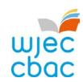
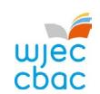
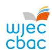
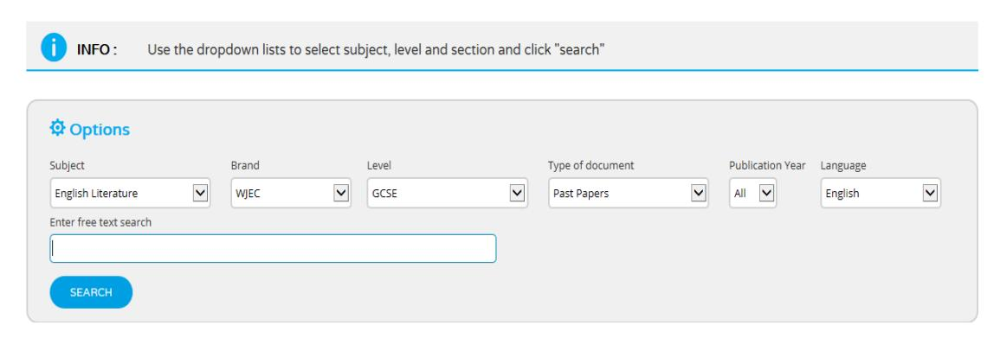
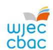
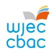
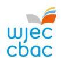

{0}------------------------------------------------

# GCSE English Language and Literature Newsletter

Teaching from 2025 | For award from 2027

## September 2025

Welcome back. We hope you have had a good summer and are returning refreshed for the new term – and the teaching of our new qualification!

- 1. [NEW GCSE English Language and Literature Update](#page-0-0)
- 2. [Resources](#page-1-0)
- 3. [Professional Learning](#page-2-0)
- 4. [Have you considered becoming an Examiner?](#page-2-1)
- 5. [Key dates](#page-8-0)
- 6. [Contact us](#page-3-0)

### 1. NEW GCSE English Language and Literature Update

As we work through the early stages of the new GCSE English Language and Literature qualifications, please do keep in touch with the subject team with your queries and observations, telling us what you need and what you like, so we can ensure that you are confident in your delivery and put our resources into making you feel confident and wellsupported.

September 2024 was the final time centres should have begun delivery of a two-year course for the WJEC GCSE legacy qualifications.

From September 2025, learners must not be entered into these legacy GCSEs in Year 10 in subjects where reformed GCSEs are available.

The NEA briefs for Units 2 and 3 were published on the WJEC Portal in April and the Unit 5 NEA brief in June 2025. Details of the conditions relevant to task-setting, task-taking and task-marking are published in each unit's brief. Further details around the NEA tasks and marking will be provided through the autumn term and part of WJEC's continuing Professional Learning programme.

As a reminder, the first examination available to learners will be Unit 1 in summer 2026, with Units 1 and 4b available in November 2026. All examined units will be available in summer 2027 and for each series thereafter.

{1}------------------------------------------------

### 2. Resources

For the new qualification, there are a wide range of engaging resources tailored to support you in delivering the WJEC English Language and Literature GCSE. These can be found on the [Digital Resources](https://resources.wjec.co.uk/en) page.

Our Blended Learning Resources and Knowledge Organisers are designed to complement traditional face-to-face teaching with an online learning pack that allows learners to work at their own pace. They can be used as revision tools, as part of catch-up, or for flipped learning.

Our Blended Learning Resources can be accessed here:

[Creative Writing](https://blended-learning.resources.wjec.co.uk/en/mfw23-24_2-21)

[Non-Fiction Writing](https://blended-learning.resources.wjec.co.uk/en/mfw23-24_2-22)

[Non-Fiction: Diversity](https://blended-learning.resources.wjec.co.uk/en/mfw23-24_2-17)

[Non-Fiction: Human Rights](https://blended-learning.resources.wjec.co.uk/en/mfw23-24_2-16)

[Non-Fiction: Relationships](https://blended-learning.resources.wjec.co.uk/en/mfw23-24_2-15)

[Non-Fiction: Wales and Global Contexts](https://blended-learning.resources.wjec.co.uk/en/mfw23-24_2-19)

[Non-Fiction: Work and Sustainability](https://blended-learning.resources.wjec.co.uk/en/mfw23-24_2-18)

Play: *[A Midsummer Night's Dream](https://blended-learning.resources.wjec.co.uk/en/mfw23-24_2-6)*

Play: *[Pygmalion](https://blended-learning.resources.wjec.co.uk/en/mfw23-24_2-9)*

Play: *[An Inspector Calls](https://blended-learning.resources.wjec.co.uk/en/mfw23-24_2-20)*

[Play](https://blended-learning.resources.wjec.co.uk/en/mfw23-24_2-11) *DNA*

Play: *[Leave Taking](https://blended-learning.resources.wjec.co.uk/en/mfw23-24_2-10)*

Play: *[Refugee Boy](https://blended-learning.resources.wjec.co.uk/en/mfw23-24_2-8)*

Play: *[The Importance of Being Earnest](https://blended-learning.resources.wjec.co.uk/en/mfw23-24_2-7)*

[Poetry: Children and Parents](https://blended-learning.resources.wjec.co.uk/en/mfw23-24_2-5)

[Poetry: Conflict](https://blended-learning.resources.wjec.co.uk/en/mfw23-24_2-3)

[Poetry: Identity](https://blended-learning.resources.wjec.co.uk/en/mfw23-24_2-2)

[Poetry: Relationships](https://blended-learning.resources.wjec.co.uk/en/mfw23-24_2-1)

[Poetry: The Natural World](https://blended-learning.resources.wjec.co.uk/en/mfw23-24_2-4)

Prose: *[Animal Farm](https://blended-learning.resources.wjec.co.uk/en/mfw23-24_2-14)*

Prose: *[My Name is Leon](https://blended-learning.resources.wjec.co.uk/en/mfw23-24_2-12)*

Prose: *[Pigeon](https://blended-learning.resources.wjec.co.uk/en/mfw23-24_2-13)*

Our Knowledge Organisers can be accessed here:

[Unit 1: Poetry \(Context and Meaning\)](https://filter.resources.wjec.co.uk/en/English%20Language%20and%20Literature/r/mfw23-24_2-1/KO/MFWGCSE) 

[Unit 4a: Drama \(Motivations\)](https://filter.resources.wjec.co.uk/en/English%20Language%20and%20Literature/r/mfw23-24_2-9/KO/MFWGCSE) 

[Unit 4b: Drama \(Motivations\)](https://filter.resources.wjec.co.uk/en/English%20Language%20and%20Literature/r/mfw23-24-2-13/KO/MFWGCSE) 

[Unit 4b: Prose \(Motivations\)](https://filter.resources.wjec.co.uk/en/English%20Language%20and%20Literature/r/mfw23-24_2-13/KO/MFWGCSE) 

[Unit 6: Non-Fiction \(Connections\)](https://filter.resources.wjec.co.uk/en/English%20Language%20and%20Literature/r/mfw23-24_2-16/KO/MFWGCSE) 

Sample [Assessment Materials](https://www.wjec.co.uk/qualifications/gcse-english-language-and-literature-double-and-single-award-teaching-from-2025/) are available within the Key Documents tab on the WJEC GCSE English Language and Literature subject page. These documents contain sample examination papers and detailed marking guidelines.

The [Guidance for Teaching](https://www.wjec.co.uk/media/w2rnp2g2/gcse-english-languagepluslit-gft-e-110225.pdf) document is designed to support teachers in the delivery of WJEC GCSE English Language and Literature. It is not intended as a comprehensive reference, but as support for teachers to develop stimulating and exciting courses tailored to the needs and skills of their learners. The guide offers course plans, possible classroom activities and links to useful resources (including our own, freely available digital materials) to provide ideas for immersive and engaging lessons.

### Guidance for Teaching spotlight: The Glossary

The glossary is provided within the Guidance for Teaching as a guide to support teachers and learners. It defines terms that will be useful in preparing learners for the WJEC GCSE English qualification; it is not intended to be definitive nor a checklist. Hopefully, teachers will see the glossary as a suggestion of the terms that could be introduced to learners to help them develop their analytical toolkit.

Learners will not be credited for feature-spotting but should know some of the terms provided to engage better with how meaning has been constructed and to comment

{2}------------------------------------------------

productively on the effects such features create. In turn, they will then be able to deliberately and effectively employ the features in their own writing and speaking.

The key terms have been grouped to support understanding and planning when tackling specific areas of learning.

# 3. Professional Learning

The materials from the pan-Wales Preparing to Teach clusters are available on Portal. Included in these materials is the Spoken Language session with an audio commentary, offering an overview of ways to teach the spoken language elements of the new qualification.

Exam Walkthroughs and NEA Walkthroughs are now available on Portal. These resources offer practical hints and tips on how to effectively approach questions in the examination papers and the NEA. Using questions from the Sample Assessment Materials, the PowerPoint with audio help and audio script in the notes will walk learners through the assessments, helping them revise and practise useful exam techniques.

### Blended Learning + Online workshops (English Medium)

An introduction to WJEC Blended Learning+ (our new teaching and learning platform to complement the Made-for-Wales qualifications)

Join us for an informative online workshop where we will introduce you to our brandnew Blended Learning+ platform. This brand-new platform has been developed to enable teachers to create and edit teaching and learning resources for the new GCSE/L2 qualifications. The session will provide a detailed outline of all the platform's essential features and functionalities, ensuring you understand how to maximise its potential.

- − Monday 22 September 4-5pm
- − Monday 29 September 4-5pm

### WJEC GCSE English Language and Literature: Preparing to Assess Unit 2, Unit 3 and Unit 5

These online courses are designed for practitioners preparing to mark the internally assessed Unit 2, Unit 3 and Unit 5 of the new GCSE English Language and Literature.

The three separate sessions will focus on the requirements of the NEA, the assessment objectives and highlight key points from the mark scheme(s)/marking bands. There will also be an opportunity to explore exemplar, created specifically for illustrating approaches to marking.

### Outcomes for delegates:

- Understand mark schemes/bands and assessment objectives in preparation for marking.
- An opportunity to put questions to our subject experts.
- An opportunity to explore and review marking of NEA based on exemplar.
- Further support teaching and learning.
- − Unit 2: Tuesday 7 October (4-6pm)
- − Unit 3: Tuesday 14 October (4-6pm)
- − Unit 5: Tuesday 21 October (4-6pm

These events are free of charge and will be delivered on Microsoft Teams. If your preferred event is closed for online bookings, please email the Professional Learning Team [\(cpd@wjec.co.uk](mailto:cpd@wjec.co.uk) / [dpp@cbac.co.uk\)](mailto:dpp@cbac.co.uk) to book or make an enquiry.

### 4. Have you considered becoming an Examiner?

{3}------------------------------------------------

We are keen to appoint new examiners for WJEC GCSE English Language and Literature. Examining is an excellent way of learning more about the requirements of the exam, thus supporting your learners and developing your skills. It also provides a useful additional income. For further details, please see the [Appointees section](https://www.wjec.co.uk/home/appointees/) of the website.

### 5. Key dates

- 17 March 2026: Deadline for Unit 2 NEA work to be with moderator following submitting marks on IAMIS (mainstream centres)
- 24 March 2026: Deadline for Unit 3 NEA work to be with moderator following submitting marks on IAMIS (mainstream centres)
- 5 May 2026: Deadline for PRUs, FE colleges and special schools only Unit 2 and Unit 3 NEA work to be with moderator following submitting marks on IAMIS
- 15 May 2026: GCSE English Language and Literature Unit 1 Examination

# 6. Contact us

### Kirsten Wilcock

Subject Officer GCSE English Language and Literature

### Philippa Wilson

Subject Adviser GCSE English language and Literature

### Christelle Bazin

Subject Support Officer GCSE English Language and Literature

[gcseenglish@wjec.co.uk](mailto:gcseenglish@wjec.co.uk)

@WJEC\_English

{4}------------------------------------------------

# LEGACY GCSE English Language and GCSE English Literature Newsletter September 2025

Welcome back. We hope you have had a good summer and are returning refreshed for the new term.

- 1. [Summer 2025 Results](#page-4-0)
- 2. [Analysing Candidates' Results](#page-5-0)
- 3. [Principal Examiners' Reports](#page-5-1)
- 4. [Autumn 2025 Examinations](#page-4-1)
- 5. [Resit opportunities](#page-6-0)
- 6. [Resources](#page-1-0)
- 7. [Have you considered becoming an Examiner?](#page-2-1)
- 8. [Key dates](#page-8-0)
- 9. Next newsletter

### 1. Summer 2025 Results

GCSE results in English Language and English Literature were published in August. The papers and mark schemes are now available to view on our [Portal.](https://www.wjecservices.co.uk/login.asp) If you don't have access, please contact your exams officer. To locate them, select 'Past Papers & Marking Schemes' from the 'Resources Menu' on the left-hand side of the screen:

Then use the dropdown menus to choose the papers or marking schemes that you are looking for:

{5}------------------------------------------------

Remember that 26 September is the last date for receipt of applications for Reviews of Marking and Reviews of Moderation (ROMMAs) and for the request of electronic copies of scripts for teaching and learning purposes. Please see our [website f](http://www.wjec.co.uk/exam-officers/post-results-service/)or more details.

If you haven't already seen your NEA moderation report, you can access this via the secure [Portal.](https://www.wjecservices.co.uk/login.asp?referer=/welcome.asp?&typ=) Click on 'Internal Assessment' then the relevant examination series (e.g. GCSE English Literature Summer 2025) and you will be able to 'View Moderator Report'. Moderators' reports can only be downloaded until the 31 December 2025.

For the summer 2025 series, a free, unannotated scripts service is available for GCSE English Language (3700U20-1 and 3700U30-1) and GCSE English Literature (3720U10-1, 3720UA0-1, 3720U20-1, 3720UB0-1, 3720U30-1 and 3720UC0-1). Centres can download scripts on behalf of candidates via WJEC Portal which also includes instructions on the process.

### 2. Analysing Candidates Results

WJEC offers two services to help you understand your learners' results and develop their exam skills: Exam Results Analysis and Online Exam Review.

Exam Results Analysis on the [Portal](https://www.wjecservices.co.uk/login.asp) allows you to compare your learners' performance on each question with that of the candidature overall, letting you see where they have done well and where there might be room for improvement. To do this, under the 'Results' tab, click on 'View/Print Item Level Data' or 'View/Print Centre Performance' for comparable data.

[Online Exam Review](http://oer.wjec.co.uk/) provides a number of marked exemplars, from previous years, of candidate responses to key questions in an interactive format. These allow learners to mark others' work and discuss ways in which it may be improved, thus developing their own skills. There will be no exemplars from 2025 for the legacy qualifications but exemplars from the Summer 2024 examinations are available on the [Portal](https://www.wjecservices.co.uk/login.asp) for GCSE English Language and GCSE English Literature.

{6}------------------------------------------------

### 3. Principal Examiners' Reports

The Principal Examiners' reports for GCSE [English Language](https://www.wjec.co.uk/umbraco/surface/blobstorage/download?nodeId=53231) and [English Literature](https://www.wjec.co.uk/umbraco/surface/blobstorage/download?nodeId=53232) provide feedback on the previous series and are available on the website subject pages. Please read them carefully as they provide helpful observations and commentary on candidates' performance across the examined series that could help prepare learners for the next series. Each report has a handy bullet pointed list at the end of each section to summarise key point and areas of concern and success as well as links to useful resources at the beginning of the report.

### 4. Autumn 2025 Examinations

The GCSE English Language Unit 1: Oracy submission deadline is 5 November and centres will have to upload their learners' Individual Researched Presentations and Group Discussions via Surpass, along with the new [record keeping mark sheets](https://www.wjec.co.uk/umbraco/surface/blobstorage/download?nodeId=5092) and any notes that were used during the assessments. For learners wishing to re-sit the qualification after entering it in the summer, a carry-forward of marks is available as outlined in the specification.

IAMIS opens for the submission of marks on 22 October; samples should be with the moderator by 5 November.

The Unit 2 examination is [timetabled](https://www.wjec.co.uk/media/ndtpxzno/november-2025-wjec-plus-eduqas-gcse-final-exam-timetable-v1-250924.pdf) for the morning of 3 November and the Unit 3 examination is timetabled for the morning of 5 November.

The publication of results for the Autumn 2025 examination series will be 8 January.

### 5. Resit opportunities

September 2024 was the final time centres should have begun delivery of a two-year course for the WJEC GCSE legacy qualifications.

Summer 2026 will be the final full assessment opportunity for WJEC GCSE English Literature. There will be a final resit opportunity for the examinations available in January 2027 subject to demand. The resit opportunity will only be available to post-16 candidates who have previously cashed-in the qualification prior to January 2027.

WJEC GCSE English Language will have a resit opportunity in November 2026 and June 2027. The resit opportunities will only be available to post-16 candidates who have previously cashed-in the qualification prior to November 2026.

From September 2025, learners must not be entered into these legacy GCSEs in Year 10.

{7}------------------------------------------------

### 6. Resources

For both of our GCSE English qualifications, our teams have created many digital resources that will offer invaluable support in preparing learners for their assessments.

### English Language

A wide range of free digital resources has been developed to support the teaching and learning of WJEC GCSE English Language and these are available from our *[Educational](https://resources.wjec.co.uk/Pages/ResourceByArgs.aspx?subId=11&lvlId=2)  [Resources](https://resources.wjec.co.uk/Pages/ResourceByArgs.aspx?subId=11&lvlId=2)* website.

- [Reading skills](https://resources.wjec.co.uk/Pages/ResourceSingle.aspx?rIid=4002)
- [Word meaning](https://resources.wjec.co.uk/Pages/ResourceSingle.aspx?rIid=4001)
- [Analysing text](https://resources.wjec.co.uk/Pages/ResourceSingle.aspx?rIid=3998)
- [Implied meaning](https://resources.wjec.co.uk/Pages/ResourceSingle.aspx?rIid=3987)
- [Summarising information](https://resources.wjec.co.uk/Pages/ResourceSingle.aspx?rIid=3986)
- [Comparison](https://resources.wjec.co.uk/Pages/ResourceSingle.aspx?rIid=3969)
- [Synthesis](https://resources.wjec.co.uk/Pages/ResourceSingle.aspx?rIid=3968)
- [Editing](https://resources.wjec.co.uk/Pages/ResourceSingle.aspx?rIid=3955)
- [Sequencing information](https://resources.wjec.co.uk/Pages/ResourceSingle.aspx?rIid=3945)
- [Identifying and retrieving](https://resources.wjec.co.uk/Pages/ResourceSingle.aspx?rIid=3826)
- [Technical accuracy](https://resources.wjec.co.uk/Pages/ResourceSingle.aspx?rIid=3819)
- [Developing detail](https://resources.wjec.co.uk/Pages/ResourceSingle.aspx?rIid=3810)
- [Exam writing tasks](https://resources.wjec.co.uk/Pages/ResourceSingle.aspx?rIid=3756)
- [Structuring a response](https://resources.wjec.co.uk/Pages/ResourceSingle.aspx?rIid=3743)
- [Proofreading](https://resources.wjec.co.uk/Pages/ResourceSingle.aspx?rIid=3740)
- [Planning](https://resources.wjec.co.uk/Pages/ResourceSingle.aspx?rIid=3735)

Our Digital Resources site also houses a collection of [Knowledge Organisers,](https://educationalresources.wjec.co.uk/en/English%20Language?types=KO) which could be used for revision or as a starting point for creating your own knowledge organisers. Explore our series for GCSE English Language here.

We also have [Exam Walk-Throughs,](https://educationalresources.wjec.co.uk/en/English%20Language?types=EWT) aimed at learners, for each examined unit. These resources offer practical hints and tips on how to effectively approach questions in the examination paper. Using questions from past exam papers, the PowerPoint with audio help and audio script in the notes will walk learners through a mock examination paper, helping them revise and practise useful exam techniques.

### English Literature

There are a wide range of new and engaging resources tailored to support you in delivering WJEC GCSE English Literature. These can be found on the [Resources](https://www.wjec.co.uk/qualifications/english-literature-gcse/?sub_nav_level=digital-resources#tab_resources) tab on the website.

Under [Digital Resources,](https://resources.wjec.co.uk/Pages/ResourceByArgs.aspx?subId=56&lvlId=2) you will find: our interactive [Blended Learning Resources,](https://educationalresources.wjec.co.uk/en/English%20Literature?types=BL&level=KS4) our [Knowledge Organisers](https://educationalresources.wjec.co.uk/en/English%20Literature/r/2686) and [Exam Walk Throughs](https://educationalresources.wjec.co.uk/en/English%20Literature/r/2483) for each of the English Literature examinations.

{8}------------------------------------------------

### 7. Have you considered becoming an examiner?

As the entries for WJEC GCSE English Language and GCSE English Literature grow, we are keen to appoint new examiners. Examining is an excellent way of learning more about the requirements of the exam and thus supporting your learners and developing your skills. It also provides a useful additional income. For further details, please see the [appointees](http://www.wjec.co.uk/appointees/) [section](http://www.wjec.co.uk/appointees/) of the website.

### 8. Key dates

Key dates for the coming year have been posted on the WJEC website:

- [GCSE English Language](https://www.wjec.co.uk/qualifications/english-language-gcse/#tab_keydocuments)
- [GCSE English Li](https://www.wjec.co.uk/qualifications/english-literature-gcse/#tab_keydocuments)terature
- [Entry Level](https://www.wjec.co.uk/qualifications/english-entry-level/#tab_keydocuments)

### 9. Next newsletter

The next issue will be sent out in January. In the meantime, if you have any questions, please get in touch.

### Kirsten Wilcock

Subject Officer GCSE English Literature

### Guy Melhuish

Subject Officer GCSE English Language

### Christelle Bazin

Subject Support Officer GCSE English Language & GCSE English Literature

GCSE English Language - 029 2240 4289 GCSE English Literature - 029 2240 4291 [gcseenglish@wjec.co.uk](mailto:gcseenglish@wjec.co.uk) @WJEC\_English