{0}------------------------------------------------

# WJEC GCSE English Language and Literature (Single and Double Award)

Approved by Qualifications Wales

Non-fiction Anthology: Unit 3 and Unit 6

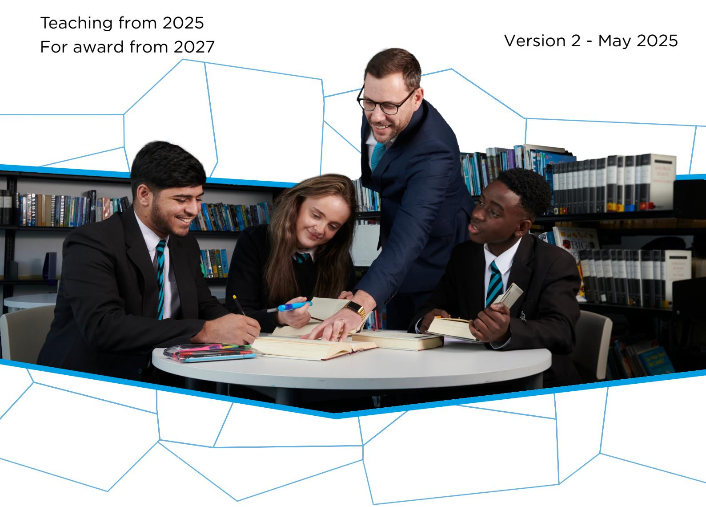

Ready for the world. This Qualifications Wales regulated qualification is not available to centres in England.

Made for Wales.

{1}------------------------------------------------

{2}------------------------------------------------

## SUMMARY OF AMENDMENTS

| Version | Description                                               | Page number |
|---------|-----------------------------------------------------------|-------------|
| 2       | Update to Text C: sports interview (2023) – error in text | 28 and 29   |

{3}------------------------------------------------

| Diversity                 | 1  |
|---------------------------|----|
| Human Rights              | 11 |
| Relationships             |    |
| Wales and Global Contexts | 25 |
| Work and sustainability   | 34 |
| Acknowledgements          |    |

{4}------------------------------------------------

## **Diversity**

**Text A** is adapted from an interview in *The Guardian* newspaper with Chris Packham. Chris Packham is a well-known TV presenter, photographer and naturalist. In this interview he talks about being autistic.

Growing up, the outspoken TV presenter became obsessed with animals as he struggled to navigate a world in which he felt he didn't fit.

Packham is a wonderful TV presenter – natural, knowledgeable and passionate. When he speaks to the camera, it feels easy and personal. So, it came as a surprise to many when he opened up about being autistic. Packham, a youthful 62, was only diagnosed in 2005. I'd assumed his condition must be relatively mild, but it doesn't take long to discover how much it has dominated his life, even if he and his parents never had the word for it.

He grew up in Southampton and to say he was difficult as a boy is an understatement. The young Packham was as bright as he was obstreperous. If he was in the middle of a project and his

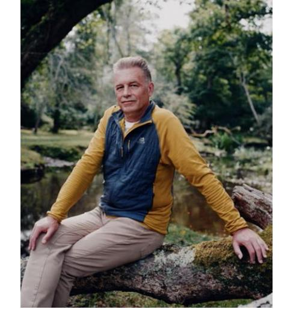

mother called him for dinner, he would refuse to eat until he had finished. He was obsessed with wild animals. "My parents lined my bedroom with tanks for me so I could keep all my snakes and lizards," he says. But his relationship with his mother was difficult. She struggled to understand him and he struggled to understand himself.

At school, he excelled in subjects he liked and refused to attend class for those he didn't. He describes how his dad would come to the school whenever there was an issue and they'd say, 'Look, he gets straight As in biology, history, geography, physics and chemistry, but he refuses to go to French lessons and won't do religious education – what's going on?' So, his dad would tell him to 'Just go and sit there.' But he couldn't.

Did fellow students think he was a freak? "Yeah." Did he think he was a freak? "Yeah I did, and I didn't want to be a freak, and it made me really angry." With himself or others? "Both. I didn't have a lot of time for my peers at that point. There was a lot of aggression. I wasn't good at controlling my temper. I subsequently learned to control it. When you're a kid and it seems it's you versus the world, you tend to lash out."

In his early years, Packham thought everybody was like him. "It was only when I got to my teens that it became clear that I was not the normal one." That generated an enormous amount of confusion, then anger, then self-loathing. I blamed myself for being broken." I want to give him a hug, but that's the last thing he needs. He's never enjoyed physical contact – let alone with a stranger.

What's difficult to grasp is how somebody so withdrawn from the human world could make such a successful career for himself in television. By his mid-20s, he was on The Really Wild Show. He looked so cool and confident – a peroxide-haired punk who seemed totally at ease with the world. Does he find it easier to talk to the camera than to people? "Yes. It's just a piece of glass. It's much easier. I trained myself to look at people in my 20s. I realised that was a social inconsistency, and I used to make lists of things I needed to do. I suppose it's the evolution of my masking, I was trying to hide aspects of the condition that

{5}------------------------------------------------

other people found disturbing." You're not looking at me now, I say. Packham lifts his eyes from the table. I prefer it when you're not masking, I say.

Does he socialise? "I remember Charlotte, my girlfriend, saying to me, soon after we met, 'Let's go and see so and so,' and I said, 'Why?' She said it would be nice to see them, and I said, 'But what for?' Why would I give up my time just for the purpose of seeing them unless they've got something interesting to tell me or we've something to do. What's the point?" His words sound callous, mercenary even, but his tone is tender.

It's time to leave. My urge to give him a hug is growing by the second. But I resist. He's such a brilliant, sensitive soul, but it must be hard work being Chris Packham. Well, I say, you may not like yourself very much, but I think you're a lovely man. He could be masking, but he seems genuinely pleased. "Oh, that's very kind of you." He almost looks me in the eye. "I wish my mum was here to hear that."

{6}------------------------------------------------

**Text B** is taken from a review of the Channel 4 TV documentary 'Rosie Jones: Am I a R\*tard?'. Rosie Jones is a well-known comedian who was the subject of a shocking documentary which explored disability trolling.

The comedian reveals the levels of ableist hate she has to put up with – and how fixing it is the responsibility of all of us.

"I said to Channel 4, let's use that word [r\*tard] in the title," says comedian Rosie Jones in the intro to this powerful documentary about the ableist abuse she receives. "And then, hopefully," she adds, levelling her gaze at the camera imploringly, as if to say: now that I've got your attention, please, listen, "by the end of this film, people will think twice before ever using [it] again."

We see Rosie walk outside with her headphones on, her voiceover explaining that they are a tool she uses to drown out the daily abuse she faces while walking down the street. Meanwhile, social media comments flash up on the screen, illustrating the kind of hate speech she is regularly greeted with online: from the disgusting slur "you are a retard" to the less overt, but still incredibly offensive, "window licker" and "the crowd drenched in dribble". Is there any escape for Jones, you begin to wonder? Is there a safe place for her to exist?

The reality is no, not really – at least not when ableist abuse is not taken seriously. "Every time I'm on something, there will be a comment about what I look like or what I sound like," she says, as more comments flash across the screen, each progressively more violent than the last: "She should be in a cage", "[she] deserves to die" and, finally, a graphic rape threat. She pauses, visibly affected by those words, and says she still thinks about that message a lot.

This documentary paints a sobering picture of what it is like for Jones as a disabled woman in the public eye. The constant harassment she is subject to simply for existing in the media is so undeniably violent, and while for many social media can be an escape from the viciousness of the outside world, for people like Jones, it seems it's just another way for bullies to reach them.

We see her meet a representative from a company that has been filtering the comments she receives, and he shows her all the offensive remarks on her appearance, her speech impediment and her disability that they have screened. Dispirited, she gazes at them. "Every negative thought I've ever had about myself, I can go online and find strangers saying it back to me," she says sadly.

She reports an abusive Twitter comment and receives an auto-response saying it isn't in violation of its rules, despite those very rules stating that they don't tolerate discrimination on the grounds of disability. So, Rosie Jones does what Rosie Jones does best – turns a sad situation into a bit of light relief comedy. She delivers a giant cookie to Twitter HQ in London, using icing to ask the same question as the documentary's title, with her Twitter handle @josierones.

{7}------------------------------------------------

In the next, particularly heartbreaking scene, Jones visits the parents of a disabled child, Lydia, who died a few years ago. Prior to Lydia's death, her parents received online ableist abuse concerning their efforts to fundraise for potentially life-saving surgery. They included messages from strangers that suggested they would be better off terminating their child's life, rather than trying to save it. "All they wanted was for their daughter to survive," Jones says tearfully, branding those who sent the messages as monsters.

On her way home, she receives an email from Twitter saying that they have locked the account from which the abusive message she reported was sent. But instead of feeling triumphant, the comedian says she is livid: "What about all the other disabled people who report tweets? Does it take a biscuit for people to stop calling us this?"

The personal gets political when Jones speaks to a tech expert, who says the direction of travel on social media, especially on Twitter since Elon Musk's takeover, has meant more free speech – much of which, he says, comes "perilously close to hate speech". Another expert tells her that social media platforms are reluctant to crack down on abusive content because it drives more traffic to their platforms. In other words, they won't do anything because hateful content makes money.

Ultimately, Jones discovers that hurt people hurt people, and there are a lot of hurt people in the world. Social media platforms are failing to protect disabled users, so it's up to us, she says. "I think we need to start another movement. This one is so simple: Stop Ableism. That's it." She urges viewers to call out any ableism they witness, online or off. After painting such a visceral account of the impact ableism can have on disabled people and their families, we'd surely be monsters to ignore her.

{8}------------------------------------------------

**Text C** is taken from Elliot Page's autobiography *Pageboy: A Memoir*. Elliot Page is an award-winning Canadian actor, activist and transgender man.

"Can I be a boy?" I asked my mother at six years old.

We lived on Second Street at the time, having moved only a few minutes' walk from our previous attic apartment on Churchill Drive. A ground-level flat on a tree-lined street, it had two bedrooms, hardwood floors, and a lovely small living area with big windows. I'd sit in front of the TV for hours playing Sega Genesis–*Aladdin, NHL '94*, *Sonic the Hedgehog*– praying to God when my back was against the ropes, requiring the all-magnificent force to help me beat the game. There are no atheists in foxholes.

"No, hon, you can't, you're a girl," my mother responded. She paused, not moving her eyes from the dish towels she was methodically folding, before saying, "But you can do anything a boy can do." One by one, stacking them neatly in their place.

It reminded me of how she looked when ordering a Happy Meal for me at McDonald's. I insisted on the 'boys' toy' every time–a delightful, congenial bribe. My mother's discomfort requesting the toy was palpable, releasing a sort of shy giggle, slivers of shame peering through. Often they gave the girls' one anyway.

At ten, people started addressing me as a boy. Having won a yearlong battle to cut my hair short, I started to get a "thanks, bud" when holding the door for someone at the Halifax Shopping Centre.

It was unfathomable to me that I wasn't a boy. I writhed in clothes that were even in the slightest bit feminine. Everyone around me saw a different person than I saw, so for much of my childhood I preferred to be alone. I played by myself extensively. "Private play," I called it.

"Mom, I'm going to have private play now," I'd say as I marched up the stairs to my room, closing the door behind me.

I loved action figures–Batman and Robin, Hook and Peter Pan, Luke Skywalker, two Barbies from Happy Meals whose hair I'd cut off. The 'girl toy' making it into the bag, despite the 'boy toy' request. I was a walking stereotype, just not in the way my mom wanted.

Disappearing into private play for hours, I'd build forts on my bunk bed. It was metal, bars lined the bottom of the top bunk, and I would hang blankets and towels, making rooms. A little kitchen, and miniature bedroom. Vanishing into intricate and impassioned narratives, danger lurked, I'd hang off the top bunk, as if dangling from a cliff, facing death, using all my might to pull myself up to safety.

Imagined romances bloomed. I would write love letters to my fake girlfriend from across the lava floor, always signing, *Love, Jason*. I would tell her about my adventures abroad, how I longed for her, cared for her, that I needed her in my arms.

Those were some of the best times of my life, travelling to another dimension where I was... me. And not just a boy but a man, a man who could fall in love and be loved back. Why do we lose that ability? To create a whole world? A bunk bed was a kingdom, I was a boy.

{9}------------------------------------------------

#### **Text D: diversity speech to the House of Commons (2017)**

The transcript below is taken from a speech given in Parliament in 2017 as part of Channel 4's 360 Diversity Charter. In this extract, actor, musician and activist Riz Ahmed talks about the importance of diverse representation. He gives his opinions on the difference between diversity and representation, what happens when people feel they are not represented, and the importance of acting together to make a difference.

R: Riz Ahmed

R um I know we all (.) gathered here to address some really important pressing **urgent** questions and I think chief among those **really** pressing (.) urgent questions both in **your** mind and in **mine** is what the **hell** am I doing here? well (.) in er an age where reality TV stars can become American presidents perhaps our (.) typically restrained British equivalent is to just let an actor (.) address (.) politicians (.) I mean uhh like it or not (.) there's a lot more that actors and politicians (.) have in **common** (1) we (.) both (.) have a big hand in shaping **culture** (1) and we both do that the same way by telling **stories** (1) but (.) even in those **stories** (.) what people are looking for (.) is a message that they **belong** (2) that they're **part** of something (2) that they are **seen** and **heard** and that **despite** (.) or perhaps **because** of the uniqueness of their experience they are **valued** (.) they want to feel **represented** (2) that's really what we **do** that's what we have in **common** (1) we're here to **represent** (1) it's that simple (2) **and** in that task it pains me to say (.) we **have failed** (3) it's been a noble failure we've been taking **large** strides in the right direction (1) sometimes (.) a bit **slower** than we'd like sometimes not really (.) **seizing** the bull by its horns but (1) we have fallen **short** of the mark (.) and when we **fail** to represent people switch off (2) they switch off on **telly** (1) they switch off at the **ballot** box (1) and they **retreat** to other **fringe** narratives which are sometimes very dangerous (2) whether we like it or not a **new** (.) **national** story is being written right now (1) about who we **are** (2) the story we tell to **ourselves** and we **tell** to the world about who we are as Britain tries to (.) **redefine** its (.) place in the world really matters (1) will it be a story that looks **inwards** (.) and **backwards**? (1) will it be a story that looks **outwards** (.) and (.) ahead to the future? as **thousands** of qualified doctors and nurses (.) **huddle** on our shores as refugees do we spot a **threat** or an **opportunity**? (2) when (.) Nollywood explodes (.) **and** (.) China dominates the international box office do we think okay too much competition let's retreat back to our tried and tested formula of all-white period drama (.) **or** (1) do we spot an opportunity? (1) do we have a look at the multicultural **goldmine** we're sitting on (.) and spot an opportunity? we're in search of a new national story (.) the old one (.) stopped making **sense** to people (.) it stopped giving **meaning** and I'm here to ask for your **help** (1) in finding (.) a new national story that **embraces** and **empowers** as many of us as possible (.) rather than **excluding** us and **alienating** (.) large sections of the population (1) in **this** (.) we need each other (2) **now** (1) I just want to take a moment to kind of reframe what we're talking about (3) what's at **stake** here (.) in this age of populism it can sometimes seem like (.) talking about **diversity** is kind of (.) swimming against the current going against the grain it's (1) it's political correctness gone **mad** (.) and all that kind of thing right (.) it's er it's an added extra it's a frill it's a luxury (.) **that's** what diversity can sound like the (.) the very **phrase** actually (.) turns me off a little bit it sounds like there's a there's a little bit of something you can sprinkle on top (.) a little bit of salt (1) a little bit of spice (.) it's er (.) something you can live **with** but you can also live **without** (1) and to me that (.) really doesn't put into focus how **crucial** what we are talking about **really** is (.) we're talking about **representation** (.) representation is not an **added** extra (1) it's not a **frill** it's absolutely **fundamental** to what people **expect** from culture **and** from politics (4) after the Brexit vote hate crimes went up forty-one per cent (1) against

{10}------------------------------------------------

Muslims they went up **three hundred and twenty-six** per cent (2) in the 1930s (.) we had (.) a very similar situation to what we have **today** political polarisation economic disenfranchisement after a big financial crash rising inequality systematic scapegoating of certain minorities (1) what's at **stake** here (.) is whether or not (.) we will move forwards **together** (1) or whether we will leave people **behind** (2) if we don't **step up** and **represent** (2) now (.) I think we're in danger of losing out in three ways (1) one is we're going to lose people to **extremism** (2) second (.) we're going to lose out on an **expansive** idea of **who** we are as **individuals** and as a **community** (.) and thirdly we're going to really lose out on the **economic benefits** (1) let me just start this first point I remember when um my mum and my sister here **right** now and I remember when we all um when they'd be watching tv downstairs in the lounge I'd be upstairs y'know playing my Gameboy or whatever and all of a sudden I'd **hear** (.) one of them call out (.) when they're watching tv (.) ASIAN (3) and you'd quickly press pause on the Gameboy and run downstairs just to go and look at (.) **Sanjeev** Bhaskar on Goodness Gracious Me **Meera Syal** (.) **Bhaji** on the **Beach** (.) Parminder **Nagra** (.) Bend it Like Beckham **Jimi** Mistry East is East (.) if you're **used** to seeing yourself reflected in culture (.) you **really** (.) I **really** want you to just take a **minute** to to kind of understand how much it **means** (.) to someone who **doesn't** (.) see **themselves** reflected **back** (1) every time you **see** yourself in a magazine a billboard tv film (2) it's a message that (.) that you **matter** (.) you're part of a national story that you're **valued** (1) you feel **represented** (1) now (.) if we **fail** (1) to represent people (.) in our **mainstream** narratives they'll switch off they'll retreat to **fringe** narratives (2) it's not just important to show people **themselves** and to send a signal that they are (.) **valued** and **worthwhile** and represented (.) it's also **really** important I think to **show** (.) people (.) **characters** (.) and **stories** that don't resemble them at all (.) the power of **stories** to allow us to relate to experiences that don't resemble our own is **phenomenal** (.) and every time we **see** those experiences it **reminds** us that what **unites** us is far far greater than what **divides** us (2) culture is a place where you can put yourself in someone else's **shoes** (1) and a **one**-size shoe shop just doesn't make any sense (3) over a **million** Indians fought and died for Great Britain in World War One no one ever told me that at school (1) we never learned about the British Empire we never learned about whose blood sweat tears hopes and fears are **baked** into the bricks in this building (1) if we **did** learn about that then maybe we wouldn't think about diversity and throwing people crumbs out of **politeness** maybe we'd think about giving people their **due** (1) and **representing** them (2) it was only recently that I learned the first Indian MP was in the 1850s the first black footballer was in the 1860s Edward the Seventh had a black trumpeter ironically named (.) John Blanke (1) and er actually **even** our England's first border **patrol** force was a North African legion (1) fighting for the **Italian** Roman army (.) to keep the **Scots** on the other side of Hadrian's Wall so even our anti-immigration movement has been really multicultural for **thousands** of years (2) that's how deep it goes (1) so (.) I think we need to (.) kind of (.) take a leaf out the book of our music industry (2) drum and base (1) grime (.) dubstep (.) these are (.) **world-conquering** musical genres that are only possible by tapping into our multiculturalism (2) and (.) just (.) once again to reiterate that this is about the bottom line the creative industries make up **seven** (.) **per cent** of our GDP (3) we're really at a very **critical** moment in our nation's history (.) if we don't step up (.) and tell a **representative** story (.) we're going to start **losing** people (1) to **other** stories (.) we're at this critical moment (2) let's not allow future generations to look back and judge us when centrifugal forces (.) are threatening to tear us apart because they **really** are (.) I can **feel** it (.) and I know a lot of you can too (1) we need you to **step** up **decisively** and **act** (2) let's do what's **right** (.) let's **represent** (.) thank you very much

{11}------------------------------------------------

**Text E** is non-continuous text produced by YouGov, a company that surveys public opinion and provides data. This text presents data gathered about the outdated terms 'BAME' and 'Minority Ethnic'.

## **How do ethnic minority Britons feel about the term 'BAME'?**

#### **What does BAME mean?**

The vast majority of ethnic minority Britons (83%) say they understand the term BAME (Black, Asian and Minority Ethnic) very or fairly well, whilst 13% say they lack understanding. This uncertainty increases with age; 8% of those aged 18 to 24 have this view compared to 19% of those aged 65 and above.

Slightly more ethnic minority Britons say that they don't understand what is meant by the term 'Minority Ethnic' (17%). The youngest age group say they don't understand it, 23% of those aged 18 to 24; compared to 14% of 50-64 year olds and 15% of those aged 65 and above.

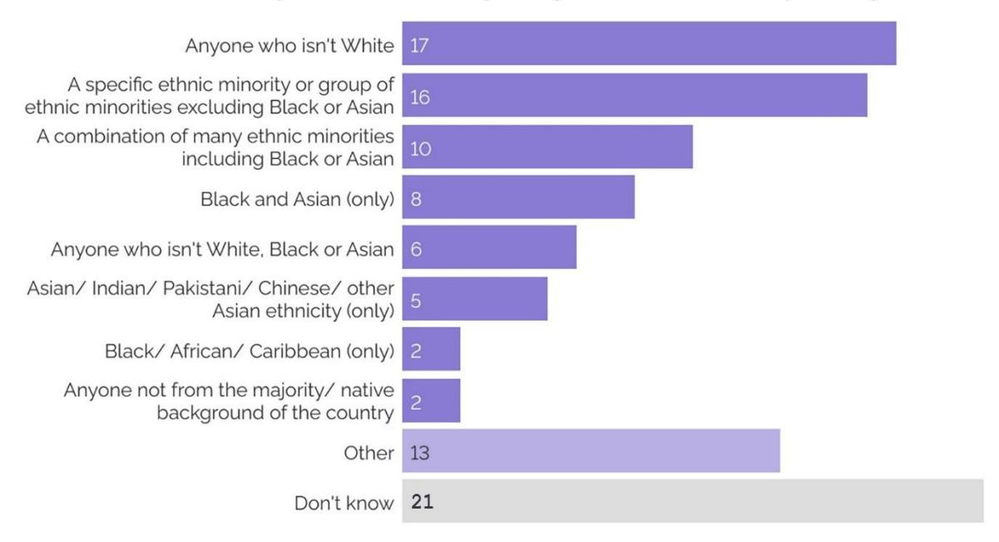

#### **Is it acceptable to use the term BAME?**

Attitudes here appear contradictory. While ethnic minority Britons tend to think it is acceptable to use as an umbrella term for the portion of the British population that is nonwhite (by 49% to 31%), it is not their preferred term, which goes to simply "ethnic minorities" by 58% to 27%.

8

{12}------------------------------------------------

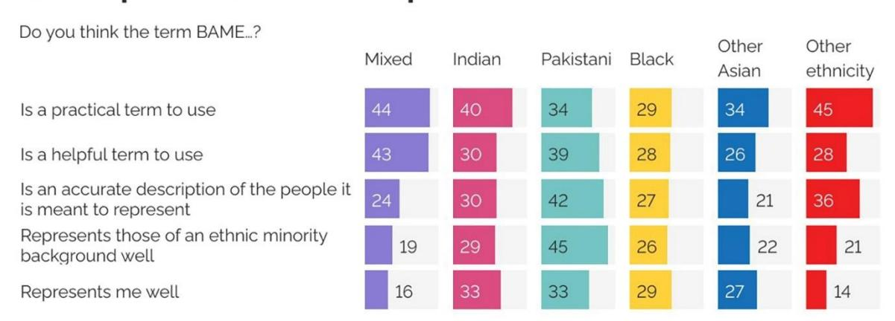

The tendency to see BAME as an oversimplification is clear across all ethnic groups. All ethnic groups tend to see the term as a short-term fix.

{13}------------------------------------------------

**Text F** is non-continuous text produced by TalentLyft, an online recruitment software company. This text suggests some benefits of workplace diversity.

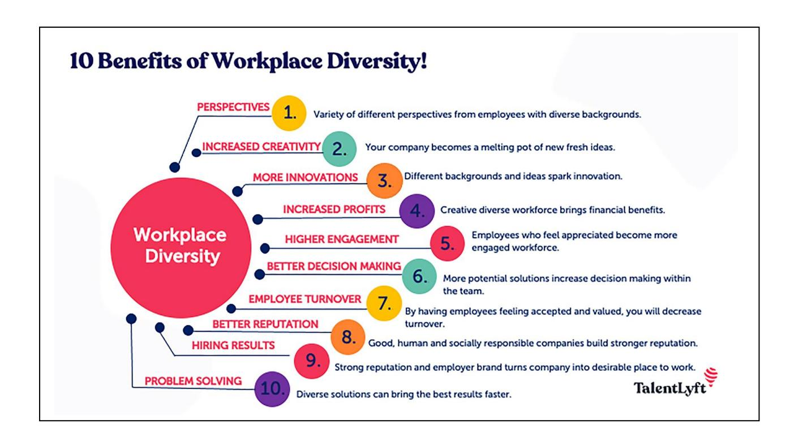

{14}------------------------------------------------

### **Human Rights**

#### **Text A: Reith Lectures, BBC Sounds (2022)**

The transcript below is an extract from the BBC Reith Lectures broadcast on Radio 4 and the World Service. Each year, there are four themed talks given by influential people that aim to encourage understanding and debate about contemporary issues. In this extract, bestselling Nigerian author Chimamanda Ngozi Adichie talks about freedom of speech. She explores her opinions on the power of words, what freedom of speech means in the twentyfirst century, and the effects of censorship and book bans.

#### C: Chimamanda Ngozi Adichie

C while I **insist** (.) that violence is never an acceptable response to speech I do not deny the power of words (.) to **wound** (.) words can **break** the human spirit (.) some of the **deepest** pain I have experienced in my life (1) have come from **words** (.) that somebody said (.) or wrote (1) and some of the most **beautiful** gifts I have **received** (.) have **also** been words (1) it is **precisely** because of this power of words that freedom of speech (.) matters (2) freedom of speech (1) even the **expression** itself has **sadly** taken on (.) a **partisan** tribal (.) tint it is often framed (.) and I will put it crudely (.) as (1) say whatever you want (.) versus (1) consider (.) the (.) feelings (.) of others (1) this (.) though (.) is **too** stark a dichotomy (1) I cannot keep count of all the books that have **offended** me (.) **infuriated** me (.) **disgusted** me (.) but I would never argue (.) that they not be published (1) when I read something scientifically **false** (.) such as (.) that drinking urine (.) cures cancer (1) or something (.) **gratuitously** (.) **hurtful** to human dignity (.) such as that gay people should be imprisoned for being gay (1) I **desperately long** to **banish** such ideas from the world (.) yet I **resist** advocating censorship (1) I take this position as much (.) for reasons of **principle** (.) as for practicality (1) I believe **deeply** in the **principle** of **free** expression and I **believe** this **particularly** because I am a writer and a reader and because literature is my **great** love and because I have been **formed** and **inspired** and **consoled** (.) by books (1) had any of those books been **censored** (1) I would perhaps (.) today (.) be lost (2) my practical reason (.) we could also call it my **selfish** reason (.) is that I **fear** the weapon I advocate to be used against someone else (.) might one day be used against me (1) what **today** (.) is considered benign (.) could very well become offensive tomorrow (.) because the suppression of speech is **not** so much about the **speech** itself (.) as it is the person (.) who **censors** (2) American high school boards are today engaged in a **frenzy** of book banning (.) and the **process** seems arbitrary (1) books that have been used in school curriculums for years with no complaints (.) have **suddenly** been banned in some states (1) and I understand that one of my novels (.) is in this (.) august (.) group. (2) I confess that there are some books I **would** fantasize about banning (1) books that **deny** the Holocaust (.) or the Armenian genocide (.) for example (.) because I **detest** (.) the denial (.) of history (1) but what if someone else's fantasy was to ban a book about (.) the Deir Yassin massacre of Palestinians by Zionists in 1948 (2) **or** a book about (.) the Igbo coalminers massacred in Nigeria by the British colonial government in 1949? (1) above principle and pragmatism however is the reality that censorship (.) very often does not achieve its objective (1) **my** first instinct (.) on learning that a book has been **banned** (1) is to seek it out and read it (2) and so (.) I would say (1) do not **ban** them (1) **answer** them (1) in this age of **mounting** disinformation all over the world (.) when it is **easy** to dress up a **lie so** nicely that it starts to take on (.) the **glow of truth** (.) the solution is **not** to hide the lie (.) but to **expose** it (.) and **scrub** from it i**ts false glow** (1) when we **censor** the purveyors of **bad** ideas (.) we **risk** (.) making them martyrs (.) and the **battle** (.) with a **martyr** (.) can **never** be won

{15}------------------------------------------------

**Text B** is an extract from the speech 'Is it a crime to vote?' given by Susan B. Anthony on the legal position of American women in 1873. It aimed to persuade people that women have a right to vote. Anthony was an American social reformer and feminist activist who played a key role in the American suffrage movement. In 1872, she was charged with breaking the law because she voted in an election. As a woman, she could not speak in court, so she used this speech (delivered in forty American towns) to spread her message before her trial began.

I stand before you to-night, under indictment for the alleged crime of having voted at the last presidential election, without having a lawful right to vote. It shall be my work this evening to prove to you that in thus voting, I not only committed no crime, but, instead, simply exercised my citizen's right. [text omitted]

One half of the people of this nation to-day are utterly powerless to blot from the statute books an unjust law, or to write there a new and a just one. The women, dissatisfied as they are with this form of government, that enforces taxation without representation – that compels them to obey laws to which they have never given their consent – that imprisons and hangs them without a trial by a jury of their peers – that robs them, in marriage, of the custody of their own persons, wages and children – are left at the mercy of the other half.

A year and a half ago, I saw a theatrical company, called the "Pixley Sisters," playing before crowded houses, every night of the whole week of the Walla Walla fair. The eldest of those three fatherless girls was scarce eighteen. Yet every night a United States officer stretched out his long fingers and clutched six dollars of the proceeds of the exhibition of those orphan girls, who, but a few years before, were half starvelings in the streets. So the poor widow, who keeps a boarding house, manufactures shirts, or sells apples and peanuts on the street corners of our cities, is compelled to pay taxes from her scanty pittance. I would that the women of this Republic, at once, resolve, never again to submit of taxation, until their right to vote be recognized. Amen.

All the papers served on me not one of them had a feminine pronoun printed in it; but, to make them applicable to me, the Clerk of the Court made a little caret at the left of "he" and placed an "s" over it, thus making she out of he. Then the letters "is" were scratched out, the little caret under and "er" over, to make her out of his, and I insist if government officials may thus manipulate the pronouns to tax, fine, imprison and hang women, women may take the same liberty with them to secure to themselves their right to a voice in the government.

{16}------------------------------------------------

**Text C** is an extract from a speech given by Malala Yousafzai to the United Nations on access to education. Malala Yousafzai is a Pakistani human rights and education activist who won the Nobel Peace Prize at the age of 17.

Thousands of people have been killed by the terrorists and millions have been injured. I am just one of them.

So here I stand, one girl among many.

I speak – not for myself, but for all girls and boys.

I raise up my voice – not so that I can shout, but so that those without a voice can be heard.

Those who have fought for their rights:

Their right to live in peace. Their right to be treated with dignity.

Their right to equality of opportunity.

Their right to be educated.

Dear friends, on the 9th October 2012, the Taliban shot me on the left side of my forehead. They shot my friends too. They thought that the bullets would silence us. But they failed. And then, out of that silence, came thousands of voices. The terrorists thought that they would change our aims and stop our ambitions but nothing changed in my life except this: weakness, fear and hopelessness died. Strength, power and courage was born. I am the same Malala. My ambitions are the same. My hopes are the same. My dreams are the same.

Dear brothers and sisters, we want schools and education for every child's bright future. We will continue our journey to our destination of peace and education for everyone. No one can stop us. We will speak for our rights and we will bring change through our voice. We must believe in the power and the strength of our words. Our words can change the world.

Because we are all together, united for the cause of education. And if we want to achieve our goal, then let us empower ourselves with the weapon of knowledge and let us shield ourselves with unity and togetherness.

Dear brothers and sisters, we must not forget that millions of people are suffering from poverty, injustice and ignorance. We must not forget that millions of children are out of schools. We must not forget that our sisters and brothers are waiting for a bright peaceful future.

So let us wage a global struggle against illiteracy, poverty and terrorism and let us pick up our books and pens. They are our most powerful weapons.

One child, one teacher, one pen and one book can change the world.

Education is the only solution. Education first.

{17}------------------------------------------------

**Text D** is the mission statement of Amnesty International, taken from the website of Amnesty International UK. Amnesty International is a global human rights movement that works to protect people wherever human rights are denied.

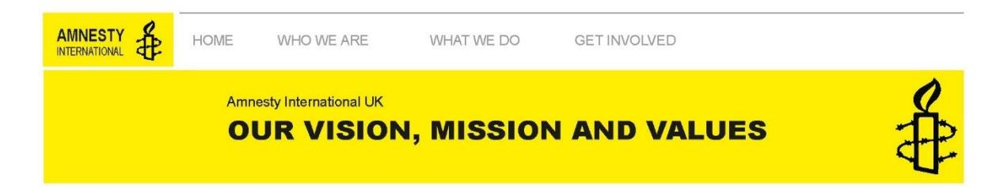

Our vision is a world in which every person enjoys all of the human rights enshrined in the Universal Declaration of Human Rights and other international human rights standards.

Sometimes we go beyond these internationally recognised standards and set our own. We led the campaign for the adoption of the United Nations Convention Against Torture in 1984, and worked with partners to ensure the UN adopted the first ever Arms Trade Treaty in 2013.

Our decades-long campaign has led to the death penalty being abolished in law or practice in two-thirds of the world's countries and we generated the global support needed for the establishment of the International Criminal Court in 2002 - so that those responsible for genocide, war crimes and crimes against humanity will face justice.

#### Our Mission

To achieve our vision we see it as our mission to undertake research and take action focused on preventing and ending grave abuses of human rights.

We carry out a wide range of educational activities, promoting the values contained in the Universal Declaration of Human Rights and other international agreed human rights standards.

- We encourage people to accept that all human rights must be protected
- We encourage governments to accept and enforce international standards of human rights
- We encourage governments, political organisations, businesses, other groups and individuals to support and respect human rights

#### Our Values

We are a global movement of seven million members, supporters and activists across the world standing up for humanity and human rights. Our purpose is to protect individuals wherever justice, fairness, freedom and truth are denied.

With these values at our heart, we have stopped torture, freed prisoners, prevented executions and saved homes.

Help our powerful movement grow even stronger – join [Amnesty](https://www.amnesty.org.uk/join) today.

{18}------------------------------------------------

**Text E** is non-continuous text presenting the 'The Universal Declaration of Human Rights' adopted by the United Nations. This states the basic rights and fundamental freedoms to which all human beings are entitled.

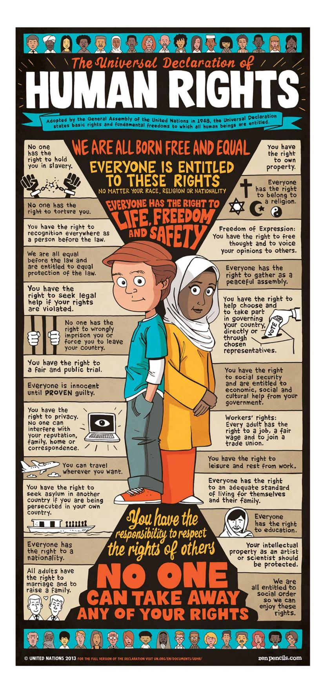

{19}------------------------------------------------

**Text F** is a non-continuous infographic about Article 4 of the European Convention on Human Rights.

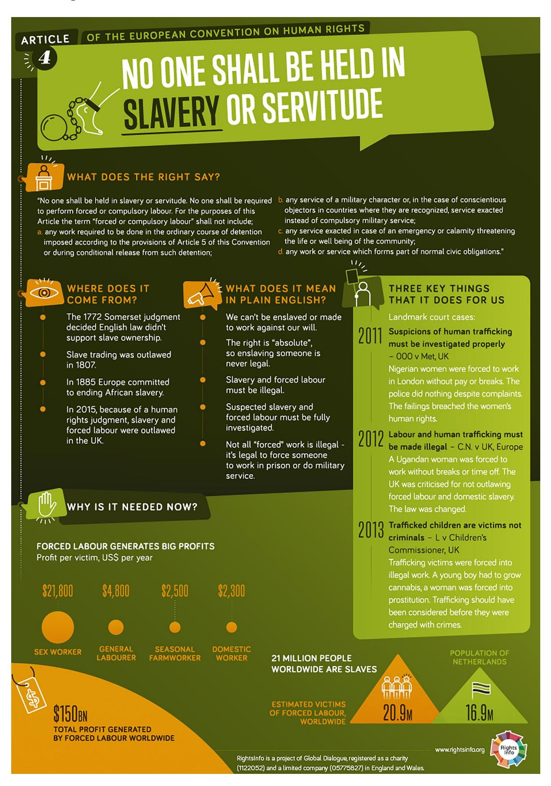

{20}------------------------------------------------

## **Relationships**

**Text A** is a letter written by Welsh poet Dylan Thomas to his mother and father in 1937. He is apologising to his parents for not being in touch and informing them of his impending wedding. The letter is dated a month before Dylan Thomas married the dancer, Caitlin Macnamara. Although Thomas had published two collections of poetry by 1937, they had very little money and frequently had to borrow from friends. They postponed their wedding twice because they had spent the money saved for the marriage licence on drinking and socialising.

June 10 1937

Dear Mother & Dad,

There's no doubt whatever that I've been a careless, callous, and quite unreasonable person as regards letting you know about myself since I left you at the beginning of April, and, as usual, I've no excuse. Since I last wrote, and that was much too long ago, I've been working hard, have secured a little money on advance for the Welsh masterpiece, and have—I'm not sure how much of a shock this might be to you—during the last three days moved on to Cornwall for a little—I can't actually call it a holiday—change of sorts and of weather and of companions. I intend to stay here until the end of June, and then return home for a while—to see mother and you— before continuing the rest of this daft & postponed journey of mine. I'm staying here with Caitlin Macnamara (whose writing on the envelope mother'll probably recognise) in a cottage lent to me by a man called Sibthorp. I suppose that I'm piling on the shocks and surprises in this very late letter, but I must tell you too that Caitlin and I are going to be married next week by special licence (I think that's what they call it) in the Penzance registry office. This isn't thought of—I've told mother about it many times—speedily or sillily; we've been meaning to for a long time, & think we should carry it out at once. Everything will be entirely quiet & undemonstrative, and neither of us, of course, has a penny apart from the three pounds which we have carefully hidden in order to pay for the licence. It may, & possibly does, sound a rash and mad scheme, but it satisfies us and it's all we ask for. I do hope it won't hurt you. I want you to know now & forever that I think about you every day and night, deeply & sincerely, and that I have tried to keep myself, (& have succeeded) straight & reasonable during the time I've been away from you. I'm completely happy at the moment, well-fed, well-washed, & well looked-after. It's a superb place and a delightful cottage, and weather full of sun and breeze, and I'm so glad mother's being well again, & I send her all my love. Do you mind, but I've got to ask you to do a few things for me, simple things and, to me, very necessary ones: could you send on some clothes? Is it too much to ask, on top of all I ask you? I would be so grateful, & I mean that with all my heart. I'll write again tomorrow, because then I'll know the exact Penzance date. I'm terribly terribly without money, so can't phone: Rayner Heppenstall, who's staying with his wife a few miles away, is going to lend me a few shillings tomorrow.

Please write to me quickly; I would appreciate, so very much, you sending clothes & letters; and I'll try to be much more explicit & less (I should imagine) sensationally full of Dylan-life-altering news when I write tomorrow.

All my love, apologies, & hopes,

Dylan X

{21}------------------------------------------------

**Text B** is taken from The Kennel Club website about the benefits of owning a dog.

#### **Mental health - benefits of owning a dog**

#### **How dogs can make a difference to your mental health**

It is estimated that approximately one in four people in the UK will suffer a mental health problem at some point each year. Dogs really can make all the difference – their kindness and companionship helps their owners through the darkest of days.

#### **Man's best friend**

Through thick and thin, our dogs provide us with love, loyalty and companionship without any judgement. According to a survey by Blue Cross, 58% of respondents who suffer with a mental health problem stated that love and loyalty was the most beneficial aspect for their mental health of owning a pet – the most popular reason cited. 50% said company was the most important aspect, while 55% agreed that 'they are my best friend'. Just being around dogs can alleviate stress, anxiety, depression and loneliness.

#### **Helping to give you a purpose**

Dogs can sometimes be our only reason to get up in the morning. They give us a purpose – they rely on us for food, exercise and love. And just doing these small things and being needed by our four-legged friend can be a lifeline when getting through each day is hard. They get us up and out, and provide our days with structure. 37% of people surveyed by Blue Cross say their pets help them with their daily lives.

Putting one foot in front of each other, getting out of bed, or leaving the house can be a big step, and having a dog by your side each day can play a huge part in this.

#### **Getting you outside and exercising**

In addition to helping to alleviate stress, anxiety, depression and loneliness, there are many benefits that come from regularly exercising your dog. Daily walks boost physical and emotional wellbeing, and there are recognised benefits for our mental health of being outside in green spaces.

Going for a dog walk also increases social interaction - people talk to you and often a dog provides common ground, and this might be the only social contact an isolated person may have that day. Dogs can help with confidence too, by being by your side during these social interactions, which can be a source of anxiety for some.

#### **Our resources for Mental Health Awareness Week**

As part of Mental Health Awareness Week, we want to celebrate the time we spend with our fourlegged friends and the positive effect it can have on our mental well-being and mindset.

For those who are able to go outside, we have brought together key information to help you enjoy the outdoors with your four-legged friend, whether it's in the countryside, by the coast, or in public parks.

For those who are unable to go out, we have produced a list of indoor games to play with your dog. For more information, visit our guide to indoor games.

{22}------------------------------------------------

**Text C** is taken from the article ['Exploring the Differences Between Male and Female](https://www.psychologytoday.com/gb/blog/happiness-is-state-mind/202112/exploring-the-differences-between-male-and-female-friendships)  [Friendships'](https://www.psychologytoday.com/gb/blog/happiness-is-state-mind/202112/exploring-the-differences-between-male-and-female-friendships) which was published in the American magazine 'Psychology Today'.

#### **The recipe for a female friendship**

Female friendships thrive on intimacy and emotional connection. We, as females, want to talk about feelings, want to experience physical touch, want direct and dependent face-toface contact. We want to feel emotionally connected and supported.

The research behind the importance of female friendships is strong. According to a study published in the Journal of Clinical Oncology, women with early-stage breast cancer with a larger group of female friends have a higher survival rate, regardless of the physical distance between these female friends. As women, we rely on each other to give advice, be a shoulder to cry on, be an emotional support system, hold and protect secrets, boost selfesteem, and lend a listening ear. Our girl tribes are strong, and as a result, a solid and healthy female friendship is something that every woman can benefit from.

The intimate, face-to-face relationships between women have a lot to do with oxytocin, the bonding or "love potion" hormone that is released during childbirth and nursing. Studies have shown that when women are stressed out, they do not just resort to the "fight-or-flight" response but also release oxytocin, which allows women to nurture and "tend and befriend." It is believed that oxytocin is the reason why women have a natural "motherly instinct," and as a result, female friendships are based on emotional intimacy and connection. When women engage in this "tending or befriending" process studies suggest that "more oxytocin is released, which further counters stress and produces a calming effect."

#### **The recipe for a male friendship**

Friendships between males tend to be more transactional. Men tend to value friendships that are more shared activity-based (playing basketball, poker, or golf, or watching a football game) rather than the intimate, face-to-face relationships that women have.

Men do not feel the desire or need to discuss every intimate detail and change in their life with a male friend. They also do not feel the need to constantly stay in touch, as men can go for long periods—months or even years—without having contact with a male friend, but still consider that person a close friend.

In contrast, if a woman does not keep in regular, close contact with one of her girlfriends, she most likely will assume the friendship has grown apart or her friend is no longer interested in having a friendship with her, potentially even assuming the friendship has ended. Although male friendships tend to be more transactional and less intimate than female friendships, male friendships are generally less fragile than female friendships. Men tend not to wear their emotions on their sleeves, do not question the motives of others, and do not feel pressure to disclose personal details and intimate secrets to maintain their friendship with another male. On the contrary, females bond through secret sharing and emotional intimacy, which can potentially create volatility in a friendship, especially if this sharing is one-sided.

While men may not share their deepest and most secret feelings with their close male friends, research shows they are more apt to share them with a wife, girlfriend, sister, or other platonic female friends.

{23}------------------------------------------------

#### **Friendships are meaningful, regardless of gender**

Humans are social creatures, regardless of whether you are an introvert or an extrovert, and therefore we crave to be around others. Friendships help us create a community with likeminded individuals. A healthy friendship can teach us about joy, empathy, trust, honesty, integrity, communication, and many other key characteristics that we need to evolve in all aspects of society. Healthy friendships are known to decrease rates of dementia and obesity and increase longevity.

#### **The impacts we feel when we don't feel connected through friendship**

When we don't feel connected, we can feel lonely and isolated, which can stir up many negative feelings that may result in depression and anxiety. Isolation can negatively affect our self-esteem, leaving us feeling inept or not good enough. We may not feel worthy of being in a friendship, and this may prevent us from making new friends.

Some people turn to alcohol and drugs to numb feelings of loneliness. When we begin to feel lonely but do not have healthy coping skills to deal with these feelings, we can quickly find ourselves in deep, dark places. Sometimes feeling lonely is inevitable, but it is how we learn to overcome these times that is important. Healthy coping skills come with positive selfesteem, gratitude, and happiness.

{24}------------------------------------------------

#### **Text D: celebrity interview (2023)**

The transcript below is taken from a television talk show broadcast on weekdays at lunchtime. The show includes interviews, discussions of topical issues and celebrity gossip. In this extract, the chef Andi Oliver and her daughter Miquita, a television presenter, are interviewed in front of a live audience by the host of the programme. Andi and Miquita talk about their relationship and their work.

H: Host A: Andi Oliver M: Miquita Oliver

- H now when it comes to talent (.) it **definitely** runs in the family for today's guests one that is a **top** tv **chef** and the other was a team telly favourite who's now working alongside her mum please **welcome** mother-daughter **duo** (.) ANDI and MIQUITA OLIVER [audience applause and cheering as the hosts greet their guests] it's a it's an **utter** joy to have you **both** (.) in in the studio and I've got to **ask** (.) **first** off what's it like **now** working (.) together cos you haven't always but you're doing **loads** of it the last few years
- A **yeah** we **love** it because it's like (.) y'know when you work with people that you **really** know **very** well and you get a **shorthand** (.) when it's your own **child** it's even more like that y'know we so we can (1) finish each other's sentences (.) we kind of **instinctively** know what the other one's gonna **do** (.) and I think it's given us it's certainly given me a real respect (1) for Miquita and her (1) skill (.) and her in her craft and what she's sort of (.) managed to **achieve**
- H but you guys are quite **close** anyway aren't you because I mean I know a lot of mums and daughters **are** but cos you were like **twenty** weren't you when you had her so in a way would you describe it more was a friendship =
- A = **well** [laughter] we we certainly grew **up** together it does **really** feel like that M we were saying actually I think it's quite an interesting way to look at motherdaughter relationship but there's always quite a lot of **shame** put on a a young (.) mother (.) single (1) but actually it creates a **really different** dynamic which is you're both **growing** up **together** um which has **turned** into **this** relationship **now** which I think would have been very different if my mom was thirty or forty when she had me (.) so thank you for being such a **reckless** [laughter] it was the **eighties** [laughter]
- H but what was it like (.) for **you** to to watch Miquita do what she did so **young** because you're only fifteen I remember watching you and thinking you were just the most amazingly cool person I've **ever** seen on tv it was **amazing** I thought you were just (.) y'know you were the **epitome** (.) and you were where everybody wanted to **get** to (.) who was doing telly cos you you were and still are just **brilliant** but what was it like for **you** to **watch**
- A you know it was it was I was so proud of her because she was **brilliant** at it **immediately literally** immediately I said (.) how does she know how to do that? she just did it y'know she'd sort of been working at at T4 for about a month and she did a Justin Timberlake **special** he was like the **biggest star** around and she did a **whole** hour (1) like just **her** and Justin Timberlake she would see who she was (.) he was like (.) this is fun y'know and so I was really proud of her but there was a **moment** when (.) there was one of those **big** T4 (.) you know party things that they used to have at Christmas or whenever they had it (2) and at the (.) I went to see it and there were like thousands of people at this thing and then **afterwards** I was trying to **get** to Miquita and there was like you know Paparazzi **and** people **and** fans and **all** this stuff and I **couldn't** reach her (.) and that made me I had a bit of a panic you know a real **panic** about it cos I suddenly thought oh this is really (.) there's been a **really big** shift (.) in our lives and I (.) can't (.) **protect** her
- H yeah yeah are you glad that you got to cut your teeth before social media =

{25}------------------------------------------------

M = yes (.) and live my life (.) yeah in general because I think uh you know even like my mother is now like (.) I don't want to say **addicted** to Instagram [laughter] I'm like get off it I'm like can we have a I say to mum (.) can we have a **minute** without Instagram (.) and she says (.) yeah yeah one // sec

A //sending a little message

M yeah it's so prevalent in all our lives now so **yeah** I'm happy I had that freedom but (.) it's been a real **shift** watching this (.) a lot of people say to me what's it like growing up with a famous mum my mum has only been (.) well known and and doing all these **incredible** things she's always been doing incredible things but (.) having **recognition** in the last five years (1) I think mum always **thought** she was famous but [laughter] people have responded **accordingly** (.) it's kinda like tv just caught up A **finally**

M she's been walking round like a **star** since we were like in the council flat in Ladbroke Grove

H what is it like then watching your mum now doing all the things that she **loves** and you know that she was brilliant at

M it's emotional (1) it's really (.) really **emotional** =

H = book =

A/M = BOOK

H I was going to **say** (.) you being on the **front** of the book is probably y'know a **clear** (.) **indication** (.) of of how much fame is **suiting** you right now

A I feel that it's my **personal mission** (.) **actually** to (.) **really** kind of kick **open** some of these doors so that we start to view culinary excellence in a different way there are **so** many ways to be **brilliant** and **beautiful** and do **beautiful** things in the kitchen to **be** excellent and it's **not** just through a a sort of er (.) French lens but there are all these other part parts of the **world** (.) **all** doing beautiful things it's all classic (.) it's **all** important (.) and it's **all** powerful [audience applause]

H I will definitely be cooking from it (.) WITHOUT A DOUBT without a doubt (1) all right so Andi (.) Miquita thank you both so much for joining us thank you

{26}------------------------------------------------

**Text E** is non-continuous text taken from a blog. It explains some of the terminology for describing family relationships.

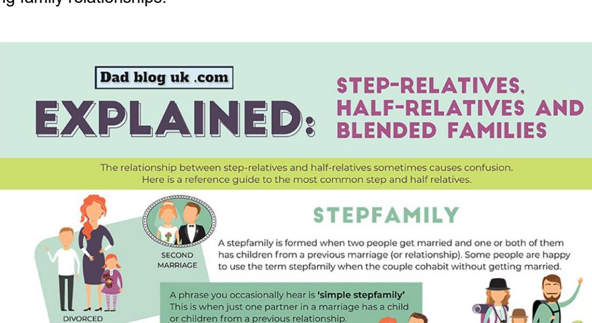

#### BLENDED FAMILY, PATCHWORK FAMILY, BONUS FAMILY

A blended family, patchwork family or bonus family is always a stepfamily! These phrases are more commonly used when both partners in a relationship have children from former relationships.

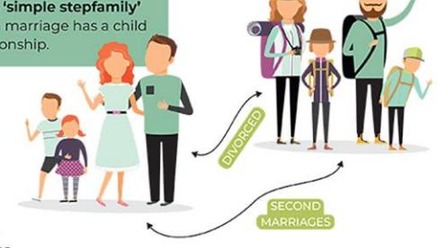

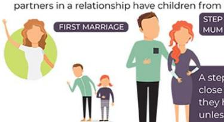

#### STEPFATHER/STEPMOTHER

A stepfather or stepmother is the non-biological parent in a relationship.

A stepmum or stepdad may provide a lot of day-to-day care and become very close to their stepchild(ren). In many jurisdictions, including the United Kingdom, they have no legal parental responsibilities or obligations for their stepchildren unless they have been granted rights by a family court. Decisions regarding medical treatment, schools etc. generally rest with the biological parents.

#### STEPSISTER/ STEPBROTHER

If both partners in a marriage have children from previous relationships, the children become stepsiblings (stepbrothers or sisters) to each other. They are not blood relatives.

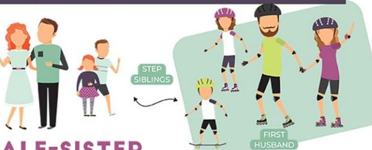

#### HALF-BROTHER/HALF-SISTER

A half-brother or sister who shares one biological parent with you (can be the mother or the father). Half-brothers and half-sisters are very common in blended families when the adult couple go on to have children of their own. They are blood relatives.

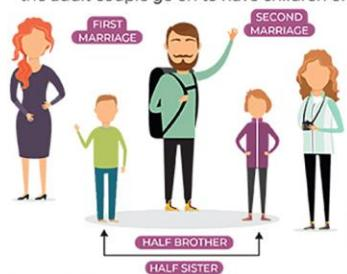

Dad blog uk .com

## AND HALF RELATIVES

Other phrases you will hear include step-grandparents, step-cousins, step-uncles and so on. You also get half-cousins. It can get very complicated.

#### WORD OF ADVICE:

Be advised that some people can be very sensitive about how they are referred to. Some stepchildren call their stepparent mum or dad, others give them a nickname or call them by their first name. Many half-brothers and half-sisters refer to their half-siblings as brother and sister. If you are unsure what phrase to use, always politely ask.

{27}------------------------------------------------

# Young carers: Who are they? What do they do?

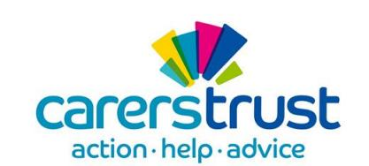

A young carer is someone under 18 who helps look after someone in their family, or a friend, who is ill, disabled or misuses drugs or alcohol.

Across the UK, as many as

1 in 5 children and young
people are young carers.

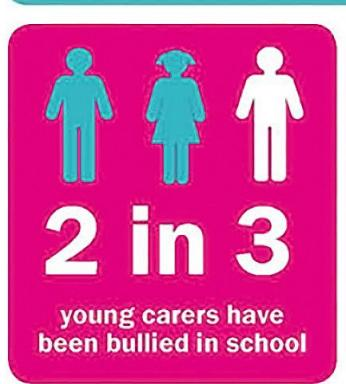

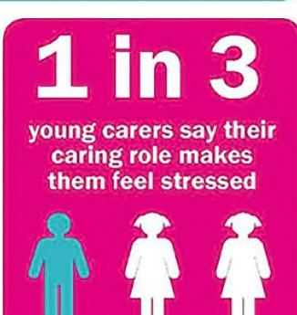

## Young carers should have:

- Time to have fun and do things that matter to them.
- The same opportunity as their friends to succeed in education and work.
- Support to make ambitious plans for the future and achieve them.
- Recognition of their legal rights to assessment and support.
- High quality support both for them and the person they care for.

## What might a young carer do?

- Practical tasks, such as cooking, housework or shopping.
- Physical care, such as helping someone out of bed.
- Emotional support, such as talking to someone who is distressed.
- Personal care, such as helping someone dress.
- Managing the family budget and collecting prescriptions.
- Helping to give medicine.
- · Helping someone communicate.
- · Looking after brothers and sisters.

48

the average number of school days missed or cut short as a result of a young person's caring role

23%

of young carers felt their caring role had stopped them making friends

Young Carers Awareness Day, on 30
January 2020, is an annual event,
organised and led by Carers Trust, to
raise awareness of the challenges faced
by young carers and to campaign
for greater support for them

Carers.org/YCAD2020

#YoungCarersAwarenessDay #CountMeIn

Carers Trust is a registered charity in England and Wales (1145181) and in Scotland (SC042870). Registered as a company limited by guarantee in England and Wales No. 7697170. Registered Office: Carers Trust, Unit 101, 164–180 Union Street, London SE1 OLH. © Carers Trust 2019

{28}------------------------------------------------

## **Wales and Global Contexts**

**Text A** is taken from the non-fiction travel book *Getting Stoned with Savages: A Trip through the Islands of Fiji and Vanuatu* by J. Maarten Troost.

Vanuatu has many peculiar customs, and if there was one custom that defied my book learning, that confounded my understanding of human nature, it was cannibalism.

Until very recently, island life in Vanuatu has been characterized by a state of endless war. This is where my struggle to understand cannibalism begins, for no war seems more pointless to me than the kind traditionally waged in Vanuatu. Typically, the men of a particular village ambushed the men of another village. The goal was to capture one man, who would then be triumphantly carried back to the attackers' village, clubbed, and chopped into pieces. Good manners dictated that an arm or a leg be sent off to a friendly village. Again here, I sputter in disbelief. Imagine receiving such a package. "Oh, look, honey. Bob and Erma over in Brooklyn have sent us a thigh. So thoughtful." Of course, now you are obliged to reciprocate, and so you gather your friends and off you go, hunting for a man, and when you capture one, you will thoughtfully hack an arm off and send it along to Bob and Erma, together with a note — Thinking of you.

What perplexed me was the almost casual nature of cannibalism in Vanuatu, its everydayness. As far as I understood, there was neither shame nor reverence attached to the eating of people. A body was just a meal. Clearly, there must be something more to it, or at least I hoped there was. To find out, I figured, I would have to ask a cannibal. And if there was one island where I thought I might find a cannibal, it was Malekula.

My guide into the highlands was Rose-Marie, the nineteen-year-old daughter of Chief Jamino, the guardian of Botko. How hard could this trek be, I wondered, if my guide is wearing a Harry Potter shirt, a sarong, and flip-flops? Of course, she also had a machete, but I figured everybody on Malekula carried a machete. It was the accessory of choice. Looking back, I can now say that the five hours it took to hike up to Botko were the most excruciatingly difficult five hours I have ever spent on my feet. We left shortly after dawn, following a well-travelled bush trail that meandered inland. As we climbed up the first of what would prove to be a seemingly endless series of steep hills, following a path evident only to Rose-Marie, who hacked our way forward with her machete, I pleaded for a break.

{29}------------------------------------------------

**Text B** is taken from an online study of contemporary Wales which appeared on The Open University's OpenLearn website.

#### The 'Taffia'

Those who are opposed to nationalism and devolution in Wales often think that the country is run by a tiny group of Welsh speakers, sometimes known as the Taffia: a loaded term suggesting there are Godfathers everywhere. Again there is little actual evidence of this, though there are frequent assertions:

The Welsh-language scene itself at that time [in the early 1990s] was a tightknit community with everyone knowing everyone else. If you went regularly to gigs at Cardiff's Welsh club, Clwb Ifor Bach, then you would inevitably see the same faces, and it didn't take long to get to know them.

... many ... were artists or ... worked in the arts or ... were employed at S4C or ... were involved at the local media. HTV and the BBC in Wales are notoriously populated by the Taffia – an exclusive clique of Welsh speakers whose backgrounds in Welsh-speaking schools and Welsh universities, coupled with their ability to speak the language, has led to the sort of nepotism notorious amongst Oxford and Cambridge graduates in London media circles. (Owens, 2000, pp. 33–4)

More considered analysis finds some basis for this argument. Cardiff has developed a Welsh-speaking community since the Second World War, prompted by the growth of national institutions which are located in the city. For example, the Welsh Office was created in 1964, there are other institutions like the National Museum of Wales and media production is concentrated in the city, with the BBC, ITV and S4C all having facilities there. One study has found evidence of a renewal of the Welsh-speaking middle class of teachers, preachers and writers through broadcasting and argues that a tightly knit group has used language issues as an avenue of social advancement (Bevan, 1984). Meanwhile, devolution has meant that civil service jobs which were once in London have been moved to Cardiff, so Welsh people may need only to move within Wales and not out of Wales to advance themselves. Many of these positions require a fluency in the Welsh language, which gives Welsh speakers certain advantages.

The Welsh-speaking population of Cardiff tends to cluster in particular areas:

the majority of Welsh speakers have settled either in the traditional middle to high status residential districts of the city (e.g., Llandaff) or in select suburban and rural fringe areas (e.g., St Fagans, Radyr). ... the Welsh-speaking population of the city is largely composed of young to early middle-aged families. Not surprisingly, having established themselves in Cardiff, such families have sought to ensure that ample facilities would be available for children to pursue their education through the medium of Welsh ... [there has been] ... a highly significant growth in the number of bilingual schools in the region.

(Aitchison and Carter, 1987, p. 490)

You have seen already that Welsh speakers are well represented in the upper reaches of Welsh society, though not at the very top level. Welsh speakers and the non-Welsh are both over-represented in the better-off groups; non-Welsh-speaking Welsh people have the least effective social and cultural capital.

{30}------------------------------------------------

This shows the effectiveness of the formation of a Welsh-speaking middle class in urban south Wales and reveals something about the patterns of migration within Wales. This is linked to the quality of education in Welsh-medium schools, which have been a clear success story in post-war Wales. The commitment of parents, pupils and teachers to the cause of language renewal has ensured that they produce well-qualified pupils. The children benefit from effectively having two first languages and from a wide range of extra-curricular activities. Better cultural capital is especially important when, in general, schools in Wales have not performed particularly well; whether there are benefits from the social capital of the networks of the Taffia is less clear (Reynolds and Bellin, 1996).

Welsh-medium schools are open to the children of non-Welsh speakers and now educate some 20 per cent of children. This does not make them especially exclusive.

{31}------------------------------------------------

#### **Text C: sports interview (2023)**

The transcript below is taken from an interview on Sky Sports News. In this extract, presenter Peter Graves interviews the Hollywood actors Ryan Reynolds and Rob McElhenney about their purchase of Wrexham Football Club. The streaming service Disney+ is broadcasting a documentary about their take-over, and Reynolds and McElhenney talk about their experience of running the Welsh club, and their love for Wrexham and the Welsh national anthem before the programme airs.

G: Peter Graves R: Ryan Reynolds M: Rob McElhenney

- G now it's not very often that **Hollywood** (1) and **non-league** mix with each other but that's what happened when the actors Ryan Reynolds and Rob McElhenney bought er in February Wrexham (.) last year (3) look guys (.) really looking forward to watching the documentary later but look Ryan (.) what was your initial thoughts (.) when you first walked into Wrexham football club
- R I think I felt it to a certain degree before (.) going which is which would probably explain the **shakes** I had when I first got there (.) it was **intense** (.) you know also there's there's something (.) odd about (.) you know (.) having **so** much exposure to this **community** and this **club** and **particularly** this even this this **stadium** which I sort of look at more of like a **church** (.) in Wrexham and then actually **going** there **physically** for the first time after so much (1) had been built up in my mind about it it was it certainly did not disappoint but **man** was I nervous (.) er walking through Wrexham the first er the first few times we were there and then **now** it's sort of (.) it really **does** feel like a second **home** (.) I mean it's er going there there's there's something I get the giggles a little bit before I'm on my way over to Wrexham cos I know I'm about to have a (.) win or lose I'm about to have an **amazing** (.) er experience so it's just a **wonderful** town and and we so appreciate and love the **embrace** that this community has shown not just us but obviously the club that they've (.) loved and revered for so long
- G yeah that's er really nice to hear er like a second home for you as you say but (.) talk to me about the Welsh language cos let's be honest it is one of the **toughest** languages in the **world** to learn (.) have you managed to learn any phrases yet Rob?
- M er a little **bit** yes I've I've learned the national anthem because I realised that they sing that (.) quite a bit it's a **beautiful** national anthem and (.) and so I learned how to I learned how to sing that
- G I got to say guys I know some of the the Wrexham players personally I also had a **chat** with the **gaffer** (.) Phil Parkinson as well and they've **all** said you're both really down to **earth** blokes (.) you've got the club's best interests at heart as well (.) so (.) that must be nice to hear =
- M = yeah yeah I mean we we know we know that there's nowhere to hide (.) um and we welcome that er we we we wear our hearts on our sleeves and we're trying to (.) um we're trying to only make promises that we know we can keep and and to go into this with **open** eyes and **full** hearts (.) can't lose
- G and look you said right from the offset as well that **taking** Wrexham **all** the way into the Premier League was the ultimate goal but (.) having been at the Club a little while **now** (.) is that **really** still the dream? =
- M = why **not**? if we go into this and and we wanna we wanna dream **big** um then why not (.) go all the way? I think I think we recognise that um that is a **long** journey but we're we're here for the **long** haul
- R and look **anything** can happen in football (.) you know (.) you can put together the **greatest** team on earth and then you know (.) you can see some **giant** killer comes along and takes out Man United I mean it's if anything can happen in this (.) in this sport so (1) why **couldn't** Wrexham you know **theoretically** make it all the way to

{32}------------------------------------------------

the Premier League one day? I mean it's er this is this is the place where **hopes** hopes and dreams are born every day so why not?

{33}------------------------------------------------

**Text D** is adapted from an article in *The Guardian* newspaper about what it means to be Welsh in the 21st century. This part of the article is a reflection of Darren Chetty's childhood. Chetty is a writer, teacher and researcher.

#### **'The first time I saw that sign I remember thinking: who is that boy?'**

It's Saturday 14 October 2017 and I'm back in Swansea. It's evening and I'm staring up at the sign outside a pub in the Killay area of the city. The pub is very familiar, but the sign is not. It's nondescript, in stark contrast to the sign that hung there years before. I can still picture the old one: a portrait of a young boy with dark brown skin. His head is turned to the right; his eyes look into the distance. White teeth are visible; he might be smiling. He wears a bright pink shirt with a mandarin collar, and a matching turban. In the centre of the turban there is an oval jewel set in gold, and a yellow feather. The brewery name Whitbread is painted in white letters above the image. At the bottom is the name of the pub, The Black Boy.

The first time I saw that sign I was sitting in my dad's blue Mini in the car park. I remember wondering: who is that boy? Did he used to live here? Was he black in the sense of being African, as the name and his face suggested? Or Indian, as his clothes suggested? What was his connection to the area? The "ugly, lovely town" of Dylan Thomas's childhood was a city by the time I was born there. Killay, once a mining village, was now a suburb. We moved there from nearby Fforestfach in 1977 and lived there until the summer of 1982. But that sign no longer hangs outside the Black Boy. It was replaced by a different sign, which was soon replaced by the one that hangs there today. Both these later signs depict boys, but neither are black.

What happened to the old sign? And how did it come to be there in the first place? That boy was only the third dark-skinned boy I'd ever seen in Killay. The other two were my older brother and a classmate of his, the son of a Sri Lankan doctor. My brother and I were Indian-South-African-Dutch. The only person in the known history of my family to be born in Wales, I grew up with a definite sense of being Welsh, bolstered by my love of sport, and early aspirations to play football for Swansea City and Wales. Having parents who had grown up in two different countries, and who put a great emphasis on fitting in, contributed to my sense of being Welsh.

I can vividly recall the first time I considered the question of whether or not I was black. I was seven years old. We lived on an avenue up the hill from the Black Boy pub, where kids regularly played outside. I was running from my house to the end of the street. As I passed our next door neighbour Mr Thomas's green Triumph, I touched it with my right hand. The car pulled alongside me a few moments later. Mr Thomas leaned towards the open window on the passenger side: "Keep your filthy hands off my car you black bastard."

Things fade from memory – or they don't. The old pub sign is gone. It was first replaced by a picture of a smiling white boy with coal on his cheeks. This sign gave way to the present one: a white boy in perhaps Victorian garb, including a black jacket and hat, slightly unkempt, looking to his left, his eyes not visible.

I find one explanation at the library. "In Wales during the 18th century it was the height of fashion to employ a black servant," writes David Morris in Identifying the Black Presence in Eighteenth Century Wales, published in 2008 .

This might go some way to explaining the name of the pub and the original sign, but there is more.

{34}------------------------------------------------

Swansea's growth as a town was largely due to its copper industry. Copper, mined in Cornwall, was brought by boat to Swansea where it was smelted. By 1823, 10,000 of Swansea's 15,000 residents were supported by the copper industry, earning the town the nickname "Copperopolis".

This copper had many uses, such as manillas (bracelets), that eventually acted as an African currency … You could even buy human beings with copper."

Black boys were bought with copper smelted in Swansea.

I am not the only person who has noticed the changing signs outside the Black Boy in Killay. The artist Daniel Trivedy exhibited a replica sign featuring the original image of the turbaned Black Boy on one side and the image from the current sign on the other. "Occasionally people find it necessary to alter the accounts of history to provide a more palatable version of events," Trivedy told the South Wales Evening Post. "Perhaps this is the case with the Black Boy pub sign. However, to ignore the black presence in our history (and pub signs) is to deny the roots and heritage of multicultural Britain."

Another Black Boy Inn in Caernarfon, north Wales, which was named "the Welshest pub in the world" in 2016, has been the subject of some controversy over its name. But in 2008, John Evans, the owner, told the North Wales Daily Post: "I would never consider changing it, even if it was bad for business, because we have to hold on to our heritage." The images of black boys on the signs outside his pub look to me like racist caricatures. Perhaps these, too, are part of "our" heritage?

{35}------------------------------------------------

**Text E** is non-continuous text taken from a Welsh Government update on the government policy target of increasing the number of Welsh speakers to one million by 2050.

#### Cymraeg 2050: A million Welsh speakers Update 2022-23

#### Theme 1: Increasing the number of Welsh speakers

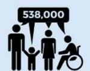

Population aged 3 years or over who can speak Welsh in Wales: Census of Population 2021: 538,000

Launch free
Welsh lessons
for the education
workforce and the
Ymlaen Gyda'r
Dysgu scheme
which offers free
Welsh lessons to
young people aged
16 to 25.

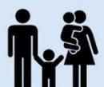

Cymraeg for Kids programme held 3,922 sessions for 28,135 parents and carers and 28,738 children.

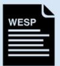

Every local authority in Wales announces a new 10-year WESP.

Hold public consultation on the Welsh Education Bill White Paper.

Publish
Welsh in
education
workforce
plan.

#### Theme 2: Increasing the use of Welsh

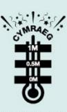

**Helo Blod** reaches the milestone of translating **1 million words** from English to Welsh since the service's inception.

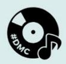

**Dydd Miwsig Cymru** becomes a live festival again with **30 events** across Wales.

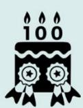

Urdd Eisteddfod celebrates its centenary and breaks 2 Guinness World Records.

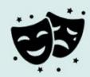

Announce funding to re-establish **Urdd Youth** Theatre

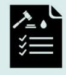

Hold public consultation on draft standards regulations for water companies.

#### Theme 3: Creating favourable conditions - infrastructure and context

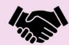

Establish the Commission for Welsh-speaking Communities.

Publish glossary of Welsh terms in the field of race and ethnicity.

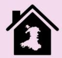

Publish the Welsh Communities Housing Plan.

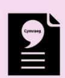

Announce new More than just words 2022 to 2027 plan.

© Crown copyright 2023 WG48117

{36}------------------------------------------------

**Text F** is non-continuous text taken from the National Health Service (NHS) website for Wales.

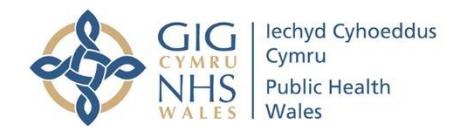

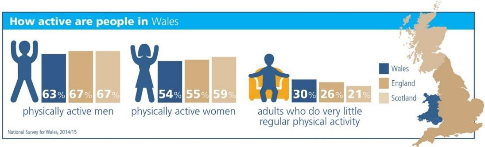

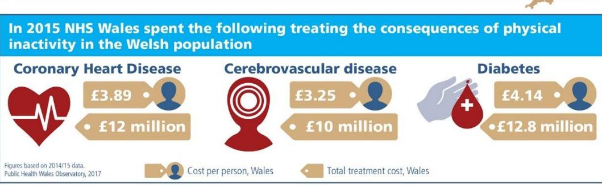

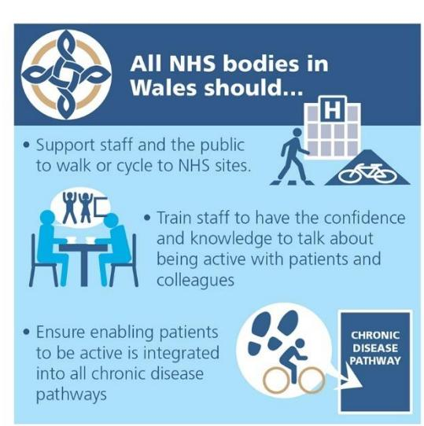

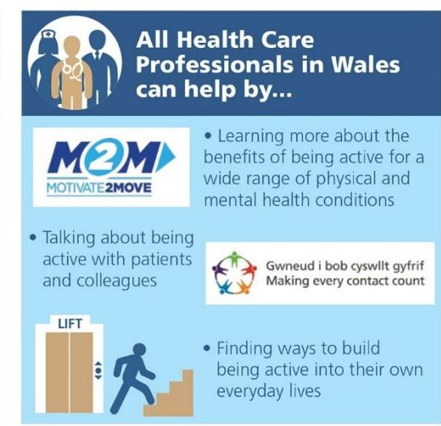

{37}------------------------------------------------

### **Work and sustainability**

#### **Text A: speech at the Climate Change Conference (2021)**

The transcript below is an extract from the 2021 Climate Change Conference. Each year, political and business leaders, scientists, young people, journalists and other experts come from around the world to discuss climate problems and the best ways to address them. In this extract, the well-known documentary-maker and environmentalist David Attenborough talks about the climate crisis and the urgent need for change. He discusses carbon levels and global temperatures over time, what needs to be done to reverse the damage, and the power of people to solve climate problems if they work together.

D: David Attenborough V: video clips of speakers from around the world

- D your excellencies (.) delegates (.) ladies and gentlemen (1) as you spend the next **two** weeks (3) debating (2) negotiating (2) persuading (2) and compromising (.) as you **surely** must (3) it's easy to forget (1) that **ultimately** (.) the emergency climate comes down to a single **number** (2) the concentration of carbon in our atmosphere (2) the **measure** that **greatly** determines global temperature (.) and the changes in that one **number** (.) is the **clearest** way to (.) chart our own story for it defines our relationship (.) with our world (2) for much of humanity's ancient history that **number** (.) bounced wildly between one hundred and eighty and three hundred (1) and so too (2) did global temperatures (2) it was (.) a brutal (.) and unpredictable world (2) at times (1) our ancestors (.) existed only in tiny numbers (1) but just over (1) ten thousand years ago (.) that number **suddenly** (.) stabilised and with it (1) Earth's climate (4) we found ourselves (1) in an unusually benign period (1) with predictable seasons and reliable weather (3) for the first **time** (.) **civilisation** (.) was possible and we wasted no time in taking advantage of that (2) everything we've **achieved** in the last ten thousand years (2) was enabled (.) by the **stability** during this time (3) the (1) **global** temperature has not wavered over this period (.) by more than plus or minus one degree Celsius (3) until **now** (4) our (1) burning (.) of fossil (.) our burning of fossil fuels (.) our destruction of nature (.) our approach to industry construction and learning are releasing carbon into the atmosphere at an unprecedented pace and scale (1) we are **already** in trouble (1) the stability (.) we all depend on (.) is breaking (1) this story is one of **inequality** as well as instability (.) **today** those who've **done** the **least** to cause this problem are being the hardest hit (.) ultimately **all** of us will feel the impact (.) some of which are now unavoidable (5)
- V my (.) world (.) is (.) **melting**
- V you **think** you have control (.) we **actually** have no control
- V I'm absolutely **terrified** (1) to bring a **child** to this world
- D is this how our **story** is due to **end** a tale of (.) the smartest species **doomed** by that all too human characteristic of failing to see (.) the **bigger** picture in pursuit of short term goals (.) perhaps the fact that the people most affected by climate change are no longer some imagined future generation (.) but **young** people alive **today** (.) perhaps that will give us the impetus we **need** (1) to (.) rewrite our story (1) to turn this **tragedy** (1) into a **triumph** (3) we are (.) after all the **greatest** problem solvers (.) to have ever existed (.) on **Earth** (3) we now **understand** this problem (2) we know how to **stop** the number rising and put it in **reverse** (2) we must recapture **billions** of tons of carbon (1) from the air (2) we **must** fix our sights (.) on keeping one and a half degrees (.) within reach (3) a **new** industrial revolution (.) powered by **millions** (.) of sustainable innovations (.) is **essential** (2) and is **indeed** (.) **already** (.) beginning (2) we will **all** share (1) in the benefits (1) affordable clean energy (.) healthy air (1) and

{38}------------------------------------------------

**enough** food to sustain us all (2) nature is a key **ally** (2) whenever we restore the **wild** (1) it will recapture **carbon** and help us bring back **balance** (1) to our planet (3) and (.) as we work to **build** a better world (2) we must acknowledge (.) **no** nation has completed its **development** because (.) no advanced nation is yet **sustainable** (2) **all** have a journey still to complete so that **all** nations (2) have a **good** standard of living and a **modest** footprint (2) we're going to have to learn (.) **together** (.) how to achieve this (.) ensuring **none** (1) are left behind (.) we must use this opportunity (.) to create a more equal **world** (1) and our motivation should not be **fear** (.) but hope V can we **fix** (.) climate problem in one generation? my answer would be (1) **yes** (1) we **have** to

- V we need to not just (.) to **talk** about (.) what we **can** do but (1) to **do** (.) what we **can** V this is a **challenge** that we should try to solve in a **quick** way (.) but with a **long-term** (.) vision
- D it comes down to **this** (2) the people alive now (.) are the **generation** to come (2) will **look** at this conference and consider **one** thing (2) did (.) that (.) number (.) stop rising and start to **drop** as a result of commitments made **here**? (2) there's every reason to believe that the **answer** can be **yes** (1) **if** working apart we are a **force** (1) powerful enough to **destabilize** our planet (.) **surely** (1) working **together** (.) we are **powerful** enough to **save** it (3) in my lifetime (1) I've **witnessed** a **terrible** decline (.) in **yours** (2) you **could** (1) and **should** witness a wonderful recovery (.) **that** desperate hope (.) ladies and gentlemen (.) delegates (.) excellencies (.) is why the **world** is looking to **you** (.) and why **you** are **here** (2) thank you

{39}------------------------------------------------

**Text B** is an extract from an online magazine article published on the website Wired.com, which specialises in technology issues. Emily Dreyfuss, who writes this article, is employed by Wired.com.

### **My life as a robot**

I have been part robot since May. Instead of legs, I move on stabilized wheels. Instead of a face, I have an iPad screen. Instead of eyes, a camera with no peripheral vision. Instead of a mouth, a speaker whose volume I can't even gauge with my own ears. And instead of ears, a tinny microphone that crackles and hisses with every high note.

I'm a remote worker; while most of WIRED is in San Francisco, I live in Boston. We IM. We talk on the phone. We tweet at each other. But I am often left out of crucial face-to-face meetings, spontaneous brainstorm sessions and gossip in the kitchen.

So my boss found a solution: a telepresence robot from Double Robotics, which would be my physical embodiment at headquarters, extending myself through technology. Specifically, an iPad on a stick on a Segway base.

The first time I opened the double interface in Chrome and clicked on an icon of my robot 3,000 miles away I was greeted by the pixelated image of my boss's torso and a few headless co-workers. There probably were some instructions somewhere that I should have read, but I didn't. "How do I move it?" I asked them. "We don't know," they said. I clicked around. Nothing. I tried the arrow keys and, boom, jolted out of the robot's charging dock and toward onlookers. I was like a foal, learning to walk. It took about 10 minutes to discover that a) driving a robot using a browser interface is clunky and b) the hip flooring choices of WIRED's office were going to be my nemesis, with every transition from concrete to rubber to carpet providing another opportunity to fall on my screen.

Before I ever tried the robot, I was sure I would hate the thing. I thought it would make me small and flat and foolish. I thought it would be annoying to deal with, would require me to wear pants (something we remote workers often don't do!). I thought it would make me a novelty, a sideshow, a joke. And I thought it would be a waste of time.

When I boot up, some of my original fears are realized: I'm disoriented and silly and helpless. I am a spectacle. People ogle and take pictures. I feel like a dog, the recipient of gawking smiles that say, *Awwww, you're so adorably unable to take care of yourself*. But, most importantly, I am surprised to find that being a robot is delightful. It's thrilling. I am in the office! *There is the kitchen! There is Sam! Hi, everyone! I am here!*

Later that morning, I experienced the joy of being in the daily editorial meeting as a robot. Plonked at the end of the conference table, my iPad head tracked the conversation, listening. Yes, I interrupted people because my browser was a few seconds behind. Didn't matter. I heard [Molly on the phone from the Caribbean](https://www.wired.com/2015/08/the-top-tech-writer-in-the-caribbean/) and she was barely audible. The audio system sucks. As she was trying to talk people were kind of looking exasperated. Not at her, but at the system. That was me two days ago, I kept thinking. Two days ago that speaker system was my only conduit to the entire company.

I could never go back. I felt so superior as my robot. I loved my robot.

{40}------------------------------------------------

**Text C** is taken from a statement published on the website of Natural Resources Wales. It outlines their plans to encourage a sustainable economy in North-West Wales.

#### **Encouraging a sustainable economy**

In this theme, Natural Resources Wales (NRW) want to work with partners and stakeholders to maximise employment opportunities for the people who live in North-West Wales. The challenge is to develop a local economy that provides secure, well-paid jobs that enhance Wales's natural environment. Any economic activity that damages the environment on which we all depend, threatens the very thing that makes North-West Wales unique. We collectively need to put nature and sustainability at the heart of any green recovery. We want visitors and locals to make the most of the amazing landscape, but that must happen in a way that meets the needs of farmers, local communities and the outstanding habitats.

This theme highlights the need for working in partnership with others to improve relationships and understand the role of the environment and agriculture as well as other industries in underpinning the economy of North-West Wales. This includes encouraging a local circular economy, reconnecting people with locally sourced food and other products, and the development of more renewable energy projects, including community-based energy schemes.

#### **Benefits**

There are multiple benefits for both people and wildlife that can be derived from a sustainable rural economy. Ensuring that natural resources are sustainably managed will support rural businesses now and for future generations. A vibrant North-West Wales economy and public services can have a reciprocal relationship where they support and underpin one another. Encouraging a local circular economy will reduce supply chains and ensure that money remains within the local rural areas. Partnerships between the environment, education/learning sector and businesses will help ensure that rural jobs are skilled, rewarding and well-paid. This will help retain young people in the area and ensure employment opportunities for people of all ages.

#### **How does what we've proposed deliver Sustainable Management of Natural Resources (SMNR)?**

Ensuring that natural resources are sustainably managed in business planning and development will support rural businesses now and for future generations. A vibrant rural economy will underpin rural public services. Encouraging more skilled sustainable rural jobs will help re-engage people with their local environment. Encouraging a local circular economy will reduce supply chains and ensure that money remains in local rural areas. More diverse rural employment could lead to less commuting and pressures on the transport infrastructure. Greener transport initiatives should be built into new developments (e.g. Active Travel links to green spaces close to where people live and work). Improved digital connectivity will allow flexibility of home working for people in rural areas with poor mobile coverage.

#### **How do people get involved?**

We welcome opportunities for the public to engage with us at any stage of the Area Statement process.

{41}------------------------------------------------

**Text D** is adapted from information published on the website of Friends of the Earth. It discusses how the UK could use renewable energy in the future.

#### **Renewable energy in the UK How wind, wave and sun will power the UK**

#### **Renewable energy is the future**

We can now see a future where almost all our electricity in the UK comes from climatefriendly energy sources like the wind, wave and sun.

We're already making progress. Since 2004, renewable energy in the UK has grown tenfold, and 37% of electricity is now from renewable sources. What's more, Scotland produces 90% of electricity from renewable sources.

It's now cheaper to build and run wind and solar energy than it is gas.

We need the government to get behind ambitious action on climate, like switching from fossil fuels to renewable sources. It won't just improve our health and reduce our impact on the planet, it'll also help reduce fuel poverty and boost the UK economy through the creation of thousands of green energy jobs.

#### **What's wrong with fossil fuels?**

Fossil fuels like coal, oil and gas contribute to climate breakdown by heating the atmosphere, causing extreme weather to devastate communities. Just look at how flooding in Yorkshire is impacting people's livelihoods, and how drought has driven displacement across East Africa.

The UK pledged to prevent global warming from spiralling out of control by signing the 2015 Paris Agreement. The UK is legally bound to achieve net zero emissions by 2050.

To achieve that goal, we need to keep fossil fuels in the ground and source 75% of our electricity from clean energy by 2030.

New nuclear power is very expensive, and new gas is too polluting, so there's only one major source of power we can turn to: renewables.

#### **Are renewable energy sources cost effective?**

Shifting to renewable electricity will be good value for UK taxpayers.

The price of renewable energy is rapidly falling, and solar costs have dropped globally by 90% since 2009. In fact, wind and solar are now the cheapest sources of new electricity.

Even the price of offshore wind is plummeting in price, thanks to much bigger turbines. The cost of new offshore wind farms is expected to be lower than onshore wind by the mid 2030s.

#### **What happens if the sun doesn't shine and the wind doesn't blow?**

Thanks to advanced weather forecasting, we now know how much they'll produce, from a day in advance to 5 minutes ahead. This means we can make other sources available for the times they won't be. Including extremely regular renewable energy, like tidal and hydropower.

In any case, no energy source runs 24 hours a day for a whole year.

{42}------------------------------------------------

Power stations come on and offline for a number of reasons. One of those reasons is to cope with a spike in demand for power – like when millions of kettles boil during a commercial break.

To balance these spikes, the UK largely relies on natural gas.

But in the future we'll see larger amounts of energy storage. Gadgets like batteries and electric vehicles will store surplus energy from renewables, and release it when required.

The more renewables there are – and the more diverse they are – the less back-up gas we need.

#### **What will the future energy grid look like?**

The UK energy grid used to rely on a small number of power stations.

But increasingly, our electricity system is powered by renewables and is now much more diverse. So if something goes wrong with one part of the system, it's far less of a threat to our overall energy security.

In the future, most of our power, including that used to heat our homes and power our cars, will come from wind and solar power. And a smaller percentage from tidal, hydro and geothermal.

Our grid will become even smarter to match supply and demand – reducing costs while keeping our kettles boiling. Electric cars and batteries will stockpile electricity for us. We might also convert power into hydrogen gas for long-term storage.

#### **Ask your council to invest in renewables**

We already know the solutions to climate breakdown, one of which is switching our power supply to renewables.

As well as lobbying government for tougher action on climate, we're also encouraging local decision makers to tackle climate breakdown in their area.

Right now, hundreds of communities are working alongside their councils to develop a local Climate Action Plan for their area. The Plan supports local investment in green energy, energy efficiency and ditching new fossil fuel projects. Will you join them?

{43}------------------------------------------------

**Text E** is non-continuous text taken from a report produced by Sustainable Travel International. Sustainable Travel International is an organisation that is dedicated to minimising the negative impacts of tourism.

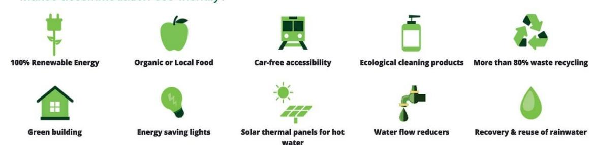

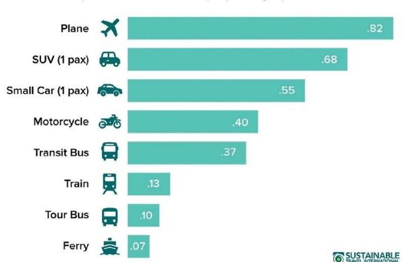

{44}------------------------------------------------

**Text F** is non-continuous text taken from a report produced by the Bevan Foundation. The Bevan Foundation is a charitable organisation that aims to support self-employed people.

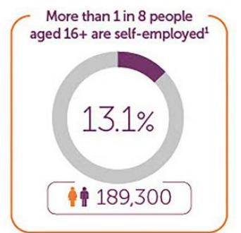

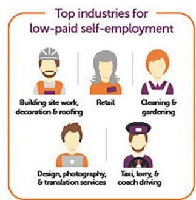

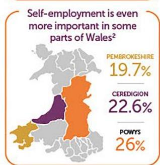

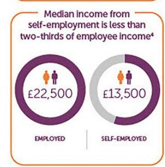

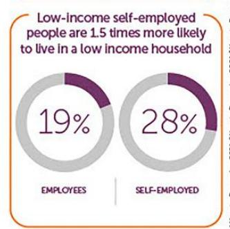

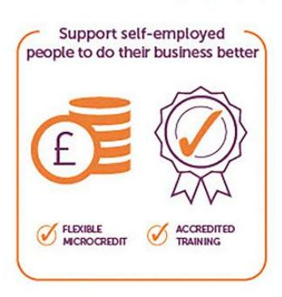

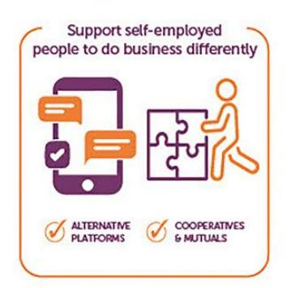

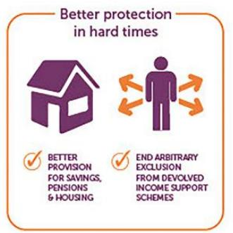

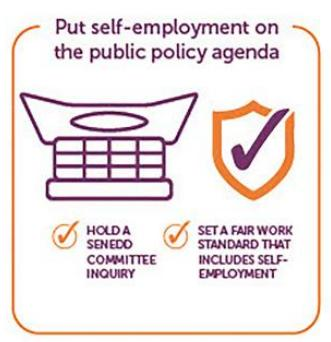

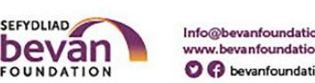

{45}------------------------------------------------

## **Acknowledgements**

**Diversity**

| Text A (and image) | Hattenstone, S. (2023) 'Chris Packham: I would lose my voice immediately if I went to prison for protesting', The Guardian, 19th August. Available at https://www.theguardian.com/environment/2023/aug/19/chris packham-autism-death-threats-save-planet-attenborough (Accessed: 19 November 2024) |
|--------------------|-------------------------------------------------------------------------------------------------------------------------------------------------------------------------------------------------------------------------------------------------------------------------------------------------------------------------------------------------------------------------------|
| Text B | Reay, C. (2023) 'Rosie Jones: Am I a R*tard? review – a truly shocking tale of the online abuse faced by disabled people', The Guardian, 20th July. Available at https://www.theguardian.com/tv-and-radio/2023/jul/20/rosie jones-am-i-a-rtard-review-a-truly-shocking-tale-of-the-online abuse-faced-by-disabled-people (Accessed: 19 November 2024) |
| Text C | Page, E. (2023) PageBoy: A Memoir London: Transworld Publishers, Penguin Random House UK |
| Text D | Ahmed, R. (2017) Diversity 2 March, House of Commons: London. |
| Text E | Abraham, T. (2022) How do ethnic minority Britons feel about the term 'BAME'? Available at: https://yougov.co.uk/politics/articles/40458-how-do-ethnic minority-britons-feel-about-term-bam (Accessed: 19 November 2024) |
| Text F | Zojceska, A.(2018) Top 10 Benefits of Diversity in the Workplace. Available at: https://www.talentlyft.com/blog/top 10-benefits-of-diversity-in-the-workplace (Accessed 19 November 2024) |

**Human Rights**

| Text A | Freedom of Speech, The Reith Lectures (2022) BBC Radio          |  |
|--------|-----------------------------------------------------------------|--|
|        | 4, 30 November. Available at:                                   |  |
|  | https://www.bbc.co.uk/programmes/m001fmtz (Accessed 19 |  |
|        | November 2024)                                                  |  |
| Text B | Anthony, S.B. (1873) On Women's Right to Vote. Available at: |  |
|        | https://www.historyplace.com/speeches/anthony.htm               |  |
|        | (Accessed: 20 November 2024)                                    |  |
| Text C | Yousafzai, M. (2013) 16th birthday speech at United Nations.    |  |
|        | (online). 2 July, United Nations: New York. Available at:       |  |
|        | https://malala.org/newsroom/malala-un                           |  |
|        | speech#:~:text=Dear%20sisters%20and%20brothers%2C%2             |  |
|        | 0I,the%20extremists%20especially%20the%20Taliban.               |  |
|        | (Accessed 19 November 2024).                                    |  |
| Text D | Amnesty International UK (2017) Vision, Mission and Values.     |  |
|        | Available at https://amnesty.org.uk/our-vision-mission-and      |  |
|  | values (Accessed: 14 November 2024) |  |
|        |                                                                 |  |

{46}------------------------------------------------

| Text E | Artwork copyright Gavin Aung Than. www.aungthan.com Zen Pencils (2013) The Universal Declaration of Human Rights. Available at: https://www.zenpencils.com/comic/134- the-universal-declaration-of-human-rights/ (Accessed: 19 November 2024) |  |
|--------|----------------------------------------------------------------------------------------------------------------------------------------------------------------------------------------------------------------------------------------------------------------------------------------------------------------------------------------------------------------------------------------------|--|
| Text F | This article has been republished under Creative Commons from EachOther (www.eachother.org.uk), a human rights charity which inspires people to think again about human rights. Each Other Article 4: Prohibition of slavery and forced labour. Available at: https://eachother.org.uk/article-4-prohibition-of slavery-and-forced-labour/ (Accessed: 19 November 2024) |  |

**Relationships**

| Dylan Thomas, 1937                                             |
|----------------------------------------------------------------|
| The Kennel Club (2024) Mental health – benefits of owning a |
| dog. Available at: https://www.thekennelclub.org.uk/health     |
| and-dog-care/health/health-and-care/a-z-of-health-and-care     |
| issues/mental-health/ (Accessed: 19 November 2024) |
| Fuller, K. (2021) 'Exploring the Differences Between Male      |
| and Female Friendships', Psychology Today, 24 December.        |
| Available at:                                                  |
| https://www.psychologytoday.com/gb/blog/happiness-is           |
| state-of-mind/202112/exploring-the-differences-between         |
| male-and-female-friendships (Accessed: 19 November 2024) |
| Oliver, M & A. (2023) Interviewed by Charlene White Loose      |
| Women, ITV, 23 April. Available at:                            |
| https://www.youtube.com/watch?v=O-L2tRE9Wsc                    |
| (Accessed: 19 November 2024)                                   |
| Adams, J. (2021) Infographic: Steprelatives And Stepfamilies   |
| Explained. Available at: https://dadbloguk.com/infographic     |
| stepfamilies-and-steprelatives-explained/ (Accessed 19 |
| November 2024)                                                 |
| Carers Trust, 2019                                             |
| Available to view at: https://centre404.org.uk/blog/young      |
| carers-awareness-day/ (Accessed 20 November 2024) |
|                                                                |

{47}------------------------------------------------

#### **Wales and Global Contexts**

| Troost, J.M. (2006) Getting Stoned with Savages: A Trip Through the Islands of Fiji and Vanuatu. New York: Broadway This article has been republished under Creative Commons |
|------------------------------------------------------------------------------------------------------------------------------------------------------------------------------------|
|                                                                                                                                                                                    |
|                                                                                                                                                                                    |
|                                                                                                                                                                                    |
|                                                                                                                                                                                    |
|                                                                                                                                                                                    |
| The Open University (2024) Contemporary Wales 5.1.4 The                                                                                                                            |
| 'Taffia'. Available at https://www.open.edu/openlearn/society                                                                                                                      |
| politics-law/sociology/contemporary-wales/content-section-5                                                                                                                        |
|                                                                                                                                                                                    |
|                                                                                                                                                                                    |
| Reynolds, R. & McElhenney, R. (2022) Interviewed by Pete                                                                                                                           |
| Graves Sky Sports News, Sky Sports, 25 August. Available                                                                                                                           |
| at: https://www.youtube.com/watch?v=slTbllD5ysc                                                                                                                                    |
|                                                                                                                                                                                    |
| Chetty, D. (2022) in 'Roughly the size of Wales: four                                                                                                                              |
| reflections on Welsh identity in the 21st Century', The                                                                                                                            |
|                                                                                                                                                                                    |
| https://www.theguardian.com/news/2022/mar/01/roughly-the                                                                                                                           |
| size-of-wales-four-reflections-on-welsh-identity-in-the-21st                                                                                                                       |
|                                                                                                                                                                                    |
| Welsh Government (2023) Cymraeg 2050: A million Welsh                                                                                                                              |
|                                                                                                                                                                                    |
| https://www.gov.wales/sites/default/files/publications/2023-                                                                                                                       |
| 11/cymraeg-2050-a-million-welsh-speakers-update-2022-                                                                                                                              |
|                                                                                                                                                                                    |
| Public Health Wales (2017) What is Physical Inactivity                                                                                                                             |
|                                                                                                                                                                                    |
| https://mecc.publichealthnetwork.cymru/files/3015/1014/3591                                                                                                                        |
| (Accessed: 20 November                                                                                                                                                             |
|                                                                                                                                                                                    |
|                                                                                                                                                                                    |

{48}------------------------------------------------

#### **Work and Sustainability**

| Text A | Attenborough, D. (2021) People's Advocate for #COP26,          |  |
|--------|----------------------------------------------------------------|--|
|  | Address to World Leaders. (online) 2 November, COP26: |  |
|        | Glasgow. Available at:                                         |  |
|        | https://www.youtube.com/watch?v=o7EpiXViSIQ&t=4s               |  |
|        | (Accessed: 20 November 2024)                                   |  |
| Text B | Dreyfuss, E. (2015) 'My Life as a Robot', Wired, 8 September.  |  |
|        | Available at: https://www.wired.com/2015/09/my-life-as-a-robot |  |
|  | double-robotics-telecommuting-longread/ (Accessed: 20 |  |
|        | November 2024)                                                 |  |
| Text C | Contains Natural Resources Wales information © Natural         |  |
|        | Resources Wales and Database Right. All rights reserved.       |  |
|        | Natural Resources Wales (2024) Encouraging a sustainable       |  |
|        | economy Available at: https://naturalresources.wales/about     |  |
|        | us/what-we-do/strategies-plans-and-policies/area               |  |
|        | statements/north-west-wales-area-statement/encouraging-a       |  |
|  | sustainable-economy/?lang=en (Accessed: 20 November 2024) |  |
| Text D | Friends of the Earth, Renewable Energy in the UK: How wind,    |  |
|  | wave and sun will power the UK. Available at: |  |
|        | https://friendsoftheearth.uk/climate/renewable-energy-uk-how   |  |
|        | wind-wave-and-sun-will-power                                   |  |
|        | uk#:~:text=We're%20already%20making%20progress,onshore         |  |
|  | %20wind%20production%20in%20England. (Accessed: 20 |  |
|        | November 2024)                                                 |  |
| Text E | Reproduced with kind permission of Sustainable Travel          |  |
|        | International                                                  |  |
|        | Sustainable Travel International (2024) Carbon Footprint of    |  |
|        | Tourism. Available at:                                         |  |
|        | https://sustainabletravel.org/issues/carbon-footprint-tourism/ |  |
|        | (Accessed: 20 November 2024)                                   |  |
| Text F | Reproduced under Creative Commons License CC BY-NC-ND          |  |
|        | 4.0                                                            |  |
|        | Bevan Foundation (2022) A New Deal for Self-employment in      |  |
|  | Wales. 5 July. Available at: |  |
|        | https://www.bevanfoundation.org/resources/a-new-deal-for-self  |  |
|  | employment/ (Accessed: 20 November 2024) |  |
|        |                                                                |  |

Every effort has been made to contact copyright owners, some without response. If this causes any concern to the publisher or other interested party then please contact us and we will act appropriately.