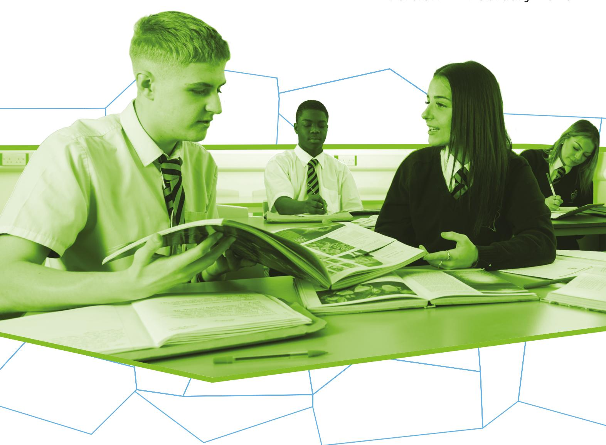

{1}------------------------------------------------

# WJEC GCSE History

Approved by Qualifications Wales

Guidance for Teaching: Unit 1 Option 1.1

Teaching from 2026

For award from 2028

Version 2 - February 2025

Ready for the world. This Qualifications Wales regulated qualification is not available to centres in England.

Made for Wales.

{2}------------------------------------------------

{3}------------------------------------------------

# Contents

| Introduction                                                                                          | 1  |
|-------------------------------------------------------------------------------------------------------|----|
| Aims of the Guidance for Teaching                                                                     | 1  |
| Additional ways that WJEC can offer support:                                                          | 1  |
| Qualification Structure                                                                               | 2  |
| Assessment                                                                                            | 3  |
| Summary of Assessment- Unit 1                                                                      | 3  |
| Unit 1 Assessment objectives and weightings                                                           | 3  |
| Overview of Unit 1 Medieval: Option 1.1                                                               | 4  |
| Scheme of Learning for Option 1.1 Medieval: Rhys ap Gruffudd, Prince of Deheubarth c.1132 – c.1197 | 5  |
| Learning Experiences                                                                                  | 25 |
| Opportunities for embedding elements of the Curriculum for Wales                                      | 27 |
| Glossary for Option 1.1 Medieval: Rhys ap Gruffudd, Prince of Deheubarth c.1132 – c.1197           | 34 |

{4}------------------------------------------------

# SUMMARY OF AMENDMENTS

| Version | Description                                               | Page number |
|---------|-----------------------------------------------------------|-------------|
| 2       | Amended to, awarded for the first time in Summer 2028. | 1           |

{5}------------------------------------------------

# Introduction

The WJEC GCSE History has been approved by Qualifications Wales and is available to all centres in Wales. It will be awarded for the first time in Summer 2028, using grades A\* to G.

## Aims of the Guidance for Teaching

The principal aim of the Guidance for Teaching is to support teachers in the delivery of WJEC GCSE History and to offer guidance on the requirements of the qualification and the assessment process. The Guidance for Teaching is **not intended as a comprehensive reference**, but as support for teachers to develop stimulating and exciting courses tailored to the needs and skills of their learners. The guide offers possible classroom activities and links to useful resources (including our own, freely available digital materials and some from external sources) to provide ideas for immersive and engaging lessons.

## Additional ways that WJEC can offer support:

- sample assessment materials and mark schemes
- professional learning events
- examiners' reports on each unit
- direct access to the subject officer
- free online resources
- Exam Results Analysis
- Online Examination Review.

{6}------------------------------------------------

# Qualification Structure

WJEC GCSE History consists of four units. The combination of options selected for Units 1, 2 and 3 must include one medieval, one early modern and one modern unit.

In Unit 4, centres can choose to repeat a time period previously studied in Units 1, 2 or 3. **However, the topics chosen for study in Unit 4 must not replicate or overlap with the content of any of the other selected units.**

The qualification is unitised and does not contain tiering. There is no hierarchy to the order the units should be taught.

|        | Unit title                                            | Type of Assessment         | Weighting |
|--------|-------------------------------------------------------|-------------------------------|-----------|
| Unit 1 | An in-depth study on Welsh history                    | Written examination           | 30%       |
| Unit 2 | An in-depth study on European and/or World history | Non-examination assessment | 20%       |
| Unit 3 | A study of a period in world history                  | Written examination           | 30%       |
| Unit 4 | A changing society                                    | Non-examination assessment | 20%       |

{7}------------------------------------------------

# Assessment

## Summary of Assessment- Unit 1

### Unit 1: An in-depth study on Welsh history Written examination: 1 hour 30% of qualification

**60 marks** 

Learners will study one of the following six historical topics to undertake an in-depth study that will provide them with an insight into the development of Wales at a specific point in time.

#### Medieval

- **1.1** Rhys ap Gruffudd, Prince of Deheubarth c.1132–c.1197
- **1.2** Owain Glyndwr c.1354–c.1416

#### Early Modern

- **1.3** Wales and the early Tudors c.1485–c.1547
- **1.4** Wales in the era of the Civil War 1603–c.1660

#### Modern

- **1.5** Rebellions and Protest in Wales, c.1831–c.1892
- **1.6** Wales in the early to mid-twentieth century, c.1914–c.1959

Each option will be assessed by compulsory questions. These will focus on historical knowledge of the topic, second order historical concepts and the analysis and evaluation of historical sources and interpretations.

#### Unit 1 Assessment objectives and weightings

| AO1 | Demonstrate knowledge and understanding of the features and characteristics of the period studied                                                          | 10% |
|-----|------------------------------------------------------------------------------------------------------------------------------------------------------------|-----|
| AO2 | Apply knowledge and understanding to historical concepts such as cause and consequence, continuity and change, similarity and difference, and significance | 10% |
| AO3 | Analyse, evaluate, or make judgements on source material, historical interpretations and historical debates, synthesising these strands where appropriate  | 10% |

{8}------------------------------------------------

# Overview of Unit 1 Medieval: Option 1.1

## An in-depth study on Welsh history

(30% of the qualification)

The purpose of Unit 1 is to provide an insight into the development of Wales at a specific point in time. The aim of Option 1.1 is to develop learner understanding of the impact of the rule of Rhys ap Gruffudd, Prince of Deheubarth across the period from c. 1132 to c. 1197.

| Time period | Option |                                                                                     |
|----------------|--------|-------------------------------------------------------------------------------------|
| Medieval       | 1.1    | Rhys ap Gruffudd, Prince of Deheubarth c.1132–c.1197                                |
|                | 1.1.1  | The family background of Rhys ap Gruffudd                                           |
|                | 1.1.2  | The importance of warfare in shaping South Wales between 1146 and 1170           |
|                | 1.1.3  | Establishing a peace with Henry II, c. 1170–1189                                    |
|                | 1.1.4  | The reasons for and impact of further outbreaks of warfare between 1189 and 1196 |
|                | 1.1.5  | The death and legacy of Rhys ap Gruffudd                                            |

{9}------------------------------------------------

# Scheme of Learning for Option 1.1 Medieval: Rhys ap Gruffudd, Prince of Deheubarth c.1132 – c.1197

This scheme of learning is provided as an illustrative example. It is designed to offer structure and inspiration but allows for adaptation to meet the unique needs, preferences and dynamics of individual classes. Teachers are encouraged to modify elements as needed to align with their students' abilities and learning goals.

**For each section of content in this unit, WJEC is also providing blended learning resources and knowledge organisers. These can be found on:<https://resources.wjec.co.uk/>**

## 1.1 Background: Wales at the start of the twelfth century

(Each option begins with a background section. These sections are intended to provide learners with necessary context in order to access the historical topic**. Learners will not be directly assessed on the content of the background sections**).

| Learners should be aware of:                                                                                                            | Knowledge                                                                                                                                                                                                                                        | Activities and Outcomes                                                                                                                                                                                                                                                                                                                                                                                                                                             | Resources                                                                                                                                                                                                                                                | Suggested timing (hours) |
|-----------------------------------------------------------------------------------------------------------------------------------------|--------------------------------------------------------------------------------------------------------------------------------------------------------------------------------------------------------------------------------------------------|---------------------------------------------------------------------------------------------------------------------------------------------------------------------------------------------------------------------------------------------------------------------------------------------------------------------------------------------------------------------------------------------------------------------------------------------------------------------|----------------------------------------------------------------------------------------------------------------------------------------------------------------------------------------------------------------------------------------------------------|-----------------------------|
| the significance of Norman conquest and rule, the extent of Norman success in subduing Wales and the creation of the March. | How Wales was ruled before the Normans, including the ancient kingdoms and the laws of Hywel Dda.  The significance of the Norman Conquest and its impact on Wales by 1100.  The power of the Marcher Lords. | Activity: Record an outline of the Norman incursions into Wales after 1066 on an outline map of the old Welsh kingdoms.  Outcome: Learners can demonstrate that they understand how Wales was ruled at the beginning of this period and can make comments on the impact of the Norman Conquest on Wales.  Advanced activity: Annotate the map with details about the conflict between the Welsh and the Normans. | Website(s): Kingdom of Wales - Sarah Woodbury  Video(s): History Minute: The Welsh Common Law  Gruffydd ap Llywelyn - Sarah Woodbury  Norman invasion of Wales  Wales in the Norman Era - Sarah Woodbury | 2 hours                     |

{10}------------------------------------------------

# Advanced outcome:

Learners can draw conclusions about the extent of the impact of the Norman Conquest on Wales. [How the Normans](https://youtu.be/YIKCedE6ixQ)  [invaded Wales](https://youtu.be/YIKCedE6ixQ)

## Map(s):

[Wales in the Early Middle](https://en.wikipedia.org/wiki/Wales_in_the_early_Middle_Ages#/media/File:Medieval_Wales.JPG)  [Ages](https://en.wikipedia.org/wiki/Wales_in_the_early_Middle_Ages#/media/File:Medieval_Wales.JPG)

[Map of Gruffydd ap](https://en.wikipedia.org/wiki/Gruffydd_ap_Llywelyn#/media/File:Wales_1039-63_(Gruffudd_ap_Llywelyn).svg)  [Llywelyn's Conquest](https://en.wikipedia.org/wiki/Gruffydd_ap_Llywelyn#/media/File:Wales_1039-63_(Gruffudd_ap_Llywelyn).svg)

#### Books:

*The Lord Rhys, Prince of Deheubarth* by Roger Turvey, Chapter 1

*Wales and Britain in the Medieval World c.1000- 1500* by Hefin Mathias, Chapters 2 and 3

*Curriculum for Wales: History for 11-14 years* by Rob Quinn and R. Paul Evans, Chapters 1.2 and 9.1

{11}------------------------------------------------

2 hours

• important features of life in Wales in the twelfth century, from religion to the nature of its economy, society and culture.

What life was like in Wales before the Norman Conquest.

How life in the Marches began to differ from life in the rest of Wales.

How Welsh Christianity had developed separately from the Church in England.

Why there were disputes between Welsh rulers and the Archbishop of Canterbury over how the Church in Wales was run.

## Activity:

Draw a spider diagram to record information about different aspects of life in Wales at the beginning of the twelfth century.

#### Outcome:

Learners can show their understanding of what life in Wales was like at the beginning of this period.

#### Advanced activity:

Add details to the spider diagram above to show how aspects of life might have been different between the areas controlled by the Welsh and those controlled by the Normans.

## Advanced outcome:

Learners can draw conclusions about the extent to which life in Wales was different to life in England in this period.

## Website(s):

[The Welsh Marches -](https://www.ludlow.org.uk/historyofthemarches.html) A [History](https://www.ludlow.org.uk/historyofthemarches.html)

[The Welsh Marcher](https://mortimerhistorysociety.org.uk/marcher-lordships/)  [Lordships](https://mortimerhistorysociety.org.uk/marcher-lordships/)

[The Welsh Marches -](https://www.castlewales.com/march.html) [Lise Hull](https://www.castlewales.com/march.html)

#### Video(s):

[Regions of Britain -](https://youtu.be/RSzWS1ml8jg) The [Welsh Marches](https://youtu.be/RSzWS1ml8jg)

[Norman Conquest of](https://youtu.be/8QKGJZEveGM)  Wales - [History File](https://youtu.be/8QKGJZEveGM)

## Podcast(s):

[The Welsh Marches -](https://www.history.org.uk/podcasts/categories/432/podcast/516/the-welsh-marches) [Historical Association](https://www.history.org.uk/podcasts/categories/432/podcast/516/the-welsh-marches)

## Book(s):

*The Lord Rhys, Prince of Deheubarth* by Roger Turvey, Chapter 1

*Wales and Britain in the Medieval World c.1000- 1500* by Hefin Mathias, Chapter 1

*Curriculum for Wales : History for 11-14 years* by Rob Quinn and R. Paul Evans, Chapters 1.1 and 2.1

{12}------------------------------------------------

| 1.1.1 The family background of Rhys ap Gruffudd                                                                                                                                                                                              |                                                                                                                                                                                                                                                                                                                                                                                                                                                                |                                                                                                                                                                                                                                                                                                                                                                                                                                                                                                                                                                                                                                                                        |                                                                                                                                                                                                                                                                                                                                             |                             |
|----------------------------------------------------------------------------------------------------------------------------------------------------------------------------------------------------------------------------------------------|----------------------------------------------------------------------------------------------------------------------------------------------------------------------------------------------------------------------------------------------------------------------------------------------------------------------------------------------------------------------------------------------------------------------------------------------------------------|------------------------------------------------------------------------------------------------------------------------------------------------------------------------------------------------------------------------------------------------------------------------------------------------------------------------------------------------------------------------------------------------------------------------------------------------------------------------------------------------------------------------------------------------------------------------------------------------------------------------------------------------------------------------|---------------------------------------------------------------------------------------------------------------------------------------------------------------------------------------------------------------------------------------------------------------------------------------------------------------------------------------------|-----------------------------|
| Learners should understand:                                                                                                                                                                                                                  | Knowledge                                                                                                                                                                                                                                                                                                                                                                                                                                                      | Activities and Outcomes                                                                                                                                                                                                                                                                                                                                                                                                                                                                                                                                                                                                                                                | Resources                                                                                                                                                                                                                                                                                                                                   | Suggested timing (hours) |
| • the ancestry of Rhys ap Gruffudd, including: • the claim of his father, Gruffydd ap Rhys, to the kingdom of Deheubarth • the significance of his mother, Gwenllian ferch Gruffydd ap Cynan, a princess of Gwynedd. | The nature of the claim of the House of Dinefwr to the throne of Deheubarth.  How Gruffudd ap Rhys reclaimed the royal title of Deheubarth after his father had lost it.  The significance of Gwenllian ferch Gruffydd ap Cynan and her connection to the kings of Gwynedd.  How Gruffydd ap Rhys and Gwenllian ferch Gruffydd ap Cynan were involved in a Welsh revolt against Norman control. | Activity: Draw a family tree for the family of Gruffudd ap Rhys, from his parents to his children.  Outcome: Learners can demonstrate that they understand the importance of Rhys ap Gruffudd's parents to the position he found himself in when he became ruler of Deheubarth.  Advanced activity: Annotate the family tree with details about what Rhys ap Gruffudd and Gwenllian ferch Gruffudd ap Cynan did to strengthen Deheubarth.  Advanced outcome: Learners can draw conclusions about the extent to which the parents of Rhys ap Gruffudd influenced him as ruler of Deheubarth. | Video(s): Gwenllian ferch Gruffydd - Sarah Woodbury Boudicca of Wales: Gwenllian ferch Gruffydd Kidwelly Castle - Sarah Woodbury  Book(s): The Lord Rhys, Prince of Deheubarth by Roger Turvey, Chapter 2  Curriculum for Wales: History for 11-14 years by Rob Quinn and R. Paul Evans, Chapter 1.2 | 1 hour                      |

{13}------------------------------------------------

1 hour

- the nature and importance of Rhys's relationship with his brothers, including:
  - the campaigns and death of his half-brother Anarawd in 1143
  - the importance of his surviving brothers Maredudd and Cadell.

The ancient Welsh tradition of dividing a kingdom between all the male heirs.

The unusual way in which the sons of Gruffudd ap Rhys took it in turn to rule Deheubarth instead of dividing it between them.

The importance of the gains made by each brother in succession as they continued to fight the Normans and their rivals from Gwynedd.

## Activity:

Write a brief biography of each of the brothers of Rhys ap Gruffudd.

#### Outcome:

Learners can show their understanding of the relationship between Rhys ap Gruffudd and his brothers.

#### Advanced activity:

Compare the relationship of Rhys ap Gruffudd and his brothers to Owain and Cadwaladr (the sons of Gruffudd ap Cynan, king of Gwynedd). Write down the similarities and differences.

## Advanced outcome:

Learners can draw conclusions about the importance of the peaceful relationship between Rhys ap Gruffudd and his brothers.

## Website(s):

[Cadwaladr ap Gruffydd,](https://www.sarahwoodbury.com/so-what-was-up-with-cadwaladr-ap-gruffydd/)  [brother to the King](https://www.sarahwoodbury.com/so-what-was-up-with-cadwaladr-ap-gruffydd/)

#### Video(s):

[The Lord Rhys: Sarah](https://youtu.be/vVhKXdQk3lk)  [Woodbury \(Start at 1:43\)](https://youtu.be/vVhKXdQk3lk)

[Maredudd ap Gruffydd:](https://youtu.be/SiGPX5ivT2U)  [Fun Facts](https://youtu.be/SiGPX5ivT2U)

[Owain Gwynedd: Sarah](https://youtu.be/exHXf3_0gLs)  [Woodbury](https://youtu.be/exHXf3_0gLs)

[Llansteffan Castle -](https://youtu.be/Zk74ZO49be0) [Sarah Woodbury](https://youtu.be/Zk74ZO49be0)

[Wiston Castle -](https://youtu.be/YOnGYNSihSE) Sarah [Woodbury](https://youtu.be/YOnGYNSihSE)

#### Book(s):

*The Lord Rhys, Prince of Deheubarth* by Roger Turvey, Chapter 2

{14}------------------------------------------------

2 hours

- the rule of Rhys ap Gruffudd, including:
  - how and why he became ruler of Deheubarth in 1155
  - the importance of his marriage to Gwenllian ferch Madog ap Maredudd, daughter of the Prince of Powys.

How the death of two of his brothers and the serious wounding of another put Rhys ap Gruffudd on the throne of Deheubarth.

How working with his brothers helped Rhys ap Gruffudd to cement his position as ruler when he took control of Deheubarth in 1155.

The importance of a marriage into another of the Welsh royal families.

## Activity:

Work in groups to summarise the information about the royal family of Deheubarth to present an explanation to the class for how Rhys ap Gruffudd established himself as the ruler of Deheubarth.

#### Outcome:

Learners can demonstrate that they understand how Rhys ap Gruffudd established himself as the sole ruler of Deheubarth.

#### Advanced activity:

Organise a debate between learners defending the idea that it was difficult for Rhys ap Gruffudd to become ruler of Deheubarth, and others arguing that it was simple and straightforward.

## Advanced outcome:

Learners can assess how easily Rhys ap Gruffudd became ruler of Deheubarth.

## Website(s):

[Rhys ap Gruffudd -](https://www.johnnyowen.com/yr_arglwydd_rhys.html) [Welsh Warriors](https://www.johnnyowen.com/yr_arglwydd_rhys.html)

[Welsh Rulers: Age of the](https://hwb.gov.wales/api/storage/6278ff69-7d4d-4206-8b09-cf0778fd8a6b/WelshRulers.pdf)  [princes](https://hwb.gov.wales/api/storage/6278ff69-7d4d-4206-8b09-cf0778fd8a6b/WelshRulers.pdf)

[Rhys ap Gruffudd](https://llandeilo.org/rhys_ap_gruffudd.php)  [\(1131/2-1197\) -](https://llandeilo.org/rhys_ap_gruffudd.php) Llandeilo [History](https://llandeilo.org/rhys_ap_gruffudd.php)

[Rhys ap Gruffudd](https://www.castlewales.com/lrdrhys.html)

#### Video(s):

[The Princes of Wales](https://www.bbc.co.uk/bitesize/articles/z8k39ty#zgrsg2p)  [\(Play from 4:11-7:16\)](https://www.bbc.co.uk/bitesize/articles/z8k39ty#zgrsg2p)

## Books:

*The Lord Rhys, Prince of Deheubarth* by Roger Turvey, Chapter 2

{15}------------------------------------------------

| 1.1.2 The importance of warfare in shaping South Wales between 1146 and 1170                                                                                                                                                                                                                     |                                                                                                                                                                                                                                                                                                                                                                                                                                                                                                                                                                                                               |                                                                                                                                                                                                                                                                                                                                                                                                                                                                                                                                                                                                                       |                                                                                                                                                                                                                                                                                                                                                                                                                                                                |                             |
|--------------------------------------------------------------------------------------------------------------------------------------------------------------------------------------------------------------------------------------------------------------------------------------------------|---------------------------------------------------------------------------------------------------------------------------------------------------------------------------------------------------------------------------------------------------------------------------------------------------------------------------------------------------------------------------------------------------------------------------------------------------------------------------------------------------------------------------------------------------------------------------------------------------------------|-----------------------------------------------------------------------------------------------------------------------------------------------------------------------------------------------------------------------------------------------------------------------------------------------------------------------------------------------------------------------------------------------------------------------------------------------------------------------------------------------------------------------------------------------------------------------------------------------------------------------|----------------------------------------------------------------------------------------------------------------------------------------------------------------------------------------------------------------------------------------------------------------------------------------------------------------------------------------------------------------------------------------------------------------------------------------------------------------|-----------------------------|
| Learners should understand:                                                                                                                                                                                                                                                                      | Knowledge                                                                                                                                                                                                                                                                                                                                                                                                                                                                                                                                                                                                     | Activities and Outcomes                                                                                                                                                                                                                                                                                                                                                                                                                                                                                                                                                                                               | Resources                                                                                                                                                                                                                                                                                                                                                                                                                                                      | Suggested timing (hours) |
| • the nature and extent of the Kingdom of Deheubarth, in the early twelfth century, including: • the loss of Deheubarth to the Normans in 1093 following the death of Rhys ap Tewdwr • the attempt to reclaim Deheubarth territories in 1116 and 1136. | Revisit the ancient kingdoms of Wales, showing how they were briefly united by Gruffudd ap Llywelyn, king of Gwynedd. The significance of how Rhys ap Tewdwr became to be recognised as the ruler of Deheubarth after family feuding until his death in 1093. How Gruffudd ap Rhys returned from exile in Ireland to stake his claim to Deheubarth and become involved in Welsh revolts against Norman control. How the Norman civil war of The Anarchy contributed to the success of the Welsh revolt, especially for Deheubarth. | Activity: Create a timeline from 1155 to 1136 to show how the kingdom of Deheubarth was ruled by different people. Outcome: Learners can show their understanding of how the kingdom of Deheubarth had to be recovered after it had been taken by the Normans. Advanced activity: Research the events of The Anarchy and use them to explain the reasons behind the Welsh revolt against Norman control. Advanced outcome: Learners can draw conclusions about the importance of Civil War in England and its impact on relations with the Welsh princes. | Website(s): The Early Welsh Kingdoms: Deheubarth The Kingdom of Deheubarth - Sarah Woodbury King Stephen and The Anarchy - Historic UK The Revolt of 1136 - Sarah Woodbury The Battle of Crug Mawr - Historic UK How the Longbow Won the Battle of Crug Mawr - Historynet Video(s): The rise of the Plantagenets - BBC Teach Ten Minute English and British History Norman Invasion of Wales | 2 hours                  |
|                                                                                                                                                                                                                                                                                                  |                                                                                                                                                                                                                                                                                                                                                                                                                                                                                                                                                                                                               | Activity:                                                                                                                                                                                                                                                                                                                                                                                                                                                                                                                                                                                                             | Website(s):                                                                                                                                                                                                                                                                                                                                                                                                                                                    | 1 hour                      |
| • the significance of the wars with Gwynedd, including: • the capture of Carmarthen Castle in 1145 and the castle at Tenby in 1153 • the recapture of Ceredigion from Gwynedd in 1153.                                                                                                     | The importance of the family connections between the rulers of Deheubarth and Gwynedd. Rival claims of Deheubarth and Gwynedd to territories in the west of Wales, such as Ceredigion. The successes of successive rulers of Deheubarth against Owain Gwynedd and his brother Cadwaladr ap Gruffydd.                                                                                                                                                                                                                                                                                                    | Outcome: Learners can demonstrate that they understand that there was a rivalry between Gwynedd and Deheubarth of the lands in western Wales. Advanced activities: Plot the castles and territory gained on a map. Discuss the extent to which the territory of the kingdom had expanded. Advanced outcome: Learners can draw conclusions about the extent to which Deheubarth was successful in its rivalry with Gwynedd.                                                                                                                                                                          | The Battle of Crug Mawr 1136 AD Map(s): Battle of Crug Mawr Book(s): The Lord Rhys, Prince of Deheubarth by Roger Turvey, Chapter 2 Owain Gwynedd & Rhys ap Gruffudd - Britain Express Tenby Castle Video(s): Carmarthen Castle Map(s): Deheubarth Book(s): The Lord Rhys, Prince of Deheubarth by Roger Turvey, Chapter 2                                                                                              |                             |

{16}------------------------------------------------

{17}------------------------------------------------

3 hours

- the revolt against English rule, including:
  - the campaigns against England, 1158–1170
  - the outcome of the revolt.

The significance of Henry II becoming King of England and his attacks on Wales to reclaim Norman territory lost to the Welsh princes.

The consequences of the submission of Lord Rhys and other Welsh princes at the Council of Woodstock in 1163.

Welsh victory at the 1165 Battle of Crogen as a turning point in the revolt against Henry II.

The death of Owain Gwynedd leaving Rhys ap Gruffudd as the most powerful ruler in Wales.

## Activities:

Make a timeline of the main events of the revolt, annotating to show successes and failures.

Write a detailed description of the Battle of Crogen.

Write a paragraph to explain why Lord Rhys had become the most powerful ruler in Wales by the end of the revolt.

#### Outcome:

Learners can demonstrate that they understand what happened in the Welsh revolts against Henry II.

#### Advanced activities:

Discuss how significant submission to English authority was at the royal council compared to the successes like the battle of Crogen.

Discuss how important the distractions for Henry were in the bringing about of victory for the Welsh princes, for example the argument with the Church and problems with his empire in France.

## Website(s):

[Ewloe Castle -](https://www.castlewales.com/ewloe.html) [Castlewales.com](https://www.castlewales.com/ewloe.html)

[Constitutions of](https://conclarendon.blogspot.com/2012/12/council-of-woodstock-1st-july-1163.html)  [Clarendon](https://conclarendon.blogspot.com/2012/12/council-of-woodstock-1st-july-1163.html)

[Battle of Crogen -](https://www.sarahwoodbury.com/battle-of-crogen/) Sarah [Woodbury](https://www.sarahwoodbury.com/battle-of-crogen/)

[Henry II's Campaign](https://www.deremilitari.org/RESOURCES/SOURCES/latimer.htm)  [Against the Welsh in](https://www.deremilitari.org/RESOURCES/SOURCES/latimer.htm)  1165 - [Paul Latimer](https://www.deremilitari.org/RESOURCES/SOURCES/latimer.htm)

[Lord Rhys ap Gruffudd](https://cadw.gov.wales/sites/default/files/2019-04/20140916lordrhysapgruffyddbaseen.pdf)  [Timeline](https://cadw.gov.wales/sites/default/files/2019-04/20140916lordrhysapgruffyddbaseen.pdf)

[Lord Rhys ap Gruffudd](https://cadw.gov.wales/sites/default/files/2019-04/20140916lordrhysapgruffyddcardsen.pdf)  [Timeline Cards](https://cadw.gov.wales/sites/default/files/2019-04/20140916lordrhysapgruffyddcardsen.pdf)

[The Political and Military](https://repository.uwtsd.ac.uk/id/eprint/2004/6/2004%20Farrington-Daniel-2022-The%20Political%20and%20Military%20Impact%20of%20Henry%20II%E2%80%99s%20Campaigns%20in%20Wales.pdf)  [Impact of Henry II's](https://repository.uwtsd.ac.uk/id/eprint/2004/6/2004%20Farrington-Daniel-2022-The%20Political%20and%20Military%20Impact%20of%20Henry%20II%E2%80%99s%20Campaigns%20in%20Wales.pdf)  [Campaign in Wales](https://repository.uwtsd.ac.uk/id/eprint/2004/6/2004%20Farrington-Daniel-2022-The%20Political%20and%20Military%20Impact%20of%20Henry%20II%E2%80%99s%20Campaigns%20in%20Wales.pdf)

#### Video(s):

[1157 The Battle of Ewloe](https://youtu.be/d0vTHro01Kw)

[Owain Gwynedd -](https://youtu.be/exHXf3_0gLs) Sarah [Woodbury](https://youtu.be/exHXf3_0gLs)

[England's Embarrassing](https://youtu.be/6YpHJvl2A38)  [Defeat to a Kingdom -](https://youtu.be/6YpHJvl2A38) [Cambrian Chronicles](https://youtu.be/6YpHJvl2A38)

{18}------------------------------------------------

| Advanced outcome: Learners can draw conclusions about how successful Lord Rhys was in his campaigns against Henry II. | The Kingdom of Gwynedd (878 - 1283) - Cambrian Chronicles Battle of Crogen - Sarah Woodbury Battle of Crogen - Llangollen Museum Welsh Resistance in South Wales - Sarah Woodbury The Lord Rhys - Failures then victory against Henry II 1150s & 1160s (1.42 to 2.24) |
|-----------------------------------------------------------------------------------------------------------------------------------|--------------------------------------------------------------------------------------------------------------------------------------------------------------------------------------------------------------------------------------------------------------------------------------------------------------------------|
|                                                                                                                                   | Book(s): The Lord Rhys, Prince of Deheubarth by Roger Turvey, Chapter 3                                                                                                                                                                                                                                   |

{19}------------------------------------------------

| 1.1.3 Establishing a peace with Henry II, c.1170 - 1189                                                                                                                                                               |                                                                                                                                                                                                                                                                                                                                                                                                                                                                                                                                                                                                   |                                                                                                                                                                                                                                                                                                                                                                                                                                                                                                                                                                                                                                                                                                                   |                                                                                                                                                                                                                                                                                                                                                                                                                                                                                                                                                                                                                                                              |                                                                                                                                                                                                                                                                                                                                                                                                                                                                                     |         |
|-----------------------------------------------------------------------------------------------------------------------------------------------------------------------------------------------------------------------|---------------------------------------------------------------------------------------------------------------------------------------------------------------------------------------------------------------------------------------------------------------------------------------------------------------------------------------------------------------------------------------------------------------------------------------------------------------------------------------------------------------------------------------------------------------------------------------------------|-------------------------------------------------------------------------------------------------------------------------------------------------------------------------------------------------------------------------------------------------------------------------------------------------------------------------------------------------------------------------------------------------------------------------------------------------------------------------------------------------------------------------------------------------------------------------------------------------------------------------------------------------------------------------------------------------------------------|--------------------------------------------------------------------------------------------------------------------------------------------------------------------------------------------------------------------------------------------------------------------------------------------------------------------------------------------------------------------------------------------------------------------------------------------------------------------------------------------------------------------------------------------------------------------------------------------------------------------------------------------------------------|-------------------------------------------------------------------------------------------------------------------------------------------------------------------------------------------------------------------------------------------------------------------------------------------------------------------------------------------------------------------------------------------------------------------------------------------------------------------------------------|---------|
| Learners should understand:                                                                                                                                                                                           | Knowledge                                                                                                                                                                                                                                                                                                                                                                                                                                                                                                                                                                                         | Activities and Outcomes                                                                                                                                                                                                                                                                                                                                                                                                                                                                                                                                                                                                                                                                                           | Resources                                                                                                                                                                                                                                                                                                                                                                                                                                                                                                                                                                                                                                                    | Suggested timing (hours)                                                                                                                                                                                                                                                                                                                                                                                                                                                         |         |
| • how and why relations with Henry II were developed, including: • Rhys's role as Justiciar from 1172 • the importance of the Royal Councils at Gloucester, 1175 and Oxford, 1177.      | The impact of the difficulties facing Henry II, including a dispute with the Church, problems in his possessions in France and a revolt by his nobles. The importance of the role of Justiciar as a representative of the king's power while the king is away on other duties. The role of royal councils in ruling Henry II's kingdom and the significance of Lord Rhys being invited to attend.                                                                                                                                     | Activities: Research and write an explanation for why Henry II chose Lord Rhys to be Justiciar in his absence. Draw a spider diagram to represent all the distractions Henry II was dealing with in the 1170s and 1180s. Outcome: Learners can demonstrate that they understand Lord Rhys had become a valued ally of King Henry II. Advanced activities: Debate how powerful Lord Rhys was by the 1170s, with one side arguing that he was and the other arguing he was not. After hearing the arguments in the debate, learners can give a written justification for their own opinion about how powerful Lord Rhys was in this period. | Video(s): The Lord Rhys - Sarah Woodbury (Play from 2.27-3.04) Improving relations with Henry II Henry II summary including Great Revolt Book(s): The Lord Rhys, Prince of Deheubarth by Roger Turvey, Chapters 4 and 5                                                                                                                                                                                                                                                                                                                                                                                                  | 2 hours                                                                                                                                                                                                                                                                                                                                                                                                                                                                          |         |
|                                                                                                                                                                                                                       |                                                                                                                                                                                                                                                                                                                                                                                                                                                                                                                                                                                                   | Advanced outcome: Learners can draw conclusions about how powerful Lord Rhys was during this period.                                                                                                                                                                                                                                                                                                                                                                                                                                                                                                                                                                                                     | Activities: Using research into motte and bailey and stone keep castles, label diagrams to show the different features. Annotate the diagrams to show how castle designs developed in this period. Research and give a presentation to the class on one of the castles associated with Lord Rhys. Outcome: Learners can demonstrate that they understand the importance of castles to Lord Rhys as the ruler of Deheubarth. Advanced activity: Discuss why castles were needed by Welsh rulers in this period and what made them different from castles built in Wales in later centuries. | Website(s): Native Welsh castles Video(s): Castles of the Welsh princes - Sarah Woodbury Dinefwr Castle - Sarah Woodbury History of the National Eisteddfod Book(s): The Lord Rhys, Prince of Deheubarth by Roger Turvey, Chapters 4 and 5 Wales and Britain in the Medieval World c.1000-1500 by Hefin Mathias, Chapter 4 Curriculum for Wales: History for 11-14 years by Rob Quinn and R. Paul Evans, Chapter 2.2 | 2 hours |
| • the reasons for and significance of castles and castle building, including: • Cardigan Castle, the venue for the first Eisteddfod, held in 1176 • Dinefwr Castle, the family's ancestral home. | The significance of the building of castles in Wales from pre-Norman times to the motte and bailey and stone keep castles of the Normans. The holding of the first Eisteddfod at Cardigan Castle and its influence on Welsh culture. The importance of Dinefwr Castle as the ancient seat of the rulers of Deheubarth.                                                                                                                                                                                                                                     |                                                                                                                                                                                                                                                                                                                                                                                                                                                                                                                                                                                                                                                                                                                   |                                                                                                                                                                                                                                                                                                                                                                                                                                                                                                                                                                                                                                                              |                                                                                                                                                                                                                                                                                                                                                                                                                                                                                     |         |
|                                                                                                                                                                                                                       |                                                                                                                                                                                                                                                                                                                                                                                                                                                                                                                                                                                                   | Advanced outcome: Learners can draw conclusions about why castles were needed by Welsh rulers during this period.                                                                                                                                                                                                                                                                                                                                                                                                                                                                                                                                                                                     |                                                                                                                                                                                                                                                                                                                                                                                                                                                                                                                                                                                                                                                              |                                                                                                                                                                                                                                                                                                                                                                                                                                                                                     |         |
| • the importance of religion, including: • the patronage of abbeys including Strata Florida • support for Gerald of Wales and for the Third Crusade.                                                            | Consider the disputes between the Church in Rome and Henry II, as well as longer term disputes between the Welsh princes and the Archbishop of Canterbury about the appointment of bishops.  The role played by monastic orders in Wales and the importance for Welsh rulers to be seen to be supporting them.  The tour of Archbishop Baldwin and Gerald of Wales to gain support for the Third Crusade.  The response of Lord Rhys for calls to join the Crusade and the criticisms of him by Gerald of Wales. | Activities: Draw a spider diagram to record the main features of Christianity in Wales.  On a map of the kingdoms of Wales, plot the journey taken by Gerald and Baldwin around Wales based on learner's research.  Explain why historians think that religion was very important to Lord Rhys.  Outcome: Learners can show their understanding of how important religion was to Lord Rhys.  Advanced activities: Research and explain why there were disputes about who was responsible for making decisions about the Church in Wales.  Research and explain why Gerald of Wales had a negative opinion about Lord Rhys.    | Website(s): Strata Florida Abbey - Sarah Woodbury  Rhys the Great and his loyal monks - Cadw  Homage to a Welsh Prince - The Lord Rhys  Gerald of Wales - Sarah Woodbury  Gerald of Wales  Video(s): Religion in Medieval Britain - Sarah Woodbury  Early Christianity in Wales - Sarah Woodbury  Welsh Christianity  Cistercians in Wales  Priories and Abbeys                                                                                                                                                                                                                | 3 hours                                                                                                                                                                                                                                                                                                                                                                                                                                                                             |         |

{20}------------------------------------------------

{21}------------------------------------------------

{22}------------------------------------------------

3.1 and 3.2

| Advanced outcome:                                                                 |                                                                                                                                                                                                                                                                                                                                                                                                                                    |
|-----------------------------------------------------------------------------------|------------------------------------------------------------------------------------------------------------------------------------------------------------------------------------------------------------------------------------------------------------------------------------------------------------------------------------------------------------------------------------------------------------------------------------|
| Learners can understand the controversies about religion in Wales in this period. | Church and Crown - Timelines Tintern Abbey Gerald of Wales Gerald of Wales - Part One Gerald of Wales - Part Two Map(s): Deheubarth Book(s): The Lord Rhys, Prince of Deheubarth by Roger Turvey, Chapters 4 and 5 Wales and Britain in the Medieval World c.1000-1500 by Hefin Mathias, Chapters 5, 7 and 8 Curriculum for Wales : History for 11-14 years by Rob Quinn and R. Paul Evans, Chapters |

{23}------------------------------------------------

| 1.1.4 The reasons for and impact of further outbreaks of warfare between 1189 and 1196                                                                                                                                                                        |                                                                                                                                                                                                                                                                                                                                                                                                 |                                                                                                                                                                                                                                                                                                                                                                                                                                                                                                                                                                                                                                                                                                                                                                                                                               |                                                                                                                                                                                                                                        |                             |
|---------------------------------------------------------------------------------------------------------------------------------------------------------------------------------------------------------------------------------------------------------------|-------------------------------------------------------------------------------------------------------------------------------------------------------------------------------------------------------------------------------------------------------------------------------------------------------------------------------------------------------------------------------------------------|-------------------------------------------------------------------------------------------------------------------------------------------------------------------------------------------------------------------------------------------------------------------------------------------------------------------------------------------------------------------------------------------------------------------------------------------------------------------------------------------------------------------------------------------------------------------------------------------------------------------------------------------------------------------------------------------------------------------------------------------------------------------------------------------------------------------------------|----------------------------------------------------------------------------------------------------------------------------------------------------------------------------------------------------------------------------------------|-----------------------------|
| Learners should understand:                                                                                                                                                                                                                                   | Knowledge                                                                                                                                                                                                                                                                                                                                                                                       | Activities and Outcomes                                                                                                                                                                                                                                                                                                                                                                                                                                                                                                                                                                                                                                                                                                                                                                                                       | Resources                                                                                                                                                                                                                              | Suggested timing (hours) |
| • increasing problems between Rhys and King Richard I of England • Prince John's visit to Rhys to avoid conflict in 1189 • Richard's refusal to meet Rhys at Oxford and its implications for his status as a ruler in Wales. | The accession of Richard I on the death of Henry II and its negative impact on relations with Lord Rhys. Richard I's rejection of Lord Rhys and the appointment of new justiciars. Richard I's refusal to meet Lord Rhys and only deal with him through his brother, Prince John, and its implications for the status of Lord Rhys in Wales. | Activities: Research and make a list of problems that Richard I had to deal with. Research and make a list about ways in which Richard I reduced the power and influence of Lord Rhys. Learners should use this information to make a judgement about how important Richard I considered Lord Rhys to be. Outcome: Learners can demonstrate that they understand how relations between Lord Rhys and the King of England changed when Richard I became king in 1189. Advanced activity: Compare the ways that Richard I and Henry II treated Lord Rhys and discuss how different their treatment of him was. Advanced outcome: Learners can draw conclusions about the extent to which Richard I viewed Lord Rhys differently than Henry II. | Video(s): Richard I Summarised - History Box Richard I and his problems The Lord Rhys (Play from 3.04 - End) - Sarah Woodbury Book(s): The Lord Rhys, Prince of Deheubarth by Roger Turvey, Chapter 6 | 1 hour                   |

{24}------------------------------------------------

1 hour

- the events and impact of war on Norman neighbours, including:
  - the attacks on Pembroke, Haverfordwest and Gower in 1189
  - the capturing of the castles of St Clears, Laugharne, Llansteffan and Nevern

The reasons why Lord Rhys ended up back at war with his Norman neighbours.

His successes in increasing his control over the castles of Southwest Wales.

## Activities:

Use a blank map of Wales to plot the locations of the castles captured in this campaign, adding a few details about what happened at each one.

Compare this to previous campaigns covered in this topic and identify the similarities and differences.

#### Outcome:

Learners can demonstrate that they understand why Lord Rhys began fighting his Norman neighbours again.

#### Advanced activity:

Use the comparison with previous campaigns to discuss how successful Lord Rhys was in this campaign compared to what he had achieved before.

## Advanced outcome:

Learners can draw conclusions about the extent to which Lord Rhys was successful in the wars with his Norman neighbours.

## Website(s):

[St Clears Castle](https://www.castlewales.com/stclears.html)

[Painscastle Castle](https://www.castlewales.com/pains.html)

[The Lord Rhys -](https://neverncastle.wales/people/) Nevern [Castle](https://neverncastle.wales/people/)

[Nevern Castle](https://neverncastle.wales/)

#### Video(s):

[Aberystwyth Castle -](https://youtu.be/FbMhAPjIoqY) [Sarah Woodbury](https://youtu.be/FbMhAPjIoqY)

[Nevern Castle](https://youtu.be/VU4arvbwTA8)

# Map(s):

[Deheubarth](https://en.wikipedia.org/wiki/Deheubarth#/media/File:Medieval_Wales.JPG)

# Book(s):

*The Lord Rhys, Prince of Deheubarth* by Roger Turvey, Chapter 6

{25}------------------------------------------------

- Rhys's successful final campaign, including:
  - capturing the castles at Carmarthen, Colwyn and Radnor
  - defeating the army of Roger de Mortimer and Hugh de Say at Radnor.

The progress of the final campaign of Lord Rhys.

The importance of increasing the power of Deheubarth over more castles in South Wales.

The significance of his defeat of his Norman rivals in South Wales.

## Activities:

Continue to plot the locations of these victories on the map from the previous lesson.

Research the Norman lords that Lord Rhys was fighting to find out how powerful and important they were.

Discuss what this tells us about how powerful Lord Rhys was by the time he finished campaigning.

#### Outcome:

Learners can demonstrate that they understand Lord Rhys continued to be successful as a military leader up to his final campaign in 1196.

#### Advanced activity:

Debate how powerful Lord Rhys was by the time of his final campaign in 1196 compared to other key points in his life, such as 1155 and 1172.

#### Advanced outcome:

Learners can draw conclusions about how powerful Lord Rhys was by 1196.

## Website(s):

[The Last Campaign of](https://www.castlewales.com/last_cam.html)  [Prince Rhys ap Gruffudd](https://www.castlewales.com/last_cam.html)  [of Deheubarth](https://www.castlewales.com/last_cam.html)

# Map(s):

[Deheubarth](https://en.wikipedia.org/wiki/Deheubarth#/media/File:Medieval_Wales.JPG)

# Book(s):

*The Lord Rhys, Prince of Deheubarth* by Roger Turvey, Chapter 6

1 hour

{26}------------------------------------------------

| 1.1.5 The death and legacy of Rhys ap Gruffudd                                                                                                  |                                                                                                                                                                                                                                                                                    |                                                                                                                                                                                                                                                                                                                                                                                                                                                                                                                                                                                                                                                                                          |                                                                                                                                                                                                                                                                                                                                                   |                          |
|-------------------------------------------------------------------------------------------------------------------------------------------------|------------------------------------------------------------------------------------------------------------------------------------------------------------------------------------------------------------------------------------------------------------------------------------|------------------------------------------------------------------------------------------------------------------------------------------------------------------------------------------------------------------------------------------------------------------------------------------------------------------------------------------------------------------------------------------------------------------------------------------------------------------------------------------------------------------------------------------------------------------------------------------------------------------------------------------------------------------------------------------|---------------------------------------------------------------------------------------------------------------------------------------------------------------------------------------------------------------------------------------------------------------------------------------------------------------------------------------------------|--------------------------|
| Learners should understand:                                                                                                                     | Knowledge                                                                                                                                                                                                                                                                          | Activities and Outcomes                                                                                                                                                                                                                                                                                                                                                                                                                                                                                                                                                                                                                                                                  | Resources                                                                                                                                                                                                                                                                                                                                         | Suggested timing (hours) |
| Rhys's disputes with his sons and heirs, including:difficult relations with his son, Maelgwnthe imprisoning of his sons Rhys Gryg and Maredudd. | The family tree of Lord Rhys ap Gruffudd. The impact of the more traditional rivalry for control between the sons of Lord Rhys, very different to his own experience with his brothers. Poor relations between Lord Rhys and his sons, including treachery and imprisonment. | Activity: Create a family tree for Rhys ap Gruffudd, from his parents down to his children. Research and add to the family tree what happened to his children. Outcome: Learners can show their understanding of the problems that Lord Rhys had with his sons. Advanced activity: Revisit work from 1.1.1 about Lord Rhys and his brothers. Investigate and write a report on how different the relationship was between him and his sons compared to his relationship with his own brothers and father. Advanced outcome: Learners can draw conclusions about how far the problems between Lord Rhys and his sons were normal amongst Welsh royal families. | Website(s): The Children of Lord Rhys - Ancient Wales Studies About: Maelgwn ap Rhys Maredudd Gethin ap Lord Rhys Gruffydd ap Rhys (Died 1201), Price of Deheubarth Rhys Gryg ('Rhys the Hoarse,' died 1234) Maelgwn ap Rhys (c.1170-1230) Book(s): The Lord Rhys, Prince of Deheubarth by Roger Turvey, Chapters 6 and 7 | 1 hour                   |

{27}------------------------------------------------

1 hour

- the events leading up to the death of Rhys in 1197, including:
  - the cause of death and its immediate impact
  - Rhys's status at his death: excommunicate, his scourging and his burial at St David's.

The reasons for the death of Lord Rhys.

The desire for all of Deheubarth to be ruled by one prince rather than be divided as it had been with Lord Rhys and his brothers.

The dispute with the Bishop of St David's and its effect on the burial of Lord Rhys.

## Activities:

Research and write a paragraph about the importance of St. David's Cathedral in Welsh history.

Explain why the body of Lord Rhys had to be punished before he was allowed to be buried there.

# Outcome:

Learners can demonstrate that they understand what happened when Lord Rhys died.

# Advanced activity:

Write an obituary for Lord Rhys that incorporates both the good and bad things about him as a ruler.

# Advanced outcome:

Learners can draw conclusions about the extent to which the events surrounding the death of Lord Rhys might have affected the way that people remembered him.

## Image(s):

[Effigy of Lord Rhys Ap](https://www.geograph.org.uk/photo/7286032)  [Gruffydd](https://www.geograph.org.uk/photo/7286032)

# Website(s):

[Rhys ap Gruffydd](https://www.castlewales.com/lrdrhys.html)

#### Video(s):

[St. David's Cathedral -](https://youtu.be/yPhyVrWCSwI) [Sarah Woodbury](https://youtu.be/yPhyVrWCSwI)

#### Book(s):

*The Lord Rhys, Prince of Deheubarth* by Roger Turvey, Chapters 6 and 7

{28}------------------------------------------------

- the legacy of Rhys ap Gruffudd, including:
  - the dispute over the succession – the challenge to Gruffudd ap Rhys by Maelgwn
  - Deheubarth becoming a client state of Gwynedd.

Rival claims to be ruler and the impact of these disputes on Deheubarth.

The significance of the increasing power and influence of Gwynedd under Llywelyn ab Iorwerth (Llywelyn the Great).

The end of Deheubarth as an independent kingdom.

## Activities:

Research and describe what happened to the kingdom of Deheubarth after the death of Lord Rhys.

Research and write about the achievements of Llywelyn ab Iorwerth, including how Gwynedd took control of Deheubarth

#### Outcome:

Learners can demonstrate that they understand that the power and influence of Deheubarth declined quickly after the death of Lord Rhys.

#### Advanced activity:

Debate whether it was the divisions amongst the sons of Lord Rhys or the rising power of Gwynedd under the rule of Llywelyn the Great that led to the downfall of Deheubarth.

# Advanced outcome:

Learners can draw conclusions about the extent to which the decline of Deheubarth was due to the rising power of Gwynedd.

# Website(s):

[The Early Welsh](https://www.castlewales.com/debarth.html)  [Kingdoms: Deheubarth](https://www.castlewales.com/debarth.html)

# Video(s):

Llywelyn [the Great -](https://youtu.be/SvVO72Lbv8s) [Sarah Woodbury](https://youtu.be/SvVO72Lbv8s)

# Book(s):

*The Lord Rhys, Prince of Deheubarth by* Roger Turvey, Chapters 6 and 7

2 hours

{29}------------------------------------------------

# Learning Experiences

Learners should be encouraged to consider the following learning experiences and skills to further develop their understanding, appreciation and awareness of the subject content. Information in the table below provides opportunities for teachers to integrate the learning experiences into delivery.

| Learning Experience                                                                                          | Exemplification of Learning Experience                                                                                                                                                                                                                                                                                                                                                                                                                                                                                                                                                                                                                                                                                                                                                                                                                                                                                                                                                                                                                                                                                                                                                                                                                                                                                            |
|--------------------------------------------------------------------------------------------------------------|-----------------------------------------------------------------------------------------------------------------------------------------------------------------------------------------------------------------------------------------------------------------------------------------------------------------------------------------------------------------------------------------------------------------------------------------------------------------------------------------------------------------------------------------------------------------------------------------------------------------------------------------------------------------------------------------------------------------------------------------------------------------------------------------------------------------------------------------------------------------------------------------------------------------------------------------------------------------------------------------------------------------------------------------------------------------------------------------------------------------------------------------------------------------------------------------------------------------------------------------------------------------------------------------------------------------------------------|
| participate in educational visits in person or digitally                                                  | Learners could visit many of the castles covered by this specification, either virtually or in person. These include Dinefwr, Kidwelly and Cardigan. There are YouTube links for castle tours within the scheme of learning that can support this learning experience.                                                                                                                                                                                                                                                                                                                                                                                                                                                                                                                                                                                                                                                                                                                                                                                                                                                                                                                                                                                                                                             |
| develop empathy, tolerance, compassion and curiosity through studying different historical contexts | Learners will understand why Christianity was important to Lord Rhys, but also that there were different views about the relationship between political and religious leaders, as well as disputes over who made important religious decisions for the Welsh kingdoms.                                                                                                                                                                                                                                                                                                                                                                                                                                                                                                                                                                                                                                                                                                                                                                                                                                                                                                                                                                                                                                                |
| engage in collaborative working                                                                           | Unit 1.1 provides a range of opportunities for learners to work in groups. For example: to summarise the information about the royal family of Deheubarth in order to present an explanation to the class for how Rhys ap Gruffudd established himself as the ruler of Deheubarthto discuss how powerful Lord Rhys was by the 1170s, with one side arguing that he was and the other arguing he was not.There are also opportunities to debate, such as: defending the idea that it was difficult for Rhys ap Gruffudd to become ruler of Deheubarth or arguing that it was simple and straightforwardhow powerful Lord Rhys was by the time of his final campaign in 1196 compared to other key points in his life such as 1155 and 1172whether it was the divisions amongst the sons of Lord Rhys or the rising power of Gwynedd under the rule of Llywelyn the Great that led to the downfall of Deheubarth.There are also many chances for discussion, including: how significant submission to English authority was at the royal council compared to the successes such as Croganhow important the distractions for Henry were, such as the argument with the Church and problems with his empire in France, in bringing about victory for the Welsh princes |

{30}------------------------------------------------

- why castles were needed by Welsh rulers in this period and what made them different from castles built in Wales in later centuries
- how successful Lord Rhys was in his later campaigns compared to what he had achieved before
- how powerful Lord Rhys was by the time he finished campaigning.

{31}------------------------------------------------

# Opportunities for embedding elements of the Curriculum for Wales

| Curriculum for Wales Strands                |                                                                                                                                                                                                                                                                                                                                                                                                                                                                                                                                                                                                                                                                                                                                                                                                                    |  |
|---------------------------------------------|--------------------------------------------------------------------------------------------------------------------------------------------------------------------------------------------------------------------------------------------------------------------------------------------------------------------------------------------------------------------------------------------------------------------------------------------------------------------------------------------------------------------------------------------------------------------------------------------------------------------------------------------------------------------------------------------------------------------------------------------------------------------------------------------------------------------|--|
| Cross-cutting Themes                        |                                                                                                                                                                                                                                                                                                                                                                                                                                                                                                                                                                                                                                                                                                                                                                                                                    |  |
| Local, National & International Contexts | Unit 1 provides centres with six different historical topics relating to the history of a range of areas within Wales, allowing local or national contexts to be explored with learners. Option 1.1 Medieval: Rhys ap Gruffudd, Prince of Deheubarth c.1132–c.1197 allows centres and learners to explore Medieval history within South Wales. Several castles in west and south-west Wales such as Kidwelly, Dinefwr and Cardigan play an important role in the restoration of the kingdom of Deheubarth after its conquest by the Normans. As well as this there are important battles such as Crug Mawr and Ewloe castle in the revolts against the Normans. Events in England, including the Anarchy, the Becket controversy, the Great Revolt are also covered as well as the international Third Crusade. |  |
| Relationships and Sexuality Education    | In this unit, learners will explore the difficult relationships between the Norman marcher lords and the native Welsh rulers and the impact this had on the people of Wales. There was also conflict between the Welsh rulers leading to some areas such as Ceredigion changing hands frequently throughout this period. Learners will also be able to understand how, in the Marches and other border areas between Welsh and Norman control, the indigenous Welsh and Norman settlers learned to live with others peacefully for much of the time.                                                                                                                                                                                                                                                            |  |
| Human Rights Education and Diversity     | Large areas of Wales were colonised by the Normans as a result of their conquest. This was seen most clearly in the areas controlled by the marcher lords who were given direct control over these territories by the Norman kings of England. The Norman Conquest is an example of imperialism from this period in history, and the establishment of the Marches are an example of colonialism.                                                                                                                                                                                                                                                                                                                                                                                                                |  |
| Careers and Work-Related Experiences     | There were lots of job opportunities for Welsh people in the Christian church in Wales in the medieval period, such as a monk or nun. These jobs have largely disappeared now and are not usually an aspiration for people living in modern Wales.                                                                                                                                                                                                                                                                                                                                                                                                                                                                                                                                                                 |  |
| Listening                                   | Learners will have the opportunity to assess the accuracy and reliability of source material and share views through discussion and verbal questioning techniques when being taught the specification content.                                                                                                                                                                                                                                                                                                                                                                                                                                                                                                                                                                                                     |  |
|                                             | Examples • Learners are encouraged to debate and respond to the views of others. • Learners will have opportunities to listen to podcasts and recordings to develop their vocabulary and listening skills. • Use of oral history and interviews develop listening skills and the ability to respond to others appropriately. • Learners have the opportunity to share and respond to peer presentations.                                                                                                                                                                                                                                                                                                                                                                                               |  |
| Reading                                     | Learners will have the opportunity to read contemporary source material as well as a variety of historical interpretations, before critically evaluating the sources, analysing their content, and comparing and contrasting sources focusing on the interpretation they give on events.                                                                                                                                                                                                                                                                                                                                                                                                                                                                                                                           |  |
|                                             | Examples • Learners can use a range of reading techniques such as skimming and scanning or reading for a purpose. • Reading extracts from a wide range of sources such as speeches, articles, diary extracts, historians and newspapers. • Comparing and contrasting the content of historical sources. • Assessing the reliability and accuracy of the text to develop the skill of critical reading.                                                                                                                                                                                                                                                                                                                                                                                                 |  |

{32}------------------------------------------------

# Cross-curricular Skills - Literacy

There are many opportunities to include Literacy in GCSE History. These opportunities include the analysis of source material, extended writing opportunities, vocabulary development, debating and discussion. These opportunities are important to learners because they will develop cross-curricular skills which underpin the four purposes of the Curriculum for Wales, as well as communication skills which can be used across subjects and prepare them for future education or employment.

Below are some examples of how literacy can be embedded into teaching and learning for GCSE History:

{33}------------------------------------------------

| Speaking | Learners will have the opportunity to develop their understanding of viewpoints and content through debate, discussion, presentations and group work.                                                                                         |
|----------|-----------------------------------------------------------------------------------------------------------------------------------------------------------------------------------------------------------------------------------------------|
|          | ExamplesDebating the most important reason why an event happened.Asking questions for clarification and development of understanding.Learners can develop speaking skills through group and pair work.                                        |
| Writing  | Learners will have the opportunity to use a range of subject-specific vocabulary, idiomatic language and be able to present their work digitally. They will also have opportunities to reflect on the structure and content of their writing. |
|          | ExamplesRole modelling of answers through teacher, peer and self-assessment activities.Learners have the opportunity to use a wide range of writing styles such as formal, informal and first person.                                         |

{34}------------------------------------------------

# Cross-curricular Skills – Numeracy

There are many opportunities to include Numeracy in GCSE History, for example analysing population change, interpreting statistics in primary and secondary sources, analysing graphs and timelines and engaging with concepts such as chronological awareness. These opportunities are important to learners because it allows them to contextualise events and quantify change. Learners can draw evidencebased conclusions based on statistics and numerical data.

Below are some examples of how numeracy can be embedded into teaching and learning for GCSE History:

Learning about geometry helps us understand shape, space and position and learning about measurement helps us quantify in the real world

Learners will have opportunities to analyse maps to understand the growth and development of empires or the geographical representation of wars.

#### Examples

- Learners can analyse maps, structures and artifacts.
- Learners can then analyse land division and urban planning.
- There are opportunities to analyse military strategies and fortifications.

Learning that statistics represent data, and that probability models chance, help us make informed inferences and decisions

Learners will have the opportunities to examine or interpret data and graphs through source analysis.

#### Examples

- Learners can analyse data to draw conclusions on statistics such as population growth, costs and land expansion.
- Secondary material such as graphs and charts can be interpreted.
- There are opportunities for learners to create their own numerical representations of data gathered.

{35}------------------------------------------------

# Cross-curricular Skills - Digital Competence

There are many opportunities to include Digital Competence in GCSE History. Learners can make use of digital technology to access a broad range of historical sources and to undertake research of a historical topic. Learners will also have the opportunity to develop their digital skills in preparing and completing their non-examination assessments. These opportunities will allow learners to develop crosscurricular skills which underpin the four purposes of the curriculum, as well as allowing further access to historical information while fostering current and future critical thinking and ethical awareness.

Below are some examples of how digital competence can be embedded into teaching and learning for GCSE History.

| Citizenship                      | Learners will develop an understanding of the importance of attributions, including the use of resources in digital formats such as e-books and online articles. Learners will be required to address attributions when analysing items for their historical enquiry and to think critically about the authors of digital evidence. <b>Example</b> • Learners should be made aware of copyright and plagiarism when looking at historical evidence and when developing and presenting their own arguments in relation to a topic. |
|----------------------------------|--------------------------------------------------------------------------------------------------------------------------------------------------------------------------------------------------------------------------------------------------------------------------------------------------------------------------------------------------------------------------------------------------------------------------------------------------------------------------------------------------------------------------------------------------|
| Interacting and Collaborating | Learners can work collaboratively (digitally) on tasks in preparation for the exam. These could include peer assessment, responding to teacher feedback or work creation. <b>Example</b> • In groups, learners could research and present a topic to introduce an area of study.                                                                                                                                                                                                                                                        |
| Producing                        | Learners have opportunities to research a variety of sources digitally. <b>Example</b> • Use of national and international archives to find source materials that link to the area of study.                                                                                                                                                                                                                                                                                                                                            |

{36}------------------------------------------------

| Integral Skills                       |                                                                                                                                                                                                                                                                                                                                                                                                                                                                                                                                                                                                                                                                                                                                                                                                                                                                                                                                                                                                                                                                                                                                                      |
|---------------------------------------|------------------------------------------------------------------------------------------------------------------------------------------------------------------------------------------------------------------------------------------------------------------------------------------------------------------------------------------------------------------------------------------------------------------------------------------------------------------------------------------------------------------------------------------------------------------------------------------------------------------------------------------------------------------------------------------------------------------------------------------------------------------------------------------------------------------------------------------------------------------------------------------------------------------------------------------------------------------------------------------------------------------------------------------------------------------------------------------------------------------------------------------------------|
| Creativity and Innovation             | There are many opportunities to include Creativity and Innovation in GCSE History. These opportunities are important to learners to become more engaged in lessons and enjoy learning through stimulating tasks. Deeper understanding is developed through the encouragement for learners to take an active role in their learning.  <b>Examples</b> Learners will demonstrate creativity when developing responses, expressing their opinions about relevant historical issues and critically evaluating sources and evidence within assessments.Learners have opportunities to be creative and innovative when presenting information and findings.                                                                                                                                                                                                                                                                                                                                                                                                                                                                                          |
| Critical Thinking and Problem Solving | There are many opportunities to include Critical Thinking and Problem Solving in GCSE History. These opportunities are important to learners because they develop the ability to think analytically, and to collect, reflect and critically evaluate evidence in order to make informed judgements on a range of topics. This skill can be applied to real-life scenarios.  <b>Examples</b> Learners will have opportunities to ask meaningful questions on source material and historical interpretations, as well as to evaluate them as part of their process of developing relevant critical arguments.Learners will develop their ability to see issues from multiple viewpoints.Studying continuity and change over time allows learners to develop their problem-solving skills that can be applied in their future lives.Learners will evaluate sources and historical interpretations in terms of reliability, bias and purpose.Critical thinking and problem solving encourages independent learning and promotes the ability to come to reasoned and informed decisions in other aspects of life such as further education or work. |

{37}------------------------------------------------

| Planning and Organisation | There are many opportunities to include Planning and Organisation in GCSE History. These opportunities are important to Learners because these integral skills allow learners to engage with the past, analyse information and communicate their findings, which then allows learners to enhance their academic understanding and prepare them to apply historical knowledge in modern contexts. Below are some examples of how Planning and Organisation can be embedded into teaching and learning of GCSE History. <b>Example</b> Learners will have opportunities to plan and then complete their response to an enquiry question.                                                                                                                                                                                                                                                                                            |
|------------------------------|--------------------------------------------------------------------------------------------------------------------------------------------------------------------------------------------------------------------------------------------------------------------------------------------------------------------------------------------------------------------------------------------------------------------------------------------------------------------------------------------------------------------------------------------------------------------------------------------------------------------------------------------------------------------------------------------------------------------------------------------------------------------------------------------------------------------------------------------------------------------------------------------------------------------------------------------------------|
| Personal Effectiveness       | There are many opportunities to include Personal Effectiveness in GCSE History. These opportunities are important to learners because it develops resilience and the ability to work effectively. This helps to develop learners' time management skills and the ability to prioritise tasks, enhancing learners' ability to become adaptable individuals. <b>Examples</b> Learning about potentially sensitive topics will allow learners to develop their emotional intelligence and historical awareness.Opportunities for peer, self and teacher assessment encourage learners to develop effective strategies to improve their work.Collaborating on a research task or presentation.Developing resilience through the revision and remodelling of answers.There are opportunities for learners to express their opinions about relevant historical issues, contemporary source materials and historical interpretations. |

{38}------------------------------------------------

# Glossary for Option 1.1 Medieval: Rhys ap Gruffudd, Prince of Deheubarth c.1132 – c.1197

| Term                        | Definition                                                                                                                                          |
|-----------------------------|-----------------------------------------------------------------------------------------------------------------------------------------------------|
| Accession                   | When someone becomes king or queen of a country                                                                                                     |
| ap                          | Son of (followed by the father's name)                                                                                                              |
| Archbishop of Canterbury | The leader of the Church in Britain.                                                                                                                |
| Church in Rome              | The Christian Church in western Europe was led by the Pope in Rome.                                                                              |
| Crusade                     | Battle fought between Christian and Muslim rulers for control of the holy lands of the Middle East                                               |
| Eisteddfod                  | A Welsh festival involving music and poetry competitions                                                                                            |
| Ferch                       | Daughter of (followed by the father's name)                                                                                                         |
| Justiciar                   | An official who ruled if the Norman king of England was away fighting.                                                                           |
| Marcher Lords               | Nobles chosen by the Norman kings of England to control the border areas between England and Wales.                                              |
| Motte and Bailey            | A type of castle made from a mound of earth (the motte) with an area below (the bailey) protected by a wooden fence                              |
| Norman Conquest             | The invasion of Britain by the Normans from northern France that led to them controlling large areas of the British Isles                        |
| The Anarchy                 | The civil war (1135-1153) between King Stephen and the Empress Matilda for control of the throne of England and the Angevin Empire in France. |
| The Marches                 | The area along the borders of Wales and England controlled by the Marcher Lords.                                                                 |