{1}------------------------------------------------

# WJEC GCSE Mathematics and Numeracy (Double Award)

Approved by Qualifications Wales

### Sample Assessment Materials

Unit 3: Calculator-allowed Higher Tier Teaching from 2025 For award from 2026 Version 4 - April 2025

Made for Wales.

{2}------------------------------------------------

{3}------------------------------------------------

### SUMMARY OF AMENDMENTS

| Version | Description      | Page number |
|---------|------------------|-------------|
| 2       | Graphics updated | 14, 19      |
| 3       | Graphics updated | 19          |
| 4       | Graphics updated | 7           |

{4}------------------------------------------------

#### Contents

| Question paper | 1 |
|----------------|---|
| Mark scheme    | 2 |
| Mapping grid   | 3 |

{5}------------------------------------------------

| Surname       |  |
|---------------|--|
| First name(s) |  |

| Centre number    |   |
|------------------|---|
| Candidate number | 0 |

### GCSE

### 3320UC

**Mathematics and Numeracy (Double Award) Unit 3: Calculator-allowed Higher Tier**

### 2 hours

### SAMPLE ASSESSMENT MATERIALS

#### **Additional materials**

The use of a calculator will be required for this examination.

A ruler, a protractor and a pair of compasses may be required.

#### **Instructions to candidates**

Use black ink or black ball-point pen. Do **not** use gel pen or correction fluid.

You may use a pencil for graphs and diagrams only.

Write your name, centre number and candidate number in the spaces provided at the top of this page.

Answer **all** the questions in the spaces provided.

If you need more space, use the additional page(s) at the back of this booklet. Number the question(s) correctly.

Take π as 3·14 or use the π button on your calculator.

#### **Information for candidates**

The number of marks is given in brackets at the end of each question or part-question.

In question 2(b) and 4(e), the assessment will take into account the quality of your mathematical organisation, communication and accuracy in writing.

| For examiner's use only |              |              |
|-------------------------|--------------|--------------|
| Question                | Maximum mark | Mark awarded |
| 1.                      | 5            |              |
| 2.                      | 7            |              |
| 3.                      | 4            |              |
| 4.                      | 10           |              |
| 5.                      | 5            |              |
| 6.                      | 3            |              |
| 7.                      | 4            |              |
| 8.                      | 5            |              |
| 9.                      | 5            |              |
| 10.                     | 3            |              |
| 11.                     | 7            |              |
| 12.                     | 3            |              |
| 13.                     | 3            |              |
| 14.                     | 7            |              |
| 15.                     | 3            |              |
| 16.                     | 3            |              |
| 17.                     | 7            |              |
| 18.                     | 6            |              |
| Total                   | 90           |              |

{6}------------------------------------------------

#### Formula List - Unit 3 Higher Tier

Area of a trapezium = 
$$\frac{1}{2}(a+b)h$$

### Volume of an Object with a Uniform Cross-section (e.g. Prism, Cylinder)

Volume = area of cross section  $\times$  length

Volume of a sphere =  $\frac{4}{3}\pi r^3$ Surface area of a sphere =  $4\pi r^2$ 

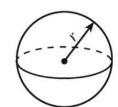

Volume of a cone  $=\frac{1}{3}\pi r^2 h$ Curved surface area of a cone  $=\pi rl$ 

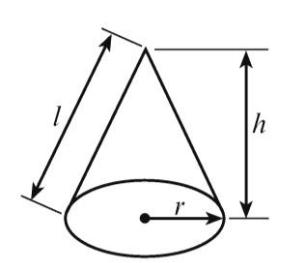

In any triangle ABC,

Sine rule: 
$$\frac{a}{\sin A} = \frac{b}{\sin B} = \frac{c}{\sin C}$$

**Cosine rule**:  $a^2 = b^2 + c^2 - 2bc \cos A$ 

Area of triangle =  $\frac{1}{2}ab\sin C$ 

### The Quadratic Equation

The solutions of  $ax^2 + bx + c = 0$  where  $a \ne 0$  are given by  $x = \frac{-b \pm \sqrt{b^2 - 4ac}}{2a}$ 

{7}------------------------------------------------

| 1.  | The diagram below shows a rectangle with length $(3x - 1)$ cm and width $(2x - 5)$ cm.                                   |     |
|-----|--------------------------------------------------------------------------------------------------------------------------|-----|
|     |                                                                                                                          |     |
|     | $(3x - 1)$ cm                                                                                                            |     |
|     |                                                                                                                          |     |
|     | $(2x - 5)$ cm                                                                                                            |     |
|     | <i>Diagram not drawn to scale</i>                                                                                        |     |
| (a) | Form an expression, in terms of $x$ , for the perimeter of this rectangle. You must simplify your expression.            | [2] |
|     |                                                                                                                          |     |
|     |                                                                                                                          |     |
|     |                                                                                                                          |     |
| (b) | The perimeter of the rectangle is 48 cm.                                                                                 |     |
|     | Form an equation, in terms of $x$ . Solve your equation to find the value of $x$ . You must show all your working. | [3] |
|     |                                                                                                                          |     |
|     |                                                                                                                          |     |
|     |                                                                                                                          |     |
|     |                                                                                                                          |     |
|     |                                                                                                                          |     |
|     |                                                                                                                          |     |

{8}------------------------------------------------

The village of Courtown in the Republic of Ireland is on a bearing of:

- 260 from Pwllheli and
- 310 from Fishguard.

Mark the position of Courtown on the map with a cross, X.

{9}------------------------------------------------

In this part of the question, you will be assessed on the quality of your organisation and communication.

| The map has a scale of                                         | 1 : 2 000 000.      |
|----------------------------------------------------------------|---------------------|
| Issa measures the distance between Fishguard to Courtown to be | 5.6 cm on this map. |
| What distance does this represent in <b>kilometres</b> ?       | [3 + 1 OC]          |

You must show all your working.

{10}------------------------------------------------

#### **3.** Mali works in a call centre.

The frequency diagram below shows the time it took Mali to answer each call she received on Tuesday.

On Tuesday, she answered all the calls within 60 seconds.

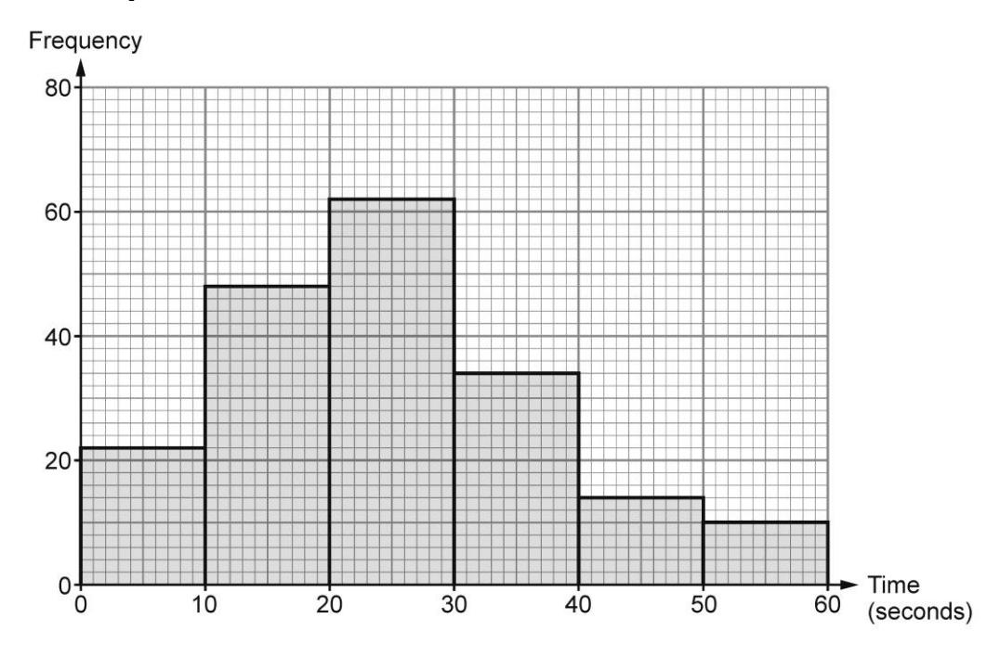

Mali said,

'I answered 80% of the calls received on Tuesday within 30 seconds or less.'

Is Mali correct?

| Yes |  |
|-----|--|
| No  |  |

You must show working to support your answer.

|                                         |   |                                         |  |
|-----------------------------------------|------|-----------------------------------------|--|
|                                         |      |                                         |  |
|                                         |      |                                         |  |
|                                         |   |                                         |  |
|                                         |      |                                         |  |
|                                         |      |                                         |  |
|                                         |      |                                         |  |
|                                         |   |                                         |  |
|                                         |      |                                         |  |
|                                         |      |                                         |  |
|                                         |      |                                         |  |
|                                         |   |                                         |  |
|                                         |      |                                         |  |
|                                         |      |                                         |  |
|                                         |      |                                         |  |
|                                         |   |                                         |  |
|                                         |      |                                         |  |
|                                         |      |                                         |  |
|                                         |      |                                         |  |
| • • • • • • • • • • • • • • • • • • • • |   | • • • • • • • • • • • • • • • • • • • • |  |
|                                         |      |                                         |  |
|                                         |      |                                         |  |
|                                         |      |                                         |  |
|                                         |   |                                         |  |
|                                         |      |                                         |  |

{11}------------------------------------------------

**4.** A rugby team consists of 15 players. The Welsh rugby team played the Irish rugby team in February 2024.

The scatter diagram below shows the height and mass of each of the 15 Welsh players who started the game against Ireland.

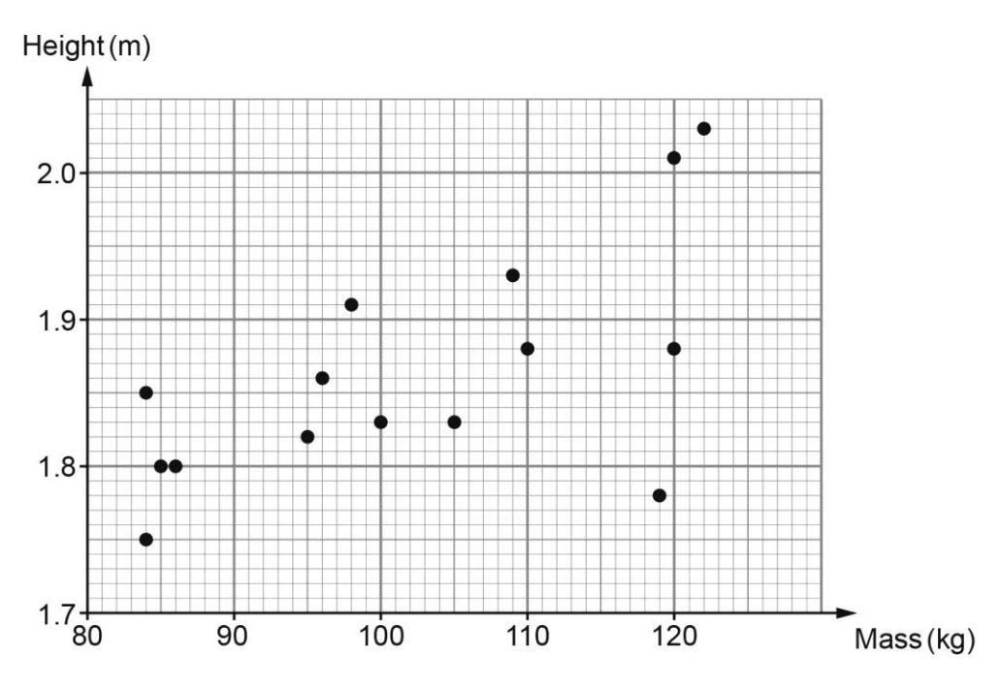

(a) Two of the players, each with a mass greater than 90 kg, have the same mass. [2]

Find the difference between the heights of these two players. Give your answer in centimetres. …........................................................................................................................ …........................................................................................................................ …........................................................................................................................ …........................................................................................................................

(b) Siôn believes the scatter diagram shows that there is a positive correlation between the height and mass of the 15 Welsh players.

| (i) | Explain what this means in the context of the scatter diagram. | [1] |
|-----|----------------------------------------------------------------|-----|
|     |                                                                |     |
|     |                                                                |     |

{12}------------------------------------------------

| (ii) | Siôn's friend, Harri, looks at the scatter diagram and says; | [1] | Examiner only |
|------|--------------------------------------------------------------|-----|---------------|
|------|--------------------------------------------------------------|-----|---------------|

'One player's height and mass don't follow the same pattern as for the rest of the players'.

Write the height and mass of this player.

| Height = | ................................................m | Mass = | ................................................kg |
|----------|---------------------------------------------------|--------|----------------------------------------------------|
|----------|---------------------------------------------------|--------|----------------------------------------------------|

| (c) | Draw a line of best fit on the scatter diagram. | [1] |
|-----|-------------------------------------------------|-----|
|-----|-------------------------------------------------|-----|

| (d) | Explain why it may not be appropriate to use your line of best fit to estimate the height of a rugby player with a mass of 125 kg. | [1] |
|-----|------------------------------------------------------------------------------------------------------------------------------------|-----|
|-----|------------------------------------------------------------------------------------------------------------------------------------|-----|

| (e) | In this part of the question, you will be assessed on the quality of your accuracy in writing. |
|-----|------------------------------------------------------------------------------------------------|
|-----|------------------------------------------------------------------------------------------------|

In a rugby team:

- 8 players are called forwards
- 7 players are called backs.

The mean mass of the 8 Irish forwards players who started the game against Wales was 113.25kg.

The mean mass of the 7 Irish backs who started this game was 94.86 kg.

Find the mean mass of all 15 Irish players. You must show all your working.

|  | [3 + 1W] |
|--|----------|
|--|----------|

{13}------------------------------------------------

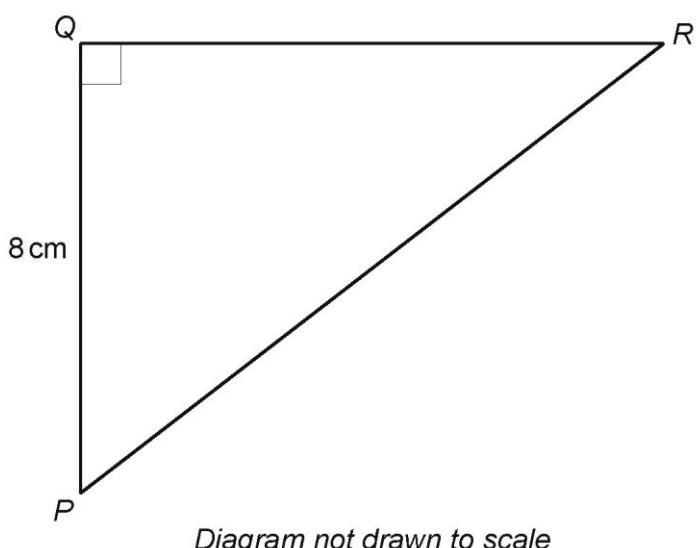

Diagram not drawn to scale

| Calculate the length of <i>PR</i> . |
|-------------------------------------|
|                                     |
|                                     |
|                                     |
|                                     |
|                                     |
|                                     |
|                                     |
|                                     |
|                                     |
|                                     |

{14}------------------------------------------------

Examiner only

[3]

**6.** The scale diagram below shows a plan view of Gruff's garden. The scale used is **1cm represents 1 metre.**

Gruff's house is along the side *BC*. There is a hedge along *AB*. There is a fence along *CD*.

Gruff wants to plant a tree in the garden.

The tree must be

- nearer to the fence than the house
- less than 7 metres from the corner *A*.

Draw suitable lines on the diagram and shade the region where the tree could be planted.

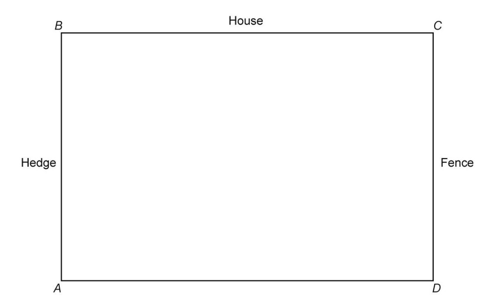

{15}------------------------------------------------

7. A solid metal cylinder has a radius of 2.3 cm and a height of 5 cm.

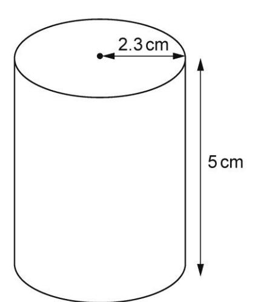

Diagram not drawn to scale

The mass of the cylinder is 423.1 g.

Find the density of the metal.

Give your answer in g/cm³.

Examiner only

{16}------------------------------------------------

**8.** Olivia sells electric cars.

She researched the distance that different makes of electric car can travel on a single charge.

The results are shown in the grouped frequency table below.

| Distance, x (miles) | Frequency |  |
|---------------------|-----------|--|
| 50 ≤ x ≤ 150        | 23        |  |
| 150 < x ≤ 250       | 84        |  |
| 250 < x ≤ 350       | 116       |  |
| 350 < x ≤ 450       | 28        |  |

| (a) | Which is the modal group?                                                                                                                | [1] |
|-----|------------------------------------------------------------------------------------------------------------------------------------------|-----|
|     |                                                                                                                                          |     |
|     |                                                                                                                                          |     |
| (b) | Hassan sees an electric car that he wants to buy.                                                                                        | [4] |
|     | The distance this car can travel on a single charge is estimated to be 290 miles.                                                     |     |
|     | Olivia says, 'This car is a good choice, as 290 miles is greater than the estimated mean distance for the cars that I researched'. |     |
|     | Show that Olivia is correct. You must show all your working.                                                                          |     |
|     |                                                                                                                                          |     |
|     |                                                                                                                                          |     |
|     |                                                                                                                                          |     |
|     |                                                                                                                                          |     |
|     |                                                                                                                                          |     |
|     |                                                                                                                                          |     |
|     |                                                                                                                                          |     |
|     |                                                                                                                                          |     |

{17}------------------------------------------------

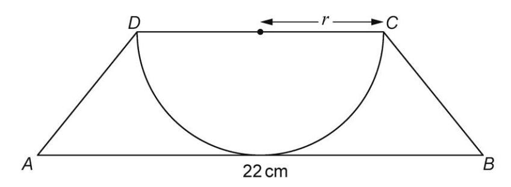

Diagram not drawn to scale

| The area of the semicircle is 113.5 cm 2 . The semicircle touches the line <i>AB</i> . AB = 22 cm. |
|---------------------------------------------------------------------------------------------------------------------|
| Calculate the area of the trapezium ABCD.                                                                           |

{18}------------------------------------------------

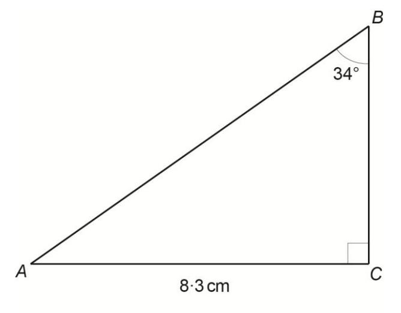

Diagram not drawn to scale

| Calculate the length of the side <i>AB</i> . |  |
|----------------------------------------------|--|
|                                              |  |
|                                              |  |
|                                              |  |
|                                              |  |
|                                              |  |
|                                              |  |
|                                              |  |
|                                              |  |
|                                              |  |

{19}------------------------------------------------

**11.** The cumulative frequency diagram shows the house prices of all 40 houses in the village of Abergwyn in February 2024.

The lowest house price in the village was £110 000.

The highest house price in the village was £390 000.

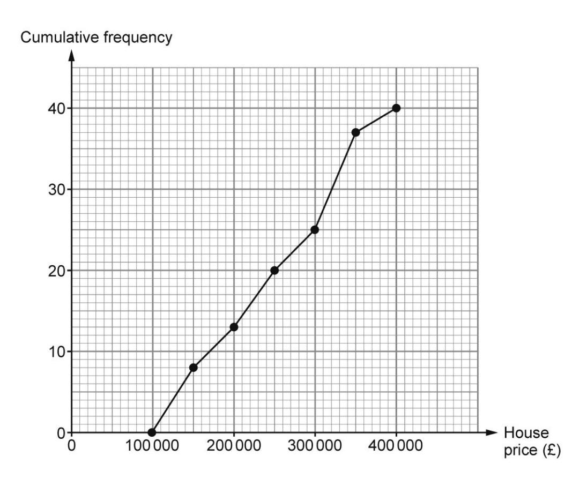

The box-and-whisker diagram shows the house prices of all 50 houses in the village of Caermaes in February 2024.

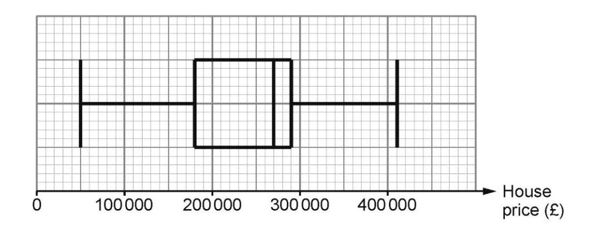

{20}------------------------------------------------

|          | Median | Interquartile range |  |
|----------|--------|---------------------|--|
| Abergwyn |        |                     |  |
| Caermaes |        | £110 000            |  |

(b) Compare the house prices in both villages using the data you completed in the table in part (a).

Which village do you think has the highest average house prices?

| Abergwyn | <input type="checkbox"/> | Caermaes | <input type="checkbox"/> | Can't tell | <input type="checkbox"/> |
|----------|--------------------------|----------|--------------------------|------------|--------------------------|
|----------|--------------------------|----------|--------------------------|------------|--------------------------|

You must give a reason for your answer.

(c) A local Estate Agent predicts that there will be a 1.2% increase in the median house prices in **Caermaes** in February 2025. What will be the median house price in Caermaes in February 2025?

{21}------------------------------------------------

Give your answer in m3.

Diagram not drawn to scale

|   |   |   |
|------|------|------|
|      |      |      |
|      |      |      |
|   |   |   |
|      |      |      |
|   |   |   |
|      |      |      |
|   |   |   |
|      |      |      |
|   |   |   |
|      |      |      |
|   |   |   |

{22}------------------------------------------------

**13.** The diagram below shows a sector of a circle with centre *O* and radius 7 cm. Calculate the perimeter of the sector *OAB*.

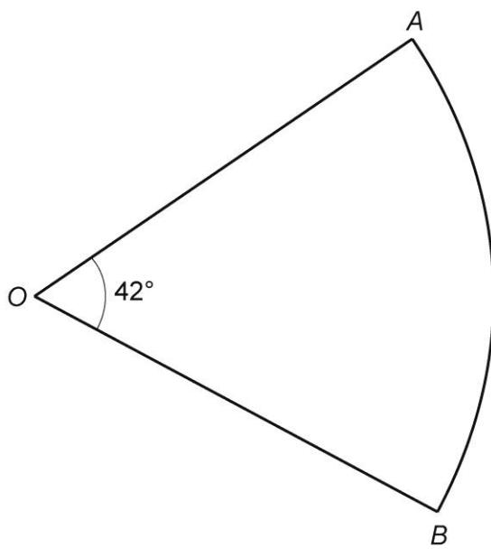

Diagram not drawn to scale

|   |      |  |
|------|------|--|
|      |      |  |
|      |      |  |
|      |      |  |
|      |      |  |
|   |   |  |
|      |      |  |

{23}------------------------------------------------

**14.** In June 2022, Gareth studied the population of people under the age of 45 in Pembrokeshire.

He used the data found on a website to draw the histogram below. Gareth rounded the data correctly to the nearest 100 people.

Use the histogram to answer the following questions:

{24}------------------------------------------------

| Express the number of people aged 40 years old as a percentage of the number of people aged 25 to 45 years old.  Give your answer correct to 1 decimal place.  You must show all your working.  The land area of Pembrokeshire is 1618 km².  The population density for all of Pembrokeshire in June 2022 was 76 people per km².  How many people over the age of 45 lived in Pembrokeshire in June 2022.  You must show all your working. | number of people aged 25 to 45 years old.  Give your answer correct to 1 decimal place. You must show all your working.  The land area of Pembrokeshire is 1618 km².  The population density for all of Pembrokeshire in June 2022 was 76 people per km².  How many people over the age of 45 lived in Pembrokeshire in June 2022. | Gareth knows that 1280 of the people were aged 40 years old.                                     | [3] |  |
|--------------------------------------------------------------------------------------------------------------------------------------------------------------------------------------------------------------------------------------------------------------------------------------------------------------------------------------------------------------------------------------------------------------------------------------------|------------------------------------------------------------------------------------------------------------------------------------------------------------------------------------------------------------------------------------------------------------------------------------------------------------------------------------|--------------------------------------------------------------------------------------------------|-----|--|
| The population density for all of Pembrokeshire in June 2022 was 76 people per km².  How many people <b>over the age of 45</b> lived in Pembrokeshire in June 2022.                                                                                                                                                                                                                                                                        | The population density for all of Pembrokeshire in June 2022 was 76 people per km².  How many people <b>over the age of 45</b> lived in Pembrokeshire in June 2022.                                                                                                                                                                | number of people aged 25 to 45 years old.  Give your answer correct to 1 decimal place.          |     |  |
| The population density for all of Pembrokeshire in June 2022 was 76 people per km².  How many people <b>over the age of 45</b> lived in Pembrokeshire in June 2022.                                                                                                                                                                                                                                                                        | The population density for all of Pembrokeshire in June 2022 was 76 people per km².  How many people <b>over the age of 45</b> lived in Pembrokeshire in June 2022.                                                                                                                                                                |                                                                                                  |     |  |
| The population density for all of Pembrokeshire in June 2022 was 76 people per km².  How many people <b>over the age of 45</b> lived in Pembrokeshire in June 2022.                                                                                                                                                                                                                                                                        | The population density for all of Pembrokeshire in June 2022 was 76 people per km².  How many people <b>over the age of 45</b> lived in Pembrokeshire in June 2022.                                                                                                                                                                |                                                                                                  |     |  |
| The population density for all of Pembrokeshire in June 2022 was 76 people per km².  How many people <b>over the age of 45</b> lived in Pembrokeshire in June 2022.                                                                                                                                                                                                                                                                        | The population density for all of Pembrokeshire in June 2022 was 76 people per km².  How many people <b>over the age of 45</b> lived in Pembrokeshire in June 2022.                                                                                                                                                                |                                                                                                  |     |  |
| per km 2 .  How many people <b>over the age of 45</b> lived in Pembrokeshire in June 2022.                                                                                                                                                                                                                                                                                                                                      | per km 2 .  How many people <b>over the age of 45</b> lived in Pembrokeshire in June 2022.                                                                                                                                                                                                                              | The land area of Pembrokeshire is 1618 km².                                                      | [4] |  |
|                                                                                                                                                                                                                                                                                                                                                                                                                                            |                                                                                                                                                                                                                                                                                                                                    | The population density for all of Pembrokeshire in June 2022 was 76 people per km 2 . |     |  |
|                                                                                                                                                                                                                                                                                                                                                                                                                                            |                                                                                                                                                                                                                                                                                                                                    | You must snow all your working.                                                                  |     |  |
|                                                                                                                                                                                                                                                                                                                                                                                                                                            |                                                                                                                                                                                                                                                                                                                                    |                                                                                                  |     |  |
|                                                                                                                                                                                                                                                                                                                                                                                                                                            |                                                                                                                                                                                                                                                                                                                                    |                                                                                                  |     |  |
|                                                                                                                                                                                                                                                                                                                                                                                                                                            |                                                                                                                                                                                                                                                                                                                                    |                                                                                                  |     |  |
|                                                                                                                                                                                                                                                                                                                                                                                                                                            |                                                                                                                                                                                                                                                                                                                                    |                                                                                                  |     |  |
|                                                                                                                                                                                                                                                                                                                                                                                                                                            |                                                                                                                                                                                                                                                                                                                                    |                                                                                                  |     |  |
|                                                                                                                                                                                                                                                                                                                                                                                                                                            |                                                                                                                                                                                                                                                                                                                                    |                                                                                                  |     |  |

{25}------------------------------------------------

| 15. | Use the quadratic formula to solve the equation $3x^2 + 5x - 1 = 0$ . Give your solutions correct to 2 decimal places. | [3] | Examin only |
|-----|---------------------------------------------------------------------------------------------------------------------------|-----|----------------|
|     |                                                                                                                           |     |                |
|     |                                                                                                                           |     |                |
|     |                                                                                                                           |     |                |
|     |                                                                                                                           |     |                |
|     |                                                                                                                           |     |                |
|     |                                                                                                                           |     |                |

{26}------------------------------------------------

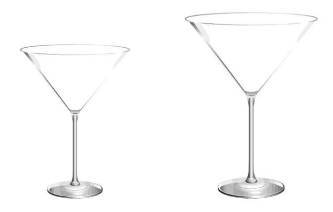

Diagram not drawn to scale

The volume of the smaller glass is  $72\,\text{cm}^3$ . The volume of the larger glass is  $243\,\text{cm}^3$ .

The height of the larger glass is 18 cm.

| Calculate the height of the smaller glass. |  |
|--------------------------------------------|--|
|                                            |  |
|                                            |  |
|                                            |  |
|                                            |  |
|                                            |  |

{27}------------------------------------------------

**17.** A train manufacturer has developed a new braking system. The velocity-time graph shows the velocity of a train from the instant the new brakes are applied until it comes to rest.

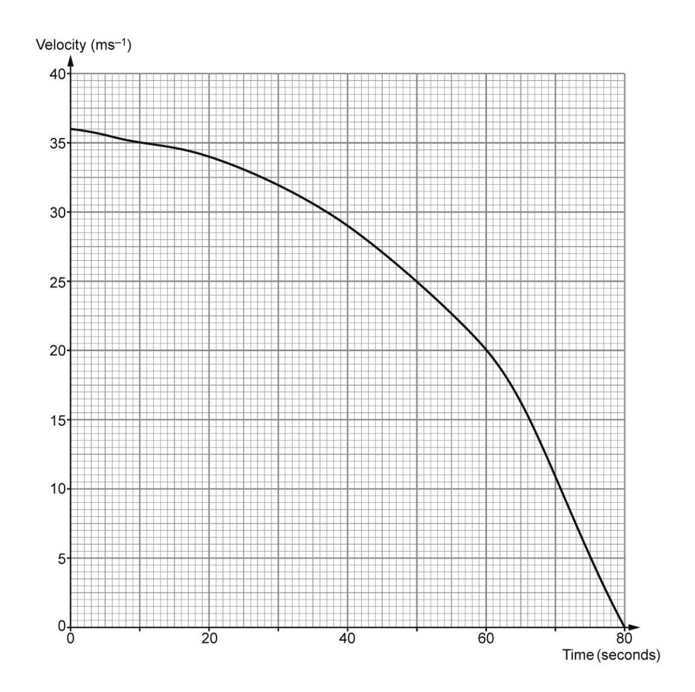

| (a) | Estimate the train's deceleration at time 60 seconds. | [3] |
|-----|-------------------------------------------------------|-----|
|     |                                                       |     |
|     |                                                       |     |
|     |                                                       |     |
|     |                                                       |     |
|     |                                                       |     |
|     |                                                       |     |

{28}------------------------------------------------
| (b)(i) | Calculate an estimate of the distance travelled by the train from the instant the brakes are applied until it comes to rest. You must use exactly 4 strips of equal width. | [3] | Examiner only |
|--------|------------------------------------------------------------------------------------------------------------------------------------------------|-----|---------------|
| (b)(ii) | Explain how you could use the graph to gain a more accurate estimate of the distance travelled. | [1] | Examiner only |

{29}------------------------------------------------

**18.** The Davies Family wants to go on holiday to Lisbon. Mrs Davies finds it's cheaper to fly from Manchester to Paris and on from Paris to Lisbon, rather than flying directly from Manchester to Lisbon. The sketch below shows the journey based on the information from an airline.

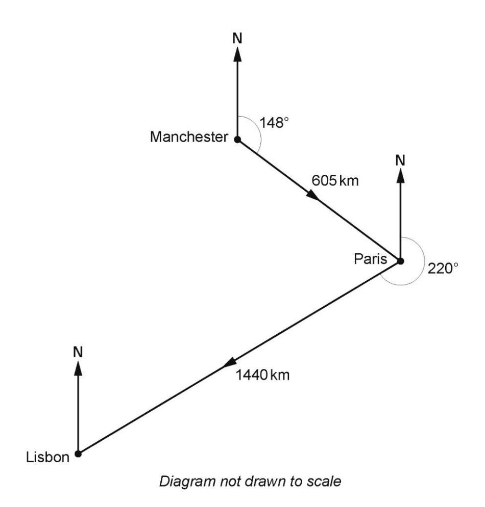

The bearing of Paris from Manchester is 148°. The bearing of Lisbon from Paris is 220º.

The daughter, Ceri, is concerned of the increased carbon emissions by travelling the longer route.

She is told that an aeroplane will use 12 litres of fuel for every kilometre travelled.

How much less fuel would an aeroplane use by flying directly to Lisbon, rather than flying via Paris?

You must show all your working.

{30}------------------------------------------------

| Examine only |
|--------------|
|              |
|              |
|              |
|              |
|              |
|              |
|              |
|              |
|              |
|              |
|              |
|              |
|              |
|              |
|              |
|              |
|              |
|              |
|              |

**END OF QUESTIONS** 

{31}------------------------------------------------

| Question number | Additional page, if required. Write the question number(s) in the left-hand margin. |
|-----------------|-------------------------------------------------------------------------------------|
|                 |                                                                                     |
|                 |                                                                                     |
|                 |                                                                                     |
|                 |                                                                                     |
|                 |                                                                                     |
|                 |                                                                                     |
|                 |                                                                                     |
|                 |                                                                                     |
|                 |                                                                                     |
|                 |                                                                                     |
|                 |                                                                                     |
|                 |                                                                                     |
|                 |                                                                                     |
|                 |                                                                                     |
|                 |                                                                                     |
|                 |                                                                                     |
|                 |                                                                                     |
|                 |                                                                                     |
|                 |                                                                                     |
|                 |                                                                                     |
|                 |                                                                                     |
|                 |                                                                                     |
|                 |                                                                                     |
|                 |                                                                                     |
|                 |                                                                                     |
|                 |                                                                                     |
|                 |                                                                                     |
|                 |                                                                                     |
|                 |                                                                                     |
|                 |                                                                                     |
|                 |                                                                                     |
|                 |                                                                                     |
|                 |                                                                                     |
|                 |                                                                                     |
| I               |                                                                                     |

{32}------------------------------------------------

# Mark Scheme

|                                                                                                                                                                                                                                                                                     | Mark                                                                                                                                                                 | Comments                                                                                                                                                                                                                                                                                                                                                                                                                                                                                                                                                                                                       |                                                                                                                                                                                                                                                                                                                                                                    |    |                                                                             |
|-------------------------------------------------------------------------------------------------------------------------------------------------------------------------------------------------------------------------------------------------------------------------------------|----------------------------------------------------------------------------------------------------------------------------------------------------------------------|----------------------------------------------------------------------------------------------------------------------------------------------------------------------------------------------------------------------------------------------------------------------------------------------------------------------------------------------------------------------------------------------------------------------------------------------------------------------------------------------------------------------------------------------------------------------------------------------------------------|--------------------------------------------------------------------------------------------------------------------------------------------------------------------------------------------------------------------------------------------------------------------------------------------------------------------------------------------------------------------|----|-----------------------------------------------------------------------------|
| GCSE Mathematics and Numeracy Unit 3 Higher Tier SAMS                                                                                                                                                                                                                         |                                                                                                                                                                      |                                                                                                                                                                                                                                                                                                                                                                                                                                                                                                                                                                                                                |                                                                                                                                                                                                                                                                                                                                                                    |    |                                                                             |
| 1.(a) (Perimeter = ) 10x – 12 or 2(5x – 6) (cm) ISW                                                                                                                                                                                                                           | B2                                                                                                                                                                   | Award B1 for sight of one of the following: • 2 × (3x – 1) + 2 × (2x – 5) or equivalent • 6x – 2 • 4x – 10 • 5x – 6.                                                                                                                                                                                                                                                                                                                                                                                                                                                                               |                                                                                                                                                                                                                                                                                                                                                                    |    |                                                                             |
| 1.(b) 10x – 12 = 48 or 2(5x – 6) = 48 10x = 60 or 5x = 30 x = 6                                                                                                                                                                                                            | B1 B1 B1                                                                                                                                                       | FT until second error. Mark final answer. FT from 10x = k or 5x = k Unsupported correct answer implies B0 B0 B1. Award B1B1B0 for a final answer of 60 ÷ 10 or $60/10$ . If FT leads to a whole number answer, it must be shown as a whole number. Otherwise, accept a fraction.                                                                                                                                                                                                                                                                                                                |                                                                                                                                                                                                                                                                                                                                                                    |    |                                                                             |
| 2.(a) Position at 260° from Pwllheli Position at 310° from Fishguard Position marked or two intersecting lines                                                                                                                                                             | M1 M1 A1                                                                                                                                                       | Allow dots or crosses or any unambiguous indication that the correct bearings have been drawn. FT if at least M1 previously awarded and two intersecting lines. (Lines must originate form P and F).                                                                                                                                                                                                                                                                                                                                                                                                     |                                                                                                                                                                                                                                                                                                                                                                    |    |                                                                             |
| 2.(b) (The 'real' distance between Fishguard to Courtown=) $5.6 	imes 2 000 000 	ext{ ÷ } 100 000$ or equivalent 112 (km)                                                                                                                                                  | M2 A1                                                                                                                                                             | May be seen in stages. Award M1 for one of the following • 1 cm represents 20 km • 1 cm represents 20 000 m • 5.6 × 2 000 000 • 11 200 000 (cm) • 112 000 m • 5.6 × 'their 20' where 'their 20' is from a place value error in conversion • a number with digits 112, where any other digits are all zeros. CAO.                                                                                                                                                                                                                                                                    |                                                                                                                                                                                                                                                                                                                                                                    |    |                                                                             |
| Organisation and Communication.                                                                                                                                                                                                                                                     | OC1                                                                                                                                                                  | For OC1, candidates will be expected to: • present their response in a structured way • explain to the reader what they are doing at each step of their response • lay out their explanation and working in a way that is clear and logical • write a conclusion that draws together their results and explains what their answer means                                                                                                                                                                                                                                                            |                                                                                                                                                                                                                                                                                                                                                                    |    |                                                                             |
| 3.                                                                                                                                                                                                                                                                                  | B1                                                                                                                                                                   | Check the graph for answers.                                                                                                                                                                                                                                                                                                                                                                                                                                                                                                                                                                                   |                                                                                                                                                                                                                                                                                                                                                                    |    |                                                                             |
| Sight of 190 (Total number of calls = 22 + 48 + 62 + 34 + 14 + 10)                                                                                                                                                                                                            | M2                                                                                                                                                                   | FT 'their 190'. M1 for sight of either of the following: • (80% of 190=) 152 (calls) OR (less than 30 seconds =) 132 (calls) • (20% of 190=) 38 (calls) OR (more than 30 seconds=) 58 (calls)                                                                                                                                                                                                                                                                                                                                                                                             |                                                                                                                                                                                                                                                                                                                                                                    |    |                                                                             |
|                                                                                                                                                                                                                                                                                     |                                                                                                                                                                      |                                                                                                                                                                                                                                                                                                                                                                                                                                                                                                                                                                                                                | Sight of any of the following: • (80% of 190=) 152 (calls) AND (less than 30 seconds =) 132 (calls) • (20% of 190=) 38 (calls) AND (more than 30 seconds=) 58 (calls) • (132 calls = $\frac{132}{190} \times 100 = 69.4(7)\%$ ) • (58 calls = $\frac{58}{190} \times 100 = 30.5(2)\%$ )                                                    | A1 | FT provided conclusion from correct working only and M2 previously awarded. |
|                                                                                                                                                                                                                                                                                     |                                                                                                                                                                      |                                                                                                                                                                                                                                                                                                                                                                                                                                                                                                                                                                                                                | Conclusion 'No'.                                                                                                                                                                                                                                                                                                                                                   |    |                                                                             |
| 4.(a)                                                                                                                                                                                                                                                                               | B2                                                                                                                                                                   | Award B1 for one of the following: • sight of 2.01 and 1.88 • sight of 201 and 188 • sight of 0.13 (m) • 2.01 – 'their 1.88' correctly converted to cm (× 100) • 'their 2.01' – 1.88 correctly converted to cm (× 100) • 'their 2.01' – 'their 1.88' correctly converted to cm (× 100) • 'their 2.01' AND 'their 1.88' correctly converted to cm (× 100) • 10 cm (from 1.85 – 1.75).                                                                                                                                                                                                   |                                                                                                                                                                                                                                                                                                                                                                    |    |                                                                             |
| 4.(a) 13 (cm)                                                                                                                                                                                                                                                                       |                                                                                                                                                                      |                                                                                                                                                                                                                                                                                                                                                                                                                                                                                                                                                                                                                |                                                                                                                                                                                                                                                                                                                                                                    |    |                                                                             |
| 4.(b)(i) Explanation with reference to mass and height increasing or decreasing together e.g. "the heavier players are taller" "as mass decreases so does the height" "they both increase"                                                                              | E1                                                                                                                                                                   |                                                                                                                                                                                                                                                                                                                                                                                                                                                                                                                                                                                                                |                                                                                                                                                                                                                                                                                                                                                                    |    |                                                                             |
| 4.(b)(ii) (Height =) 1.78 (m) AND (Mass =) 119 (kg)                                                                                                                                                                                                                                 | B1                                                                                                                                                                   |                                                                                                                                                                                                                                                                                                                                                                                                                                                                                                                                                                                                                |                                                                                                                                                                                                                                                                                                                                                                    |    |                                                                             |
| 4.(c) Straight line of best fit, following the trend with some points above and some below the line.                                                                                                                                                                             | B1                                                                                                                                                                   | Allow intention of a straight line.                                                                                                                                                                                                                                                                                                                                                                                                                                                                                                                                                                            |                                                                                                                                                                                                                                                                                                                                                                    |    |                                                                             |
| 4.(d) Explanation of why it is not an appropriate estimate, e.g. "the diagram only considers the trend of players up to 122(kg)" "out of range".                                                                                                                           | E1                                                                                                                                                                   | Allow "the heights of the four players around 120 kg are very different so using the line in this region is not appropriate".                                                                                                                                                                                                                                                                                                                                                                                                                                                                                  |                                                                                                                                                                                                                                                                                                                                                                    |    |                                                                             |
|                                                                                                                                                                                                                                                                                     |                                                                                                                                                                      |                                                                                                                                                                                                                                                                                                                                                                                                                                                                                                                                                                                                                |                                                                                                                                                                                                                                                                                                                                                                    |    |                                                                             |
| 4.(e)                                                                                                                                                                                                                                                                               | $8 	imes 113.25 + 7 	imes 94.86$ + 15 $	ext{104.668 or 104.67 or 104.7 or 105 (kg)}$                                                                           | $(906 + 664.02 = 1570.02)$ CAO                                                                                                                                                                                                                                                                                                                                                                                                                                                                                                                                                                              |                                                                                                                                                                                                                                                                                                                                                                    |    |                                                                             |
|                                                                                                                                                                                                                                                                                     | Accuracy of writing.                                                                                                                                                 | W1                                                                                                                                                                                                                                                                                                                                                                                                                                                                                                                                                                                                             | For W1, candidates will be expected to: show all their workinguse correct mathematical form in their workinguse appropriate terminology, units, etc                                                                                                                                                                                                             |    |                                                                             |
|                                                                                                                                                                                                                                                                                     |                                                                                                                                                                      |                                                                                                                                                                                                                                                                                                                                                                                                                                                                                                                                                                                                                |                                                                                                                                                                                                                                                                                                                                                                    |    |                                                                             |
| 5.                                                                                                                                                                                                                                                                                  | $(QR = ) rac{2 	imes 36}{8}$ or equivalent = 9 (cm)                                                                                                              | M1 A1                                                                                                                                                                                                                                                                                                                                                                                                                                                                                                                                                                                                       | Check diagram for answers. Award M1 for $rac{8 	imes QR}{2} = 36$ . May be implied in later working (M1A1). Note: $(PR^2 =) 64 + 81$ . FT 'their derived 9'. Final answer of $x = 145$ is M1A0A0. FT provided their answer > 'their 9' and > 8. FT from M1 for the correctly evaluated square root of 'their 145' provided their answer > 9. |    |                                                                             |
|                                                                                                                                                                                                                                                                                     | $(PR^2 =) 8^2 + 9^2$ or equivalent                                                                                                                                   | M1                                                                                                                                                                                                                                                                                                                                                                                                                                                                                                                                                                                                             |                                                                                                                                                                                                                                                                                                                                                                    |    |                                                                             |
|                                                                                                                                                                                                                                                                                     | $PR^2 = 145$ or $(PR =) 	ext{	extgreek{Ö}}145$                                                                                                                       | A1                                                                                                                                                                                                                                                                                                                                                                                                                                                                                                                                                                                                             |                                                                                                                                                                                                                                                                                                                                                                    |    |                                                                             |
|                                                                                                                                                                                                                                                                                     | $(x =) 12(.041...cm)$                                                                                                                                                | A1                                                                                                                                                                                                                                                                                                                                                                                                                                                                                                                                                                                                             |                                                                                                                                                                                                                                                                                                                                                                    |    |                                                                             |
|                                                                                                                                                                                                                                                                                     |                                                                                                                                                                      | Alternative method to find $x$ A correct and complete method (using trigonometric relationships) $(x =) 12(.041...cm)$                                                                                                                                                                                                                                                                                                                                                                                                                                                                                   |                                                                                                                                                                                                                                                                                                                                                                    |    |                                                                             |
| 6.                                                                                                                                                                                                                                                                                  | Unambiguous angle bisector of BCD $	ext{±} 2^	ext{o}$                                                                                                                | B1                                                                                                                                                                                                                                                                                                                                                                                                                                                                                                                                                                                                             | All lines and arcs must be of sufficient length to be able to select the correct region. Any valid method may be used to bisect the angle e.g. using a protractor or a pair of compasses. FT provided B1 awarded for the arc.                                                                                                                                |    |                                                                             |
|                                                                                                                                                                                                                                                                                     | Arc centre A with radius 7 cm $	ext{±} 2 	ext{ mm}$                                                                                                                  | B1                                                                                                                                                                                                                                                                                                                                                                                                                                                                                                                                                                                                             |                                                                                                                                                                                                                                                                                                                                                                    |    |                                                                             |
|                                                                                                                                                                                                                                                                                     | Correct region identified                                                                                                                                            | B1                                                                                                                                                                                                                                                                                                                                                                                                                                                                                                                                                                                                             |                                                                                                                                                                                                                                                                                                                                                                    |    |                                                                             |
|                                                                                                                                                                                                                                                                                     | Image: Diagram showing a square ABCD with a quarter circle arc from A to a point on BC, and a line from B to C. The region bounded by AD, DC, and the arc is shaded. |                                                                                                                                                                                                                                                                                                                                                                                                                                                                                                                                                                                                                |                                                                                                                                                                                                                                                                                                                                                                    |    |                                                                             |
|                                                                                                                                                                                                                                                                                     |                                                                                                                                                                      |                                                                                                                                                                                                                                                                                                                                                                                                                                                                                                                                                                                                                |                                                                                                                                                                                                                                                                                                                                                                    |    |                                                                             |
| 7.                                                                                                                                                                                                                                                                                  | (Volume of cylinder =) $	imes 2.3^2 	imes 5$ = 83(.095....) or 26.45 $	imes$ (cm3)                                                                                | M1                                                                                                                                                                                                                                                                                                                                                                                                                                                                                                                                                                                                             | May be seen or implied in later working.                                                                                                                                                                                                                                                                                                                           |    |                                                                             |
|                                                                                                                                                                                                                                                                                     | (Density of metal =) 423.1 $	imes$ 83(.095....)                                                                                                                      | A1                                                                                                                                                                                                                                                                                                                                                                                                                                                                                                                                                                                                             | Accept an answer between 83 and 83.11 inclusive.                                                                                                                                                                                                                                                                                                                   |    |                                                                             |
|                                                                                                                                                                                                                                                                                     | Accept an answer between 5 and 5.1 (g/cm3)                                                                                                                           | M1                                                                                                                                                                                                                                                                                                                                                                                                                                                                                                                                                                                                             | FT 423.1 $	ext{div}$ 'their derived volume of cylinder', provided $	imes$ has been used in its calculation.                                                                                                                                                                                                                                                        |    |                                                                             |
| 7. Alternative method:                                                                                                                                                                                                                                                              |                                                                                                                                                                      | A1                                                                                                                                                                                                                                                                                                                                                                                                                                                                                                                                                                                                             |                                                                                                                                                                                                                                                                                                                                                                    |    |                                                                             |
|                                                                                                                                                                                                                                                                                     | (Density of metal =) $rac{423.1}{	imes 2.3^2 	imes 5}$                                                                                                              | M2                                                                                                                                                                                                                                                                                                                                                                                                                                                                                                                                                                                                             | Award M1 for sight of $	imes 2.3^2 	imes 5$ .                                                                                                                                                                                                                                                                                                                      |    |                                                                             |
|                                                                                                                                                                                                                                                                                     | Accept an answer between 5 and 5.1 (g/cm3)                                                                                                                           | A2                                                                                                                                                                                                                                                                                                                                                                                                                                                                                                                                                                                                             | A1 for sight of $rac{423.1}{26.45	imes}$ or $rac{8462}{529	imes}$ or $rac{15.9(96...)}{	imes}$ or any other simplified fraction with one step left to carry out.                                                                                                                                                                                                |    |                                                                             |
| 8.(a)                                                                                                                                                                                                                                                                               | 250 $	ext{x}$ 350                                                                                                                                                    | B1                                                                                                                                                                                                                                                                                                                                                                                                                                                                                                                                                                                                             |                                                                                                                                                                                                                                                                                                                                                                    |    |                                                                             |
| 8.(b)                                                                                                                                                                                                                                                                               | Midpoints 100, 200, 300, 400                                                                                                                                         | B1                                                                                                                                                                                                                                                                                                                                                                                                                                                                                                                                                                                                             |                                                                                                                                                                                                                                                                                                                                                                    |    |                                                                             |
|                                                                                                                                                                                                                                                                                     | 100 $	imes$ 23 + 200 $	imes$ 84 + 300 $	imes$ 116 + 400 $	imes$ 28 (= 2300 + 16800 + 34800 + 11200 = 65100)                                                       | M1                                                                                                                                                                                                                                                                                                                                                                                                                                                                                                                                                                                                             | FT 'their midpoints' within or at the bounds of the appropriate groups, provided no more than one of 'their midpoints' lies outside the group.                                                                                                                                                                                                                     |    |                                                                             |
|                                                                                                                                                                                                                                                                                     | $	ext{div}$ 251                                                                                                                                                      | m1                                                                                                                                                                                                                                                                                                                                                                                                                                                                                                                                                                                                             | their midpoints lies outside the group.                                                                                                                                                                                                                                                                                                                            |    |                                                                             |
|                                                                                                                                                                                                                                                                                     | 259.3(6...) miles or 259.4 or 259 miles or equivalent                                                                                                                | A1                                                                                                                                                                                                                                                                                                                                                                                                                                                                                                                                                                                                             | ISW Allow 260 miles from correct working.                                                                                                                                                                                                                                                                                                                       |    |                                                                             |
| 9.                                                                                                                                                                                                                                                                                  | $rac{	imes r^2}{2}$ = 113.5 or equivalent                                                                                                                           | M1                                                                                                                                                                                                                                                                                                                                                                                                                                                                                                                                                                                                             | Check diagrams for answers.                                                                                                                                                                                                                                                                                                                                        |    |                                                                             |
|                                                                                                                                                                                                                                                                                     | $r^2$ = 72.2(56...) or $r^2$ = $rac{227}{	imes}$                                                                                                                    | m1                                                                                                                                                                                                                                                                                                                                                                                                                                                                                                                                                                                                             | Sight of 72(.256...) implies M1m1.                                                                                                                                                                                                                                                                                                                                 |    |                                                                             |
|                                                                                                                                                                                                                                                                                     | $r$ = 8.5(00...)                                                                                                                                                     | A1                                                                                                                                                                                                                                                                                                                                                                                                                                                                                                                                                                                                             | FT 'their $r^2$ ', provided M1 awarded. 9 must not be from incorrect working.                                                                                                                                                                                                                                                                                   |    |                                                                             |
|                                                                                                                                                                                                                                                                                     | (area of trapezium)= $rac{2 	imes 8.5 + 22}{2}$ $	imes$ 8.5 or equivalent                                                                                           | M1                                                                                                                                                                                                                                                                                                                                                                                                                                                                                                                                                                                                             | FT 'their derived or stated $r$ '.                                                                                                                                                                                                                                                                                                                                 |    |                                                                             |
|                                                                                                                                                                                                                                                                                     | = 165.75 (cm2)                                                                                                                                                       | A1                                                                                                                                                                                                                                                                                                                                                                                                                                                                                                                                                                                                             | Accept 165.8 or 166 (cm²). Mark final answer.                                                                                                                                                                                                                                                                                                                   |    |                                                                             |
| 10.                                                                                                                                                                                                                                                                                 | (AB =) 8.3 $	ext{div}$ sin 34                                                                                                                                        | M2                                                                                                                                                                                                                                                                                                                                                                                                                                                                                                                                                                                                             | Award M2 for 8.3 $	ext{div}$ cos 56.                                                                                                                                                                                                                                                                                                                               |    |                                                                             |
|                                                                                                                                                                                                                                                                                     |                                                                                                                                                                      |                                                                                                                                                                                                                                                                                                                                                                                                                                                                                                                                                                                                                | Award M1 for one of the following:  $ullet$ sin 34 = $rac{8.3}{AB}$  $ullet$ cos 56 = $rac{8.3}{AB}$                                                                                                                                                                                                                                               |    |                                                                             |
|                                                                                                                                                                                                                                                                                     | = 14.8(4...)cm                                                                                                                                                       | A1                                                                                                                                                                                                                                                                                                                                                                                                                                                                                                                                                                                                             | Allow 15 provided not from incorrect working.                                                                                                                                                                                                                                                                                                                      |    |                                                                             |
|                                                                                                                                                                                                                                                                                     |                                                                                                                                                                      |                                                                                                                                                                                                                                                                                                                                                                                                                                                                                                                                                                                                                |                                                                                                                                                                                                                                                                                                                                                                    |    |                                                                             |
| 11.(a) Abergwyn median =(£) 250 000 Caermaes median = (£) 270 000                                                                                                                                                                                                             | B1 B1                                                                                                                                                             |                                                                                                                                                                                                                                                                                                                                                                                                                                                                                                                                                                                                                |                                                                                                                                                                                                                                                                                                                                                                    |    |                                                                             |
| (Abergwyn IQR =) (£) 320 000 – (£)170 000 (£) 150 000                                                                                                                                                                                                                            | M1 A1                                                                                                                                                             |                                                                                                                                                                                                                                                                                                                                                                                                                                                                                                                                                                                                                |                                                                                                                                                                                                                                                                                                                                                                    |    |                                                                             |
| 11.(b) Caermaes indicating a valid reason referring to the appropriate values in the table e.g. "Caermaes median is higher" "Half of Caermaes' houses are less than £270000 and half or Abergwyn's are less than £250 000" and the prices are less spread out" | E1                                                                                                                                                                   | FT the conclusion based on 'their median values in the table in (a)'. Do not allow reasons based on the spread of the data alone, e.g. "Caermaes are less spread out" "Caermaes is higher" "Caermeas IQR is less" Award E1 also for one of the following: • reference is made to the medians followed by IQR "Caermaes median is higher, and their prices are less spread out" • 'can't tell' chosen and valid reason indicating that the raw data is not available and that the data points could be clustered together at one end of each group or quartile. |                                                                                                                                                                                                                                                                                                                                                                    |    |                                                                             |
| 11.(c) 1.012 × 270 000 or equivalent £273 240                                                                                                                                                                                                                                 | M1 A1                                                                                                                                                             | Award M1 for a complete full method. FT 'their £270 000' from part (a), provided it is between £200 000 and £300 000.                                                                                                                                                                                                                                                                                                                                                                                                                                                                                    |                                                                                                                                                                                                                                                                                                                                                                    |    |                                                                             |
|                                                                                                                                                                                                                                                                                     |                                                                                                                                                                      |                                                                                                                                                                                                                                                                                                                                                                                                                                                                                                                                                                                                                |                                                                                                                                                                                                                                                                                                                                                                    |    |                                                                             |
| 12. 13200 × 460 ÷ 3                                                                                                                                                                                                                                                              | M1                                                                                                                                                                   | Or equivalent.                                                                                                                                                                                                                                                                                                                                                                                                                                                                                                                                                                                                 |                                                                                                                                                                                                                                                                                                                                                                    |    |                                                                             |
| = 2024000 (cm3 )                                                                                                                                                                                                                                                                 | A1                                                                                                                                                                   |                                                                                                                                                                                                                                                                                                                                                                                                                                                                                                                                                                                                                |                                                                                                                                                                                                                                                                                                                                                                    |    |                                                                             |
| = 2.024(m3 )                                                                                                                                                                                                                                                                     | B1                                                                                                                                                                   | Strict FT of a correct conversion of their volume in cm3 to m3 , provided M1 awarded.                                                                                                                                                                                                                                                                                                                                                                                                                                                                                                                 |                                                                                                                                                                                                                                                                                                                                                                    |    |                                                                             |
| 12. Alternative method                                                                                                                                                                                                                                                              |                                                                                                                                                                      |                                                                                                                                                                                                                                                                                                                                                                                                                                                                                                                                                                                                                |                                                                                                                                                                                                                                                                                                                                                                    |    |                                                                             |
| (13200 =) 1.32 (m2 ) AND (460 =) 4.6 (m)                                                                                                                                                                                                                                         | B1                                                                                                                                                                   |                                                                                                                                                                                                                                                                                                                                                                                                                                                                                                                                                                                                                |                                                                                                                                                                                                                                                                                                                                                                    |    |                                                                             |
| = 1.32 × 4.6 ÷ 3                                                                                                                                                                                                                                                                    | M1                                                                                                                                                                   | Or equivalent. FT 'their 1.32' × 'their 4.6' ÷ 3                                                                                                                                                                                                                                                                                                                                                                                                                                                                                                                                                            |                                                                                                                                                                                                                                                                                                                                                                    |    |                                                                             |
| = 2.024(m3 )                                                                                                                                                                                                                                                                     | A1                                                                                                                                                                   | CAO                                                                                                                                                                                                                                                                                                                                                                                                                                                                                                                                                                                                            |                                                                                                                                                                                                                                                                                                                                                                    |    |                                                                             |
| 13. 42 × 2 × 𝜋 × 7 or equivalent 360                                                                                                                                                                                                                                    | M1                                                                                                                                                                   |                                                                                                                                                                                                                                                                                                                                                                                                                                                                                                                                                                                                                |                                                                                                                                                                                                                                                                                                                                                                    |    |                                                                             |
| = 5.1(…) or 49 𝜋 30                                                                                                                                                                                                                                                           | A1                                                                                                                                                                   | Allow 5 provided not from incorrect working.                                                                                                                                                                                                                                                                                                                                                                                                                                                                                                                                                                   |                                                                                                                                                                                                                                                                                                                                                                    |    |                                                                             |
| OR 14 + 49 (Perimeter = ) 19.1(…cm) 𝜋 30                                                                                                                                                                                                                                   | A1                                                                                                                                                                   | Mark final answer. FT 'their 5.1(…cm)' + 14 Allow 19 (cm) provided not from incorrect working.                                                                                                                                                                                                                                                                                                                                                                                                                                                                                                           |                                                                                                                                                                                                                                                                                                                                                                    |    |                                                                             |

{33}------------------------------------------------

{34}------------------------------------------------

{35}------------------------------------------------

{36}------------------------------------------------

{37}------------------------------------------------

|                                                                                                                                                                                                                                                                                          | 1  |                                                                                                                                          |  |  |  |
|------------------------------------------------------------------------------------------------------------------------------------------------------------------------------------------------------------------------------------------------------------------------------------------|----|------------------------------------------------------------------------------------------------------------------------------------------|--|--|--|
| 14.(a) 1280 20 × 1300                                                                                                                                                                                                                                                              | M2 | Award M1 for sight of one of the following:  • 26 000  • 20 × 1300  • the digits 49(23) (place value error).                             |  |  |  |
| = 4.9(%)                                                                                                                                                                                                                                                                                 | A1 | FT 'their 20 × 1300'.                                                                                                                    |  |  |  |
| 14.(b) (Number of people under 45 = ) 5 × 1100 + 10 × 1520 + 10 × 1060 + 20 × 1300                                                                                                                                                                                                 | M1 | Allow M1 for the sum of 4 products with any 2 correct                                                                                    |  |  |  |
| (= 5500 + 15200 + 10600 + 26000)                                                                                                                                                                                                                                                         |    |                                                                                                                                          |  |  |  |
| = 57 300 (people)                                                                                                                                                                                                                                                                        | A1 | CAO.                                                                                                                                     |  |  |  |
| (Population all ages = 76 × 1618 = ) 122 968                                                                                                                                                                                                                                             | B1 | May be implied in later working.                                                                                                         |  |  |  |
| (Number of people over 45 = 122968 - 57300 = ) 65668 (people)                                                                                                                                                                                                                         | B1 | FT 'their 122 968' – 'their 57 300' provided M1 awarded. Allow correctly rounded answers provided they are from correct working.         |  |  |  |
| 15.                                                                                                                                                                                                                                                                                      |    | Trial and improvement method gains M0.                                                                                                   |  |  |  |
| $x = \frac{-(5) \pm \sqrt{(5)^2 - 4 \times 3 \times (-1)}}{2 \times 3}$                                                                                                                                                                                                                  | M1 | Allow one slip in substitution, but must be correct formula                                                                              |  |  |  |
| $x = \frac{-5 \pm \sqrt{37}}{6}$                                                                                                                                                                                                                                                         | A1 |                                                                                                                                          |  |  |  |
| x = 0.18, with $x = -1.85$                                                                                                                                                                                                                                                               | A1 | CAO. Both solutions must be given for A1.                                                                                                |  |  |  |
| 16. Finding the correct scale factor  • $\frac{\sqrt[3]{72}}{\sqrt[3]{243}}$ or $\sqrt[3]{\frac{72}{243}}$ or equivalent  • $\frac{\sqrt[3]{243}}{\sqrt[3]{72}}$ or $\sqrt[3]{\frac{243}{72}}$ or equivalent  • $\frac{3}{2}$ or 1.5 or equivalent  • $\frac{2}{3}$ or 0.6 or equivalent | B1 | May be implied in further working. Award B1 for any correct equivalent expression.                                                       |  |  |  |
| (Height =) $18 \times \frac{2}{3}$ or $18 \div \frac{3}{2}$ or equivalent                                                                                                                                                                                                                | M1 | Implies previous B1 provided not from incorrect working.  FT 'their $\frac{2}{3}$ ' or 'their $\frac{3}{2}$ ' provided first B1 awarded. |  |  |  |
| = 12 (cm)                                                                                                                                                                                                                                                                                | A1 | CAO.                                                                                                                                     |  |  |  |
|                                                                                                                                                                                                                                                                                          |    | Note: 243 ÷ 72 = 1.5 followed by either 18 ÷ 1.5 = 12 or 8 × 1.5 = 12 is awarded B0M0A0.                                                 |  |  |  |

{38}------------------------------------------------

| 17.(a) Tangent drawn at 60 seconds Idea of difference in y ÷ difference in x Correct gradient from difference in y ÷ difference in x | M1 m1 A1 | Allow one error in counting squares or in reading the scale for m1 only Accept the gradient as a proper fraction or decimal or percentage. Allow negative values. Mark final answer.                                                      |
|--------------------------------------------------------------------------------------------------------------------------------------------------|----------------|----------------------------------------------------------------------------------------------------------------------------------------------------------------------------------------------------------------------------------------------------------|
| 17.(b)(i) ½ × 20 × (36 + 0 + 2(34 + 29 + 20)) OR ½ × 20 × (36 + 68 + 58 + 40)                                                           | M2             | Award M1 for one of the following: • 1 slip in substitution of values • 1 of the vertical readings omitted with all others correct.                                                                                                             |
| = 2020 (m) or 2.02 km                                                                                                                            | A1             | FT from M1 is available provided it comes from a calculation with no vertical readings omitted.                                                                                                                                                       |
| 17.(b)(i) Alternative method                                                                                                                     | M2             | (= 700 + 630 + 490 + 200) Award M1 for one of the following: • the sum of these 4 areas with one error (may be repeated) in the substitution of values • sight of 4 correct areas with the intention to add them (possibly omitting one). |
| (36 + 34) 2 × 20 + (29 + 20) 2 + (34 + 29) 2 × 20 + (20 + 0) 2 × 20                                             | A1             | FT from M1 is available provided it comes from the sum of 4 areas.                                                                                                                                                                                    |
| = 2020 (m) or 2.02 km                                                                                                                            |                |                                                                                                                                                                                                                                                          |
| 17.(b)(ii) Explanation e.g. 'Increase the number of strips' 'Use strips of smaller width'                                               | E1             |                                                                                                                                                                                                                                                          |
| 18. Finding the appropriate angle 108°                                                                                                        | B1             | Check diagram for answers.                                                                                                                                                                                                                               |
| (Distance between Manchester and Lisbon =) $ \sqrt{605^2 + 1440^2 - 2 \times 605 \times 1440 \times \cos 108^{\circ}} $                       | M2             | (=\sqrt{2978056.211}) FT 'their 108(°)' provided < 140. M1 for 6052 + 14402 – 2 × 605 × 1440 × cos 108(º).                                                                                                                                         |
| = 1725.7(045…) (km)                                                                                                                              | A1             | CAO. Mark final answer. Award A1 for truncated or rounded answer e.g. 1725 (km) or 1726 (km).                                                                                                                                                   |
| 12 × (605 + 1440 – 1725.7) or equivalent                                                                                                         | M1             | Award M1 for correct full method. (= 12 × 319.3) FT 'their 1725.7(…) provided cosine rule previously attempted'.                                                                                                                                |
| An answer between 3831 and 3832 (litres) inclusive                                                                                               | A1             | Award A1 for truncated or rounded answer.                                                                                                                                                                                                                |

{39}------------------------------------------------

### How to read the mark scheme

- 'M' marks are awarded for any correct method applied to appropriate working, even though a numerical error may be involved. Once earned they cannot be lost.
- 'm' marks are dependant method marks. They are only given if the relevant previous 'M' mark has been earned.
- 'A' marks are given for a numerically correct stage, for a correct result or for an answer lying within a specified range. They are only given if the relevant M/m mark has been earned either explicitly or by inference from the correct answer.
- 'B' marks are independent of method and are usually awarded for an accurate result or statement.
- 'S' marks are awarded for strategy
- 'E' marks are awarded for explanation
- 'U' marks are awarded for units
- 'P' marks are awarded for plotting points
- 'C' marks are awarded for drawing curves
- 'OC' marks are awarded for 'organising and communicating', a strand of OCW (organising, communicating and writing accurately)
- 'W' marks are awarded for 'writing accurately', a strand of OCW (organising, communicating and writing accurately)
- 'SC' marks are awards for special cases
- CAO: correct answer only
- ISW: ignore subsequent working
- FT: follow through

{40}------------------------------------------------

### Assessment mapping

| Qn | Topic                                      | Max mark | AO1 | AO2 | AO3 | Common Qn (FT) | Common marks (FT) | ocw |
|----|--------------------------------------------|-------------|-----|-----|-----|-------------------|-------------------------|-----|
| 1  | Forming and solving                        | 5           | 5   |     |     |                   |                         |     |
| 2  | Plotting Bearings + scale                  | 7           | 3   | 4   |     | 13                | 3                       | *   |
| 3  | Mali's frequency diagram                   | 4           |     | 4   |     | 14                | 4                       |     |
| 4  | Scatter diagram + units + mean             | 10          | 4   | 5   | 1   | 15                | 6                       | *   |
| 5  | Pythagoras, area and perimeter of triangle | 5           |     |     | 5   | 16                | 5                       |     |
| 6  | Loci - Gruff's garden                      | 3           |     | 3   |     | 17                | 3                       |     |
| 7  | Cylinder + density                         | 4           |     | 4   |     | 18                | 4                       |     |
| 8  | Grouped frequency table                    | 5           | 5   |     |     |                   |                         |     |
| 9  | Semi circle and trapezium                  | 5           |     |     | 5   |                   |                         |     |
| 10 | Trig - missing side                        | 3           | 3   |     |     |                   |                         |     |
| 11 | Cumulative + Box plots                     | 7           | 6   |     | 1   |                   |                         |     |
| 12 | Pyramid + units                            | 3           | 3   |     |     |                   |                         |     |
| 13 | Perimeter of sector                        | 3           | 3   |     |     |                   |                         |     |
| 14 | Histogram                                  | 7           | 3   | 4   |     |                   |                         |     |
| 15 | Quadratic formula                          | 3           | 3   |     |     |                   |                         |     |
| 16 | Similar glasses - volume                   | 3           |     | 3   |     |                   |                         |     |
| 17 | Trapezium rule                             | 7           | 6   | 1   |     |                   |                         |     |
| 18 | Cosine, Sine and Bearings                  | 6           |     |     | 6   |                   |                         |     |
|    | Totals                                     | 90          | 44  | 28  | 18  |                   | 25                      |     |