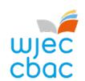
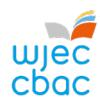

{0}------------------------------------------------

WJEC Newsletter – September 2025

# GCSE MATHEMATICS AND GCSE MATHEMATICS-NUMERACY

## PROFESSIONAL LEARNING (PL) TRAINING COURSES

Please note that, with our focus now on the new GCSE, there will be no online feedback event this year. However, resources from previous years, which include valuable feedback on topic areas that continue to present challenges for candidates, remain available on [Portal.](https://portal.wjec.co.uk/)

### PRINCIPAL EXAMINERS' REPORTS

Principal Examiners' reports are now available for the Summer 2025 series for GCSE Mathematics and GCSE Mathematics-Numeracy. They can be found under the Key Documents tab on the [legacy](https://www.wjec.co.uk/qualifications/mathematics-gcse/#tab_keydocuments)  [GCSE Mathematics webpage.](https://www.wjec.co.uk/qualifications/mathematics-gcse/#tab_keydocuments)

### FREE ACCESS TO SCRIPTS

WJEC teachers also benefit from access to free marked exam scripts from the Summer 2025 assessment series.

Candidates' scripts will be available to download from [Portal](https://portal.wjec.co.uk/) from results day onwards.

### BLENDED LEARNING AND KNOWLEDGE ORGANISERS

We currently have two blended learning webpages running in parallel, one for the [legacy qualifica](https://resources-legacy.wjec.co.uk/Pages/ResourceByArgs.aspx?subId=38&lvlId=2)[tion](https://resources-legacy.wjec.co.uk/Pages/ResourceByArgs.aspx?subId=38&lvlId=2) and one for the [new qualification.](https://filter.resources.wjec.co.uk/en/s/Mathematics%20and%20Numeracy?types=KO%2CBL) While some topics overlap, it is important to ensure that students are directed to the correct resources page for the qualification they are following.

## FINAL LEGACY EXAMINATIONS

In 2025–26, only candidates in Year 11 or above will be eligible to sit the legacy papers.

In 2026–27, resit opportunities will be available for post-16 learners who have previously cashed in on the legacy qualification. These will be offered in November 2026 (GCSE Mathematics), January 2027 (GCSE Mathematics-Numeracy) and Summer 2027 (both GCSE Mathematics and GCSE Mathematics-Numeracy), subject to demand.

{1}------------------------------------------------

## NEW GCSE MATHEMATICS AND NUMERACY (DOUBLE AWARD)

## PROFESSIONAL LEARNING (PL) TRAINING COURSES

We are pleased to announce that all professional learning activities within the WJEC support package for the new GCSE are now complete. During the spring term, we delivered 12 successful face-toface training days. Materials from these sessions are now available o[n Portal.](https://portal.wjec.co.uk/)

You will also find on Portal a set of student-facing examination walkthroughs, designed to help candidates prepare for assessments. These will not be publicly available initially, so teachers will need to download and share them directly with their students.

Additionally, our [new qualification webpage](https://www.wjec.co.uk/qualifications/gcse-mathematics-and-numeracy-double-award-teaching-from-2025/#tab_keydocuments) hosts further resources. Under Training On Demand Courses, you can access the *Specification Walk-Through* and a video recording of the *Specification Briefing* held in November 2024.

### BLENDED LEARNING AND KNOWLEDGE ORGANISERS

We currently have two blended learning webpages running in parallel, one for the [legacy qualifica](https://resources-legacy.wjec.co.uk/Pages/ResourceByArgs.aspx?subId=38&lvlId=2)[tion](https://resources-legacy.wjec.co.uk/Pages/ResourceByArgs.aspx?subId=38&lvlId=2) and one for the [new qualification.](https://filter.resources.wjec.co.uk/en/s/Mathematics%20and%20Numeracy?types=KO%2CBL) While some topics overlap, it is important to ensure that students are directed to the correct resources page for the qualification they are following.

### 2025-26 EXAMINATIONS

From September 2025, all students starting Year 10 must follow the new GCSE course. They will not be permitted to sit any legacy papers. Their first opportunity to take assessments will be in Summer 2026, when Units 1 and 2 will both be available. Unit 3 will be offered in November 2026, which will also be the first opportunity for students to cash in their results.

### UPDATES TO THE NEW SPECIFICATION

Please note that updated versions of certain documents have been released since their initial publication. Where applicable, a *Summary of Amendments* page has been included. As some teachers may have been working from separate spreadsheets or schemes of work, please ensure that these updates are applied across all relevant materials.

The most recent amendments were made in August 2025, including:

- 1.4.3 "Convert numbers from one form into another" added to Unit 1 and Unit 3
- 1.9.7 "Use surds in exact calculations" added to Unit 2

### • IMPORTANT

There has also been a significant change to certain Welsh-medium terminology. This concerns the Welsh-language terms for *speed* and *velocity*. Please refer to [Appendix 1](#page-4-0) for the full statement.

{2}------------------------------------------------

## LEVEL 2 ADDITIONAL MATHEMATICS

### New Made for Wales Level 2 Additional Mathematics

We are excited to launch the new specification for Level 2 Additional Mathematics. The web page for the new Level 2 qualification is here: [Level 2 Additional Mathematics -](https://www.wjec.co.uk/qualifications/level-2-additional-mathematics-teaching-from-2026/#tab_keydocuments) Teaching from 2026. Here are some key dates for your diaries including information on upcoming Professional Learning opportunities.

### Key dates

- Approved Specifications Published: 30 September 2025
- Publication of Sample Assessment Materials: 17 December 2025
- Guidance for Teaching Published: 22 January 2026

## PL Events and Materials

| PL Type                                                                               | Aims                                                                                                                                                       | Format and Notes                                                                                                                                                                                   |
|---------------------------------------------------------------------------------------|------------------------------------------------------------------------------------------------------------------------------------------------------------|----------------------------------------------------------------------------------------------------------------------------------------------------------------------------------------------------|
| Your Guide to the new specification module Available from end of September 2025 | To support your understanding of the specification document. | This asynchronous module will be on the "training on demand" tab of your qualification page on the WJEC website. You will need to register to access a link to view. |
| Parent / Options evening flyers Available from end of September 2025 | To support you to provide information to parents and learners before start of study. | This PDF will be published on your qualification's home page. |
| Live Online Qualification Briefing & Q&A                                              | To support your understanding of                                                                                                                           | These live online events will be                                                                                                                                                                   |
| Available 2nd half autumn term 2025. | the new qualification, its content and assessment structure. The live event will also refer to | advertised on the WJEC website, and you will be required to register via a link. They will be hosted on Teams |
| Events are open for registration. | resources and upcoming PL and offer an opportunity to put | Live (Townhall). |
| Visit the Training tab on your new                                                    | questions to our Subject Teams                                                                                                                             | The events will be presented by                                                                                                                                                                    |
| qualification's webpage to view dates and register: | and specification experts. | WJEC Subject Advisors with Q&A support from WJEC Subject Officers. There will be English medium and |
| Level 2 Additional Mathematics - Teaching from 2026 |  | Welsh medium events (except for English and Welsh qualifications). |
| * Preparing to Teach (face-to-face) Available from 09/02/26 to 27/03/26 | To support teaching the new specification. There will be a focus on understanding the assessments, assessment objectives, content and teaching | These days take place on designated regional INSET days – there are 12 days in this series held across Wales, including 2 Welsh medium days and 1 bilingual day. Registrations will be |
| Registrations for the Pan Wales INSET | approaches based on the specification, sample assessment | collected via your head teacher/head of centre. |
| days will be collected via your head                                                  | materials and guidance for                                                                                                                                 |                                                                                                                                                                                                    |
| teacher. No registrations through WJEC's website. | teaching. | These events will be led by WJEC Subject Advisors and our expert presenting teams. |
| Exam Walk-throughs                                                                    | To support you and your learners                                                                                                                           | These pre-recorded PowerPoint                                                                                                                                                                      |
| Available summer term 2026 | to understand the structure of question papers, question types, assessment objectives and | presentations will initially be published on Portal (the WJEC secure website) only. |
| Access via Portal (the WJEC secure website) | marking methods. |  |

\* Your designated regional WJEC face-to-face INSET date (Preparing to Teach) can be found here: Made-for-Wales GCSEs - [Professional Learning | TGAU Gwneud-i-Gymru -](https://www.wjec.co.uk/home/professional-learning/made-for-wales-gcses-professional-learning/#tab_1) Dysgu Proffesiynol

{3}------------------------------------------------

### PRINCIPAL EXAMINERS' REPORTS

Principal examiners' reports are now available for the Summer 2025 series for Level 2 Additional Mathematics. They can be found under the Key Documents tab on the Level 2 Additional Mathematics web page:

[Level 2 Additional Mathematics Key Documents \(wjec.co.uk\)](https://www.wjec.co.uk/qualifications/additional-mathematics-level-2/#tab_keydocuments)

### FREE ACCESS TO SCRIPTS

WJEC teachers also benefit from access to free marked exam scripts from the Summer 2025 assessment series.

Candidates' scripts will be available to download from our [Portal](https://www.wjecservices.co.uk/login.asp) from results day onwards.

# GCE MATHEMATICS AND GCE FURTHER MATHEMATICS

### PROFESSIONAL LEARNING (PL) TRAINING COURSES

Our new Assessment Feedback Package for 2025-26 is an opportunity to gain a deeper understanding of how assessments are marked. This integrated suite of resources and training brings together free access to Principal Examiner reports, marked scripts, and online assessment feedback sessions. Learn more about how you and your learners can benefit from our Assessment Feedback Package here: [Assessment Feedback Package 2025-26](https://www.wjec.co.uk/home/professional-learning/assessment-feedback-package-2024-25/) (wjec.co.uk). You can download the most recent Principal Examiner Report and register for FREE, online feedback events on your qualification page. For more information and to book please click on the following link: [Booking Information](https://www.wjec.co.uk/home/professional-learning/booking-information/)

### PRINCIPAL EXAMINERS' REPORTS

Principal Examiners' reports are now available for the Summer 2025 series for GCE Mathematics and GCE Further Mathematics. They can be found under the Key Documents tab on the AS/A level Mathematics web page: [AS/A Level Mathematics Key Documents \(wjec.co.uk\)](https://www.wjec.co.uk/qualifications/mathematics-a-as-level/#tab_keydocuments)

## FREE ACCESS TO SCRIPTS

WJEC teachers also benefit from access to free marked exam scripts from the Summer 2025 assessment series.

Candidates' scripts will be available to download from our [Portal](https://www.wjecservices.co.uk/login.asp) from results day onwards.

### KNOWLEDGE ORGANISERS AND OTHER RESOURCES

Visit the [Home Page WJEC Educational Resources Website.](https://resources.wjec.co.uk/)

{4}------------------------------------------------

## Get in touch

If you have any queries, please get in touch with us via e-mail [\(mathematics@wjec.co.uk\)](mailto:mathematics@wjec.co.uk) or telephone (02922 404 251).

## Appendix 1

Following a consultation under the guidance of Canolfan Bedwyr, which is Bangor University's Centre for Welsh Language Services, Research and Technology (who are responsible for Y Termiadur Addysg), a decision was made to change the Welsh language terminology currently in use for 'speed' and 'velocity'. An important point to make here is that Canolfan Bedwyr consulted with WJEC, mathematics and physics subject specialists, the national literacy tests specialist panel and teachers who currently teach these subjects in secondary schools.

### The problem

The central issue with the current terminology is the inconsistency which exists between:

- Language in common, everyday use:
  - The word 'cyflymder' is used for 'speed' outside school including in professional situations (such as any discussion relating to speed limits etc). 'Buanedd' is an old historical term which doesn't form part of everyday language.
- Primary education:
  - Pupils learn the term 'cyflymder' for 'speed' in primary school.
- Secondary education:
  - When they reach secondary school, pupils need to change to using 'buanedd' for 'speed' without understanding why that is. Years later, the use of 'cyflymder' for 'velocity' is introduced.
- Educational subjects:
  - 'Cyflymder' is used for 'speed' in subjects like Physical Education and Information Technology but then 'cyflymder' is also used for 'velocity' in the subjects of Physics and Mathematics.

This inconsistency confuses pupils, especially as they move from primary to secondary education or in resources or activities which encompass both periods. The recent national numeracy tests are such an example, where a decision has to be made as to which term to use, with these tests being given to primary and secondary pupils. This problem will continue despite the fact that changes will be coming to these tests over the next few years.

#### The change

- **•** To use 'cyflymder' for 'speed' across all levels of education (reconciling with common speech)
- **•** Coin the new term 'felosedd' for 'velocity'
- **•** Dispose of the term 'buanedd' as a technical term

#### Arguments for change

- **•** It would reconcile terminology across primary and secondary education
- **•** It would reconcile school terminology with common speech
- **•** It would follow modern terminology principles (that is keeping familiar words for familiar concepts)

## Implementing the change

### New GCSE/Level 2 specifications (teaching from 2025/2026)

Based on the recommendations of Canolfan Bedwyr therefore, 'cyflymder' (speed) and 'felosedd' (velocity) will be used in the following new qualifications:

- GCSE Mathematics and Numeracy (double award) specification teaching from 2025
- Level 2 Additional Mathematics specification teaching from 2026
- GCSE The Sciences (double award) teaching from 2026
- GCSE Integrated Science teaching from 2026

{5}------------------------------------------------

In order to mitigate for any confusion which may be caused by this change, the English terms will be put in brackets the first time the terms appear in an examination paper.

### Current GCSE/Level 2 specifications

Please note: these changes relate to the new specifications only, there will be NO change to the terms used in the current specifications.

'Buanedd' (speed) and 'cyflymder' (velocity) will continue to be used in the following specifications:

- GCSE Mathematics/Numeracy specification (current)
- Level 2 Additional Mathematics specification (current)
- GCSE Science specifications (Biology, Chemistry, Physics, Science Double Award, Applied Science Single Award/Double Award) (current)

From 2026 onwards, the terms in English will also be placed in brackets in the examination papers of the above specifications. This is to avoid any confusion for the candidates sitting one of the current GCSE Science specifications and the new GCSE Mathematics and Numeracy specification (teaching from 2025).

## Current GCE specifications

### GCE Mathematics / Further Mathematics specifications

For now, 'buanedd' (speed) and 'cyflymder' (velocity) will continue to be used in these specifications.

However, the AS units of these specifications will be changed to align with the GCSE specification from September 2027 onwards. Then from September 2028 onwards, the A Level units of these specifications will also be changed. In fairness to all candidates sitting/resitting GCE Mathematics/Further Mathematics over the next few years, the English terms wil be placed in brackets in the examination papers from 2026 onwards.

### GCE Biology / Chemistry / Physics specifications

For now, 'buanedd' (speed) and 'cyflymder' (velocity) will continue to be used in these specifications.

However, the AS units of these specifications will be changed to align with the GCSE specification from September 2028 onwards. Then from September 2029 onwards, the A Level units of these specifications will also be changed. In fairness to all candidates sitting/resitting GCE Biology/Chemistry/Physics examination papers over the next few years, the English terms will be placed in brackets in the examination papers from 2026 onwards.

Implementing these changes will cause an additional burden initially in the short term, but we do feel that pupils will benefit from making this change in the long term in order to ensure consistency of terminology across their entire educational journey.