{1}------------------------------------------------

# WJEC GCSE Mathematics and Numeracy (Double Award)

Approved by Qualifications Wales

{2}------------------------------------------------

{3}------------------------------------------------

This specification meets the requirements of the following regulatory documents published by Qualifications Wales:

- [Made for Wales GCSE Qualification Approval Criteria](https://qw-website-prod-master.azurewebsites.net/media/t1lhpbwl/made-for-wales-gcse-qualification-approval-criteria.pdf) which set out requirements for any new GCSE qualification Approved for first teaching from September 2025 and beyond.
- [Standard Conditions of Recognition](https://qualifications.wales/media/p54jkkfe/standard-conditions-of-recognition.pdf) which contains the rules that all awarding bodies and their qualifications must meet when offering qualifications to learners in Wales.
- Approval Criteria for GCSE [Mathematics and Numeracy \(Double Award\)](https://qualifications.wales/media/3i1gwyen/gcse-mathematics-and-numeracy-approval-criteria.pdf) which sets out the subject specific requirements for GCSE Mathematics and Numeracy (Double Award) from September 2025 and beyond.

{4}------------------------------------------------

## SUMMARY OF AMENDMENTS

| Version | Description                                                                    | Page number |
|---------|--------------------------------------------------------------------------------|-------------|
| 2       | Clarification on when compasses will be required in 3.2.2                      | 30          |
|         | Addition of grams – ounces as conversion units in 3.5.7                        | 35          |
| 3       | Terminal rule change                                                           | 58-59       |
| 4       | 1.4.3 'convert numbers from one form into another' added to Unit 1 and Unit 3  | 14          |
|         | 1.9.7 'use surds in exact calculations' content added to Unit 2                | 20          |
| 5       | Terminal rule reference removed from 'Post-16 Candidates' section for clarity. | 58          |

{5}------------------------------------------------

### **CONTENTS**

| SUMMARY OF ASSESSMENT |                                                                  | 5  |
|-----------------------|------------------------------------------------------------------|----|
| 1.                    | INTRODUCTION                                                     | 7  |
|                       | 1.1 Aims                                                         | 7  |
|                       | 1.2 Curriculum for Wales                                         | 7  |
|                       | 1.3 Prior learning and progression                               | 8  |
|                       | 1.4 Guided learning hours                                        | 8  |
|                       | 1.5 Use of language                                              | 9  |
|                       | 1.6 Equality and fair access                                     | 9  |
| 2                     | SUBJECT CONTENT                                                  | 10 |
|                       | Unit 1                                                           | 10 |
|                       | Unit 2                                                           | 10 |
|                       | Unit 3                                                           | 10 |
|                       | Areas of content                                                 |    |
|                       | Opportunities for integration of learning experiences            | 48 |
| 3                     | ASSESSMENT                                                       | 49 |
|                       | 3.1 Assessment objectives and weightings                         | 49 |
|                       | Questions set in context                                         | 51 |
|                       | Organising, communicating and writing accurately                 | 51 |
|                       | Use of calculators                                               | 52 |
|                       | Formula lists                                                    | 52 |
| 4                     | MALPRACTICE                                                      | 57 |
| 5                     | TECHNICAL INFORMATION                                            | 58 |
|                       | 5.1 Entries and awards                                           | 58 |
|                       | 5.2 Grading, awarding and reporting                              | 59 |
|                       | 5.3 Tiering                                                      | 59 |
| Appendix A:           | Opportunities for embedding elements of the Curriculum for Wales | 94 |

{6}------------------------------------------------

## GCSE MATHEMATICS AND NUMERACY (DOUBLE AWARD)

## SUMMARY OF ASSESSMENT

**Unit 1: Financial Mathematics and Other Applications of** 

**Numeracy**

**Written examination**

**Higher Tier: 1 hour 45 minutes (80 marks) Foundation Tier: 1 hour 30 minutes (65 marks)**

**30% of qualification**

The written paper for each tier will comprise a number of short and longer, both structured and unstructured questions. These questions may be set on any part of the subject content assigned to this unit. Questions will be set in personal and other real-world contexts.

A calculator will be allowed in this paper.

**Unit 2: Non-calculator Written examination**

**Higher Tier: 1 hour 45 minutes (80 marks) Foundation Tier: 1 hour 30 minutes (65 marks)**

**30% of qualification** 

The written paper for each tier will comprise a number of short and longer, both structured and unstructured questions. These questions may be set on any part of the subject content assigned to this unit. The paper will include context-free questions and questions set in mathematical and other contexts.

A calculator will **not** be allowed in this paper.

**Unit 3: Calculator-allowed Written examination**

**Higher Tier: 2 hours (90 marks)**

**Foundation Tier: 1 hour 45 minutes (75 marks)**

**40% of qualification** 

The written paper for each tier will comprise a number of short and longer, both structured and unstructured questions which may be set on any part of the subject content assigned to this unit. The paper will include a mix of questions set in real-world and other contexts, and context-free questions.

A calculator will be allowed in this paper.

{7}------------------------------------------------

This is a unitised qualification.

There are two tiers of entry for this qualification:

Higher Tier: A\* – D Foundation Tier: C – G

Learners may be entered at different tiers across units.

There is no hierarchy implied by the order in which the units are presented. Therefore, the order does not imply a prescribed teaching order.

Units 1 and 2 will be available for the first time in summer 2026 and will then be available every November and summer series.

Unit 3 will be available for the first time in November 2026 and will then be available every November and summer series.

The qualification will be awarded for the first time in November 2026.

Qualification Approval Number: C00/4968/0

{8}------------------------------------------------

## GCSE MATHEMATICS AND NUMERACY (DOUBLE AWARD)

#### 1. INTRODUCTION

##### 1.1 Aims

GCSE Mathematics and Numeracy (Double Award) qualification supports learners to:

- make connections between different areas of mathematics and with other areas of the curriculum
- develop their conceptual understanding in explaining, expressing and representing concepts in both concrete and abstract forms
- communicate both abstract situations and real-world scenarios using mathematical symbols and expressions
- develop their ability to use mathematical facts, techniques and relationships fluently to solve problems
- recognise underlying mathematical structures within problems and develop strategies to solve them
- develop an understanding of relationships between mathematical concepts and the use of justifications and proofs
- gain a strong foundation in financial mathematics to equip them for life and work
- develop confidence in using and applying digital technology to help solve mathematical and statistical problems.

These aims are set out in Qualifications Wales' Approval Criteria.

##### 1.2 Curriculum for Wales

This GCSE Mathematics and Numeracy (Double Award) qualification is underpinned by the Curriculum for Wales framework and has been designed to ensure that learners can continue to make progress towards the four purposes whilst studying for this qualification. Central to this design are the [principles of progression,](https://hwb.gov.wales/curriculum-for-wales/mathematics-and-numeracy/principles-of-progression/) along with the [statements of what matters](https://hwb.gov.wales/curriculum-for-wales/mathematics-and-numeracy/statements-of-what-matters/) and those [subject specific skills and concepts](https://hwb.gov.wales/curriculum-for-wales/mathematics-and-numeracy/designing-your-curriculum/#specific-considerations-for-this-area) outlined in the '[Designing your Curriculum](https://hwb.gov.wales/curriculum-for-wales/mathematics-and-numeracy/designing-your-curriculum/)' section of the Mathematics and Numeracy Area of Learning and Experiences

In developing this qualification, we have considered where there are opportunities to embed the cross-curricular themes and where there are opportunities for integral skills and cross-curricular skills to be developed. Appendix A provides a simple mapping, and information to support teachers will be provided in the Guidance for Teaching.

We have also considered where the qualification can generate opportunities for integrating the learning experiences noted on page 47; the Guidance for Teaching will include further information on integrating these learning experiences into delivery. 

{9}------------------------------------------------

The construct of GCSE Mathematics and Numeracy (Double Award) is based on the five interdependent proficiencies that make up the Curriculum for Wales' principles of progression for the Mathematics and Numeracy Area. These are:

- conceptual understanding
- communication using symbols
- fluency
- logical reasoning
- strategic competence.

The content of GCSE Mathematics and Numeracy (Double Award) qualification is based on the following mathematical and numerical concepts that make up the Curriculum for Wales' statements of what matters for the Mathematics and Numeracy Area:

- number
- algebra
- geometry and measures
- statistics and probability.

Aspects of each concept are explored in every unit of the qualification, supporting the statement that 'the different areas of mathematics are highly interconnected and dependent on one another' included in the specific considerations for this Area.

The qualification also supports key links with other Areas of the Curriculum for Wales, including developing learners' financial literacy in support of learner wellbeing.

## 1.3 Prior learning and progression

Although there is no specific requirement for prior learning, the qualification is designed primarily for learners between the ages of 14 and 16 and builds on the conceptual understanding learners have developed through their learning from ages 3 – 14.

The qualification allows learners to develop a strong foundation of knowledge, skills and understanding which supports progression to post-16 study and prepares learners for life, learning and work. The qualification provides a suitable foundation for the study of Mathematics at either AS or A level. In addition, the specification provides a coherent, satisfying and worthwhile course of study for learners who do not progress to further study in this subject.

## 1.4 Guided learning hours

GCSE Mathematics and Numeracy (Double Award) has been designed to be delivered within 240 – 280 guided learning hours. The qualification has been primarily designed as a 2-year programme for learners in years 10 and 11.

{10}------------------------------------------------

### 1.5 Use of language

As our understanding of diversity, equity, and inclusion evolves, so must our language. Updated terminology better reflects individual identities and fosters respect and accuracy. Language used should be specific as possible. Staying informed and adaptable is crucial, as inclusive language promotes dignity and equity. Recognising that language will continue to evolve, we will remain open to further amendments to ensure it accurately represents and supports all individuals. WJEC will inform centres of any amendments and the most up to date version of the specification will always be on the website.

## 1.6 Equality and fair access

The specification may be followed by any learner, irrespective of gender, ethnic, religious or cultural background. It has been designed to avoid, where possible, features that could, without justification, make it more difficult for a learner to access and achieve because they have a particular protected characteristic.

The protected characteristics under the Equality Act 2010 are age, disability, gender reassignment, pregnancy and maternity, race, religion or belief, sex and sexual orientation.

Access arrangements and reasonable adjustments are made for eligible learners to enable them to access the assessments and demonstrate their knowledge and skills without changing the demands of the assessment.

Information on access arrangements and reasonable adjustments is found in the following document from the Joint Council for Qualifications (JCQ): Access Arrangements, Reasonable Adjustments: General and Vocational Qualifications. This document is available on the JCQ website [\(http://www.jcq.org.uk/\)](http://www.jcq.org.uk/).

We will be following the principles set out in this document and, as a consequence of provision for reasonable adjustments, very few learners will encounter a complete barrier to any part of the assessment.

{11}------------------------------------------------

## 2 SUBJECT CONTENT

#### Unit 1

#### **Financial Mathematics and Other Applications of Numeracy**

Written examination

Higher Tier: 1 hour 45 minutes (80 marks) Foundation Tier: 1 hour 30 minutes (65 marks)

30% of qualification

The purpose of this unit is to:

- introduce and develop learners' understanding of topics and concepts relating to finance and to develop their financial literacy
- allow learners to use their knowledge and apply mathematical methods to personal and other real-world contexts, including those related to money and the workplace.

Calculator will be allowed in this examination.

#### Unit 2

#### **Non-calculator**

Written examination

Higher Tier: 1 hour 45 minutes (80 marks) Foundation Tier: 1 hour 30 minutes (65 marks)

30% of qualification

The purpose of this unit is to explore mathematical topics and concepts that don't require the use of a calculator.

This unit contains all aspects of probability and has a significant focus on geometry.

Calculator will not be allowed in this examination.

#### Unit 3

#### **Calculator-allowed**

Written examination

Higher Tier: 2 hours (90 marks)

Foundation Tier: 1 hour 45 minutes (75 marks)

40% of qualification

The purpose of this unit is to explore topics and concepts that:

- are more appropriately assessed with a calculator, or
- form the foundations for, or link to, topics that are more appropriately assessed with a calculator.

This unit contains the majority of topics covering the data handling aspects of statistics and has a significant focus on measures.

Calculator will be allowed in this examination.

{12}------------------------------------------------

### Areas of content

Foundation tier content is in standard text.

Higher tier content which is in addition to foundation tier content is in **bold** text.

#### **1. Number**

- 1.1 Number and rounding
- 1.2 Number properties including prime factor decomposition
- 1.3 Index laws including standard form
- 1.4 Fractions, decimals, percentages and ratio
- 1.5 Proficiency in calculations
- 1.6 Limits of accuracy
- 1.7 Extraction, interpretation and presentation of information
- 1.8 Personal/household finance and enterprise
- 1.9 Rational and irrational numbers

|                                                                                                                                                                                                                                                                                                              | Amplification                                                                                                                                                                                                                                                                                                                                                                                                                                                                                                                                                                                    |                                                                                                                                                                                                                                                                                                                                                                                                                                          |                                                                                                                                                                                                                                                                                                                                                               |
|--------------------------------------------------------------------------------------------------------------------------------------------------------------------------------------------------------------------------------------------------------------------------------------------------------------|--------------------------------------------------------------------------------------------------------------------------------------------------------------------------------------------------------------------------------------------------------------------------------------------------------------------------------------------------------------------------------------------------------------------------------------------------------------------------------------------------------------------------------------------------------------------------------------------------|------------------------------------------------------------------------------------------------------------------------------------------------------------------------------------------------------------------------------------------------------------------------------------------------------------------------------------------------------------------------------------------------------------------------------------------|---------------------------------------------------------------------------------------------------------------------------------------------------------------------------------------------------------------------------------------------------------------------------------------------------------------------------------------------------------------|
| Number section                                                                                                                                                                                                                                                                                               | Unit 1                                                                                                                                                                                                                                                                                                                                                                                                                                                                                                                                                                                           | Unit 2                                                                                                                                                                                                                                                                                                                                                                                                                                   | Unit 3                                                                                                                                                                                                                                                                                                                                                        |
| 1.1 Number and rounding                                                                                                                                                                                                                                                                                   | Learners should be able to:                                                                                                                                                                                                                                                                                                                                                                                                                                                                                                                                                                      |                                                                                                                                                                                                                                                                                                                                                                                                                                          |                                                                                                                                                                                                                                                                                                                                                               |
|                                                                                                                                                                                                                                                                                                              | 1.1.1 read and write whole numbers of any magnitude expressed in figures or words 1.1.2 round whole numbers to the nearest 10, 100, 1000, etc. 1.1.3 understand place value of whole numbers and those written in decimal form 1.1.4 round decimals to the nearest whole number or a given number of decimal places                                                                                                                                                                                                                                    | 1.1.1 read and write whole numbers of any magnitude expressed in figures or words 1.1.2 round whole numbers to the nearest 10, 100, 1000, etc. 1.1.3 understand place value of whole numbers and those written in decimal form 1.1.4 round decimals to the nearest whole number or a given number of decimal places                                                                            | 1.1.1 read and write whole numbers of any magnitude expressed in figures or words 1.1.2 round whole numbers to the nearest 10, 100, 1000, etc. 1.1.3 understand place value of whole numbers and those written in decimal form 1.1.4 round decimals to the nearest whole number or a given number of decimal places |
| Number section                                                                                                                                                                                                                                                                                               | Amplification                                                                                                                                                                                                                                                                                                                                                                                                                                                                                                                                                                                    |                                                                                                                                                                                                                                                                                                                                                                                                                                          |                                                                                                                                                                                                                                                                                                                                                               |
|                                                                                                                                                                                                                                                                                                              | Unit 1                                                                                                                                                                                                                                                                                                                                                                                                                                                                                                                                                                                           | Unit 2                                                                                                                                                                                                                                                                                                                                                                                                                                   | Unit 3                                                                                                                                                                                                                                                                                                                                                        |
| 1.1.5 round numbers to a given number of significant figures 1.1.6 understand, use and order directed numbers 1.1.7 decide whether to round up or down, as appropriate, in a problem                                                                                              | 1.1.5 round numbers to a given number of significant figures 1.1.6 understand, use and order directed numbers                                                                                                                                                                                                                                                                                                                                                                                                                                                                     | 1.1.5 round numbers to a given number of significant figures 1.1.6 understand, use and order directed numbers 1.1.7 decide whether to round up or down, as appropriate, in a problem                                                                                                                                                                                                                          | 1.1.5 round numbers to a given number of significant figures 1.1.6 understand, use and order directed numbers 1.1.7 decide whether to round up or down, as appropriate, in a problem                                                                                                                                               |
|                                                                                                                                                                                                                                                                                                              | 1.1.8 check methods and solutions using appropriate strategies                                                                                                                                                                                                                                                                                                                                                                                                                                                                                                                             | 1.1.8 check methods and solutions using appropriate strategies 1.1.9 estimate solutions to numerical calculations by approximating the numbers in the calculations                                                                                                                                                                                                                                                  | 1.1.8 check methods and solutions using appropriate strategies                                                                                                                                                                                                                                                                                          |
| 1.2 Number properties including prime factor decomposition                                                                                                                                                                                                                                       | Learners should know:                                                                                                                                                                                                                                                                                                                                                                                                                                                                                                                                                                            | Learners should know:                                                                                                                                                                                                                                                                                                                                                                                                                    | Learners should know:                                                                                                                                                                                                                                                                                                                                         |
|                                                                                                                                                                                                                                                                                                              | 1.2.1 the common properties of numbers, including knowledge of odd, even, integers, multiples, factors, primes 1.2.2 the meaning of the terms square, square root, cube and cube root                                                                                                                                                                                                                                                                                                                                                                                 | 1.2.1 the common properties of numbers, including knowledge of odd, even, integers, multiples, factors, primes 1.2.2 the meaning of the terms square, square root, cube, and cube root 1.2.3 the meaning of the term reciprocal                                                                                                                                                                      | 1.2.1 the common properties of numbers, including knowledge of odd, even, integers, multiples, factors, primes 1.2.2 the meaning of the terms square, square root, cube and cube root 1.2.3 the meaning of the term reciprocal                                                                                            |
| Number section                                                                                                                                                                                                                                                                                               | Amplification                                                                                                                                                                                                                                                                                                                                                                                                                                                                                                                                                                                    |                                                                                                                                                                                                                                                                                                                                                                                                                                          |                                                                                                                                                                                                                                                                                                                                                               |
|                                                                                                                                                                                                                                                                                                              | Unit 1                                                                                                                                                                                                                                                                                                                                                                                                                                                                                                                                                                                           | Unit 2                                                                                                                                                                                                                                                                                                                                                                                                                                   | Unit 3                                                                                                                                                                                                                                                                                                                                                        |
|                                                                                                                                                                                                                                                                                                              | Learners should be able to:                                                                                                                                                                                                                                                                                                                                                                                                                                                                                                                                                                      |                                                                                                                                                                                                                                                                                                                                                                                                                                          |                                                                                                                                                                                                                                                                                                                                                               |
|                                                                                                                                                                                                                                                                                                              |                                                                                                                                                                                                                                                                                                                                                                                                                                                                                                                                                                                                  | 1.2.4 express numbers as the product of their prime factors in index form 1.2.5 find the least common multiple (LCM) and highest common factor (HCF) using prime factor decomposition or other appropriate methods 1.2.6 use prime factor decomposition to help solve other numerical problems, including links to square numbers                                                           |                                                                                                                                                                                                                                                                                                                                                               |
| 1.3 Index laws including standard form                                                                                                                                                                                                                                                                 | Learners should know:                                                                                                                                                                                                                                                                                                                                                                                                                                                                                                                                                                            |                                                                                                                                                                                                                                                                                                                                                                                                                                          |                                                                                                                                                                                                                                                                                                                                                               |
|                                                                                                                                                                                                                                                                                                              | 1.3.1 the notation for positive integral indices 1.3.2 the notation for zero and negative indices                                                                                                                                                                                                                                                                                                                                                                                                                                                                                 | 1.3.1 the notation for positive integral indices 1.3.2 the notation for zero and negative indices 1.3.3 the notation for fractional indices                                                                                                                                                                                                                                                                      | 1.3.1 the notation for positive integral indices 1.3.2 the notation for zero and negative indices                                                                                                                                                                                                                                              |
|                                                                                                                                                                                                                                                                                                              | Learners should be able to:                                                                                                                                                                                                                                                                                                                                                                                                                                                                                                                                                                      |                                                                                                                                                                                                                                                                                                                                                                                                                                          |                                                                                                                                                                                                                                                                                                                                                               |
|                                                                                                                                                                                                                                                                                                              |                                                                                                                                                                                                                                                                                                                                                                                                                                                                                                                                                                                                  | 1.3.4 use the rules of indices to perform calculations with numbers written in index form for positive integral indices                                                                                                                                                                                                                                                                                                      |                                                                                                                                                                                                                                                                                                                                                               |
| Number section                                                                                                                                                                                                                                                                                               | Amplification                                                                                                                                                                                                                                                                                                                                                                                                                                                                                                                                                                                    |                                                                                                                                                                                                                                                                                                                                                                                                                                          |                                                                                                                                                                                                                                                                                                                                                               |
|                                                                                                                                                                                                                                                                                                              | Unit 1                                                                                                                                                                                                                                                                                                                                                                                                                                                                                                                                                                                           | Unit 2                                                                                                                                                                                                                                                                                                                                                                                                                                   | Unit 3                                                                                                                                                                                                                                                                                                                                                        |
|                                                                                                                                                                                                                                                                                                              | 1.3.6 convert ordinary numbers into and out of standard form 1.3.7 use numbers written in standard form                                                                                                                                                                                                                                                                                                                                                                                                                                                                        | 1.3.5 use the rules of indices to perform calculations with numbers written in index form for positive, negative and fractional indices 1.3.6 convert ordinary numbers into and out of standard form 1.3.7 use numbers written in standard form                                                                                                                                                      | 1.3.6 convert ordinary numbers into and out of standard form 1.3.7 use numbers written in standard form                                                                                                                                                                                                                                     |
|                                                                                                                                                                                                                                                                                                              |                                                                                                                                                                                                                                                                                                                                                                                                                                                                                                                                                                                                  |                                                                                                                                                                                                                                                                                                                                                                                                                                          |                                                                                                                                                                                                                                                                                                                                                               |
| 1.4 Fractions, decimals percentages and ratios                                                                                                                                                                                                                                                      | Learners should know:                                                                                                                                                                                                                                                                                                                                                                                                                                                                                                                                                                            |                                                                                                                                                                                                                                                                                                                                                                                                                                          |                                                                                                                                                                                                                                                                                                                                                               |
|                                                                                                                                                                                                                                                                                                              | 1.4.1 how to find equivalent fractions 1.4.2 the equivalences between fractions, decimals and percentages                                                                                                                                                                                                                                                                                                                                                                                                                                                                      | 1.4.1 how to find equivalent fractions 1.4.2 the equivalences between fractions, decimals and percentages                                                                                                                                                                                                                                                                                                              | 1.4.1 how to find equivalent fractions 1.4.2 the equivalences between fractions, decimals and percentages                                                                                                                                                                                                                                   |
|                                                                                                                                                                                                                                                                                                              | Learners should be able to:                                                                                                                                                                                                                                                                                                                                                                                                                                                                                                                                                                      |                                                                                                                                                                                                                                                                                                                                                                                                                                          |                                                                                                                                                                                                                                                                                                                                                               |
|                                                                                                                                                                                                                                                                                                              | 1.4.3 convert numbers from one form into another                                                                                                                                                                                                                                                                                                                                                                                                                                                                                                                                           | 1.4.3 convert numbers from one form into another 1.4.4 order and compare whole numbers, decimals, fractions and percentages                                                                                                                                                                                                                                                                                            | 1.4.3 convert numbers from one form into another                                                                                                                                                                                                                                                                                                        |
|                                                                                                                                                                                                                                                                                                              | 1.4.5 simplify fractions 1.4.6 express one number as a fraction or percentage of another 1.4.7 find a fraction or percentage of a quantity                                                                                                                                                                                                                                                                                                                                                                                                                               | 1.4.5 simplify fractions 1.4.6 express one number as a fraction or percentage of another 1.4.7 find a fraction or percentage of a quantity                                                                                                                                                                                                                                                                       | 1.4.5 simplify fractions 1.4.6 express one number as a fraction or percentage of another 1.4.7 find a fraction or percentage of a quantity                                                                                                                                                                                            |
| Number section                                                                                                                                                                                                                                                                                               | Amplification                                                                                                                                                                                                                                                                                                                                                                                                                                                                                                                                                                                    |                                                                                                                                                                                                                                                                                                                                                                                                                                          |                                                                                                                                                                                                                                                                                                                                                               |
|                                                                                                                                                                                                                                                                                                              | Unit 1                                                                                                                                                                                                                                                                                                                                                                                                                                                                                                                                                                                           | Unit 2                                                                                                                                                                                                                                                                                                                                                                                                                                   | Unit 3                                                                                                                                                                                                                                                                                                                                                        |
| 1.4.8 calculate fractional and percentage changes (increase and decrease) 1.4.9 understand and use multipliers                                                                                                                                                                             | 1.4.8 calculate fractional and percentage changes (increase and decrease) 1.4.9 understand and use multipliers                                                                                                                                                                                                                                                                                                                                                                                                                                                                 |                                                                                                                                                                                                                                                                                                                                                                                                                                          | 1.4.8 calculate fractional and percentage changes (increase and decrease) 1.4.9 understand and use multipliers                                                                                                                                                                                                                              |
| 1.4.10 solve problems with repeated proportional changes 1.4.11 calculate using ratios in a variety of situations 1.4.12 solve numerical problems involving direct and inverse proportion 1.4.13 find the original quantity given the result of a proportional change |                                                                                                                                                                                                                                                                                                                                                                                                                                                                                                                                                                                                  |                                                                                                                                                                                                                                                                                                                                                                                                                                          |                                                                                                                                                                                                                                                                                                                                                               |
| 1.5 Proficiency in calculations                                                                                                                                                                                                                                                                           | Learners should be able to:                                                                                                                                                                                                                                                                                                                                                                                                                                                                                                                                                                      | Learners should be able to:                                                                                                                                                                                                                                                                                                                                                                                                              | Learners should be able to:                                                                                                                                                                                                                                                                                                                                   |
|                                                                                                                                                                                                                                                                                                              | 1.5.1 understand and use number operations and the relationships between them, including inverse operations and the hierarchy of operations 1.5.2 add, subtract, multiply and divide whole numbers, including large whole numbers 1.5.3 add, subtract, multiply and divide decimals, fractions and negative numbers                                                                                                                                                                                                                                    | 1.5.1 understand and use number operations and the relationships between them, including inverse operations and the hierarchy of operations 1.5.2 add, subtract, multiply and divide whole numbers, including large whole numbers 1.5.3 add, subtract, multiply and divide decimals, fractions and negative numbers 1.5.4 understand and use operations written as number machines | 1.5.1 understand and use number operations and the relationships between them, including inverse operations and the hierarchy of operations 1.5.2 add, subtract, multiply and divide whole numbers, including large whole numbers 1.5.3 add, subtract, multiply and divide decimals, fractions and negative numbers |
| Number section                                                                                                                                                                                                                                                                                               | Amplification                                                                                                                                                                                                                                                                                                                                                                                                                                                                                                                                                                                    |                                                                                                                                                                                                                                                                                                                                                                                                                                          |                                                                                                                                                                                                                                                                                                                                                               |
|                                                                                                                                                                                                                                                                                                              | Unit 1                                                                                                                                                                                                                                                                                                                                                                                                                                                                                                                                                                                           | Unit 2                                                                                                                                                                                                                                                                                                                                                                                                                                   | Unit 3                                                                                                                                                                                                                                                                                                                                                        |
| 1.5.5 use a calculator efficiently and effectively, including:order of operationsaddition, subtraction, multiplication and divisionsquare, cube and other powerssquare root and cube rootbracketsother appropriate functionsstandard form                                                                    |                                                                                                                                                                                                                                                                                                                                                                                                                                                                                                                                                                                                  | 1.5.5 use a calculator efficiently and effectively, including:order of operationsaddition, subtraction, multiplication and divisionsquare, cube and other powerssquare root and cube rootbracketsother appropriate functionsstandard form                                                                                                                                                                                                |                                                                                                                                                                                                                                                                                                                                                               |
|                                                                                                                                                                                                                                                                                                              |                                                                                                                                                                                                                                                                                                                                                                                                                                                                                                                                                                                                  | 1.5.6 use the trigonometric functions on a calculator efficiently and effectively                                                                                                                                                                                                                                                                                                                                                        |                                                                                                                                                                                                                                                                                                                                                               |
| 1.6 Limits of accuracy                                                                                                                                                                                                                                                                                       | Learners should be able to:1.6.1 round an answer to a reasonable degree of accuracy in light of the context1.6.2 recognise that measurement is approximate and that a measurement expressed to a given unit is in possible error of half a unit1.6.3 determine the upper and lower bounds of numbers expressed to a given degree of accuracy                                                                                                                                                                                                                                                     |                                                                                                                                                                                                                                                                                                                                                                                                                                          | 1.6.1 round an answer to a reasonable degree of accuracy in light of the context                                                                                                                                                                                                                                                                              |
|                                                                                                                                                                                                                                                                                                              |                                                                                                                                                                                                                                                                                                                                                                                                                                                                                                                                                                                                  |                                                                                                                                                                                                                                                                                                                                                                                                                                          |                                                                                                                                                                                                                                                                                                                                                               |
| Number section                                                                                                                                                                                                                                                                                               | Amplification                                                                                                                                                                                                                                                                                                                                                                                                                                                                                                                                                                                    |                                                                                                                                                                                                                                                                                                                                                                                                                                          |                                                                                                                                                                                                                                                                                                                                                               |
|                                                                                                                                                                                                                                                                                                              | Unit 1                                                                                                                                                                                                                                                                                                                                                                                                                                                                                                                                                                                           | Unit 2                                                                                                                                                                                                                                                                                                                                                                                                                                   | Unit 3                                                                                                                                                                                                                                                                                                                                                        |
|                                                                                                                                                                                                                                                                                                              | 1.6.4 calculate the upper and lower bounds in the addition, subtraction, multiplication and division of numbers expressed to a given degree of accuracy                                                                                                                                                                                                                                                                                                                                                                                                                                          |                                                                                                                                                                                                                                                                                                                                                                                                                                          |                                                                                                                                                                                                                                                                                                                                                               |
|                                                                                                                                                                                                                                                                                                              | Learners should be aware that:                                                                                                                                                                                                                                                                                                                                                                                                                                                                                                                                                                   |                                                                                                                                                                                                                                                                                                                                                                                                                                          | 1.6.5 premature rounding in problems involving multiple steps may affect the accuracy of the final answer                                                                                                                                                                                                                                                     |
|                                                                                                                                                                                                                                                                                                              | 1.6.5 premature rounding in problems involving multiple steps may affect the accuracy of the final answer                                                                                                                                                                                                                                                                                                                                                                                                                                                                                        |                                                                                                                                                                                                                                                                                                                                                                                                                                          |                                                                                                                                                                                                                                                                                                                                                               |
| 1.7 Extraction, interpretation and presentation of information                                                                                                                                                                                                                                               | Learners should be able to:                                                                                                                                                                                                                                                                                                                                                                                                                                                                                                                                                                      |                                                                                                                                                                                                                                                                                                                                                                                                                                          |                                                                                                                                                                                                                                                                                                                                                               |
|                                                                                                                                                                                                                                                                                                              | 1.7.1 interpret and use mathematical information presented in written or visual form, including infographics, schedules, tables, timetables, calendars and charts 1.7.2 create plans and schedules                                                                                                                                                                                                                                                                                                                                                                                            |                                                                                                                                                                                                                                                                                                                                                                                                                                          |                                                                                                                                                                                                                                                                                                                                                               |
|                                                                                                                                                                                                                                                                                                              | 1.7.3 use, interpret and produce Venn diagrams                                                                                                                                                                                                                                                                                                                                                                                                                                                                                                                                                   | 1.7.3 use, interpret and produce Venn diagrams                                                                                                                                                                                                                                                                                                                                                                                           |                                                                                                                                                                                                                                                                                                                                                               |
| Number section                                                                                                                                                                                                                                                                                               | Amplification                                                                                                                                                                                                                                                                                                                                                                                                                                                                                                                                                                                    |                                                                                                                                                                                                                                                                                                                                                                                                                                          |                                                                                                                                                                                                                                                                                                                                                               |
|                                                                                                                                                                                                                                                                                                              | Unit 1                                                                                                                                                                                                                                                                                                                                                                                                                                                                                                                                                                                           | Unit 2                                                                                                                                                                                                                                                                                                                                                                                                                                   | Unit 3                                                                                                                                                                                                                                                                                                                                                        |
| 1.8 Personal/ household finance and enterprise                                                                                                                                                                                                                                                         | Learners should be able to:                                                                                                                                                                                                                                                                                                                                                                                                                                                                                                                                                                      |                                                                                                                                                                                                                                                                                                                                                                                                                                          |                                                                                                                                                                                                                                                                                                                                                               |
|                                                                                                                                                                                                                                                                                                              | 1.8.1 carry out calculations involving knowledge of money; pounds (£) and pence                                                                                                                                                                                                                                                                                                                                                                                                                                                                                                            | 1.8.1 carry out calculations involving knowledge of money; pounds (£) and pence                                                                                                                                                                                                                                                                                                                                                    | 1.8.1 carry out calculations involving knowledge of money; pounds (£) and pence                                                                                                                                                                                                                                                                         |
|                                                                                                                                                                                                                                                                                                              | 1.8.2 understand the basic principles of personal/ household finance and enterprise in order to solve problems relating to, for example: wages and salaries, including payslipstaxation, including income tax and National Insurancesavings and investmentsloans/repaymentsmortgagesappreciation/depreciationbudgetingbank statementsutility billsmobile phone and other billsVATbest buysprice comparisonfinance schemes, including buying by instalmentsdiscount/price increasebuying and sellingprofit and losstravel including foreign currencies, exchange rates and commission |                                                                                                                                                                                                                                                                                                                                                                                                                                          |                                                                                                                                                                                                                                                                                                                                                               |
| Number section                                                                                                                                                                                                                                                                                               | Amplification                                                                                                                                                                                                                                                                                                                                                                                                                                                                                                                                                                                    |                                                                                                                                                                                                                                                                                                                                                                                                                                          |                                                                                                                                                                                                                                                                                                                                                               |
|                                                                                                                                                                                                                                                                                                              | Unit 1                                                                                                                                                                                                                                                                                                                                                                                                                                                                                                                                                                                           | Unit 2                                                                                                                                                                                                                                                                                                                                                                                                                                   | Unit 3                                                                                                                                                                                                                                                                                                                                                        |
| 1.8 Recognise and use number concepts                                                                                                                                                                                                                                                                        | 1.8.3 recognise the difference between simple and compound interest and be able to perform calculations with both, using efficient calculation methods and including the use of multipliers                                                                                                                                                                                                                                                                                                                                                                                                      |                                                                                                                                                                                                                                                                                                                                                                                                                                          |                                                                                                                                                                                                                                                                                                                                                               |
|                                                                                                                                                                                                                                                                                                              | 1.8.4 perform calculations involving multiple rates                                                                                                                                                                                                                                                                                                                                                                                                                                                                                                                                              |                                                                                                                                                                                                                                                                                                                                                                                                                                          |                                                                                                                                                                                                                                                                                                                                                               |
|                                                                                                                                                                                                                                                                                                              | 1.8.5 calculate, use and apply Annual Equivalent Rate (AER) when comparing financial products                                                                                                                                                                                                                                                                                                                                                                                                                                                                                                    |                                                                                                                                                                                                                                                                                                                                                                                                                                          |                                                                                                                                                                                                                                                                                                                                                               |
|                                                                                                                                                                                                                                                                                                              | 1.8.6 calculate, use and apply Annual Percentage Rate (APR) when comparing financial products, including mortgages                                                                                                                                                                                                                                                                                                                                                                                                                                                                               |                                                                                                                                                                                                                                                                                                                                                                                                                                          |                                                                                                                                                                                                                                                                                                                                                               |
| 1.9 Rational and irrational numbers                                                                                                                                                                                                                                                                          | Learners should know:                                                                                                                                                                                                                                                                                                                                                                                                                                                                                                                                                                            |                                                                                                                                                                                                                                                                                                                                                                                                                                          |                                                                                                                                                                                                                                                                                                                                                               |
|                                                                                                                                                                                                                                                                                                              | 1.9.1 that recurring decimals are exact fractions, and that some exact fractions are recurring decimals                                                                                                                                                                                                                                                                                                                                                                                                                                                                                          |                                                                                                                                                                                                                                                                                                                                                                                                                                          |                                                                                                                                                                                                                                                                                                                                                               |
| Number section                                                                                                                                                                                                                                                                                               | Amplification                                                                                                                                                                                                                                                                                                                                                                                                                                                                                                                                                                                    |                                                                                                                                                                                                                                                                                                                                                                                                                                          |                                                                                                                                                                                                                                                                                                                                                               |
|                                                                                                                                                                                                                                                                                                              | Unit 1                                                                                                                                                                                                                                                                                                                                                                                                                                                                                                                                                                                           | Unit 2                                                                                                                                                                                                                                                                                                                                                                                                                                   | Unit 3                                                                                                                                                                                                                                                                                                                                                        |
|                                                                                                                                                                                                                                                                                                              | Learners should be able to:                                                                                                                                                                                                                                                                                                                                                                                                                                                                                                                                                                      |                                                                                                                                                                                                                                                                                                                                                                                                                                          |                                                                                                                                                                                                                                                                                                                                                               |
|                                                                                                                                                                                                                                                                                                              |                                                                                                                                                                                                                                                                                                                                                                                                                                                                                                                                                                                                  | 1.9.2 convert recurring decimals to fractional form 1.9.3 distinguish between rational and irrational numbers                                                                                                                                                                                                                                                                                                                         |                                                                                                                                                                                                                                                                                                                                                               |
|                                                                                                                                                                                                                                                                                                              |                                                                                                                                                                                                                                                                                                                                                                                                                                                                                                                                                                                                  | 1.9.4 manipulate and simplify numerical expressions involving surds 1.9.5 manipulate and simplify more complex numerical expressions involving surds, including multiplying expressions containing surds and simplifying fractions containing surds by division of common factors                                                                                                                                                     | 1.9.4 manipulate and simplify numerical expressions involving surds                                                                                                                                                                                                                                                                                           |
| 1.9.6 use pi in exact calculations                                                                                                                                                                                                                                                                           |                                                                                                                                                                                                                                                                                                                                                                                                                                                                                                                                                                                                  |                                                                                                                                                                                                                                                                                                                                                                                                                                          | 1.9.6 use pi in exact calculations                                                                                                                                                                                                                                                                                                                            |
|                                                                                                                                                                                                                                                                                                              |                                                                                                                                                                                                                                                                                                                                                                                                                                                                                                                                                                                                  | 1.9.7 use surds in exact calculations                                                                                                                                                                                                                                                                                                                                                                                                    | 1.9.7 use surds in exact calculations                                                                                                                                                                                                                                                                                                                         |

{13}------------------------------------------------

{14}------------------------------------------------

{15}------------------------------------------------

{16}------------------------------------------------

{17}------------------------------------------------

{18}------------------------------------------------

{19}------------------------------------------------

{20}------------------------------------------------

{21}------------------------------------------------

{22}------------------------------------------------

#### **2. Algebra**

- 2.1 Algebraic conventions and manipulation of expressions and formulae
- 2.2 Equations and inequalities algebraic method
- 2.3 Sequences
- 2.4 Coordinates, linear and non-linear graphs
- 2.5 Real-life graphs

|                                                                   | Amplification                                                                                                                                                                                                                                                                                                                                                               |                                                                                                                                                                                                                                                                                                                                                                                                                                                                                                                                         |                                                                                                                                                                                                                                                                                                                                                                                                                                                                                                                                                                                                                      |                                                                                                                                                                                                                                                                                                                                                                                                                                                                                                                                                                                                                      |  |
|-------------------------------------------------------------------|-----------------------------------------------------------------------------------------------------------------------------------------------------------------------------------------------------------------------------------------------------------------------------------------------------------------------------------------------------------------------------|-----------------------------------------------------------------------------------------------------------------------------------------------------------------------------------------------------------------------------------------------------------------------------------------------------------------------------------------------------------------------------------------------------------------------------------------------------------------------------------------------------------------------------------------|----------------------------------------------------------------------------------------------------------------------------------------------------------------------------------------------------------------------------------------------------------------------------------------------------------------------------------------------------------------------------------------------------------------------------------------------------------------------------------------------------------------------------------------------------------------------------------------------------------------------|----------------------------------------------------------------------------------------------------------------------------------------------------------------------------------------------------------------------------------------------------------------------------------------------------------------------------------------------------------------------------------------------------------------------------------------------------------------------------------------------------------------------------------------------------------------------------------------------------------------------|--|
| Algebra section                                                | Unit 1                                                                                                                                                                                                                                                                                                                                                                      | Unit 2                                                                                                                                                                                                                                                                                                                                                                                                                                                                                                                                  | Unit 3                                                                                                                                                                                                                                                                                                                                                                                                                                                                                                                                                                                                               |                                                                                                                                                                                                                                                                                                                                                                                                                                                                                                                                                                                                                      |  |
| 2.1 Algebraic                                                  | Learners should be able to:                                                                                                                                                                                                                                                                                                                                                 |                                                                                                                                                                                                                                                                                                                                                                                                                                                                                                                                         |                                                                                                                                                                                                                                                                                                                                                                                                                                                                                                                                                                                                                      |                                                                                                                                                                                                                                                                                                                                                                                                                                                                                                                                                                                                                      |  |
| conventions and manipulation of expressions and formulae | 2.1.1 understand the basic conventions of algebra 2.1.2 substitute positive and negative whole numbers, fractions and decimals into simple formulae and expressions written in words or in symbols 2.1.3 recognise the definitions of the terms equation, expression and formula and be able to distinguish between them | 2.1.1 understand the basic conventions of algebra 2.1.2 substitute positive and negative whole numbers, fractions and decimals into simple formulae and expressions written in words or in symbols 2.1.3 recognise the definitions of the terms equation, expression and formula and be able to distinguish between them 2.1.4 recognise the definition of the term identity and be able to distinguish between identities, equations, expressions and formulae | 2.1.1 understand the basic conventions of algebra 2.1.2 substitute positive and negative whole numbers, fractions and decimals into simple formulae and expressions written in words or in symbols 2.1.3 recognise the definitions of the terms equation, expression and formula and be able to distinguish between them 2.1.4 recognise the definition of the term identity and be able to distinguish between identities, equations, expressions and formulae                                                                           |                                                                                                                                                                                                                                                                                                                                                                                                                                                                                                                                                                                                                      |  |
| Algebra section                                                   | Unit 1                                                                                                                                                                                                                                                                                                                                                                      |                                                                                                                                                                                                                                                                                                                                                                                                                                                                                                                                         | Amplification                                                                                                                                                                                                                                                                                                                                                                                                                                                                                                                                                                                                        |                                                                                                                                                                                                                                                                                                                                                                                                                                                                                                                                                                                                                      |  |
|                                                                   |                                                                                                                                                                                                                                                                                                                                                                             |                                                                                                                                                                                                                                                                                                                                                                                                                                                                                                                                         | Unit 2                                                                                                                                                                                                                                                                                                                                                                                                                                                                                                                                                                                                               | Unit 3                                                                                                                                                                                                                                                                                                                                                                                                                                                                                                                                                                                                               |  |
|                                                                   | 2.1.5 2.1.6 2.1.7                                                                                                                                                                                                                                                                                                                                                     | form and simplify expressions collect like terms expand expressions – single bracket                                                                                                                                                                                                                                                                                                                                                                                                                                           | 2.1.5 2.1.6 2.1.7 2.1.8 2.1.9 2.1.10 2.1.11 2.1.12                                                                                                                                                                                                                                                                                                                                                                                                                                                                                                                                              | 2.1.5 2.1.6 2.1.7 2.1.8 2.1.9 2.1.10 2.1.11 2.1.12                                                                                                                                                                                                                                                                                                                                                                                                                                                                                                                                              |  |
|                                                                   |                                                                                                                                                                                                                                                                                                                                                                             |                                                                                                                                                                                                                                                                                                                                                                                                                                                                                                                                         | 2.1.13 2.1.14                                                                                                                                                                                                                                                                                                                                                                                                                                                                                                                                                                                                     | 2.1.13 2.1.14                                                                                                                                                                                                                                                                                                                                                                                                                                                                                                                                                                                                     |  |
|                                                                   |                                                                                                                                                                                                                                                                                                                                                                             |                                                                                                                                                                                                                                                                                                                                                                                                                                                                                                                                         | form and simplify expressions collect like terms expand expressions – single bracket multiply and divide terms by applying rules of indices simplify algebraic fractions, including the addition and subtraction of fractions with constant terms as denominators simplify more complex algebraic fractions, including the addition and subtraction of fractions with linear expressions as denominators expand two linear expressions in one or two variables expand two expressions in one variable, where one is linear and the other is quadratic | form and simplify expressions collect like terms expand expressions – single bracket multiply and divide terms by applying rules of indices simplify algebraic fractions, including the addition and subtraction of fractions with constant terms as denominators simplify more complex algebraic fractions, including the addition and subtraction of fractions with linear expressions as denominators expand two linear expressions in one or two variables expand two expressions in one variable, where one is linear and the other is quadratic |  |
|                                                                   |                                                                                                                                                                                                                                                                                                                                                                             |                                                                                                                                                                                                                                                                                                                                                                                                                                                                                                                                         | factorise linear or quadratic expressions that have at least one common factor factorise more complex expressions by the extraction of common factors                                                                                                                                                                                                                                                                                                                                                                                                                                                 | factorise linear or quadratic expressions that have at least one common factor factorise more complex expressions by the extraction of common factors                                                                                                                                                                                                                                                                                                                                                                                                                                                 |  |

{23}------------------------------------------------

{24}------------------------------------------------

| Algebra section                                    | Amplification                                                                                                                                                                                                                              |                                                                                                                                                                                                                                                                                                                                                                                                                                                                                                                                                  |                                                                                                                                                                                                                                                                                                                                                                                                                                                                          |
|----------------------------------------------------|--------------------------------------------------------------------------------------------------------------------------------------------------------------------------------------------------------------------------------------------|--------------------------------------------------------------------------------------------------------------------------------------------------------------------------------------------------------------------------------------------------------------------------------------------------------------------------------------------------------------------------------------------------------------------------------------------------------------------------------------------------------------------------------------------------|--------------------------------------------------------------------------------------------------------------------------------------------------------------------------------------------------------------------------------------------------------------------------------------------------------------------------------------------------------------------------------------------------------------------------------------------------------------------------|
|                                                    | Unit 1                                                                                                                                                                                                                                     | Unit 2                                                                                                                                                                                                                                                                                                                                                                                                                                                                                                                                           | Unit 3                                                                                                                                                                                                                                                                                                                                                                                                                                                                   |
| 2.2 Equations and inequalities – algebraic methods |                                                                                                                                                                                                                                            | 2.1.15 form, manipulate and solve quadratic expressions of the form $x^2 + ax + b$ and $ax^2 + bx + c$ , including the difference of two squares                                                                                                                                                                                                                                                                                                                                                                                                 |                                                                                                                                                                                                                                                                                                                                                                                                                                                                          |
|                                                    |                                                                                                                                                                                                                                            | 2.1.16 change the subject of a formula when the subject appears in one term                                                                                                                                                                                                                                                                                                                                                                                                                                                                      |                                                                                                                                                                                                                                                                                                                                                                                                                                                                          |
|                                                    |                                                                                                                                                                                                                                            | 2.1.17 change the subject of a formula when the subject appears in more than one term                                                                                                                                                                                                                                                                                                                                                                                                                                                            |                                                                                                                                                                                                                                                                                                                                                                                                                                                                          |
|                                                    | Learners should be able to:                                                                                                                                                                                                                |                                                                                                                                                                                                                                                                                                                                                                                                                                                                                                                                                  |                                                                                                                                                                                                                                                                                                                                                                                                                                                                          |
|                                                    | 2.2.1 form, manipulate and solve linear and other simple equations with whole number and fractional coefficients                                                                                                                           | 2.2.1 form, manipulate and solve linear and other simple equations with whole number and fractional coefficients 2.2.2 form, manipulate and solve more complex linear equations, including equations with more than one fractional term 2.2.3 form, manipulate and solve simple linear inequalities with whole number and fractional coefficients 2.2.4 form, manipulate and solve linear inequalities where the variable appears on both sides of the inequality or where two separate inequalities are written as a double inequality | 2.2.1 form, manipulate and solve linear and other simple equations with whole number and fractional coefficients 2.2.2 form, manipulate and solve more complex linear equations, including equations with more than one fractional term                                                                                                                                                                                                                               |
|                                                    | Amplification                                                                                                                                                                                                                              |                                                                                                                                                                                                                                                                                                                                                                                                                                                                                                                                                  |                                                                                                                                                                                                                                                                                                                                                                                                                                                                          |
| Algebra section                                    | Unit 1                                                                                                                                                                                                                                     | Unit 2                                                                                                                                                                                                                                                                                                                                                                                                                                                                                                                                           | Unit 3                                                                                                                                                                                                                                                                                                                                                                                                                                                                   |
|                                                    |                                                                                                                                                                                                                                            | 2.2.5 form, manipulate and solve by factorisation, quadratic equations of the form $x^2 + bx + c = 0$ or $ax^2 + bx + c = 0$                                                                                                                                                                                                                                                                                                                                                                                                                     |                                                                                                                                                                                                                                                                                                                                                                                                                                                                          |
|                                                    |                                                                                                                                                                                                                                            | 2.2.6 form, manipulate and solve two simultaneous linear equations with whole number coefficients by algebraic methods                                                                                                                                                                                                                                                                                                                                                                                                                           |                                                                                                                                                                                                                                                                                                                                                                                                                                                                          |
|                                                    |                                                                                                                                                                                                                                            | 2.2.7 solve equations involving fractions with linear denominators leading to quadratic or linear equations                                                                                                                                                                                                                                                                                                                                                                                                                                      | 2.2.7 solve equations involving fractions with linear denominators leading to quadratic or linear equations 2.2.8 form, manipulate and solve by formula, quadratic equations of the form $x^2 + bx + c = 0$ , or $ax^2 + bx + c = 0$ 2.2.9 solve a range of cubic equations by trial and improvement methods, justifying the accuracy of the solution 2.2.10 construct and use equations that describe direct and inverse proportion                            |
|                                                    |                                                                                                                                                                                                                                            |                                                                                                                                                                                                                                                                                                                                                                                                                                                                                                                                                  |                                                                                                                                                                                                                                                                                                                                                                                                                                                                          |
| Algebra section                                    | Amplification                                                                                                                                                                                                                              |                                                                                                                                                                                                                                                                                                                                                                                                                                                                                                                                                  |                                                                                                                                                                                                                                                                                                                                                                                                                                                                          |
|                                                    | Unit 1                                                                                                                                                                                                                                     | Unit 2                                                                                                                                                                                                                                                                                                                                                                                                                                                                                                                                           | Unit 3                                                                                                                                                                                                                                                                                                                                                                                                                                                                   |
| 2.3 Sequences                                   | Learners should be able to:                                                                                                                                                                                                                |                                                                                                                                                                                                                                                                                                                                                                                                                                                                                                                                                  |                                                                                                                                                                                                                                                                                                                                                                                                                                                                          |
|                                                    | 2.3.1 recognise, describe and continue patterns in number                                                                                                                                                                                  | 2.3.2 describe, in words and symbols, the rule for the next term of a sequence                                                                                                                                                                                                                                                                                                                                                                                                                                                                   | 2.3.3 generate linear and non-linear sequences given the nth term rule                                                                                                                                                                                                                                                                                                                                                                                                   |
|                                                    | 2.3.4 find the nth term of a sequence, given numerically or diagrammatically, where the rule is linear                                                                                                                                     | 2.3.5 find the nth term of a sequence, given numerically or diagrammatically, where the rule is quadratic                                                                                                                                                                                                                                                                                                                                                                                                                                        |                                                                                                                                                                                                                                                                                                                                                                                                                                                                          |
| 2.4 Coordinates, linear and non-linear graphs   | Learners should be able to:                                                                                                                                                                                                                |                                                                                                                                                                                                                                                                                                                                                                                                                                                                                                                                                  |                                                                                                                                                                                                                                                                                                                                                                                                                                                                          |
|                                                    | 2.4.1 use coordinates in 4 quadrants                                                                                                                                                                                                       | 2.4.2 draw, interpret, recognise and sketch the graphs of x = a, y = b, y = ax + b                                                                                                                                                                                                                                                                                                                                                                                                                                                               | 2.4.3 know and use the form $y = mx + c$ to represent a straight line where m is the gradient of the line, and c is the value of the y-intercept                                                                                                                                                                                                                                                                                                                         |
|                                                    | 2.4.4 draw and interpret quadratic graphs of the form $y = ax^2 + bx + c$ , and draw the line $y = k$ in order to solve $ax^2 + bx + c = k$                                                                                                |                                                                                                                                                                                                                                                                                                                                                                                                                                                                                                                                                  |                                                                                                                                                                                                                                                                                                                                                                                                                                                                          |
| Algebra section                                    | Amplification                                                                                                                                                                                                                              |                                                                                                                                                                                                                                                                                                                                                                                                                                                                                                                                                  |                                                                                                                                                                                                                                                                                                                                                                                                                                                                          |
|                                                    | Unit 1                                                                                                                                                                                                                                     | Unit 2                                                                                                                                                                                                                                                                                                                                                                                                                                                                                                                                           | Unit 3                                                                                                                                                                                                                                                                                                                                                                                                                                                                   |
|                                                    |                                                                                                                                                                                                                                            | 2.4.5 use straight line graphs to locate regions given by inequalities                                                                                                                                                                                                                                                                                                                                                                                                                                                                           |                                                                                                                                                                                                                                                                                                                                                                                                                                                                          |
|                                                    |                                                                                                                                                                                                                                            | 2.4.6 identify the equations of lines parallel or perpendicular to a given line                                                                                                                                                                                                                                                                                                                                                                                                                                                                  |                                                                                                                                                                                                                                                                                                                                                                                                                                                                          |
|                                                    |                                                                                                                                                                                                                                            | 2.4.7 form, manipulate and solve two simultaneous linear equations with whole number coefficients by graphical methods                                                                                                                                                                                                                                                                                                                                                                                                                           |                                                                                                                                                                                                                                                                                                                                                                                                                                                                          |
|                                                    |                                                                                                                                                                                                                                            | 2.4.8 draw, interpret, recognise and sketch the graphs of y = ax2 + b, y = (ax + b)(cx + d), y = a/x, y = ax3                                                                                                                                                                                                                                                                                                                                                                                                                           |                                                                                                                                                                                                                                                                                                                                                                                                                                                                          |
|                                                    |                                                                                                                                                                                                                                            | 2.4.9 draw and interpret graphs of the form y = ax3 + b and y = ax3 + bx2 + cx + d                                                                                                                                                                                                                                                                                                                                                                                                                                                            |                                                                                                                                                                                                                                                                                                                                                                                                                                                                          |
|                                                    |                                                                                                                                                                                                                                            | 2.4.10 use a graphical method to solve ax2 + bx + c = dx + e and ax3 + bx2 + cx + d = ex + f                                                                                                                                                                                                                                                                                                                                                                                                                                            |                                                                                                                                                                                                                                                                                                                                                                                                                                                                          |
|                                                    |                                                                                                                                                                                                                                            | 2.4.11 draw and interpret graphs when y is given implicitly in terms of x                                                                                                                                                                                                                                                                                                                                                                                                                                                                        |                                                                                                                                                                                                                                                                                                                                                                                                                                                                          |
| Algebra section                                    | Amplification                                                                                                                                                                                                                              |                                                                                                                                                                                                                                                                                                                                                                                                                                                                                                                                                  |                                                                                                                                                                                                                                                                                                                                                                                                                                                                          |
|                                                    | Unit 1                                                                                                                                                                                                                                     | Unit 2                                                                                                                                                                                                                                                                                                                                                                                                                                                                                                                                           | Unit 3                                                                                                                                                                                                                                                                                                                                                                                                                                                                   |
| 2.5 Real-life graphs                            | Learners should be able to:                                                                                                                                                                                                                |                                                                                                                                                                                                                                                                                                                                                                                                                                                                                                                                                  |                                                                                                                                                                                                                                                                                                                                                                                                                                                                          |
|                                                    | 2.5.1 draw and interpret the following graphs: Conversion graphsTravel graphsOther graphs that describe real-life situations.2.5.2 interpret graphical representation used in the media, recognising that some graphs may be misleading |                                                                                                                                                                                                                                                                                                                                                                                                                                                                                                                                                  | 2.5.3 construct and use tangents to curves to estimate rates of change for non-linear functions, and use appropriate compound measures to express results, including finding velocity in distance-time graphs and acceleration in velocity-time graphs 2.5.4 interpret the meaning of the area under a graph, including the area under velocity-time graphs and graphs in other practical contexts 2.5.5 use the trapezium rule to estimate the area under a curve |

{25}------------------------------------------------

{26}------------------------------------------------

{27}------------------------------------------------

{28}------------------------------------------------

{29}------------------------------------------------

#### **3. Geometry and measures**

- 3.1 Geometric terms, vocabulary and properties of shape
- 3.2 Use of mathematical equipment for measurement and accurate drawing
- 3.3 Maps, scale drawings, bearings and 2-D representation of 3-D shapes
- 3.4 Angle facts
- 3.5 Units and measure
- 3.6 Perimeter, area and volume
- 3.7 Pythagoras' theorem and trigonometry
- 3.8 Position, symmetry and transformations
- 3.9 Similar shapes and congruence

| Geometry and measures section                                 | Amplification                                                                                                                                                                                                                                                              |                                                                                                                                                                                                                                                                            |                                                                                                                                                                                                                                                                            |
|------------------------------------------------------------------|----------------------------------------------------------------------------------------------------------------------------------------------------------------------------------------------------------------------------------------------------------------------------|----------------------------------------------------------------------------------------------------------------------------------------------------------------------------------------------------------------------------------------------------------------------------|----------------------------------------------------------------------------------------------------------------------------------------------------------------------------------------------------------------------------------------------------------------------------|
|                                                                  | Unit 1                                                                                                                                                                                                                                                                     | Unit 2                                                                                                                                                                                                                                                                     | Unit 3                                                                                                                                                                                                                                                                     |
| 3.1 Geometric terms, vocabulary and properties of shape | Learners should know the following geometric terms, vocabulary and essential properties:                                                                                                                                                                                   |                                                                                                                                                                                                                                                                            |                                                                                                                                                                                                                                                                            |
|                                                                  | 3.1.1 Geometric terms, including: point, line and planehorizontal, vertical, diagonalmidpointparallel and perpendicularclockwise and anticlockwise turnsacute, obtuse, reflex, right angle, straight angle, full turnexterior, interior anglesfaces, edges and vertices | 3.1.1 Geometric terms, including: point, line and planehorizontal, vertical, diagonalmidpointparallel and perpendicularclockwise and anticlockwise turnsacute, obtuse, reflex, right angle, straight angle, full turnexterior, interior anglesfaces, edges and vertices | 3.1.1 Geometric terms, including: point, line and planehorizontal, vertical, diagonalmidpointparallel and perpendicularclockwise and anticlockwise turnsacute, obtuse, reflex, right angle, straight angle, full turnexterior, interior anglesfaces, edges and vertices |

{30}------------------------------------------------

| Geometry and measures section                                                       | Amplification                                                                                                                                                                                                                                                                                  |                                                                                                                                                                                                                                                                                                                                                                                                                                                                                                                                                                                                                                                                                                                                                                                                                                 |                                                                                                                                                                                                                                                                                                                                                                                                                                                                                                                                                                                                                                                                                                                                                                                                                                                            |
|----------------------------------------------------------------------------------------|------------------------------------------------------------------------------------------------------------------------------------------------------------------------------------------------------------------------------------------------------------------------------------------------|---------------------------------------------------------------------------------------------------------------------------------------------------------------------------------------------------------------------------------------------------------------------------------------------------------------------------------------------------------------------------------------------------------------------------------------------------------------------------------------------------------------------------------------------------------------------------------------------------------------------------------------------------------------------------------------------------------------------------------------------------------------------------------------------------------------------------------|------------------------------------------------------------------------------------------------------------------------------------------------------------------------------------------------------------------------------------------------------------------------------------------------------------------------------------------------------------------------------------------------------------------------------------------------------------------------------------------------------------------------------------------------------------------------------------------------------------------------------------------------------------------------------------------------------------------------------------------------------------------------------------------------------------------------------------------------------------|
|                                                                                        | Unit 1                                                                                                                                                                                                                                                                                         | Unit 2                                                                                                                                                                                                                                                                                                                                                                                                                                                                                                                                                                                                                                                                                                                                                                                                                          | Unit 3                                                                                                                                                                                                                                                                                                                                                                                                                                                                                                                                                                                                                                                                                                                                                                                                                                                     |
| 3.1.2 Vocabulary and essential properties of 2-D shapes, including:              | • triangles – scalene, isosceles, equilateral, right-angled                                                                                                                                                                                                                           | • triangles – scalene, isosceles, equilateral, right-angled                                                                                                                                                                                                                                                                                                                                                                                                                                                                                                                                                                                                                                                                                                                                                            | • triangles – scalene, isosceles, equilateral, right-angled                                                                                                                                                                                                                                                                                                                                                                                                                                                                                                                                                                                                                                                                                                                                                                                       |
|                                                                                        | • quadrilaterals – square, rectangle, parallelogram, rhombus, kite, trapezium                                                                                                                                                                                                         | • quadrilaterals – square, rectangle, parallelogram, rhombus, kite, trapezium                                                                                                                                                                                                                                                                                                                                                                                                                                                                                                                                                                                                                                                                                                                                          | • quadrilaterals – square, rectangle, parallelogram, rhombus, kite, trapezium                                                                                                                                                                                                                                                                                                                                                                                                                                                                                                                                                                                                                                                                                                                                                                     |
|                                                                                        | • polygons – including pentagon, hexagon, octagon, regular and irregular                                                                                                                                                                                                           | • polygons – including pentagon, hexagon, octagon, regular and irregular                                                                                                                                                                                                                                                                                                                                                                                                                                                                                                                                                                                                                                                                                                                                            | • polygons – including pentagon, hexagon, octagon, regular and irregular                                                                                                                                                                                                                                                                                                                                                                                                                                                                                                                                                                                                                                                                                                                                                                       |
|                                                                                        | • circles – radius, diameter, tangent, circumference, chord, arc, sector, segment.                                                                                                                                                                                                 | • circles – radius, diameter, tangent, circumference, chord, arc, sector, segment.                                                                                                                                                                                                                                                                                                                                                                                                                                                                                                                                                                                                                                                                                                                                  | • circles – radius, diameter, tangent, circumference, chord, arc, sector, segment.                                                                                                                                                                                                                                                                                                                                                                                                                                                                                                                                                                                                                                                                                                                                                             |
|                                                                                        | 3.1.3 Vocabulary and essential properties of 3-D shapes including cube, cuboid, cylinder, prism, pyramid, cone, sphere, tetrahedron                                                                                                                                                |                                                                                                                                                                                                                                                                                                                                                                                                                                                                                                                                                                                                                                                                                                                                                                                                                                 |                                                                                                                                                                                                                                                                                                                                                                                                                                                                                                                                                                                                                                                                                                                                                                                                                                                            |
| Geometry and measures section                                                       | Amplification                                                                                                                                                                                                                                                                                  |                                                                                                                                                                                                                                                                                                                                                                                                                                                                                                                                                                                                                                                                                                                                                                                                                                 |                                                                                                                                                                                                                                                                                                                                                                                                                                                                                                                                                                                                                                                                                                                                                                                                                                                            |
|                                                                                        | Unit 1                                                                                                                                                                                                                                                                                         | Unit 2                                                                                                                                                                                                                                                                                                                                                                                                                                                                                                                                                                                                                                                                                                                                                                                                                          | Unit 3                                                                                                                                                                                                                                                                                                                                                                                                                                                                                                                                                                                                                                                                                                                                                                                                                                                     |
| 3.2 Use of mathematical equipment for measurement and accurate drawing.    | Learners should be able to:                                                                                                                                                                                                                                                                    |                                                                                                                                                                                                                                                                                                                                                                                                                                                                                                                                                                                                                                                                                                                                                                                                                                 |                                                                                                                                                                                                                                                                                                                                                                                                                                                                                                                                                                                                                                                                                                                                                                                                                                                            |
|                                                                                        | 3.2.1 measure and accurately draw: • a straight line • a circle or arc of a circle • an angle of any size.                                                                                                                                                                            |                                                                                                                                                                                                                                                                                                                                                                                                                                                                                                                                                                                                                                                                                                                                                                                                                                 | 3.2.1 measure and accurately draw: • a straight line • a circle or arc of a circle • an angle of any size.                                                                                                                                                                                                                                                                                                                                                                                                                                                                                                                                                                                                                                                                                                                                        |
|                                                                                        |                                                                                                                                                                                                                                                                                                |                                                                                                                                                                                                                                                                                                                                                                                                                                                                                                                                                                                                                                                                                                                                                                                                                                 | 3.2.2 accurately draw, using a ruler and a protractor: • an angle bisector • a perpendicular line bisector • 2-D shapes given side lengths and, if appropriate, angles (compasses will be required to draw triangles when three side lengths are known) • the locus of a point which moves such that it satisfies certain conditions, including: i. a given distance from a fixed point or line (compasses will be required) ii. equidistant from two fixed points or lines. 3.2.3 solve problems involving intersecting loci in two dimensions – this will include the identification of regions that satisfy certain conditions                                                                                                                                                                                                  |
| Geometry and measures section                                                       | Amplification                                                                                                                                                                                                                                                                                  |                                                                                                                                                                                                                                                                                                                                                                                                                                                                                                                                                                                                                                                                                                                                                                                                                                 |                                                                                                                                                                                                                                                                                                                                                                                                                                                                                                                                                                                                                                                                                                                                                                                                                                                            |
|                                                                                        | Unit 1                                                                                                                                                                                                                                                                                         | Unit 2                                                                                                                                                                                                                                                                                                                                                                                                                                                                                                                                                                                                                                                                                                                                                                                                                          | Unit 3                                                                                                                                                                                                                                                                                                                                                                                                                                                                                                                                                                                                                                                                                                                                                                                                                                                     |
| 3.3 Maps, scale drawings, bearings and 2-D representation of 3-D shapes | Learners should be able to:                                                                                                                                                                                                                                                                    |                                                                                                                                                                                                                                                                                                                                                                                                                                                                                                                                                                                                                                                                                                                                                                                                                                 |                                                                                                                                                                                                                                                                                                                                                                                                                                                                                                                                                                                                                                                                                                                                                                                                                                                            |
|                                                                                        | 3.3.1 read and interpret scales 3.3.2 use and interpret maps 3.3.3 interpret and produce scale drawings; scales may be written in the form 1 cm represents 5 m, or 1:500                                                                                                                 |                                                                                                                                                                                                                                                                                                                                                                                                                                                                                                                                                                                                                                                                                                                                                                                                                                 | 3.3.1 read and interpret scales 3.3.2 use and interpret maps 3.3.3 interpret and produce scale drawings; scales may be written in the form 1 cm represents 5 m, or 1:500                                                                                                                                                                                                                                                                                                                                                                                                                                                                                                                                                                                                                                                                             |
|                                                                                        | 3.3.4 understand 3-figure bearings and use this knowledge to interpret and draw bearings                                                                                                                                                                                                       |                                                                                                                                                                                                                                                                                                                                                                                                                                                                                                                                                                                                                                                                                                                                                                                                                                 | 3.3.4 understand 3-figure bearings and use this knowledge to interpret and draw bearings 3.3.5 interpret plans and elevations of 3-D shapes 3.3.6 interpret 2-D representation of 3-D shapes on isometric paper 3.3.7 interpret nets of 3-D shapes                                                                                                                                                                                                                                                                                                                                                                                                                                                                                                                                                                                                |
| 3.4 Angle facts                                                                     | Learners should be able to:                                                                                                                                                                                                                                                                    |                                                                                                                                                                                                                                                                                                                                                                                                                                                                                                                                                                                                                                                                                                                                                                                                                                 |                                                                                                                                                                                                                                                                                                                                                                                                                                                                                                                                                                                                                                                                                                                                                                                                                                                            |
|                                                                                        | 3.4.1 recall and use the following angle properties: • Sum of angles at a point • Sum of angles on a straight line • Opposite angles at a vertex • Alternate, corresponding and interior angles within parallel lines • Sum of angles in a triangle                             | 3.4.1 recall and use the following angle properties: • Sum of angles at a point • Sum of angles on a straight line • Opposite angles at a vertex • Alternate, corresponding and interior angles within parallel lines • Sum of angles in a triangle                                                                                                                                                                                                                                                                                                                                                                                                                                                                                                                                                              | 3.4.1 recall and use the following angle properties: • Sum of angles at a point • Sum of angles on a straight line • Opposite angles at a vertex • Alternate, corresponding and interior angles within parallel lines • Sum of angles in a triangle                                                                                                                                                                                                                                                                                                                                                                                                                                                                                                                                                                                         |
| Geometry and measures section                                                       | Amplification                                                                                                                                                                                                                                                                                  |                                                                                                                                                                                                                                                                                                                                                                                                                                                                                                                                                                                                                                                                                                                                                                                                                                 |                                                                                                                                                                                                                                                                                                                                                                                                                                                                                                                                                                                                                                                                                                                                                                                                                                                            |
|                                                                                        | Unit 1                                                                                                                                                                                                                                                                                         | Unit 2                                                                                                                                                                                                                                                                                                                                                                                                                                                                                                                                                                                                                                                                                                                                                                                                                          | Unit 3                                                                                                                                                                                                                                                                                                                                                                                                                                                                                                                                                                                                                                                                                                                                                                                                                                                     |
|                                                                                        |                                                                                                                                                                                                                                                                                                | 3.4.2 recall and use the following angle properties: Angle properties of right-angled, isosceles and equilateral trianglesThe exterior angle of a triangle is equal to the sum of the interior angles at the other two verticesSum of angles in a quadrilateralAngle properties of special quadrilaterals, including rectangles, parallelograms and kites                                                                                                                                                                                                                                                                                                                                                                                                                                   | 3.4.2 recall and use the following angle properties: Angle properties of right-angled, isosceles and equilateral trianglesThe exterior angle of a triangle is equal to the sum of the interior angles at the other two verticesSum of angles in a quadrilateralAngle properties of special quadrilaterals, including rectangles, parallelograms and kites                                                                                                                                                                                                                                                                                                                                                                                                                                                              |
| Learners should be able to recall and use facts in relation to:                        |                                                                                                                                                                                                                                                                                                | 3.4.3 Polygons: Regular and irregular polygonsSum of exterior angles of a polygonSum of an interior and exterior angle of a polygonSum of interior angles of a polygon                                                                                                                                                                                                                                                                                                                                                                                                                                                                                                                                                                                                                                        |                                                                                                                                                                                                                                                                                                                                                                                                                                                                                                                                                                                                                                                                                                                                                                                                                                                            |
| Geometry and measures section                                                          | Amplification                                                                                                                                                                                                                                                                                  |                                                                                                                                                                                                                                                                                                                                                                                                                                                                                                                                                                                                                                                                                                                                                                                                                                 |                                                                                                                                                                                                                                                                                                                                                                                                                                                                                                                                                                                                                                                                                                                                                                                                                                                            |
|                                                                                        | Unit 1                                                                                                                                                                                                                                                                                         | Unit 2                                                                                                                                                                                                                                                                                                                                                                                                                                                                                                                                                                                                                                                                                                                                                                                                                          | Unit 3                                                                                                                                                                                                                                                                                                                                                                                                                                                                                                                                                                                                                                                                                                                                                                                                                                                     |
|                                                                                        |                                                                                                                                                                                                                                                                                                | 3.4.4 Circle theorems: The tangent at any point on a circle is perpendicular to the radius at that pointThe angle subtended by an arc at the centre of a circle is twice the angle subtended at any point on the circumferenceThe angle subtended at the circumference by a semicircle is a right angleAngles in the same segment are equalOpposite angles of a cyclic quadrilateral sum to 180°Alternate segment theoremTangents from an external point are equal in length                                                                                                                                                                                                                                                                                                                                              |                                                                                                                                                                                                                                                                                                                                                                                                                                                                                                                                                                                                                                                                                                                                                                                                                                                            |
| Learners should be able to:                                                            |                                                                                                                                                                                                                                                                                                | 3.4.5 construct geometric proofs using angle properties and facts, including circle theorems                                                                                                                                                                                                                                                                                                                                                                                                                                                                                                                                                                                                                                                                                                                                 |                                                                                                                                                                                                                                                                                                                                                                                                                                                                                                                                                                                                                                                                                                                                                                                                                                                            |
| Geometry and                                                                           | Amplification                                                                                                                                                                                                                                                                                  |                                                                                                                                                                                                                                                                                                                                                                                                                                                                                                                                                                                                                                                                                                                                                                                                                                 |                                                                                                                                                                                                                                                                                                                                                                                                                                                                                                                                                                                                                                                                                                                                                                                                                                                            |
| measures section                                                                       | Unit 1                                                                                                                                                                                                                                                                                         | Unit 2                                                                                                                                                                                                                                                                                                                                                                                                                                                                                                                                                                                                                                                                                                                                                                                                                          | Unit 3                                                                                                                                                                                                                                                                                                                                                                                                                                                                                                                                                                                                                                                                                                                                                                                                                                                     |
| 3.5 Units and measure                                                                  | Learners should know and be able to use the following:                                                                                                                                                                                                                                         |                                                                                                                                                                                                                                                                                                                                                                                                                                                                                                                                                                                                                                                                                                                                                                                                                                 |                                                                                                                                                                                                                                                                                                                                                                                                                                                                                                                                                                                                                                                                                                                                                                                                                                                            |
|                                                                                        | 3.5.1 Time: • Notation for 12- and 24-hour clock • Seconds in a minute, minutes in an hour, hours in a day, days in a week and months in a year 3.5.2 Metric Units: • Standard metric units for length, mass and capacity and the relationships between them                       | 3.5.1 Time: • Notation for 12- and 24-hour clock • Seconds in a minute, minutes in an hour, hours in a day, days in a week and months in a year 3.5.2 Metric Units: • Standard metric units for length, mass and capacity and the relationships between them                                                                                                                                                                                                                                                                                                                                                                                                                                                                                                                                                        | 3.5.1 Time: • Notation for 12- and 24-hour clock • Seconds in a minute, minutes in an hour, hours in a day, days in a week and months in a year 3.5.2 Metric Units: • Standard metric units for length, mass and capacity and the relationships between them                                                                                                                                                                                                                                                                                                                                                                                                                                                                                                                                                                                   |
|                                                                                        | Learners should be able to:                                                                                                                                                                                                                                                                    |                                                                                                                                                                                                                                                                                                                                                                                                                                                                                                                                                                                                                                                                                                                                                                                                                                 |                                                                                                                                                                                                                                                                                                                                                                                                                                                                                                                                                                                                                                                                                                                                                                                                                                                            |
|                                                                                        | 3.5.3 carry out calculations involving time 3.5.4 convert between units of time 3.5.5 carry out calculations involving different time zones                                                                                                                                              | 3.5.3 carry out calculations involving time                                                                                                                                                                                                                                                                                                                                                                                                                                                                                                                                                                                                                                                                                                                                                                                     | 3.5.3 carry out calculations involving time 3.5.4 convert between units of time                                                                                                                                                                                                                                                                                                                                                                                                                                                                                                                                                                                                                                                                                                                                                                         |
|                                                                                        | 3.5.6 make sensible estimates of metric measurements in everyday situations, recognising the appropriateness of units in different contexts                                                                                                                                                    |                                                                                                                                                                                                                                                                                                                                                                                                                                                                                                                                                                                                                                                                                                                                                                                                                                 | 3.5.6 make sensible estimates of metric measurements in everyday situations, recognising the appropriateness of units in different contexts                                                                                                                                                                                                                                                                                                                                                                                                                                                                                                                                                                                                                                                                                                                |
| Geometry and measures section                                                       | Amplification                                                                                                                                                                                                                                                                                  |                                                                                                                                                                                                                                                                                                                                                                                                                                                                                                                                                                                                                                                                                                                                                                                                                                 |                                                                                                                                                                                                                                                                                                                                                                                                                                                                                                                                                                                                                                                                                                                                                                                                                                                            |
|                                                                                        | Unit 1                                                                                                                                                                                                                                                                                         | Unit 2                                                                                                                                                                                                                                                                                                                                                                                                                                                                                                                                                                                                                                                                                                                                                                                                                          | Unit 3                                                                                                                                                                                                                                                                                                                                                                                                                                                                                                                                                                                                                                                                                                                                                                                                                                                     |
|                                                                                        | 3.5.7 convert between the following metric and Imperial units: km - miles; cm, m - inches, feet; kg - lb; grams – ounces; litres - pints, gallons - the appropriate metric to imperial equivalences will be given to learners                                             |                                                                                                                                                                                                                                                                                                                                                                                                                                                                                                                                                                                                                                                                                                                                                                                                                                 |                                                                                                                                                                                                                                                                                                                                                                                                                                                                                                                                                                                                                                                                                                                                                                                                                                                            |
|                                                                                        | 3.5.8 recall and use compound measures for speed and fuel consumption. Units include: m/s, km/h, mph and mpg                                                                                                                                                                          |                                                                                                                                                                                                                                                                                                                                                                                                                                                                                                                                                                                                                                                                                                                                                                                                                                 | 3.5.8 recall and use compound measures for speed and fuel consumption. Units include: m/s, km/h, mph and mpg 3.5.9 recall and use other compound measures, including density, population density and flow rates. Units include kg/m³, g/cm³, population per km², m³ per hour, litres per second                                                                                                                                                                                                                                                                                                                                                                                                                                                                                                                                 |
|                                                                                        | 3.5.10 convert between units of area and volume                                                                                                                                                                                                                                             |                                                                                                                                                                                                                                                                                                                                                                                                                                                                                                                                                                                                                                                                                                                                                                                                                                 | 3.5.10 convert between units of area and volume                                                                                                                                                                                                                                                                                                                                                                                                                                                                                                                                                                                                                                                                                                                                                                                                         |
| Geometry and                                                                           | Amplification                                                                                                                                                                                                                                                                                  |                                                                                                                                                                                                                                                                                                                                                                                                                                                                                                                                                                                                                                                                                                                                                                                                                                 |                                                                                                                                                                                                                                                                                                                                                                                                                                                                                                                                                                                                                                                                                                                                                                                                                                                            |
| measures section                                                                       | Unit 1                                                                                                                                                                                                                                                                                         | Unit 2                                                                                                                                                                                                                                                                                                                                                                                                                                                                                                                                                                                                                                                                                                                                                                                                                          | Unit 3                                                                                                                                                                                                                                                                                                                                                                                                                                                                                                                                                                                                                                                                                                                                                                                                                                                     |
| 3.6 Perimeter, area and volume                                                   | 3.6.1 2-D shapes: Estimate of the area of an irregular shape drawn on a square gridPerimeter and area of a square, rectangle, triangle, parallelogram, trapezium, circle, semicircle and a composite shape                                                                                  |                                                                                                                                                                                                                                                                                                                                                                                                                                                                                                                                                                                                                                                                                                                                                                                                                                 | 3.6.1 2-D shapes: Estimate of the area of an irregular shape drawn on a square gridPerimeter and area of a square, rectangle, triangle, parallelogram, trapezium, circle, semicircle and a composite shape                                                                                                                                                                                                                                                                                                                                                                                                                                                                                                                                                                                                                                              |
|                                                                                        | 3.6.3 3-D shapes: Surface area, cross-sectional area, volume and capacity of a cube, cuboid, prism, and a composite solidCross-sectional area, volume and capacity of a cylinderSurface area of a cylinderSurface area, volume and capacity of a sphere, cone, pyramid and a compound solid |                                                                                                                                                                                                                                                                                                                                                                                                                                                                                                                                                                                                                                                                                                                                                                                                                                 | 3.6.2 2-D shapes: Length of a circular arcArea of a sector and a segment 3.6.3 3-D shapes: Surface area, cross-sectional area, volume and capacity of a cube, cuboid, prism, and a composite solidCross-sectional area, volume and capacity of a cylinderSurface area of a cylinderSurface area, volume and capacity of a sphere, cone, pyramid and a compound solid                                                                                                                                                                                                                                                                                                                                                                                                                                                                              |
| Geometry and measures section                                                          | Amplification                                                                                                                                                                                                                                                                                  |                                                                                                                                                                                                                                                                                                                                                                                                                                                                                                                                                                                                                                                                                                                                                                                                                                 |                                                                                                                                                                                                                                                                                                                                                                                                                                                                                                                                                                                                                                                                                                                                                                                                                                                            |
|                                                                                        | Unit 1                                                                                                                                                                                                                                                                                         | Unit 2                                                                                                                                                                                                                                                                                                                                                                                                                                                                                                                                                                                                                                                                                                                                                                                                                          | Unit 3                                                                                                                                                                                                                                                                                                                                                                                                                                                                                                                                                                                                                                                                                                                                                                                                                                                     |
| 3.7 Pythagoras' theorem and trigonometry                                         | Learners should be able to:                                                                                                                                                                                                                                                                    |                                                                                                                                                                                                                                                                                                                                                                                                                                                                                                                                                                                                                                                                                                                                                                                                                                 |                                                                                                                                                                                                                                                                                                                                                                                                                                                                                                                                                                                                                                                                                                                                                                                                                                                            |
|                                                                                        |                                                                                                                                                                                                                                                                                                |                                                                                                                                                                                                                                                                                                                                                                                                                                                                                                                                                                                                                                                                                                                                                                                                                                 | 3.7.1 use Pythagoras' theorem in 2-D, including reverse problems 3.7.2 use Pythagoras' theorem in 3-D, including reverse problems 3.7.3 use trigonometric relationships in right-angled triangles to solve problems, including those involving bearings and angles of elevation and depression 3.7.4 calculate a side or an angle of a right-angled triangle in 2-D and 3-D 3.7.5 extend trigonometry to angles of any size 3.7.6 apply knowledge of trigonometry with angles of any size to the solution of problems in 2-D or 3-D, including appropriate use of the sine rule and cosine rule 3.7.7 use the formula: area of a triangle = $½absinC$ 3.7.8 sketch, understand the behaviour of, and use the graphs of trigonometric functions |
| Geometry and measures section                                                          | Amplification                                                                                                                                                                                                                                                                                  |                                                                                                                                                                                                                                                                                                                                                                                                                                                                                                                                                                                                                                                                                                                                                                                                                                 |                                                                                                                                                                                                                                                                                                                                                                                                                                                                                                                                                                                                                                                                                                                                                                                                                                                            |
| Unit 1                                                                                 | Unit 2                                                                                                                                                                                                                                                                                         | Unit 3                                                                                                                                                                                                                                                                                                                                                                                                                                                                                                                                                                                                                                                                                                                                                                                                                          |                                                                                                                                                                                                                                                                                                                                                                                                                                                                                                                                                                                                                                                                                                                                                                                                                                                            |
| 3.8 Position, symmetry and transformations                                             | Learners should be able to:                                                                                                                                                                                                                                                                    |                                                                                                                                                                                                                                                                                                                                                                                                                                                                                                                                                                                                                                                                                                                                                                                                                                 |                                                                                                                                                                                                                                                                                                                                                                                                                                                                                                                                                                                                                                                                                                                                                                                                                                                            |
|                                                                                        |                                                                                                                                                                                                                                                                                                | 3.8.1 find coordinates identified by given geometrical information including: • the midpoint of a line • the fourth vertex of a parallelogram • location determined by distance from a given point and angle made with a given line. 3.8.2 describe and draw shapes with line symmetry 3.8.3 draw lines of symmetry on a shape 3.8.4 understand order of rotational symmetry and describe and draw shapes with rotational symmetry 3.8.5 describe and draw the following transformations: • reflection in a given line • rotation of 90º or 180º, clockwise or anticlockwise, using a centre of rotation • translation with direction and distance of horizontal and vertical movement • enlargement with positive integer or a positive, fractional scale factor, and a centre of enlargement |                                                                                                                                                                                                                                                                                                                                                                                                                                                                                                                                                                                                                                                                                                                                                                                                                                                            |
| Geometry and measures section                                                       | Amplification                                                                                                                                                                                                                                                                                  |                                                                                                                                                                                                                                                                                                                                                                                                                                                                                                                                                                                                                                                                                                                                                                                                                                 |                                                                                                                                                                                                                                                                                                                                                                                                                                                                                                                                                                                                                                                                                                                                                                                                                                                            |
|                                                                                        | Unit 1                                                                                                                                                                                                                                                                                         | Unit 2                                                                                                                                                                                                                                                                                                                                                                                                                                                                                                                                                                                                                                                                                                                                                                                                                          | Unit 3                                                                                                                                                                                                                                                                                                                                                                                                                                                                                                                                                                                                                                                                                                                                                                                                                                                     |
|                                                                                        |                                                                                                                                                                                                                                                                                                | enlargement with a negative scale factor and centre of enlargement.3.8.6 describe and draw two successive transformations                                                                                                                                                                                                                                                                                                                                                                                                                                                                                                                                                                                                                                                                                                       |                                                                                                                                                                                                                                                                                                                                                                                                                                                                                                                                                                                                                                                                                                                                                                                                                                                            |
| 3.9 Similar shapes and congruence                                                      | Learners should be able to:                                                                                                                                                                                                                                                                    |                                                                                                                                                                                                                                                                                                                                                                                                                                                                                                                                                                                                                                                                                                                                                                                                                                 | 3.9.1 identify congruent and similar shapes3.9.2 use the knowledge that, for two similar 2-D or 3-D shapes, one is an enlargement of the other3.9.3 use the knowledge that, in similar shapes, corresponding dimensions are in the same ratio3.9.4 use the knowledge that, in similar and congruent shapes, corresponding angles are equal3.9.5 use the relationships between the ratios of lengths, areas, volumes and capacities of similar shapes3.9.6 understand and use the following conditions to prove the congruence of triangles using formal arguments:side-side-side (SSS)side-angle-side (SAS)angle-angle-side (AAS)right angle-hypotenuse-side (RHS).                                                                                                                                                                                        |

{31}------------------------------------------------

{32}------------------------------------------------

{33}------------------------------------------------

{34}------------------------------------------------

{35}------------------------------------------------

{36}------------------------------------------------

{37}------------------------------------------------

{38}------------------------------------------------

{39}------------------------------------------------

{40}------------------------------------------------

{41}------------------------------------------------

#### **4. Statistics and probability**

- 4.1 Data handling cycle collection methods
- 4.2 Data handling cycle represent, interpret and display results
- 4.3 Probability single event/experiment
- 4.4 Probability more than one event/experiment

| Statistics and probability section                                                                                         | Amplification                                                                                                                                                                                                                                                          |                                                                                                                                                                                                                                                                                                                                                                                                                                                                                                                                                                                                                                                                           |                                                                                                                                                                                                                                                                                                                                                                                                                                                                                                                                                                                                                                                                                                                                                                                                                                                                                                                                                                     |  |
|-------------------------------------------------------------------------------------------------------------------------------|------------------------------------------------------------------------------------------------------------------------------------------------------------------------------------------------------------------------------------------------------------------------|---------------------------------------------------------------------------------------------------------------------------------------------------------------------------------------------------------------------------------------------------------------------------------------------------------------------------------------------------------------------------------------------------------------------------------------------------------------------------------------------------------------------------------------------------------------------------------------------------------------------------------------------------------------------------|---------------------------------------------------------------------------------------------------------------------------------------------------------------------------------------------------------------------------------------------------------------------------------------------------------------------------------------------------------------------------------------------------------------------------------------------------------------------------------------------------------------------------------------------------------------------------------------------------------------------------------------------------------------------------------------------------------------------------------------------------------------------------------------------------------------------------------------------------------------------------------------------------------------------------------------------------------------------|--|
|                                                                                                                               | Unit 1                                                                                                                                                                                                                                                                 | Unit 2                                                                                                                                                                                                                                                                                                                                                                                                                                                                                                                                                                                                                                                                    | Unit 3                                                                                                                                                                                                                                                                                                                                                                                                                                                                                                                                                                                                                                                                                                                                                                                                                                                                                                                                                              |  |
| 4.1 Data handling cycle – collection methods                                                                            | Learners should be able to:                                                                                                                                                                                                                                            |                                                                                                                                                                                                                                                                                                                                                                                                                                                                                                                                                                                                                                                                           |                                                                                                                                                                                                                                                                                                                                                                                                                                                                                                                                                                                                                                                                                                                                                                                                                                                                                                                                                                     |  |
|                                                                                                                               | 4.1.1 understand and use the statistical problem solving process: specify the problem/planning; collect, process and represent data; interpret and discuss results, including limitations of data and anomalies                                   |                                                                                                                                                                                                                                                                                                                                                                                                                                                                                                                                                                                                                                                                           |                                                                                                                                                                                                                                                                                                                                                                                                                                                                                                                                                                                                                                                                                                                                                                                                                                                                                                                                                                     |  |
|                                                                                                                               | 4.1.2 specify and test hypotheses, taking account of the limitations of the data available                                                                                                                                                                       |                                                                                                                                                                                                                                                                                                                                                                                                                                                                                                                                                                                                                                                                           |                                                                                                                                                                                                                                                                                                                                                                                                                                                                                                                                                                                                                                                                                                                                                                                                                                                                                                                                                                     |  |
|                                                                                                                               | 4.1.3 design and criticise questions for a questionnaire, including notions of fairness and bias                                                                                                                                                                 |                                                                                                                                                                                                                                                                                                                                                                                                                                                                                                                                                                                                                                                                           |                                                                                                                                                                                                                                                                                                                                                                                                                                                                                                                                                                                                                                                                                                                                                                                                                                                                                                                                                                     |  |
| 4.1.4 consider the effect of sample size and other factors that affect the reliability of data and conclusions drawn | 4.1.4 consider the effect of sample size and other factors that affect the reliability of data and conclusions drawn                                                                                                                                          |                                                                                                                                                                                                                                                                                                                                                                                                                                                                                                                                                                                                                                                                           |                                                                                                                                                                                                                                                                                                                                                                                                                                                                                                                                                                                                                                                                                                                                                                                                                                                                                                                                                                     |  |
| Statistics and probability section                                                                                         | Amplification                                                                                                                                                                                                                                                          |                                                                                                                                                                                                                                                                                                                                                                                                                                                                                                                                                                                                                                                                           |                                                                                                                                                                                                                                                                                                                                                                                                                                                                                                                                                                                                                                                                                                                                                                                                                                                                                                                                                                     |  |
|                                                                                                                               | Unit 1                                                                                                                                                                                                                                                                 | Unit 2                                                                                                                                                                                                                                                                                                                                                                                                                                                                                                                                                                                                                                                                    | Unit 3                                                                                                                                                                                                                                                                                                                                                                                                                                                                                                                                                                                                                                                                                                                                                                                                                                                                                                                                                              |  |
|                                                                                                                               | 4.1.8 group discrete or continuous data into class intervals of equal or unequal widths                                                                                                                                                                       |                                                                                                                                                                                                                                                                                                                                                                                                                                                                                                                                                                                                                                                                           | 4.1.8 group discrete or continuous data into class intervals of equal or unequal widths                                                                                                                                                                                                                                                                                                                                                                                                                                                                                                                                                                                                                                                                                                                                                                                                                                                                    |  |
|                                                                                                                               | 4.1.9 specify the data needed and consider potential sampling methods 4.1.10 understand, describe and use different sampling techniques – i.e. random, systematic and stratified sampling                                                   |                                                                                                                                                                                                                                                                                                                                                                                                                                                                                                                                                                                                                                                                           | 4.1.5 understand and use tallying methods 4.1.6 understand and use frequency tables 4.1.7 sort, classify and tabulate qualitative (categorical) data, discrete or continuous quantitative data                                                                                                                                                                                                                                                                                                                                                                                                                                                                                                                                                                                                                                                                                                                                        |  |
| 4.2 Data handling cycle – represent, interpret and display results                                                   | Learners should be able to:                                                                                                                                                                                                                                            |                                                                                                                                                                                                                                                                                                                                                                                                                                                                                                                                                                                                                                                                           |                                                                                                                                                                                                                                                                                                                                                                                                                                                                                                                                                                                                                                                                                                                                                                                                                                                                                                                                                                     |  |
|                                                                                                                               | 4.2.1 construct and interpret pictograms, bar charts and pie charts for qualitative data and for discrete quantitative data 4.2.2 construct and interpret vertical line diagrams for discrete data                                                |                                                                                                                                                                                                                                                                                                                                                                                                                                                                                                                                                                                                                                                                           | 4.2.1 construct and interpret pictograms, bar charts and pie charts for qualitative data and for discrete quantitative data 4.2.2 construct and interpret vertical line diagrams for discrete data                                                                                                                                                                                                                                                                                                                                                                                                                                                                                                                                                                                                                                                                                                                                             |  |
| Statistics and probability section                                                                                         | Amplification                                                                                                                                                                                                                                                          |                                                                                                                                                                                                                                                                                                                                                                                                                                                                                                                                                                                                                                                                           |                                                                                                                                                                                                                                                                                                                                                                                                                                                                                                                                                                                                                                                                                                                                                                                                                                                                                                                                                                     |  |
|                                                                                                                               | Unit 1                                                                                                                                                                                                                                                                 | Unit 2                                                                                                                                                                                                                                                                                                                                                                                                                                                                                                                                                                                                                                                                    | Unit 3                                                                                                                                                                                                                                                                                                                                                                                                                                                                                                                                                                                                                                                                                                                                                                                                                                                                                                                                                              |  |
|                                                                                                                               | 4.2.3 construct line graphs for the values of a variable at different points in time; understand that intermediate values in a line graph may or may not have meaning                                                                                |                                                                                                                                                                                                                                                                                                                                                                                                                                                                                                                                                                                                                                                                           | 4.2.3 construct line graphs for the values of a variable at different points in time; understand that intermediate values in a line graph may or may not have meaning 4.2.4 construct scatter diagrams for data on paired variables 4.2.5 draw 'by eye' a line of 'best fit' and understand and interpret what this represents. In questions where the mean point has been given, calculated or plotted, candidates will be expected to draw the line of 'best fit' through that point 4.2.6 interpret and draw conclusions from scatter diagrams; use terms such as positive correlation, negative correlation, little or no correlation 4.2.7 appreciate that correlation does not imply causality 4.2.8 find the mean, median, mode and range of a list of values 4.2.9 construct and interpret grouped frequency diagrams and frequency polygons |  |
| Statistics and probability                                                                                                    |                                                                                                                                                                                                                                                                        | Amplification                                                                                                                                                                                                                                                                                                                                                                                                                                                                                                                                                                                                                                                             |                                                                                                                                                                                                                                                                                                                                                                                                                                                                                                                                                                                                                                                                                                                                                                                                                                                                                                                                                                     |  |
| section                                                                                                                       | Unit 1                                                                                                                                                                                                                                                                 | Unit 2                                                                                                                                                                                                                                                                                                                                                                                                                                                                                                                                                                                                                                                                    | Unit 3                                                                                                                                                                                                                                                                                                                                                                                                                                                                                                                                                                                                                                                                                                                                                                                                                                                                                                                                                              |  |
|                                                                                                                               |                                                                                                                                                                                                                                                                        |                                                                                                                                                                                                                                                                                                                                                                                                                                                                                                                                                                                                                                                                           | 4.2.10 find the mean, median, mode and range for a discrete (ungrouped) frequency distribution 4.2.11 find an estimate for the mean of a grouped frequency distribution 4.2.12 find an estimate for the median of a grouped frequency distribution 4.2.13 determine the modal category for qualitative data and modal class for grouped data 4.2.14 determine the group containing the median for grouped data 4.2.15 select, calculate and estimate appropriate measures of central tendency (i.e. the mean, median or the mode) 4.2.16 compare data distributions using one measure of central tendency and/or one measure of spread 4.2.17 select, calculate and estimate appropriate measures of spread, including the range and interquartile range applied to discrete, grouped and continuous data                             |  |
| Statistics and probability section                                                                                            | Amplification                                                                                                                                                                                                                                                          |                                                                                                                                                                                                                                                                                                                                                                                                                                                                                                                                                                                                                                                                           |                                                                                                                                                                                                                                                                                                                                                                                                                                                                                                                                                                                                                                                                                                                                                                                                                                                                                                                                                                     |  |
|                                                                                                                               | Unit 1                                                                                                                                                                                                                                                                 | Unit 2                                                                                                                                                                                                                                                                                                                                                                                                                                                                                                                                                                                                                                                                    | Unit 3                                                                                                                                                                                                                                                                                                                                                                                                                                                                                                                                                                                                                                                                                                                                                                                                                                                                                                                                                              |  |
|                                                                                                                               |                                                                                                                                                                                                                                                                        |                                                                                                                                                                                                                                                                                                                                                                                                                                                                                                                                                                                                                                                                           | 4.2.18 construct and interpret cumulative frequency tables and diagrams, including estimating the median, interquartile range and other percentages 4.2.19 interpret and use box-and-whisker diagrams to compare distributions 4.2.20 construct and interpret histograms with unequal class widths, including calculating the median and other percentages of the distribution                                                                                                                                                                                                                                                                                                                                                                                                                                                                                                                                      |  |
|                                                                                                                               | 4.2.21 recognise that graphs may be misleading 4.2.22 look at data to find patterns and exceptions 4.2.23 draw inferences and conclusions from summary measures and data representations, relate results back to the original problem |                                                                                                                                                                                                                                                                                                                                                                                                                                                                                                                                                                                                                                                                           | 4.2.21 recognise that graphs may be misleading 4.2.22 look at data to find patterns and exceptions 4.2.23 draw inferences and conclusions from summary measures and data representations, relate results back to the original problem                                                                                                                                                                                                                                                                                                                                                                                                                                                                                                                                                                                                                                                                                              |  |
| Statistics and probability section                                                                                         | Amplification                                                                                                                                                                                                                                                          |                                                                                                                                                                                                                                                                                                                                                                                                                                                                                                                                                                                                                                                                           |                                                                                                                                                                                                                                                                                                                                                                                                                                                                                                                                                                                                                                                                                                                                                                                                                                                                                                                                                                     |  |
|                                                                                                                               | Unit 1                                                                                                                                                                                                                                                                 | Unit 2                                                                                                                                                                                                                                                                                                                                                                                                                                                                                                                                                                                                                                                                    | Unit 3                                                                                                                                                                                                                                                                                                                                                                                                                                                                                                                                                                                                                                                                                                                                                                                                                                                                                                                                                              |  |
| 4.3 Probability – single event/experiment                                                                            | Learners should know:                                                                                                                                                                                                                                                  | 4.3.1 the vocabulary of probability, including notions of uncertainty and risk 4.3.2 the meaning of the terms 'fair', 'an even chance', 'certain', 'likely', 'unlikely' and 'impossible' 4.3.3 that the probability scale extends from 0 to 1 4.3.4 that probabilities may be expressed as fractions, decimals or percentages 4.3.5 that the total probability of all the possible outcomes of an experiment is 1                                                                                                                                                                                                                                    |                                                                                                                                                                                                                                                                                                                                                                                                                                                                                                                                                                                                                                                                                                                                                                                                                                                                                                                                                                     |  |
|                                                                                                                               | Learners should be able to:                                                                                                                                                                                                                                            | 4.3.6 calculate theoretical probabilities based on equally likely outcomes 4.3.7 estimate the probability of an event as the proportion of times it has occurred – link to experimental evidence and relative frequency                                                                                                                                                                                                                                                                                                                                                                                                                                                |                                                                                                                                                                                                                                                                                                                                                                                                                                                                                                                                                                                                                                                                                                                                                                                                                                                                                                                                                                     |  |
| Statistics and probability section                                                                                            | Amplification                                                                                                                                                                                                                                                          |                                                                                                                                                                                                                                                                                                                                                                                                                                                                                                                                                                                                                                                                           |                                                                                                                                                                                                                                                                                                                                                                                                                                                                                                                                                                                                                                                                                                                                                                                                                                                                                                                                                                     |  |
|                                                                                                                               | Unit 1                                                                                                                                                                                                                                                                 | Unit 2                                                                                                                                                                                                                                                                                                                                                                                                                                                                                                                                                                                                                                                                    | Unit 3                                                                                                                                                                                                                                                                                                                                                                                                                                                                                                                                                                                                                                                                                                                                                                                                                                                                                                                                                              |  |
|                                                                                                                               |                                                                                                                                                                                                                                                                        | 4.3.8 draw and interpret a graphical representation of relative frequency against the number of trials and understand that the long-term stability of relative frequency is expected 4.3.9 compare an estimated probability from experimental results with a theoretical probability 4.3.10 understand and use the expected number of successes of an event when an experiment is repeated, and events are equally likely                                                                                                                                                                                                                                           |                                                                                                                                                                                                                                                                                                                                                                                                                                                                                                                                                                                                                                                                                                                                                                                                                                                                                                                                                                     |  |
| 4.4 Probability – more than one event/experiment                                                                              | Learners should know:                                                                                                                                                                                                                                                  | 4.4.1 that if A and B are mutually exclusive events, then the probability of A or B occurring is $P(A) + P(B)$ 4.4.2 that if A and B are independent events, then the probability of A and B occurring is $P(A) \times P(B)$                                                                                                                                                                                                                                                                                                                                                                                                                                           |                                                                                                                                                                                                                                                                                                                                                                                                                                                                                                                                                                                                                                                                                                                                                                                                                                                                                                                                                                     |  |
|                                                                                                                               |                                                                                                                                                                                                                                                                        |                                                                                                                                                                                                                                                                                                                                                                                                                                                                                                                                                                                                                                                                           |                                                                                                                                                                                                                                                                                                                                                                                                                                                                                                                                                                                                                                                                                                                                                                                                                                                                                                                                                                     |  |
| Statistics and probability section                                                                                            | Amplification                                                                                                                                                                                                                                                          |                                                                                                                                                                                                                                                                                                                                                                                                                                                                                                                                                                                                                                                                           |                                                                                                                                                                                                                                                                                                                                                                                                                                                                                                                                                                                                                                                                                                                                                                                                                                                                                                                                                                     |  |
|                                                                                                                               | Unit 1                                                                                                                                                                                                                                                                 | Unit 2                                                                                                                                                                                                                                                                                                                                                                                                                                                                                                                                                                                                                                                                    | Unit 3                                                                                                                                                                                                                                                                                                                                                                                                                                                                                                                                                                                                                                                                                                                                                                                                                                                                                                                                                              |  |
| Learners should be able to:                                                                                                   |                                                                                                                                                                                                                                                                        | 4.4.3 identify all the outcomes of a combination of experiments, including lists, sample space diagrams, tree diagrams and Venn diagrams 4.4.4 recognise when the addition of probabilities for mutually exclusive events and the multiplication of probabilities for two independent events is needed 4.4.5 recognise when problems involve three independent events, and be able to calculate the required probabilities 4.4.6 recognise when problems involve two or three dependent events, and be able to calculate the required probabilities, including sampling without replacement |                                                                                                                                                                                                                                                                                                                                                                                                                                                                                                                                                                                                                                                                                                                                                                                                                                                                                                                                                                     |  |

{42}------------------------------------------------

{43}------------------------------------------------

{44}------------------------------------------------

{45}------------------------------------------------

{46}------------------------------------------------

{47}------------------------------------------------

{48}------------------------------------------------

{49}------------------------------------------------

### Opportunities for integration of learning experiences

The GCSE Mathematics and Numeracy (Double Award) qualification generates opportunities for the following learning experiences to be developed (these experiences will not be directly assessed):

- develop their integral skills and cross-curricular skills in literacy and digital competency
- work both independently and collaboratively
- make appropriate connections with other parts of the curriculum in order to appreciate the role mathematics plays in other subject areas
- gain awareness and appreciation of some of the different careers and work-related areas that draw upon mathematics
- access rich tasks that invoke curiosity, build resilience and require Learners to be resourceful
- undertake practical work that allows Learners to apply their mathematical skills inside and outside of the classroom setting
- access digital technologies to enhance digital understanding and strengthen mathematical and numeracy skills
- encounter familiar, unfamiliar and complex problems.

Further amplification of the opportunities to develop cross-cutting themes, cross-curricular skills and integral skills can be seen in Appendix A.

{50}------------------------------------------------

## 3 ASSESSMENT

The Assessment Pack will include all detailed information relating to assessment.

## 3.1 Assessment objectives and weightings

Below are the assessment objectives for this specification. Learners must:

#### **AO1**

#### **Recall and use their knowledge of the prescribed content:**

- demonstrate conceptual understanding through remembering and using mathematical facts, relationships, concepts and techniques
- follow direct instructions to solve problems involving routine procedures fluently

#### **AO2**

#### **Select and apply mathematical methods:**

- select and use the mathematics and resources needed to solve a problem fluently
- select and apply mathematical methods to solve nonstandard or unstructured, multi-step problems fluently
- make decisions when tackling a given task, for example, choosing how to display given information
- communicate mathematically, using a wide range of mathematical language, notation and symbols to explain reasoning and to express mathematical ideas unambiguously

{51}------------------------------------------------

#### **AO3**

**Demonstrate strategic competence by making connections between different aspects of mathematics and using mathematical skills in unfamiliar contexts:**

- demonstrate strategic competence by interpreting and analysing problems and generating strategies to solve them
- devise strategies to solve non-routine or unfamiliar problems, breaking them into smaller, more manageable tasks where necessary
- construct arguments and proofs using logical reasoning and deduction
- interpret findings or solutions in the context of the original problem
- use inferences and deductions made from mathematical information to draw conclusions

The table below shows the weighting of each assessment objective in each unit for the qualification as a whole, within a tolerance of +/- 5 percentage points for the overall weightings.

|                      | AO1                | AO2                | AO3               | Total |
|----------------------|--------------------|--------------------|-------------------|-------|
| Unit 1               | 10.5% (9%-12%)  | 13.5% (12%-15%) | 6% (4.5%-7.5%) | 30%   |
| Unit 2               | 19.5% (18%-21%) | 4.5% (3%-6%)    | 6% (4.5%-7.5%) | 30%   |
| Unit 3               | 20% (16%-20%)   | 12% (10%-14%)   | 8% (6%-10%)    | 40%   |
| Overall weighting | 50% (45-55%)    | 30% (25-35%)    | 20% (15-25%)   | 100%  |

{52}------------------------------------------------

## Questions set in context

Learners will be required to respond to questions set in context and context-free questions in all three written examinations.

Where questions are in context, they will be set in one of the following contextual categories:

- personal contexts which could include but are not limited to:
  - personal finance
  - personal health
  - travel
- careers, employment and work-based contexts which could include but are not limited to:
  - timekeeping
  - payroll
  - finances
- societal contexts which could include but are not limited to:
  - economy
  - demographics
- scientific, technological and environmental contexts could include but are not limited to:
  - climate
  - medicine
  - computing.

**Unit 1** has a specific focus on assessing learners through personal and other real-world contexts. Learners will be required to select and apply mathematical methods to these realworld contexts.

**Unit 2** focuses on mathematics that doesn't require the use of a calculator, and has an emphasis on algebra, probability and geometry.

The paper will include context-free questions and questions set in mathematical and other contexts.

**Unit 3** will have some questions that are in context, and others that are context-free. The questions in context will mainly focus on statistics and measures.

## Organising, communicating and writing accurately

Two marks will be awarded on each examination paper, at each tier, for the assessment of 'communicating, organising and writing accurately'. These marks will be in addition to the marks allocated to the mathematics. One mark will be awarded for communicating and organising. The other mark will be awarded for writing accurately. These questions will be clearly indicated on each examination paper.

For marks relating to organisation and communication, candidates will be expected to:

- present their response in a structured way
- explain to the reader what they are doing at each step of their response
- lay out their explanations and working in a clear and logical way
- write a conclusion that draws together their results and explains what their answer means

For marks relating to writing accurately candidates will be expected to:

- show all their working
- use correct mathematical form in their working
- use appropriate terminology, units, etc.

{53}------------------------------------------------

## Use of calculators

Calculators must meet the regulations set out below.

#### **Calculators must be:**

- of a size suitable for use on the desk
- either battery or solar powered
- free of lids, cases and covers which have printed instructions or formulas.

#### **The candidate is responsible for the following:**

- the calculator's power supply
- the calculator's working condition
- clearing anything stored in the calculator.

#### **Calculators must not:**

- be designed or adapted to offer any of these facilities:
  - language translators
  - symbolic algebra manipulation
  - symbolic differentiation or integration
  - communication with other machines or the internet
- be borrowed from another candidate during an examination for any reason\*
- have retrievable information stored in them – this includes:
  - databanks
  - dictionaries
  - mathematical formulas
  - text.

## Formula lists

Unit 1 and Unit 3 will have a formula list at the beginning of the examination paper. The lists provided are as follows.

\* An invigilator may give a candidate a replacement calculator.

{54}------------------------------------------------

### Formula List – Unit 1 Foundation Tier

Area of a trapezium = 
$$\frac{1}{2}(a+b)h$$

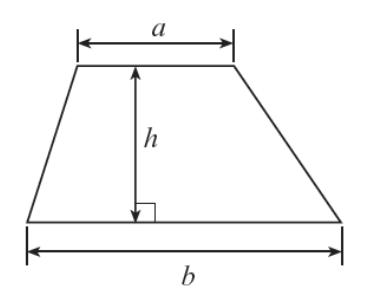

##### Volume of an Object with a Uniform Cross-section (e.g. Prism, Cylinder)

Volume = area of cross section length

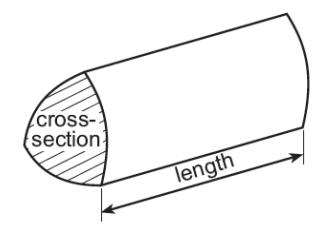

{55}------------------------------------------------

### Formula List – Unit 1 Higher Tier

Area of a trapezium =  $\frac{1}{2}(a+b)h$ 

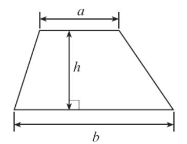

Volume of an Object with a Uniform Cross-section (e.g. Prism, Cylinder)

Volume = area of cross section  $\times$  length

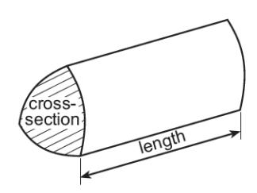

Volume of a sphere =  $\frac{4}{3}\pi r^3$ 

Surface area of a sphere =  $4\pi r^2$ 

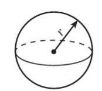

Volume of a cone  $=\frac{1}{3}\pi r^2 h$ 

Curved surface area of a cone =  $\pi rl$ 

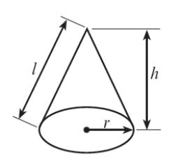

**Annual Equivalent Rate (AER)** 

AER, as a decimal, is calculated using the formula  $\left(1+\frac{i}{n}\right)^n-1$ , where i is the nominal interest rate per annum as a decimal and n is the number of compounding periods per annum.

{56}------------------------------------------------

### Formula List – Unit 3 Foundation Tier

Area of a trapezium = 
$$\frac{1}{2}(a+b)h$$

##### Volume of an Object with a Uniform Cross-section (e.g. Prism, Cylinder)

Volume = area of cross section length

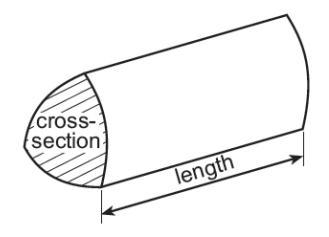

{57}------------------------------------------------

### Formula List - Unit 3 Higher Tier

Area of a trapezium = 
$$\frac{1}{2}(a+b)h$$

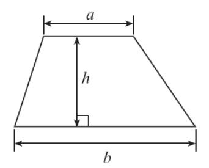

### Volume of an Object with a Uniform Cross-section (e.g. Prism, Cylinder)

Volume = area of cross section  $\times$  length

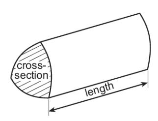

Volume of a sphere = 
$$\frac{4}{3}\pi r^3$$

Surface area of a sphere =  $4\pi r^2$ 

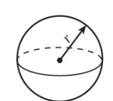

Volume of a cone 
$$=\frac{1}{3}\pi r^2 h$$

Curved surface area of a cone =  $\pi r l$ 

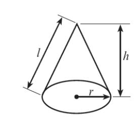

In any triangle ABC,

Sine rule: 
$$\frac{a}{\sin A} = \frac{b}{\sin B} = \frac{c}{\sin C}$$

**Cosine rule**:  $a^2 = b^2 + c^2 - 2bc \cos A$ 

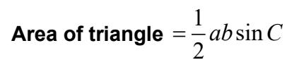

### The Quadratic Equation

The solutions of  $ax^2 + bx + c = 0$  where  $a \ne 0$  are given by  $x = \frac{-b \pm \sqrt{b^2 - 4ac}}{2a}$ 

{58}------------------------------------------------

## 4 MALPRACTICE

Before the course starts, the teacher is responsible for informing candidates of WJEC's regulations concerning malpractice. Candidates must not take part in any unfair practice in the preparation of work for GCSE Mathematics and Numeracy (Double Award)

Information regarding malpractice is available in our [Guide to preventing, reporting and](https://www.wjec.co.uk/media/0pjats1l/guide-to-preventing-reporting-and-investigating-malpractice-april-2022-002.pdf)  [investigating malpractice.](https://www.wjec.co.uk/media/0pjats1l/guide-to-preventing-reporting-and-investigating-malpractice-april-2022-002.pdf)

All cases of suspected or actual malpractice must be reported immediately to WJEC (malpractice@wjec.co.uk). If candidates commit malpractice, they may be penalised or disqualified from the examinations.

In all cases of malpractice, centres are advised to consult the JCQ booklet [Suspected](https://www.jcq.org.uk/exams-office/malpractice)  [Malpractice: Policies and Procedures.](https://www.jcq.org.uk/exams-office/malpractice)

{59}------------------------------------------------

### 5 TECHNICAL INFORMATION

##### 5.1 Entries and awards

This is a unitised qualification. Candidates are entered for each unit separately.

Assessment opportunities will be available in the summer and November assessment period each year, until the end of the life of the specification.

Unit 1 and Unit 2 will be available in the summer 2026 and November 2026 (and each year thereafter). Unit 3 will be available in November 2026 and summer 2027 (and each year thereafter) and the qualification will be awarded for the first time in November 2026.

##### Pre-16 Candidates (i.e. candidates who are 16 or under on 31st August in the academic year in which they were entered)

The terminal rule is set at 30% of the overall qualification for Pre-16 Candidates for GCSE Mathematics and Numeracy (Double Award).

If the assessment being re-taken contributes to the 30% terminal rule requirement, the mark for the new assessment will count regardless of previous results in that assessment.

Candidates may resit an individual unit once only. The better uniform mark score from the two attempts will be used in calculating the final overall grade subject to the terminal rule being satisfied first i.e. that candidates must complete 30% of the assessment for a qualification in the series in which they are cashing in.

If any unit has been attempted twice and a candidate wishes to enter the unit for the third time, the candidate will have to re-enter all units and the appropriate cash-in(s). This is referred to as a 'fresh start'. When re-taking a qualification (fresh start), a candidate may have up to two attempts at each unit. However, no results from examination units taken prior to the fresh start can be used in aggregating the new grade(s).

If a candidate has been entered for but is absent for a unit, the absence does not count as an attempt. The candidate would, however, qualify as a resit candidate in the final resit series.

##### Post-16 Candidates (i.e. candidates who are 16 or over on 1st September in the academic year in which they are entered)

There is no terminal rule that applies to Post-16 Candidates from GCSE Mathematics and Numeracy (Double Award).

There is no limit on the number of times a candidate can resit an individual unit; however, the better uniform mark score from only the two most recent attempts will be used in calculating the final overall grade.

The 'fresh start' rule does not apply to post-16 candidates.

{60}------------------------------------------------

If a candidate has been entered for but is absent for a unit, the absence does not count as an attempt. The candidate would, however, qualify as a resit candidate in the final resit series.

The entry codes appear below:

| Unit                                                 |                                                                | Entry codes    |              |
|------------------------------------------------------|----------------------------------------------------------------|----------------|--------------|
|                                                      |                                                                | English medium | Welsh medium |
| Unit 1 - Higher                                   | Financial Mathematics and Other Applications of Numeracy | 3320UA         | 3320NA       |
| Unit 1 - Foundation                               | Financial Mathematics and Other Applications of Numeracy | 3320U1         | 3320N1       |
| Unit 2 - Higher                                   | Non-calculator                                                 | 3320UB         | 3320NB       |
| Unit 2 - Foundation                               | Non-calculator                                                 | 3320U2         | 3320N2       |
| Unit 3 - Higher                                   | Calculator-allowed                                             | 3320UC         | 3320NC       |
| Unit 3 - Foundation                               | Calculator-allowed                                             | 3320U3         | 3320N3       |
| WJEC GCSE Mathematics and Numeracy (Double Award) |                                                                | 3320QD         | 3320CD       |

The current edition of our Entry Procedures and Coding Information gives up-to-date entry procedures.

##### 5.2 Grading, awarding and reporting

GCSE double award qualifications are reported on an eight grade scale from A\*A\*- GG, where A\*A\* is the highest grade. Results not attaining the minimum standard for the award will be reported as U (unclassified).

##### 5.3 Tiering

There are two tiers of entry for each unit of qualification.

Higher Tier: A\* – D Foundation Tier: C – G

Learners may be entered at different tiers across units.

The raw marks gained in each of the three units will be converted to give a learner a Uniform Marks Scale (UMS) mark for each unit. The maximum UMS available for each assessment will be in line with the grades available for the tier taken in each assessment. These will then be aggregated to give a final UMS mark, providing a learner's overall grade in this qualification.

{61}------------------------------------------------

Individual units are recorded on a uniform mark scale (UMS) with the following grade equivalences:

| Unit       | Max raw marks | Max UMS | A*  | A   | B   | C  | D  | E  | F  | G  |
|------------|------------------|------------|-----|-----|-----|----|----|----|----|----|
| 1 (30%) | 80               | 120        | 108 | 96  | 84  | 72 | 60 | 48 | 36 | 24 |
| 2 (30%) | 80               | 120        | 108 | 96  | 84  | 72 | 60 | 48 | 36 | 24 |
| 3 (40%) | 90               | 160        | 144 | 128 | 112 | 96 | 80 | 64 | 48 | 32 |

For Units 1 and 2, the maximum uniform mark available on the foundation tier of the assessment will be 83 (i.e. 1 uniform mark less than the minimum needed to achieve a grade B on the unit). For Unit 3, the maximum uniform mark available on the foundation tier of the assessment will be 111.

The qualification double grade is awarded on an eight-grade scale A\*A\*-GG. Candidates who do not achieve the minimum uniform marks required to achieve a G will have their achievement recorded as U (unclassified).

The uniform marks obtained for each unit are added up and the qualification double grade is based on this total. The total results reported on UMS will have the following grade equivalences on the eight-grade scale:

| Unit  | Max raw marks | Max UMS | A*A* | AA  | BB  | CC  | DD  | EE  | FF  | GG |
|-------|------------------|------------|------|-----|-----|-----|-----|-----|-----|----|
| Total | 250              | 400        | 360  | 320 | 280 | 240 | 200 | 160 | 120 | 80 |

{62}------------------------------------------------

### Appendix A: Opportunities for embedding elements of the Curriculum for Wales

| Curriculum for Wales Strands                                                                                                                         | Unit 1 | Unit 2 | Unit 3 |
|---------------------------------------------------------------------------------------------------------------------------------------------------------|--------|--------|--------|
| Cross-cutting Themes                                                                                                                                    |        |        |        |
| Local, National and International Contexts                                                                                                           | ✓      | ✓      | ✓      |
| Sustainability aspect of Local, National and International Contexts                                                                                  | ✓      | ✓      | ✓      |
| Relationships and Sexuality Education                                                                                                                |        |        |        |
| Human Rights                                                                                                                                            | ✓      | ✓      | ✓      |
| Diversity                                                                                                                                               | ✓      | ✓      | ✓      |
| Careers and Work-Related Experiences                                                                                                                 | ✓      | ✓      | ✓      |
| Cross-curricular Skills – Literacy                                                                                                                      |        |        |        |
| Listening                                                                                                                                               | ✓      | ✓      | ✓      |
| Reading                                                                                                                                                 | ✓      | ✓      | ✓      |
| Speaking                                                                                                                                                | ✓      | ✓      | ✓      |
| Writing                                                                                                                                                 | ✓      | ✓      | ✓      |
| Curriculum for Wales Strands                                                                                                                         | Unit 1 | Unit 2 | Unit 3 |
| Cross-curricular Skills - Numeracy                                                                                                                      |        |        |        |
| Developing Mathematical Proficiency                                                                                                                  | ✓      | ✓      | ✓      |
| Understanding the number system helps us to represent and compare relationships between numbers and quantities                              | ✓      | ✓      | ✓      |
| Learning about geometry helps us understand shape, space and position and learning about measurement helps us quantify in the real world | ✓      | ✓      | ✓      |
| Learning that statistics represent data and that probability models chance help us make informed inferences and decisions                   | ✓      | ✓      | ✓      |
| Digital Competence                                                                                                                                      |        |        |        |
| Citizenship                                                                                                                                             |        |        |        |
| Interacting and Collaborating                                                                                                                           | ✓      | ✓      | ✓      |
| Producing                                                                                                                                               | ✓      | ✓      | ✓      |
| Data and Computational Thinking                                                                                                                      | ✓      | ✓      | ✓      |
| Integral Skills                                                                                                                                         |        |        |        |
| Creativity and Innovation                                                                                                                               | ✓      | ✓      | ✓      |
| Critical Thinking and Problem Solving                                                                                                                | ✓      | ✓      | ✓      |
| Planning and Organisation                                                                                                                               | ✓      | ✓      | ✓      |
| Personal Effectiveness                                                                                                                                  | ✓      | ✓      | ✓      |

{63}------------------------------------------------

The Guidance for Teaching will include further information on the opportunities provided by the qualification for teachers/centres to integrate these learning experiences into delivery.