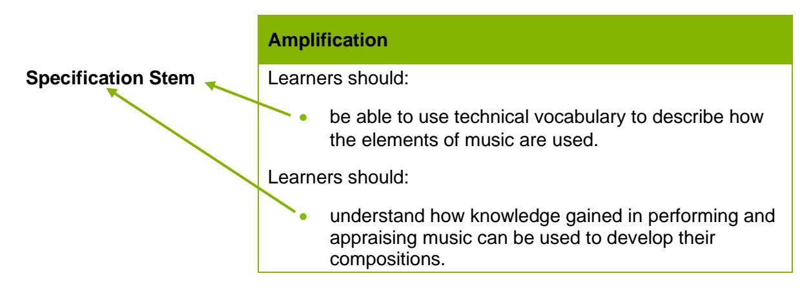
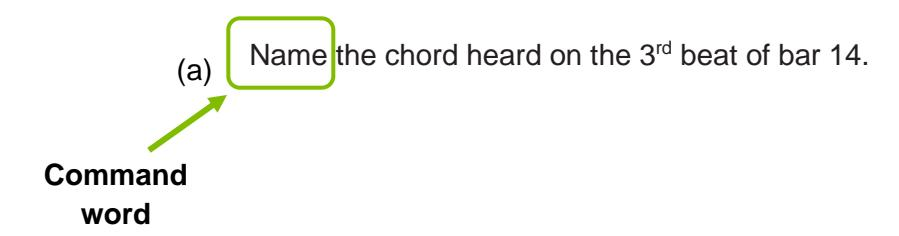

{0}------------------------------------------------

# WJEC GCSE Music

Approved by Qualifications Wales

# Delivery Guide

Ready for the world. This Qualifications Wales regulated qualification is not available to centres in England.

Made for Wales.

{1}------------------------------------------------

{2}------------------------------------------------

# Contents

| Aims of the Delivery Guide                    |    |
|-----------------------------------------------|----|
| Qualification Structure                       | 1  |
| Unit 1                                        | 1  |
| Unit 2                                        | 2  |
| Unit 3                                        | 2  |
| Summary of assessment                         | 3  |
| Assessment Objectives                         | 4  |
| Unit 1                                        | 4  |
| Unit 2                                        | 4  |
| Unit 3                                        | 4  |
| Specification and Assessment Pack             | 5  |
| Understanding the specification amplification | 5  |
| Specification Stems                           | 5  |
| Command words                                 | 6  |
| Important Dates                               | 11 |

{3}------------------------------------------------

# Aims of the Delivery Guide

The aim of the Delivery Guide is to give an overview of the qualification and to help teachers understand how we assess the GCSE. It will offer an introduction to the specification, an assessment overview, and will support teachers in better understanding how to prepare their learners for the assessment of the different units in each qualification. More information on each unit can be found in the separate unit guides.

# Qualification Structure

#### WJEC GCSE Music consists of three units:

|        | Unit title | Type of Assessment         | Weighting |
|--------|------------|----------------------------|-----------|
| Unit 1 | Performing | Non-examination assessment | 32.5%     |
| Unit 2 | Composing  | Non-examination assessment | 32.5%     |
| Unit 3 | Appraising | Digital only examination   | 35%       |

All units are compulsory.

#### Unit 1

The purpose of this unit is to:

- allow learners to explore a range of performing repertoire and select pieces they wish to perform
- allow learners to develop their technical and performing skills by reflecting on their work in an ongoing cycle of practice and improvement
- provide opportunities for learners to perform individually and/or as part of an ensemble and develop the skills required to become proficient
- develop learners' resilience, determination and confidence.

#### This unit will focus on:

- **exploring** learners will have the opportunity to explore and perform a range of repertoire, from various genres and periods and linked to different cultures in Wales and the world. This could include performing using any instrument, voice, or technology, as a soloist or as part of an ensemble
- **responding and reflecting** learners will have the opportunity to reflect on their own work and respond to the feedback from others to focus their practice, allowing them to improve in the performances they give, with increased technical ability and communication
- **creating** learners will have the opportunity to include improvisation in their performances, and with practice, to become more proficient and confident in this skill. In experiencing the process of creating their final performances, they will also be able to interpret repertoire in a way which is appropriate to their own ability and personal style choices.

{4}------------------------------------------------

For this assessment, learners are required to perform:

- a minimum of **two** pieces of music giving a total performance time of 4-6 mins (each piece should be a minimum of 1 minute)
- solos or independent parts within ensembles, or a combination of both, in their chosen style(s) of music, without a conductor.

#### Unit 2

#### The purpose of this unit is to:

- develop an awareness of the process of creating original music
- develop learners' skills in self-evaluation, refinement and development of their own work
- develop a sense of writing music for a specific purpose
- allow learners to explore creating music in a variety of different genres and styles, from different periods.

#### The unit will focus on:

- **exploring** learners will have the opportunity to explore various styles and genres of music linked to different cultures in Wales and the world, and understand how they have been created to produce the intended effect. They will be able to use these methods to create and develop their own ideas. They will also be able to compose through exploring ideas in improvisation
- **responding and reflecting** learners will be able to evaluate and refine their work through reflection and feedback from others to create a successful finished product
- **creating** learners will create their own original music in a style of their choosing, and a piece to meet a brief specified by WJEC using the techniques they have explored and reflected upon.

#### For this assessment learners are required to:

- compose **two** original pieces of music with a recommended total duration of between 3-6 mins, **one** in response to their own devised brief and **one** in response to a brief set by WJEC
- present a reflective log based on the compositional process of **either** the composition in response to their own devised brief, **or** the composition based on the brief set by WJEC.

# Unit 3

#### The purpose of this unit is to:

- allow learners to experience a range of music from contrasting styles/genres and periods/contexts, including music created in or inspired by Wales and written by a diverse range of composers including those from Black, Asian and minority ethnic backgrounds
- allow learners to develop transferable listening skills based on an appreciation of the elements of music and how they are used
- develop the language of describing and analysing music
- demonstrate aural skills in relation to familiar and unfamiliar music
- allow learners to develop as creative musicians through understanding the music of others.

{5}------------------------------------------------

#### The unit will focus on:

- **exploring** learners will have the opportunity to experience listening to a wide range of music to understand how the composers and performers create the intended effect, tell a story or convey emotions including through the use of music technology
- **responding and reflecting** learners will be able to identify links between different pieces of music in terms of the use of the elements of music and respond to the effectiveness of these in contrasting styles or genres.

# Summary of assessment

#### **Unit 1: Performing**

#### **Non-examination assessment**

Performance: 4-6 mins (at least two pieces) **Marked by the centre and moderated by WJEC**

#### **32.5% of qualification 78 marks**

#### **Summary of assessment**

Learners perform a minimum of **two** pieces of music giving a total performance time of 4-6 mins (each piece should be a minimum of 1 minute).

Learners can choose to perform solos or independent parts within ensembles, or a combination of both, in their chosen style(s) of music, without a conductor.

Learners can choose to perform on any instrument or voice, or technology, or a combination of these.

#### **Unit 2: Composing**

#### **Non-examination assessment**

2 compositions (3-6 mins total recommended)

Reflective Log

**Marked by the centre and moderated by WJEC**

#### **32.5% of qualification 78 marks**

#### **Summary of assessment**

Learners compose **two** original pieces of music with a recommended total duration of between 3-6 mins, **one** in response to their own devised brief and **one** in response to a brief set by WJEC. Learners present a reflective log based on the compositional process of **either** the composition in response to their own devised brief **or** the composition based on the brief set by WJEC.

#### **Unit 3: Appraising**

Digital only examination: 1 hour 30 minutes approx.

**Marked by WJEC**

#### **35% of the qualification 84 marks**

#### **Summary of assessment**

Questions requiring objective responses, short and extended answers, in response to the chosen set works and unseen extracts.

{6}------------------------------------------------

# Assessment Objectives

Below are the assessment objectives for this specification. Learners must:

#### **AO1**

Demonstrate and apply knowledge and understanding of a range of music

#### **AO2**

Develop and apply performance and/or realisation skills

#### **AO3**

Reflect on, analyse and evaluate their own work and the work of others

#### **AO4**

Create and develop ideas to communicate meaning in compositions

#### Unit 1

The distribution of the assessment objectives for this unit is:

| AO1 | AO2   | AO3 | AO4 | Total |
|-----|-------|-----|-----|-------|
| -   | 32.5% | -   | -   | 32.5% |

#### Unit 2

The distribution of the assessment objectives for this unit is:

| AO1 | AO2 | AO3  | AO4 | Total |
|-----|-----|------|-----|-------|
| -   | -   | 2.5% | 30% | 32.5% |

#### Unit 3

The distribution of the assessment objectives for this unit is:

| AO1 | AO2 | AO3 | AO4 | Total |
|-----|-----|-----|-----|-------|
| 20% | -   | 15% | -   | 35%   |

{7}------------------------------------------------

# Specification and Assessment Pack

When we develop new qualifications, we produce the following documents:

- Specification this covers all the information and skills that learners are expected to know by the end of their course.
- Assessment Pack this contains the Sample Assessment Materials (SAMs) i.e.: sample exam papers and sample NEA tasks, relevant controls for the NEA and, mark schemes.

This guide builds upon the information in the specification and assessment pack to help further your understanding of said documents.

# Understanding the specification amplification

Learners should be made aware of:

- the specification stems
- what the specification stems mean.

### Specification Stems

When you look through the specification you will notice in the amplification column, we use a variety of wording before the list of content learners need to know; we call this a stem:

Each stem is used for a slightly different reason:

| Specification Stem             | When it is used                                                                                                                                                                                                                                         |
|--------------------------------|---------------------------------------------------------------------------------------------------------------------------------------------------------------------------------------------------------------------------------------------------------|
| Learners should know | When learners are required to use direct recall. |
| Learners should be aware of | When learners do not need to understand all aspects of the specified content in detail. |
| Learners should understand | When learners are required to demonstrate greater depth than straight identification or recall, for example they can apply knowledge to familiar or unfamiliar contexts and can synthesise and evaluate information for a given purpose. |
| Learners should be able to | When learners need to apply their knowledge and understanding to a practical situation or demonstrate application of practical skills and techniques. |
| Learners are required to | When learners need to show the requirements of individual units. |

{8}------------------------------------------------

#### Command words

Learners should be made aware of:

- what command words are
- what each command word means
- what each command word assesses.

Command words are the words and phrases used in assessments that tell learners how they should answer the question or complete the task. Command words direct the learner through the question or task and indicate the nature of the response required.

The following tables are not exhaustive, but will give you a good idea of the command words we typically use:

| Command words for direct recall |                                |  |  |
|---------------------------------|--------------------------------|--|--|
| Command Word                    | Requirements of response       |  |  |
| Give                            | Produce an answer from recall. |  |  |
| Name                            | Identify or make a list.       |  |  |
| State                           | Express in clear terms.        |  |  |

| Command words for reflection, analysis and evaluation:                                                                                                                                                                        |                                                                                             |  |  |  |
|-------------------------------------------------------------------------------------------------------------------------------------------------------------------------------------------------------------------------------|---------------------------------------------------------------------------------------------|--|--|--|
| Command Word                                                                                                                                                                                                                  | Requirements of response                                                                    |  |  |  |
| Complete | Complete notation of pitch or rhythm in the treble or bass clef as a dictation exercise. |  |  |  |
| Identify distinctive features and give descriptive, factual detail. This is one of the most widely used command words. If an Describe explanation is required then use two command words: 'describe and explain'. |  |  |  |  |
| Explain | Give reasons or causes. Show an understanding of how or why something has occurred. |  |  |  |
| Select                                                                                                                                                                                                                        | Make an appropriate choice from a range of options.                                         |  |  |  |

{9}------------------------------------------------

#### Mark Schemes

Mark schemes and/or assessment criteria test the intended learning outcomes for a component. They describe the knowledge and skills (and possibly attitude) that a candidate is expected to demonstrate in their responses and they are then used in marking the work.

#### **Objective based mark scheme:**

For very short answer questions requiring one correct response.

| Question |  | Answer | AO1 | AO3 | Total Mark |
|----------|-----|------------------------------------------------------------|-----|-----|---------------|
| 1 | (a) | Select the section of Palladio heard in the extract. |  |  |  |
|  |  | Award one mark for: | 1 |  | 1 |
|  |  | <ul><li>Section A</li></ul> |  |  |  |

#### **Points based mark scheme**

For short answer questions with a range of possible responses

| Question |  | Answer | AO1 | AO3 | Total Mark |
|----------|-----|--------------------------------------------------------------------------------------------------------------------------------------------------------------------------------------------------------------------------------------------------------------------------------------------------------------------------------------------------------------------------------------------------------------------------------------------------------------------------------------------------------------------------------------------------------------------------------------------------------------------------------------------------------------------------------------------------------------------------------------------------------------------------------------------------------------------------------------------------------------------------------------------------------------------------------------------------------|-----|-----|---------------|
| 2 | (f) | Describe four ways in which the accompaniment and instrumentation help create a feeling of despair in the extract. Give line numbers in your answer. |  |  |  |
|  |  | Award one mark each, up to a maximum of 4 marks, for each of the following points: <ul><li>sparse orchestration (harp only) at the start</li><li>use of repetition</li><li>piano enters with single note bass line when voice begins</li><li>piano is quite low in range (bass clef) and builds (to use previous simple ostinato pattern used in introduction)</li><li>piano accompaniment gradually rises to mid range (treble clef) with harp added with sustained notes</li><li>builds gradually with bass and drum entry</li><li>solo cello counter melody accompaniment added</li><li>accompaniment gradually increases in pitch range before suddenly less texture in line 10</li><li>builds back texture through line 13</li><li>Line 13 strings added and accompaniment pattern chords are fuller</li><li>violin counter melody added above sustained vocal note on Burn. Credit any other valid response.</li></ul> | 4 |  | 4 |

{10}------------------------------------------------

#### **Banded based mark schemes**

| Solo Performances | AO2 Develop and apply performance and/or realisation skills |  |  |  |  |  |
|----------------------|--------------------------------------------------------------------------------------------------------------------------------------------------------------------------------------------------------------------------------------------------------------------------------------------------------------------------------------------------|-------------------------------------------------------------------------------------------------------------------------------------------------------------------------------------------------------------------------------------------------------------------------------------------------------------------|-------------------------------------------------------------------------------------------------------------------------------------------------------------------------------------------------------------------------------------------------------------------------------------------------------------------------------------------------------------------------------------------------------------------------------------------------------|--|--|--|
| Band                 | Accuracy                                                                                                                                                                                                                                                                                                                                         | Technical control                                                                                                                                                                                                                                                                                                 |                                                                                                                                                                                                                                                                                                                                                                                                                                                       |  |  |  |
| 5 | 12-13 marks <ul><li>An accurate performance, secure in terms of rhythm and/or pitch</li><li>An appropriate tempo is sustained throughout, resulting in a fluent performance</li><li>Performance directions are followed accurately throughout the piece.</li></ul> | 12-13 marks <ul><li>Instrumental / vocal technique is secure, completely fulfilling the demands of the music throughout</li><li>Intonation (where appropriate) is secure throughout the piece</li><li>Control of timbre, tone, and tone colours is secure, and appropriate to the music.</li></ul> | 12-13 marks <ul><li>An expressive performance in keeping with the chosen style, demonstrating a secure understanding of how music is successfully shaped, communicated, and phrased, using the elements of music</li><li>Effective communication between soloist and accompaniment, where included, and audience sustains rapport throughout the piece</li><li>The music is well-projected.</li></ul> |  |  |  |
| 4 | 9-11 marks <ul><li>A mostly accurate performance in terms of rhythm and/or pitch, but there are occasional slips</li><li>An appropriate tempo is mostly maintained throughout, however, there are occasional errors which could impact fluency</li><li>Most performance directions are followed appropriately in the piece.</li></ul> | 9-11 marks <ul><li>Instrumental / vocal technique is mostly secure in meeting the demands of the music throughout</li><li>Intonation (where appropriate) is mostly secure throughout the piece</li><li>Control of timbre, tone, and tone colours is mostly secure and appropriate to the music.</li></ul> | 9-11 marks <ul><li>A mostly expressive performance in keeping with the chosen style, demonstrating a generally secure understanding of how music is successfully shaped, communicated, and phrased, using the elements of music</li><li>Mostly effective communication between soloist and accompaniment, where included, that sustains the rapport with the audience</li><li>The music is mostly well-projected.</li></ul> |  |  |  |

{11}------------------------------------------------

| 3 | 6-8 marks <ul><li>An unsteady performance with a number of errors in rhythm and/or pitch</li><li>An attempt at performing with an appropriate tempo is evident, but the results are unstable and errors impact fluency. The performance may break down but is successfully re-started</li><li>Performance directions are inconsistently applied during the piece.</li></ul> | 6-8 marks <ul><li>Instrumental / vocal technique is unsteady at times in meeting the demands of the music</li><li>Intonation (where appropriate) is unsteady at times during the piece</li><li>Control of timbre, tone, and tone colours appropriate to the music is unsteady at times.</li></ul> | 6-8 marks <ul><li>An unsteady performance that is sometimes in keeping with the chosen style and demonstrates some understanding of how music is successfully shaped, communicated, and phrased, using the elements of music</li><li>Communication and rapport with the accompanist, where included and audience are not consistent</li><li>The music is generally projected.</li></ul> |
|---|----------------------------------------------------------------------------------------------------------------------------------------------------------------------------------------------------------------------------------------------------------------------------------------------------------------------------------------------------------------------------------------------|---------------------------------------------------------------------------------------------------------------------------------------------------------------------------------------------------------------------------------------------------------------------------------------------------------|----------------------------------------------------------------------------------------------------------------------------------------------------------------------------------------------------------------------------------------------------------------------------------------------------------------------------------------------------------------------------------------------------------|
| 2 | 3-5 marks <ul><li>An insecure performance in terms of rhythm and/or pitch with frequent inaccuracies impacting the performance</li><li>Irregularities in tempo, which compromise fluency, occur frequently and clearly impact the flow. The performance may break down but is re-started</li><li>Performance directions are generally not followed.</li></ul> | 3-5 marks <ul><li>Instrumental / vocal technique is frequently insecure in meeting the demands of the music.</li><li>Intonation (where appropriate) is insecure throughout the performance</li><li>Control of timbre, tone, and tone colours appropriate to the music is insecure.</li></ul> | 3-5 marks <ul><li>A performance that is erratic in terms of the chosen style, demonstrating a limited understanding of how music can be shaped, communicated, and phrased, using the elements of music</li><li>Communication and rapport with the audience are limited</li><li>The projection of the performance is erratic.</li></ul> |

{12}------------------------------------------------

| 1 | 1-2 marks <ul><li>Inaccuracies in rhythm and/or pitch occur throughout, resulting in a weak and limited realisation of the intended outcome</li><li>The performance lacks fluency and is compromised by frequent hesitations or breakdowns.</li><li>An inadequate response to performance directions throughout the piece.</li></ul> | 1-2 marks <ul><li>Instrumental / vocal technique is limited</li><li>Intonation (where appropriate) is weak</li><li>Control of timbre tone, and tone colours appropriate to the music is very limited.</li></ul> | 1-2 marks <ul><li>A performance that is precarious in terms of the chosen style and demonstrates very little understanding of how music can be shaped, communicated, and phrased, using the elements of music</li><li>Communication is negligible, preventing an audience engaging in the performance</li><li>The performance has very little sense of projection.</li></ul> |
|---|-------------------------------------------------------------------------------------------------------------------------------------------------------------------------------------------------------------------------------------------------------------------------------------------------------------------------------------------------|-----------------------------------------------------------------------------------------------------------------------------------------------------------------------------------------------------------------------------------|-----------------------------------------------------------------------------------------------------------------------------------------------------------------------------------------------------------------------------------------------------------------------------------------------------------------------------------------------------------------------------------------------|
| 0 | 0 marks <ul><li>There is no evidence of accurate rhythm / pitch</li><li>There is no evidence of accurate tempo and fluency</li><li>There is no evidence of accurate response to any performance directions.</li></ul> | 0 marks <ul><li>There is no evidence of instrumental / vocal technique</li><li>There is no evidence of accurate intonation (where appropriate)</li><li>There is no evidence of control of timbre, tone, or tone colours.</li></ul> | 0 marks <ul><li>There is no evidence of expression or shaping performance using the elements of music</li><li>There is no evidence of communication with an audience</li><li>There is no evidence of projection.</li></ul> |

{13}------------------------------------------------

# Important Dates

| First Teaching of WJEC GCSE Music | September 2025    |  |
|-----------------------------------|-------------------|--|
| First release of Unit 2           | September 2025    |  |
| First assessment for Unit 3       | Summer 2027       |  |
| First submission of Unit 1        | May (Summer) 2027 |  |
| First submission of Unit 2        | May (Summer) 2027 |  |
| First Certification               | Summer 2027       |  |