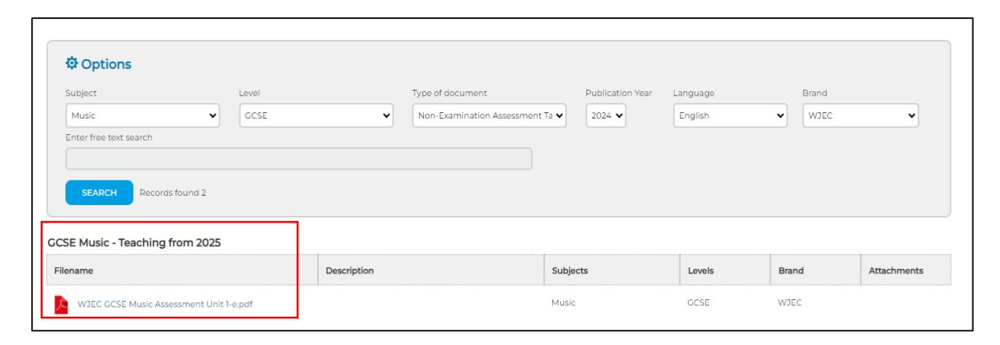

{0}------------------------------------------------

# WJEC GCSE MUSIC

# FREQUENTLY ASKED QUESTIONS

{1}------------------------------------------------

# General Specification Questions

#### **Q: Will there be teaching guidance available for the new specification?**

A: A Guidance for Teaching (GfT) document and Sample Assessment Materials (SAMs) will be available on the new qualification webpage. The GfT will be available from 31st January 2025 and the SAMs were available from the 19th December 2024.

### **Q: How does this specification align with the Curriculum for Wales principles and strands?**

A: This specification has been designed to align with the Curriculum for Wales framework, and supports the statements of what matters, principles of progression, and specific considerations for Music. It provides opportunities to embed cross-curricular themes, skills, and learning experiences outlined in the Curriculum. For detailed mapping, refer to Appendix A in the specification.

# **Q: How is the course structured in terms of assessment?**

A: The course is a linear qualification with two practical non-examination assessments, Unit 1 (32.5%) and Unit 2 (32.5%) and an on-screen examination unit, Unit 3 (30%).

# **Q: What are, and how are the assessment objectives weighted?**

A:

AO1 (20%) Demonstrate and apply knowledge and understanding of a range of music AO2 (32.5%) Develop and apply performance and/or realisation skills AO3 (17.5%) Reflect on, analyse and evaluate their own work and the work of others AO4 (30%) Create and develop ideas to communicate meaning in compositions

# **Q: Can candidates resit units if they wish to improve their grade?**

A: Learners who resit the examination unit can carry forward the marks they received for non-examination assessment units from the first time they attempted the qualification. Marks for non-examination assessment (NEA) may be carried forward for the life of the specification. If a candidate resits an NEA unit (rather than carrying forward the previous NEA mark), it is the new mark that will count towards the overall grade, even if it is lower than a previous attempt (unless the mark is absent). Assessment opportunities for Unit 3 will be available in the summer series until the end of the life of this specification.

# **Q: When will the examinations for each unit be available?**

A: Unit 3 examinations will be available annually starting summer 2027, which is when the full GCSE qualification will first be awarded.

#### **Q: What is the grading scale and awarding process?**

A: This course uses the traditional 8-point A\*-G scale. Awarding follows WJEC's standard processes aligning with regulatory requirements.

#### **Q: What is the recommended guided learning time for this course?**

A: The specification recommends 120-140 guided learning hours, primarily designed as a 2 year program for learners in Years 10 and 11.

### **Q: Will there be SAMs to help deliver the specification?**

A: The SAMs for Unit 1 can be accessed via the Portal, please see the image below for guidance on how to adjust the filters. The SAMs for Units 2 and 3 are available from the 19th December 2024, on the [WJEC GCSE Music website.](https://www.wjec.co.uk/qualifications/gcse-music-teaching-from-2025/#tab_keydocuments)

{2}------------------------------------------------

#### **Q: What information is included in the Assessment Packs?**

A: Sample exam questions, details of NEA tasks, mark schemes for all tasks, explanation of timings and expectations for controlled conditions, advice on the planning process, expectations for marking and moderation, assessment objectives and their breakdown across different tasks.

# **Q: Is there an optimal teaching order for these units?**

A: Candidates may record their Unit 1 performances at any time during the course, and they may work on their Unit 2 Compositions from the start of the first year (usually Year 10) when the briefs are released. Once completed, all NEA must be stored securely and submitted in May of the summer series when the candidates sit the Unit 3 exam.

# **Q: Is there a list of specific terminology learners must know?**

A: There is a list of terminology in Appendix B of the specification designed to aid teachers in preparing learners for Unit 1, 2 and 3.

## **Q: Are learners required to know and understand all of the terms listed in Appendix B of the specification?**

A: Learners are required to know and understand all of the terms listed in Appendix B. Additionally, they should also know and understand any additional terms which relate specifically to their chosen set works. These additional terms will only be used within the Unit 3 Appraising examination in questions relating to the relevant set work.

# Unit 1: Performing Questions

# **Q: Will I need to submit programme notes for Unit 1?**

A: There is no requirement to produce a programme note for Unit 1.

#### **Q: How do I upload candidate work for Unit 1?**

A: Internally assessed NEA candidate work will be uploaded through IAMIS. For more information please visit: [e-Submission | WJEC](https://www.wjec.co.uk/home/administration/e-submission-upload/#tab_0)

#### **Q: Is there a penalty for learners who perform under or over the required time?**

A: There are penalties for learners who perform under the required time; please see pages 31-36 of the Assessment Pack for a full explanation of how to apply timing penalties. There is no penalty for exceeding the time limit, however it is important to note that there is more opportunity for mistakes.

{3}------------------------------------------------

#### **Q: Can repeats be added to ensure a candidate meets the minimum required time?**

A: Repeats can be added, but they must make musical sense and be marked clearly on the score before the performance.

# **Q: Can a candidate perform sections of a piece, or can cuts be made?**

A: Candidates can perform sections of a piece or make cuts if these make musical sense.

# **Q: I have a candidate that improvises or is performing from a tradition which does not notate music. How do I provide a score?**

A: In this instance, you should create a lead sheet which shows the details (including performance directions) of what will be performed – this should be enough for you and a moderator to be able to judge the accuracy. In the case of improvisation, please provide the details of the stimulus (a stimulus may be a chord sequence, a scale etc) and the expected structure and for accuracy you are assessing whether the improvisation is "accurate to the style." The level of difficulty will depend on the content of the improvisation performed.

### **Q: Is there a minimum grade learners should be working at?**

A: The standard of pieces selected for performance should be broadly equivalent to Grade 3 of the graded music examinations. If learners choose to perform a piece not listed for graded music examinations, teachers must refer to pages 23-30 of the Assessment Pack (found on the Portal) for guidance on Levels of Difficulty. Please contact the music team on [music@wjec.co.uk](mailto:music@wjec.co.uk) if a learner wishes to offer a performance not covered by the tables.

# **Q: I have a candidate that deliberately plays/sings differently from what is on the score. Should I take off marks for accuracy?**

A: In this instance, please mark on the score where anything has been changed. Either correct the notation or over a bar or write details of the change e.g. "melodic variation here." You can also add or change dynamics, add, or remove repeats, cut sections etc.

# **Q: Is there a minimum or maximum number of pieces learners must submit?**

A: Leaners must submit a minimum of two performances and a maximum of 4 performances.

#### **Q: Where can I find the Performing declaration form, marksheets and GDPR form?**

A: The relevant paperwork for Unit 1 can be found in Appendices A-C of the Assessment Pack.

# **Q: Can a performance be recorded outside the centre?**

A: Yes, long as the teacher who will be assessing the work is present.

# **Q: Can I submit a reference recording instead of a score?**

A: Unfortunately, a reference recording is not acceptable. If your candidate has learnt a piece by ear, please create a score or lead sheet. TAB is also acceptable.

# Unit 2: Composing Questions

#### **Q: How do I upload candidate work for Unit 2?**

A: Externally assessed NEA candidate work will be uploaded through IAMIS. For more information please visit: [e-Submission | WJEC.](https://www.wjec.co.uk/home/administration/e-submission-upload/#tab_0)

### **Q: Where can I find the Composition brief?**

A: The Composition briefs are released on Portal on the 1 st of September every year. It will be released under the title of 'Non-Examination Task' in the form of a downloadable PDF.

{4}------------------------------------------------

#### **Q: Is there a word limit for the Reflective Log?**

A: There are no restrictions on how the Reflective Log is to be submitted; meaning there is no word count and there are also no restrictions regarding the format in which the log is to be submitted. Formatting options include, but are not limited to written prose, PowerPoint presentation, vlog, blog, scrapbook etc.

#### **Q: Is the Reflective Log assessed?**

A: The Reflective Log is assessed out of 6 and is 2.5% of candidate's final grade.

### **Q: Is there a set amount of time candidates must spend on their Compositions and Reflective Log?**

A: There is no restriction on the amount of time candidates spend on their compositions and reflective log. Candidate's work must be submitted to WJEC within the final year of the course.

# **Q: How much involvement should teachers have throughout the process?**

A: Teachers must see each composition in progress at least three times at different stages during the compositional process to be able to authenticate the work. Teachers must also see one draft of the reflective log but must not provide any written feedback before the final submission. Feedback must be limited to general advice and teachers must not provide specific guidance on how to improve the work. Teachers must sign the authentication form to authenticate the reflective log as the candidate's own work.

### **Q: Do candidates have to perform their own compositions?**

A: In unit 2, candidates are not being marked on performance skills and therefore do not have to perform their own compositions. Please remember that the performer(s) must not edit or change the candidate's pieces.

#### **Q: Does each candidate have to produce a score for their compositions?**

A: Both compositions must have an appropriate form of notation; this can include staff notation, lead sheet, graphic notation or written commentary.

#### **Q: Can compositions contain loops and samples?**

A: Compositions can contain loops and samples, but the candidate cannot gain credit for these if they are not their own work, and details must be provided in the reflective log.

# **Q: Do candidates have to write their own lyrics?**

A: There are no marks awarded for lyrics; therefore, it is acceptable to use lyrics from another song, or a poem. Be careful that candidates must compose original melodic/rhythmic material for the lyrics. For example, if your candidate is using lyrics from a well-known song, it is important to be mindful that they are not composing in a similar rhythmic or melodic pattern as the original song.

#### **Q: Can a candidate write for solo drumkit, or solo melody instrument?**

A: It is permitted; however, it may be more difficult to access the higher marks as the range of musical elements being used is limited.

#### **Q: Can candidates write variations on an existing theme?**

A: It is permitted, however there can be no credit awarded for the theme, and often the harmony remains unchanged in the variations, and the melody is only marginally altered, so this can be very limiting.

{5}------------------------------------------------

# Unit 3: Appraising Questions

## **Q: What are the set works?**

A: Centres will select two set works:

- one set work from List A
- one set work from List B.

#### List A

- Concerto for Two Trumpets in C (first movement), Antonio Vivaldi
- Palladio (allegretto) for string orchestra, Karl Jenkins
- Elizabeth Remembered, Debbie Wiseman

# List B

- Hwyl Ti Gymru, Fleur De Lys
- Tale of Two Dragons, Calan
- One Day Like This, Elbow
- Burn (Hamilton), Lin-Manuel Miranda
- I Don't Wanna Know, Mared
- Sir Duke, Stevie Wonder

# **Q: Will scores be made available for the set works?**

A: The full scores for each set work will be on Portal. There will also be a Blended Learning module for each of the examined set works, accompanied by two Knowledge Organisers, a lead sheet and a class performance pack. More information can be found here: [FREE](https://www.wjec.co.uk/home/qualifications-in-development/made-for-wales-wjec-is-ready-to-deliver/free-adaptable-resources/#tab_0)  [adaptable resources to support our Made-for-Wales qualifications.](https://www.wjec.co.uk/home/qualifications-in-development/made-for-wales-wjec-is-ready-to-deliver/free-adaptable-resources/#tab_0)

# **Q: How much detail will be needed for the social, cultural and historical background of the set works in Unit 3?**

A: There will be resources published which will outline what Learners need to know, in the same way that we have for the set works on the current specification.

# **Q: What range of musical styles are pupils expected to know when approaching Unit 3?**

A: In Appendix B of the new specification there is a list of terms Learners should know, including Musical Styles. Learners are required to identify these. However, Learners will not need to write a long form explanation as to why a particular extract is, for example, a Hymn, or baroque, etc. Teachers may wish to include other styles in their teaching, as the focus is on the Elements of Music, and harmony, for example, can be described using the same terms in any style of music. For more information, please see Appendix B.

# **Q: Whilst the focus is on the elements of music, will learners need to know any stylistic content of Western Classical Music?**

A: Learners will need to be able to place pieces in context. The specification states that they should be able to: identify and describe how musical devices are used in a variety of extracts showing an understanding of the conventions of genre, period, style and context as appropriate. (Unit 3, Content 1.3.1)

### **Q: If there is free choice, could learners get caught out if an exam paper were to ask the background of a style that we haven't chosen to teach?**

A: Learners are required to have knowledge and understanding of the terms covered in Appendix B of the specification. Learners will not be asked questions in an exam paper on anything not detailed within Appendix B.

#### **Q: I have a candidate who requires extra time, how should I apply this?**

A: For guidance on how to apply extra time, please visit this [help sheet.](https://www.wjec.co.uk/media/ctnluwdc/wjec-gcse-applying-extra-time-in-music-examinations.pdf)