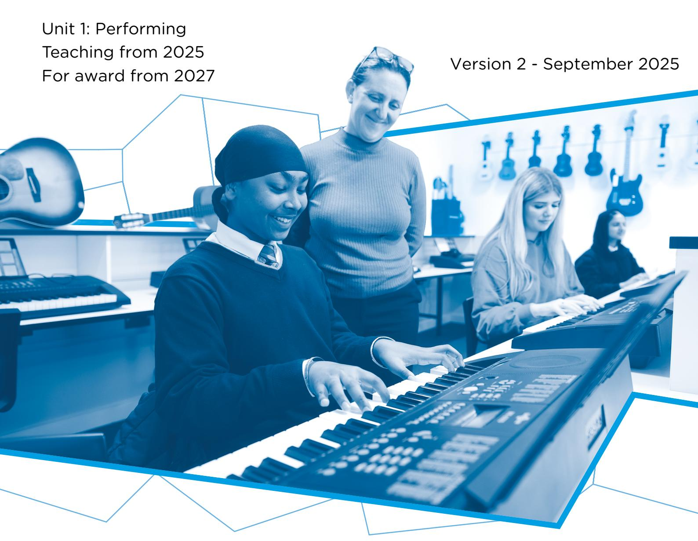

{1}------------------------------------------------

# WJEC GCSE Music

Approved by Qualifications Wales

## Non-Examination Assessment Pack

{2}------------------------------------------------

{3}------------------------------------------------

## SUMMARY OF AMENDMENTS

| Version | Description                                                                                                                                                               | Page number     |
|---------|---------------------------------------------------------------------------------------------------------------------------------------------------------------------------|-----------------|
| 2       | To clarify that this document is a sample and not to be used with live assessment: • A watermark has been added • The further information section has been updated. | Throughout 3 |

{4}------------------------------------------------

## Contents

| About this pack: information for teachers                  | 1  |
|------------------------------------------------------------|----|
| Task                                                       | 2  |
| Further Information                                        | 3  |
| Assessment (and calculating the final mark)                | 4  |
| Assessment Grid – Solo Performances                        | 9  |
| Assessment Grid – Ensemble Performances                    | 12 |
| Assessment Grid – Music Technology                         | 16 |
| Table of adjustments for level of difficulty of pieces     | 20 |
| Calculating the final mark for performances                | 31 |
| Mapping of tasks to unit content and assessment objectives | 37 |
| Candidate Assessment Pack                                  | 38 |

### **Copyright**

© WJEC CBAC Limited 2024.

{5}------------------------------------------------

## About this pack: information for teachers

This pack contains the assessment materials for Unit 1: Performing.

Within this pack, you will find:

- information for teachers on how to manage arrangements for assessment
- a mark record sheet
- a **candidate pack** which includes:
  - details of the assignment
  - a detailed breakdown of each task
  - information for candidates, which tells candidates about things that they must and must not do when they are completing the assessment
  - the mark scheme which must be used to assess candidate work
  - a Candidate Declaration Form.

**You must provide each candidate with a copy of the complete candidate assessment pack.**

{6}------------------------------------------------

## Task

### Learners are required to:

• perform a minimum of **two** pieces of music giving a total performance time of 4-6 mins (each piece should be a minimum of 1 minute).

#### Learners can:

- choose to perform solos **or** independent parts within ensembles, or a combination of both, in their chosen style(s) of music, without a conductor
- choose to perform on any instrument or voice, or use technology, or a combination of these
- choose to accompany themselves
- use a stimulus for improvisation
- use pre-recorded backing tracks, provided that they do not include the learner's part. Audible click tracks should be avoided
- submit up to 4 pieces to meet the time requirement
- add repeats to a performance if they are not marked, but these should make musical sense
- perform sections of a piece or make cuts if these make musical sense.

## Supervision

• No formal supervision.

## Monitoring

- There is no restriction on the amount of time learners spend on this unit.
- Teachers may provide guidance and support to learners to ensure that they have a clear understanding of the requirements and the assessment grid.

{7}------------------------------------------------

## Further Information

#### **Standard of Pieces**

The standard of pieces selected for performance should be broadly equivalent to **Grade 3** of the graded music examinations. Pages 23-30 of this assessment pack contains descriptions of the levels of difficulty for the range of performances accepted in this qualification. This guidance must be followed when playing pieces **not** listed for graded music examinations. Centres should contact WJEC for advice if they are unable to make a judgement or if a learner wishes to offer a performance not covered by the tables.

#### **Improvisation**

Learners may choose to perform an improvisation to a **stimulus** of their own choice for a solo performance or as part of an ensemble. This may be prepared in advance of the practical assessment or improvised in performance (a stimulus may be a chord sequence, a scale etc.). **A copy of the musical stimulus must be provided for the assessor along with a lead sheet outlining the structure of the intended performance and any performance directions.** The level of difficulty will depend on the content of the improvisation performed.

#### **Performing and Recording**

Learners may perform at any time during the GCSE course. However, centres should ensure that assessment is completed only when learners have undertaken the necessary teaching and learning and developed the required skills and knowledge. Learners do not have to perform all pieces on the same day.

The assessor **must** be present for the recording of all performances, so that the work can be authenticated and is therefore deemed to be an audience member for each performance. Each piece may be performed on different occasions during the GCSE course or, alternatively, they may all be performed on one occasion.

Each piece **must** be recorded separately in **one unedited attempt**. It is not permissible to perform different sections of the same piece on different days. Second or subsequent attempts are permitted, but the learner must perform the whole piece again.

The recording **must not** be edited after the performance, and unless they are part of a music technology performance there must be no use or addition of effects.

All performances must be kept securely by the centre.

#### **Authentication**

All learners are required to sign a Candidate Declaration form (please see Appendix A on page 4 of the candidate pack) endorsing the performance as their own work and centres must countersign that they have taken all reasonable steps to validate this.

#### **Further information**

You should refer to the JCQ Instructions for conducting non-examination assessment for further information on managing assessment within our GCSE Qualifications.

{8}------------------------------------------------

## Assessment (and calculating the final mark)

The total mark for this unit is 78.

Each piece performed should be marked out of 39. Learners must submit at least 2 pieces, which are individually marked out of 39.

When more than two pieces are offered, the total mark is divided by the number of pieces and multiplied by two, to achieve a final mark out of 78.

For example, (three pieces submitted):

36+30+34 = 100

100/3 = 33.3

33.3 x 2 = 66.6 (round up if 0.5 or above)

Final mark = 67

If the learner only submits 1 piece as part of their portfolio, the second, missing piece is awarded 0 marks. A timing penalty should also be applied if the submission is below 4 minutes.

#### For each performance:

- the appropriate band for each column should be established by determining which performance descriptor best reflects the learner's performance
- the appropriate mark within the band should then be established by determining the extent to which the learner has met the criteria within the relevant band
- the total marks for each performance may reflect different bands across the assessment criteria, for example, a learner may achieve band 4 in column 1, band 4 in column 2 and band 3 in column 3.

It should be noted that the bands have been designed to assist the marking process by identifying individual levels of achievement and they do not correlate with grade boundaries.

Learners who perform pieces that are significantly below the standard difficulty level for this specification (which is Grade 3) may not demonstrate sufficient skills to meet the criteria in the upper marking bands.

{9}------------------------------------------------

#### **Criteria for Assessment of Solo, Ensemble and Technology-Based Performance**

There are criteria for assessment of solo, ensemble and technology-based performances. Centres should use the appropriate criteria to assess each performance.

Performing an ensemble is not compulsory, however learners may choose to perform one or more ensemble pieces.

It is important to recognise which criteria should be applied to each performance, so the following guidance will aid teachers in making that judgement.

#### **Solo Performance**

If there is only one live performer, this is a solo

- a solo performance may be **either** accompanied **or** unaccompanied
- the accompaniment can be live or a backing track
- the accompanist need not be taking the assessment
- the score of the accompaniment need not be submitted.

#### **Ensemble Performance**

An ensemble performance may be on any instrument, voice, or technology-based option. In an ensemble, the learner is required to:

- perform in a group of between **two** and **eight** live performers. The other members of the ensemble need not be taking the assessment
- perform a significant **individual** part which is **not** doubled, at the same time as other member(s) of the ensemble
- perform accompanied **or** unaccompanied as part of a group but **not** be conducted (the accompaniment can be live **or** a backing track). An accompanist should not take the total number of live performers above eight.
- accompanying a solo is an acceptable ensemble when the **learner is the accompanist**  but not when the learner is the soloist.

Where there is an element of doubt concerning whether a piece is an ensemble, centres should contact WJEC for advice.

#### **Technology-based Performance**

Learners may choose to offer a technology-based performance for this unit. Technologybased performances include:

- DJ-ing
- 'push-units'
- sequencing
- use of loop stations
- other appropriate technology-based formats.

If in any doubt as to whether the form chosen is appropriate, please contact WJEC for advice. Note that it will be necessary to submit the score and/or lead sheet from which the learner performed/realised the piece.

{10}------------------------------------------------

#### **Guidance for Assessment**

There are performing assessment grids for different types of performance:

- Solo Performance (pages 9-11)
- Ensemble Performance (pages 12-15)
- Music Technology (pages 16-19)

There are 3 columns in each grid. In each grid, column 1 (Accuracy) and column 2 (Technical Control) are the same. However, column 3 reflects the different skills being assessed within the three different types of performance.

#### For each performance:

- the appropriate band for each column should be established by determining which descriptor best reflects the learner's performance
- the appropriate mark within the band should then be established by determining the extent to which the learner has met the criteria within the relevant band
- the marks in each column may reflect different bands across the assessment criteria, for example, a learner may achieve band 4 in column 1, band 3 in column 2 and band 2 in column 3.

It should be noted that the bands have been designed to assist the marking process by identifying individual levels of achievement and they do not correlate with grade boundaries.

#### **Column 1 – Accuracy**

All learners are assessed on accuracy of rhythm and/or pitch, as appropriate, in relation to a notated score. Where no score is available, the centre is expected to provide a detailed lead sheet including chords, melody (rhythm and pitch), lyrics (if appropriate), tempo and performance directions.

An "audio guide" or "reference track" will not be acceptable in lieu of a score as this does not offer a fair assessment for all learners.

Where learners plan to add embellishments, this should be noted on the score or lead sheet in advance of the performance. When assessing accuracy of these performances against a lead sheet, assessors will use their professional judgement to judge the accuracy of the performance within the stylistic context, considering such factors as the maintenance of the pulse and intonation.

In performances where it may not be possible to provide details of melody and chords on a lead sheet (for example, beat-box, DJ, or rap), centres must provide appropriate details of rhythm, tempo and performance directions/techniques, with timings as necessary, to allow for a fair assessment of their accuracy. In such performances, learners will be assessed on their ability to keep time with a backing track, make smooth transitions, keep an appropriate tempo/timing, and follow performance and technique directions, as appropriate to the piece.

Learners offering **improvisation** will be assessed on whether they are playing accurately within the stated stimulus and the lead sheet, for example, whether the performance fits the chord progression or uses the notes of the chosen scale, as well as if they are maintaining the tempo and pulse.

All learners are assessed on their ability to perform fluently and at an appropriate tempo throughout the piece.

{11}------------------------------------------------

All learners are assessed on their ability to follow performing/technique directions, accurately and appropriately throughout the piece.

#### **Column 2: Technical Control**

#### **Control of playing Instrumental technique / Vocal technique / Realisation technique**

The first bullet point on the assessment grid assesses the learner's ability to control instrumental/vocal technique or technical equipment, to meet the demands of the music they are performing. Assessors must consider how well **relevant** techniques are used within the performance, as appropriate to the style of the music. Centres should contact WJEC for advice if they are unsure about the use of a particular technique.

#### **Intonation (where appropriate)**

The second bullet point on the assessment grid assesses the learner's ability to control the intonation of the instrument, equipment, or voice to meet the demands of the piece they are performing. Learners need to be aware of their intonation throughout a performance and potentially make adjustments to ensure that notes are in tune.

#### **Control of timbre (tone quality)**

The third bullet point on the assessment grid assesses the learner's ability to **control** the timbre and tone quality of the instrument, equipment, or voice in the performance. This includes the learner's ability to affect and vary the tone quality during the piece, as appropriate to the style of the music. Assessors must consider the following as appropriate to the piece and instrument/voice/equipment (this list is not exhaustive, and learners do not need to cover all points in a performance):

- how well the tone quality is controlled across the range of the instrument, equipment, or voice
- the ability to sustain tone quality throughout the performance
- the use of tone quality as appropriate to the style of the piece
- the ability to vary the tone quality as appropriate to the piece and realise the performance markings
- the use of appropriate articulation/techniques
- the choice and mix of sound sources
- the use of effects to manipulate timbre
- the use of amplification.

{12}------------------------------------------------

#### **Column 3: Expression (solo performances)**

All learners are assessed on their ability to communicate a performance to the audience. Assessors should consider the following when assessing expression:

- the style of the music being performed, including performance conventions and consistency of style
- the ability of the learner to sustain the rapport with the audience throughout the performance, including the ability to communicate musically, shaping the performance using the elements of music
- the ability of the learner to work effectively with an accompanist or pre-recorded tracks if included
- the ability of the learner to project their performance.

#### **Column 3: Ensemble skills (ensemble performances)**

All learners are assessed on their ability to communicate a performance to the audience. Assessors should consider the following when assessing expression:

- the style of the music being performed, including performance conventions and consistency of style
- the ability of the learner to sustain the rapport with the audience throughout the performance, including the ability to communicate musically, shaping the performance using the elements of music
- the ability of the learner to work effectively with other performers and pre-recorded tracks if a backing track is included
- the ability of the learner to project a balanced ensemble performance.

### **Column 3: Mixing and Mastering (Music Technology)**

All learners are assessed on their ability to communicate a performance to the audience. Assessors should consider the following when assessing expression:

- the style of the music being performed, including performance conventions and consistency of style
- the ability of the learner to sustain the rapport with the audience throughout the performance, including the ability to communicate musically, shaping the performance etc. using the elements of music and music technology
- the ability of the learner to work effectively with live/pre-recorded tracks
- the ability of the learner to successfully mix and master their tracks
- the ability of the learner to project a balanced music technology performance.

{13}------------------------------------------------

## Assessment Grid – Solo Performances

| Solo Performances | AO2 Develop and apply performance and/or realisation skills                                                                                                                                                                                                                                                                         |                                                                                                                                                                                                                                                                                                         |                                                                                                                                                                                                                                                                                                                                                                                                                                          |
|----------------------|----------------------------------------------------------------------------------------------------------------------------------------------------------------------------------------------------------------------------------------------------------------------------------------------------------------------------------------|---------------------------------------------------------------------------------------------------------------------------------------------------------------------------------------------------------------------------------------------------------------------------------------------------------|------------------------------------------------------------------------------------------------------------------------------------------------------------------------------------------------------------------------------------------------------------------------------------------------------------------------------------------------------------------------------------------------------------------------------------------|
|                      | Accuracy                                                                                                                                                                                                                                                                                                                               | Technical control                                                                                                                                                                                                                                                                                       | Expression                                                                                                                                                                                                                                                                                                                                                                                                                               |
| 5                    | 12-13 marks • An accurate performance, secure in terms of rhythm and/or pitch. • An appropriate tempo is sustained throughout, resulting in a fluent performance. • Performance directions are followed accurately throughout the piece.                                                                       | 12-13 marks • Instrumental / vocal technique is secure, completely fulfilling the demands of the music throughout. • Intonation (where appropriate) is secure throughout the piece. • Control of timbre, tone, and tone colours is secure, and appropriate to the music.        | 12-13 marks • An expressive performance in keeping with the chosen style, demonstrating a secure understanding of how music is successfully shaped, communicated, and phrased, using the elements of music. • Effective communication between soloist and accompaniment, where included, and sustains rapport with the audience throughout the piece. • The music is well-projected.                 |
| 4                    | 9-11 marks • A mostly accurate performance in terms of rhythm and/or pitch, but there are occasional slips. • An appropriate tempo is mostly maintained throughout, however, there are occasional errors which could impact fluency. • Most performance directions are followed appropriately in the piece. | 9-11 marks • Instrumental / vocal technique is mostly secure in meeting the demands of the music throughout. • Intonation (where appropriate) is mostly secure throughout the piece. • Control of timbre, tone, and tone colours is mostly secure and appropriate to the music. | 9-11 marks • A mostly expressive performance in keeping with the chosen style, demonstrating a generally secure understanding of how music is successfully shaped, communicated, and phrased, using the elements of music. • Mostly effective communication between soloist and accompaniment, where included, that sustains the rapport with the audience. • The music is mostly well-projected. |
|                      | 6-8 marks                                                                                                                                                                                                                                                                                                                              | 6-8 marks                                                                                                                                                                                                                                                                                               | 6-8 marks                                                                                                                                                                                                                                                                                                                                                                                                                                |
| 3                    | An unsteady performance with a number of errors in rhythm and/or pitch.An attempt at performing with an appropriate tempo is evident, but the results are unstable and errors impact fluency. The performance may break down but is successfully re-started.Performance directions are inconsistently applied during the piece.        | Instrumental / vocal technique is unsteady at times in meeting the demands of the music.Intonation (where appropriate) is unsteady at times during the piece.Control of timbre, tone, and tone colours appropriate to the music is unsteady at times.                                                   | An unsteady performance that is sometimes in keeping with the chosen style and demonstrates some understanding of how music is successfully shaped, communicated, and phrased, using the elements of music.Communication and rapport with the accompanist, where included and audience are not consistent.The music is generally well-projected.                                                                                         |
| 2                    | An insecure performance in terms of rhythm and/or pitch with frequent inaccuracies impacting the performance.Irregularities in tempo, which compromise fluency, occur frequently and clearly impact the flow. The performance may break down but is re-started.Performance directions are generally not followed.                      | Instrumental / vocal technique is frequently insecure in meeting the demands of the music.Intonation (where appropriate) is insecure throughout the performance.Control of timbre, tone, and tone colours appropriate to the music is insecure.                                                         | A performance that is erratic in terms of the chosen style, demonstrating a limited understanding of how music can be shaped, communicated, and phrased, using the elements of music.Communication and rapport with the audience are limited.The projection of the performance is erratic.                                                                                                                                               |

{14}------------------------------------------------

{15}------------------------------------------------

|   | 1-2 marks                                                                                                                                                                                                                                                                                             | 1-2 marks                                                                                                                                                                                                         | 1-2 marks                                                                                                                                                                                                                                                                                                                                      |
|---|-------------------------------------------------------------------------------------------------------------------------------------------------------------------------------------------------------------------------------------------------------------------------------------------------------|-------------------------------------------------------------------------------------------------------------------------------------------------------------------------------------------------------------------|------------------------------------------------------------------------------------------------------------------------------------------------------------------------------------------------------------------------------------------------------------------------------------------------------------------------------------------------|
| 1 | • Inaccuracies in rhythm and/or pitch occur throughout, resulting in a weak and limited realisation of the intended outcome. • The performance lacks fluency and is compromised by frequent hesitations or breakdowns. • An inadequate response to performance directions throughout the piece. | • Instrumental / vocal technique is limited. • Intonation (where appropriate) is weak. • Control of timbre tone, and tone colours appropriate to the music is limited.                                      | • A performance that is precarious in terms of the chosen style and demonstrates very little understanding of how music can be shaped, communicated, and phrased, using the elements of music. • Communication is negligible, preventing an audience. engaging in the performance • The performance has very little sense of projection. |
|   | 0 marks • There is no evidence of accurate rhythm / pitch. • There is no evidence of accurate tempo and fluency. • There is no evidence of accurate response to any performance directions.                                                                                                  | 0 marks • There is no evidence of instrumental / vocal technique. • There is no evidence of accurate intonation (where appropriate). • There is no evidence of control of timbre, tone, or tone colours. | 0 marks • There is no evidence of expression or shaping performance using the elements of music. • There is no evidence of communication with an audience. • There is no evidence of projection.                                                                                                                                      |

{16}------------------------------------------------

## Assessment Grid – Ensemble Performances

| Ensemble Performances | AO2 Develop and apply performance and/or realisation skills                                                                                                                                                                                                                                                                                             |                                                                                                                                                                                                                                                                                                  |                                                                                                                                                                                                                                                                                                                                                                                                                                                         |
|--------------------------|------------------------------------------------------------------------------------------------------------------------------------------------------------------------------------------------------------------------------------------------------------------------------------------------------------------------------------------------------------|--------------------------------------------------------------------------------------------------------------------------------------------------------------------------------------------------------------------------------------------------------------------------------------------------|---------------------------------------------------------------------------------------------------------------------------------------------------------------------------------------------------------------------------------------------------------------------------------------------------------------------------------------------------------------------------------------------------------------------------------------------------------|
|                          | Band                                                                                                                                                                                                                                                                                                                                                       | Accuracy                                                                                                                                                                                                                                                                                         | Technical control                                                                                                                                                                                                                                                                                                                                                                                                                                       |
| 5                        | 12-13 marks • An accurate performance, secure in terms of rhythm and/or pitch. • An appropriate tempo is sustained throughout, resulting in a fluent performance. • Performance directions are followed accurately throughout the piece.                                                                                           | 12-13 marks • Instrumental / vocal technique is secure, completely fulfilling the demands of the music throughout. • Intonation (where appropriate) is secure throughout the piece. • Control of timbre, tone, and tone colours is secure, and appropriate to the music. | 12-13 marks • An expressive performance in keeping with the chosen style, demonstrating a secure understanding of how music is successfully shaped, communicated, and phrased, using the elements of music. • Effective rapport with other performers throughout the piece. • Effective balance between live and pre-recorded tracks (where included). • A well projected and balanced ensemble performance.  |
|                          | 9-11 marks                                                                                                                                                                                                                                                                                                                                                 | 9-11 marks                                                                                                                                                                                                                                                                                       | 9-11 marks                                                                                                                                                                                                                                                                                                                                                                                                                                              |
| 4                        | A mostly accurate performance in terms of rhythm and/or pitch, but there are occasional slips. • An appropriate tempo is mostly maintained throughout, however, there are occasional errors which could impact fluency. • Most performance directions are followed appropriately in the piece.                                                       | Instrumental / vocal technique is mostly secure in meeting the demands of the music throughout. • Intonation (where appropriate) is mostly secure throughout the piece. • Control of timbre, tone, and tone colours is mostly secure and appropriate to the music.                         | A mostly expressive performance in keeping with the chosen style, demonstrating a generally secure understanding of how music is successfully shaped, communicated, and phrased, using the elements of music. • Mostly effective rapport with other performers throughout the piece. • Mostly effective balance between live and pre-recorded tracks (where included). • A mostly well-projected and balanced ensemble performance.            |
| 3                        | 6-8 marks • An unsteady performance with a number of errors in rhythm and/or pitch. • An attempt at performing with an appropriate tempo is evident, but the results are unstable and errors impact fluency. The performance may break down but is successfully re-started. • Performance directions are inconsistently applied during the piece. | 6-8 marks • Instrumental / vocal technique is unsteady at times in meeting the demands of the music. • Intonation (where appropriate) is unsteady at times throughout the piece. • Control of timbre, tone, and tone colours appropriate to the music is unsteady at times.             | 6-8 marks • An unsteady performance that is sometimes in keeping with the chosen style and demonstrates some understanding of how music is successfully shaped, communicated, and phrased, using the elements of music. • Rapport with other performers is not consistent throughout the piece. • Inconsistent balance between live and pre-recorded tracks (where included). • Inconsistently projected and balanced ensemble performance. |
|                          | 3-5 marks                                                                                                                                                                                                                                                                                                                                                  | 3-5 marks                                                                                                                                                                                                                                                                                        | 3-5 marks                                                                                                                                                                                                                                                                                                                                                                                                                                               |
| 2                        | An insecure performance in terms of rhythm and/or pitch with frequent inaccuracies impacting the performance. • Irregularities in tempo, which compromise fluency, occur frequently and clearly impact the flow. The performance may break down but is re-started. • Performance directions are generally not followed.                              | Instrumental / vocal technique is frequently insecure in meeting the demands of the music. • Intonation (where appropriate) is insecure throughout the performance. • Control of timbre, tone, and tone colours appropriate to the music is insecure.                                      | A performance that is erratic in terms of the chosen style and demonstrates some understanding of how music is successfully shaped, communicated, and phrased, using the elements of music. • Rapport with other performers is limited throughout the piece • Limited balance between live and pre-recorded tracks (where included). • The projection and balance is erratic within the ensemble performance.                                  |
| 1                        | Inaccuracies in rhythm and/or pitch occur throughout, resulting in a weak and limited realisation of the intended outcome. • The performance lacks fluency and is compromised by frequent hesitations or breakdowns. • An inadequate response to performance directions throughout the piece.                                                        | Instrumental / vocal technique is limited. • Intonation (where appropriate) is weak. • Control of timbre tone, and tone colours appropriate to the music is very limited.                                                                                                                  | A performance that is precarious in terms of keeping with the chosen style and demonstrates very little understanding of how music is successfully shaped, communicated, and phrased, using the elements of music. • Negligible rapport with other performers throughout the piece • Very little balance between live and pre-recorded tracks (where included). • The ensemble performance has very little sense of projection and balance.    |
| 0                        | 0 marks • There is no evidence of accurate rhythm / pitch. • There is no evidence of accurate tempo and fluency. • There is no evidence of accurate response to any performance directions.                                                                                                                                           | 0 marks • There is no evidence of instrumental / vocal technique. • There is no evidence of accurate intonation (where appropriate). • There is no evidence of control of timbre, tone, or tone colours.                                                                       | 0 marks • There is no evidence of expression or shaping music using the elements of music. • There is no evidence of communication with an audience. • There is no evidence of projection.                                                                                                                                                                                                                                            |

{17}------------------------------------------------

{18}------------------------------------------------

{19}------------------------------------------------

{20}------------------------------------------------

## Assessment Grid – Music Technology

| Music Technology | AO2                                                                                                                                                                                                                                                                                                                                     |                                                                                                                                                                                                                                                 |                                                                                                                                                                                                                                                                                                                                                                                                                                                                                                       |
|------------------|-----------------------------------------------------------------------------------------------------------------------------------------------------------------------------------------------------------------------------------------------------------------------------------------------------------------------------------------|-------------------------------------------------------------------------------------------------------------------------------------------------------------------------------------------------------------------------------------------------|-------------------------------------------------------------------------------------------------------------------------------------------------------------------------------------------------------------------------------------------------------------------------------------------------------------------------------------------------------------------------------------------------------------------------------------------------------------------------------------------------------|
|                  | Develop and apply performance and/or realisation skills                                                                                                                                                                                                                                                                                 |                                                                                                                                                                                                                                                 |                                                                                                                                                                                                                                                                                                                                                                                                                                                                                                       |
| Band             | Accuracy (Perform/Input)                                                                                                                                                                                                                                                                                                                | Technical control (editing)                                                                                                                                                                                                                     | Expression (Mixing/Mastering)                                                                                                                                                                                                                                                                                                                                                                                                                                                                         |
| 5                | 12-13 marks • An accurate performance, secure in terms of rhythm and/or pitch. • An appropriate tempo is sustained throughout, resulting in a fluent performance. • Performance directions are followed accurately throughout the piece.                                                                                       | 12-13 marks • Techniques appropriate to the style of performance/realisation are secure, completely fulfilling the demands of the music throughout. • Control of timbre, tone, and tone colours is secure, and appropriate to the music.  | 12-13 marks • A musically expressive performance in keeping with the chosen style, demonstrating a secure understanding of how music is successfully shaped, communicated, and phrased, using the elements of music via music technology. • Communication is effective and sustains the rapport with the audience/other performers throughout the piece (as appropriate). • Detailed mixing and mastering of all tracks creating a well projected and balanced music technology performance. |
|                  | 9-11 marks                                                                                                                                                                                                                                                                                                                              | 9-11 marks                                                                                                                                                                                                                                      | 9-11 marks                                                                                                                                                                                                                                                                                                                                                                                                                                                                                            |
| 4                | A mostly accurate performance in terms of rhythm and/or pitch, but there are occasional slips. An appropriate tempo is mostly maintained throughout, however, there are occasional errors which could impact fluency. Most performance directions are followed appropriately in the piece.                                        | Techniques appropriate to the style of performance/realisation are mostly secure, fulfilling the demands of the music. throughout most of the piece Control of timbre, tone, and tone colours is mostly secure and appropriate to the music. | A mostly expressive performance in keeping with the chosen style, demonstrating a generally secure understanding of how music is successfully shaped, communicated, and phrased, through Music Technology, using the elements of music. Communication is mostly effective in sustaining the rapport with the audience/other performers throughout the piece (as appropriate). The music is mostly well mixed and mastered, providing a well-projected performance                               |
| 3                | An unsteady performance with a number of errors in rhythm and/or pitch. An attempt at performing with an appropriate tempo is evident, but the results are unstable and errors impact fluency. The performance may break down but is successfully re-started. Performance directions are inconsistently applied during the piece. | Techniques appropriate to the style of performance/realisation are unsteady at times in meeting the demands of the music. Control of timbre, tone, and tone colours appropriate to the music is unsteady at times.                           | An unsteady performance that is sometimes in keeping with the chosen style and demonstrates some understanding of how music is successfully shaped, communicated, and phrased, through Music Technology, using the elements of music. Communication with the audience and / or other performers is not consistent. The music shows basic mixing. Tracks have been worked on but are not all successful in their result. The overall project intention is generally projected.             |
|                  | 3-5 marks                                                                                                                                                                                                                                                                                                                               | 3-5 marks                                                                                                                                                                                                                                       | 3-5 marks                                                                                                                                                                                                                                                                                                                                                                                                                                                                                             |
| 2                | An insecure performance in terms of rhythm and/or pitch with frequent inaccuracies impacting the performance. • Irregularities in tempo, which compromise fluency, occur frequently and clearly impact the flow. The performance may break down but is re-started. • Performance directions are generally not followed.           | Techniques appropriate to the style of performance/realisation are frequently insecure in meeting the demands of the music. • Control of timbre, tone, and tone colours appropriate to the music is insecure.                                | A performance that is erratic in terms of the chosen style and demonstrates a limited understanding of how music can be shaped, communicated, and phrased, using music technology and the elements of music. • Communication with the audience and / or other performers is limited. • The music is erratically mixed. A few tracks have been mixed, but the overall project balance shows a limited sense of projection.                                                                       |
| 1                | Inaccuracies in rhythm and/or pitch occur throughout, resulting in a weak and limited realisation of the intended outcome. • The performance lacks fluency and is compromised by frequent hesitations or breakdowns. • An inadequate response to performance directions throughout the piece.                                     | Techniques appropriate to the style of performance/realisation are limited in meeting the demands of the music. • Control of timbre tone, and tone colours appropriate to the music is very limited.                                         | A performance that is precarious in terms of keeping with the chosen style and demonstrates very little understanding of how music can be shaped, communicated, and phrased, using music technology and the elements of music. • Communication with the audience and/or other performers is negligible. • The performance shows very little understanding of mixing, production, and balance, resulting in a poor sense of projection.                                                          |
| 0                | 0 marks                                                                                                                                                                                                                                                                                                                                 | 0 marks                                                                                                                                                                                                                                         | 0 marks                                                                                                                                                                                                                                                                                                                                                                                                                                                                                               |
| 0                | • There is no evidence of accurate rhythm / pitch. • There is no evidence of accurate tempo and fluency. • There is no evidence of accurate response to any performance directions.                                                                                                                                               | • There is no evidence of instrumental / vocal technique. • There is no evidence of accurate intonation (where appropriate). • There is no evidence of control of timbre, tone, or tone colours.                                          | • There is no evidence of expression or shaping music using the elements of music. • There is no evidence of communication with an audience. • There is no evidence of projection.                                                                                                                                                                                                                                                                                                              |

{21}------------------------------------------------

{22}------------------------------------------------

{23}------------------------------------------------

{24}------------------------------------------------

## Table of adjustments for level of difficulty of pieces

The GCSE music performing standard is broadly equivalent to Grade 3 in the graded music examinations. The total raw mark for **each** piece must be adjusted according to the difficulty of the piece, as noted in the table below.

| Raw mark for piece | Level of difficulty     |                |                                 |
|-----------------------|-------------------------|----------------|---------------------------------|
|                       | Easier than standard | Standard level | More difficult than standard |
| 39                    | 35                      | 39             | 39                              |
| 38                    | 34                      | 38             | 39                              |
| 37                    | 33                      | 37             | 39                              |
| 36                    | 32                      | 36             | 39                              |
| 35                    | 32                      | 35             | 39                              |
| 34                    | 31                      | 34             | 37                              |
| 33                    | 30                      | 33             | 36                              |
| 32                    | 29                      | 32             | 35                              |
| 31                    | 28                      | 31             | 34                              |
| 30                    | 27                      | 30             | 33                              |
| 29                    | 26                      | 29             | 32                              |
| 28                    | 25                      | 28             | 31                              |
| 27                    | 24                      | 27             | 30                              |
| 26                    | 23                      | 26             | 29                              |
| 25                    | 23                      | 25             | 28                              |
| 24                    | 22                      | 24             | 26                              |
| 23                    | 21                      | 23             | 25                              |
| 22                    | 20                      | 22             | 24                              |
| 21                    | 19                      | 21             | 23                              |
| 20                    | 18                      | 20             | 22                              |
| 19                    | 17                      | 19             | 21                              |
| 18                    | 16                      | 18             | 20                              |
| 17                    | 15                      | 17             | 19                              |
| 16                    | 14                      | 16             | 18                              |
| 15                    | 14                      | 15             | 17                              |
|                       | Level of difficulty     |                |                                 |
| Raw mark for piece | Easier than standard | Standard level | More difficult than standard |
| 14                    | 13                      | 14             | 15                              |
| 13                    | 12                      | 13             | 14                              |
| 12                    | 11                      | 12             | 13                              |
| 11                    | 10                      | 11             | 12                              |
| 10                    | 9                       | 10             | 11                              |
| 9                     | 8                       | 9              | 10                              |
| 8                     | 7                       | 8              | 9                               |
| 7                     | 6                       | 7              | 8                               |
| 6                     | 5                       | 6              | 7                               |
| 5                     | 5                       | 5              | 6                               |
| 4                     | 4                       | 4              | 4                               |
| 3                     | 3                       | 3              | 3                               |
| 2                     | 2                       | 2              | 2                               |
| 1                     | 1                       | 1              | 1                               |
| 0                     | 0                       | 0              | 0                               |

{25}------------------------------------------------

#### **Level of difficulty of pieces performed**

All pieces which are listed on an accredited graded music examination syllabus will be accepted at that level **if** they are performed in full using the specified editions. The difficulty level of any **other** piece of music not contained in a graded music syllabus must be determined using the descriptors in the tables below. If a piece is edited to simplify or remove the more challenging sections, this will affect the level of difficulty.

The descriptors below are not exhaustive; neither will every piece contain all features listed, for example a Grade 3 standard oboe piece may cover a smaller range than a Grade 3 standard flute piece. When selecting the standard for each piece, teachers should use their professional judgement and look for the best fit.

Centres should contact WJEC for advice if the instrument or the features of a piece chosen for performance are not covered in the lists below or they are in doubt about the standard of a piece.

Centres should be aware that candidates must perform music at a difficulty level suitable for a KS4 course in music – a performance that cannot demonstrate sufficient skills or content will be unlikely to meet the criteria for credit. A piece which is significantly below Grade 3 standard will be unlikely to demonstrate evidence of the skills required to access marks in the higher bands of the assessment criteria.

{26}------------------------------------------------

#### **Further Information**

Learners are not restricted to one instrument/voice but there is no advantage to performing on a "second study". A learner who plays two instruments simultaneously, for example voice and guitar, may choose to be assessed on the voice only, the guitar only, or both. If a learner accompanies themself and chooses to be assessed on the whole performance, then the level of difficulty should also be considered holistically.

#### **A copy of the score or equivalent for all pieces must be provided for the assessor before the performance is recorded.**

This can be in stave notation, tab, or any other type of notation appropriate to the piece, and to allow a fair assessment of accuracy must include:

- the pitch and rhythm of the part performed by the learner
- performance directions.

If necessary, please provide a guide to interpretation. A transcription of a piece created by the learner or teacher in advance of the performance is acceptable. In the case of an improvisation a lead sheet and a copy of the stimulus should be provided. For a DJ performance, or a performance using technology such as a launchpad or loop station, a detailed and accurate lead sheet must be provided.

Centres should contact WJEC for advice about notation for specific types of performance not covered by the guidance above. An audio or video guide track will **not** be acceptable as an alternative to a score.

#### **General features for all instrumental and vocal pieces**

| Easier than standard level of difficulty Less than Grade 3 | a piece in an easy key for the instrumentsimple variation of rhythms and a narrow pitch range with basic intervalsfew dynamic gradationssimple or repetitive structuresteady temposingle timbre or tone quality required with limited changes in articulationstylistically simple                                                                                                                                                                   |
|---------------------------------------------------------------|-----------------------------------------------------------------------------------------------------------------------------------------------------------------------------------------------------------------------------------------------------------------------------------------------------------------------------------------------------------------------------------------------------------------------------------------------------|
| Standard level of difficulty Grade 3 equivalent            | a piece in an easy or moderate key for the instrumentvaried rhythms, possibly including dotted notes or triplets and reasonably large pitch range and intervalsrange of dynamics, including crescendo and decrescendochange of section / contrasting section where different performing techniques or different phrase lengths / time signatures are usedpossible contrast in temporange of articulations and tone colourssome stylistic challenges |

{27}------------------------------------------------

| More difficult than standard level | a piece in a more challenging key for the instrumenta piece displaying some more intricate rhythms and a wide pitch range for the instrumentthe selected piece will allow for greater emphasis on interpretationfull range of dynamicscontrasts in technical demands and phrase structurecontrasts in tempo or challenging tempocontrasts in timbre or challenging tone quality with more complex articulationcontrasts in style or greater stylistic challenges |
|---------------------------------------|------------------------------------------------------------------------------------------------------------------------------------------------------------------------------------------------------------------------------------------------------------------------------------------------------------------------------------------------------------------------------------------------------------------------------------------------------------------|
| Grade 4 equivalent                    |                                                                                                                                                                                                                                                                                                                                                                                                                                                                  |

#### **Vocal pieces**

| Easier than standard level Less than Grade 3                                                                                                                                          | Standard level of difficulty Grade 3 equivalent                                                                                                                                                       | More difficult than standard level Grade 4 equivalent                                                                                                                                                                                                                                                             |
|------------------------------------------------------------------------------------------------------------------------------------------------------------------------------------------|----------------------------------------------------------------------------------------------------------------------------------------------------------------------------------------------------------|----------------------------------------------------------------------------------------------------------------------------------------------------------------------------------------------------------------------------------------------------------------------------------------------------------------------|
| • mid-range pieces and range within an octave • few leaps • short phrases • basic vocal projection technique • limited demand in the vocal delivery of the text/lyrics/words | • range up to 10th • some leaps, perhaps, 4ths, 5ths, or octave • regular phrase lengths • generally even tone across the range • some demand in the vocal delivery of the text/lyrics/words | • wider range using higher and lower parts of register • phrases requiring sustained breath control • piece requires a good level of vocal support and control to create an even tone across the pitch range • melismatic passages • more demand in terms of the vocal delivery of the text/lyrics/words |

#### **Keyboard pieces (including piano, keyboard and organ pieces)**

| Easier than standard level Less than Grade 3    | few changes of hand position and/or hands moving togethersimple chord shapes in left hand and melody in right handchord changes usually once or twice per baruse of one or two voice stops (organ or keyboard)                 |
|----------------------------------------------------|--------------------------------------------------------------------------------------------------------------------------------------------------------------------------------------------------------------------------------|
| Standard level of difficulty Grade 3 equivalent | hands often move independently and at times move around the keyboardmore complex chord changes are needed throughout and quickening at cadencesfrequent use of sustain pedal (piano)changes in voice stops (organ or keyboard) |

{28}------------------------------------------------

| More difficult than standard level | uses a wider compass of the keyboard and/or wider leapshands moving independently throughout the piecechallenging chord changesrequires refined use of sustain pedal (piano) to create rich timbres throughout the pieceseveral different voice stops used, perhaps in combination (organ)use of organ pedals where appropriate |
|---------------------------------------|---------------------------------------------------------------------------------------------------------------------------------------------------------------------------------------------------------------------------------------------------------------------------------------------------------------------------------|
|                                       | Grade 4 equivalent                                                                                                                                                                                                                                                                                                              |

#### **String pieces (including violin, viola, cello and double bass)**

| Easier than standard level Less than Grade 3          | • uses limited positions (upper strings)                                                               |
|-------------------------------------------------------------|--------------------------------------------------------------------------------------------------------|
|                                                             | • simple rhythms                                                                                       |
|                                                             | • basic dynamic changes including crescendo and diminuendo                                          |
|                                                             | • basic articulation (legato, staccato, pizzicato, accents)                                            |
|                                                             | • limited range of bowing to include separate bows, slurring and basic string crossing              |
| Standard level of difficulty Grade 3 equivalent       | • some changes in position                                                                             |
|                                                             | • some complex rhythms                                                                                 |
|                                                             | • greater range and control of dynamic, to include phrasing and shaping using the elements of music |
|                                                             | • some changes in articulation (legato, staccato, pizzicato, accents)                               |
|                                                             | • developed bowing techniques to include slurring, simple double stopping and string crossing       |
| More difficult than standard level Grade 4 equivalent | • more complex or frequent changes in position                                                         |
|                                                             | • more complex and intricate rhythms                                                                   |
|                                                             | • requires bow control to shape the music with dynamics and expression                              |
|                                                             | • more variation in articulation (legato, staccato, pizzicato, accents, harmonics)                  |
|                                                             | • more challenging tempos                                                                              |
|                                                             | • advanced bowing techniques to include double stopping and more complex string crossing            |
|                                                             | • requires the use of vibrato                                                                          |

{29}------------------------------------------------

#### **Harp**

| Easier than standard level Less than Grade 3          | • simple melody divided between the hands                                       |  |
|-------------------------------------------------------------|---------------------------------------------------------------------------------|--|
|                                                             | • some 2-3 note chords divided between the hands                                |  |
| Standard level of difficulty Grade 3 equivalent       | • some triadic patterns divided between the hands                               |  |
|                                                             | • range of 2 octaves / hands together                                           |  |
| More difficult than standard level Grade 4 equivalent | • generally, hands play separately                                              |  |
|                                                             | • limited use of 4th fingers                                                    |  |
|                                                             | • melody in one hand with accompaniment in other                                |  |
|                                                             | • scalic passages / arpeggios in both hands                                     |  |
|                                                             | • independent parts in both hands                                               |  |
|                                                             | • range of 2 octaves / hands together                                           |  |
|                                                             | • use of all 4 fingers (thumb, index, middle and fourth)                        |  |
|                                                             | • use of octaves in left hand                                                   |  |
|                                                             | • use of glissando                                                              |  |
|                                                             | • tapping/knocking of simple rhythms on soundboard                              |  |
|                                                             | • fuller chords in both hands                                                   |  |
|                                                             | • chords spanning more than an octave                                           |  |
|                                                             | • range of 2 octaves / hands together                                           |  |
|                                                             | • use of spread chords                                                          |  |
|                                                             | • scalic passages and arpeggios divided between the hands over a wider range |  |
|                                                             | • arpeggiated passages with a distinctly emphasised theme within the texture |  |
|                                                             | • pedal / lever changes                                                         |  |
|                                                             | • use of harmonics                                                              |  |

#### **String pieces (including guitar, bass guitar and sitar)**

| Easier than standard level Less than Grade 3          | mainly open strings and up to 3rd positionuse of pick or first two fingers of picking hand                                                             |
|-------------------------------------------------------------|--------------------------------------------------------------------------------------------------------------------------------------------------------|
| Standard level of difficulty Grade 3 equivalent       | movement up to 5th positionuse of pick or first two fingers in picking handbarre chords                                                                |
| More difficult than standard level Grade 4 equivalent | quick or frequent changes of position and movement to more than 5th positionuse of pick or all fingers of picking handfret and hand damping techniques |

{30}------------------------------------------------

#### **Brass**

| Difficulty Level                                         | Characteristics                                                                                   |
|----------------------------------------------------------|---------------------------------------------------------------------------------------------------|
| Easier than standard level Less than Grade 3          | • short phrases requiring basic breath control                                                    |
|                                                          | • few contrasts in articulation                                                                   |
| Standard level of difficulty Grade 3 equivalent       | • sustained phrases, requiring breath support and planned breathing                               |
|                                                          | • articulations include legato, staccato, slurring, accents, sforzando (in easier dynamic ranges) |
| More difficult than standard level Grade 4 equivalent | • requires developed breath control to sustain longer melodic passages                            |
|                                                          | • full range of articulation in all dynamics                                                      |

#### **Woodwind**

| Difficulty Level                                         | Characteristics                                                                                                                                                                                                                                                                                     |
|----------------------------------------------------------|-----------------------------------------------------------------------------------------------------------------------------------------------------------------------------------------------------------------------------------------------------------------------------------------------------|
| Easier than standard level Less than Grade 3          | short phrases requiring basic breath controlfew contrasts in articulationa range up to a 12threquires a basic control of embouchure to change pitch and generally secure tonedynamic changes are limited (p and f) and may including crescendo and diminuendo                                       |
| Standard level of difficulty Grade 3 equivalent       | sustained phrases, requiring breath support and planned breathingarticulations include legato, staccato, slurring, accentsa range up to two octavesrequires a developed embouchure to change and control pitch and tonedynamics changes include p, mp, mf, f together with crescendo and diminuendo |
| More difficult than standard level Grade 4 equivalent | requires developed breath control to sustain longer melodic passagesfull range of articulationa range of at least two octavesrequires more complex control of embouchure required to achieve extended range, phrase lengths, intonationincludes more advanced performing techniques                 |

{31}------------------------------------------------

The suggested ranges in these descriptors will not apply equally to all brass and woodwind instruments. They show an increasing requirement from less difficult to more difficult which should be considered as part of the holistic, best fit judgement made. More information about the ranges expected at each Grade can be found in the ABRSM syllabus, available online. Other exam boards may publish similar guidance for their graded practical exams.

#### **Percussion pieces (including drum kit, tuned and untuned percussion)**

| Easier than standard level | Standard level of difficulty | More difficult than standard level |                                                                                                                                                                                                                                                                                                                                              |                                                                                                                                                                                                                                                                                                                                                                                                                                                                                                                                                                                                 |                                                                                                                                                                                                                                                                                                                                          |
|----------------------------|------------------------------|------------------------------------|----------------------------------------------------------------------------------------------------------------------------------------------------------------------------------------------------------------------------------------------------------------------------------------------------------------------------------------------|-------------------------------------------------------------------------------------------------------------------------------------------------------------------------------------------------------------------------------------------------------------------------------------------------------------------------------------------------------------------------------------------------------------------------------------------------------------------------------------------------------------------------------------------------------------------------------------------------|------------------------------------------------------------------------------------------------------------------------------------------------------------------------------------------------------------------------------------------------------------------------------------------------------------------------------------------|
| Less than Grade 3          | Grade 3 equivalent           | Grade 4 equivalent                 | simple rhythmic patterns using different drumsfills using even sticking and played with both handssimple rhythms and time signaturescreate a consistent tone with sense of balance and tuning across the (pitched) instrumentspieces requiring few or no changes in percussion instrumentfew percussion techniques required flames and drags | fills are more complex and use the full variety drum kit of instrumentspieces add in changes of metre/time signatures or more complex time signatures 6/8 12/8more complex rhythms, for example, tripletssome variation in percussion techniques such as accents and added ruffsthe piece requires some changes in percussion instrumentthe piece requires a wider dynamic palette, demonstrating an understanding of the individual timbres of the chosen instrumentthe piece includes developed technical work for orchestral percussion such as scalic passages in major, and harmonic minor | fills display more rhythmic variety including duplet and triplet combinations, requiring a more refined technical understandinguse of grace notesa full range of contrasting techniqueschanges in percussion instrument during the piecemore complex passages for orchestral percussion such as scalic passages in major, and minor keys |

{32}------------------------------------------------

#### **DJ-ing performances**

| Easier than standard level                                                                                                    | Less than Grade 3                                                                                                                              |  |
|-------------------------------------------------------------------------------------------------------------------------------|------------------------------------------------------------------------------------------------------------------------------------------------|--|
| Standard level of difficulty                                                                                                  | Grade 3 equivalent                                                                                                                             |  |
| More difficult than standard level                                                                                            | Grade 4 equivalent                                                                                                                             |  |
| moving back and forth between two tracks within the same genre and key and with different bpm                                 | use of cue button                                                                                                                              |  |
| use of three tracks within the same genre and with different BPM                                                              | use of eq/fx or basic scratching                                                                                                               |  |
| use of platter to cue tracks                                                                                                  |                                                                                                                                                |  |
| use of four or more tracks within the same genre and with different bpm or use of two or three tracks within different genres | use of eq/fx and appropriate turntablism techniques (scratching, back spinning, phrasing and cutting, MIDI and digital control, beat juggling) |  |

#### **Rapping performances**

| Easier than standard level         | • basic rhythmic piece using techniques such as: steady flow, rests and pauses, rhythmic mimicry, elongation, call and response                                                                                                                              |
|---------------------------------------|--------------------------------------------------------------------------------------------------------------------------------------------------------------------------------------------------------------------------------------------------------------------|
| Less than Grade 3                     | • basic pitch level with narrow range • short phrases                                                                                                                                                                                                           |
| Standard level of difficulty       | • quick rhythmic piece using techniques such as: triplets, syncopation, change-ups /flow switches, rhythmic patterns, rhythmic density, vocal percussion, pitch variation, breath control, onomatopoeia, diction, articulation, accent and regionalism |
| Grade 3 equivalent                    | • inflections of pitch used                                                                                                                                                                                                                                        |
| More difficult than standard level | • quick rhythms including double time, swing and groove, duple and triple meter, rapid-fire delivery, polymeter                                                                                                                                                 |
| Grade 4 equivalent                    | • long phrases requiring sustained breath control                                                                                                                                                                                                                  |

{33}------------------------------------------------

#### **Beat-boxing pieces**

| Easier than standard level Less than Grade 3          | use of mouth only – B (kick drum), K (snare drum), T(hi hat), Tss (open hi-hat), Ch (cymbals), CI (claps)two simple repetitive patterns                                                                                                                                                                                                   |
|----------------------------------------------------------|-------------------------------------------------------------------------------------------------------------------------------------------------------------------------------------------------------------------------------------------------------------------------------------------------------------------------------------------|
| Standard level of difficulty Grade 3 equivalent       | use mouth and nose – use of <i>Easier than standard</i> techniques AND chest bass, throat kick, spit snare, inward snare, pf snare, tongue oscillation, lip oscillation, vocal scratch, humming, inward dragthree or more rhythmic patternsuse of inhale sounds to create fluent, continuous rhythmic patterns                            |
| More difficult than standard level Grade 4 equivalent | use mouth and nose <i>Combination of easier than standard, standard and more difficult than standard level of difficulty</i> beatbox techniques AND throat bass, inward bass, click roll, zipper, siren, lip roll, water drop, throat tap, snare rollsthree or more complex rhythmic patternspossible inclusion of loop station/KAOSS pad |

#### **Music Technology – Launch Pads performance**

| Easier than standard level Less than Grade 3                                                                                                                                                                                                                                                                                | Standard level of difficulty Grade 3 equivalent                                                                                                                                                                                                                                                                                                                                                       |
|--------------------------------------------------------------------------------------------------------------------------------------------------------------------------------------------------------------------------------------------------------------------------------------------------------------------------------|----------------------------------------------------------------------------------------------------------------------------------------------------------------------------------------------------------------------------------------------------------------------------------------------------------------------------------------------------------------------------------------------------------|
| simple rhythms over a small area of the launchpadsimple or repetitive structure of piece and phrasesslow/steady tempolimited changes in hand positioning and pad triggers pads in vertical or horizontal directionsno changes of sample banklimited or no sustain of padslimited single or double triggersstylistically simple | varied rhythms including dotted notes or triplets over a medium area of the launchpada contrasting section with different technical demands or phrase lengths including use of sustain pads or glissandisteady tempo and possible contrast in tempochanges in hand positioning across the pads in diagonal motion and independentlysome changes of sample banksome double triggerssome stylistic changes |

{34}------------------------------------------------

| More difficult than standard level | intricate rhythms including syncopation or cross rhythms between handsuse of the whole area of the launchpadcontrasting section which allows for alternative arrangement of a section of the pieceseveral contrasts in technical demands and phrase structurecontrasts in tempo or challenging tempocomplex changes in hand positioning including crossing in all directionsfrequent double or triple triggersfrequent changes of sample bankcontrasts in style or greater stylistic challenges |
|------------------------------------|-------------------------------------------------------------------------------------------------------------------------------------------------------------------------------------------------------------------------------------------------------------------------------------------------------------------------------------------------------------------------------------------------------------------------------------------------------------------------------------------------|
| Grade 4 equivalent                 |                                                                                                                                                                                                                                                                                                                                                                                                                                                                                                 |

#### **Sequencing pieces (DAW)**

| Easier than standard level Less than Grade 3                                                                                                             | Standard level of difficulty Grade 3 equivalent                                                                                                                                                                                                                                                                                                                   | More difficult than standard level Grade 4 equivalent                                                                                                                                                                                                                                                                                  |
|----------------------------------------------------------------------------------------------------------------------------------------------------------------|-------------------------------------------------------------------------------------------------------------------------------------------------------------------------------------------------------------------------------------------------------------------------------------------------------------------------------------------------------------------------|----------------------------------------------------------------------------------------------------------------------------------------------------------------------------------------------------------------------------------------------------------------------------------------------------------------------------------------------|
| 3 inputted independent MIDI tracks (any method of input)use of quantise facilitysimple rhythmsbasic stereo field / panning Left and Rightbasic use of dynamics | up to 5 inputted independent MIDI tracks (any method of input)use of at least 2 effects e.g. EQ, reverb, quantisesome complex and varied rhythmsmore detailed stereo field / panninguse of velocities and durations to shape the performancesome variations in dynamics including crescendo / diminuendoat least one contrast in textureat least one contrast in timbre | up to 8 inputted independent MIDI tracks (any method of input)live audio tracks (optional)use of at least 3 effects e.g. EQ, reverb, quantisecomplex and varied rhythmsdetailed stereo field / panning which may change during the piecevariety in texturevariety in timbredetailed use of velocities and durations to shape the performance |

{35}------------------------------------------------

## Calculating the final mark for performances

All performances should be marked individually according to the criteria, and a total mark out of 78 calculated using the formula noted on page 4.

A piece which is significantly below the 1-minute minimum performance length will be unlikely to demonstrate evidence of the skills required to access marks in the higher bands of the assessment criteria.

The total time of the performances should also be calculated in minutes and seconds, and the following table used to determine the adjusted mark for performing, if the total time is less than 4 minutes. For example, a performance of 3 minutes and 50 seconds initially awarded a mark of 60 is given an adjusted mark of 56 because its duration falls within the 3:45 to 3:59 band.

| Time:       | 4:00 and over | Raw mark      |               |               |               |               |               |               |               |               |               |               |               |               |               |               |               |   |
|-------------|---------------------|---------------|---------------|---------------|---------------|---------------|---------------|---------------|---------------|---------------|---------------|---------------|---------------|---------------|---------------|---------------|---------------|---|
|             |                     | 3:45- 3:59 | 3:30- 3:44 | 3:15- 3:29 | 3:00- 3:14 | 2:45- 2:29 | 2:30- 2:14 | 2:15- 2:29 | 2:00- 2:14 | 1:45- 1:59 | 1:30- 1:44 | 1:15- 1:29 | 1:00- 1:14 | 0:45- 0:59 | 0:30- 0:44 | 0:15- 0:29 | 0:00- 0:14 |   |
| 78          | 78                  | 73            | 68            | 63            | 59            | 54            | 49            | 44            | 39            | 34            | 29            | 24            | 20            | 15            | 10            | 5             | 0             |   |
| 77          | 77                  | 72            | 67            | 63            | 58            | 53            | 48            | 43            | 39            | 34            | 29            | 24            | 19            | 14            | 10            | 5             | 0             |   |
| 76          | 76                  | 71            | 67            | 62            | 57            | 52            | 48            | 43            | 38            | 33            | 29            | 24            | 19            | 14            | 10            | 5             | 0             |   |
| 75          | 75                  | 70            | 66            | 61            | 56            | 52            | 47            | 42            | 38            | 33            | 28            | 23            | 19            | 14            | 9             | 5             | 0             |   |
| 74          | 74                  | 69            | 65            | 60            | 56            | 51            | 46            | 42            | 37            | 32            | 28            | 23            | 19            | 14            | 9             | 5             | 0             |   |
| 73          | 73                  | 68            | 64            | 59            | 55            | 50            | 46            | 41            | 37            | 32            | 27            | 23            | 18            | 14            | 9             | 5             | 0             |   |
| 72          | 72                  | 68            | 63            | 59            | 54            | 50            | 45            | 41            | 36            | 32            | 27            | 23            | 18            | 14            | 9             | 5             | 0             |   |
| 71          | 71                  | 67            | 62            | 58            | 53            | 49            | 44            | 40            | 36            | 31            | 27            | 22            | 18            | 13            | 9             | 4             | 0             |   |
| 70          | 70                  | 66            | 61            | 57            | 53            | 48            | 44            | 39            | 35            | 31            | 26            | 22            | 18            | 13            | 9             | 4             | 0             |   |
| Time:       | 4:00 and over | 3:45- 3:59 | 3:30- 3:44 | 3:15- 3:29 | 3:00- 3:14 | 2:45- 2:29 | 2:30- 2:14 | 2:15- 2:29 | 2:00- 2:14 | 1:45- 1:59 | 1:30- 1:44 | 1:15- 1:29 | 1:00- 1:14 | 0:45- 0:59 | 0:30- 0:44 | 0:15- 0:29 | 0:00- 0:14 |   |
| Raw mark | 69                  | 69            | 65            | 60            | 56            | 52            | 47            | 43            | 39            | 35            | 30            | 26            | 22            | 17            | 13            | 9             | 4             | 0 |
| 68          | 68                  | 64            | 60            | 55            | 51            | 47            | 43            | 38            | 34            | 30            | 26            | 21            | 17            | 13            | 9             | 4             | 0             |   |
| 67          | 67                  | 63            | 59            | 54            | 50            | 46            | 42            | 38            | 34            | 29            | 25            | 21            | 17            | 13            | 8             | 4             | 0             |   |
| 66          | 66                  | 62            | 58            | 54            | 50            | 45            | 41            | 37            | 33            | 29            | 25            | 21            | 17            | 12            | 8             | 4             | 0             |   |
| 65          | 65                  | 61            | 57            | 53            | 49            | 45            | 41            | 37            | 33            | 28            | 24            | 20            | 16            | 12            | 8             | 4             | 0             |   |
| 64          | 64                  | 60            | 56            | 52            | 48            | 44            | 40            | 36            | 32            | 28            | 24            | 20            | 16            | 12            | 8             | 4             | 0             |   |
| 63          | 63                  | 59            | 55            | 51            | 47            | 43            | 39            | 35            | 32            | 28            | 24            | 20            | 16            | 12            | 8             | 4             | 0             |   |
| 62          | 62                  | 58            | 54            | 50            | 47            | 43            | 39            | 35            | 31            | 27            | 23            | 19            | 16            | 12            | 8             | 4             | 0             |   |
| 61          | 61                  | 57            | 53            | 50            | 46            | 42            | 38            | 34            | 31            | 27            | 23            | 19            | 15            | 11            | 8             | 4             | 0             |   |
| 60          | 60                  | 56            | 53            | 49            | 45            | 41            | 38            | 34            | 30            | 26            | 23            | 19            | 15            | 11            | 8             | 4             | 0             |   |
| 59          | 59                  | 55            | 52            | 48            | 44            | 41            | 37            | 33            | 30            | 26            | 22            | 18            | 15            | 11            | 7             | 4             | 0             |   |
| 58          | 58                  | 54            | 51            | 47            | 44            | 40            | 36            | 33            | 29            | 25            | 22            | 18            | 15            | 11            | 7             | 4             | 0             |   |
| 57          | 57                  | 53            | 50            | 46            | 43            | 39            | 36            | 32            | 29            | 25            | 21            | 18            | 14            | 11            | 7             | 4             | 0             |   |
| 56          | 56                  | 53            | 49            | 46            | 42            | 39            | 35            | 32            | 28            | 25            | 21            | 18            | 14            | 11            | 7             | 4             | 0             |   |
| 55          | 55                  | 52            | 48            | 45            | 41            | 38            | 34            | 31            | 28            | 24            | 21            | 17            | 14            | 10            | 7             | 3             | 0             |   |
| 54          | 54                  | 51            | 47            | 44            | 41            | 37            | 34            | 30            | 27            | 24            | 20            | 17            | 14            | 10            | 7             | 3             | 0             |   |
| Time:       | 4:00 and over | 3:45- 3:59 | 3:30- 3:44 | 3:15- 3:29 | 3:00- 3:14 | 2:45- 2:29 | 2:30- 2:14 | 2:15- 2:29 | 2:00- 2:14 | 1:45- 1:59 | 1:30- 1:44 | 1:15- 1:29 | 1:00- 1:14 | 0:45- 0:59 | 0:30- 0:44 | 0:15- 0:29 | 0:00- 0:14 |   |
| Raw mark | 53                  | 53            | 50            | 46            | 43            | 40            | 36            | 33            | 30            | 27            | 23            | 20            | 17            | 13            | 10            | 7             | 3             | 0 |
| 52          | 52                  | 49            | 46            | 42            | 39            | 36            | 33            | 29            | 26            | 23            | 20            | 16            | 13            | 10            | 7             | 3             | 0             |   |
| 51          | 51                  | 48            | 45            | 41            | 38            | 35            | 32            | 29            | 26            | 22            | 19            | 16            | 13            | 10            | 6             | 3             | 0             |   |
| 50          | 50                  | 47            | 44            | 41            | 38            | 34            | 31            | 28            | 25            | 22            | 19            | 16            | 13            | 9             | 6             | 3             | 0             |   |
| 49          | 49                  | 46            | 43            | 40            | 37            | 34            | 31            | 28            | 25            | 21            | 18            | 15            | 12            | 9             | 6             | 3             | 0             |   |
| 48          | 48                  | 45            | 42            | 39            | 36            | 33            | 30            | 27            | 24            | 21            | 18            | 15            | 12            | 9             | 6             | 3             | 0             |   |
| 47          | 47                  | 44            | 41            | 38            | 35            | 32            | 29            | 26            | 24            | 21            | 18            | 15            | 12            | 9             | 6             | 3             | 0             |   |
| 46          | 46                  | 43            | 40            | 37            | 35            | 32            | 29            | 26            | 23            | 20            | 17            | 14            | 12            | 9             | 6             | 3             | 0             |   |
| 45          | 45                  | 42            | 39            | 37            | 34            | 31            | 28            | 25            | 23            | 20            | 17            | 14            | 11            | 8             | 6             | 3             | 0             |   |
| 44          | 44                  | 41            | 39            | 36            | 33            | 30            | 28            | 25            | 22            | 19            | 17            | 14            | 11            | 8             | 6             | 3             | 0             |   |
| 43          | 43                  | 40            | 38            | 35            | 32            | 30            | 27            | 24            | 22            | 19            | 16            | 13            | 11            | 8             | 5             | 3             | 0             |   |
| 42          | 42                  | 39            | 37            | 34            | 32            | 29            | 26            | 24            | 21            | 18            | 16            | 13            | 11            | 8             | 5             | 3             | 0             |   |
| 41          | 41                  | 38            | 36            | 33            | 31            | 28            | 26            | 23            | 21            | 18            | 15            | 13            | 10            | 8             | 5             | 3             | 0             |   |
| 40          | 40                  | 38            | 35            | 33            | 30            | 28            | 25            | 23            | 20            | 18            | 15            | 13            | 10            | 8             | 5             | 3             | 0             |   |
| 39          | 39                  | 37            | 34            | 32            | 29            | 27            | 24            | 22            | 20            | 17            | 15            | 12            | 10            | 7             | 5             | 2             | 0             |   |
| 38          | 38                  | 36            | 33            | 31            | 29            | 26            | 24            | 21            | 19            | 17            | 14            | 12            | 10            | 7             | 5             | 2             | 0             |   |
| Time:       | 4:00 and over | 3:45- 3:59 | 3:30- 3:44 | 3:15- 3:29 | 3:00- 3:14 | 2:45- 2:29 | 2:30- 2:14 | 2:15- 2:29 | 2:00- 2:14 | 1:45- 1:59 | 1:30- 1:44 | 1:15- 1:29 | 1:00- 1:14 | 0:45- 0:59 | 0:30- 0:44 | 0:15- 0:29 | 0:00- 0:14 |   |
| Raw mark | 37                  | 37            | 35            | 32            | 30            | 28            | 25            | 23            | 21            | 19            | 16            | 14            | 12            | 9             | 7             | 5             | 2             | 0 |
|             | 36                  | 36            | 34            | 32            | 29            | 27            | 25            | 23            | 20            | 18            | 16            | 14            | 11            | 9             | 7             | 5             | 2             | 0 |
|             | 35                  | 35            | 33            | 31            | 28            | 26            | 24            | 22            | 20            | 18            | 15            | 13            | 11            | 9             | 7             | 4             | 2             | 0 |
|             | 34                  | 34            | 32            | 30            | 28            | 26            | 23            | 21            | 19            | 17            | 15            | 13            | 11            | 9             | 6             | 4             | 2             | 0 |
|             | 33                  | 33            | 31            | 29            | 27            | 25            | 23            | 21            | 19            | 17            | 14            | 12            | 10            | 8             | 6             | 4             | 2             | 0 |
|             | 32                  | 32            | 30            | 28            | 26            | 24            | 22            | 20            | 18            | 16            | 14            | 12            | 10            | 8             | 6             | 4             | 2             | 0 |
|             | 31                  | 31            | 29            | 27            | 25            | 23            | 21            | 19            | 17            | 16            | 14            | 12            | 10            | 8             | 6             | 4             | 2             | 0 |
|             | 30                  | 30            | 28            | 26            | 24            | 23            | 21            | 19            | 17            | 15            | 13            | 11            | 9             | 8             | 6             | 4             | 2             | 0 |
|             | 29                  | 29            | 27            | 25            | 24            | 22            | 20            | 18            | 16            | 15            | 13            | 11            | 9             | 7             | 5             | 4             | 2             | 0 |
|             | 28                  | 28            | 26            | 25            | 23            | 21            | 19            | 18            | 16            | 14            | 12            | 11            | 9             | 7             | 5             | 4             | 2             | 0 |
|             | 27                  | 27            | 25            | 24            | 22            | 20            | 19            | 17            | 15            | 14            | 12            | 10            | 8             | 7             | 5             | 3             | 2             | 0 |
|             | 26                  | 26            | 24            | 23            | 21            | 20            | 18            | 16            | 15            | 13            | 11            | 10            | 8             | 7             | 5             | 3             | 2             | 0 |
|             | 25                  | 25            | 23            | 22            | 20            | 19            | 17            | 16            | 14            | 13            | 11            | 9             | 8             | 6             | 5             | 3             | 2             | 0 |
|             | 24                  | 24            | 23            | 21            | 20            | 18            | 17            | 15            | 14            | 12            | 11            | 9             | 8             | 6             | 5             | 3             | 2             | 0 |
|             | 23                  | 23            | 22            | 20            | 19            | 17            | 16            | 14            | 13            | 12            | 10            | 9             | 7             | 6             | 4             | 3             | 1             | 0 |
|             | 22                  | 22            | 21            | 19            | 18            | 17            | 15            | 14            | 12            | 11            | 10            | 8             | 7             | 6             | 4             | 3             | 1             | 0 |
|             | 4:00 and over    | 3:45- 3:59 | 3:30- 3:44 | 3:15- 3:29 | 3:00- 3:14 | 2:45- 2:29 | 2:30- 2:14 | 2:15- 2:29 | 2:00- 2:14 | 1:45- 1:59 | 1:30- 1:44 | 1:15- 1:29 | 1:00- 1:14 | 0:45- 0:59 | 0:30- 0:44 | 0:15- 0:29 | 0:00- 0:14 |   |
| Time:       |                     |               |               |               |               |               |               |               |               |               |               |               |               |               |               |               |               |   |
| Raw mark |                     |               |               |               |               |               |               |               |               |               |               |               |               |               |               |               |               |   |
| 21          | 21                  | 20            | 18            | 17            | 16            | 14            | 13            | 12            | 11            | 9             | 8             | 7             | 5             | 4             | 3             | 1             | 0             |   |
| 20          | 20                  | 19            | 18            | 16            | 15            | 14            | 13            | 11            | 10            | 9             | 8             | 6             | 5             | 4             | 3             | 1             | 0             |   |
| 19          | 19                  | 18            | 17            | 15            | 14            | 13            | 12            | 11            | 10            | 8             | 7             | 6             | 5             | 4             | 2             | 1             | 0             |   |
| 18          | 18                  | 17            | 16            | 15            | 14            | 12            | 11            | 10            | 9             | 8             | 7             | 6             | 5             | 3             | 2             | 1             | 0             |   |
| 17          | 17                  | 16            | 15            | 14            | 13            | 12            | 11            | 10            | 9             | 7             | 6             | 5             | 4             | 3             | 2             | 1             | 0             |   |
| 16          | 16                  | 15            | 14            | 13            | 12            | 11            | 10            | 9             | 8             | 7             | 6             | 5             | 4             | 3             | 2             | 1             | 0             |   |
| 15          | 15                  | 14            | 13            | 12            | 11            | 10            | 9             | 8             | 8             | 7             | 6             | 5             | 4             | 3             | 2             | 1             | 0             |   |
| 14          | 14                  | 13            | 12            | 11            | 11            | 10            | 9             | 8             | 7             | 6             | 5             | 4             | 4             | 3             | 2             | 1             | 0             |   |
| 13          | 13                  | 12            | 11            | 11            | 10            | 9             | 8             | 7             | 7             | 6             | 5             | 4             | 3             | 2             | 2             | 1             | 0             |   |
| 12          | 12                  | 11            | 11            | 10            | 9             | 8             | 8             | 7             | 6             | 5             | 5             | 4             | 3             | 2             | 2             | 1             | 0             |   |
| 11          | 11                  | 10            | 10            | 9             | 8             | 8             | 7             | 6             | 6             | 5             | 4             | 3             | 3             | 2             | 1             | 1             | 0             |   |
| 10          | 10                  | 9             | 9             | 8             | 8             | 7             | 6             | 6             | 5             | 4             | 4             | 3             | 3             | 2             | 1             | 1             | 0             |   |
| 9           | 9                   | 8             | 8             | 7             | 7             | 6             | 6             | 5             | 5             | 4             | 3             | 3             | 2             | 2             | 1             | 1             | 0             |   |
| 8           | 8                   | 8             | 7             | 7             | 6             | 6             | 5             | 5             | 4             | 4             | 3             | 3             | 2             | 2             | 1             | 1             | 0             |   |
| 7           | 7                   | 7             | 6             | 6             | 5             | 5             | 4             | 4             | 4             | 3             | 3             | 2             | 2             | 1             | 1             | 0             |               |   |
| 6           | 6                   | 6             | 5             | 5             | 5             | 4             | 4             | 3             | 3             | 3             | 2             | 2             | 2             | 1             | 1             | 0             |               |   |
| Time:       | 4:00 and over | 3:45- 3:59 | 3:30- 3:44 | 3:15- 3:29 | 3:00- 3:14 | 2:45- 2:29 | 2:30- 2:14 | 2:15- 2:29 | 2:00- 2:14 | 1:45- 1:59 | 1:30- 1:44 | 1:15- 1:29 | 1:00- 1:14 | 0:45- 0:59 | 0:30- 0:44 | 0:15- 0:29 | 0:00- 0:14 |   |
| 5           | 5                   | 5             | 4             | 4             | 4             | 3             | 3             | 3             | 3             | 2             | 2             | 2             | 1             | 1             | 1             | 0             | 0             |   |
| 4           | 4                   | 4             | 4             | 3             | 3             | 3             | 3             | 2             | 2             | 2             | 2             | 1             | 1             | 1             | 1             | 0             | 0             |   |
| 3           | 3                   | 3             | 3             | 2             | 2             | 2             | 2             | 2             | 2             | 1             | 1             | 1             | 1             | 1             | 0             | 0             | 0             |   |
| 2           | 2                   | 2             | 2             | 2             | 2             | 1             | 1             | 1             | 1             | 1             | 1             | 1             | 1             | 0             | 0             | 0             | 0             |   |
| 1           | 1                   | 1             | 1             | 1             | 1             | 1             | 1             | 1             | 1             | 0             | 0             | 0             | 0             | 0             | 0             | 0             | 0             |   |
| 0           | 0                   | 0             | 0             | 0             | 0             | 0             | 0             | 0             | 0             | 0             | 0             | 0             | 0             | 0             | 0             | 0             | 0             |   |

{36}------------------------------------------------

{37}------------------------------------------------

{38}------------------------------------------------

{39}------------------------------------------------

{40}------------------------------------------------

The performance submission has a suggested maximum duration of 6 minutes. There is no penalty incurred for exceeding the time limit, and learners must submit at least 2 pieces, even if this goes beyond 6 minutes. Timing starts from the learner's first note and finishes after their final note. Centres need to be aware that long passages (e.g. introductions or instrumental verses) where the assessed learner is not performing, should not be counted in the timing.

Repeats can be added, but they must make musical sense and be marked clearly on the score before the performance.

Centres are responsible for assessing the performance and should listen to the entire submission. The moderator will listen for at least 6 minutes to inform their decisions on the accuracy of the centre assessment.

{41}------------------------------------------------

## Mapping of tasks to unit content and assessment objectives

|                                          |       | Unit Content | Mark allocation |             |     |
|------------------------------------------|-------|--------------|-----------------|-------------|-----|
| Tasks                                    | 1.1.1 | 1.1.2        | 1.1.3           | Total Marks | AO2 |
| Performance of two pieces of music | ✓     | ✓            | ✓               | 78          | 78  |
| Total                                    |       |              |                 | 78          | 78  |

{42}------------------------------------------------

WJEC Music

Candidate Assessment Pack

Unit 1: Performing (3630QSL-1)

{43}------------------------------------------------

## Information for Candidates

This pack is for candidates completing GCSE Music. It provides you with the information that you need to complete the non-examination assessments.

Within this pack, you will find details of:

- a breakdown of each task
- information for candidates, which tells you about things that you must and must not do when you are completing the assessment.

Your teacher is allowed to help you to understand the tasks, but there are rules about the kind of help and how much they can give you. You should speak to your teacher if you have any questions about what you are and are not allowed to do as you are completing the tasks, as they will know how much help they are allowed to give you.

You and your teacher will be required to sign a declaration that all work presented is your own work.

{44}------------------------------------------------

## **Unit 1**

#### Tasks

• perform a minimum of **two** pieces of music giving a total performance time of 4-6 minutes (each piece should be a minimum of 1 minute)

#### You can:

- choose to perform solos or independent parts within ensembles, or a combination of both, in your chosen style(s) of music, without a conductor
- choose to perform on any instrument or voice, or use technology, or a combination of these
- choose to accompany yourself (for example, if you choose to sing you can accompany yourself on the piano)
- use a stimulus for improvisation
- use pre-recorded backing tracks, provided that they do not include your part. Audible click tracks should be avoided
- submit up to 4 pieces to meet the time requirement
- add repeats to a performance if they are not marked, but these should make musical sense
- perform sections of a piece or make cuts if these make musical sense.

## Further Information

#### **Standard of Pieces**

The standard of pieces you and/or your teacher select for performance should be broadly equivalent to **Grade 3** of the graded music examinations.

#### **Improvisation**

You can choose to perform an improvisation to a **stimulus** of your own choice for a solo performance or as part of an ensemble. This can be prepared in advance of the assessment or improvised in performance (a stimulus may be a chord sequence, a scale etc.). If you choose to improvise, **a copy of the musical stimulus must be provided for the teacher/assessor along with a lead sheet outlining the structure of the intended performance and any performance directions.** The level of difficulty will depend on the content of the improvisation performed.

#### **Audience**

There is no requirement to perform in front of an audience other than the teacher who will be assessing you. You may choose to have a larger audience.

{45}------------------------------------------------

#### **Information for candidates**

The following information has been taken from the [JCQ Information for candidates](https://www.jcq.org.uk/wp-content/uploads/2021/08/IFC-NE_Assessments_2021_v4.pdf) – non[examination assessments](https://www.jcq.org.uk/wp-content/uploads/2021/08/IFC-NE_Assessments_2021_v4.pdf) and the [JCQ Artificial Intelligence \(AI\) Use in Assessments:](https://www.jcq.org.uk/exams-office/malpractice/artificial-intelligence/)  [Protecting the Integrity of Qualifications.](https://www.jcq.org.uk/exams-office/malpractice/artificial-intelligence/) This tells you about things that you **must** and **must not** do when you are completing your assessment. If there is anything that you do not understand, you **must** ask your teacher.

#### **Preparing your work**

- When you submit your work and sign your candidate declaration form, you need to ensure that your final product reflects your own independent work and isn't copied or paraphrased from another source such as an AI tool.
- If you receive help and guidance from someone other than your teacher, you **must** tell your teacher who will then record the nature of the assistance given to you.
- If you worked as part of a group on a task, you **must** each write up your own account of the assignment. Even if the data you have is the same, you **must** describe in your own words how that data was obtained, and you **must** independently draw your own conclusions from the data.
- Take care of your work and keep it safe. **Do not** leave it lying around where your classmates can find it or share it with anyone, including posting it on social media. You **must** always keep your work secure and confidential whilst you are preparing it; **do not** share it with your classmates. If it is stored on the computer network, keep your password secure. Collect all copies from the printer and destroy those you do not need.
- **Do not** be tempted to use pre-prepared online solutions (such as those produced by AI tools and chatbots) – this is cheating. Electronic tools used by WJEC can detect this sort of copying.
- You **must not** write inappropriate, offensive or obscene material.

#### **Plagiarism**

Plagiarism involves taking someone else's words, thoughts or ideas and trying to pass them off as your own. **It is a form of cheating which is taken very seriously.** Don't think you won't be caught; there are many ways to detect plagiarism:

- Markers can spot changes in the style of writing and use of language.
- Markers are highly experienced subject specialists they may have read the source you are using, or even marked the work you have copied from!
- Internet search engines and specialised computer software can be used to match phrases or pieces of text with original sources and to detect changes in the grammar and style of writing or punctuation.

#### **Penalties for breaking the regulations**

If it is discovered that you have broken the regulations, one of the following penalties will be applied:

- the piece of work will be awarded zero marks
- you will be disqualified from that unit for the assessment series in question
- you will be disqualified from the whole subject for that assessment series
- you will be disqualified from all subjects and barred from entering again for a period of time.

WJEC will decide which penalty is appropriate.

**Remember – it's your qualification so it needs to be your own work.**

{46}------------------------------------------------

## Appendix A – Candidate Declaration Form Unit 1: Performing

**All sections of this form must be completed**

| Centre Name:    |  |
|-----------------|--|
| Centre No:      |  |
| Candidate Name: |  |
| Candidate No:   |  |

Part A: Authentication

| Candidate Authentication Declaration | I declare that my work was completed independently and without any assistance beyond that which was permitted. All work is my own, except for any non-original material clearly credited above. This work has not been submitted for any other qualification.                                                                                                                                                                                                                 |
|--------------------------------------|-------------------------------------------------------------------------------------------------------------------------------------------------------------------------------------------------------------------------------------------------------------------------------------------------------------------------------------------------------------------------------------------------------------------------------------------------------------------------------|
| Signed:                              | Date:                                                                                                                                                                                                                                                                                                                                                                                                                                                                         |
| Teacher Authentication Declaration   | I certify that the work of the above candidate has been carried out under the conditions required by WJEC and that, to the best of my knowledge and belief, it has been produced by his/her own efforts. The candidate's performances were all recorded in my presence. A score or equivalent has been supplied for each performance. Signed candidate declarations for the entire cohort will be kept on file. I understand that false declaration is a form of malpractice. |
| Signed:                              | Date:                                                                                                                                                                                                                                                                                                                                                                                                                                                                         |

Part B: GDPR Consent

- WJEC may select your work for use at teacher training events and subsequently upload it onto WJEC's Portal (accessible only to teachers via a secure login). Your name would be removed from your work before we use it. All materials are reviewed regularly and are removed when no longer relevant to our qualifications.
- WJEC may select your work for use in teaching and learning resources published on the WJEC public website. Your name would be removed from your work before we use it. All materials are reviewed regularly and are removed when no longer relevant to our qualifications.
- You understand that this agreement may be terminated at any time through written request1.
- For further details about how we process your data please read WJEC's privacy notice.

If you consent to your work being used in this way, please sign below:

| Candidate Signature: | Date: |
|----------------------|-------|
|----------------------|-------|

If you prefer that WJEC does not use your work in this way, please tick here:1 You must be over 13 to provide consent. You may withdraw your consent at any time by contacting WJEC on [qualifications@wjec.co.uk.](mailto:qualifications@wjec.co.uk) Please include the title of the work, the year of assessment, centre name and number, candidate name and the unit title in the communication. The work will then be removed from the WJEC Portal.

{47}------------------------------------------------

## Appendix B – Candidate Mark Sheet Unit 1: Performing

This document must be submitted with the candidate's work.

| Centre Name:    |                                                                                |  |  |  |  |  |  |
|-----------------|--------------------------------------------------------------------------------|--|--|--|--|--|--|
| Centre No:      | <table><tr><td></td><td></td><td></td><td></td><td></td><td></td></tr></table> |  |  |  |  |  |  |
|                 |                                                                                |  |  |  |  |  |  |
| Candidate Name: |                                                                                |  |  |  |  |  |  |
| Candidate No:   | <table><tr><td></td><td></td><td></td><td></td><td></td><td></td></tr></table> |  |  |  |  |  |  |
|                 |                                                                                |  |  |  |  |  |  |

Please consult the Specification, Guidance for Teachers and information on the website regarding choice of repertoire for ensemble and/or solo performances, levels of difficulty, timing penalties and marking criteria.

Please delete the individual performance boxes as relevant for each candidate depending on the number of pieces they perform.

| Performance 1 Solo/Ensemble* (minimum 1 min) NB. There must be between 2 and 8 live performers in an ensemble. | Title/ Composer:                                  |                      |                                  |                                                          |                   |
|-------------------------------------------------------------------------------------------------------------------------------------|------------------------------------------------------|----------------------|----------------------------------|----------------------------------------------------------|-------------------|
|                                                                                                                                     | Candidate's role                                  |                      |                                  |                                                          |                   |
|                                                                                                                                     | Details of other live part(s) (if relevant) |                      |                                  |                                                          |                   |
| Accurate time of performance Min:Sec                                                                                          | Accuracy                                             | Technical Control | Expression and Interpretation | Total before adjustment for Level of Difficulty | Adjusted Total |
|                                                                                                                                     |                                                      |                      |                                  |                                                          |                   |
|                                                                                                                                     | (13)                                                 | (13)                 | (13)                             | (39)                                                     | (39)              |

{48}------------------------------------------------

| Performance 2 Solo/Ensemble* (minimum 1 min) NB. There must be between 2 and 8 live performers in an ensemble. | Title/ Composer: |                                                      | Level of Difficulty                                   |      |      |                   |
|----------------------------------------------------------------------------------------------------------------------------------|---------------------|------------------------------------------------------|----------------------------------------------------------|------|------|-------------------|
|                                                                                                                                  | Candidate's role | Details of other live part(s) (if relevant) |                                                          |      |      |                   |
| Accurate time of performance Min:Sec                                                                                       |                     |                                                      | Total before adjustment for Level of Difficulty |      |      | Adjusted Total |
|                                                                                                                                  | Accuracy            | Technical Control                                 | Expression and Interpretation                         |      |      |                   |
|                                                                                                                                  |                     |                                                      |                                                          | (39) | (39) |                   |
|                                                                                                                                  | (13)                | (13)                                                 | (13)                                                     |      |      |                   |

| Performance 3 Solo/Ensemble* (minimum 1 min) NB. There must be between 2 and 8 live performers in an ensemble. | Title/ Composer: |                      | Candidate's role                 | Details of other live part(s) (if relevant)     | Level of Difficulty |
|-------------------------------------------------------------------------------------------------------------------------------|---------------------|----------------------|----------------------------------|----------------------------------------------------------|------------------------|
|                                                                                                                               |                     |                      |                                  |                                                          |                        |
| Accurate time of performance Min:Sec                                                                                    | Accuracy            | Technical Control | Expression and Interpretation | Total before adjustment for Level of Difficulty | Adjusted Total      |
|                                                                                                                               | (13)                | (13)                 | (13)                             | (39)                                                     | (39)                   |

{49}------------------------------------------------

| Performance 4 Solo/Ensemble* (minimum 1 min) NB. There must be between 2 and 8 live performers in an ensemble. | Title/ Composer: Candidate's role |                                                      |                                  |                                                          |                   | Level of Difficulty |
|-------------------------------------------------------------------------------------------------------------------------------------|--------------------------------------------|------------------------------------------------------|----------------------------------|----------------------------------------------------------|-------------------|------------------------|
|                                                                                                                                     |                                            | Details of other live part(s) (if relevant) |                                  |                                                          |                   |                        |
| Accurate time of performance Min:Sec                                                                                          | Accuracy                                   | Technical Control                                 | Expression and Interpretation | Total before adjustment for Level of Difficulty | Adjusted Total |                        |
|                                                                                                                                     | (13)                                       | (13)                                                 | (13)                             | (39)                                                     | (39)              |                        |

*\* Delete as appropriate*

Assessors are not required to make comments. If you wish to do so, please continue on an additional sheet.

#### **Calculating the final mark**

| Total of marks awarded for performance (add together marks for each piece):                                                      |  |
|----------------------------------------------------------------------------------------------------------------------------------|--|
| Number of Performances: Minimum of 2                                                                                          |  |
| Calculated mark, before penalty: (Total marks awarded for performance ÷ number of performances x 2) Round to the nearest 1 |  |
| N.B. Submissions below the required 4:00 minutes will be subject to a penalty. Please see the assessment pack for details.    |  |

{50}------------------------------------------------

## Appendix C– Unassessed Participant Declaration Form (GDPR)

#### **Unassessed participants to complete Over 13**

• I am over 13 and I give permission for my film/photographic image to be used according to the points detailed in Section B (above) in line with the consent of the candidate (Section B).

#### **Under 13**

• I give permission for my child's film/photo image to be used according to the points detailed in Section B (above) in line with the consent of the candidate (Section B).

*Please sign as appropriate.*

| Name of participant (printed) | Participant/Parent Signature | Date |
|-------------------------------|------------------------------|------|
|                               |                              |      |
|                               |                              |      |
|                               |                              |      |
|                               |                              |      |
|                               |                              |      |

| If any participant has declined permission, please tick here: |  |
|---------------------------------------------------------------|--|
|---------------------------------------------------------------|--|

{51}------------------------------------------------

## Appendix D – Guide to Controls

Unit 1: Performing is internally assessed through NEA.

#### Controls are provided to:

- ensure that all candidates taking a specific qualification spend approximately the same amount of time on their assignments
- prevent third parties from providing inappropriate levels of guidance and input
- mitigate concerns about plagiarism and improve reliability and validity of results
- allow centres an appropriate degree of freedom and control
- allow candidates to produce an original piece of work.

There are a number of different aspects that are controlled within the internal assessment.

#### These are:

- supervision how closely candidates should be monitored as they carry out the tasks
- guidance how much help you are allowed to provide candidates as they are completing the tasks
- resources whether candidates are allowed access to any resources as they're completing the tasks and if so, what resources
- collaboration whether candidates are allowed to work with others as they're completing the tasks.

| Controls      | Unit 1: Performing |
|---------------|--------------------|
| Supervision   | No controls        |
| Guidance      | Permitted          |
| Resources     | No controls        |
| Collaboration | Permitted          |

{52}------------------------------------------------

## Supervision

Unit 1 has the following level of control.

| Type | Description                                                                                                                                                                                                                                                                                                                                                           |
|------|-----------------------------------------------------------------------------------------------------------------------------------------------------------------------------------------------------------------------------------------------------------------------------------------------------------------------------------------------------------------------|
| None | Work may be completed outside of the centre without direct supervision. Where no supervision is specified, candidates may normally:have unlimited access to electronic and printed resourcesuse the internet without restrictionwork in groups.However, due to the nature of the assessment within Unit 2: Composing, candidates are not permitted to work in groups. |

## Guidance

Two levels of guidance feature within the assessments:

| Category of Advice/Feedback:                                                                                                         | Not Permitted | Permitted |
|--------------------------------------------------------------------------------------------------------------------------------------|------------------|-----------|
| Review candidates' work and provide oral and written advice at a general level in order to secure a functional outcome.     | x                | ✓         |
| Evaluate progress to date and propose broad approaches for improvement.                                                           | x                | x         |
| Provide detailed specific advice on how to improve drafts to meet assessment criteria.                                         | x                | x         |
| Give detailed feedback on errors and omissions which leave candidates with no opportunity to show initiative themselves. | x                | x         |
| Intervene personally to improve the presentation or content of work.                                                           | x                | x         |

N.B. In all levels of Guidance, teachers are permitted to intervene/advise on issues of safety and provide technical or materials guidance.

#### Resources

Unit 1 has the following level of control regarding resources.

| No controls | In many subjects, candidates will need to gather information from published sources when researching and planning their tasks. |
|-------------|-----------------------------------------------------------------------------------------------------------------------------------|
|             | Candidates are allowed access to the internet and any electronic and printed resources available to them.                      |

{53}------------------------------------------------

## Collaboration

Within Unit 1 – collaboration is permitted.

### Time

There is no restriction on the amount of time learners spend on Unit 1.