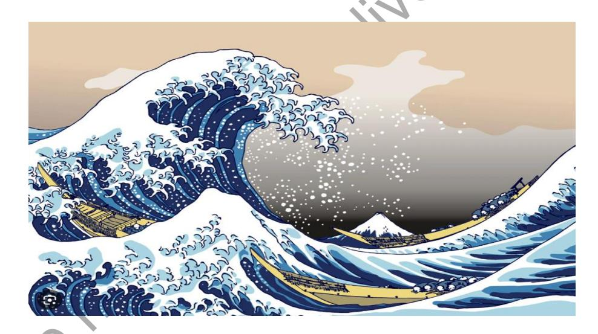
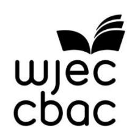
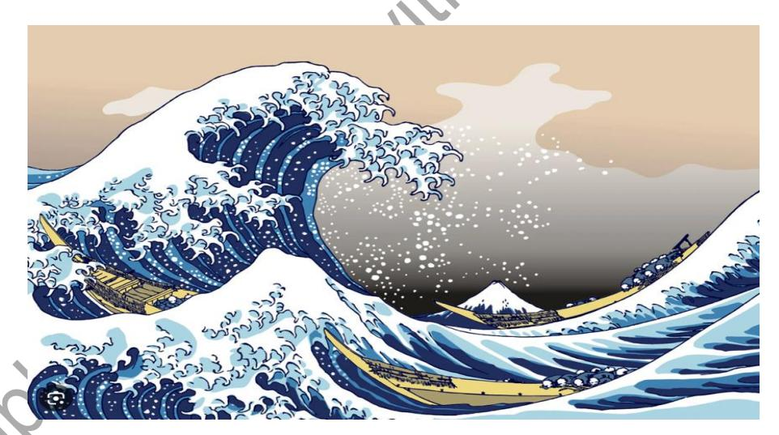

{0}------------------------------------------------

# WJEC GCSE Music

Approved by Qualifications Wales

# Sample Assessment Materials

Ready for the world. This Qualifications Wales regulated qualification is not available to centres in England.

Made for Wales.

{1}------------------------------------------------

{2}------------------------------------------------

#### Contents

| Task                      | . 1 |
|---------------------------|-----|
| Further Information       |     |
| Assessment                | . 4 |
| Candidate Assessment Pack | Ç   |

Sample not for use with the assessments

#### Copyright

© WJEC CBAC Limited 2024.

{3}------------------------------------------------

# Task

Learners are required to:

#### **Task 1a:**

• compose **two** original pieces of music with a recommended total duration of between 3-6 mins, **one** in response to their own devised brief and **one** in response to a brief set by WJEC.

#### **Task 1b:**

• present a reflective log based on the compositional process of **either** the composition in response to their own devised brief **or** the composition based on the brief set by WJEC.

#### Supervision

• No formal supervision.

#### Monitoring

- There is no restriction on the amount of time learners spend on their compositions and reflective log.
- Teachers may provide guidance and support to learners to ensure that they have a clear understanding of the requirements, including the composition briefs, the reflective log and the assessment grid.
- Before the composition process begins teachers may advise learners on the suitability of their approach to the chosen brief.
- Once composition work is underway, feedback must be limited to general advice on what needs to be improved. Teachers must **not** provide specific guidance on how to achieve these improvements.
- Once the work has been submitted to the teacher to assess, no further amendments may be made.
- To be able to authenticate the work as the learner's own and complete the necessary declaration form (Appendix B) teachers must:
  - see each composition in progress at least three times at different stages during the compositional process
  - see at least one draft of the reflective log. However, they must not provide specific guidance on how to improve the work to be able to authenticate the work as the learner's own and complete.

{4}------------------------------------------------

#### Composition Briefs

- **One** composition must be composed in response to a brief set by WJEC.
- There will be a choice of four briefs, from which the learner must select **one**.
- WJEC set briefs will be released on WJEC's portal in the September of the first year of study; for example, briefs will be first available in September 2025 for submission in summer 2027. They will be relevant to that examination series only.
- For the second composition, learners must set their own brief. This brief must contain details of the occasion, audience or context of the piece and any additional relevant musical details.
- The brief must be included on the authentication document. (Please use the template provided on the WJEC Portal).
- The brief itself is not assessed; however, learners are assessed on their musical response to the brief. It is important that centres give due consideration to the choice of composition brief to ensure that they allow learners to meet the assessment objective.
- If in doubt about composition briefs, refer to the resources and guidance on the WJEC public website or contact WJEC.

Below are sample briefs. These are **not** linked to an assessment series and have been included as **exemplar material only**:

1. Compose a piece of music inspired by the image below.

- 2. Compose a piece of music to celebrate 'Diversity Day' at your school.
- 3. Compose a piece of music for an annual World Music Festival to be held in Dolgellau.
- 4. Compose a piece of music to celebrate the life of Cardiff Headteacher, Betty Campbell.

{5}------------------------------------------------

#### Further Information

#### **Recording**

Each composition must be submitted as an audio file, with an accompanying score, lead sheet, annotated screenshots or any other appropriate forms of notation. Centres should contact WJEC if they require guidance on the presentation of scores or alternatives.

#### **Authentication**

Each learner will be required to submit a Candidate Declaration Form which require teacher and learner declarations (please see Appendix B on page 5 of the candidate pack) and a Candidate Authentication form (please see Appendix C on page 7 of the candidate pack). This will contain sections for learners to explain:

- their compositional process
- any non-original material they have included
- how the audio file has been created and if it accurately represents their compositional intentions.

#### **Further information**

You should refer to the JCQ Instructions for conducting non-examination assessment for further information on managing assessment within our GCSE Qualifications.

**The composition briefs noted within this pack are a sample. They must not be used for live assessment.**

{6}------------------------------------------------

## Assessment

Assessment may be undertaken at any time during the qualification. However, centres should ensure that assessment is completed only when learners have undertaken the necessary teaching and learning and developed the required skills and knowledge.

The total mark for this Unit is 78.

Each composition is marked out of 36. The reflective log is marked out of 6.

The compositions should have a total duration of between 3-6 minutes.

There is no penalty for compositions which fall under the minimum time as it is highly unlikely that compositions which fall under this length of time will be sufficiently developed to access the higher mark bands.

There is no penalty incurred for compositions which exceed the maximum time. However, compositions which exceed this length of time are often self-penalising as they tend to lose focus. Assessors should apply the assessment criteria to the work presented.

#### **Assessment – Compositions (Task 1a)**

For each composition:

- the appropriate band for each column should be established by determining which descriptor best reflects the learner's composition
- the appropriate mark within the band should then be established by determining the extent to which the learner has met the criteria within the relevant band
- the marks for each column may reflect different bands across the assessment criteria, for example, a learner may achieve band 4 in column 1, band 3 in column 2 and band 2 in column 3.

It should be noted that the bands have been designed to assist the marking process by identifying individual levels of achievement and they do not correlate with grade boundaries.

#### **Guidance for Assessment**

There are 3 columns for each of the three aspects being assessed.

#### **Column 1 – Creativity:**

- assess how well the quality of the initial thematic material (pitch and rhythm) and/or harmonic material, as appropriate to the piece, allows for further development. This will include material at the beginning of the piece, and any new ideas introduced subsequently
- assess how well the thematic and harmonic content has been developed throughout the piece. This can include use of compositional devices, plus extension and working out or manipulation of ideas
- assess how well the piece includes different tone, colours and moods (e.g. changes of tempo, texture and dynamics) to create the intended mood.

{7}------------------------------------------------

#### **Column 2 – Elements and Devices:**

- assess whether the choice of musical elements is sufficient and appropriate for the piece
- assess the variety of musical devices used and how well the chosen musical devices are controlled and used within the piece
- assess how well the musical ideas are presented and how well the piece has been wellstructured.

#### **Column 3 – Outcome of Brief:**

- assess how well the piece connects to / reflects the chosen brief
- assess the style and character of the piece and whether it makes sense as a unified and musical whole
- assess how well resources, including technology as appropriate, are controlled and used within the piece.

{8}------------------------------------------------

#### Assessment Grid – Compositions

| Band |  | AO4 Create and develop ideas to communicate meaning in compositions |  |  |  |  |  |  |
|------|-----------------------------------------------------------------------------------------------------------------------------------------------------------------------------------------------------------------------------------------------------------------------------------------------|--------------------------------------------------------------------------------------------------------------------------------------------------------------------------------------------------------------------------------------------------------------------------------------------------------------|------------------------------------------------------------------------------------------------------------------------------------------------------------------------------------------------------------------------------------------------------------------------|--|--|--|--|--|
|  | Creativity Creation of initial ideas and their development | Elements and Devices Use of elements of music and musical devices | Outcome of Brief Outcome with consideration of style, character and resources |  |  |  |  |  |
| 4 | 10-12 marks <ul><li>Ideas are creative and highly original, offering many opportunities for development.</li><li>Ideas are skilfully developed and extended throughout the piece.</li><li>Repetition and contrast are handled securely to create the intended mood.</li></ul> | 10-12 marks <ul><li>Highly convincing understanding of the elements of music is evident throughout the piece.</li><li>A variety of musical devices are used skilfully to develop and extend ideas.</li><li>A well-structured piece with a highly successful presentation of musical ideas.</li></ul> | 10-12 marks <ul><li>The outcome is a highly effective response to the chosen brief.</li><li>The style and character is appropriate, highly convincing and coherent.</li><li>Resources, including technology, have been handled convincingly throughout.</li></ul> |  |  |  |  |  |
| 3 | 7-9 marks <ul><li>Ideas are original and generally convincing, offering potential for further development.</li><li>Ideas are competently developed throughout the piece.</li><li>Repetition and contrast are handled well in most of the piece to create the intended mood.</li></ul> | 7-9 marks <ul><li>Generally convincing use of the elements of music is seen throughout the piece.</li><li>A variety of musical devices are used competently to develop ideas.</li><li>A structured piece with a successful presentation of musical ideas overall.</li></ul> | 7-9 marks <ul><li>The outcome is a generally effective response to the chosen brief.</li><li>The style and character is generally appropriate and coherent.</li><li>Resources, including technology, have been handled effectively.</li></ul> |  |  |  |  |  |

{9}------------------------------------------------

| 2 | 4-6 marks <ul><li>Original ideas are simple and offer some potential for further development.</li><li>Some development of ideas is evident throughout some of the piece.</li><li>There is some appropriate treatment of repetition and contrast to create the desired mood.</li></ul> | 4-6 marks <ul><li>Simple use of musical elements throughout most of the piece.</li><li>The use of musical devices to develop ideas is mostly secure but at times inconsistent.</li><li>An attempt to structure the piece has been made but the presentation of musical ideas is inconsistent.</li></ul> | 4-6 marks <ul><li>The outcome is an inconsistent response to the chosen brief.</li><li>There is some attempt to demonstrate an appropriate style and character.</li><li>The use of resources, including technology, is simple, and inconsistent at times.</li></ul> |
|---|-----------------------------------------------------------------------------------------------------------------------------------------------------------------------------------------------------------------------------------------------------------------------------------------------|--------------------------------------------------------------------------------------------------------------------------------------------------------------------------------------------------------------------------------------------------------------------------------------------------------------|-----------------------------------------------------------------------------------------------------------------------------------------------------------------------------------------------------------------------------------------------------------------------------------------|
| 1 | 1-3 marks <ul><li>Original ideas are limited throughout most of the piece, offering little opportunity for development.</li><li>Ideas show limited evidence of development.</li><li>Repetition and contrast have a limited, or negative effect on the desired mood.</li></ul> | 1-3 marks <ul><li>Insecure use and understanding of musical elements throughout the piece.</li><li>The use of musical devices to develop ideas is limited.</li><li>There is little attempt to structure the piece.</li></ul> | 1-3 marks <ul><li>The outcome is a limited response to the chosen brief and has many inconsistencies.</li><li>There is little attempt to demonstrate an appropriate style and character.</li><li>The use of resources, including technology, shows little understanding.</li></ul> |
| 0 | 0 marks <ul><li>No evidence.</li></ul> | 0 marks <ul><li>No evidence.</li></ul> | 0 marks <ul><li>No evidence.</li></ul> |

{10}------------------------------------------------

#### Assessment – Reflective Log (Task 1b)

Learners must reflect on their compositional process, with reference to **either** the composition in response to a published brief, **or** the free composition.

There is no prescribed format regarding the presentation of the reflective log.

Learners can choose to submit the task in any of the formats noted below (or any other suitable format):

- audio presentation
- audio visual presentation
- PowerPoint
- written prose.

Learners must reflect on **one** of their compositions, with respect to the following aspects:

- their response to their chosen brief and its context
- their initial ideas and creative choices
- how the elements of music were used to develop their initial ideas.

#### **Assessment Grid – Reflective Log**

| AO3 Reflect on, analyse and evaluate their own work and the work of others |  |  |  |  |  |  |  |
|-------------------------------------------------------------------------------------------------------------------------------------------------------------------------------------------------------|----------------------------------------------------------------------------------------------------------------------------------------------------------------------------------|----------------------------------------------------------------------------------------------------------------------------------------------------------------------------------------------------------------------|--|--|--|--|--|
| Response to the chosen brief and its context | Initial ideas and creative choices | Use of the elements of music to develop initial ideas |  |  |  |  |  |
| 2 marks <ul><li>Reference to the response to the chosen brief and its context.</li><li>A brief evaluation of the effectiveness of their response to the chosen brief in context.</li></ul> | 2 marks <ul><li>Reference to the initial ideas and creative choices.</li><li>A brief evaluation of the effectiveness of their initial ideas and creative choices.</li></ul> | 2 marks <ul><li>Reference to the use of the elements of music to develop initial ideas.</li><li>A brief evaluation of the effectiveness of the use of the elements of music to develop initial ideas.</li></ul> |  |  |  |  |  |
| 1 mark <ul><li>Reference to the response to the chosen brief and its context.</li></ul> | 1 mark <ul><li>Reference to the initial ideas and creative choices.</li></ul> | 1 mark <ul><li>Reference to the use of the elements of music to develop initial ideas.</li></ul> |  |  |  |  |  |
| 0 marks <ul><li>No creditable content.</li></ul> | 0 marks <ul><li>No creditable content.</li></ul> | 0 marks <ul><li>No creditable content.</li></ul> |  |  |  |  |  |

{11}------------------------------------------------

# WJEC GCSE Music

Candidate Assessment Pack

Unit 2: Composing (3630QSL-2)

{12}------------------------------------------------

#### Tasks

You are required to:

- compose **two** original pieces of music with a recommended total duration of between 3-6 mins, **one** in response to your own devised brief and **one** in response to a brief set by WJEC
- present a reflective log based on the compositional process of **either** the composition in response to your own devised brief **or** the composition based on the brief set by WJEC.

#### Composition Briefs

- **One** composition must be composed in response to a brief set by WJEC.
- There will be a choice of four briefs, from which you must select **one**.
- For the second composition, you must set your own brief. This brief must contain details of the occasion, audience or context of the piece and any additional relevant musical details.
- The brief itself is not assessed; however, you will be assessed on your musical response to the brief. It is important therefore that you consider your choice of composition brief carefully.

Below are sample briefs set by WJEC. These are **not** linked to an assessment series and have been included as **exemplar material only**:

1. Compose a piece of music inspired by the image below.

(The image as a whole may be used as a starting point for your composition, or you could use certain references within it as your initial source of inspiration, for example, the waves, the mountain, Japan or even the odd shape(s) within the clouds).

- 2. Compose a piece of music to celebrate 'Diversity Day' at your school.
- 3. Compose a piece of music for an annual World Music Festival to be held in Dolgellau.
- 4. Compose a piece of music to celebrate the life of Cardiff Headteacher, Betty Campbell.

{13}------------------------------------------------

#### Further Information

#### **Monitoring**

- There is no restriction on the amount of time you spend on your compositions and reflective log. Your work must be submitted to WJEC within the final year of your course. Your teacher will be able to offer further guidance regarding specific submission dates.
- Your teacher may provide guidance and support to ensure that you have a clear understanding of the requirements, including the composition briefs, the reflective log and the assessment grid.
- Before the composition process begins your teacher may advise you on the suitability of your approach to the chosen brief.
- Once composition work is underway, your teacher's feedback must be limited to general advice on what needs to be improved. Teachers must **not** provide specific guidance on how you achieve these improvements.
- Once the work has been submitted to the teacher to assess, no further amendments may be made.
- Your teacher must see each composition in progress at least three times at different stages during the compositional process to be able to authenticate the work as your own and complete the necessary authentication documentation.
- Your teacher must also see one draft of the reflective log but must not provide any written feedback before the final submission. Feedback must be limited to general advice and teachers must not provide specific guidance on how to improve the work. The teacher must sign the authentication form to authenticate the reflective log as your own work.

#### **Recording and Submitting Your Compositions**

Both of your compositions must be submitted as an audio file; however, you do not have to perform your own compositions, you could ask friends or your teacher to perform them. Please remember that the performer(s) must not edit or change your pieces.

You should choose the most appropriate way to create the audio versions of your compositions. For example, you could choose:

- live performance
- output from computer software.

Both of your compositions must also have an appropriate form of notation. You can choose the most appropriate way to notate your compositions. For example, you could choose:

- staff notation
- lead sheet
- graphic notation
- written commentary.

{14}------------------------------------------------

#### **Authentication**

You will be required to submit an authentication form for your compositions. Your teacher will provide you with the correct template; however, the template is available on the WJEC website (link to follow).

Within the authentication form, you will need to refer to:

- your compositional process
- any non-original material you have included
- how the audio file has been created and if it accurately represents your compositional intentions
- if somebody else performed your piece, how they knew exactly what you wanted them to do e.g. you provided a score or guide track.

Your teacher will be able to advise you on how best to complete the authentication form.

#### Reflective Log

You must present a reflective log based on your compositional process.

You can choose to discuss the process for **either** the composition based on the WJEC set brief **or** the composition based on your own brief.

You should reflect on the following aspects within the reflective log:

- your response to the chosen brief and its context
- your initial ideas and creative choices
- how the elements of music were used to develop your initial ideas.

There is no prescribed format regarding the presentation of the reflective log. You can choose to submit the task in any of the formats noted below (or any other suitable format):

- audio presentation
- audio visual presentation
- PowerPoint
- written prose.

You could choose to produce the reflective log during the compositional process, or you may prefer to keep a diary of the process and complete the log at the end. Your teacher will be able to offer advice.

{15}------------------------------------------------

## Appendix A – Information for candidates

The following information has been taken from the [JCQ Information for candidates –](https://www.jcq.org.uk/wp-content/uploads/2021/08/IFC-NE_Assessments_2021_v4.pdf) non[examination assessments](https://www.jcq.org.uk/wp-content/uploads/2021/08/IFC-NE_Assessments_2021_v4.pdf) and the [JCQ Artificial Intelligence \(AI\) Use in Assessments:](https://www.jcq.org.uk/exams-office/malpractice/artificial-intelligence/)  [Protecting the Integrity of Qualifications.](https://www.jcq.org.uk/exams-office/malpractice/artificial-intelligence/) This tells you about things that you **must** and **must not** do when you are completing your assessment. If there is anything that you do not understand, you **must** ask your teacher.

#### **Preparing your work**

- If you receive help and guidance from someone other than your teacher, you **must** tell your teacher who will then record the nature of the assistance given to you.
- Take care of your work and keep it safe. **Do not** leave it lying around where your classmates can find it or share it with anyone, including posting it on social media. You **must** always keep your work secure and confidential whilst you are preparing it; **do not** share it with your classmates. If it is stored on the computer network, keep your password secure. Collect all copies from the printer and destroy those you do not need.
- **Do not** be tempted to use pre-prepared online solutions this is cheating (such as those produced by AI tools and chatbots). Electronic tools used by WJEC can detect this sort of copying.
- You **must not** write inappropriate, offensive or obscene material.

#### **Plagiarism**

Plagiarism involves taking someone else's words, thoughts or ideas and trying to pass them off as your own. **It is a form of cheating which is taken very seriously.** Don't think you won't be caught; there are many ways to detect plagiarism:

- markers can spot changes in the style of writing and use of language.
- markers are highly experienced subject specialists— they may have read the source you are using, or even marked the work you have copied from!
- Internet search engines and specialised computer software can be used to match phrases or pieces of text with original sources and to detect changes in the grammar and style of writing or punctuation.

#### **Penalties for breaking the regulations**

If it is discovered that you have broken the regulations, one of the following penalties will be applied:

- the piece of work will be awarded zero marks
- you will be disqualified from that Unit for the assessment series in question
- you will be disqualified from the whole subject for that assessment series
- you will be disqualified from all subjects and barred from entering again for a period of time.

WJEC will decide which penalty is appropriate.

**Remember – it's your qualification so it needs to be your own work.**

{16}------------------------------------------------

# Appendix B – Candidate Declaration Form Unit 2: Composing

| All | sections | of this | form | must | be | completed |
|-----|----------|------------|------|------|----|-----------|
|-----|----------|------------|------|------|----|-----------|

| Centre Name: |  | Centre No: |  |  |  |  |  |
|-------------------------------------------------------------------------------------------------------------------------------------------------------------------------------------------------------------------------------------------------------------------------------------------------------------------------------------------------------------------------------------------------------------------------------------------------------------------------------------------------------------------------------------------------------------------------------------------------------------------------------------------------------------------------------------------------------------------------------------------------------------------------------------------------------------------------------------------------------------|----------------------------------------------------------------------------------------------------------------------------------------------------------------|-------------------------------------------------------------------|---------------------------------------------------------|-----------------------------|-------------------------------------------|----------|----------------------|
| Candidate Name: |  | Candidate | No: |  |  |  |  |
| Part A: Authentication |  |  |  |  |  |  |  |
| References: Give details of the exact source of any non-original material used in the assignment. | List of software packages/AI tools/chatbots: give brief details of how these have been used in the assignment. |  |  |  |  |  |  |
|                                                                                                                                                                                                                                                                                                                                                                                                                                                                                                                                                                                                                                                                                                                                                                                                                                                             |                                                                                                                                                                |                                                                   |                                                         |                             |                                           |          |                      |
| Candidate Authentication Declaration I declare that my work was completed independently permitted. All work is my own, except for any non-original not been submitted for any other qualification. | and without any material | assistance clearly credited | beyond above. | that | which This | work | was has |
| Signed:                                                                                                                                                                                                                                                                                                                                                                                                                                                                                                                                                                                                                                                                                                                                                                                                                                                     | Date:                                                                                                                                                          |                                                                   |                                                         |                             |                                           |          |                      |
| Teacher Authentication Declaration I certify that the work of the above candidate has been and that, to the best of my knowledge and belief, it has candidate's compositional work has been monitored reflective log on at least one occasion as required by the entire cohort will be kept on file. The candidate used in the work. I understand that false declaration | carried out been produced on at least three the specification. Signed has clearly referenced is a form of | under the by his/her occasions any malpractice. | conditions own and the candidate sources | required efforts. and | The candidate's declarations any | by AI | WJEC for tools |
| Signed:                                                                                                                                                                                                                                                                                                                                                                                                                                                                                                                                                                                                                                                                                                                                                                                                                                                     | Date:                                                                                                                                                          |                                                                   |                                                         |                             |                                           |          |                      |
| Part B: GDPR Consent <ul><li>WJEC may select your work for use at teacher training events and subsequently upload it onto WJEC's Portal (accessible only to teachers via a secure login). Your name would be removed from your work before we use it. All materials are reviewed regularly and are removed when no longer relevant to our qualifications.</li><li>WJEC may select your work for use in teaching and learning resources published on the WJEC public website. Your name would be removed from your work before we use it. All materials are reviewed regularly and are removed when no longer relevant to our qualifications.</li><li>You understand that this agreement may be terminated at any time through written request.</li><li>For further details about how we process your data please read WJEC's privacy notice.</li></ul> |  |  |  |  |  |  |  |
| If you consent to your work being used in this way, | please sign | below: |  |  |  |  |  |
| Candidate Signature: | Date: |  |  |  |  |  |  |
| If you prefer that WJEC does not use your work in this | way, please | tick here: |  |  |  |  |  |

{17}------------------------------------------------

# Appendix C – Candidate Authentication Form Unit 2: Composing

**All sections of this form must be completed by the candidate.**

| Centre Name: | Centre No: |  |  |  |  |  |  |
|-----------------------------------------------------------------------------------------------------------------------------------------------------------------------------------------------------------------------------------|------------------------------------------------------|--------------------------------------------------|--|--|--|--|--|
| Candidate Name: | Candidate No: |  |  |  |  |  |  |
| Composition 1 – composed in response to a brief set by WJEC. |  |  |  |  |  |  |  |
| State the brief you have chosen. Remember, met this brief. | your piece is assessed on | how well it has |  |  |  |  |  |
|                                                                                                                                                                                                                                   |                                                      |                                                  |  |  |  |  |  |
| You are required to submit a recording and a score or a detailed written account and a chordal/melodic outline. Please indicate which you are submitting. |  |  |  |  |  |  |  |
| Recording and a traditional score |  |  |  |  |  |  |  |
| Recording and detailed written account and | chordal/melodic outline |  |  |  |  |  |  |
|                                                                                                                                                                                                                                   |                                                      |                                                  |  |  |  |  |  |
| Give an account of your composing and refining which influenced you, any software you used, and | process. Include any help or feedback | details of pieces you were given. |  |  |  |  |  |

{18}------------------------------------------------

| Give details of any musical ideas in your piece which are not your original work. E.g. Quotes from other pieces, loops/samples/chord realisations from your software or elsewhere, ideas composed or suggested by other people etc. (If there are none, please write "none") |  |  |  |  |
|---------------------------------------------------------------------------------------------------------------------------------------------------------------------------------------------------------------------------------------------------------------------------------------------------------------------------------------------------------------------------------------------------------|--|--|--|--|
| Is the recording an accurate version of your piece? Yes / No |  |  |  |  |
| If not, please explain how the score and recording relate to each other, and which one represents an accurate reflection of the composition: |  |  |  |  |
| How was this recording produced? (tick all which apply) |  |  |  |  |
| Output from computer software |  |  |  |  |
| Live part(s) performed by the candidate |  |  |  |  |
| Some or all live parts were performed by other people reading from a conventional score. |  |  |  |  |
| Some or all of the live parts were performed by other people without a conventional score – give details below. |  |  |  |  |
| If there was no score and other performers were involved, how did they know exactly what to play/sing? Any other information you wish to supply concerning the recording: |  |  |  |  |

{19}------------------------------------------------

#### **Composition 2 – Free composition – to a brief formulated by the candidate.**

| State the brief you have chosen. Remember, your piece is assessed on how well it has met this brief. |  |  |  |  |
|----------------------------------------------------------------------------------------------------------------------------------------------------------------------------------------------------------------------------------------------------------------------------------------------------------------------------------------------------------------------------------------------------------------------------------------------------------------------------------------------------------------|--|--|--|--|
| You are required to submit a recording and a score or a detailed written account and a chordal/melodic outline. Please indicate which you are submitting. |  |  |  |  |
| Recording and a traditional score |  |  |  |  |
| Recording and detailed written account and chordal/melodic outline |  |  |  |  |
|                                                                                                                                                                                                                                                                                                                                                                                                                                                                                                                |  |  |  |  |
| Give an account of your composing and refining process. Include details of pieces which influenced you, any software you used, and any help or feedback you were given. Give details of any musical ideas in your piece which are not your original work. E.g. Quotes from other pieces, loops/samples/chord realisations from your software or |  |  |  |  |
| elsewhere, ideas composed or suggested by other people etc. (If there are none, please write "none") |  |  |  |  |
| Is the recording an accurate version of your piece? Yes / No |  |  |  |  |
| If not, please explain how the score and recording relate to each other, and which one represents an accurate reflection of the composition: |  |  |  |  |

{20}------------------------------------------------

| How was this recording produced? (tick all which apply) |  |  |  |  |
|--------------------------------------------------------------------------------------------------------------------------------------------------------------------------|---------|--|--|--|
|                                                                                                                                                                          |         |  |  |  |
| Output from computer software |  |  |  |  |
| Live part(s) performed by the candidate |  |  |  |  |
| Some or all live parts were performed by other people reading from a conventional score. |  |  |  |  |
| Some or all of the live parts were performed by other people without a conventional score – give details below. |  |  |  |  |
| If there was no score and other performers were involved, how did they know what to play/sing? | exactly |  |  |  |
|                                                                                                                                                                          |         |  |  |  |
|                                                                                                                                                                          |         |  |  |  |
|                                                                                                                                                                          |         |  |  |  |
| Any other information you wish to supply concerning the recording: |  |  |  |  |
|                                                                                                                                                                          |         |  |  |  |
|                                                                                                                                                                          |         |  |  |  |
|                                                                                                                                                                          |         |  |  |  |

{21}------------------------------------------------

# Appendix D – Candidate Mark Sheet

**All sections of this form must be completed.**

| Centre    | Centre    |
|-----------|-----------|
| Name:     | No:       |
| Candidate | Candidate |
| Name:     | No:       |

|  | Creativity | Elements and Devices | Outcome of Brief | Total |
|-------------------------------------------------------------|------------|----------------------------|------------------------|-------|
| Composition: to WJEC Brief |  |  |  |  |
|                                                             | (12)       | (12)                       | (12)                   | (36)  |
| Composition 2: Free composition |  |  |  |  |
|                                                             | (12)       | (12)                       | (12)                   | (36)  |
| Reflective Log (based |  |  |  |  |
| on either Composition 1 or Composition 2) |  |  |  | (6) |
| Overall total for Unit 2 |  |  |  |  |
| (Enter this mark on the WJEC Portal.) |  |  |  | (78) |

| DECLARATION: I certify that the work of this candidate has been carried out and assessed under the conditions required by WJEC and that, to the best of my knowledge and belief; it has been produced by their own efforts. |  |  |
|-----------------------------------------------------------------------------------------------------------------------------------------------------------------------------------------------------------------------------------------------------------------------------------------------------------------------------------------------|-------|--|
| Subject Teacher: | Date: |  |

{22}------------------------------------------------

## Appendix E – Guide to Controls

Unit 2: Composing is internally assessed through NEA.

#### Controls are provided to:

- ensure that all candidates taking a specific qualification spend approximately the same amount of time on their assignments
- prevent third parties from providing inappropriate levels of guidance and input
- mitigate concerns about plagiarism and improve reliability and validity of results
- allow centres an appropriate degree of freedom and control
- allow candidates to produce an original piece of work.

There are a number of different aspects that are controlled within the internal assessment.

#### These are:

- supervision how closely candidates should be monitored as they carry out the tasks
- guidance how much help you are allowed to provide candidates as they are completing the tasks
- resources whether candidates are allowed access to any resources as they're completing the tasks and if so, what resources
- collaboration whether candidates are allowed to work with others as they're completing the tasks.

| Controls | Unit 2: Composing |
|---------------|--------------------------------------------------------------------------------------------------------------------------------------------------------------------------------------------------------------------------------|
| Supervision | No controls |
| Guidance | <ul><li>Not permitted – Once composition work is underway, feedback must be limited to general advice on what needs to be improved. Teachers must not provide specific guidance on how to achieve these improvements.</li></ul> |
| Resources | No controls |
| Collaboration | Not permitted |

{23}------------------------------------------------

#### Supervision

Unit 2 has the following level of control.

| Type | Description                                                                                                                                                                                                                                                                                                                                                             |
|------|-------------------------------------------------------------------------------------------------------------------------------------------------------------------------------------------------------------------------------------------------------------------------------------------------------------------------------------------------------------------------|
| None | Work may be completed outside of the centre without direct supervision. Where no supervision is specified, candidates may normally: <ul><li>have unlimited access to electronic and printed resources</li><li>use the internet without restriction</li><li>work in groups.</li></ul> |
|  | However, due to the nature of the assessment within Unit 2: Composing, candidates are not permitted to work in groups. |

#### Guidance

Two levels of guidance feature within the assessments:

| Category of Advice/Feedback: | Not Permitted | Permitted |
|----------------------------------------------------------------------------------------------------------------------------------------------------------------------------------|------------------|-----------|
| Review candidates' work and provide oral and written advice at a general level in order to secure a functional outcome. | x | ✓ |
| Evaluate progress to date and propose broad approaches for improvement. | x | x |
| Provide detailed specific advice on how to improve drafts to meet assessment criteria. | x | x |
| Give detailed feedback on errors and omissions which leave candidates with no opportunity to show initiative themselves. | x | x |
| Intervene personally to improve the presentation or content of work. | x | x |

N.B. In all levels of Guidance, teachers are permitted to intervene/advise on issues of safety and provide technical or materials guidance.

{24}------------------------------------------------

#### Resources

Unit 2 has the following level of control regarding resources.

**No controls**

In many subjects, candidates will need to gather information from published sources when researching and planning their tasks.

Candidates are allowed access to the internet and any electronic and printed resources available to them.

#### Collaboration

Within Unit 2 – collaboration is not permitted. Candidates must not collaborate in any way during the tasks.

#### Time

There is no restriction on the amount of time learners spend on Unit 2.