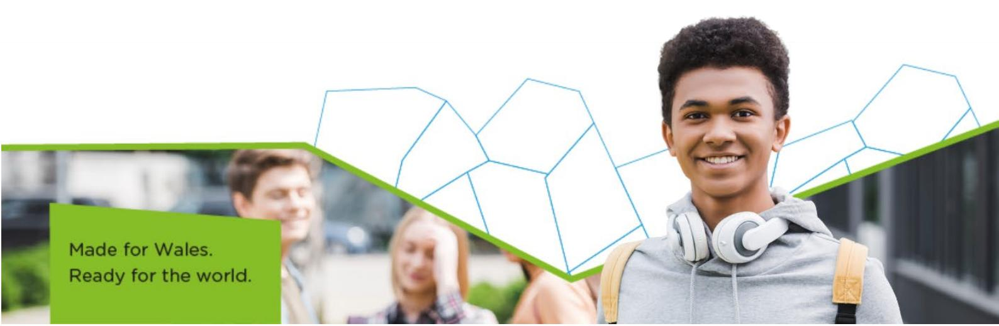

{0}------------------------------------------------

# PHYSICAL EDUCATION AND HEALTH? WHY CHOOSE GCSE

The GCSE PHYSICAL EDUCATION AND HEALTH will enable you to engage in a practical course, designed to encourage you to be inspired, motivated and challenged by the subject and allow you to make informed decisions about further learning opportunities and career pathways. You will acquire the knowledge, understanding, skills and values to develop and maintain your performance in sports or physical activities and understand the benefits to health, fitness and well-being.

#### WHAT WILL I STUDY?

The specification in Physical Education and Health will enable you to make connections between theory and practice so that you are able to apply your understanding of the factors that underpin health and wellbeing, sports and physical activity and use this knowledge to improve performance.

## HOW WILL I BE ASSESSED?

## UNIT 1: PRINCIPLES OF PHYSICAL EDUCATION AND HEALTH

- Digital examination: 1 hour 30 minutes
- Marked by WJEC
- 40% of qualification
- 80 marks
- Questions requiring objective response, quickresponses, short and extended answers.

#### UNIT 2: PERFORMANCE AND PERSONAL TRAINING

Non-examination assessment: internally assessed by your teacher and externally moderated by a WJEC visiting moderator

- 60% qualification
- 120 marks

Practical non-examination assessment:

- Perform in one sport or physical activity from the approved list
- Perform in a second sport or physical activity or provide coaching in a sport or physical activity from the approved list
- Plan, implement and evaluate a personal training activity over 8-10 weeks for a sport or physical activity from the approved list.

## WHAT SKILLS WILL I DEVELOP?

By studying Physical Education and Health you will be able to:

- perform effectively in different sports and physical activities by developing skills and techniques and selecting and using tactics, strategies and/or compositional ideas
- analyse physical performance and select appropriate strategies and interventions for development and improvement
- think critically and reflectively about your own and others performance
- develop knowledge and understanding of health, wellbeing, sport and physical activity and the links between them
- understand the factors that impact on levels of activity and the relationship with physical, social and emotional health and wellbeing
- understand the socio-cultural influences on participation, and contemporary developments within sport and physical activity.

#### CAREERS IN PHYSICAL EDUCATION AND HEALTH

This qualification provides an excellent foundation for the study of WJEC AS and A Level Physical Education or WJEC Level 3 Sport. It will also provide a satisfying and worthwhile course of study if you choose not to progress further.

Importantly, studying GCSE Physical Education and Health will develop many transferable skills including communication, performance and presentation skills, teamwork, leadership, focus, refinement and selfconfidence.

The career possibilities that come from studying Physical Education and Health are extensive, but a few are listed here:

[Fitness Instructor,](https://successatschool.org/advice/jobs-a-z/fitness-instructor/1798) [Personal Trainer,](https://successatschool.org/advice/jobs-a-z/personal-trainer/1573) PE [Teacher,](https://successatschool.org/advice/jobs-a-z/secondary-teacher/1468)  University Lecturer, [Physiotherapist,](https://successatschool.org/advice/jobs-a-z/physiotherapist/1564) Sports Massage Therapist, Leisure and Recreation Manager, Sports Business Manager, Sports Administrator, Sports Coach, Sports Development Officer, Sports Journalist, Sports Commentator, Sports Medicine, Professional Sports Performer, Sports Scientist, Sports Nutritionist, Professional Sports Official/ Referee, Event Coordinator.

FIND OUT MORE -TALK TO YOUR TEACHER TODAY!

