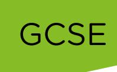
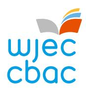
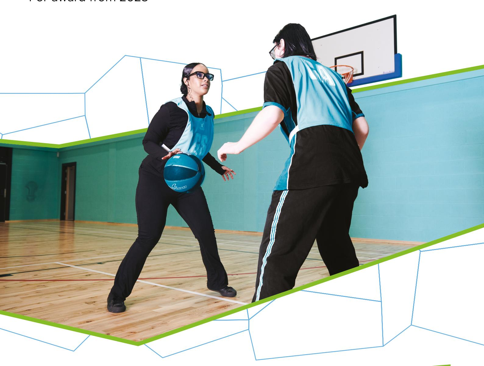

{0}------------------------------------------------

# WJEC GCSE Physical Education and Health

Approved by Qualifications Wales

## Specification

Teaching from 2026 For award from 2028

Ready for the world. This Qualifications Wales regulated qualification is not available to centres in England.

Made for Wales.

{1}------------------------------------------------

{2}------------------------------------------------

This specification meets the requirements of the following regulatory documents published by Qualifications Wales:

- [Made for Wales GCSE Qualification Approval Criteria](https://qw-website-prod-master.azurewebsites.net/media/t1lhpbwl/made-for-wales-gcse-qualification-approval-criteria.pdf) which set out requirements for any new GCSE qualification Approved for first teaching from September 2025 and beyond.
- [Standard Conditions of Recognition](https://qualifications.wales/media/p54jkkfe/standard-conditions-of-recognition.pdf) which contains the rules that all awarding bodies and their qualifications must meet when offering qualifications to learners in Wales.
- Approval Criteria for GCSE [Physical Education and Health](https://qualifications.wales/media/2nrp3ila/gcse-physical-education-and-health-approval-criteria.pdf) which sets out the subject specific requirements for GCSE Physical Education from September 2026 and beyond.

#### **Copyright**

© WJEC CBAC Limited 2025.

{3}------------------------------------------------

#### **CONTENTS**

| SU | MM/                                                                            | ARY OF ASSESSMENT                                       | 4  |  |  |
|----|--------------------------------------------------------------------------------|---------------------------------------------------------|----|--|--|
| 1  |                                                                                | NTRODUCTION                                             | 5  |  |  |
|    | 1.1                                                                            | Aims                                                    | 5  |  |  |
|    | 1.2                                                                            | Curriculum for Wales                                    | 5  |  |  |
|    | 1.3                                                                            | Prior learning and progression                          | 8  |  |  |
|    | 1.4                                                                            | Guided learning hours                                   | 8  |  |  |
|    | 1.5                                                                            | Use of language                                         | 8  |  |  |
|    | 1.6                                                                            | Equality and fair access                                | 8  |  |  |
| 2  | 2 5                                                                            | SUBJECT CONTENT                                         | 9  |  |  |
|    | Ho                                                                             | w to read the amplification                             | 9  |  |  |
|    | Uni                                                                            | it 1                                                    | 10 |  |  |
|    | Uni                                                                            | it 2                                                    | 17 |  |  |
|    | Ор                                                                             | portunities for integration of learning experiences     | 22 |  |  |
| 3  | 3 <i>A</i>                                                                     | ASSESSMENT                                              | 23 |  |  |
|    | 3.1                                                                            | Assessment Objectives and Weightings                    | 23 |  |  |
|    | 3.2                                                                            | Arrangements for non-examination assessment             | 24 |  |  |
| 2  | <b>!</b> N                                                                     | MALPRACTICE                                             | 25 |  |  |
| 5  | 5 7                                                                            | FECHNICAL INFORMATION                                   | 26 |  |  |
|    | 5.1                                                                            | Making entries                                          | 26 |  |  |
|    | 5.2                                                                            | Grading, awarding and reporting                         | 26 |  |  |
| A  | Арре                                                                           | ndix A: Approved List of Sports and Physical Activities | 27 |  |  |
| A  | Appendix B: Opportunities for embedding elements of the Curriculum for Wales 3 |                                                         |    |  |  |
|    |                                                                                |                                                         |    |  |  |

{4}------------------------------------------------

## GCSE PHYSICAL EDUCATION AND HEALTH

## SUMMARY OF ASSESSMENT

**Unit 1: Principles of Physical Education and Health**

**Digital examination: 1 hour 30 minutes** 

**40% of qualification**

**Marked by WJEC 80 marks**

#### **Summary of assessment**

Questions requiring objective responses, quick-response, short and extended answers.

### **Unit 2: Performance and Personal Training**

**Non-examination assessment**

**60% of qualification** 

**Internally assessed by the centre, externally moderated by a visiting moderator 120 marks**

#### **Summary of assessment**

Practical non-examination assessment. Learners must:

- Perform in one sport or physical activity from the approved list
- Perform in a second sport or physical activity **or** provide coaching in a sport or physical activity from the approved list
- Plan, implement and evaluate a personal training activity over 8-10 weeks for a sport or physical activity from the approved list.

This is a linear qualification.

The qualification is not tiered.

There is no hierarchy in the order in which the units are presented. The order does not imply the teaching order of the units.

The first award of the qualification will be 2028.

Qualification Approval Number: C00/5167/1

{5}------------------------------------------------

## GCSE PHYSICAL EDUCATION AND HEALTH

## 1 INTRODUCTION

#### 1.1 Aims

GCSE Physical Education and Health supports learners to:

- develop their knowledge and understanding of health, wellbeing, and physical activity and the links between them
- understand the factors that impact on levels of activity and the relationship with physical, social and emotional health and wellbeing through the life cycle
- understand the socio-cultural influences on participation, and contemporary developments within sport and physical activity, on a local, national and international stage
- perform effectively in different sports and physical activities by developing skills and techniques, and selecting and using tactics, strategies and/or compositional ideas
- analyse physical performance and select appropriate strategies and interventions for development and improvement
- think critically and reflectively about their own performance and practice, and that of others
- explore the cross-cutting theme of human rights and diversity, including Black, Asian and minority ethnic perspectives, identity, culture, contributions and experiences.

These aims are set out in Qualifications Wales's Approval Criteria.

#### 1.2 Curriculum for Wales

This GCSE Physical Education and Health qualification is underpinned by the Curriculum for Wales framework and has been designed to ensure that learners can continue to make progress towards the four purposes whilst studying for this qualification. Central to this design are the [principles of progression,](https://hwb.gov.wales/curriculum-for-wales/health-and-well-being/principles-of-progression/) along with the [statements of what matters](https://hwb.gov.wales/curriculum-for-wales/health-and-well-being/statements-of-what-matters/) and those [subject specific skills and concepts](https://hwb.gov.wales/curriculum-for-wales/health-and-well-being/designing-your-curriculum/#specific-considerations-for-this-area) outlined in the '[Designing your Curriculum](https://hwb.gov.wales/curriculum-for-wales/health-and-well-being/designing-your-curriculum/)' section of the Health and Well-being Area of Learning and Experiences

In developing this qualification, we have considered where there are opportunities to embed the cross-curricular themes and where there are opportunities for integral skills and cross-curricular skills to be developed. Appendix B provides a simple mapping, and information to support teachers will be provided in the Guidance for Teaching.

We have also considered where the qualification can generate opportunities for integrating the learning experiences noted on page 22; the Guidance for Teaching will include further information on integrating these learning experiences into delivery. 

{6}------------------------------------------------

The GCSE Physical Education and Health qualification supports the Curriculum for Wales by:

- supporting the statements of what matter[s](#page-6-0)1 by giving learners the opportunity to:
  - understand the factors that affect physical health and well-being including. health-promoting behaviours develop positive, informed behaviours that encourage them both to care for and respect themselves and others. These behaviours support learners' sense of self-worth, their overall mood and energy levels
  - develop the confidence, motivation, physical competence, knowledge and understanding that can help them lead healthy and active lifestyles which promote good physical health and well-being
  - understand how decisions and actions impact on themselves, on others and on wider society, both now and in the future. It can also help learners understand the factors that influence decision-making, thus placing them in a better position to make more informed and considered decisions
  - develop the critical-thinking skills necessary to consider their decision-making in terms of possible implications
  - understand the important role of social influences on their lives.
- supporting the principles of progression[2](#page-6-1) by encouraging learners to:
  - revisit and deepen learning in concepts within the statements of what matters across a wide range of topics and aspects of physical education and health
  - develop their independence and agency in matters relating to physical education and health: resulting in a growing responsibility for their own health and well-being
  - develop their ability to make, justify and evaluate decisions
  - develop conceptual knowledge and critical understanding in a range of aspects of physical education and health
  - develop practical skills increasing accuracy and proficiency
  - transfer understanding from their own well-being to that of others; becoming more socially responsible.

1 [Health and Well-being: Statements of what matters -](https://hwb.gov.wales/curriculum-for-wales/health-and-well-being/statements-of-what-matters/) Hwb (gov.wales)

2 [Health and Well-being: Principles of progression -](https://hwb.gov.wales/curriculum-for-wales/health-and-well-being/principles-of-progression/) Hwb (gov.wales)

© WJEC CBAC Ltd 2025.

{7}------------------------------------------------

- supporting the subject specific considerations for GCSE Physical Education and Health[3](#page-7-0) by providing opportunities for learners to:
  - participate in physical activity and engage in a variety of roles, responsibilities and environments
  - understand what factors, influences and behaviours shape physical health
  - consider what decisions influence their health and well-being and that of others
  - understand the benefits of physical activity, including social, recreational and performance aspects, as well as how it supports their physical health and well-being
  - participate in various sports and activities to support the development and refinement of gross and fine motor skills, transferable skills and the ability to connect progress with perseverance and confidence
  - understand how factors can influence their health and well-being, develop the skills to support healthy behaviours relating to these factors, and the confidence and motivation to support those behaviours for life
  - explore the factors that impact on their mental health and well-being, these may include, but are not limited to, the importance of regular exercise and the effect of a balanced diet
  - reflect on the short-term, medium-term and long-term implications of the decisions they make, and the impact of decisions not only on oneself, but on other people and wider society
  - participate in a range of team and individual sports to support their understanding and application of positive health behaviours. This also supports the development of team-working, resilience and individual confidence. A study of sport can also unlock aspects of social history, politics, geography and science in Wales and across the world.

3 <https://hwb.gov.wales/curriculum-for-wales/health-and-well-being/designing-your-curriculum/>

{8}------------------------------------------------

#### 1.3 Prior learning and progression

Although there is no specific requirement for prior learning, the qualification is designed primarily for learners between the ages of 14 and 16 and builds on the conceptual understanding learners have developed through their learning from ages 3 – 14.

The qualification allows learners to develop a strong foundation of knowledge, skills and understanding which supports progression to post-16 study and prepares learners for life, learning and work. The qualification provides a suitable foundation for the study of Physical Education at either AS or A level. In addition, the specification provides a coherent, satisfying and worthwhile course of study for learners who do not progress to further study in this subject.

#### 1.4 Guided learning hours

GCSE Physical Education and Health has been designed to be delivered within 120 – 140 guided learning hours. The qualification has been primarily designed as a 2 year programme for learners in years 10 and 11.

#### 1.5 Use of language

As our understanding of diversity, equity, and inclusion evolves, so must our language. Updated terminology better reflects individual identities and fosters respect and accuracy. Language used should be specific as possible. Staying informed and adaptable is crucial, as inclusive language promotes dignity and equity. Recognising that language will continue to evolve, we will remain open to further amendments to ensure it accurately represents and supports all individuals. WJEC will inform centres of any amendments and the most up to date version of the specification will always be on the website.

#### 1.6 Equality and fair access

The specification may be followed by any learner, irrespective of gender, ethnic, religious or cultural background. It has been designed to avoid, where possible, features that could, without justification, make it more difficult for a learner to access and achieve because they have a particular protected characteristic.

The protected characteristics under the Equality Act 2010 are age, disability, gender reassignment, pregnancy and maternity, race, religion or belief, sex and sexual orientation.

Access arrangements and reasonable adjustments are made for eligible learners to enable them to access the assessments and demonstrate their knowledge and skills without changing the demands of the assessment.

Information on access arrangements and reasonable adjustments is found in the following document from the Joint Council for Qualifications (JCQ): Access Arrangements, Reasonable Adjustments: General and Vocational Qualifications. This document is available on the JCQ website [\(www.jcq.org.uk\)](http://www.jcq.org.uk/).

We will be following the principles set out in this document and, as a consequence of provision for reasonable adjustments, very few learners will encounter a complete barrier to any part of the assessment.

{9}------------------------------------------------

## 2 SUBJECT CONTENT

#### How to read the amplification

The amplification provided in the right-hand column uses the following four stems:

- 'Learners should know' is used when learners are required to demonstrate knowledge and understanding.
- 'Learners should understand' is used when learners are required to demonstrate greater depth of knowledge and understanding, application of knowledge to familiar or unfamiliar contexts and analysis and evaluation of information for a given purpose.
- 'Learners should be able to' is used when learners need to apply their knowledge, understanding, analysis and evaluation to a practical situation or demonstrate application of practical skills and techniques.
- 'Learners should be aware of' is used when learners do not need to understand all aspects of the specified content in detail. Teachers should refer to Guidance for Teaching documents for further guidance on the depth and breadth to which this content should be taught.

The use of the word 'including' indicates that the specified content must be taught and could be subject to assessment.

The use of the word 'for example' indicates that the specified content is for guidance only, and alternative examples could be chosen.

{10}------------------------------------------------

#### Unit 1

#### **Principles of Physical Education and Health**

Digital examination: 1 hour 30 minutes 40% of qualification Marked by WJEC

#### **Overview of unit**

The purpose of this unit is to:

- demonstrate and apply knowledge and understanding of the factors that contribute to participation in sport and physical activity
- develop learners' understanding of how sport and physical activity has an impact on health and wellbeing
- reflect on and analyse performance factors and how they can be developed.

#### This unit will focus on:

- health, wellbeing, sport and physical activity
- the factors that impact on levels of activity and the relationship with physical, social, and emotional health and wellbeing such as:
  - diet and nutrition
  - exercise physiology
  - psychological aspects
  - the socio-cultural influences on participation and performance

{11}------------------------------------------------

#### **Areas of content**

#### **1.1 Factors that affect health and wellbeing, sports and physical activity.**

Learners will gain knowledge and understanding of:

- 1.1.1 How sport and physical activity impact health and wellbeing.
- 1.1.2 Socio-cultural factors that influence participation and performance

| Content                                                                            | Further information                                                                                                                                                                                                                                                                                                                                                                                                                                                                                                                                                                                                                               |  |  |  |
|------------------------------------------------------------------------------------|---------------------------------------------------------------------------------------------------------------------------------------------------------------------------------------------------------------------------------------------------------------------------------------------------------------------------------------------------------------------------------------------------------------------------------------------------------------------------------------------------------------------------------------------------------------------------------------------------------------------------------------------------|--|--|--|
| 1.1.1 How sport and physical activity impact health and wellbeing. | Learners should understand the relationship between health, wellbeing, sports and physical activity by drawing on their own experiences and considering different perspectives. Learners should understand the factors that have a positive and negative impact on levels of activity and the relationship with physical, social and emotional health and wellbeing through the life cycle including: <ul><li>personal, including:</li><li>age</li><li>ability</li><li>body image</li><li>family</li><li>friends</li><li>socio economic status</li></ul> |  |  |  |
|  | <ul><li>gender</li><li>experiences, including:</li><li>education</li><li>community</li><li>peers</li><li>opportunities, including:</li></ul> |  |  |  |
|  | <ul><li>access</li><li>inclusion</li><li>location</li><li>facilities.</li></ul> |  |  |  |
| 1.1.2 Socio-cultural factors that influence participation and performance | Learners should understand the socio-cultural factors that can positively and negatively influence participation and performance including: <ul><li>diversity and inclusion including:</li><li>differences among individuals</li><li>equal access to opportunities</li><li>discrimination</li><li>identity and culture including:</li><li>cultural norms</li><li>religious beliefs</li><li>personal values</li><li>sense of belonging</li><li>stereotypes</li><li>media including:</li><li>promotion of events and campaigns</li><li>coverage</li><li>education</li><li>role models including:</li><li>attitudes</li><li>values</li></ul> |  |  |  |

{12}------------------------------------------------

- behaviours
- relatable and aspirational
- major sporting events including:
  - economic impact
  - cultural impact
- sustainability and environmental impact including:
  - promotion of outdoor and eco-friendly activities
  - sustainable events
  - natural and built environments
  - cost
- innovation and contemporary developments including:
  - personalised audience experiences
  - health and wellbeing awareness
  - performance, officiating and coaching

Learners should be aware of the factors above from a variety of perspectives, locally, nationally and internationally, contributions and experiences, including Black, Asian and minority ethnic.

{13}------------------------------------------------

#### **1.2 Physiological processes for health and sporting performance.**

Learners will gain knowledge and understanding of:

- 1.2.1 Diet and nutrition for health, wellbeing and sporting performance.
- 1.2.2 Short and long-term effects of exercise
- 1.2.3 Movement in physical activity and sport.
- 1.2.4 Energy systems and training zones.

| Content                                                                           | Further information                                                                                                                                                                                                                                                                                                                                                                                                                                                                                                                                                                                                                                                                                                                                                                                                                                                                                               |
|-----------------------------------------------------------------------------------|-------------------------------------------------------------------------------------------------------------------------------------------------------------------------------------------------------------------------------------------------------------------------------------------------------------------------------------------------------------------------------------------------------------------------------------------------------------------------------------------------------------------------------------------------------------------------------------------------------------------------------------------------------------------------------------------------------------------------------------------------------------------------------------------------------------------------------------------------------------------------------------------------------------------|
| 1.2.1 Diet and nutrition for health, wellbeing and sporting performance. | Learners should understand the relationship between nutrition and energy requirements and the impact of this on health, wellbeing and performance which includes: <ul><li>functions of nutrients including carbohydrates, fats, proteins and water</li><li>role of nutrition in preventing physical health conditions including coronary heart disease, hypertension, obesity and diabetes</li><li>the impact of nutrition on mental health and wellbeing including mood, concentration, self-confidence, self esteem and decision making</li><li>dietary requirements for health and fitness</li><li>dietary requirements for different sports and physical activities</li><li>importance of hydration, including the impact of dehydration on the cardiovascular and cardiorespiratory systems and cognitive functioning</li><li>energy balance.</li></ul> |

{14}------------------------------------------------

#### 1.2.2

#### Short and long-term effects of exercise

Learners should know the functions of the:

- cardiovascular and cardiorespiratory systems including transportation of nutrients, oxygen and waste products
- muscular-skeletal system including structure, shape and movement.

Learner should know the short-term effects of exercise on the following systems:

- cardiovascular and cardiorespiratory systems including:
  - increased heart rate, stroke volume, cardiac output, body temperature, waste products build up and removal
  - vasodilation/constriction
  - increased breathing rate, tidal volume and minute ventilation
- muscular-skeletal system including:
  - muscle fatigue and elasticity
  - increased muscular contractions and temperature.

Learners should know the long-term effects of exercise on the following systems:

- cardiovascular system and cardiorespiratory systems including:
  - cardiac hypertrophy
  - increased cardiac output, stroke volume
  - reduction of resting heart rate
  - increased minute ventilation, tidal volume
  - reduction in breathing rate
  - lower blood pressure
  - increased capillarisation.
- muscular-skeletal system including:
  - increased bone density, elasticity of muscles, strength of ligaments and tendons and capillarisation of the muscles
  - muscular hypertrophy.

Learners should understand the impact of these long-term effects of exercise on health, wellbeing and performance.

Learners should understand the impact of different intensities and durations of exercise on these systems.

{15}------------------------------------------------

#### 1.2.3

Movement in physical activity and sport.

Learners should understand how joints allow types of movements to take place in a variety of physical activities and sports, including:

- flexion/ extension (knee / elbow)
- abduction /adduction (shoulder /hip)
- rotation (shoulder/hip)
- circumduction (shoulder).

Learners should know the characteristics of fast and slow twitch muscle fibres (type l and type ll) and understand their function in a variety of physical activities and sports.

Learners should understand:

- antagonistic muscle action (agonists/prime movers and antagonists)
- isotonic contractions (concentric and eccentric) and isometric contractions.

#### 1.2.4

Energy systems and training zones.

Learners should understand the relationship between training zones and heart rates including:

- aerobic and anaerobic training zones
- aerobic and anaerobic thresholds

Learners should know the characteristics of the three energy systems:

- Creatine Phosphate system
- Lactic Acid system
- Aerobic system.

Learners should understand training zones and the three energy systems in relation to:

- intensity
- duration
- health
- performance.

{16}------------------------------------------------

#### **1.3 Psychological aspects of sports and physical activity.**

Learners will gain knowledge and understanding of:

- 1.3.1 Self-confidence and motivation
- 1.3.2 Arousal, stress and anxiety
- 1.3.3 Feedback

| Content                                       | Further information                                                                                                                                                                                                                                                                                                                                                                                     |
|-----------------------------------------------|---------------------------------------------------------------------------------------------------------------------------------------------------------------------------------------------------------------------------------------------------------------------------------------------------------------------------------------------------------------------------------------------------------|
| 1.3.1 Self-confidence and motivation | Learners should understand how self-confidence and motivation can have a positive and negative influence on health, wellbeing, participation and performance. |
|  | Learners should understand how participation and performance can have a positive and negative impact on self-confidence and motivation. |
|  | Learners should know the characteristics of intrinsic and extrinsic motivation. |
|  | Learners should understand how goal setting can influence self-confidence and motivation including: <ul><li>mental focus</li><li>adherence</li><li>satisfaction</li><li>wellbeing</li><li>monitoring achievements.</li></ul> |
|  | Learners should understand how goal setting can impact health, wellbeing, participation and performance using SMART (specific, measurable, agreed, realistic, time phased). |
| 1.3.2 Arousal, stress and anxiety | Learners should understand the relationship between arousal, stress and anxiety. |
|  | Learners should understand the impact of arousal, stress and anxiety on participation and performance including: <ul><li>Inverted U theory</li><li>Cognitive and somatic anxiety</li><li>Stress management techniques including:</li><li>mindfulness, exercise, mental rehearsal, music.</li></ul> |
| 1.3.3 Feedback | Learners should know: <ul><li>the information processing model including:</li><li>input, selective attention, memory, decision making, output and feedback</li><li>the types of feedback including:</li><li>intrinsic and extrinsic</li><li>knowledge of results and knowledge of performance</li><li>positive and negative</li><li>when, how and why appropriate feedback should be given.</li></ul> |
|  | Learners should understand the impact of feedback on the individual's health, wellbeing, participation and performance. |

{17}------------------------------------------------

#### Unit 2

#### **Performance and Personal Training**

Non-examination assessment 60% of qualification:

- 20% Performance 1
- 20% Performance 2 **or** Coaching
- 20% Personal Training (of self)

Internally assessed by the centre, externally moderated by a visiting moderator

#### **Overview of unit**

The purpose of this unit is to:

- demonstrate an awareness and understanding of the range of skills and techniques required for sport and physical activity
- demonstrate application of tactics, strategies and/or compositional ideas within the context of the full activity
- demonstrate application of the skills and principles of planning, organising, communicating and reflecting
- demonstrate confidence, resilience, creativity, effectiveness and efficiency when performing (including coaching) and training.

#### This unit will focus on:

- performing effectively by developing skills and selecting and using tactics, strategies and/or compositional ideas as a performer and/or coach
- developing and implementing a personal training activity by analysing needs, planning, monitoring and reflecting
- thinking critically and reflectively about their own performance and practice, and that of others.

The unit will be assessed via practical non-examination assessment. This unit must be taken in the final year of the course. There will be three parts to this assessment:

- 1. Perform in one sport or physical activity from the approved list (20% of qualification)
- 2. Perform in a second sport or physical activity **or** provide coaching in a sport or physical activity from the approved list (20% of qualification)
- 3. Plan, implement and evaluate a personal training activity (of self) over 8-10 weeks for a sport or physical activity from the approved list (20% of qualification)

Performance in a sport or physical activity must be assessed in a full and competitive context.

Learners who select coaching for Part 2 can be assessed in the same or different sport or physical activity from the approved list as that selected for Part 1.

For Part 3, learners can be assessed in the same or different sport or physical activity from the approved list as that selected for Part 1 and/or Part 2.

The approved list of sports and physical activities can be found in [Appendix A.](#page-27-0)

{18}------------------------------------------------

#### **Areas of content**

#### **2.1a Performance**

Learners will gain skills, knowledge and understanding of:

- 2.1.1 Preparation
- 2.1.2 Skills and techniques
- 2.1.3 Decision making
- 2.1.4 Rules and requirements
- 2.1.5 Analysis and evaluation

| Content                          | Further information                                                                                                                                                                                                                                                                                                          |
|----------------------------------|------------------------------------------------------------------------------------------------------------------------------------------------------------------------------------------------------------------------------------------------------------------------------------------------------------------------------|
| 2.1.1 Preparation | Learners should be able to demonstrate how to prepare and recover for their sport/physical activity including: <ul><li>warm up</li><li>cool down</li><li>training. Learners should understand how the following characteristics can be applied:</li><li>physical</li><li>mental</li><li>technical</li><li>tactical.</li></ul> |
| 2.1.2 Skills and techniques | Learners should be able to understand and demonstrate the: <ul><li>fundamental skills of the activity/ position</li><li>execution of techniques of the activity/ position.</li></ul> |
| 2.1.3 Decision making | Learners should be able to make appropriate decisions including: <ul><li>skill selection</li><li>strategies/tactics/compositional ideas</li><li>adapting performance.</li></ul> |
| 2.1.4 Rules and requirements | Learners should be able to understand and demonstrate: <ul><li>the rules and requirements of the activity</li><li>health and safety for the activity.</li></ul> |
| 2.1.5 Analysis and evaluation | Learners should be able to analyse and evaluate performance both of themselves and/or others during the activity including: <ul><li>environmental: weather and space</li><li>personal: them as a performer</li><li>situational: meeting the needs of the activity.</li></ul> |

{19}------------------------------------------------

Coaching is only applicable to those learners that select coaching as one of their performance options.

#### **2.1b Coaching**

Learners will gain skills, knowledge and understanding of:

- 2.1.1 Preparation
- 2.1.2 Skills and techniques
- 2.1.3 Decision making
- 2.1.4 Rules and requirements
- 2.1.5 Analysis and evaluation

| Content                          | Further information                                                                                                                                                                                                                                                                                                                                                          |  |  |  |
|----------------------------------|------------------------------------------------------------------------------------------------------------------------------------------------------------------------------------------------------------------------------------------------------------------------------------------------------------------------------------------------------------------------------|--|--|--|
| 2.1.1 Preparation | Learners should know and understand the following components of a coaching session: <ul><li>warm-up</li><li>skills and drills</li><li>cool down. Learners should be able to demonstrate how to prepare for their coaching session including:</li><li>identify the needs of the group</li><li>consider appropriate activities</li><li>plan a progressive session.</li></ul> |  |  |  |
| 2.1.2 Skills and techniques | Learners should be able to understand and demonstrate: <ul><li>fundamental skills, including knowledge of sport/physical activity</li><li>execution of coaching techniques, including communication and organisation.</li></ul> |  |  |  |
| 2.1.3 Decision making | Learners should be able to make appropriate decisions including: <ul><li>type of activity/drill</li><li>strategies/interventions to help improve and make progress</li><li>adapting activities to meet the needs of the group.</li></ul> |  |  |  |
| 2.1.4 Rules and requirements | Learners should be able to understand and demonstrate: <ul><li>the rules and requirements of the activity</li><li>health and safety for the activity.</li></ul> |  |  |  |
| 2.1.5 Analysis and evaluation | Learners should be able to analyse and evaluate performance both of themselves and others during the activity including: <ul><li>environmental: weather and space</li><li>personal: them as a coach</li><li>situational: meeting needs of group.</li></ul> |  |  |  |

{20}------------------------------------------------

#### **2.2 Personal Training**

Learners will gain skills, knowledge and understanding of:

- 2.2.1 Self-assessment
- 2.2.2 Developing and implementing a training programme
- 2.2.3 Analysis and evaluation

| Content                  | Further information                                                                                                                                                                                                                                                                                                                                                                                                                                                                                                                                    |
|--------------------------|--------------------------------------------------------------------------------------------------------------------------------------------------------------------------------------------------------------------------------------------------------------------------------------------------------------------------------------------------------------------------------------------------------------------------------------------------------------------------------------------------------------------------------------------------------|
| 2.2.1 Self-assessment | Learners should understand the components of fitness specific to their activity including: <ul><li>agility</li><li>balance</li><li>cardiovascular endurance</li><li>coordination</li><li>flexibility</li><li>muscular endurance</li><li>power</li><li>reaction time</li><li>speed</li><li>strength. Learners should be able to measure and interpret their levels of fitness including:</li><li>fitness testing</li><li>health screening</li><li>comparisons to normative data</li><li>identifying strengths and areas for improvement.</li></ul> |

{21}------------------------------------------------

#### 2.2.2

#### Developing and implementing a training programme

Learners should be able to set appropriate goals based on their self-assessment results including:

- identify the purpose of the training activity
- plan and implement strategies for improvement
- monitor progress.

Learners should be able to apply the principles of training including:

- Specificity
- Progression
- Overload
- Variance.

Learners should understand methods of training and their effects on health, fitness, and performance including:

- continuous
- interval for example, circuit, weight, plyometrics, fartlek
- flexibility, for example, static, passive, dynamic, proprioceptive neuromuscular facilitation (PNF).

Learners should understand the energy systems and training zones and their effects on health, fitness, and performance with reference to:

- intensity
- duration.

#### 2.2.3

#### Analysis and evaluation

Learners should be able to:

- analyse fitness test results to identify strengths and areas for improvement
- monitor progress and implement change if required
- evaluate impact of the strategies for improvement on performance.

{22}------------------------------------------------

#### Opportunities for integration of learning experiences

GCSE Physical Education and Health generates opportunities for the following learning experiences to be developed (experiences will not be directly assessed):

- create opportunities for themselves and others to develop health and wellbeing through a variety of sports and physical activities
- visit sporting facilities within Learners' local communities
- research sports participation initiatives and opportunities in Learners' local communities
- explore professional, semi-professional and career opportunities within related sectors. As an example, this could include engaging with, or watching recordings of sportspeople, coaches, officials and referees to understand their experiences of sports participation, coaching and officiating
- officiate in appropriate activities to further enhance their understanding of the rules and laws of the activity
- make appropriate use of digital technology.

The Guidance for Teaching will include further information on the opportunities provided by the qualification for teachers/centres to integrate these learning experiences and skills into delivery.

For opportunities to develop cross-cutting themes, cross-curricular skills and integral skills please see [Appendix B.](#page-31-0) the Guidance for Teaching will include further information on the opportunities provided by the qualification for teachers/centres to integrate these learning experiences into delivery

{23}------------------------------------------------

## 3 ASSESSMENT

The Assessment Pack will include all detailed information relating to assessment.

#### 3.1 Assessment Objectives and Weightings

Below are the assessment objectives for this specification. Learners must:

#### **AO1**

Demonstrate knowledge and understanding of health, wellbeing and physical activity concepts, and the relationships between them.

#### **AO2**

Apply knowledge and understanding of health, wellbeing and physical activity concepts, and the relationships between them.

#### **AO3**

Analyse and evaluate performance in sports and physical activities, and the factors that affect them.

#### **AO4**

Demonstrate and apply relevant skills and techniques in sports and physical activities

The table below shows the weighting of each assessment objective for each unit and for the qualification as a whole.

|                   | AO1 | AO2 | AO3 | AO4 | Total |
|-------------------|-----|-----|-----|-----|-------|
| Unit 1            | 10% | 20% | 10% | -   | 40%   |
| Unit 2            | -   | -   | 10% | 50% | 60%   |
| Overall weighting | 10% | 20% | 20% | 50% | 100%  |

{24}------------------------------------------------

#### 3.2 Arrangements for non-examination assessment

#### **Unit 2: Overview**

This assessment will include three parts:

- 1. Perform in one sport or physical activity from the approved list (20% of qualification)
- 2. Perform in a second sport or physical activity **or** provide coaching in a sport or physical activity from the approved list (20% of qualification)
- 3. Plan, implement and evaluate a personal training activity (of self) over 8-10 weeks for a sport or physical activity from the approved list (20% qualification)

Learners who select coaching for Part 2 can be assessed in the same or different sport or physical activity from the approved list as that selected for Part 1.

For Part 3, learners can be assessed in the same or different sport or physical activity from the approved list as that selected for Part 1 and/or Part 2.

Physical activities/sports can be off-site. Off-site activities are those that do not take place at the centre and/or cannot be performed live at the centre.

Any off-site activities that do not take place at the centre and where it would be difficult to moderate "live" on moderation day, must have appropriate audio-visual evidence. This evidence is subject to the visiting moderator as is any other activity.

Tasks are externally set. Tasks and assessment criteria will remain the same for the lifetime of the qualification.

Assessment must be marked by the Centre and moderated by a WJEC visiting moderator.

Appropriate audio-visual evidence must be available for the performance of any candidate that cannot be seen 'live' on moderation day.

Each part will be marked out of a total of 40 marks. The unit will be marked out of a total of 120 marks.

{25}------------------------------------------------

## 4 MALPRACTICE

Before the course starts, the teacher is responsible for informing candidates of WJEC's regulations concerning malpractice. Candidates must not take part in any unfair practice in the preparation of work for GCSE Physical Education and Health.

Information regarding malpractice is available in our [Guide to preventing, reporting and](https://www.wjec.co.uk/media/0pjats1l/guide-to-preventing-reporting-and-investigating-malpractice-april-2022-002.pdf)  [investigating malpractice.](https://www.wjec.co.uk/media/0pjats1l/guide-to-preventing-reporting-and-investigating-malpractice-april-2022-002.pdf)

All cases of suspected or actual malpractice must be reported immediately to WJEC (malpractice@wjec.co.uk). If candidates commit malpractice, they may be penalised or disqualified from the examinations.

In all cases of malpractice, centres are advised to consult the JCQ booklet [Suspected](https://www.jcq.org.uk/exams-office/malpractice)  [Malpractice: Policies and Procedures.](https://www.jcq.org.uk/exams-office/malpractice)

{26}------------------------------------------------

### 5 TECHNICAL INFORMATION

#### 5.1 Making entries

This is a linear qualification in which all assessments must be taken at the end of the course. The non-examination assessment for Unit 2 can be completed earlier in the course but must be submitted at the end of the course. The non-examination assessment for Unit 2 must be submitted during the assessment window set by WJEC in the final year of study.

Assessment opportunities will be available in the summer series until the end of the life of this specification. Summer 2028 will be the first assessment opportunity.

A qualification may be taken more than once.

Marks for non-examination assessment (NEA) may be carried forward for the life of the specification. If a candidate resits an NEA unit (rather than carrying forward the previous NEA mark), it is the new mark that will count towards the overall grade, even if it is lower than a previous attempt (unless the mark is absent).

The entry codes appear below:

|                                            | Entry code     |              |
|--------------------------------------------|----------------|--------------|
|                                            | English medium | Welsh medium |
| WJEC GCSE Physical Education and Health | 3590QS | 3590CS |

The current edition of our Entry Procedures and Coding Information gives up-to-date entry procedures.

#### 5.2 Grading, awarding and reporting

GCSE qualifications are reported on an eight point scale from A\*-G, where A\* is the highest grade. Results not attaining the minimum standard for the award will be reported as U (unclassified).

{27}------------------------------------------------

## Appendix A: Approved List of Sports and Physical Activities

| Sports and physical activities | Comments |
|-----------------------------------|--------------------------------------------------------------------------------------------------------------------------------------------------------------------------------------|
| Amateur Boxing                    |                                                                                                                                                                                      |
| Archery                           |                                                                                                                                                                                      |
| Athletics | We will accept Track and Field Athletics (indoor and outdoor), including Cross Country. Cannot be assessed with Triathlon. Learners can only be assessed in one event. |
| Badminton | Learners can be assessed in either singles or doubles. |
| Baseball                          | Cannot be assessed with Rounders.                                                                                                                                                    |
| Basketball                        |                                                                                                                                                                                      |
| Boccia                            |                                                                                                                                                                                      |
| Camogie                           | Cannot be assessed with Hurling.                                                                                                                                                     |
| Canoeing | Canoeing must take place outdoors. Cannot be assessed with Kayaking. |
| Climbing | We will accept indoor and outdoor climbing. Learners can only be assessed in one discipline. |
| Cricket                           |                                                                                                                                                                                      |
| Cycling | We will accept Track Cycling, Road Cycling, Mountain Biking and BMX racing. Cannot be assessed with Triathlon. Learners can only be assessed in one discipline. |
| Dance | Learners can only be assessed in one style of dance. Cannot be assessed with Ice Dance. |
| Diving                            | We will only accept Platform Diving.                                                                                                                                                 |
| Equestrian | We will accept Cross-Country, Dressage and Show Jumping. Learners can only be assessed in one discipline. |
| Football | We will accept Association Football (11-a-side), Futsal, and Gaelic Football. (5-a-side Football cannot be offered). Learners can only be assessed in one discipline. |
| Goalball                          |                                                                                                                                                                                      |
| Golf                              |                                                                                                                                                                                      |

{28}------------------------------------------------

| Gymnastics | We will accept Acrobatic Gymnastics, Artistic Gymnastics (floor or apparatus), Rhythmic Gymnastics, Trampolining and Tumbling. Learners can only be assessed in one discipline. |
|-------------------|-----------------------------------------------------------------------------------------------------------------------------------------------------------------------------------------------------------------------------------------------------------------------------------------|
| Handball          |                                                                                                                                                                                                                                                                                         |
| Hockey | We will accept Field Hockey, Ice Hockey, and Roller Hockey. Learners can only be assessed in one discipline. |
| Hurling           | Cannot be assessed with Camogie.                                                                                                                                                                                                                                                        |
| Ice Skating | We will accept Figure Skating, Ice Dance (cannot be assessed with Dance) and Speed Skating. |
|                   | Learners can only be assessed in one discipline.                                                                                                                                                                                                                                        |
| Kayaking | Kayaking must take place outdoors. Cannot be assessed with Canoeing. |
| Lacrosse          |                                                                                                                                                                                                                                                                                         |
| Lawn Bowls        |                                                                                                                                                                                                                                                                                         |
| Lifesaving        | Cannot be assessed with Swimming or Triathlon.                                                                                                                                                                                                                                          |
| Martial Arts | We will accept Judo, Karate, Kickboxing and Taekwondo. Learners can only be assessed in one discipline. |
| Mountain Walking  | Cannot be assessed with Orienteering.                                                                                                                                                                                                                                                   |
| Netball           |                                                                                                                                                                                                                                                                                         |
| Orienteering      | Cannot be assessed with Mountain Walking.                                                                                                                                                                                                                                               |
| Rounders          | Cannot be assessed with Baseball.                                                                                                                                                                                                                                                       |
| Rowing / Sculling | Rowing and Sculling must take place outdoors. Learners can only be assessed in one discipline. |
| Rugby | We will accept Rugby League, Rugby Sevens, and Rugby Union. (Tag rugby cannot be offered). Learners can only be assessed in one discipline. |
| Sailing | We will accept Royal Yachting Association recognised sailing boat classes only. The list can be found online at: https://www.rya.org.uk/racing/british-youth sailing/junior/junior-classes Learners must perform as helmsman and can only be assessed in one discipline. |
| Shooting | We will accept Olympic Shooting disciplines only. Learners can only be assessed in one discipline. |
| Skateboarding     |                                                                                                                                                                                                                                                                                         |
| Skiing | We will accept indoor and outdoor Skiing. This could be on either snow or dry slopes. Cannot be assessed with Snowboarding. |

{29}------------------------------------------------

| Snowboarding | We will accept indoor and outdoor Snowboarding. This could be on either snow or dry slopes. Cannot be assessed with Skiing. |
|---------------|-------------------------------------------------------------------------------------------------------------------------------------------------------------------------|
| Squash        | Learners can be assessed in either singles or doubles.                                                                                                                  |
| Surfing | We will accept Surfing and Wind surfing. Cannot be assessed with Wakeboarding and Water Skiing. Learners can only be assessed in one discipline. |
| Swimming | We will accept Swimming and Synchronised Swimming. Swimming cannot be assessed with Lifesaving and Triathlon. Learners can only be assessed in one discipline. |
| Table Tennis  | Learners can be assessed in either singles or doubles.                                                                                                                  |
| Tennis        | Learners can be assessed in either singles or doubles.                                                                                                                  |
| Triathlon | Cannot be assessed with Athletics, Cycling, Lifesaving and Swimming. |
| Volleyball | We will accept indoor and outdoor Volleyball, including Beach Volleyball. Learners can only be assessed in one discipline. |
| Wakeboarding  | Cannot be assessed with Surfing and Water Skiing.                                                                                                                       |
| Water Polo    |                                                                                                                                                                         |
| Water Skiing  | Cannot be assessed with Surfing and Wakeboarding.                                                                                                                       |
| Weightlifting | We will only accept Olympic Weightlifting Disciplines. Learners can only be assessed in one discipline. |
|               |                                                                                                                                                                         |

#### **Accessibility and Inclusion:**

In addition to the specialist activities that feature on the approved list (such as Boccia and Goalball), any of the other sports or physical activities can be adapted or adjusted as long as the adaptation or adjustment does not compromise the rigour and validity of the assessment.

Examples of adapted sports or physical activities include:

| Blind Cricket         | Blind Football     | Polybat                 |
|-----------------------|--------------------|-------------------------|
| Powerchair Football   | Sitting Volleyball | Table Cricket           |
| Wheelchair Basketball | Wheelchair Rugby   | Wheelchair Table Tennis |
| Wheelchair Tennis     |                    |                         |

Learners without a disability can be assessed in specialist and adapted sports and physical activities, for example wheelchair rugby, as long as doing so does not compromise the rigour and validity of the assessment, or unfairly advantage or disadvantage one learner over another.

{30}------------------------------------------------

#### *GCSE PHYSICAL EDUCATION AND HEALTH 30*

If a learner is assessed in the performance of an adapted sport or physical activity they cannot also be assessed in performance of the non-adapted version of the same sport or physical activity.

Learners can perform in the adapted or non-adapted version of the sport or physical activity and coach in the adapted or non-adapted version of the sport or physical activity.

{31}------------------------------------------------

### Appendix B: Opportunities for embedding elements of the Curriculum for Wales

| Curriculum for Wales Strands             | Unit 1 | Unit 2 |  |  |
|------------------------------------------|--------|--------|--|--|
| Cross-cutting Themes                     |        |        |  |  |
| Local, National & International Contexts | ✓      |        |  |  |
| Sustainability                           | ✓      | ✓      |  |  |
| Relationships and Sexuality Education    | ✓      | ✓      |  |  |
| Human Rights Education                   | ✓      | ✓      |  |  |
| Diversity                                | ✓      | ✓      |  |  |
| Careers and Work-Related Experiences     | ✓      | ✓      |  |  |
| Cross-curricular Skills – Literacy |  |  |  |  |
| Listening                                | ✓      | ✓      |  |  |
| Reading                                  | ✓      | ✓      |  |  |
| Speaking                                 | ✓      | ✓      |  |  |
| Writing                                  | ✓      | ✓      |  |  |

{32}------------------------------------------------

| Curriculum for Wales Strands                                                                                                                      | Unit 1 | Unit 2 |  |  |
|---------------------------------------------------------------------------------------------------------------------------------------------------|--------|--------|--|--|
| Cross-curricular Skills – Numeracy |  |  |  |  |
| Developing Mathematical Proficiency                                                                                                               | ✓      | ✓      |  |  |
| Understanding the number system helps us to represent and compare relationships between numbers and quantities | ✓ | ✓ |  |  |
| Learning about geometry helps us understand shape, space and position and learning about measurement helps us quantify in the real world |  | ✓ |  |  |
| Learning that statistics represent data, and that probability models chance help us make informed inferences and decisions | ✓ | ✓ |  |  |
| Digital Competence                                                                                                                                |        |        |  |  |
| Citizenship                                                                                                                                       | ✓      | ✓      |  |  |
| Interacting and Collaborating                                                                                                                     |        | ✓      |  |  |
| Producing                                                                                                                                         |        | ✓      |  |  |
| Data and Computational Thinking                                                                                                                   | ✓      | ✓      |  |  |

{33}------------------------------------------------

| Curriculum for Wales Strands          | Unit 1 | Unit 2 |  |  |
|---------------------------------------|--------|--------|--|--|
| Integral Skills                       |        |        |  |  |
| Creativity and Innovation             |        | ✓      |  |  |
| Critical Thinking and Problem Solving | ✓      | ✓      |  |  |
| Planning and Organisation             |        | ✓      |  |  |
| Personal Effectiveness                | ✓      | ✓      |  |  |