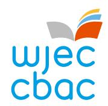
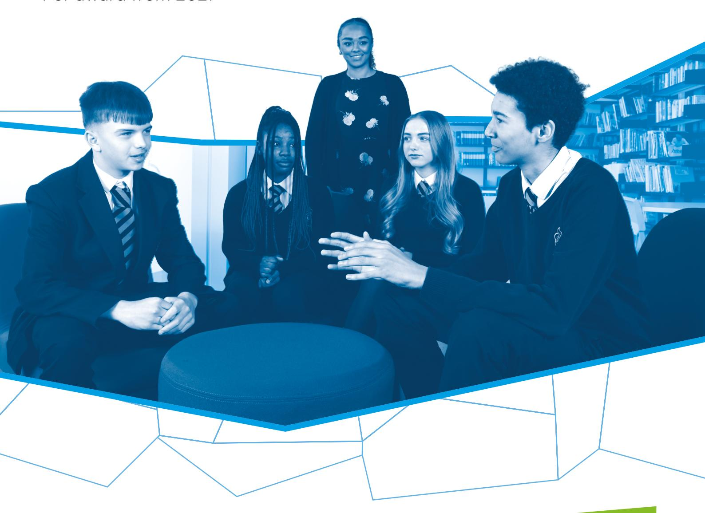

{1}------------------------------------------------

# WJEC GCSE Religious Studies

Approved by Qualifications Wales

Guidance for Teaching: Unit 2

Teaching from 2025 For award from 2027

Ready for the world. This Qualifications Wales regulated qualification is not available to centres in England.

Made for Wales.

{2}------------------------------------------------

{3}------------------------------------------------

# **Contents**

| Introduction                                 | 1  |
|----------------------------------------------|----|
| Aims of the Guidance for Teaching            | 1  |
| Additional ways that WJEC can offer support: | 1  |
| Qualification Structure                      | 2  |
| Assessment                                   | 2  |
| Summary of Assessment Unit 2                 | 2  |
| Overview of Unit 2                           | 3  |
| Unit 2 Assessment objectives and weightings  | 4  |
| Unit 2 Teacher Guidance                      | 5  |
| 2.1 Religion and relationships               | 5  |
| 2.2 Religious Studies skills                 | 10 |
| Glossary of Terms for Unit 2                 | 15 |
| Finding appropriate sources                  | 18 |

{4}------------------------------------------------

# Introduction

The WJEC GCSE Religious Studies has been approved by Qualifications Wales and is available to all centres in Wales. It will be awarded for the first time in Summer 2027, using grades A\* to G.

## Aims of the Guidance for Teaching

The principal aim of the Guidance for Teaching is to support teachers in the delivery of WJEC GCSE Religious Studies and to offer guidance on the requirements of the qualification and the assessment process. The Guidance for Teaching is **not intended as a comprehensive reference**, but as support for teachers to develop stimulating and exciting courses tailored to the needs and skills of their learners. The guide offers possible classroom activities and links to useful resources (including our own, freely available digital materials and some from external sources) to provide ideas for immersive and engaging lessons.

## Additional ways that WJEC can offer support:

- sample assessment materials and mark schemes
- professional learning events
- examiners' reports on each unit
- direct access to the subject officer
- free online resources
- Exam Results Analysis
- Online Examination Review

{5}------------------------------------------------

# Qualification Structure

WJEC GCSE Religious Studies consists of 4 units. The qualification is unitised and does not contain tiering. Aside from Unit 1, which is an introductory unit, there is no hierarchy implied by the order in which the other units are presented.

|        | Unit title                                                      | Type of Assessment            | Weighting |
|--------|-----------------------------------------------------------------|-------------------------------|-----------|
| Unit 1 | Religious and non-religious beliefs, teachings and practices | Written examination           | 30%       |
| Unit 2 | Religion and relationships                                      | Non-examination assessment | 20%       |
| Unit 3 | Roles, rights and responsibilities                              | Written examination           | 30%       |
| Unit 4 | Religion and human rights                                       | Non-examination assessment | 20%       |

# Assessment

## Summary of Assessment Unit 2

**Unit 2: Religion and relationships Non-examination assessment: 6 hours 20% of qualification 60 marks**

Set by WJEC, marked by the centre and moderated by WJEC. The assessment will be based on one of two set themes and a statement which will be set by WJEC annually. The set theme and statement will be available via the WJEC Portal.

The examinations for Units 1 and 3 will be available for the first time in summer 2026. The submission of Unit 2 will available for the first time in spring 2026. The submission of Unit 4 will be available for the first time in summer 2027.

The first award of the qualification will be 2027.

{6}------------------------------------------------

# Overview of Unit 2

Religion and relationships (20% of the qualification)

The purpose of this unit is to:

- develop and apply knowledge and understanding of religious beliefs, teachings and practices relating to relationships
- explore information and perspectives relating to religious and non-religious beliefs, and relationships
- analyse and evaluate different religious and non-religious perspectives towards relationships
- reflect on personal values and beliefs relating to relationships.

## Overview of arrangements for non-examination assessment

Each year, WJEC will select **two** of the following set themes and will provide a statement associated with each theme:

- a) Marriage, adultery, divorce and remarriage
- b) Artificial contraception and natural family planning
- c) Cohabitation and sex before and outside marriage
- d) Same-sex relationships, civil partnerships and same-sex marriage
- e) Interfaith relationships and marriage outside the religious tradition
- f) Roles within family, including gender roles within relationships
- g) Religious upbringing, childhood ceremonies and faith-based schooling.

The themes and associated statements will be set by WJEC annually and available via the WJEC Portal in September during the first year of study and every year thereafter.

Centres will choose **one** theme and an associated statement as the focus of the nonexamination assessment tasks.

The assessment must be based on the **two** religions studied in all other units (Christianity or Catholic Christianity and a world religion), and non-religious beliefs.

This assessment contributes to 20% of the overall qualification grade.

This unit will be assessed through an externally set assignment and will be marked by the centre and moderated by WJEC. Assessments must be submitted digitally (they may be handwritten and scanned or completed digitally).

| In this unit, learners will develop knowledge, skills and understanding in: |                            |  |
|-----------------------------------------------------------------------------|----------------------------|--|
| 2.1                                                                         | Religion and relationships |  |
| 2.2                                                                         | Religious Studies skills   |  |

{7}------------------------------------------------

## Unit 2 Assessment objectives and weightings

| AO2 | Apply knowledge and understanding of religious and non-religious beliefs, teachings, practices, values and philosophical convictions                                                  | 5%  |
|-----|---------------------------------------------------------------------------------------------------------------------------------------------------------------------------------------------|-----|
| AO3 | Analyse, evaluate, or make judgements on a variety of ethical and moral issues, religious and non-religious beliefs, teachings, practices, values and philosophical convictions | 10% |
| AO4 | Select, use and apply skills and techniques in practice relevant to the study of Religious Studies                                                                                       | 5%  |

{8}------------------------------------------------

# Unit 2 Teacher Guidance

| 2.1 Religion and relationships                                                             |                                                                                                                                                                                                                                                                                                                                                                                                                                                                                                                                                                                                                                                                                                                                                                               |                                                                                                                                                                                                                                                                                                                                                                                                                                                                                                                                                                                                                                                                                                                                                                                                                                                                                                                                                                                                                                                                                                                                                                                      |
|-----------------------------------------------------------------------------------------------|-------------------------------------------------------------------------------------------------------------------------------------------------------------------------------------------------------------------------------------------------------------------------------------------------------------------------------------------------------------------------------------------------------------------------------------------------------------------------------------------------------------------------------------------------------------------------------------------------------------------------------------------------------------------------------------------------------------------------------------------------------------------------------|--------------------------------------------------------------------------------------------------------------------------------------------------------------------------------------------------------------------------------------------------------------------------------------------------------------------------------------------------------------------------------------------------------------------------------------------------------------------------------------------------------------------------------------------------------------------------------------------------------------------------------------------------------------------------------------------------------------------------------------------------------------------------------------------------------------------------------------------------------------------------------------------------------------------------------------------------------------------------------------------------------------------------------------------------------------------------------------------------------------------------------------------------------------------------------------|
| Content Amplification                                                                         |                                                                                                                                                                                                                                                                                                                                                                                                                                                                                                                                                                                                                                                                                                                                                                               | Teacher Guidance                                                                                                                                                                                                                                                                                                                                                                                                                                                                                                                                                                                                                                                                                                                                                                                                                                                                                                                                                                                                                                                                                                                                                                     |
| 2.1.1 Beliefs, teachings, practices and perspectives relating to relationships | Learners should understand: • religious beliefs, teachings, practices and perspectives relating to relationships. • non-religious perspectives relating to relationships. Learners will focus on one of two themes set annually by WJEC from the following list: a) Marriage, adultery, divorce and remarriage b) Artificial contraception and natural family planning c) Cohabitation and sex before and outside marriage d) Same-sex relationships, civil partnerships and same-sex marriage e) Interfaith relationships and marriage outside the religious tradition f) Roles within family, including gender roles within relationships g) Religious upbringing, childhood ceremonies and faith-based schooling. | The centre will need to decide which theme, out of the two themes set by WJEC for the year, they are going to study. Ensure that teachers and learners have a clear understanding of the statement associated with the chosen theme. This will support the centre and the learner to recognise the focus for their research. Task 1 This research work is required to complete the requirements of task one of the NEA. It is important to recognise that there is a restriction of four sides of A4 notes, this needs to include all research from Christianity or Catholic Christianity, the second religion and non- religious perspectives. Each learner will need to complete this work individually and independently. Task 1 has a completion time of 1 hour and 30 minutes. This work is to be completed under indirect supervision. The learner will need to: • summarise the relevant beliefs, teachings, practices and perspectives of the two religions studied in relation to the statement provided • summarise the relevant non-religious beliefs and perspectives in relation to the statement provided. |

{9}------------------------------------------------

This piece of work focuses on Assessment Objective 2 (*Apply knowledge and understanding of religious and non-religious beliefs, teachings, practices, values, and philosophical convictions*) and is centre marked out of 15 marks.

If the learner is part of the sample submitted to WJEC their research notes will have to be submitted with their final work for moderation.

An understanding of religious beliefs, teachings, practices and perspectives relating to relationships from Christianity or Catholic Christianity will be needed to access this work. The focus should be on the theme that the centre has chosen to focus on from the prereleased information.

It is important to consider diverse views and perspectives within Christianity or Catholic Christianity.

An understanding of religious beliefs, teachings, practices and perspectives relating to relationships from the centre's second religion will be needed to access this work. The focus should be on the theme that your centre has chosen to focus on from the pre-released information.

It is important to consider diverse views and perspectives within your centre's second religion.

An understanding of non-religious perspectives related to relationships will be needed to access this work. The focus should be on the theme that your centre has chosen to focus from the prereleased information.

It is important to consider diverse views and perspectives within nonreligious perspectives.

{10}------------------------------------------------

|                                                                                             |                                                                                                                                                                                                                                                                                                                                                                                                                                                                                                                                                     | Consideration of sources of authority from both religious and non-religious perspectives will be needed as evidence to support their views and beliefs. The quality of the notes the candidate makes at this stage are important because they will use them later to address other parts of the assessment.                                                                                                                                                                                                                                                                                                                                                                                                                                                                                                                                                                                                                                                                                                                                                                                                                                                                                       |
|---------------------------------------------------------------------------------------------|-----------------------------------------------------------------------------------------------------------------------------------------------------------------------------------------------------------------------------------------------------------------------------------------------------------------------------------------------------------------------------------------------------------------------------------------------------------------------------------------------------------------------------------------------------|------------------------------------------------------------------------------------------------------------------------------------------------------------------------------------------------------------------------------------------------------------------------------------------------------------------------------------------------------------------------------------------------------------------------------------------------------------------------------------------------------------------------------------------------------------------------------------------------------------------------------------------------------------------------------------------------------------------------------------------------------------------------------------------------------------------------------------------------------------------------------------------------------------------------------------------------------------------------------------------------------------------------------------------------------------------------------------------------------------------------------------------------------------------------------------------------------|
| 2.1.2 Similarities and differences in perspectives relating to relationships | Learners should understand the similarities and differences in beliefs, teachings, practices and perspectives relating to relationships, including: between different religionsbetween religions and non-religious perspectives.Learners should have a basic understanding of: the changing landscape of religious belief in the context of relationshipswhere appropriate, relevant changes to UK law linked to relationshipshow the changing landscape of religious belief and changes in relevant UK law, where appropriate, interconnect. | Task 2 This work forms task 2 of the NEA. Making use of the notes made in preparation for task 1 and their task 1 answer, the learner now needs to consider the similarities and differences between the different religions and between the religions and non-religious perspectives. The learner needs to examine the similarities and differences in beliefs, teachings, practices and perspectives including: any similarities between the two religions studiedany differences between the two religions studiedany similarities between each religion and the non-religious perspectivesany differences between each religion and the non-religious perspectives.The submitted work needs to be competed under direct supervision and should take one hour. This work focuses on Assessment Objective 3 (Analyse, evaluate, or make judgements on a variety of ethical and moral issues, religious and non-religious beliefs, teachings, practices, values, and philosophical convictions) and is centre marked out of 10 marks. If the learner is part of the sample their work will be submitted to the WJEC for moderation. This section naturally follows on from 2.1.1. |

{11}------------------------------------------------

Learners will be unable to make comparisons until they know the beliefs, teachings, practices and perspectives (both religious and non religious ). Once this is understood the centre can support learners to make comparisons. There is a need to compare:

- within Christianity or Catholic Christianity
- within the centre's second religion
- within non-religious perspectives
- across Christianity or Catholic Christianity and the centre's second religion
- across Christianity or Catholic Christianity and non -religious perspectives
- across the centre's second religion and non -religious perspectives.

Clear consideration will need to be given to how religious beliefs have changed over time as society, laws and attitudes have changed.

There is a need to consider any changes in legislation, UK law and any Wales -specific legislation around relationships, such as:

- marriage laws
- divorce laws
- contraception laws – legalisation of the pill
- civil partnership laws
- same sex marriage laws
- education laws including faith -based schooling
- Equalities Act 2010.

Consideration also needs to be given to the effects of the changes in law and attitudes and the response of religion to these changes, such as:

- changes in contraception law and the changing attitudes of religious believers to the use of contraception
- same sex marriage and being able to marry in a place of worship
- the changing attitudes within some religious traditions towards

{12}------------------------------------------------

cohabitation

- religious responses to interfaith relationships and marriage outside the religious tradition
- the changing roles within family, such as, gender roles within relationships.

Whilst competing this section of work, it would be beneficial for learners to consider their own thoughts, views and beliefs in relation to relationships to assist them in developing their own values, beliefs and views in preparation for task 5 of the NEA.

This work will all link to task 2 of the NEA. It is important to recognise that learners will only be able to make use of the four sides of A4 notes and their answer to task 1 whilst completing this work.

{13}------------------------------------------------

## Religious Studies skills

### Selecting or producing suitable sources

Learners should be able to:

- select or produce suitable sources to gain insights into religious and non-religious perspectives and experiences
- • explain relevant reasons for selecting sources, such as:
  - to provide clear information, supported by reasoning and/or evidence
  - to prove the reliability of another source used
  - to provide a different perspective leading to greater understanding
  - to help diminish any bias
  - to provide a different source type, leading to greater understanding
  - to provide evidence of lived experience.

### Task 3

This section focuses on learners' ability, supported by teachers, to select or produce suitable sources to help them complete the NEA. As such, centres need to support learners in recognising appropriate sources for use.

This work will be collated and used within task 3 of the NEA.

Learners are asked, based on the statement provided, to explain why they have selected or produced each source. In their answer, they could refer to one or more of the following:

- to provide clear information, supported by reasoning and/or evidence
- to prove the reliability of another source used
- to provide a different perspective leading to greater understanding
- to help diminish any bias
- to provide a different source type, leading to greater understanding
- to provide evidence of lived experience.

Learners are restricted to no more than six pages of sources. These must be retained by the centre, and submitted with the candidate's work for moderation should the learner be part of the sample.

This work should be indirectly supervised and should take 1 hour.

This work focuses on Assessment Objective 4 (*Select, use and apply skills and techniques in practice relevant to the study of Religious Studies*) and is centre marked out of 10 marks.

If the learner is part of the sample their work will be submitted to the WJEC for moderation.

{14}------------------------------------------------

There is a need to ensure that there are sources from the different perspectives:

- Christianity or Catholic Christianity
- the second religion chosen by the centre
- non-religious perspectives.

A range of sources is needed to show diversity within the different perspectives.

Relevant data on relationships is needed. This could include Census data and/or data from the Office of National Statistics (ONS) looking at matters, such as:

- marriage rates
- divorce rates
- birth rates
- family type.

Centres need to ensure that learners do not exceed the total amount of sources that can be used within this section of the NEA (*A maximum of six written or printed sources for use within task 3*).

Sources that could be used include:

- census data
- documentaries
- interviews
- online sources
- opinion polls
- surveys.

{15}------------------------------------------------

An understanding of how to recognise relevant sources is required. Learners will need to consider:

- what sources to use (both first hand and second hand)
- the validity of their chosen sources Have the sources come from a trustworthy website, organisation or individual? Do we know who has written the source? Is it a first hand or second-hand source?
- the reliability of their sources Is the source current? Is any data included referenced? Is the data included current? Is the information shared reflective of current thinking of organisations mentioned in the source?
- The relevance of the content of the chosen sources Does the source contribute to the relationships issue being considered?
- the importance of collating a range of sources for different purposes – Has enough variety of sources been used?
- recognising if a source contains bias Do the sources only speak from one perspective? Has the source been written for a particular audience, reason or to shock?
- ensuring that the source contains evidence of lived experience Is there a source that takes into consideration personal religious views because of their religious beliefs and teachings? Personal philosophical convictions of non-religious believers? professional and non-professional?

Learners could consider techniques such as:

- Social, Technological, Economic, Political, Legal and Ethical (STEEPLE)
- Currency, Relevance, Authority, Accuracy and Purpose (CRAAP)
- Reliable, Up-to-date, Relevant, Useful (RURU) assist learners with focusing how to recognise suitable sources for use.

{16}------------------------------------------------

| 2.2.2            |
|------------------|
| Using sources to |
| support a        |
| judgement        |

Learners should be able to use relevant sources:

- to analyse and evaluate religious and nonreligious perspectives about relationships
- to reach a judgement

### Task 4

This section focuses on task 4 of the NEA.

Learners are required to analyse and evaluate the statement provided. They must refer to religious and non-religious beliefs, teachings, practices and perspectives in their answer.

Learners can make use of the following to complete this piece of work:

- a maximum of four sides of A4 written or typed research notes that they have used for task 1 and 2
- a maximum of six written or printed sources that they have used for task 3
- their own answers for tasks 1, 2, 3.

This work should be completed under supervision and should take two hours.

This work focuses on Assessment Objective 3 (*Analyse, evaluate, or make judgements on a variety of ethical and moral issues, religious and non-religious beliefs,* teachings, practices, values, and philosophical convictions) and is centre marked out of 20 marks.

This work must be retained by the centre, and submitted with the candidate's work should it be required for moderation.

Prior to learners completing this task in the NEA, teachers will need to support and guide them with how to analyse and evaluate the different perspectives from both religious and non-religious perspectives on relationships and how to make judgements on these perspectives (if not previously competed as part of 2.1.1).

{17}------------------------------------------------

| 2.2.3 Reflecting on personal values and beliefs                                                                                                                 | Learners should be able to: • justify their own values and beliefs relating to relationships. | Task 5                                                                                                                                                                                                                                        |
|--------------------------------------------------------------------------------------------------------------------------------------------------------------------------|--------------------------------------------------------------------------------------------------------|-----------------------------------------------------------------------------------------------------------------------------------------------------------------------------------------------------------------------------------------------|
|                                                                                                                                                                          |                                                                                                        | This section focuses on task 5 of the NEA.                                                                                                                                                                                                 |
| Learners are required to justify their own values and beliefs in relation to the statement provided (they could reflect on their findings from previous tasks). |                                                                                                        | Learners can make use of their responses for tasks 1, 2, 3 and 4 whilst completing this piece of work.                                                                                                                               |
| This work should be completed under indirect supervision and should take approximately thirty minutes.                                                                |                                                                                                        | This work focuses on Assessment Objective 4 (Select, use and apply skills and techniques in practice relevant to the study of Religious Studies) and is centre marked out of 5 marks.                                                |
| This work must be retained by the centre, and submitted with the candidate's work should it be required for moderation.                                               |                                                                                                        | Learners have had the opportunity to consider their own thoughts, views and beliefs relation to relationships when completing work in section 2.1.2. Learners will need the opportunity to revisit this prior to competing the task. |

{18}------------------------------------------------

## Glossary of Terms for Unit 2

| Term                                            | Definition                                                                                                                                                                                                                                                                                                                                            |
|-------------------------------------------------|-------------------------------------------------------------------------------------------------------------------------------------------------------------------------------------------------------------------------------------------------------------------------------------------------------------------------------------------------------|
| adultery                                        | Voluntary sexual intercourse between a married person and a person who is not their spouse.                                                                                                                                                                                                                                                        |
| annulment                                       | This is when a church, or a court of law, declares that your marriage is not valid.                                                                                                                                                                                                                                                                |
| artificial contraception                        | The artificial and chemical methods used to prevent pregnancy taking place. They act as a barrier to new life e.g. the condom which is a physical barrier preventing sperm from reaching the egg, and the contraceptive pill, a chemical barrier preventing the woman from ovulating each month.                                          |
| bigamy                                          | Marrying someone while still being legally married to someone else. This is illegal in the UK.                                                                                                                                                                                                                                                     |
| celibate                                        | The decision not to have sexual relationships.                                                                                                                                                                                                                                                                                                        |
| chastity                                        | The decision not to have sex until marriage.                                                                                                                                                                                                                                                                                                          |
| childhood ceremonies                            | They are cultural, social and religious ceremonies that mark significant events in a child's life. They include initiation ceremonies, coming-of-age rites, and other celebrations that reflect the customs and beliefs of a community.                                                                                                      |
| childless family                                | This is where a married or cohabiting couple are either unable to have children or decide not to have children.                                                                                                                                                                                                                                    |
| civil partnership                               | Is a legal relationship which can be registered by two people who aren't related to each other. Civil partnerships are available to both same-sex couples and opposite-sex couples. Registering a civil partnership will give your relationship legal recognition. This will give you added legal rights, as well as responsibilities. |
| cohabitation                                    | To live together in a sexual relationship without being married or in a civil partnership.                                                                                                                                                                                                                                                         |
| divorce                                         | To legally end a marriage.                                                                                                                                                                                                                                                                                                                            |
| emergency contraception                      | Also known as the morning after pill, can be taken up to three days after unprotected sex. It will stop the production of an egg and/or stops eggs from sticking to the side of the womb. If the egg has been fertilised it will stop it from developing any further.                                                                        |
| extended family                                 | This is when a number of adults and children who are related live in the same home. This may also include relatives who live nearby, for example, cousins, aunts, uncles and grandparents all sharing family roles.                                                                                                                          |
| extra-marital sex                               | When a married person has a sexual relationship with someone other than their marriage partner.                                                                                                                                                                                                                                                    |
| Term                                            | Definition                                                                                                                                                                                                                                                                                                                                            |
| faith-based schools                             | Faith-based schools are educational institutions that accommodate students and parents leaning toward a certain religious background or set of values.                                                                                                                                                                                                |
| gender                                          | A group of people in a society who share particular qualities or ways of behaving which that society associates with being male, female or non-binary. A person's gender does not always align with the sex they were registered at birth.                                                                                                            |
| interfaith marriage                             | A marriage of two people of different religions or none.                                                                                                                                                                                                                                                                                              |
| interfaith relationship                         | The interaction between people of different religions or faith traditions.                                                                                                                                                                                                                                                                            |
| marriage                                        | This is a legally recognised union between two individuals. It is formalised through a wedding ceremony or a legal process.                                                                                                                                                                                                                           |
| matriarchal                                     | A society controlled by women.                                                                                                                                                                                                                                                                                                                        |
| monogamy                                        | Being married to one person at one time.                                                                                                                                                                                                                                                                                                              |
| natural family planning / natural contraception | Natural contraception would involve abstaining (going without sex) from sex during the time of the month when the woman is most likely to conceive. This form of contraception is approved by the Roman Catholic Church. It teaches that these methods are given by God to help a couple plan their family.                                           |
| nuclear family                                  | This type of family consists of two parents and one child or more living in the same house. This is the most common type of family in modern Britain.                                                                                                                                                                                                 |
| patriarchal                                     | A society controlled by men.                                                                                                                                                                                                                                                                                                                          |
| polygamy                                        | The practice of having more than one wife or husband at the same time.                                                                                                                                                                                                                                                                                |
| primary sources                                 | Original materials or documents, including (but not limited to) sacred texts, first interpretations, books and sermons, writing by religious officials, etc.                                                                                                                                                                                          |
| reconstituted family                            | Sometimes parents will divorce and remarry or cohabit with a new partner. This may lead to the creation of a reconstituted family which is made up of a mix of stepparents and stepchildren.                                                                                                                                                          |
| remarriage                                      | A marriage that takes place after a previous marriage has ended, as a result of divorce or widowhood.                                                                                                                                                                                                                                                 |
| responsibilities                                | Actions/duties you are expected to/feel obligated to carry out.                                                                                                                                                                                                                                                                                       |
| roles                                           | Position, status or function of a person in society, as well as the characteristics and social behaviour expected of them.                                                                                                                                                                                                                            |
| same-sex marriage                               | The legal marriage of two people of the same sex.                                                                                                                                                                                                                                                                                                     |
| same-sex relationships                          | A sexual relationship between two people of the same sex.                                                                                                                                                                                                                                                                                             |
| secondary sources                               | Materials that engage with and draw on primary sources through analysis, interpretation or summarising. They are created after the primary sources. Examples include (but are                                                                                                                                                                         |
|                                                 | not limited to) documents such as published literature and review articles.                                                                                                                                                                                                                                                                        |
| sex before marriage                             | Having a sexual relationship with another individual before marriage.                                                                                                                                                                                                                                                                              |
| sex outside marriage                            | Having a sexual relationship outside of a marriage, often known as extra-marital sex.                                                                                                                                                                                                                                                              |
| single-parent family                            | This is where one parent raises one child or more alone. The number of single parent families has continued to rise in modern Britain, partly because of an increase in the divorce rate. However, it could be a matter of choice, or because of the death of a husband or wife.                                                          |

{19}------------------------------------------------

{20}------------------------------------------------

{21}------------------------------------------------

# Finding appropriate sources

It is important to incorporate a range of source types within the unit, so that learners are familiar with, and equipped to analyse and evaluate, different sources and interpretations.

Sources can take a variety of forms, for example written documents, pictorial evidence or oral accounts, however they must adhere to the guidelines relevant to the Unit/Task being assessed.

The sources should be evaluated for their value to the set task. Encourage the candidates to address issues such as:

- What information does the source provide?
- Does the source back up your knowledge?
- Who was the author/maker?
- When was the source written?
- Why was it written?
- Is there any doubt over the author/maker? Is he/she trustworthy?

Look at each source on its merits and avoid mechanical phrases and comments.

## Primary Sources

These are original materials or documents, including (but not limited to) sacred texts, first interpretations, books and sermons, writing by religious officials, etc.

## Secondary Sources

These are materials that engage with and draw on primary sources through analysis, interpretation or summarising. They are created after the primary sources. Examples include (but are not limited to) documents such as published literature and review articles.

### Where to find appropriate items

Centres might find useful items to use in their Unit on the following platforms:

- The National Library of Wales [National Library of Wales [Llyfrgell Genedlaethol Cymru\]](https://www.library.wales/)
- People's Collection Wales [\[The Collection | Peoples Collection Wales\]](https://www.peoplescollection.wales/discover)
- National Centre for Religious Education in Wales [\[National Centre for Religions](https://www.bangor.ac.uk/history-law-social-sciences/national-centre-for-religious-education-in-wales)  [Education in Wales\]](https://www.bangor.ac.uk/history-law-social-sciences/national-centre-for-religious-education-in-wales)
- The National Archives [\[The National Archives\]](https://www.nationalarchives.gov.uk/).