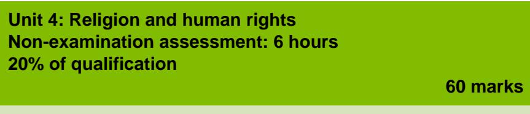

{1}------------------------------------------------

# WJEC GCSE Religious Studies

Approved by Qualifications Wales

Guidance for Teaching: Unit 4

Teaching from 2025 For award from 2027

Ready for the world. This Qualifications Wales regulated qualification is not available to centres in England.

Made for Wales.

{2}------------------------------------------------

{3}------------------------------------------------

# **Contents**

| Introduction                                            |    |
|---------------------------------------------------------|----|
| Aims of the Guidance for Teaching                       | 1  |
| Additional ways that WJEC can offer support:            | 1  |
| Qualification Structure                                 | 2  |
| Assessment                                              | 2  |
| Summary of Assessment Unit 4                            |    |
| Overview of Unit 4                                      | 3  |
| Overview of arrangements for non-examination assessment | 3  |
| Unit 4 Assessment objectives and weightings             | 4  |
| Unit 4 Teacher Guidance                                 | 5  |
| 4.1 Human rights                                        | 5  |
| 4.2 Religious Studies skills                            | 9  |
| Glossary of terms for Unit 4                            | 14 |
| Finding appropriate sources                             | 17 |

{4}------------------------------------------------

# Introduction

The WJEC GCSE Religious Studies has been approved by Qualifications Wales and is available to all centres in Wales. It will be awarded for the first time in Summer 2027, using grades A\* to G.

### Aims of the Guidance for Teaching

The principal aim of the Guidance for Teaching is to support teachers in the delivery of WJEC GCSE Religious Studies and to offer guidance on the requirements of the qualification and the assessment process. The Guidance for Teaching is **not intended as a comprehensive reference**, but as support for teachers to develop stimulating and exciting courses tailored to the needs and skills of their learners. The guide offers possible classroom activities and links to useful resources (including our own, freely available digital materials and some from external sources) to provide ideas for immersive and engaging lessons.

### Additional ways that WJEC can offer support:

- sample assessment materials and mark schemes
- professional learning events
- examiners' reports on each unit
- direct access to the subject officer
- free online resources
- Exam Results Analysis
- Online Examination Review

{5}------------------------------------------------

# Qualification Structure

WJEC GCSE Religious Studies consists of 4 units. The qualification is unitised and does not contain tiering. Aside from Unit 1, which is an introductory unit, there is no hierarchy implied by the order in which the other units are presented.

|        | Unit title                                                      | Type of Assessment            | Weighting |
|--------|-----------------------------------------------------------------|-------------------------------|-----------|
| Unit 1 | Religious and non-religious beliefs, teachings and practices | Written examination           | 30%       |
| Unit 2 | Religion and relationships                                      | Non-examination assessment | 20%       |
| Unit 3 | Roles, rights and responsibilities                              | Written examination           | 30%       |
| Unit 4 | Religion and human rights                                       | Non-examination assessment | 20%       |

# Assessment

Summary of Assessment Unit 4

Set and marked by WJEC. The assessment will be based on two of three set human rights issues which will be set by WJEC annually. The set human rights issues will be available via the WJEC Portal.

The examinations for Units 1 and 3 will be available for the first time in summer 2026. The submission of Unit 2 will be available in spring 2026. The submission of Unit 4 will be available for the first time in summer 2027.

The first award of the qualification will be 2027.

{6}------------------------------------------------

# Overview of Unit 4

Religion and human Rights (20% of the qualification)

The purpose of this unit is to:

- consider human rights issues from religious and non-religious perspectives
- enable an awareness of the importance of human rights issues in contemporary society through the lens of religious studies
- reflect on personal values and beliefs relating to human rights

Learners must complete tasks based on the **two** religions studied (Christianity or Catholic Christianity and a world religion) in all other units, **and** non-religious perspectives.

### Overview of arrangements for non-examination assessment

Each year, WJEC will select three of the following human rights issues:

- gender equality
- LGBTQ+ rights
- racial equality of Black, Asian and minority ethnic people and communities
- the right to education
- the right to freedom from slavery and forced labour
- the right to life and freedom from capital punishment
- the right to seek justice for human rights violations
- the rights of people with disabilities
- the rights of refugee and asylum seekers.

The themes will be set by WJEC annually and available via the WJEC Portal in September of the second year of study and every year thereafter.

Centres will choose **two** human rights issues as the focus of the non-examination assessment tasks.

The assessment must be based on the **two** religions studied in all other units (Christianity or Catholic Christianity and a world religion) and non-religious beliefs.

This assessment contributes to 20% of the overall qualification grade.

This unit will be assessed through an externally set assignment and will be set and marked by WJEC. Assessments must be submitted digitally (they may be handwritten and scanned or completed digitally).

| In this unit, learners will develop understanding in: |                          |
|-------------------------------------------------------|--------------------------|
| 4.1                                                   | Human rights             |
| 4.2                                                   | Religious Studies skills |

{7}------------------------------------------------

#### Unit 4 Assessment objectives and weightings

| AO2 | Apply knowledge and understanding of religious and non-religious beliefs, teachings, practices, values, and philosophical convictions                                                  | 10% |                                                                                                 | Content Amplification                                                                                                                                                                                                                                                                                                                                                                                                                                                                                                                                                                                                                                                                                                                                                                                  | Teacher Guidance                                                                                                                                                                                                                                                                                                                                                                                                                                                                                                                                                                                                                                                                                                                                                                                                                                                                                                                                                                                                                                                      |
|-----|----------------------------------------------------------------------------------------------------------------------------------------------------------------------------------------------|-----|-------------------------------------------------------------------------------------------------|--------------------------------------------------------------------------------------------------------------------------------------------------------------------------------------------------------------------------------------------------------------------------------------------------------------------------------------------------------------------------------------------------------------------------------------------------------------------------------------------------------------------------------------------------------------------------------------------------------------------------------------------------------------------------------------------------------------------------------------------------------------------------------------------------------|-----------------------------------------------------------------------------------------------------------------------------------------------------------------------------------------------------------------------------------------------------------------------------------------------------------------------------------------------------------------------------------------------------------------------------------------------------------------------------------------------------------------------------------------------------------------------------------------------------------------------------------------------------------------------------------------------------------------------------------------------------------------------------------------------------------------------------------------------------------------------------------------------------------------------------------------------------------------------------------------------------------------------------------------------------------------------|
| AO3 | Analyse, evaluate, or make judgements on a variety of ethical and moral issues, religious and non-religious beliefs, teachings, practices, values, and philosophical convictions | 5%  | 4.1.1 Beliefs, teachings, practices and perspectives relating to human rights | Learners should understand: • religious beliefs, teachings, practices and perspectives relating to human rights • non-religious perspectives relating to human rights • relevant articles of the Universal Declaration of Human Rights. Learners will focus on two of three human rights issues set annually by WJEC from the following list: • gender equality • LGBTQ+ rights • racial equality of Black, Asian and minority ethnic people and communities • the right to education • the right to freedom from slavery and forced labour • the right to life and freedom from capital punishment • the right to seek justice for human rights violations • the rights of people with disabilities • the rights of refugee and asylum seekers. | The centre will need to decide which two human rights issues, out of the three human rights issues set by WJEC for the year, they are going to study. During the pre-assessment period, learners will need to research and collect information on the following: • the relevant articles of the Universal Declaration of Human Rights • the relevant beliefs, teachings, practices and perspectives from the religions studied • relevant beliefs and non-religious perspectives. This research can be written or typed but must not be more than six pages in length. This work and the work completed in 4.2.1 is needed to be able to complete tasks 2 and 3 of the NEA. Tasks 2 and 3 Each learner will need to complete task 2 and 3 individually. Task 2 focuses on the first charity or organisation and task 3 focuses on the second charity or organisation. Tasks 2 and 3 have a completion time of 1 hour 30 minutes each (3 hours in total). This work is to be completed under direct supervision. |
| AO4 | Select, use and apply skills and techniques in practice relevant to the study of Religious Studies                                                                                        | 5%  |                                                                                                 | Learners should have a broad understanding of the aims, purposes and key principles of the Universal Declaration of Human Rights.                                                                                                                                                                                                                                                                                                                                                                                                                                                                                                                                                                                                                                                                |                                                                                                                                                                                                                                                                                                                                                                                                                                                                                                                                                                                                                                                                                                                                                                                                                                                                                                                                                                                                                                                                       |

{8}------------------------------------------------

# Unit 4 Teacher Guidance

{9}------------------------------------------------

Learners will need to write a summary of their research ensuring that they consider:

- the relevant articles of the Universal Declaration of Human Rights
- how the work of the first charity or organisation supports the relevant articles of the Universal Declaration of Human Rights
- the relevant beliefs, teachings, practices and perspectives from the two religions studied
- relevant beliefs and non-religious perspectives.

These pieces of work focus on Assessment Objective *2 (Apply knowledge and understanding of religious and non-religious beliefs, practices and teachings)* and the work is marked out of 15 marks for each task.

All this work including the research notes will have to be submitted to WJEC for marking.

An understanding of religious beliefs, teachings, practices and perspectives relating to human rights from Christianity or Catholic Christianity will be needed to access this work. The focus should be on the two human rights issues that the centre has chosen to focus on from the pre-released information.

It is important to consider diversity of views and perspectives within Christianity or Catholic Christianity.

An understanding of religious beliefs, teachings, practices and perspectives relating to human rights from the centres second religion will be needed to access this work. The focus should be on the two human rights issues that the centre has chosen to focus on from the pre-released information.

It is important to consider diversity of views and perspectives within the centre's second religion.

{10}------------------------------------------------

An understanding of non-religious perspectives related to human rights will be needed to access this work. The focus should be on the two human rights issues that the centre has chosen to focus from the pre-released information.

It is important to consider diversity of views and perspectives within nonreligious perspectives.

Consideration of sources of authority from both religious and non-religious perspectives will be needed as evidence to support their views and beliefs.

Work will need to be completed on the Universal Declaration of Human Rights [\(Universal Declaration of Human Rights | OHCHR\)](https://www.ohchr.org/en/universal-declaration-of-human-rights) to ensure a broad understanding of them. Additionally, particular focus will need to be given to the relevant human rights issues your centre will focus on.

The relevant articles of human rights [\(30 articles on the 30 Articles of the](https://www.ohchr.org/en/press-releases/2018/11/30-articles-30-articles-universal-declaration-human-rights)  [Universal Declaration of Human Rights | OHCHR\)](https://www.ohchr.org/en/press-releases/2018/11/30-articles-30-articles-universal-declaration-human-rights) focus on:

- the right to education
- the right to freedom from slavery and forced labour
- the right to life and freedom from capital punishment
- the right to seek justice for human rights violations
- the rights of people with disabilities
- the rights of refugee and asylum seekers.

There may be more than one article relevant to the human rights issues your setting will be focusing on. It is noted in the sample assessment materials that you should not use more than five of the articles.

{11}------------------------------------------------

Learners will need to collate all the above knowledge and understanding into personal notes for use within the tasks of the NEA. These notes need to be no more than six pages of written or printed notes that can be used in tasks 2, 3, 4 and 5 of the NEA. These pages will be submitted alongside the work completed by learners on the tasks.

It would be advantageous to analyse and evaluate the religious and nonreligious beliefs, teachings, practices and perspectives as this work is being completed to assist with the completion of 4.2.2 work within the NEA.

It would be advantageous to analyse and evaluate the purpose, aims and work of the charities or organisations chosen by your setting to assist with the completion of 4.2.2 work within the NEA.

Whilst competing this section of work, it would be beneficial for learners to consider their own thoughts, views and beliefs in relation to human rights to assist them in developing their own values, beliefs and views in preparation for task 5 of the NEA.

{12}------------------------------------------------

| 4.2 Religious Studies skills                                           |                                                                                                                                                                                                                                                                                                                                                     |                                                                                                                                                                                                                                                                                                                                                                                                                                                                                                                                                                                                                                                                                                                                                                                                                                                                                                                                                                                                                                                                                                                                                                                                                                                                                                                                                 |
|------------------------------------------------------------------------|-----------------------------------------------------------------------------------------------------------------------------------------------------------------------------------------------------------------------------------------------------------------------------------------------------------------------------------------------------|-------------------------------------------------------------------------------------------------------------------------------------------------------------------------------------------------------------------------------------------------------------------------------------------------------------------------------------------------------------------------------------------------------------------------------------------------------------------------------------------------------------------------------------------------------------------------------------------------------------------------------------------------------------------------------------------------------------------------------------------------------------------------------------------------------------------------------------------------------------------------------------------------------------------------------------------------------------------------------------------------------------------------------------------------------------------------------------------------------------------------------------------------------------------------------------------------------------------------------------------------------------------------------------------------------------------------------------------------|
| Content Amplification                                                  | Teacher Guidance                                                                                                                                                                                                                                                                                                                                    |                                                                                                                                                                                                                                                                                                                                                                                                                                                                                                                                                                                                                                                                                                                                                                                                                                                                                                                                                                                                                                                                                                                                                                                                                                                                                                                                                 |
| 4.2.1 Selecting and researching charities or organisations | Learners should be able to: • select local, national or global charities or organisations based on their aims and purpose, and how they campaign for human rights issues • research into the work of charities or organisations and how that work aligns with the relevant articles of the Universal Declaration of Human Rights. | Centres will need to choose two charities or organisations that work in the human rights issues the centre has chosen to study from the WJEC pre released information. Centres will need to ensure that they have two separate charities or organisations: one for each issue being studied. The learner needs to complete research on both charities/organisations focusing on: • the purpose and aims of each charity or organisation • how the purpose and aims reflect the human rights issues selected • how the work of the first charity or organisation supports the relevant articles of the Universal Declaration of Human Rights. The learners are only allowed a maximum of four A4 sides of paper written or typed as research notes for task 1. Task 1 Task 1 of the NEA asks learners to write a rationale on why they have chosen their two charities or organisations. Task 1 has a completion time of 30 minutes. This work can be completed under indirect supervision. This task focuses on Assessment Objective 4 (select, use and apply skills and techniques in practice relevant to the study of Religious Studies) and is marked out of 5 marks. This work including the research work part of the assessment will be submitted to WJEC for marking. |

{13}------------------------------------------------

The focus in this section is on charities or organisations that support the human rights issues listed in 4.1.1.

Centres and learners would have freedom to choose the most relevant and appropriate charities or organisations for the requirements of the task.

Charities or organisations that could be considered include (these are examples of some that could be used, they are **not** compulsory):

- Amnesty International<https://www.amnesty.org.uk/>
- Hope for justice [Hope for Justice | Bringing freedom from modern](https://hopeforjustice.org/)  [slavery](https://hopeforjustice.org/)
- Anti -slavery international Anti [-Slavery International | Fighting for](https://www.antislavery.org/)  [Freedom from Slavery](https://www.antislavery.org/)
- Human Rights Watch [Human Rights Watch | Defending Human](https://www.hrw.org/)  [Rights Worldwide](https://www.hrw.org/)
- UNICEF<https://www.unicef.org.uk/>
- UNHRC<https://help.unhcr.org/>
- Welsh Women's aid<https://welshwomensaid.org.uk/>
- Live life fear free<https://www.gov.wales/>
- British Red cross<https://donate.redcross.org.uk/>
- BASWO<https://bawso.org.uk/>
- Stonewall<https://www.stonewall.org.uk/>
- Umbrella Cymru Umbrella Cymru [Gender and Sexual Diversity](https://www.umbrellacymru.co.uk/)  [Support Specialists in Wales](https://www.umbrellacymru.co.uk/)
- Pride Cymru<https://www.pridecymru.com/>
- Race equality first [Combatting Racial Discrimination in Wales | Race](https://raceequalityfirst.org/)  [Equality First](https://raceequalityfirst.org/)
- Race Council Cymru<https://racecouncilcymru.org.uk/>
- Disability rights [Disability Rights UK | We are Disabled people](https://www.disabilityrightsuk.org/)  [working for an inclusive society](https://www.disabilityrightsuk.org/)
- Action for Children<https://www.actionforchildren.org.uk/>
- Save the Children<https://www.savethechildren.org.uk/>

{14}------------------------------------------------

Focused work will need to be completed on **two** charities or organisations, one for each human rights issue that the centre chooses to study.

When developing knowledge and understanding on these charities or organisations learners need support to ensure they consider:

- the aims and purpose of the charity or organisation
- how they campaign for the human rights issue
- how the work aligns with the relevant articles of the Universal Declaration of Human Rights.

As part of their work, learners will need to make individual personal notes to make use of when completing the NEA tasks. These notes need to be no more than four sides of A4 written or typed research notes that can be used in tasks 1, 2, 3, 4 and 5 of the NEA. These sources will need to be submitted with the learner's work.

It would be advantageous to analyse and evaluate the religious and non-religious beliefs, teachings, practices and perspectives as this work is being completed to assist with the completion of 4.2.2 work within the NEA.

It would be advantageous to analyse and evaluate the purpose, aims and work of the charities or organisations chosen by the centre to assist with the completion of 4.2.2 work within the NEA.

Whilst competing this section of work, it would be beneficial for learners to consider how their own thoughts, views and beliefs might align with the charities or organisations they have studied preparation for task 5 of the NEA.

{15}------------------------------------------------

#### 4.2.2

#### Considering the importance of human rights issues to society today

Learners should be able to analyse and evaluate the importance of human rights issues to society today based on:

- religious and non-religious perspectives
- purpose, aims and work of charities or organisations.

#### **Task 4**

This section focuses on task 4 of the NEA and needs to be completed under direct supervision. Task 4 has a completion time of 1 hour 30 minutes.

Learners are required to analyse and evaluate which of the two human rights issues selected is more important to society today. In their answer, they need to refer to the points below and come to a justified conclusion:

- religious perspectives of the two religions you have studied
- non-religious perspectives
- the purpose, aims and work of the two charities or organisations you have selected.

Learners can make use of all previous research notes and their answers from the previous tasks.

This task focuses on Assessment Objective 3 *(Analyse, evaluate, or make judgements on a variety of ethical and moral issues, religious and non-religious beliefs, teachings, practices, values and philosophical convictions)* and will be marked out of 15 marks. The completed work will be submitted to WJEC for marking.

Prior to learners completing this task in the NEA, teachers will need to support and guide them with how to analyse and evaluate the different perspectives (both religious and non-religious perspectives) on human rights and how to make judgements on these perspectives, if not previously competed as part of 4.1.1 and 4.2.1.

Prior to learners completing this task in the NEA, teachers will need to support and guide them with how to analyse and evaluate the purpose, aims and work of charities or organisations chosen by your setting and how to make judgements on these perspectives, if not previously competed as part of 4.1.1 and 4.2.1.

{16}------------------------------------------------

#### 4.2.3

#### Reflecting on personal values and beliefs

Learners should be able to:

- reflect on their own values and beliefs in relation to the human rights issue
- reflect on how their own values and beliefs align with charities or organisations.

#### **Task 5**

This section focuses on task 5 of the NEA and needs to be completed under indirect direct supervision.

Learners are required to explain which of the charities or organisations selected most aligns most with their own values and beliefs (they could reflect on their findings from previous tasks).

Learners can make use of all previous research notes and their answers from the previous tasks.

This task focuses on Assessment Objective 4 *(Select, use and apply skills and techniques in practice relevant to the study of Religious Studies)*

Task 5 has a completion time of 1 hour. This work is completed under indirect supervision.

This task will be submitted to WJEC for marking.

Prior to learners completing this task in the NEA, teachers will need to support and guide them with how to reflect on their own personal values and beliefs in relation to the **two** human rights issues studied by your setting, if not previously completed as part of 4.1.1. and 4.2.1 work.

Prior to learners completing this task in the NEA, teachers will need to support and guide them with how to reflect on their own personal values and beliefs, and how they align with those of the charities or organisations studied.

{17}------------------------------------------------

### Glossary of terms for Unit 4

| Term                | Definition                                                                                                                                                                                                                                                                                                                                                                                                       |
|---------------------|------------------------------------------------------------------------------------------------------------------------------------------------------------------------------------------------------------------------------------------------------------------------------------------------------------------------------------------------------------------------------------------------------------------|
| advocate            | A person who supports or recommends a particular cause or policy.                                                                                                                                                                                                                                                                                                                                             |
| arbitrary arrest    | The arrest or detention of an individual in a case in which there is no likelihood or evidence that they committed a crime against legal statute, or where there has been no proper due process of law or order.                                                                                                                                                                                                 |
| asylum              | Protection usually given by a government to people or a person who have been forced to leave their country.                                                                                                                                                                                                                                                                                                   |
| asylum seeker       | Someone who has left their country and is seeking protection from persecution/human rights violations in the host country, but who has not been granted refugee status.                                                                                                                                                                                                                                    |
| capital punishment  | The execution of a person as punishment for a crime, also known as the death penalty.                                                                                                                                                                                                                                                                                                                         |
| charities           | Organisations whose purpose is to help those in need.                                                                                                                                                                                                                                                                                                                                                            |
| disability          | A condition or illness that makes it difficult for an individual to do some of the same things as other people. It is usually permanent or last a long time. There are visible and hidden disabilities.                                                                                                                                                                                                 |
| discrimination      | Acts of treating groups of people, or individuals differently, based on prejudice.                                                                                                                                                                                                                                                                                                                            |
| education           | The process of teaching and learning. Article 26 of the UDHR states every person, not only children, have the right to seek and benefit from education.                                                                                                                                                                                                                                                    |
| enslavement         | Enslavement is the placement of a person into slavery, and the person is called a slave or an enslaved person.                                                                                                                                                                                                                                                                                                |
| equality            | The right of different groups of people to have a similar social position and receive the same treatment.                                                                                                                                                                                                                                                                                                     |
| fair trial          | A trial that is conducted fairly, justly, and with regulatory procedures led by an impartial judge.                                                                                                                                                                                                                                                                                                           |
| forced labour       | The use of people or a person to complete work as unpaid workers.                                                                                                                                                                                                                                                                                                                                             |
| freedom             | The right of being able or allowed to do, say, think, do whatever you want to, without being controlled or limited.                                                                                                                                                                                                                                                                                           |
| gender              | A group of people in a society who share particular qualities or ways of behaving which that society associates with being male, female or non-binary.                                                                                                                                                                                                                                                     |
| gender equality     | People of all genders enjoying the same rights and opportunities in all aspects of their lives.                                                                                                                                                                                                                                                                                                               |
| human dignity       | All humans being worthy of honour or respect.                                                                                                                                                                                                                                                                                                                                                                    |
| Term                | Definition                                                                                                                                                                                                                                                                                                                                                                                                       |
| human rights        | The basic entitlements of all human beings, afforded to them simply because they are human.                                                                                                                                                                                                                                                                                                                   |
| inequality          | A lack of equality, differences in circumstances or treatment.                                                                                                                                                                                                                                                                                                                                                   |
| injustice           | Lack of fairness or justice.                                                                                                                                                                                                                                                                                                                                                                                     |
| justice             | Ensuring that everyone has equal access to provisions, equal opportunities and rights.                                                                                                                                                                                                                                                                                                                        |
| LGBTQ+              | Acronym referring to Lesbian, Gay, Bisexual, Transgender, Queer or Questioning. Other letters that can be added to include other groups, orientations and identities, such as I (intersex) and A (asexual / aromantic). The + in the acronym is used as a shorthand to include and acknowledge other diverse terms people identify with and use to describe their identities and orientations. |
| personal conviction | Something a person strongly feels or believes in.                                                                                                                                                                                                                                                                                                                                                                |
| prejudice           | Pre-judging; judging people to be inferior or superior without cause.                                                                                                                                                                                                                                                                                                                                         |
| primary sources     | Original materials or documents, including (but not limited to) sacred texts, first interpretations, books and sermons, writing by religious officials, amongst others.                                                                                                                                                                                                                                    |
| punishment          | A penalty given to someone for a crime or wrong they have done.                                                                                                                                                                                                                                                                                                                                            |
| racial equality     | When people of all races and ethnicities are treated fairly and in the same way.                                                                                                                                                                                                                                                                                                                              |
| refugee             | An individual who has been granted this status by a host country or international body, recognizing that they cannot safely return home due to war, persecution, or violence.                                                                                                                                                                                                                              |
| responsibility      | These are actions/duties you are expected to/feel obligated to carry out.                                                                                                                                                                                                                                                                                                                                     |
| right to life       | Is article 3 of UDHR. This focuses on the global efforts to end the death penalty. It is also closely linked to articles 5 and 9 on torture and arbitrary arrest.                                                                                                                                                                                                                                          |
| rights              | Rights are legal, social, or ethical principles of freedom or entitlement that apply to people or groups.                                                                                                                                                                                                                                                                                                     |
| secondary sources   | Materials that engage with and draw on primary sources through analysis, interpretation or summarising. They are created after the primary sources. Examples include (but are not limited to) documents such as published literature and review articles.                                                                                                                                            |
| slavery             | Slavery is the ownership of a person as property, especially in regards to their labour. Slavery typically involves compulsory work, with the slave's location of work and residence dictated by the party that holds them in bondage.                                                                                                                                                      |
| torture             | The action or practice of inflicting severe pain or suffering on someone as a punishment or in order to force them to do or say something.                                                                                                                                                                                                                                                                 |

{18}------------------------------------------------

{19}------------------------------------------------

| 1 | 6 |
|---|---|
|   |   |

| UDHR  | Universal Declaration of Human Rights outlining the human rights of all people. There are 30 articles covering a range of issues from the fundamental human right to life to the rights to have food, education, liberty and freedom from persecution. The 30 articles are for all humans, male, female and children and they are all of equal importance. |
|-------|---------------------------------------------------------------------------------------------------------------------------------------------------------------------------------------------------------------------------------------------------------------------------------------------------------------------------------------------------------------------------|
| UNHCR | United Nations High Commissioner for Refugees is policy designed to protect asylum seekers, refugees and displaced people.                                                                                                                                                                                                                                          |

{20}------------------------------------------------

# Finding appropriate sources

It is important to incorporate a range of source types within the unit, so that learners are familiar with, and equipped to analyse and evaluate, different sources and interpretations.

Sources can take a variety of forms, for example written documents, pictorial evidence or oral accounts, however they must adhere to the guidelines relevant to the Unit/Task being assessed.

The sources should be evaluated for their value to the set task. Encourage the candidates to address issues such as:

- What information does the source provide?
- Does the source back up your knowledge?
- Who was the author/maker?
- When was the source written?
- Why was it written?
- Is there any doubt over the author/maker? Is he/she trustworthy?

Look at each source on its merits and avoid mechanical phrases and comments.

### Primary Sources

These are original materials or documents, including (but not limited to) sacred texts, first interpretations, books and sermons, writing by religious officials, etc.

### Secondary Sources

These are materials that engage with and draw on primary sources through analysis, interpretation or summarising. They are created after the primary sources. Examples include (but are not limited to) documents such as published literature and review articles.

#### Where to find appropriate items

Centres might find useful items to use in their Unit on the following platforms:

- The National Library of Wales [National Library of Wales [Llyfrgell Genedlaethol Cymru\]](https://www.library.wales/)
- People's Collection Wales [\[The Collection | Peoples Collection Wales\]](https://www.peoplescollection.wales/discover)
- National Centre for Religious Education in Wales [\[National Centre for Religions](https://www.bangor.ac.uk/history-law-social-sciences/national-centre-for-religious-education-in-wales)  [Education in Wales\]](https://www.bangor.ac.uk/history-law-social-sciences/national-centre-for-religious-education-in-wales)
- The National Archives [\[The National Archives\]](https://www.nationalarchives.gov.uk/)