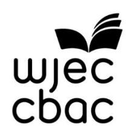

{0}------------------------------------------------

# WJEC GCSE Religious Studies

Approved by Qualifications Wales

# Sample Assessment Materials

Unit 2: Religion and relationships Teaching from 2025 For award from 2027

Version 2 - September 2025

Ready for the world. This Qualifications Wales regulated qualification is not available to centres in England.

Made for Wales.

{1}------------------------------------------------

{2}------------------------------------------------

# SUMMARY OF AMENDMENTS

| Description                                                                              | Page number                                                                     |
|------------------------------------------------------------------------------------------|---------------------------------------------------------------------------------|
| To clarify that this document is a sample and not to be used with live assessment: |  |
|  | Throughout 3 |
| • • | A watermark has been added The further information section has been updated. |

{3}------------------------------------------------

#### Contents

| About this pack: information for teachers | 1 |
|-------------------------------------------|---|
| Managing the assessment                   | 1 |
| Assessment details                        | 4 |
| Candidate Mark Record Sheet               |   |
| Candidate Assessment Pack                 | 6 |

Sample not for use with live assessments

#### Copyright

© WJEC CBAC Limited 2024.

{4}------------------------------------------------

# About this pack: information for teachers

This pack contains the assessment materials for Unit 2: Religion and Relationships.

Within this pack, you will find:

- information for teachers on how to manage arrangements for assessment
- a mark record sheet
- a **candidate pack** which includes:
  - details of the assignment
  - a detailed breakdown of each task
  - information for candidates, which tells candidates about things that they must and must not do when they are completing the assessment
  - the mark scheme which must be used to assess candidate work
  - a Candidate Declaration Form
  - a Candidate Time Record sheet.

**You must provide each candidate with a copy of the complete candidate assessment pack.**

# Managing the assessment

This is a centre-marked (internal) non-examination assessment. The following arrangements must be followed when managing and marking the assessment

# **Time**

Candidates must be allowed **6 hours** to complete this assessment. Candidates should spend approximately:

- 1 hours 30 minutes completing task 1
- 1 hour completing task 2
- 1 hour completing task 3
- 2 hours completing task 4
- 30 minutes completing task 5

The time suggested for each task takes account of the contribution of the task to the overall assessment requirements. There can be no changes to the total time available for this assessment. Centres can, however, amend the suggested time available for each task.

#### **Resources**

Candidates must have access to the candidate assessment pack and any necessary resources, as specified in the detailed task tables within the candidate pack.

#### **Collaboration**

Group work is **not** allowed. Candidates must complete all tasks individually.

{5}------------------------------------------------

#### **Supervision**

Tasks in this unit are taken under a mixture of direct and indirect supervision:

Task 1: indirect supervision Task 2: direct supervision Task 3: indirect supervision Task 4: direct supervision Task 5: indirect supervision

| The use of resources is tightly prescribed. The centre must ensure that:                |  |  |  |
|-----------------------------------------------------------------------------------------|--|--|--|
|                                                                                         |  |  |  |
|                                                                                         |  |  |  |
| all candidates are within direct sight of the supervisor throughout the                 |  |  |  |
|                                                                                         |  |  |  |
|                                                                                         |  |  |  |
|                                                                                         |  |  |  |
|                                                                                         |  |  |  |
|                                                                                         |  |  |  |
|                                                                                         |  |  |  |
| Candidates' work must remain within the centre at all times and must                    |  |  |  |
|                                                                                         |  |  |  |
| Where direct supervision is specified, the centre must ensure that the JCQ No Mobile |  |  |  |
|                                                                                         |  |  |  |
|                                                                                         |  |  |  |
|                                                                                         |  |  |  |
|                                                                                         |  |  |  |
|                                                                                         |  |  |  |
|                                                                                         |  |  |  |
| the work an individual candidate submits for assessment is his/her                      |  |  |  |
|                                                                                         |  |  |  |
| and must be                                                                             |  |  |  |
|                                                                                         |  |  |  |
| display materials which might provide assistance are removed or                         |  |  |  |

Centres must have in place systems to ensure candidates cannot access evidence they have been developing outside of supervised activities.

#### **Authentication**

Supervision must be in place to ensure the authenticity of evidence produced for summative assessment.

You should not provide input or guidance to candidates during the assessment time. This includes providing formative feedback on the evidence being produced. You can provide guidance on the requirements of the task and remind candidates of the mark bands and how they can be interpreted.

{6}------------------------------------------------

Candidates can review and redraft evidence independently within the time controls for the assessment.

Candidates must sign the declaration to confirm that all evidence submitted for moderation is their own work and that any sources used have been acknowledged.

Assessors must sign the declaration to confirm that evidence submitted for moderation was completed under the controlled conditions set out in this assessment.

Assessors must check pre-assessment research notes to ensure that pre-prepared answers are not used for completion of tasks.

#### **Candidate evidence**

The acceptable formats for evidence of each of the tasks is summarised in the task tables. Any modified assessment must enable the candidate to generate the evidence required in this table

## **Marking the assessment**

The marking scheme for this assessment are included in the candidate pack.

All marking of evidence must be made against the marking scheme provided. Evidence marked must comply with any requirements set out in the assessment pack. Written evidence must be annotated to show how it relates to the mark band requirements. Marking should only be undertaken by a designated assessor. An assessor should have appropriate expertise in the subject and level for a specified unit. The assessor is responsible for ensuring that:

- assessment is conducted under the controls specified in the task table
- they are clear about the requirements of the assessment and marking scheme prior to commencing assessment
- evidence presented for assessment is valid, authentic; reliable and credible
- assessment decisions are accurately recorded
- evidence is appropriately annotated
- judgements are only made against the mark band statements

A mark record sheet must be completed for each candidate.

#### **Further information**

You should refer the JCQ Instructions for conducting non-examination assessment for further information on managing assessment within our GCSE Qualifications.

{7}------------------------------------------------

# Assessment details

Each year, WJEC will select **two** of the following set themes and will provide a statement associated with each theme:

- (a) marriage, adultery, divorce and remarriage
- (b) artificial contraception and natural family planning
- (c) cohabitation and sex before and outside marriage
- (d) same-sex relationships, civil partnerships and same-sex marriage
- (e) interfaith relationships and marriage outside the religious tradition
- (f) roles within family, including gender roles within relationships
- (g) religious upbringing, childhood ceremonies and faith-based schooling.

The following is an example of a statement linked to a theme:

- Theme Marriage, adultery, divorce and remarriage
- Statement 'Traditional religious views about marriage are no longer relevant'.

From the two themes and statements provided by WJEC, centres will choose **one** theme and an associated statement as the focus for learners' tasks.

The tasks must be based on the **two** religions studied (Christianity or Catholic Christianity and a world religion) in all other Units, **and** non-religious beliefs.

For this assessment learners are required to undertake research on the chosen theme and to use their research findings to complete tasks.

This assessment contributes to 20% of the overall qualification grade and will take 6 hours to complete. Some tasks, such as research tasks, must be completed outside the dedicated 6 hours. The assignment should be completed in multiple sessions to allow enough time to complete research. The length of the sessions in the decision of the centre. The assignment will be marked out of a total of 60 marks.

This unit will be assessed through an externally set assignment and will be internally marked by the centre and externally moderated by WJEC. Assessments must be submitted digitally (they may be handwritten and scanned or completed digitally).

{8}------------------------------------------------

# Candidate Mark Record Sheet

| Centre No:       |  | Centre Name:       |  |
|------------------|--|--------------------|--|
| Candidate No: |  | Candidate Name: |  |
| Unit Title:      |  |                    |  |

| Task       | Mark Awarded |
|------------|--------------|
| 1          | /15          |
| 2          | /10          |
| 3          | /10          |
| 4          | /20          |
| 5          | /5           |
| Total Mark | /60          |

I have authenticated the candidate's work and am satisfied that to the best of my knowledge the work produced is solely that of the candidate. The candidate has clearly referenced any sources and any AI tools used in the work. I understand that false declaration is a form of malpractice

| Assessor Signature |          |  |  |  |
|--------------------|----------|--|--|--|
| Name (printed)     |          |  |  |  |
| Date | / /20 |  |  |  |

{9}------------------------------------------------

# WJEC Religious Studies

Candidate Assessment Pack

Unit 2: Religion and relationships (3150U2)

{10}------------------------------------------------

# About this pack: information and instructions for candidates

This candidate assessment pack is for candidates completing Unit 2 – Religion and relationships.

Within this pack, you will find:

- your assignment
- a detailed breakdown of each task, the evidence requirements, and the conditions (controls) under which the task is to be completed
- information for candidates, which tells you about things that you must and must not do when you are completing the assessment
- the mark scheme which will be used to assess your work
- a Declaration Form

**You will have 6 hours in total to complete this assessment.** You should spend approximately:

- 1 hours 30 minutes completing task 1
- 1 hour completing task 2
- 1 hour completing task 3
- 2 hours completing task 4
- 30 minutes completing task 5

You will be supervised throughout the assessment.

Your teacher is allowed to help you to understand the assessment requirements briefs and the tasks, but there are rules about the kind of help and how much they can give you. You should speak to your teacher if you have any questions about what you are and are not allowed to do as you are completing the tasks, as they will know how much help they are allowed to give you.

It is important that you work independently from other candidates and the work produced should be your own unaided work. You and your teacher will be required to sign a declaration that all work presented is your own work.

You are advised to check your work carefully to make sure that it is accurate and correct.

{11}------------------------------------------------

# Assessment

Each year, WJEC will select **two** of the following set themes and will provide a statement associated with each theme:

- (a) marriage, adultery, divorce and remarriage
- (b) artificial contraception and natural family planning
- (c) cohabitation and sex before and outside marriage
- (d) same-sex relationships, civil partnerships and same-sex marriage
- (e) interfaith relationships and marriage outside the religious tradition
- (f) roles within family, including gender roles within relationships
- (g) religious upbringing, childhood ceremonies and faith-based schooling.

The following is an example of a statement linked to a theme:

- Theme Marriage, adultery, divorce and remarriage
- Statement 'Traditional religious views about marriage are no longer relevant'.

From the two themes and statements provided by WJEC, your centre will choose **one** theme and an associated statement as the focus for your tasks.

The tasks must be based on the **two** religions studied (Christianity or Catholic Christianity and a world religion) in all other Units, **and** non-religious beliefs.

You are required to:

- summarise and examine the similarities and differences of the relevant beliefs, teachings, practices and perspectives of the two religions and nonreligious beliefs you have studied in relation to the statement provided
- select or produce sources to gain insights into different religious and nonreligious perspectives and experiences in relation to the statement provided
- analyse and evaluate the statement provided in relation to your findings
- reflect on your own values and beliefs in relation to the statement provided.

# Research

To prepare for your non-examination assessment, you should do some research to help you complete Tasks 1 and 2. This research does not form part of the non-examination assessment time.

Relating to the statement provided, you should research the relevant:

- beliefs, teachings practices and perspectives of the two religions you have studied
- non-religious beliefs and perspectives.

You are permitted to produce a maximum of **four** sides of A4 written or printed research notes to interpret during the non-examination assessment. These research notes **must** be submitted alongside the response to the tasks.

{12}------------------------------------------------

# Tasks

|   | Task                                                                                                                                                                                                                                                                                                                                       | Evidence                                                                                  | Controls                                                                                                             |
|---|--------------------------------------------------------------------------------------------------------------------------------------------------------------------------------------------------------------------------------------------------------------------------------------------------------------------------------------------|-------------------------------------------------------------------------------------------|----------------------------------------------------------------------------------------------------------------------|
| 1 | Based on your research: <ul><li>summarise the relevant beliefs, teachings, practices and perspectives of the two religions you have studied in relation to the statement provided</li><li>summarise the relevant non-religious beliefs and perspectives in relation to the statement provided. [15 marks]</li></ul> | A maximum of four sides of A4 written or typed research notes A written response | Supervision: Indirect Guidance: Not permitted Resources: Permitted Collaboration: Not permitted |

You should spend approximately **1 hour 30 minutes** completing this task.

Resources permitted:

The maximum of four sides of A4 written or printed research notes.

|                                                                                                  | Task                                                                                                                                                                                                                                                                                                                                                                                                                                                   | Evidence           | Controls                                                                                 |
|--------------------------------------------------------------------------------------------------|--------------------------------------------------------------------------------------------------------------------------------------------------------------------------------------------------------------------------------------------------------------------------------------------------------------------------------------------------------------------------------------------------------------------------------------------------------|--------------------|------------------------------------------------------------------------------------------|
| 2 | Based on your research: | A written response | Supervision: Direct |
|  | Examine the similarities and differences in beliefs, teachings, practices and perspectives. Include: <ul><li>any similarities between the two religions you have studied</li><li>any differences between the two religions you have studied</li><li>any similarities between each religion and the non-religious perspectives</li><li>any differences between each religion and the non-religious perspectives.</li></ul> |  | Guidance: Not permitted Resources: Permitted Collaboration: Not permitted |
|                                                                                                  | [10 marks]                                                                                                                                                                                                                                                                                                                                                                                                                                             |                    |                                                                                          |
|  | You should spend approximately 1 hour completing this task. |  |  |
| Resources permitted: The maximum of four sides of A4 written or printed research notes. |  |  |  |

{13}------------------------------------------------

# Select or produce sources

Based on the statement provided, select or produce suitable sources to gain insights into religious and non-religious perspectives and experiences.

This does not form part of the non-examination assessment time.

Examples of sources could include the following:

- online sources
- surveys
- interviews
- documentaries
- census data
- opinion polls.

You are permitted to take a maximum of **six** written or printed sources you have selected or produced to use in your assessment. These sources **must** be submitted alongside the response to the task.

|   | Task                                                                                                    | Evidence                                             | Controls                        |
|---|---------------------------------------------------------------------------------------------------------|------------------------------------------------------|---------------------------------|
| 3 | Based on the statement provided, explain why you have selected or produced | A maximum of six written or printed sources | Supervision: Indirect |
|  | each source. In your answer, you could refer to one or more of the | A written response | Guidance: Not permitted |
|  | following: |  | Resources: Permitted |
|  | <ul><li>to provide clear information, supported by reasoning and/or evidence</li></ul> |  | Collaboration: Not permitted |
|  | <ul><li>to prove the reliability of another source used</li></ul> |  |  |
|  | <ul><li>to provide a different perspective leading to greater understanding</li></ul> |  |  |
|  | <ul><li>to help diminish any bias</li></ul> |  |  |
|  | <ul><li>to provide a different source type, leading to greater understanding</li></ul> |  |  |
|  | <ul><li>provide evidence of lived experience.</li></ul> |  |  |
|  | [10 marks] |  |  |
|  | You should spend approximately 1 hour completing this task |  |  |
|  | Resources permitted: A maximum of six written/printed sources that you have selected or produced. |  |  |

{14}------------------------------------------------

| Task |                                                                                                                                                                                                               | Evidence           | Controls                                                                        |
|------|---------------------------------------------------------------------------------------------------------------------------------------------------------------------------------------------------------------|--------------------|---------------------------------------------------------------------------------|
| 4 | Analyse and evaluate the statement provided, using the sources from Task 3. You must refer to religious and non-religious beliefs, teachings, practices and perspectives in your answer. | A written response | Supervision: Direct Guidance: Not permitted Resources: Permitted |
|  | [20 marks] |  | Collaboration: Not permitted |

You should spend approximately **2 hours** completing this task.

# Resources permitted:

- The four sides of A4 written or printed research notes you produced for Task 1.
- The maximum of six written/printed sources that you have selected or produced for Task 3.
- Your answers to Tasks 1, 2 and 3.

| Task |                                                                                       | Evidence           | Controls                        |
|------|---------------------------------------------------------------------------------------|--------------------|---------------------------------|
| 5 | Justify your own values and beliefs in relation to the statement provided. (You | A written response | Supervision: Indirect |
|  | could reflect on your findings from previous |  | Guidance: Not permitted |
|  | tasks). |  | Resources: Permitted |
|  | [5 marks] |  | Collaboration: Not permitted |

You should spend approximately **30 minutes** completing this task.

Resources permitted:

Your answers to Tasks 1, 2, 3 and 4.

#### **End of tasks**

{15}------------------------------------------------

# Information for candidates

The following information has been taken from the [JCQ Information for candidates](https://www.jcq.org.uk/wp-content/uploads/2021/08/IFC-NE_Assessments_2021_v4.pdf) – non[examination assessments](https://www.jcq.org.uk/wp-content/uploads/2021/08/IFC-NE_Assessments_2021_v4.pdf) and the [JCQ Artificial Intelligence \(AI\) Use in Assessments:](https://www.jcq.org.uk/exams-office/malpractice/artificial-intelligence/)  [Protecting the Integrity of Qualifications.](https://www.jcq.org.uk/exams-office/malpractice/artificial-intelligence/) This tells you about things that you **must** and **must not** do when you are completing your assessment. If there is anything that you do not understand, you **must** ask your teacher.

## **Preparing your work**

- When you submit your work and sign your candidate declaration form, you need to ensure that your final product reflects your own independent work and isn't copied or paraphrased from another source such as an AI tool.
- If you receive help and guidance from someone other than your teacher, you **must** tell your teacher who will then record the nature of the assistance given to you.
- If you worked as part of a group on a task, you **must** each write up your own account of the assignment. Even if the data you have is the same, you **must** describe in your own words how that data was obtained, and you **must** independently draw your own conclusions from the data.
- Take care of your work and keep it safe. **Do not** leave it lying around where your classmates can find it or share it with anyone, including posting it on social media. You **must** always keep your work secure and confidential whilst you are preparing it; **do not** share it with your classmates. If it is stored on the computer network, keep your password secure. Collect all copies from the printer and destroy those you do not need.
- **Do not** be tempted to use pre-prepared online solutions (such as those produced by AI tools and chatbots) – this is cheating. Electronic tools used by WJEC can detect this sort of copying.
- You **must not** write inappropriate, offensive or obscene material.

# **Plagiarism**

Plagiarism involves taking someone else's words, thoughts or ideas and trying to pass them off as your own. **It is a form of cheating which is taken very seriously.** Don't think you won't be caught; there are many ways to detect plagiarism:

- Markers can spot changes in the style of writing and use of language.
- Markers are highly experienced subject specialists they may have read the source you are using, or even marked the work you have copied from!
- Internet search engines and specialised computer software can be used to match phrases or pieces of text with original sources and to detect changes in the grammar and style of writing or punctuation.

#### **Penalties for breaking the regulations**

If it is discovered that you have broken the regulations, one of the following penalties will be applied:

- the piece of work will be awarded zero marks
- you will be disqualified from that unit for the assessment series in question
- you will be disqualified from the whole subject for that assessment series
- you will be disqualified from all subjects and barred from entering again for a period of time.

WJEC will decide which penalty is appropriate.

**Remember – it's your qualification so it needs to be your own work.**

{16}------------------------------------------------

# Mark scheme

The following mark scheme will be used to assess your work.

**0 marks will be awarded if there is no evidence or submitted work is not worthy of credit.**

#### **Task 1**

Based on your research:

- summarise the relevant beliefs, teachings, practices and perspectives of the **two** religions you have studied in relation to the statement provided
- summarise the relevant non-religious beliefs and perspectives in relation to the statement provided.

[15 marks]

| Band | AO2                                                                                                                                                                                                                                                                                                                                                                                                                                                          |  |
|------|--------------------------------------------------------------------------------------------------------------------------------------------------------------------------------------------------------------------------------------------------------------------------------------------------------------------------------------------------------------------------------------------------------------------------------------------------------------|--|
| 5 | 13-15 marks <ul><li>an excellent summary in which knowledge and understanding of the relevant beliefs, teachings, practices and perspectives of the two religions studied has been consistently applied in the context of the statement provided</li><li>an excellent summary in which knowledge and understanding of the relevant non-religious beliefs and perspectives has been consistently applied in the context of the statement provided</li></ul> |  |
| 4 | 10-12 marks <ul><li>a good summary in which knowledge and understanding of the relevant beliefs, teachings, practices and perspectives of the two religions studied has been applied in the context of the statement provided</li><li>a good summary in which knowledge and understanding of the relevant non-religious beliefs and perspectives has been applied in the context of the statement provided</li></ul> |  |
| 3 | 7-9 marks <ul><li>a satisfactory summary in which knowledge and understanding of the relevant beliefs, teachings, practices and perspectives of the two religions has mostly been applied in the context of the statement provided</li><li>a satisfactory summary in which knowledge and understanding of the relevant non-religious beliefs and perspectives has mostly been applied in the context of the statement provided</li></ul> |  |

{17}------------------------------------------------

| 2 | 4-6 marks <ul><li>a basic summary of the relevant beliefs, teachings, practices and perspectives of the two religions studied; knowledge and understanding has been superficially applied in the context of the statement provided</li><li>a basic summary of the relevant non-religious beliefs and perspectives; knowledge and understanding has been superficially applied in the context of the statement provided</li></ul> |
|---|------------------------------------------------------------------------------------------------------------------------------------------------------------------------------------------------------------------------------------------------------------------------------------------------------------------------------------------------------------------------------------------------------------------------------------|
| 1 | 1-3 marks <ul><li>a limited summary of the relevant beliefs, teachings, practices and perspectives of the two religions studied with minimal application of knowledge and understanding in the context of the statement provided</li><li>a limited summary of the relevant non-religious beliefs and perspectives with minimal application of knowledge and understanding in the context of the statement provided</li></ul> |
| 0 | 0 marks No response attempted or nothing worthy of credit. |
|  | Total: /15 |

{18}------------------------------------------------

### **Task 2**

Based on your research:

Examine the similarities and differences in beliefs, teachings, practices and perspectives. Include:

- any similarities between the two religions you have studied
- any differences between the two religions you have studied
- any similarities between each religion and the non-religious perspectives
- any differences between each religion and the non-religious perspectives.

[10 marks]

| Band | AO3                                                                                                                                                                                                                                                                                                                          |
|------|------------------------------------------------------------------------------------------------------------------------------------------------------------------------------------------------------------------------------------------------------------------------------------------------------------------------------|
| 5 | 9-10 marks <ul><li>an excellent examination of any similarities and differences between the beliefs, teachings, practices and perspectives of:</li><li>the two religions studied</li><li>each religion studied and non-religious perspectives</li><li>the research is interpreted convincingly and accurately</li></ul> |
| 4 | 7-8 marks <ul><li>a good examination of any similarities and differences between the beliefs, teachings, practices and perspectives of:</li><li>the two religions studied</li><li>each religion studied and non-religious perspectives</li><li>the research is interpreted clearly and mainly accurately</li></ul> |
| 3 | 5-6 marks <ul><li>a satisfactory examination of any similarities and differences between the beliefs, teachings, practices and perspectives of:</li><li>the two religions studied</li><li>each religion studied and non-religious perspectives</li><li>the research is interpreted with some clarity and some accuracy</li></ul> |

{19}------------------------------------------------

| 2 | 3-4 marks <ul><li>a basic examination of any similarities and differences between the beliefs, teachings, practices and perspectives of:</li><li>the two religions studied</li><li>each religion studied and non-religious perspectives</li><li>the research is interpreted superficially</li></ul> |
|---|---------------------------------------------------------------------------------------------------------------------------------------------------------------------------------------------------------------------------------------------------------------------------------------------------------|
| 1 | 1-2 marks <ul><li>a limited examination of any similarities and differences between the beliefs, teachings, practices and perspectives of:</li><li>the two religions studied</li><li>each religion studied and non-religious perspectives</li><li>there is minimal interpretation of the research</li></ul> |
|  | 0 marks No response attempted or nothing worthy of credit. |
|  | Total: /10 |

{20}------------------------------------------------

### **Task 3**

Based on the statement provided, explain why you have selected or produced each source. In your answer, you could refer to one or more of the following:

- to provide clear information, supported by reasoning and/or evidence
- to prove the reliability of another source used
- to provide a different perspective leading to greater understanding
- to help diminish any bias
- to provide a different source type, leading to greater understanding
- provide evidence of lived experience.

[10 marks]

| Band | AO4                                                                                                                                                    |
|------|--------------------------------------------------------------------------------------------------------------------------------------------------------|
| 5 | 9-10 marks <ul><li>a very clear response which includes a precise and convincing rationale for the selection or production of the sources</li></ul> |
| 4 | 7-8 marks <ul><li>a clear response which includes a mostly convincing rationale for the selection or production of the sources</li></ul> |
| 3 | 5-6 marks <ul><li>a mostly clear response which includes a rationale for the selection or production of the sources that is convincing in places</li></ul> |
| 2 | 3-4 marks <ul><li>the response includes a basic rationale for the selection or production of the sources</li></ul> |
| 1 | 1-2 marks <ul><li>the response includes a limited attempt at providing a rationale for the selection or production of sources</li></ul> |
|  | 0 marks No response attempted or nothing worthy of credit. |
|  | Total: /10 |

{21}------------------------------------------------

**Task 4**

Analyse and evaluate the statement provided, using the sources from Task 3. You must refer to religious and non-religious beliefs, teachings, practices and perspectives in your answer.

[20 marks]

| Band | AO3                                                                                                                                                                                                                                                                                                                                                                                    |
|------|----------------------------------------------------------------------------------------------------------------------------------------------------------------------------------------------------------------------------------------------------------------------------------------------------------------------------------------------------------------------------------------|
| 5 | 17-20 marks <ul><li>an excellent analysis and evaluation of the statement provided which comprehensively and effectively uses the sources from Task 3</li><li>the response comprehensively and effectively explores relevant religious and non-religious beliefs, teachings, practices and perspectives</li><li>the response reaches a well-argued and highly coherent judgement</li></ul> |
| 4 | 13-16 marks <ul><li>a good analysis and evaluation of the statement provided which comprehensively uses the sources from Task 3</li><li>the response comprehensively explores relevant religious and non-religious beliefs, teachings, practices and perspectives</li><li>the response reaches an argued and coherent judgement</li></ul> |
| 3 | 9-12 marks <ul><li>a satisfactory analysis and evaluation of the statement provided which makes adequate use of the sources from Task 3</li><li>the response adequately explores relevant religious and non-religious beliefs, teachings, practices and perspectives the response</li><li>the response reaches a partially argued and mostly coherent judgment</li></ul> |
| 2 | 5-8 marks <ul><li>a basic analysis and evaluation of the statement provided which makes superficial use of the sources from Task 3</li><li>the response superficially explores relevant religious and non-religious beliefs, teachings, practices and perspectives</li><li>the response reaches a superficially argued and somewhat coherent judgment</li></ul> |

{22}------------------------------------------------

| 1 | 1-4 marks <ul><li>a limited analysis and evaluation of the statement provided which makes little use of the sources from Task 3</li><li>the response includes minimal exploration of relevant religious and non-religious beliefs, teachings, practices and perspectives</li><li>the response reaches a loosely argued and emerging judgment</li></ul> |
|---|-------------------------------------------------------------------------------------------------------------------------------------------------------------------------------------------------------------------------------------------------------------------------------------------------------------------------------------------------|
| 0 | 0 marks No response attempted or nothing worthy of credit. |
|  | Total: /20 |

{23}------------------------------------------------

**Task 5** Justify your own values and beliefs in relation to the statement provided. (You could reflect on your findings from previous tasks).

[5 marks]

| Band | AO4                                                                                                                           |        |    |
|------|-------------------------------------------------------------------------------------------------------------------------------|--------|----|
| 3 | 5 marks <ul><li>an excellent justification of why these values and beliefs are held in relation to the statement provided</li></ul> |  |  |
| 2 | 3-4 marks <ul><li>a good justification of why these values and beliefs are held in relation to the statement provided</li></ul> |  |  |
| 1 | 1-2 marks <ul><li>a satisfactory justification of why these values and beliefs are held in relation to the statement provided</li></ul> |  |  |
| 0 | 0 marks No response attempted or nothing worthy of credit. |  |  |
|      |                                                                                                                               | Total: | /5 |

{24}------------------------------------------------

# Mapping of tasks to unit content and assessment objectives

|       | Unit Content |       |       |       | T - 4 - 1 | 400            | 4.00         | 404          |              |
|-------|--------------|-------|-------|-------|-----------|----------------|--------------|--------------|--------------|
| Tasks | 2.1.1 | 2.1.2 | 2.2.1 | 2.2.2 | 2.2.3 | Total Marks | AO2 Marks | AO3 Marks | AO4 Marks |
| 1     | Х            |       |       |       | S         | 15             | 15           |              |              |
| 2     |              | х     |       |       | 0,0       | 10             |              |              | 10           |
| 3     |              |       | х     |       | 70        | 10             |              | 10           |              |
| 4     |              |       |       | х     |           | 20             |              | 20           |              |
| 5     |              |       |       |       | х         | 5              |              |              | 5            |
| Total |              |       |       | 0,    |           | 60             | 15           | 30           | 15           |

{25}------------------------------------------------

# Candidate Declaration Form

## **You must complete Part A and Part B of this form**

| Centre No:       | Centre Name:       |  |
|------------------|--------------------|--|
| Candidate No: | Candidate Name: |  |
| Unit Title:      |                    |  |
|                  |                    |  |

#### **Part A: Candidate Declaration**

| References: Give details of the exact source of any non-original material used in the assignment. | List of software packages/AI tools/chatbots1 : Give brief details of how these have been used in the assignment. |
|------------------------------------------------------------------------------------------------------|---------------------------------------------------------------------------------------------------------------------------|
|                                                                                                      |                                                                                                                           |

#### **Authentication Declaration**

I declare that my work was completed independently and without any assistance beyond that which was permitted. All work is my own, except for any non-original material clearly credited above. This work has not been submitted for any other qualification. I have clearly referenced any sources and any Artificial Intelligence tools used in the work. I understand that false declaration is a form of malpractice.

| Candidate Signature: | Date: |
|----------------------|-------|
|                      |       |

1 Where you have used AI tools as a source of information, you must show the name of the AI source used and the date the content was generated. For example: ChatGPT 3.5 [\(https://openai.com/blog/chatgpt/\)](https://openai.com/blog/chatgpt/), 25/01/2023. You must, retain a copy of the question(s) and computer-generated content for reference and authentication purposes, in a noneditable format (such as a screenshot) and provide a brief explanation of how it has been used. This must be submitted with your work, so your teacher/assessor is able to review the work, the AI-generated content and how it has been used.

{26}------------------------------------------------
