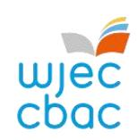

{0}------------------------------------------------

## WHY CHOOSE GCSE

# Religious Studies?

#### **INTRODUCTION**

Why study RS? Because it is, and will always be, relevant. The majority of the world's population is religious; GCSE RS helps you to understand some of the beliefs and teachings that these people live their lives by. You will also learn about non-religious attitudes and perspectives as this is increasingly relevant in the modern world. Not a day goes by where there isn't reference to religion or some ethical topic on the news, so take GCSE RS to be better informed about these important matters!

#### WHAT WILL I STUDY?

GCSE Religious Studies comprises four units, two of which are examined by non-exam assessment (NEA).

UNIT 1 - Religious and non-religious beliefs, teachings and practices - in this unit, first you will learn the nature of belief (what we mean by belief and why people choose to be religious or non-religious) and then go on to look at a variety of key religious and non-religious beliefs, teachings and practices, including beliefs about life and death, identity, belonging, morality and putting belief into action. You will learn this content from a Christian or Catholic perspective, the perspective of one other world religion and from non-religious perspectives.

UNIT 2 – Religion and relationships – Unit 2 is a non-exam assessment (NEA) meaning you will learn about relationships and then conduct an investigation into a topic relating to this, exploring religious and non-religious perspectives.

UNIT 3 - Roles, rights and responsibilities - Unit 3 allows you to explore key religious themes, including stewardship, animal rights, freedom of religious expression, use of personal wealth and the medical ethics topics of abortion and euthanasia. As with Unit 1, you will learn these from a Christian or Catholic perspective and also from the viewpoint of one other world religion, as well as looking at non-religious views.

UNIT 4 - Religion and human rights - Unit 4 is another non-exam assessment. First, you will learn some beliefs, teachings, practices and perspectives relating to human rights and then complete an NEA exploring the work of charities and organisations campaigning for human rights.

FIND OUT MORE -TALK TO YOUR TEACHER TODAY!

#### **HOW WILL I BE ASSESSED?**

Unit 1 A 75-minute exam, 60 marks, 30% of the qualification

Unit 2 Non-exam assessment, 6 hours, 20% of the qualification

Units 3 A 75-minute exam, 60 marks, 30% of the qualification

Unit 4 Non-exam assessment, 6 hours, 20% of the qualification

#### WHAT SKILLS WILL I DEVELOP?

Religious Studies allows you to broaden your understanding of different people and the way they live their lives, developing tolerance and empathy. The academic nature of the subject helps you to develop a range of skills, including:

- Interpretation
- Analysis
- Evaluation
- Critical thinking
- Debate and communication skills
- Reflection of personal views

With the introduction of NEA, you will also have opportunities to investigate and explore issues that are relevant to today's world, developing research and interpersonal skills.

### **CAREERS IN Religious Studies**

GCSE Religious Studies gives you a solid foundation for studying A Level Religious Studies, which can lead you to various degrees at university:

Theology:

Religious Studies;

Philosophy:

PPE (Politics, Philosophy and Economics).

It can also lead to a wide range of careers: lawyer; police officer; teacher; paramedic; chef; business owner; data analyst. The skills gained in GCSE Religious Studies make it perfectly suited to any career requiring critical thinking, debate and good communication skills; most careers require some combination of these!

