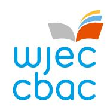
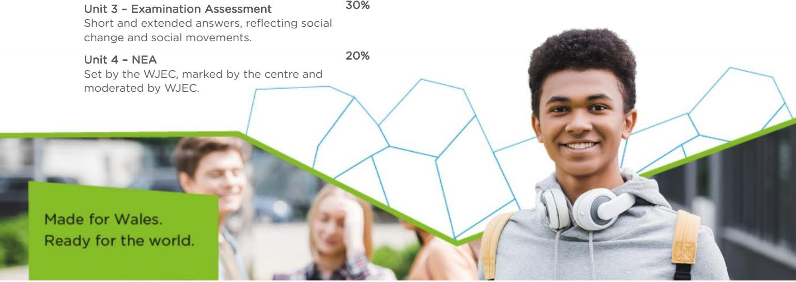

{0}------------------------------------------------

# WHY CHOOSE GCSE

# GCSE SOCIAL STUDIES?

The WJEC GCSE Social Studies qualification will help you understand various social issues in society. You will be able to appreciate that social issues are complex and can be explained from many different perspectives. As societies change, you will understand the causes of these changes and how we as members of society can promote change through social action.

You will also develop an understanding of how to become ethical, informed, and responsible citizens of Wales and the world.

#### WHAT WILL I STUDY?

The Social Studies qualification consists of four units:

## Unit 1 – Society and Social Issues

This unit covers characteristics of society and a variety of social issues. You will become familiar with the diverse nature of society by studying the ideas of identity, rights, and how the various levels of governance in Wales, the UK, and the wider world influence how societies function.

### UNIT 2 – Investigating Society and Social Issues

Within this unit you will explore ways of researching society and social issues based on a variety of evidence sources.

#### UNIT 3 – Social Change in Contemporary Society

This unit explores social change by explaining events that lead to changes, the agents and processes that cause these changes and the consequences of social change. You will examine social movements that have used various methods to deal with various social issues with varying impacts.

#### UNIT 4 – Planning to effect Social Change

For this unit you will investigate a social issue of your choice and plan an effective, legal and non-violent social action.

#### HOW WILL I BE ASSESSED?

| Unit 1 – Examination Assessment       | 30% |
|---------------------------------------|-----|
| Short and extended answers reflecting |     |
| contemporary social issues.           |     |

Unit 2 – NEA Set and marked by WJEC (tasks with 20%

evidence sources based on a selected social issue set by the WJEC).

Unit 3 – Examination Assessment

#### WHAT SKILLS WILL I DEVELOP?

GCSE Social Studies helps to develop a wide range of skills for the future:

- Literacy Skills reading, writing, discussing, understanding, and engaging with various forms of text and information.
- Numeracy Skills understanding, interpreting, and working with relevant data linked to society.
- Critical Thinking and Problem-Solving ask meaningful questions; assess the credibility of information and viewpoints whilst resolving contradictory accounts; analyse and justify potential social actions.
- Creativity and Innovation thinking creatively whilst developing an effective social action plan.
- Planning and Organising organising and planning an effective social action, within set time constraints.
- Personal Effectiveness researching appropriate information; making effective judgements on a social issue; working effectively with others whilst planning a social action.
- Enquiry skills select, utilise, and apply techniques relevant to social studies.

GCSE Social Studies will equip you with a range of skills that are not only valuable for studying this subject but will also support you in a variety of other subjects, including Sociology, Psychology, Government and Politics, Law and other Humanities subjects at A Level.

#### CAREERS IN SOCIAL STUDIES

This qualification will prepare you for a wide range of careers as it provides you with essential knowledge and a valuable and transferable skill set that can make you valuable and attractive to employers.

A selection of careers linked to social studies include: psychologist; social work; urban planning; journalism and broadcasting; police officer; probation officer; teaching; human resource manager; market research analyst; librarian; counselling; banking and finance; law; accountancy; politics; advertising and marketing.

FIND OUT MORE -TALK TO YOUR TEACHER TODAY!

