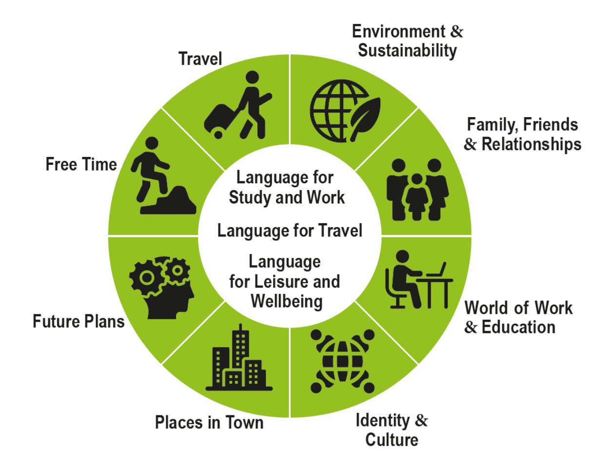
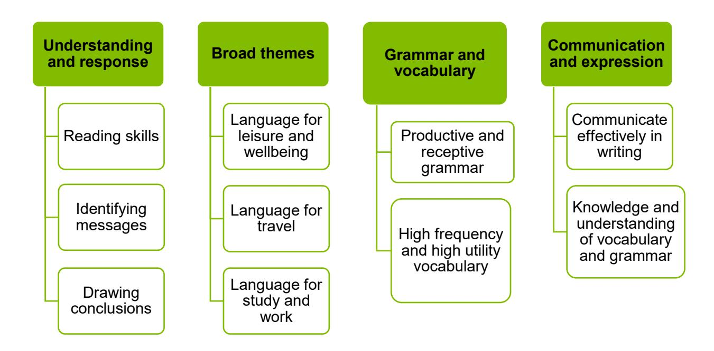
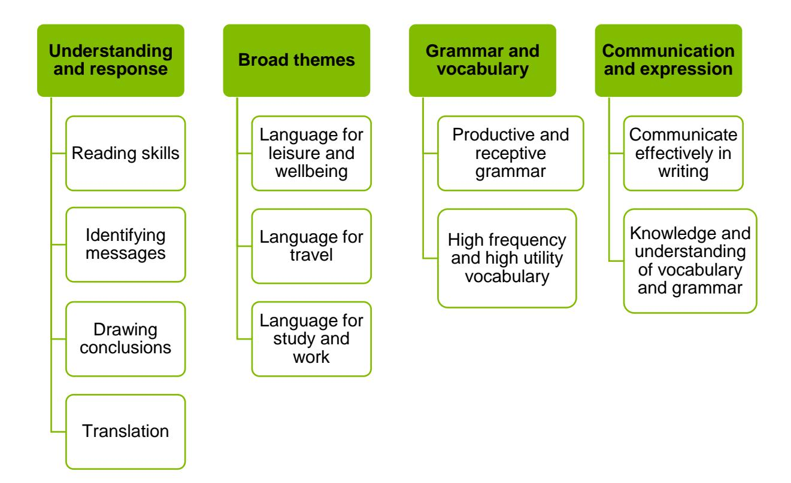
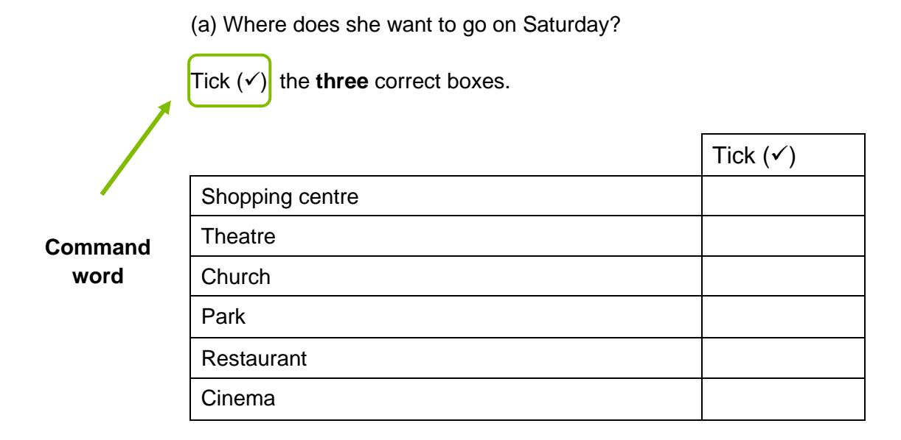

{1}------------------------------------------------

# WJEC GCSE Spanish

Approved by Qualifications Wales

# Delivery Guide

Teaching from 2025 For award from 2027

Ready for the world. This Qualifications Wales regulated qualification is not available to centres in England.

Made for Wales.

{2}------------------------------------------------

{3}------------------------------------------------

### Contents

| Aims of the Delivery Guide                    | 2  |
|-----------------------------------------------|----|
| Qualification Structure                       | 2  |
| Unit 1                                        | 4  |
| Unit 2                                        | 6  |
| Unit 3                                        | 7  |
| Unit 4                                        | 8  |
| Summary of assessment                         | 9  |
| Assessment Objectives                         | 10 |
| Unit 1                                        | 10 |
| Unit 2                                        | 10 |
| Unit 3                                        | 10 |
| Unit 4                                        | 10 |
| Specification and Assessment Pack             | 11 |
| Understanding the specification amplification | 11 |
| Specification Stem                            | 11 |
| Command words                                 | 12 |
| Mark Schemes                                  | 15 |
| Important Dates                               | 19 |

{4}------------------------------------------------

# Aims of the Delivery Guide

The aim of the Delivery Guide is to give an overview of the qualification and to help teachers understand how we assess the GCSE. It will offer an introduction to the specification, an assessment overview, and will support teachers in better understanding how to prepare their learners for the assessment of the different units. More information on each unit can be found in the separate unit guides.

As this is an international languages qualification, it carries over many other similarities to GCSE French and GCSE German. As such, ideas that could be incorporated into teaching and learning, can be found in the Guidance for Teaching documents for these qualifications, and we encourage teachers to research these documents for further guidance.

# Qualification Structure

WJEC GCSE Spanish consists of 4 units:

|        | Unit title          | Type of Assessment         | Weighting |
|--------|---------------------|----------------------------|-----------|
| Unit 1 | Oracy               | Non-examination assessment | 30%       |
| Unit 2 | Reading and Writing | Non-examination assessment | 15%       |
| Unit 3 | Listening           | Written examination        | 20%       |
| Unit 4 | Reading and Writing | Written examination        | 35%       |

This is a linear qualification. This qualification is not tiered.

All units are compulsory.

{5}------------------------------------------------

### Themes and the Use of Language

The following diagram shows example topics that could be used within all of the three broad themes.

It is important for teachers to ensure that all topics and associated vocabulary are transferable across all three themes and should not be used solely in one theme. The examples given are neither prescriptive, nor exhaustive and teachers can and should, deliver the vocabulary through their own engaging and motivating topics, using language in a natural and reoccurring way.

{6}------------------------------------------------

### **Oracy**

Non-examination assessment: Conducted in centre and marked by WJEC

Speaking test: 7-10 minutes Preparation time: 10 minutes

30% of qualification

60 marks

The purpose of this unit is to allow learners to:

- communicate meaningfully through speaking, describing, narrating, expressing and justifying opinions
- demonstrate their knowledge and understanding of Spanish through their responses
- demonstrate generally accurate pronunciation and intonation
- express themselves in a range of contexts
- contribute to a conversation.

The unit is based on the following:

Non-examination assessments (NEA) must be conducted under controlled conditions as outlined below, and in accordance with regulatory requirements. The NEA must be taken in the final year of the course.

Learners are not permitted to use dictionaries in any part of the assessment, or any other reference materials excluding the learner's own notes.

Tasks will be set by WJEC. The assessment will be carried out by teachers at the centre, audio recorded and marked by external examiners.

The assessment will consist of three tasks: a read aloud and role play, a presentation and discussion, and a conversation.

{7}------------------------------------------------

There will be a teacher booklet that will provide instructions and guidance as to how to conduct the assessment, and WJEC will provide detail as to the read aloud and role-play card to be allocated to each learner in the Assessment Pack. Centres are required to ensure that each candidate uses the correct allocated card.

The speaking assessments will take place during a five-week period between April and May, specified annually by WJEC. Centres may open the packs up to three working days in advance of the first timetabled assessment. The preparation period for the presentation may begin two weeks prior to the first timetabled assessment.

{8}------------------------------------------------

### **Reading and Writing**

Non-examination assessment (1 hour): Conducted in centre and marked by WJEC 15% of qualification 45 marks

The purpose of this unit is to allow learners to:

- understand and respond to written Spanish
- communicate effectively in writing
- express and justify opinions.

The unit will be based on the following:

Learners are not permitted to use dictionaries in any part of the assessment, or any other reference materials.

The task will be released to centres each year, in March, prior to the summer series in which the NEA must be submitted. The assessment will be marked by external examiners.

The assessment will take place during an eight-week period between March and May, specified annually by WJEC. Centres may download the task three working days in advance of the first assessment.

The Assessment Pack will be updated and released annually, it will include an updated role play card allocation table along with the specific period in which the speaking assessments and Unit 2 must take place.

{9}------------------------------------------------

### **Listening**

Written examination: 45 minutes (including 5 minutes reading time) Set and marked by WJEC 20% of qualification 45 marks

### The purpose of this unit is to:

- allow learners to understand Spanish by listening and responding to spoken Spanish
- identify messages and draw conclusions through listening to extracts including the following formats: adverts, messages, podcasts, announcements, conversations and interviews
- demonstrate their knowledge and understanding of the vocabulary, grammar and structures of Spanish
- demonstrate their knowledge and understanding of spoken Spanish.

### The unit will be based on the following:

{10}------------------------------------------------

### **Reading and Writing**

Written examination: 1 hour 30 mins Set and marked by WJEC 35% of qualification 70 marks

### The purpose of this unit is to:

- allow learners to show understanding and respond to written Spanish
- identify messages and draw conclusions
- communicate effectively in writing
- demonstrate their knowledge and understanding of the vocabulary, grammar and structures of Spanish
- express themselves in a range of contexts for different audiences and purposes
- translate from Spanish into Cymraeg/English.

### The unit will be based on the following:

{11}------------------------------------------------

# Summary of assessment

**Unit 1: Oracy**

**Non-examination assessment Speaking test: 7-10 minutes Preparation time: 10 minutes**

**30% of qualification**

**60 marks**

### **Three tasks:**

- read aloud and role play
- Presentation and discussion
- Conversation

**Learners are not permitted to use a dictionary in any part of the assessment.**

**Unit 2: Reading and Writing**

**Non-examination assessment: 1 hour**

**15% of qualification** 

**45 marks**

• written response in Spanish

**Learners are not permitted to use a dictionary in any part of the assessment.**

**Unit 3: Listening**

**Written examination: 45 minutes**

**20% of qualification** 

**45 marks**

• listening comprehension tasks with fixed and written responses

**Learners are not permitted to use a dictionary in any part of the assessment.**

**Unit 4: Reading and Writing**

**Written examination: 1 hour 30 minutes**

**35% of qualification** 

**70 marks**

- reading comprehension tasks
- translation from Spanish into Cymraeg/English
- a writing task in response to simple and familiar stimuli

**Learners are not permitted to use a dictionary in any part of the assessment.**

{12}------------------------------------------------

# Assessment Objectives

# Unit 1

The distribution of the assessment objectives for this unit is:

| AO1 | AO2 | AO3 | Total |
|-----|-----|-----|-------|
| 18% | 4%  | 8%  | 30%   |

## Unit 2

The distribution of the assessment objectives for this unit is:

| AO1 | AO2 | AO3 | Total |
|-----|-----|-----|-------|
| -   | 10% | 5%  | 15%   |

# Unit 3

The distribution of the assessment objectives for this unit is:

| AO1 | AO2 | AO3 | Total |
|-----|-----|-----|-------|
| 20% | -   | -   | 20%   |

### Unit 4

The distribution of the assessment objectives for this unit is:

| AO1 | AO2   | AO3  | Total |
|-----|-------|------|-------|
| -   | 27.5% | 7.5% | 35%   |

{13}------------------------------------------------

# Specification and Assessment Pack

When we develop new qualifications, we produce the following documents:

- Specification this covers all the information and skills that learners are expected to know by the end of their course.
- Assessment Pack this contains the Sample Assessment Materials (SAMs) including sample exam papers and sample NEA tasks, relevant controls for the NEA and mark schemes

This guide builds upon the information in the specification and assessment pack to help further your understanding of said documents.

# Understanding the specification amplification

Learners should be made aware of:

- the specification stems
- what the specification stems mean.

## Specification Stem

When you look through the specification you will notice in the amplification column, we use the following wording before the list of content learners need to know; we call this a stem:

# **Amplification Specification Stem** Learners should: • **Be able to** develop their listening skills to understand and respond to different types of spoken language in a range of different contexts.

| Specification Stem         | When it is used                                                                                                                                                |
|-------------------------------|----------------------------------------------------------------------------------------------------------------------------------------------------------------|
| Learners should be able to | When learners need to apply their knowledge and understanding to a practical situation or demonstrate application of practical skills and techniques. |

{14}------------------------------------------------

## Command words

Learners should be made aware of:

- what command words are
- what each command word means
- what each command word assesses.

Command words are the words and phrases used in assessments that tell learners how they should answer the question or complete the task. Command words direct the learner through the question or task and indicate the nature of the response required.

The following tables are not exhaustive, but will give you a good idea of the command words we typically use:

| Command Word                    | Requirements of response                                                                                                                  |  |  |  |  |  |  |
|---------------------------------|-------------------------------------------------------------------------------------------------------------------------------------------|--|--|--|--|--|--|
| Advise                          | Suggest a proposal or course of action based on supported reasons.                                                                        |  |  |  |  |  |  |
| Analyse                         | Separate information into components identify their characteristics.                                                                      |  |  |  |  |  |  |
| Apply                           | Use knowledge and understanding of a theory or concept and relate it to a specified context. Put into effect in an appropriate way. |  |  |  |  |  |  |
| Clarify                         | Make (an idea or situation) clear by describing it in more detail.                                                                        |  |  |  |  |  |  |
| Comment                         | Present an informed opinion.                                                                                                              |  |  |  |  |  |  |
| Communicate, write and speak | Share information by speaking or writing.                                                                                                 |  |  |  |  |  |  |

{15}------------------------------------------------

| Compare                        | Identify similarities.                                                                                                                                                                                         |  |  |  |
|--------------------------------|----------------------------------------------------------------------------------------------------------------------------------------------------------------------------------------------------------------|--|--|--|
| Complete                       | Add necessary items/information.                                                                                                                                                                               |  |  |  |
| Consider                       | Review and respond to given info.                                                                                                                                                                              |  |  |  |
| Define                         | Give the precise meaning of a term.                                                                                                                                                                            |  |  |  |
| Demonstrate                    | Exemplify, describe with reference to examples.                                                                                                                                                                |  |  |  |
| Describe                       | Identify distinctive features and give descriptive, factual detail. This is one of the most widely used command words. If an explanation is required then use two command words: 'describe and explain'. |  |  |  |
| Develop                        | To extend, advance, or elaborate.                                                                                                                                                                              |  |  |  |
| Discuss                        | Present key points.                                                                                                                                                                                            |  |  |  |
| Evaluate                       | Judge from available evidence.                                                                                                                                                                                 |  |  |  |
| Examine                        | Investigate closely.                                                                                                                                                                                           |  |  |  |
| Explain                        | Give reasons or causes. Show an understanding of how or why something has occurred.                                                                                                                         |  |  |  |
| Explore                        | Investigate without preconceptions about the outcome.                                                                                                                                                          |  |  |  |
| Express                        | Use given information to rewrite a number or an expression in a specified form.                                                                                                                             |  |  |  |
| Give                           | Produce an answer from recall.                                                                                                                                                                                 |  |  |  |
| Identify/Tick/Click/ Circle | Point out and name from a number of possibilities.                                                                                                                                                             |  |  |  |
| Illustrate/Show                | Use a diagram or words to make clear how a concept or theory works in a particular context. Present clarifying examples. Refer to a case study or example.                                            |  |  |  |
| Judge                          | To form an opinion/decide upon critically.                                                                                                                                                                     |  |  |  |
| Justify                        | Support case with evidence.                                                                                                                                                                                    |  |  |  |
| List                           | State the factors (with no explanation or elaboration).                                                                                                                                                        |  |  |  |
| Make/Produce/ Create        | To create/make/manufacture.                                                                                                                                                                                    |  |  |  |

{16}------------------------------------------------

| Match/Link            | To choose something that has the same quality as something.                                                        |  |  |  |  |  |
|-----------------------|--------------------------------------------------------------------------------------------------------------------|--|--|--|--|--|
| Name                  | Identify or make a list.                                                                                           |  |  |  |  |  |
| Outline               | Set out the main characteristics.                                                                                  |  |  |  |  |  |
| Participate           | Play a role in.                                                                                                    |  |  |  |  |  |
| Place                 | Put in a particular position.                                                                                      |  |  |  |  |  |
| Plan                  | A detailed proposal for doing or achieving something.                                                              |  |  |  |  |  |
| Present               | Communicate in a way that can be clearly followed and understood.                                                  |  |  |  |  |  |
| Propose               | Suggest a course of action based on supported reasons.                                                             |  |  |  |  |  |
| Recommend/ Improve | To suggest as appropriate.                                                                                         |  |  |  |  |  |
| Reflect               | To consider thoughts, experiences, situation or issue.                                                             |  |  |  |  |  |
| Report                | To prepare a detailed account or statement about an event or a topic.                                              |  |  |  |  |  |
| Review                | To consider something with the intention making changes if necessary.                                              |  |  |  |  |  |
| Select/Choose         | Make an appropriate choice from a range of options.                                                                |  |  |  |  |  |
| State                 | Express in clear terms.                                                                                            |  |  |  |  |  |
| Suggest               | Put forward an idea, reason or course of action.                                                                   |  |  |  |  |  |
| Summarise             | Give a shortened version of something, stating its main points without detail.                                  |  |  |  |  |  |
| Support               | To maintain or advocate.                                                                                           |  |  |  |  |  |
| Translate             | Change words into a different language.                                                                            |  |  |  |  |  |
| Use                   | Apply the information provided to a particular theory or concept. Employ, take or hold something for a purpose. |  |  |  |  |  |

{17}------------------------------------------------

# Mark Schemes

Mark schemes and/or assessment criteria test the intended learning outcomes for a component. They describe the knowledge and skills (and possibly attitude) that a candidate is expected to demonstrate in their responses and they are then used in marking the work.

### **Objective based mark scheme:**

For very short answer questions requiring one correct response.

| Question |                                                                                                                                                                                                                                                                                                                                                | Answer                                                                                                                                                                  |                                                        |      |        | AO1              | AO2 | AO3 | Total Mark |
|----------|------------------------------------------------------------------------------------------------------------------------------------------------------------------------------------------------------------------------------------------------------------------------------------------------------------------------------------------------|-------------------------------------------------------------------------------------------------------------------------------------------------------------------------|--------------------------------------------------------|------|--------|------------------|-----|-----|---------------|
| 3.       |                                                                                                                                                                                                                                                                                                                                                | Read the text about university in Spain and answer the questions in English.                                                                                         |                                                        |      |        |                  |     |     |               |
|          |                                                                                                                                                                                                                                                                                                                                                | Según el Ministerio de Universidades, hay 1 722 247 estudiantes en España. Y el próximo mes de junio tendrá lugar el tradicional examen de entrada a la universidad. |                                                        |      |        |                  |     |     |               |
|          | Miles de estudiantes de todas las comunidades de España realizarán una prueba con el objetivo de poder empezar una formación universitaria. Las instituciones de España se reconocen por su alta calidad. A pesar de que el precio de la universidad española es mucho más bajo que el de otros países, la formación no es gratis. |                                                                                                                                                                         |                                                        |      |        |                  |     |     |               |
|          |                                                                                                                                                                                                                                                                                                                                                |                                                                                                                                                                         |                                                        |      |        |                  |     |     |               |
|          |                                                                                                                                                                                                                                                                                                                                                | El precio de la universidad española cambia entre las distintas comunidades y regiones. Además, tampoco es el mismo entre una carrera y otra.                        |                                                        |      |        |                  |     |     |               |
|          | Así, la universidad puede costar entre los 680 y los 1 280 euros cada año? Sin embargo, en el caso de elegir una universidad privada, los precios pueden aumentar hasta los 18 000 euros.                                                                                                                                       |                                                                                                                                                                         |                                                        |      |        |                  |     |     |               |
|          | (a)                                                                                                                                                                                                                                                                                                                                            | In which month does the university entrance exam take place?                                                                                                         |                                                        |      |        |                  |     |     |               |
|          |                                                                                                                                                                                                                                                                                                                                                | Award one mark for: June                                                                                                                                          |                                                        |      |        |                  | 1   |     | 1             |
|          | (b) Complete the gaps using a word or phrase from the box below.                                                                                                                                                                                                                                                                      |                                                                                                                                                                         |                                                        |      |        |                  |     |     |               |
|          |                                                                                                                                                                                                                                                                                                                                                | There are more words or phrases than gaps.                                                                                                                              |                                                        |      |        |                  |     |     |               |
|          |                                                                                                                                                                                                                                                                                                                                                | thousands                                                                                                                                                               | cities                                                 | free | grades | fees hundreds |     |     |               |
|          |                                                                                                                                                                                                                                                                                                                                                | countries                                                                                                                                                               | popular quality communities millions cheap |      |        |                  |     |     |               |

{18}------------------------------------------------

| 3. | b | (i)  | of students will complete the entrance exam for university. |   |   |
|----|---|------|----------------------------------------------------------------------|---|---|
|    |   |      | Award one mark for: Thousands                                     | 1 | 1 |
|    |   | (ii) | Spanish institutions are known for their high                     |   |   |
|    |   |      | Award one mark for: quality.                                      | 1 | 1 |

### **Points based mark scheme**

For short answer questions with a range of possible responses.

| Question |                                                                                                                                                                                                                                                                                                                                                                                                                                                                                                                                                                                                                                                                                                                                                                          | Answer |                                                                                                                                                                                                                                                                                                                           |  | AO2 | AO3 | Total Mark |  |  |
|----------|--------------------------------------------------------------------------------------------------------------------------------------------------------------------------------------------------------------------------------------------------------------------------------------------------------------------------------------------------------------------------------------------------------------------------------------------------------------------------------------------------------------------------------------------------------------------------------------------------------------------------------------------------------------------------------------------------------------------------------------------------------------------------|--------|---------------------------------------------------------------------------------------------------------------------------------------------------------------------------------------------------------------------------------------------------------------------------------------------------------------------------|--|-----|-----|---------------|--|--|
| 4.       | Read the text about "el botellón" and answer the questions in English.                                                                                                                                                                                                                                                                                                                                                                                                                                                                                                                                                                                                                                                                                                |        |                                                                                                                                                                                                                                                                                                                           |  |     |     |               |  |  |
|          | El Ayuntamiento de Majadahonda* empieza este verano una campaña contra el botellón para parar y evitar el consumo de alcohol en las calles y zonas verdes. La campaña, sigue hasta el 1 de octubre, pone especial atención en la protección de los menores.                                                                                                                                                                                                                                                                                                                                                                                                                                                                                                     |        |                                                                                                                                                                                                                                                                                                                           |  |     |     |               |  |  |
|          | Esta iniciativa consiste en tres etapas. La primera es revisar aquellos lugares donde se vende alcohol, para permitir la venta solo a los mayores de 18 años. Además, la policía controla más de 40 parques, jardines y otros espacios donde normalmente se encuentra a los jóvenes, para parar el consumo de alcohol en los espacios públicos. La tercera es hablar con los dueños sobre las reglas de la venta del alcohol y las consecuencias de no seguirlas. La policía recomienda a los jóvenes que no levanten la voz en el exterior de las tiendas y bares, que bajen el volumen de la música y que respeten a los horarios. |        |                                                                                                                                                                                                                                                                                                                           |  |     |     |               |  |  |
|          | (b)                                                                                                                                                                                                                                                                                                                                                                                                                                                                                                                                                                                                                                                                                                                                                                      | (i)    | What are the three main tasks of the campaign? Give three details in English.                                                                                                                                                                                                                                 |  |     |     |               |  |  |
|          |                                                                                                                                                                                                                                                                                                                                                                                                                                                                                                                                                                                                                                                                                                                                                                          |        | Award one mark for a correct response up to a maximum of three marks, for example: • inspect places that sell alcohol • stop the sale of alcohol to minors/under 18 year olds • the police monitor the parks and gardens • speak with owners about the rules (on selling alcohol). |  | 3   |     | 3             |  |  |
|          |                                                                                                                                                                                                                                                                                                                                                                                                                                                                                                                                                                                                                                                                                                                                                                          |        | Write three recommendations from the police. Give three details in English.                                                                                                                                                                                                                                      |  |     |     |               |  |  |
|          |                                                                                                                                                                                                                                                                                                                                                                                                                                                                                                                                                                                                                                                                                                                                                                          | (ii)   | Award one mark for a correct response up to a maximum of three marks, for example: • don't speak loudly outside (shops/ bars) • turn down volume of music/lower volume of music. • respect the time of day.                                                                                    |  | 3   |     | 3             |  |  |

{19}------------------------------------------------

#### **Levels based mark schemes**

For questions requiring extended responses.

#### Write a blog about free time.

You may include the following points:

- where you go in your free time
- what you did after school yesterday
- what you will do next weekend
- why free time is important.

Write around 120 words in Spanish

| Band | Marks [/20] | AO2: Understand and respond to written language in writing.                                                                                                                                                                          |  |
|------|----------------|--------------------------------------------------------------------------------------------------------------------------------------------------------------------------------------------------------------------------------------|--|
| 5    | 17-20          | • Consistently relevant information is conveyed. • Responses are always extended and consistently develop ideas and points of view. • Communication is consistently understandable.                                |  |
| 4    | 13-16          | • Conveys relevant information. • Responses are often extended and frequently develop ideas and • points of view. • Communication is consistently understandable, an occasional • message may be unclear. |  |
| 3    | 9-12           | • Conveys mainly relevant information. • Responses are generally extended and generally develop ideas and points of view. • Communication is mainly understandable, some messages may be unclear.               |  |
| 2    | 5-8            | • Some relevant information is conveyed. • Responses are sometimes extended and sometimes develop ideas and points of view. • Communication is sometimes understandable, the message sometimes breaks down.     |  |
| 1    | 1-4            | • Limited information is conveyed. • Responses are rarely developed. • Communication is rarely understandable                                                                                                         |  |
| 0    | 0              | • Response not worthy of credit.                                                                                                                                                                                                  |  |

{20}------------------------------------------------

| Band | Marks [/15] | AO3: Demonstrate knowledge and accurate application of the grammar and vocabulary prescribed in the specification.                                                                                                                                     |  |
|------|----------------|-----------------------------------------------------------------------------------------------------------------------------------------------------------------------------------------------------------------------------------------------------------|--|
| 5    | 13-15          | • A wide range of appropriate vocabulary and structures are used, with some complex language. • Highly successful use of verb and tense formations. • Language used is highly accurate – any errors are minor.                       |  |
| 4    | 10-12          | • A range of appropriate vocabulary and structures are used, with some complex language. • Mainly successful use of verb and tense formations. • Language is accurate – there may be some minor errors and very few major errors. |  |
| 3    | 7-9            | • Some appropriate vocabulary and structures are used, little complex language. • Generally successful use of verb and tense formations. • Some accurate language – there may be some minor and major errors.                     |  |
| 2    | 4-6            | • Basic vocabulary and structures are used. • Occasionally successful use of verb and tense formations. • Little accurate language – there may be frequent minor errors and some major errors.                                       |  |
| 1    | 1-3            | • Limited and possibly repetitive vocabulary and structures are used. • Limited success in verb and tense formations. • Limited accurate language – there may be frequent errors, both major and minor.                              |  |
| 0    | 0              | • Response not worthy of credit.                                                                                                                                                                                                                       |  |

### **Guidance on application of mark scheme**

A mark of zero for AO2 will result in a mark of zero for AO3.

{21}------------------------------------------------

### Important Dates

| First Teaching of WJEC GCSE Spanish                  | 2025        |  |
|------------------------------------------------------|-------------|--|
| First assessment for Unit 3 (external assessment) | 2027        |  |
| First assessment for Unit 4 (external assessment) | 2027        |  |
| First release of Unit 1 NEA assignment brief   | April 2027  |  |
| First release of Unit 2 NEA assignment brief      | March 2027  |  |
| First submission of Unit 1 NEA                    | 2027        |  |
| First submission of Unit 2 NEA                    | 2027        |  |
| First Certification                                  | Summer 2027 |  |