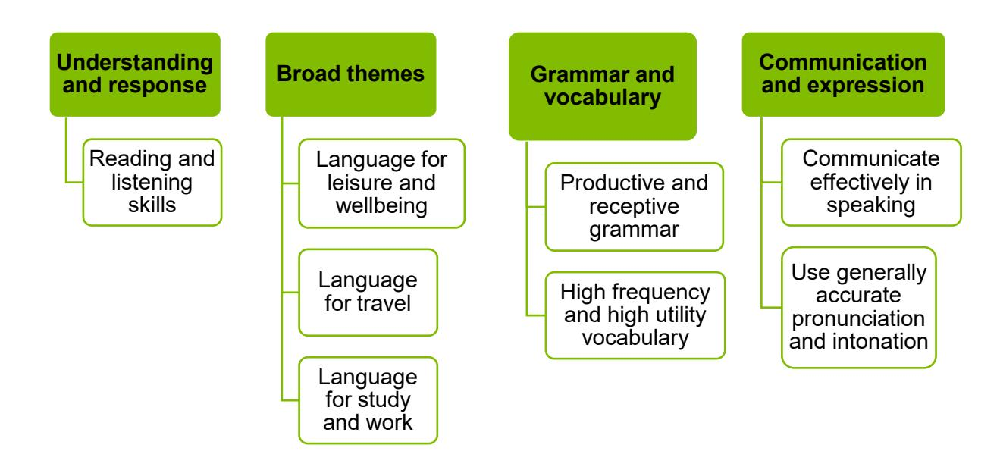

{1}------------------------------------------------

# WJEC GCSE Spanish

Approved by Qualifications Wales

Guidance for Teaching: Unit 1

Teaching from 2025 For award from 2027

Version 2 – February 2025

Ready for the world. This Qualifications Wales regulated qualification is not available to centres in England.

Made for Wales.

{2}------------------------------------------------

{3}------------------------------------------------

# SUMMARY OF AMENDMENTS

| Version | Description                                           | Page number |
|---------|-------------------------------------------------------|-------------|
| 2       | Table of possible questions for conversion task added | 25          |

{4}------------------------------------------------

# Contents

| Introduction                                                     | 1 |
|------------------------------------------------------------------|---|
| Aims of the Guidance for Teaching                                | 1 |
| Additional ways that WJEC can offer support:                     | 1 |
| Qualification Structure                                          | 1 |
| Assessment                                                       | 1 |
| Summary of Assessment                                            | 1 |
| Overview of Unit 1                                               | 1 |
| Unit 1 Assessment objectives and weightings                      | 1 |
| Unit 1 Teacher Guidance                                          | 1 |
| Oracy                                                            | 1 |
| Speaking and Listening                                           | 1 |
| Learning Experiences                                             | 1 |
| Opportunities for embedding elements of the Curriculum for Wales | 1 |
| Possible questions for the conversation task                     | 2 |
| Language for Study and Work                                      | 2 |
| Language for Travel                                              | 2 |
| Language for Leisure and Wellbeing                               | 2 |

{5}------------------------------------------------

# Introduction

The WJEC GCSE Spanish has been approved by Qualifications Wales and is available to all centres in Wales. It will be awarded for the first time in Summer 2027, using grades A\* to G.

## Aims of the Guidance for Teaching

The principal aim of the Guidance for Teaching is to support teachers in the delivery of WJEC GCSE Spanish and to offer guidance on the requirements of the qualification and the assessment process. The Guidance for Teaching is **not intended as a comprehensive reference**, but as support for teachers to develop stimulating and exciting courses tailored to the needs and skills of their learners. The guide offers possible classroom activities and links to useful resources (including our own, freely available digital materials and some from external sources) to provide ideas for immersive and engaging lessons.

## Additional ways that WJEC can offer support:

- sample assessment materials and mark schemes
- professional learning events
- examiners' reports on each unit
- direct access to the subject officer
- free online resources
- Exam Results Analysis
- Online Examination Review

{6}------------------------------------------------

# Qualification Structure

WJEC GCSE Spanish consists of 4 units. The qualification is linear and does not contain tiering. There is no hierarchy to the order the units should be taught.

|        | Unit title          | Type of Assessment         | Weighting |
|--------|---------------------|----------------------------|-----------|
| Unit 1 | Oracy               | Non-examination assessment | 30%       |
| Unit 2 | Reading and Writing | Non-examination assessment | 15%       |
| Unit 3 | Listening           | Written examination        | 20%       |
| Unit 4 | Reading and Writing | Written examination        | 35%       |

{7}------------------------------------------------

## Assessment Summary of Assessment

**Unit 1: Oracy**

**Non-examination assessment Speaking test: 7-10 minutes Preparation time: 10 minutes**

**30% of qualification**

**60 marks**

### Three tasks:

- Read aloud and role play
- Presentation and discussion
- Conversation

**Learners are not permitted to use a dictionary in any part of the assessment.**

{8}------------------------------------------------

# Overview of Unit 1

## Oracy

Non-examination assessment: Conducted in centre and marked by WJEC

Speaking test: 7-10 minutes Preparation time: 10 minutes

30% of qualification

60 marks

The purpose of this unit is to allow learners to:

- communicate meaningfully through speaking, describing, narrating, expressing and justifying opinions
- demonstrate their knowledge and understanding of Spanish through their responses
- demonstrate generally accurate pronunciation and intonation
- express themselves in a range of contexts
- contribute to a conversation.

The unit is based on the following:

{9}------------------------------------------------

## Assessment details

### Unit 1 – Oracy

The assessment lasts for 7–10 minutes

Preparation time: 10 minutes

30% of qualification

60 marks

This unit requires candidates to speak using clear and comprehensible Spanish to:

- read aloud a short sentence and participate in a role play
- give a presentation, prepared in advance, based on their own interest and take part in a short unprepared discussion relating to the presentation
- take part in a short unprepared conversation.

The rubrics and stimuli will all be in Cymraeg/English (except for the read aloud task). The language of response will be in the assessed language.

**Candidates are not permitted to use a dictionary in any part of the assessment. The assessment must be submitted digitally.**

# Task 1: Read aloud and role play

Candidates can make notes on one-side of A4 paper for the read aloud and role play during the preparation time (the notes will not be marked as part of the assessment).

### Task 1a: The read aloud

**The candidate will begin by reading aloud the short sentence in Spanish to demonstrate their understanding of sound-spelling correspondence.**

### Task 1b: The role play

The role play contains **four** interactions. The teacher will start the role play, they are not required to read out the scenario to the candidate and **must not** rephrase the prompts. Candidates may refer to notes to support them with the read aloud and the role play which must be given to the teacher immediately after the assessment.

During the role play, candidates will:

- respond appropriately to questions or statements as prompted by the bullet points on the role play card
- formulate a question.

Candidates should be able to demonstrate their understanding of the assessed language through their responses in a range of different settings to include the following:

- train/bus station
- tourist information office
- cinema/theatre/venue
- campsite/hostel/hotel
- pharmacy/doctor's surgery/hospital
- leisure centre
- shops
- café/restaurant
- in the home
- in town.

{10}------------------------------------------------

Candidates should be able to engage in transactions including asking and answering questions, asking for advice, making a complaint, reporting a problem, explaining, describing, giving reasons and expressing opinions. The scenario will provide candidates with guidance and prompts in Cymraeg/English on the responses that are required.

**Total time for read aloud and role play: 2 minutes**

**Total marks: 11**

**(AO2 – 8 marks) (AO3 – 3 marks)**

# Task 2: Presentation and Discussion

### Task 2a

Candidates will:

- give an oral presentation in which they communicate information, describe and narrate events. The presentation may be prepared two weeks in advance of the first timetabled assessment. The presentation can be on a subject of the learner's choosing which falls within **one** of the following **three** broad themes:
  - theme 1: language for leisure and wellbeing
  - theme 2: language for travel
  - theme 3: language for work and study.

**Marks: (AO1 – 6 marks) (AO3 – 3 marks)**

Candidates may prepare their presentation two weeks prior to the first timetabled assessment.

Candidates are not permitted to use a dictionary in the preparation of their presentation. Candidates may refer to prepared bullet points to support them with the delivery of their presentation (max. 30 words), complete and continuous sentences are not permitted. The bullet points must be given to the teacher immediately after the presentation (the bullet points will not be marked as part of the assessment).

### Task 2b

Candidates will:

- take part in an unprepared discussion relating to the presentation in the present, past and future tenses. Teachers will lead the discussion by asking questions relating to the presentation. The teacher may repeat or rephrase questions that the candidate does not understand.
- Teachers should provide opportunities for candidates to:
  - give clear responses to the questions they are asked (AO1)
  - use a variety of vocabulary, grammatical structures and different timeframes accurately (AO3).

Candidates may refer to prepared bullet points [max 30 words], to support them with the delivery of their presentation. The bullet points must be given to the teacher immediately after the presentation.

Examples of topics for the presentation are included in the Unit 1 Guidance for Teaching document.

**Marks: (AO1 – 10 marks) (AO3 – 5 marks)**

The presentation should last **no longer than 1 minute.**

The discussion should last between **2-3 minutes.**

{11}------------------------------------------------

**Total time for presentation and discussion: 3-4 minutes. Total marks for presentation and discussion: 24 marks (AO1 – 16 marks) (AO3 – 8 marks)**

### Task 3: Conversation

Candidates will contribute to a conversation based on one of the 3 broad themes. The conversation should be based on a different broad theme to the one chosen for the presentation. Teachers must inform candidates of the allocated broad theme for the conversation at the start of the 10 minutes preparation time. The conversation should be based on the broad theme that has not been covered in the presentation and the role play, so that all three broad themes are covered in the Unit 1 NEA. Candidates can make notes on one-side of A4 paper on the theme of the conversation during the preparation time (the notes will not be marked as part of the assessment).

The purpose of this element of the task is to encourage the candidate to demonstrate what language they know. In order to do this, teachers should provide opportunities for candidates to:

- give clear responses to the questions they are asked (AO1)
- develop their responses as far as they are able (AO1)
- express ideas and opinions
- use a variety of vocabulary, grammatical structures and different timeframes accurately (AO3).

Candidates may refer to notes made on the theme of the conversation during the preparation time which must be given to the teacher immediately after the assessment.

#### Questioning technique:

- Teachers should avoid asking prepared questions and should instead build a conversation based on individual candidate responses.
- Questions should ideally be succinct so that there is less teacher talk and more candidate talk.
- Closed questions, which generally lead to yes/no answers, should be followed-up with an opportunity to express opinions or give more information (prompted, for example, by '¿*Por qué*?' or ¿*Por qué no*?').
- Where possible, more open questions should be used in order to allow the candidate to offer more information/more developed responses.
- Useful question openers for extended answers could be '*Háblame de*…', '*Describe tu/s*…' or ¿ '*Qué piensas de*…?' for example.

**Total time for conversation: 2-4 minutes Total marks: 25 (AO1 – 20 marks) (AO3 – 5 marks)**

Teachers should tailor the complexity of the questions to the ability of the candidate. Questions may be repeated or rephrased during this part of the task. The teacher should use their judgement as to when to move on if a candidate does not understand or respond to a question even after rephrasing. In order to sustain conversation and avoid long silences, it is better to move to a different question to encourage the candidate to keep talking. Candidates should be given the opportunity to respond in the present, past and future tenses. Candidates may refer to notes to support them with the theme of the conversation which must be given to the teacher immediately after the assessment.

{12}------------------------------------------------

When asking questions Teachers should use the different areas of the broad theme as well as the candidate's interests and experiences to continue the conversation. Candidates should be given the opportunity to respond in the present, past and future tenses.

### Allocation of Role play cards:

The allocation of cards for the role play will be generated by the candidate's choice of broad theme for the presentation.

If the candidate's choice of presentations is from Theme 1, they must be allocated a role play from Theme 2. If the candidate's choice of presentations is from Theme 2, they must be allocated a role play from Theme 1. If the candidate's choice of presentations is from Theme 3, they may be allocated a role play from either Theme 1 or Theme 2.

There will be six role plays for Theme 1 and six role plays for Theme 2.

The first candidate must be given either card 1a or card 2a, depending on their choice of presentation. The second candidate must be given the prescribed card from the next row (depending on their choice of presentation), this sequence will continue for each teacher (not by the centre as a whole). After breaks in testing (including lunchtime and overnight) the sequence should continue. For example, if candidate 3 is tested before a break, the next candidate will be candidate 4. Teachers must follow this prescribed order.

| Candidate Order | Theme 1 Presentation | Theme 2 Presentation | Theme 3 Presentation |
|--------------------|-------------------------|-------------------------|-------------------------|
| 1                  | 2a                      | 1a                      | 1a                      |
| 2                  | 2b                      | 1b                      | 2b                      |
| 3                  | 2c                      | 1c                      | 1c                      |
| 4                  | 2d                      | 1d                      | 2d                      |
| 5                  | 2e                      | 1e                      | 1e                      |
| 6                  | 2f                      | 1f                      | 2f                      |
| 7                  | 2d                      | 1d                      | 2f                      |
| 8                  | 2a                      | 1f                      | 1b                      |
| 9                  | 2b                      | 1a                      | 2c                      |
| 10                 | 2e                      | 1e                      | 1d                      |
| 11                 | 2f                      | 1c                      | 2e                      |
| 12                 | 2c                      | 1b                      | 1a                      |

The allocation of role plays is designed to ensure that the assessment experienced by each candidate samples a range of vocabulary from the vocabulary list.

Please note the allocation order will change each year.

{13}------------------------------------------------

# Task setting

Tasks are set by WJEC. The assessment will be carried out by teachers at the centre, audio recorded and marked by external examiners. The role play cards will be sent to the Examinations Officer at the centre in a secure pack. Each centre will receive two packs. There will be instructions not to open the package until the specified date. Each candidate will be allocated one card. The list allocating the card to each candidate is shown above. The teacher must ensure that each candidate is assessed with the correct card. Teacher prompts for the role play, and guidance on setting questions for the discussion and conversation are provided below. The Teacher may open the packs up to three working days in advance of the first assessment date at the centre.

Centres must keep a record of the schedule (including dates) on which the assessments are conducted on the declaration form below. This form is for the centre and candidates to sign and declare that assessments have been conducted according to the requirements in the Assessment Pack and this must be submitted to WJEC with the audio recordings. Audio files should be uploaded to the WJEC Portal within 48 hours or two working days of the speaking assessments taking place.

### Task taking

Each candidate will have a preparation time of ten minutes prior to the commencement of the assessment. This preparation time must be supervised by an exam invigilator organised by the centre and who is not a subject specialist.

Candidates are not permitted to use dictionaries in any part of the assessment, including the preparation time.

Candidates are advised to spend their 10 minutes preparation time, practising the readaloud sub-vocally, making notes on what to say in the role play and conversation and of course, practising their presentation.

The candidate may bring prepared bullet points [maximum 30 words] to support with the delivery of the presentation into the assessment. During the preparation time, the candidate may, if they wish, make notes on the read aloud and role play, and the allocated theme of the conversation on one-side of A4 paper and refer to these during the assessment. The teacher must check the notes prior to the commencement of the assessment and remove the bullet points from the candidate if they contain complete and continuous sentences. Otherwise, the notes must be handed to the teacher at the end of the test, along with the role play. After the preparation period of 10 minutes, the teacher must ensure that the candidate spends the following times on each task:

### Approximate timings for oral assessment

| Task                        | Approximate timings      |
|-----------------------------|--------------------------|
| Role play                   | 2 minutes                |
| Presentation and discussion | 1 minute and 2-3 minutes |
| Conversation                | 2-4 minutes              |

The timing for the read aloud and role play is approximately 2 minutes but this will depend on each candidate. The timing for the presentation, discussion and conversation should be adhered to so that the candidate is able to access the full range of marks. The overall

{14}------------------------------------------------

timings must be adhered to and any speaking evidence that exceeds these timings will not be marked.

### Conducting the assessment

Candidates will be allowed one attempt at the assessment. Once the recording begins it cannot be paused or stopped until the end of the assessment. The only circumstances in which a candidate can be re-tested are if there is a technical malfunction during the assessment (so that, for example, the assessment has not been recorded or is inaudible) or an incident occurs beyond the teacher's control which prevents the completion of the assessment. In any such circumstance, the teacher must inform WJEC immediately via the Examinations Officer at the centre. WJEC will then inform the centre which role play to use in place of the original allocation.

Detailed instructions regarding the process for submitting the materials will be communicated to centres through Examination Officers.

When introducing each candidate, the following convention must be used: Specification/centre number/candidate number/candidate name/role play card/ presentation theme/conversation theme/date.

{15}------------------------------------------------

# Unit 1 Assessment objectives and weightings

| AO1 | Understand and respond to spoken language through communication and expression in speaking and writing   | 18% |
|-----|----------------------------------------------------------------------------------------------------------------|-----|
| AO2 | Understand and respond to written language through communication and expression in speaking and writing. | 4%  |
| AO3 | Demonstrate knowledge of grammar, vocabulary and sound-spelling correspondence.                          | 8%  |

{16}------------------------------------------------

# Unit 1 Teacher Guidance

|                                       | Content Amplification                                                                                                                                                                                                                                                                                                                                                                                                                                                                                                                                                                                                                                                                                                                         | Teacher Guidance                                                                                                                                                                                                                                                                                                                                                                                                                                                                                                                                                                                                                                                                                                                                                                                                                                                                                                                                                                                                                                                                                                                                                                                                                                                                                                                                                                                                                                                                                                                                                                                                       |
|---------------------------------------|-----------------------------------------------------------------------------------------------------------------------------------------------------------------------------------------------------------------------------------------------------------------------------------------------------------------------------------------------------------------------------------------------------------------------------------------------------------------------------------------------------------------------------------------------------------------------------------------------------------------------------------------------------------------------------------------------------------------------------------------------|------------------------------------------------------------------------------------------------------------------------------------------------------------------------------------------------------------------------------------------------------------------------------------------------------------------------------------------------------------------------------------------------------------------------------------------------------------------------------------------------------------------------------------------------------------------------------------------------------------------------------------------------------------------------------------------------------------------------------------------------------------------------------------------------------------------------------------------------------------------------------------------------------------------------------------------------------------------------------------------------------------------------------------------------------------------------------------------------------------------------------------------------------------------------------------------------------------------------------------------------------------------------------------------------------------------------------------------------------------------------------------------------------------------------------------------------------------------------------------------------------------------------------------------------------------------------------------------------------------------------|
| Oracy Speaking and Listening | Learners should be able to: • develop their listening skills to understand and respond to different types of spoken language in a range of different contexts • use their knowledge of grammar and vocabulary to support their understanding including the relationship between the past, present and future tenses • communicate and interact clearly and effectively for different purposes • communicate information, ideas and opinions in a variety of contexts • use their knowledge of vocabulary and grammar to communicate meaningfully • reference past, present and future events where appropriate • use more complex structures where appropriate • use generally accurate pronunciation and intonation. | Practise listening and reacting to spoken Spanish regularly, through for example, the use of audio, video clips, teacher recorded listening activities, and pair and group activities which involve giving and receiving information. Questions from SAMs for Unit 1 could be used for revision but also for starters and plenaries in lessons, as well as whole class exam run throughs involving discussion of how to tackle different types of questions on each part of the exam. Regular use of speaking activities such as 'trapdoor', and 'find someone who...' can build confidence whilst providing a model of the language to support learners.  Practise pronunciation regularly, addressing common errors in order to develop confidence on the first role play sentence which is the sound-spelling correspondence task. Learners should have opportunities to read aloud from a range of material so that they consolidate patterns and develop confidence, using audio applications may assist with this during lessons for learners to self-check. Learners would benefit from access to a reference list of common sound-spelling correspondence rules to which they could refer as they read aloud, for example when working in pairs, so that they can reflect upon and improve each other's pronunciation. A variety of activities which would support learners to consider sound-spelling correspondence include listening to songs, video clips and completing gap-fill activities, or the teacher mispronouncing words that learners are reading and asking learners to spot the mistake. |

{17}------------------------------------------------

Ensure learners are familiar with question words in Spanish and are able to formulate questions themselves. Activities such as matching questions and answers in Spanish, providing an answer and asking the learners to formulate the question, 'what am I?' and 'guess who?' can help develop proficiency.

Ensure learners understand the 'tú' and 'usted' form of verbs to support them in responding to role play tasks and that they have the opportunity to practise using these in role play phrases and questions. Tasks where learners choose the right form based on the person and situation may be useful e.g. responding to the headteacher, a friend, an elderly neighbour. Practise manipulating common verbs into present, past and future tenses, through starter activities such as drilling verb endings, re ordering sentences and choosing the correct verb to complete a sentence. Ensure learners can recognise time markers in past, present and future tenses, through approaches such as categorising, word banks and gap -fill exercises.

Support pupils to develop a bank of useful opinions and complex phrases which they are confident in using, through including these in starter tasks , for example categorise the phrase into sentence starter/opinion/reason and consider creating cross topic knowledge organisers from which learners can select a range of phrases. Encourage pupils to include a range of opinions, reasons and complex phrases, with different tenses , in every task where they produce Spanish so that they become confident in this, knowledge organisers or similar can support them with selecting these appropriately. This can be practised by regularly asking pupils to formulate opinions and reasons on different topics, either as a mini plenary using whiteboards or as a longer task in pairs /groups. 'Speed dating' where learners ask several other learners for responses and react to these may be helpful.

{18}------------------------------------------------

Learners should be able to demonstrate their understanding of Spanish through their responses in a range of different settings to include the following:

- train / bus station
- tourist information office
- cinema / theatre / venue
- campsite / hostel / hotel
- pharmacy / doctor's surgery / hospital
- leisure centre
- shops
- café / restaurant
- in the home
- in town.

Practise the key vocabulary that will be needed for role play tasks in these settings.

There are multiple ways of teaching and learning vocabulary. Activities where learners test themselves or each other can work well in consolidating recall. Learners can test each other from the vocabulary lists provided by WJEC, you may wish to make card games or sets from these with which learners can test each other in pairs or groups Teachers may also find apps helpful for learners to learn and test themselves. ['Memrise'](https://www.memrise.com/) or ['Quizlet'](https://quizlet.com/gb) and online activities such as ['Kahoot'](https://kahoot.it/) and ['Blooket'](https://www.blooket.com/) can be useful as revision, home learning and class activities.

Learners should be able to engage in transactions including:

- asking and responding to questions
- asking for advice
- making a complaint
- reporting a problem
- explaining, describing and giving reasons
- expressing opinions.

Learners will be required to:

- participate in a role play
- give a presentation, prepared in advance, based on their own interest and take part in a short unprepared discussion relating to the presentation
- take part in a short unprepared conversation.

Learn and practise useful sentence starters and verbs. Activities where the sentence is given but needs to be re-ordered can provide a model. Working in pairs and groups of learners can be helpful when practising these responses. Learners should be encouraged to consider what they can say in Spanish to meet the response as responses are usually not prescriptive, therefore many different answers can be acceptable providing the grammar is correct.

Teachers should ensure that learners are familiar with the mark scheme and that during the role play, they do not extend answers but instead focus on an accurate and suitable response with a verb for each response which they formulate. Regularly practising a role play phrase as a starter activity can be helpful, as can asking learners to formulate a response and display it on a mini whiteboard before discussing the appropriate responses as a class. This approach can also be used with forming the question. Encourage learners to be a 'detective' and decide what the instruction is asking them for e.g. a past tense verb. Learners could write and test/perform for each other in role plays.

{19}------------------------------------------------

Lea rners should be encouraged to develop extended sentences in the presentation and to practise the pronunciation of their planned presentation. They should aim to attempt extended answers to the discussion questions in order to develop their responses.

Learners should have regular opportunities to present to others in a range of contexts. You may wish to begin with learners presenting a few sentences on a subject that they have researched, providing sentence starters as a guide. Initially, this could be carried out in pairs/groups and with visual support such as a PowerPoint or Sway. Presentations could also be encouraged in the style of a podcast or guide on aspects such as a region or cultural practice of Spain or a Spanish speaking country. In preparation for delivering their presentation NEA, learners should also have regular practi se devising bullet points to support their presentations.

You may wish to take an example presentation and discuss explicitly with the class what the key points are that would formulate the bullet points and how these would best help them to remember the structure of their work. Learners could then carry out this activity for other exemplar presentations before devising bullet points for their own work. · Mock NEA tasks can be helpful in allowing learners to practise this skill under NEA conditions.

Learners become accustomed to anticipating the sorts of questions that might be asked about their presentations. This could be done in groups or as a class activity. You could also encourage learners to formulate a follow -up question each to ask peers who are presenting to the class on different topics. As well as helping them to predict questions, this will also help develop learners' listening skills.

For the conversation, learners would benefit from confidence in using opinions, reasons, manipulating tenses and being able to ask a simple question of the teacher.

{20}------------------------------------------------

It is important to remind learners that the grammatical structures and vocabulary they learn across the three themes can be transferred and recycled in different contexts. Learners should be given regular opportunities to convey information, describe and narrate events across the three themes, and to develop their responses by providing opinions and reasons. Word banks/vocabulary mats can be useful to build familiarity, as can encouraging learners to create their own personalised lists of phrases in different tenses, with opinions, reasons and connectives which they develop and become familiar with over the course.

Discussion with learners around the preparation of questions for such activities would be part of preparation and it would be important to highlight that questions should be designed to allow learners to respond in different tenses and to develop and extend their answers as fully as possible with consideration of the strengths of the individual learner. It may be helpful to devise a bank of questions for learners across the three themes which include opportunities for expression in the past, present and future tenses and to give extended answers. However, this should not be exhaustive and should be adapted in the NEA to best support and stretch each individual learner. Tense work could also be practised, for example by asking learners to change a conversation about the future into the past by changing tenses and time markers. Learners could practise from the question bank using card prompts to generate quick fire responses to build confidence.

{21}------------------------------------------------

# Learning Experiences

Learners should be encouraged to consider the following learning experiences and skills to further develop their understanding, appreciation and awareness of the subject content. Information in the table below provides opportunities for teachers to integrate the learning experiences into delivery.

| Learning Experience                                                                                                                                                         | Exemplification of Learning Experience                                                                                                                                                                                                                                                                                                                                                                                                                                                                                                                                                                                                                                                                                                                                                                                                                                                                                                                                                                                                                                                                                                                                                                                                                                                                  |
|-----------------------------------------------------------------------------------------------------------------------------------------------------------------------------|---------------------------------------------------------------------------------------------------------------------------------------------------------------------------------------------------------------------------------------------------------------------------------------------------------------------------------------------------------------------------------------------------------------------------------------------------------------------------------------------------------------------------------------------------------------------------------------------------------------------------------------------------------------------------------------------------------------------------------------------------------------------------------------------------------------------------------------------------------------------------------------------------------------------------------------------------------------------------------------------------------------------------------------------------------------------------------------------------------------------------------------------------------------------------------------------------------------------------------------------------------------------------------------------------------|
| Learn about the culture and society in the countries and communities where the international language is spoken                                                 | Role play tasks are based on real-life interactions in Spanish speaking countries. For Theme 1, learners could listen and respond to material on Spanish-speaking figures, using this as a basis for practise of presentation and conversation tasks. For Theme 2, learners could focus on a Spanish-speaking country and practise presenting their information in a logical structure with peers asking questions to practise question formulation.                                                                                                                                                                                                                                                                                                                                                                                                                                                                                                                                                                                                                                                                                                                                                                                                                               |
| Explore the cross-cutting themes of human rights and diversity, including Black, Asian and minority ethnic perspectives, identity, culture and contributions | Pupils may choose to discuss some of these issues in their speaking presentation for Unit 1. You may wish to watch a film based in a Spanish speaking country such as 'La Misma Luna' which documents the experiences of a range of Mexican Americans and explores the issues of legal and illegal immigration through a child's perspective. Learners may use aspects of the film as a starting point for their presentation, practising giving opinions, reasons and narrating events. There is a rich variety of Spanish language music which could be useful for practising sound spelling correspondence through gap fill activities of lyrics, whilst exploring the themes of the songs.                                                                                                                                                                                                                                                                                                                                                                                                                                                                                                                                                                            |
| Have direct or indirect contact with speakers of the language                                                                                                            | Centres may choose to engage with initiatives such as MFL Mentoring Cymru, Routes into Languages and Taith who provide multilingualism opportunities and exchanges with native speakers. Learners could work with the ambassador either through video conferencing or face-to-face. They could, for example, prepare to interview the speaker and in preparation they could devise questions, giving consideration to a suitable register. Such an interview could be based around any of the three themes but may fit particularly well with Theme 3; as student ambassadors are studying at Welsh universities it may be valuable to focus on areas such as their higher education and future plans, looking at how their language journey has informed their study and career choices. Taith may afford the opportunity for travel or exchange with learners in a Spanish speaking country, with the significant level of transactional language practise that this affords learners. Centres can also apply for funding via Taith - Hwb (gov.wales) to take part in educational international exchanges. Centres could also partner with a school in a Spanish-speaking country, for example, via the British Council: Partner with a school. |
|                                                                                                                                                                             | This may cover a variety of themes, as well as providing useful transactional language practise and sound spelling correspondence.                                                                                                                                                                                                                                                                                                                                                                                                                                                                                                                                                                                                                                                                                                                                                                                                                                                                                                                                                                                                                                                                                                                                                                      |
| Engage with the language from a variety of sources and in a variety of genres and media                                                                                     | Learners will have the opportunity to engage with the language from a variety of sources such as literature, media and in different contexts as they practise the skills of oracy. They will use language for different purposes and contexts. Podcasts, interviews and video clips from Spanish speaking media such as BBC Mundo may be useful with support such as subtitles, vocabulary lists. These could be used for practising listening, sound spelling correspondence, as well as a starting point for building sentences using opinions, reasons and narrating events.                                                                                                                                                                                                                                                                                                                                                                                                                                                                                                                                                                                                                                                                                                                         |
| Demonstrate language strategies and language learning skills, including the use of dictionaries                                                                             | Learners will have the opportunity to demonstrate language strategies and language learning skills. Learners will demonstrate transactional language skills as well as preparing their own presentation and engaging in discussion and conversation. Learners should be taught how to identify and search for nouns, verbs, adjectives and adverbs and how to recognise and apply these to their own speaking work. Activities such as cloze tasks, colour coding and categorising may be helpful. Analysing how parts of a sentence fit together can support learners in their own use of grammar.                                                                                                                                                                                                                                                                                                                                                                                                                                                                                                                                                                                                                                                                                                  |
| Translanguaging                                                                                                                                                             | Learners will have the opportunity to use their translanguaging skills, through discussion on topics which have impact both in Wales and Spanish speaking countries. It may be interesting to study the Welsh context in Patagonia and the links between the region and Wales currently.                                                                                                                                                                                                                                                                                                                                                                                                                                                                                                                                                                                                                                                                                                                                                                                                                                                                                                                                                                                                             |
| Make use of digital technology                                                                                                                                              | Learners will have the opportunity to make use of digital technology which may be particularly beneficial when practising speaking and responding to Spanish. For example, learners can record and play back audio of themselves speaking and practising Spanish. They may use technology as part of an exchange project or to speak with a student languages ambassador, as well as to practise vocabulary using apps.                                                                                                                                                                                                                                                                                                                                                                                                                                                                                                                                                                                                                                                                                                                                                                                                                                                                              |
| Making appropriate connections with other parts of the curriculum to develop and deepen learners' bilingual and multilingual skills                                         | Learners will be encouraged to make connections with other parts of the curriculum throughout their learning of Spanish with cross-curricular connections to humanities subjects, and of course with the other languages within the LLC Area of Learning Experience. The three broad themes will allow learners to make links between their experiences in Wales and those in Spanish speaking countries as well as linking to many areas of the Curriculum for Wales. Where appropriate, links may be drawn between grammatical structures, such as the formal and informal you, and where vocabulary has a similar word stem to Welsh.                                                                                                                                                                                                                                                                                                                                                                                                                                                                                                                                                                                                                                                          |
| Curriculum for Wales Strands                                                                                                                                                |                                                                                                                                                                                                                                                                                                                                                                                                                                                                                                                                                                                                                                                                                                                                                                                                                                                                                                                                                                                                                                                                                                                                                                                                                                                                                                         |
| Cross-cutting Themes                                                                                                                                                        |                                                                                                                                                                                                                                                                                                                                                                                                                                                                                                                                                                                                                                                                                                                                                                                                                                                                                                                                                                                                                                                                                                                                                                                                                                                                                                         |
| Local, National & International Contexts and Sustainability                                                                                                                 | There are many opportunities to include Local, National & International Contexts and Sustainability in GCSE Spanish. These opportunities are important to Learners because they allow them to explore current issues and debates around sustainability in different forms. These also allow learners to develop their curiosity about the Spanish language and Spanish-speaking cultures as well as gaining an understanding of the importance of international languages.                                                                                                                                                                                                                                                                                                                                                                                                                                                                                                                                                                                                                                                                                                                                                                                                                              |
|                                                                                                                                                                             | Below are some examples of how Local, National & International Contexts and Sustainability can be embedded into teaching and learning:                                                                                                                                                                                                                                                                                                                                                                                                                                                                                                                                                                                                                                                                                                                                                                                                                                                                                                                                                                                                                                                                                                                                                                  |
|                                                                                                                                                                             | <b>Example</b> Learners will be able to explore issues regarding sustainability in relation to Spain and Spanish speaking countries. For example, they could practise giving opinions relating to restrictions in Spanish holiday resorts or around environmental issues in Spanish countries. This could be practised in class by responding to video clips or images as stimulus material. Learners may choose to prepare their presentation on an issue related to this to explore it in more detail.Learners could explore links between Spanish-speaking cultures and Welsh, such as the Welsh community of Patagonia, and use this as a basis for presentation topics, as well as listening to and responding to audio visual material which would allow listening and speaking practise.                                                                                                                                                                                                                                                                                                                                                                                                                                                                                                         |
| Human Rights Education and Diversity                                                                                                                                        | There are many opportunities to include Human Rights Education and Diversity in GCSE Spanish. These opportunities are important to Learners because they will be able to explore and consider these issues in relation to people in Spanish speaking countries. Below are some examples of how Human Rights Education and Diversity can be embedded into teaching and learning: <b>Example</b> Learners will have the opportunity to prepare a presentation of their choice which offers the scope to explore diversity throughout the Spanish speaking world. Learners could focus on a particular Spanish speaking country or area, or explore an issue in Spain itself. Learners should be encouraged to practise answers that respond to the mark scheme. Stimulus material could be photographs, video clips, documentaries or independent research.Learners could practise presenting to peers in small groups to share knowledge of different issues.                                                                                                                                                                                                                                                                                                                                         |
| Careers and Work-Related Experiences                                                                                                                                        | There are many opportunities to include Career and Work-Related Experiences (CWRE) in GCSE Spanish. These opportunities are important to Learners because they will be able to use the Spanish they have learned in employment and work experience. Below are some examples of how CWRE can be embedded into teaching and learning: <b>Example</b> The role play task features transactional language in a range of everyday settings in Spain and Spanish speaking countries and allows learners to practise interacting and understanding language relating to various settings. The vocabulary and grammar required for this task will allow pupils to engage in simple workplace communication. During learning activities, learners should become familiar with key terms for the settings and purposes outlined in the specification. In the conversation task, learners may have the opportunity to discuss study and work in Theme 3.Learners could plan questions and interview Student Language Ambassadors from Routes into Languages – Llwybrau at ieithoedd Cymru, who are Spanish-speakers currently in higher education.                                                                                                                                                              |
| Cross-curricular Skills - Literacy                                                                                                                                          |                                                                                                                                                                                                                                                                                                                                                                                                                                                                                                                                                                                                                                                                                                                                                                                                                                                                                                                                                                                                                                                                                                                                                                                                                                                                                                         |
|                                                                                                                                                                             | There are many opportunities to include Literacy in GCSE Spanish. These opportunities are important to Learners because they will be able to understand and respond to spoken Spanish. Below are some examples of how Literacy can be embedded into teaching and learning:                                                                                                                                                                                                                                                                                                                                                                                                                                                                                                                                                                                                                                                                                                                                                                                                                                                                                                                                                                                                                           |
|                                                                                                                                                                             |                                                                                                                                                                                                                                                                                                                                                                                                                                                                                                                                                                                                                                                                                                                                                                                                                                                                                                                                                                                                                                                                                                                                                                                                                                                                                                         |
| Speaking                                                                                                                                                                    | Example Learners will speak for a range of purposes, for transactional language in the role play, to more extended speech during presentation and discussion and the conversation where they can explore ideas, narrate events and describe opinions and reasons in more detail.Learners can practise spoken language in pair and group activities, where they have to seek or exchange information, such as 'speed dating', 'find someone who' and record the language they hear.                                                                                                                                                                                                                                                                                                                                                                                                                                                                                                                                                                                                                                                                                                                                                                                                                   |

{22}------------------------------------------------

{23}------------------------------------------------

# Opportunities for embedding elements of the Curriculum for Wales

{24}------------------------------------------------

{25}------------------------------------------------

{26}------------------------------------------------

# Cross-curricular Skills - Numeracy

Understanding the number system helps us to represent and compare relationships between numbers and quantities **There are many opportunities to include Numeracy in GCSE Spanish. These opportunities are important to Learners because they will be able to understand and communicate numerical information in Spanish.**

**Below are some examples of how Numeracy can be embedded into teaching and learning:**

#### Example

- Learners will be able to communicate using numbers, prices and times in Spanish, as well as quantities and sizes.
- Number games can be useful to reinforce this, such as bingo, 21s, as well as role play tasks involving numbers, quantities and sizes.

# Cross-curricular Skills – Digital Competency

**There are many opportunities to include Digital Competency in GCSE Spanish. These opportunities are important to Learners because they will be able to use these skills to practise their Spanish.**

**Below are some examples of how Digital Competency can be embedded into teaching and learning:**

Interacting and Collaborating

#### Example

- Learners could use digital skills to research information for their presentation task. They may also wish to use audio and recording software to practise and record themselves to develop pronunciation and intonation and present this to each other to practise.
- If the opportunity to interview a native speaker, take part in a virtual exchange or speak with a student languages ambassador arises, then use of video conferencing applications would be of use in allowing real time communication.

{27}------------------------------------------------

| Integral Skills                       |                                                                                                                                                                                                                                                                                                                                                                                                                                                                                                                                                                                                                                         |
|---------------------------------------|-----------------------------------------------------------------------------------------------------------------------------------------------------------------------------------------------------------------------------------------------------------------------------------------------------------------------------------------------------------------------------------------------------------------------------------------------------------------------------------------------------------------------------------------------------------------------------------------------------------------------------------------|
| Creativity and Innovation             | There are many opportunities to include Creativity and Innovation in GCSE Spanish. These opportunities are important to Learners because they will be able to explore and discuss ideas and events in Spanish. Below are some examples of how Creativity and Innovation can be embedded into teaching and learning:                                                                                                                                                                                                                                                                                                                  |
|                                       | Example                                                                                                                                                                                                                                                                                                                                                                                                                                                                                                                                                                                                                                 |
|                                       | Learners will research and present their own presentation, which allow them to demonstrate their own creativity within their chosen area.                                                                                                                                                                                                                                                                                                                                                                                                                                                                                               |
| Critical Thinking and Problem Solving | There are many opportunities to include Critical Thinking and Problem Solving in GCSE Spanish. These opportunities are important to Learners because they will be able to respond to and use transactional language in a variety of situations and contexts. Below are some examples of how Critical Thinking and Problem Solving can be embedded into teaching and learning:                                                                                                                                                                                                                                                        |
|                                       | Example                                                                                                                                                                                                                                                                                                                                                                                                                                                                                                                                                                                                                                 |
|                                       | Learners will need to use problem solving in the role play task to formulate a suitable response to the instructions given. In the presentation and discussion and the conversation, learners will be able to develop critical thinking as they develop ideas, opinions, reasons and narrate events.Analysing good examples of presentation and conversation tasks, to identify past, present and future tenses as well as opinions and reasons would be of use to enable learners to apply these to their own work.Responding to listening tasks, looking for time markers, and sound spelling correspondence will be useful practise. |
| Planning and Organisation             | There are many opportunities to include Planning and Organisation in GCSE Spanish. These opportunities are important to Learners because they will be able to plan and prepare their presentation to meet the requirements of the task.                                                                                                                                                                                                                                                                                                                                                                                                 |
|                                       | Below are some examples of how Planning and Organisation can be embedded into teaching and learning: <b>Example</b> Learners will demonstrate planning and organisation in the preparation of their presentation task. They will also be able to demonstrate that they have planned suitable responses to the role play task and to organise their ideas in the conversation task.Learners could demonstrate that they have considered the requirements of the mark scheme, considered the timing and planned the structure of their presentation.                                                                                |
| Personal Effectiveness                | There are many opportunities to include Personal Effectiveness in GCSE Spanish. These opportunities are important to Learners because they will gain knowledge and confidence in Spanish communication.                                                                                                                                                                                                                                                                                                                                                                                                                                 |
|                                       | Below are some examples of how Personal Effectiveness can be embedded into teaching and learning:                                                                                                                                                                                                                                                                                                                                                                                                                                                                                                                                       |
|                                       | <b>Example</b> Learners will be able to communicate in a range of real-life situations in Spanish speaking countries through the role play task. Learners will have the opportunity to develop their critical thinking and presentation skills through the other tasks, building confidence.Learners could listen and offer feedback to each other on presentation tasks, which would enable them to further develop their own presentation skills.Learners could practise manipulating grammar so that they become adept at changing high frequency verbs between past, present and future tenses.                                  |

{28}------------------------------------------------

{29}------------------------------------------------

# Possible questions for the conversation task

N.B these are not prescriptive or exhaustive and teacher-examiners may ask any questions which elicit a response appropriate to the broad themes.

## Language for Leisure and Wellbeing

| ¿La familia es importante para ti?                                             |
|--------------------------------------------------------------------------------|
| ¿Cuáles son tus pasatiempos preferidos?                                        |
| ¿Cuál es tu deporte favorito? (¿Por qué?)                                      |
| ¿Qué actividad te gustaría hacer en el futuro?                                 |
| ¿Qué haces para descansar?                                                     |
| ¿Qué tipo de música te gusta?                                                  |
| ¿Te interesa la moda? (¿Por qué (no)?)                                         |
| ¿Es importante llevar ropa de diseño? (¿Por qué (no)?)                         |
| ¿Podrías vivir sin Internet?                                                   |
| ¿Crees que los jóvenes pasan demasiado tiempo con pantallas?                   |
| ¿Cuáles son las ventajas y desventajas de los medios sociales?                 |
| ¿Es importante llevar una vida saludable? (¿Por qué (no)?)                     |
| ¿Qué hiciste la semana pasada para mantenerte en forma?                        |
| ¿Qué harás el fin de semana que viene?                                         |
| ¿Es importante probar comida diferente? (¿Por qué (no)?)                       |
| Háblame de la última vez que fuiste a un restaurante.                          |
| ¿Prefieres celebrar tu cumpleaños con tus amigos o con tu familia? (¿Por qué?) |
| ¿Qué harás para celebrar tu cumpleaños el año que viene?                       |
| ¿Cómo sería tu cumpleaños ideal?                                               |

### Language for Travel

| ¿Qué se puede hacer en tu pueblo/ciudad?                                 |
|--------------------------------------------------------------------------|
| ¿Qué hiciste el fin de semana pasado en tu región?                       |
| ¿Qué te gustaría tener en tu región en el futuro?                        |
| ¿Cuáles son las ventajas y desventajas del transporte público?           |
| ¿Cómo viajaste al colegio ayer?                                          |
| Describe tus vacaciones ideales.                                         |
| ¿Crees que las playas son más populares que los museos? (¿Por qué (no)?) |
| ¿Crees que el turismo tiene muchas ventajas? (¿Por qué (no)?)            |
| ¿Qué hiciste durante las vacaciones escolares el verano pasado?          |
| ¿Qué harás para tus vacaciones el año que viene? (¿Por qué?)             |
| ¿Dónde te gustaría visitar en España? (¿Por qué?)                        |
| ¿Recomendarías visitar a España? ¿Por qué (no)?                          |
| ¿Qué cosas reciclas en casa?                                             |
| ¿Crees que es importante reciclar? (¿Por qué (no)?)                      |
| ¿Qué hiciste recientemente para ayudar el medioambiente?                 |

{30}------------------------------------------------

### Language for Study and Work

| ¿Qué piensas del uniforme escolar? (¿Por qué (no)?)                                 |
|-------------------------------------------------------------------------------------|
| Describe tu uniforme escolar.                                                       |
| Describe tu escuela.                                                                |
| ¿Qué asignaturas se pueden estudiar en tu colegio?                                  |
| ¿Es importante estudiar una lengua?                                                 |
| ¿Por qué elegiste estudiar el español?                                              |
| ¿Qué actividades se pueden hacer en tu instituto?                                   |
| ¿Qué hiciste en el colegio la semana pasada?                                        |
| ¿Son importantes las cualificaciones para un trabajo?                               |
| ¿Es más importante tener experiencia o cualificaciones? ¿Por qué?                   |
| ¿Crees que los jóvenes tienen demasiados exámenes? (¿Por qué (no)?)                 |
| ¿Qué harás después de tus exámenes?                                                 |
| Para los jóvenes ¿Es importante tener un trabajo a tiempo parcial? (¿Por qué (no)?) |
| ¿Qué tipo de trabajo harás en el futuro?                                            |
| ¿Cuál sería tu trabajo ideal?                                                       |
| ¿En tu opinión es importante ir a la universidad? (¿Por qué (no)?)                  |
| ¿Ya has tenido una entrevista de trabajo?                                           |
| ¿Te gustaría vivir/estudiar/trabajar al extranjero? (¿Por qué (no)?)                |