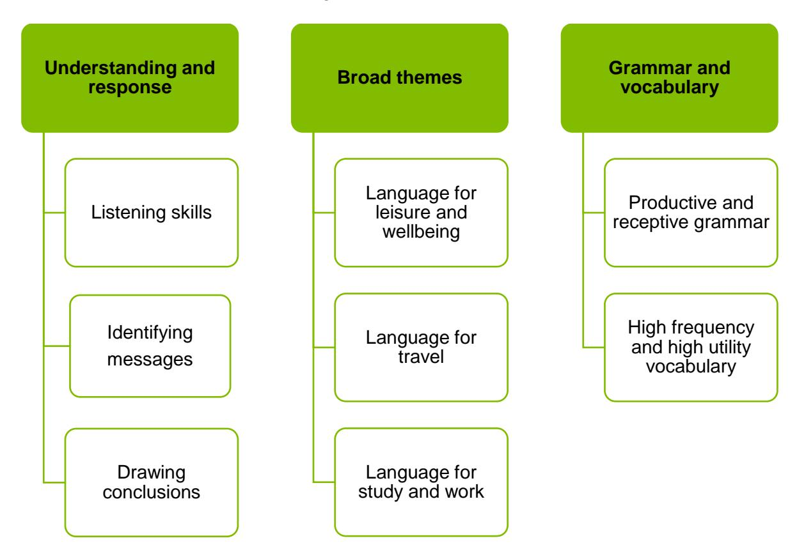

{0}------------------------------------------------

# WJEC GCSE Spanish

Approved by Qualifications Wales

Guidance for Teaching: Unit 3

Teaching from 2025 For award from 2027

Ready for the world. This Qualifications Wales regulated qualification is not available to centres in England.

Made for Wales.

{1}------------------------------------------------

{2}------------------------------------------------

# Contents

| Introduction                                                     | 1  |
|------------------------------------------------------------------|----|
| Aims of the Guidance for Teaching                                | 1  |
| Additional ways that WJEC can offer support:                     | 1  |
| Qualification Structure                                          | 2  |
| Assessment                                                       | 3  |
| Summary of Assessment                                            | 3  |
| Overview of Unit 3                                               | 4  |
| Unit 3 Assessment objectives and weightings                      | 6  |
| Unit 3 Teacher Guidance                                          | 7  |
| Listening                                                        | 7  |
| Learning Experiences                                             | 13 |
| Opportunities for embedding elements of the Curriculum for Wales | 18 |

{3}------------------------------------------------

# Introduction

The WJEC GCSE Spanish has been approved by Qualifications Wales and is available to all centres in Wales. It will be awarded for the first time in Summer 2027, using grades A\* to G.

### Aims of the Guidance for Teaching

The principal aim of the Guidance for Teaching is to support teachers in the delivery of WJEC GCSE Spanish and to offer guidance on the requirements of the qualification and the assessment process. The Guidance for Teaching is **not intended as a comprehensive reference**, but as support for teachers to develop stimulating and exciting courses tailored to the needs and skills of their learners. The guide offers possible classroom activities and links to useful resources (including our own, freely available digital materials and some from external sources) to provide ideas for immersive and engaging lessons.

### Additional ways that WJEC can offer support:

- sample assessment materials and mark schemes
- professional learning events
- examiners' reports on each unit
- direct access to the subject officer
- free online resources
- Exam Results Analysis
- Online Examination Review

{4}------------------------------------------------

### Qualification Structure

WJEC GCSE Spanish consists of 4 units. The qualification is linear and does not contain tiering. There is no hierarchy to the order the units should be taught.

|  | Unit title | Type of Assessment | Weighting |
|--------|---------------------|----------------------------------|-----------|
| Unit 1 | Oracy | Non examination assessment | 30% |
| Unit 2 | Reading and Writing | Non examination assessment | 15% |
| Unit 3 | Listening | Written examination | 20% |
| Unit 4 | Reading and Writing | Written examination | 35% |

{5}------------------------------------------------

# Assessment Summary of Assessment

**Unit 3: Listening Written examination***:* **45 minutes 20% of qualification** 

**45 marks**

• listening comprehension tasks with fixed and written responses

**Learners are not permitted to use a dictionary in any part of the assessment.**

{6}------------------------------------------------

# Overview of Unit 3

### **Listening**

Written examination: 45 minutes (including 5 minutes reading time) Set and marked by WJEC 20% of the qualification 45 marks

The purpose of this unit is to:

- allow learners to understand Spanish by listening and responding to spoken Spanish
- identify messages and draw conclusions through listening to extracts including the following formats: adverts, messages, podcasts, announcements, conversations and interviews
- demonstrate their knowledge and understanding of the vocabulary, grammar and structures of Spanish
- demonstrate their knowledge and understanding of spoken Spanish.

The unit will be based on the following:

{7}------------------------------------------------

### Assessment details

Written examination: 45 minutes (including 5 minutes reading time) Set and marked by WJEC 20% of qualification 45 marks

The recordings will be issued as an MP3 sound file for centres to download from WJEC Portal on the day of the assessment. The invigilator for the assessment is responsible for administering the recordings.

This unit requires learners to respond to a range of questions through fixed responses and through written responses in Cymraeg/English.

### Learners will:

- listen to extracts including the following formats: adverts, messages, podcasts, announcements, conversations and interviews
- answer the following question types: multiple choice questions, short answer questions (3-4 words), identifying true statements, matching statements with their source, gap-fill and finish the sentences
- hear spoken extracts three times.

The rubrics will be in Cymraeg/English. The language of response will be either nonverbal or the assessed language.

**Learners are not permitted to use a dictionary in any part of the assessment.**

{8}------------------------------------------------

### Unit 3 Assessment objectives and weightings

| AO1 | Understand and respond to spoken language through communication and expression in speaking and writing | 20% |
|-----|----------------------------------------------------------------------------------------------------------------|-----|
| AO2 | Understand and respond to written language through communication and expression in speaking and writing. | - |
| AO3 | Demonstrate knowledge of grammar, vocabulary and sound-spelling correspondence. | - |

{9}------------------------------------------------

# Unit 3 Teacher Guidance

| Listening |                                                                                                                                                                                                                                                                                                                                                                                                                                                                                                                                                                |                                                                                                                                                                                                                                                                                                                                                                                                                                                                                                                                                                                                                                                                                                                                                                                                                                                                                                                                                                                                                                                                                                                                                                                                                                                                                                                                                                          |
|-----------|----------------------------------------------------------------------------------------------------------------------------------------------------------------------------------------------------------------------------------------------------------------------------------------------------------------------------------------------------------------------------------------------------------------------------------------------------------------------------------------------------------------------------------------------------------------|--------------------------------------------------------------------------------------------------------------------------------------------------------------------------------------------------------------------------------------------------------------------------------------------------------------------------------------------------------------------------------------------------------------------------------------------------------------------------------------------------------------------------------------------------------------------------------------------------------------------------------------------------------------------------------------------------------------------------------------------------------------------------------------------------------------------------------------------------------------------------------------------------------------------------------------------------------------------------------------------------------------------------------------------------------------------------------------------------------------------------------------------------------------------------------------------------------------------------------------------------------------------------------------------------------------------------------------------------------------------------|
|           | Content Amplification                                                                                                                                                                                                                                                                                                                                                                                                                                                                                                                                          | Teacher Guidance                                                                                                                                                                                                                                                                                                                                                                                                                                                                                                                                                                                                                                                                                                                                                                                                                                                                                                                                                                                                                                                                                                                                                                                                                                                                                                                                                         |
| Listening | Learners should be able to: <ul><li>develop their listening skills to understand and evaluate what they hear</li><li>demonstrate an understanding of spoken language when listening to one or more speakers in a range of contexts</li><li>identify the overall message, key points and opinions in spoken extracts, some involving more complex language, and draw conclusions where appropriate</li><li>use knowledge of grammar to support understanding, including recognising the relationship between past, present and future events.</li></ul> | Choose a variety of extracts that include a variety of accents from Spanish-speaking countries and communities related to the three broad themes (language for study and work/language for leisure and wellbeing/language for travel) in order for learners to familiarise themselves with diverse accents and pronunciation. These could be chosen from real life podcasts, songs, announcements adverts or generated by using AI sites such as www.narakeet.com. <ul><li>Basic Spanish phrases: https://www.youtube.com/watch?v=DAp_v7EH9AA</li><li>Spanish with Liliana: https://www.youtube.com/watch?v=DkcohiAJLs4</li><li>Spanish songs for lessons: https://www.youtube.com/watch?v=UJxtuIz3W1g (also an excellent resource for revising the future tense) https://www.youtube.com/watch?v=c7jyp3DXTpU https://www.youtube.com/@musicamilagrosa222 (this channel has a wide range of Spanish songs with lyrics)</li><li>Spanish podcasts: https://coffeebreaklanguages.com/category/podcast/ https://www.newsinslowspanish.com/ https://www.notesinspanish.com/category/beginners-podcast/ https://radioambulante.org/episodios</li><li>Spanish Adverts: These cover a range of topics at different levels with some including subtitles in English or Spanish to support learning:</li></ul> |

{10}------------------------------------------------

[https://www.youtube.com/watch?v=ZU0Ampc0U\\_A&t=24s](https://www.youtube.com/watch?v=ZU0Ampc0U_A&t=24s) <https://www.youtube.com/watch?v=5fg8mqesaps&t=1s> [https://www.youtube.com/watch?v=zU\\_6ajmHdV0&t=28s](https://www.youtube.com/watch?v=zU_6ajmHdV0&t=28s) <https://www.youtube.com/watch?v=Hiu0wJc7iqM&t=101s> [https://www.youtube.com/watch?v=PX\\_wm7UFAi8&t=10s](https://www.youtube.com/watch?v=PX_wm7UFAi8&t=10s) <https://www.youtube.com/@DELEAhora> (Has a wide variety of videos with activities already incorporated into the video)

Use audio files from past papers and adapt questions.

Use transcripts when available. These can be adapted for a variety of tasks such as gap fill exercises, putting the text in chronological order or a 'spot the error' task.

Ensure that learners listen to conversations between Spanish speakers noting the core messages or core information discussed.

Encourage learners to use their previous knowledge as well as cognates to note the key elements of the extract.

Choose texts that use a variety of tenses. Tasks could include noting all the verbs in the present/past/future or conditional tenses to familiarise learners with core grammatical elements.

| Present | Past | Future | Conditional |
|---------|------|--------|-------------|
|         |      |        |             |
|         |      |        |             |

- *1. Hoy voy a ir a la fiesta de Marina.*
- 2. *Fui de vacaciones a la playa recientemente.*
- 3. *Como mucha comida rápida los fines de semana es malo para la salud.*
- 4. *Escucharía la radio para relajarme.*

{11}------------------------------------------------

Alternatively, the same text could be used to practice key vocabulary

| Verbs | Nouns | Adjectives |
|-------|-------|------------|
|       |       |            |
|       |       |            |

Recognizing tenses could also be adapted into a multiple-choice activity with learners having to highlight which verb was used during the extract or noting the verb on a mini whiteboard.

*Hablé con el jefe. - Hablar/hablo/hablé/voy a hablar/ hablaría Visito un museo de arquitectura – Visitar/Visito/Visitamos/Visité*

Ensure learners are familiar with temporal markers such as hoy, ayer, mañana, último and próximo. Tasks could include creating a timeline of events whilst listening to the extract:

*Ayer, fuimos al cine.*

*Mañana por la mañana voy a tomar el bus al aeropuerto,*

*El último fin de semana trabajé en un restaurante.*

*El próximo mes voy a visitar el museo.*

Alternatively, learners could tick the correct marker that matches the event.

| Ayer | Mañana | El último     | El próximo |                                |
|------|--------|---------------|------------|--------------------------------|
|      |        | fin de semana | mes        |                                |
|      |        |               |            | Ir al cine.                    |
|      |        |               |            | Tomar el bus.                  |
|  |  |  |  | Trabajar en un restaurante. |
|      |        |               |            | Visitar el museo.              |

Ensure that the listening activities correlate to the WJEC vocabulary and grammar list. Use glossaries as support.

{12}------------------------------------------------

Learners will be required to:

- listen to extracts including the following formats: adverts, messages, podcasts, announcements, conversations and interviews
- respond to a range of questions in Cymraeg/English.

See above links for a range of authentic resources.

Ensure that learners are familiar with all formats in order to ensure familiarity with assessment material.

Provide listening activities that provide a variety of activities such as multiple-choice questions, short answer questions (3-4 words), identifying true statements, matching statements with their source and gap-fill.

### **Multiple-choice questions:**

*Hay una playa bonita cerca del hotel que es muy conveniente. El hotel tiene un comedor grande y una piscina con vistas del mar.*

- 1. There is a parc/beach/theatre near the hotel.
- 2. The beach is big/pretty/small.
- 3. The hotel has a dining room/food/bar.

These could increase in difficulty with single words being selected at first and then progressing to more complex sentences as well as the use of longer extracts.

### **Short answer questions:**

*Un lugar hermoso a visitar es el jardín público porque tiene monumentos importantes y un lago impresionante. Se puede ir a los numerosos restaurantes cerca del parque que sirven una gran variedad de comidas como pescado, hamburguesas y comida tradicional como la paella. Recomendemos probar el zumo de naranja fresco, es muy apetitoso.*

| 1. | Where is it recommended to visit? |
|----|--------------------------------------|
| 2. | Where can you go nearby? |
| 3. | What drink is recommended? |
|    |                                      |

{13}------------------------------------------------

### **Identifying true statements:**

*Alex: Personalmente me encanta las noticias pues un trabajo ideal para mí sería como periodista. Pienso que para ser periodista debes ser bien organizado y que debes comunicar bien con otros. Creo que me gustaría también trabajar con una variedad de gente porque sería entretenido.* 

Tick (✓) **two** true statements:

|  | Tick (✓) |
|---------------------------------------------------------|-------------|
| Alex would like to be a lawyer. |  |
| Alex thinks organisation skills are important.          |             |
| Alex would like to work with different people. |  |
| Alex would like to be an entertainer.                   |             |

### **Matching statements with their source:**

*Miguel: Voy a usar menos agua.*

*Guillermo: Tengo la intención de comprar cosas del mercado de mi pueblo.*

*Paula: Creo que escribir una carta tendrá un gran impacto.*

| Who is going to… | Miguel | Guillermo | Paula |
|------------------|--------|-----------|-------|
| buy local goods? |        |           |       |
| write a letter?  |        |           |       |
| use less water?  |        |           |       |

### **Gap fill:**

*En mi ciudad hay un problema con el tráfico > In my city there is a problem with....*

*En mi ciudad hay un mercado modern y un grande teatro > In my city there is a modern ... and a large ...*

{14}------------------------------------------------

|  |  | Dictation will improve learners' attention to pronunciation, grammar and completing the task. | sentence structure. Starting with short simple sentences and progressing to more complex passages will aid in building learners' confidence whilst |
|------------------------------------------------------------------------------------------------------------------------------------------------------------------------------------------------------------------------------------------------------------------------------------------------------------------------------------------------------------------------------------------------------------------------------------------------------|--|--------------------------------------------------------------------------------------------------|-------------------------------------------------------------------------------------------------------------------------------------------------------|
| When preparing learners to respond in Cymraeg/English, building up the complexity of the task by first providing multiple choice answers and diminishing support given over time would support their Alternatively, ask learners to summarise the listening extract prior to moving on to respond to specific questions in Cymraeg/English. learners' attention to cognates to support understanding would help with this task. |  | learning. Drawing |  |
|                                                                                                                                                                                                                                                                                                                                                                                                                                                      |  | Cognates from the extract                                                                        | Familiar words from the extract                                                                                                                       |
|                                                                                                                                                                                                                                                                                                                                                                                                                                                      |  | What have I understood from the extract?                                                         |                                                                                                                                                       |
|                                                                                                                                                                                                                                                                                                                                                                                                                                                      |  |                                                                                                  |                                                                                                                                                       |

{15}------------------------------------------------

### Learning Experiences

Learners should be encouraged to consider the following learning experiences and skills to further develop their understanding, appreciation and awareness of the subject content. Information in the table below provides opportunities for teachers to integrate the learning experiences into delivery.

| Learning Experience                                                                                                         | Exemplification of Learning Experience                                                                                                                                                                                                                                                                                                                                                                                                                                                                                                                                                    |  |  |
|-----------------------------------------------------------------------------------------------------------------------------|-------------------------------------------------------------------------------------------------------------------------------------------------------------------------------------------------------------------------------------------------------------------------------------------------------------------------------------------------------------------------------------------------------------------------------------------------------------------------------------------------------------------------------------------------------------------------------------------|--|--|
|                                                                                                                             |                                                                                                                                                                                                                                                                                                                                                                                                                                                                                                                                                                                           |  |  |
| learn about the culture and society in the countries and communities where the international language is spoken | Unit 3 allows learners to listen to a wide variety of extracts from Spanish-speaking countries and communities allowing learners to widen their awareness and knowledge of the world around them whilst also re-enforcing their awareness of their own language, culture, identity and cynefin. |  |  |
|  | BBC bitesize resources have a number of videos that can be adapted for listening activities that focus on cultural aspects of Spain and Spanish speaking countries: <ul><li>https://www.bbc.co.uk/bitesize/subjects/z4dqxnb</li></ul> |  |  |
|  | There are a wide variety of videos also available on YouTube that focus on culture, a few of which are below: <ul><li>https://www.youtube.com/watch?v=YVIsaXnLj2g (Traditional Guatemalan dishes)</li><li>https://www.youtube.com/watch?v=nBxqXJBvsDM (Colombian culture)</li><li>https://www.youtube.com/watch?v=nFUoaJlqI_k (Venezuelan culture and customs) This video discusses traditional Spanish dishes with a list of ingredients:</li><li>https://www.youtube.com/watch?v=sEMY4tciHiA Ask learners to categorize the ingredients they hear into their</li></ul> |  |  |
|  | various food groups: Fruits Vegetables Dairy Protein Carbohydrates |  |  |
|  | Products This activity could also be adapted to categorise items into healthy and unhealthy foods: |  |  |
|                                                                                                                             |                                                                                                                                                                                                                                                                                                                                                                                                                                                                                                                                                                                           |  |  |
|  | Sano Malsano |  |  |
|                                                                                                                             |                                                                                                                                                                                                                                                                                                                                                                                                                                                                                                                                                                                           |  |  |

{16}------------------------------------------------

explore the cross-cutting themes of human rights and diversity, including Black, Asian and minority ethnic perspectives, identity, culture and contributions

Unit 3 allows learners to listen to a wide variety of extracts from Spanish-speaking countries and communities allowing learners to gain awareness of human rights, diversity, including Black, Asian and minority ethnic perspectives, identity, culture and contributions in those countries and communities.

Highlight the stories and contributions of minority ethnic communities in Spain and Spanish-speaking communities in art, music, cinema, literature, sports, politics, etc:

- <https://www.youtube.com/watch?v=40sZNGOXEBw> (Frida Kahlo)
- <https://www.youtube.com/watch?v=-gY0yo7w5dE> (Lucía Mbomío)
- [https://www.youtube.com/watch?v=1c3rhKuUa\\_U](https://www.youtube.com/watch?v=1c3rhKuUa_U) (Robert Sánchez)
- <https://www.youtube.com/watch?v=2W-GP9jvdMQ> (Susana Baca)

Use audio material or videos such as News Reports or Documentaries on migrants, refugees or minority communities in Spain and Spanish speaking countries:

- <https://www.youtube.com/watch?v=oiX9Hou3hEY>
- <https://www.youtube.com/watch?v=TP662J6fygQ> (La diversidad Cultural en España)
- <https://www.youtube.com/watch?v=4daRh9ValwY> (¿Qué es la variedad cultural?)
- <https://www.youtube.com/watch?v=2qdv30Zw50s> (Fronteras: un documental sobre inmigración)
- [https://www.youtube.com/watch?v=dBbS-sqG\\_0s](https://www.youtube.com/watch?v=dBbS-sqG_0s) (Los 62 pueblos indígenas de Méjico)

Structure the documentary into smaller extracts. Tasks could include creating a mind map of the issues discussed focusing on identity, belonging and the impact of diversity.

### have direct or indirect contact with speakers of the language

Centres and learners will be able to use initiatives such as MFL Mentoring – Modern Foreign Languages and Llwybrau at Ieithoedd Cymru Routes into Languages Cymru.

Both schemes support international languages and multilingualism in the new curriculum for Wales. Centres can request visits from Mentors and Student Language Ambassadors and sessions can be in person or online.

Centres can also apply for funding via Taith - Hwb (gov.wales) to take part in educational international exchanges.

Listening to extracts from Spanish speakers from Spanishspeaking countries and communities through radio stations, podcasts and videos will allow learners to have indirect contact with speakers of the language.

Centres could look at building a language exchange with another school from a Spanish-speaking country or community 

{17}------------------------------------------------

in order for learners to have direct contact with speakers of the language.

Learners could also become familiar with different accents and dialects through immersing themselves in Spanish media such as movies, TV shows or YouTube videos. Subtitles can be used to ensure understanding.

### Films:

- El Laberinto del Fauno
- La Misma Luna
- Diarios de Motocicleta
- El Libro de la vida
- Valentín
- Galicia

engage with the language from a variety of sources and in a variety of genres and media

Learners will have the opportunity to engage with the language from a variety of sources and in a variety of genres and media throughout the specification.

Listening to podcasts, conversations, radio, videos or songs will allow learners to listen to a variety of genres and deepen their cultural and linguistic awareness as well as giving learners the opportunity to interact with a variety of themes and difficulty levels.

Blogs or Social Media Posts by Spanish-speaking influencers or personalities offer extracts on a wide range of topics from fashion to technology. Check that content is age appropriate for learners. <https://www.youtube.com/watch?v=j9pfs3Q8KgQ> (Video recommending Spanish speaking YouTubers)

Listening to these genres from a wide variety of Spanishspeaking countries and communities will allow learners to be exposed to a wide variety of cultural experiences whilst also exposing learners to the linguistic richness of the Spanishspeaking world.

### Podcasts:

- <https://coffeebreaklanguages.com/category/podcast/>
- [https://www.notesinspanish.com/category/beginners](https://www.notesinspanish.com/category/beginners-podcast/)[podcast/](https://www.notesinspanish.com/category/beginners-podcast/)
- <https://radioambulante.org/episodios>

### News:

• <https://www.newsinslowspanish.com/>

### Radio:

- Cadena SER (Spain)
- Radio Educación (Mexico)
- W Radio Bogotá (Colombia)
- Radio Nacional de España Radio 3 (Spain)
- Radio Nacional del Paraguay (Paraguay)

{18}------------------------------------------------

- Radio Mitre (Argentina)
- Radio Fórmula (Mexico)
- Radio Jai (Argentina)
- Rock FM (Spain)

### Songs:

- <https://www.youtube.com/watch?v=UJxtuIz3W1g>
- <https://www.youtube.com/watch?v=c7jyp3DXTpU>
- <https://www.youtube.com/@musicamilagrosa222>

### demonstrate language strategies and language learning skills, including the use of dictionaries

Learners will have the opportunity to demonstrate language strategies and language learning skills, including the use of dictionaries throughout the specification.

Dictionary skills include:

- identifying the right word
- using examples in dictionaries to see how a word is used in a certain context
- paying attention to gender and plural forms: <https://www.wordreference.com/>

When developing dictionary skills learners could listen to the following video focusing on the instructions given:

• <https://www.youtube.com/watch?v=OskfBGraJZk>

Through listening tasks, learners will develop strategies such as predicting content, inferring meaning, attention to detail as well as developing vocabulary and awareness of similarities between the languages through awareness of cognates.

Learners will also develop their memorisation skills as well as their cognitive and metacognitive skills through completing and practicing learning tasks.

translanguaging Learners will have the opportunity to use their translanguaging skills throughout the specification.

> Through listening tasks, learners will develop strategies such as predicting content, inferring meaning, attention to detail as well as developing vocabulary and awareness of similarities between the languages through awareness of cognates.

Learners could use their awareness of cognates to create a multilingual table as a listening task.

| Español      | English   | Cymraeg   | Français    |
|--------------|-----------|-----------|-------------|
| el chocolate | chocolate | siocled   | le chocolat |
| el fútbol    | football  | pêl-droed | le football |

Learners will also develop their memorisation skills as well as their cognitive and metacognitive skills through completing and practicing learning tasks.

{19}------------------------------------------------

Through a variety of listening tasks learners will be able to develop their translanguaging skills through developing their awareness of cognates and grammatical similarities between the languages. Learners could also focus on similarities in syntax between the languages:

• El vuelo era horrible > The flight was horrible

A similar task could focus on differences in syntax:

- Delicious food > Comida deliciosa
- Red shoes> Zapatos rojos
- Friendly people > Gente amable.

Through developing learners multilingual listening skills learners will be able to better comprehend, interpret and analyse a wide variety of materials.

make use of digital technology Learners will have the opportunity to make use of digital technology in all units.

> Learners will be able to use digital technology to listen to a wide variety of extracts from across the Spanish-speaking world. For example:

- [Youtube.com](https://www.youtube.com/)
- [Duolingo.com](https://www.duolingo.com/)
- [Lyricstraining.com](https://lyricstraining.com/)

Learners will be able to make use of digital technology to create content to develop their listening and speaking skills. [Quizlet.com](https://quizlet.com/gb)[/Memrise.com](https://www.memrise.com/) – encourage learners to select the sound button to develop their pronunciation.

Apps such as [Duolingo](https://www.duolingo.com/) are excellent to develop independent learning.

making appropriate connections with other parts of the curriculum to develop and deepen learners' bilingual and multilingual skills

Learners will be encouraged to make connections with other parts of the curriculum throughout their learning of Spanish with cross-curricular connections to humanities subjects and of course with the other languages within the LLC Area of Learning Experience:

- e.g. el medioambiente > Geography/Science
- las relaciones > PSE/RE

Learners will be able to develop their bilingual and multilingual skills through developing their awareness of cognates and grammatical similarities between the languages.

• e.g. English/Cymraeg/French/German

Through listening to a wide variety of extracts learners will be able to make connections with numerous other parts of the curriculum such as Humanities when looking at sustainability in Spanish-speaking countries or the Expressive Arts when looking at Spanish-speaking musicians or singers.

{20}------------------------------------------------

## Opportunities for embedding elements of the Curriculum for Wales

### **Curriculum for Wales Strands**

### **Cross-cutting Themes**

**There are many opportunities to include Local, National & International Contexts and Sustainability in GCSE Spanish. These opportunities are important to Learners because they will be engaging in listening tasks from Spanish-speaking countries and communities.**

**Below are some examples of how Local, Nationals & International Contexts can be embedded into teaching and learning:**

### *Example*

### Local, National & International Contexts

When choosing listening material, it is important that they come from different Spanish-speaking countries and communities as these can be used to highlight the differences and similarities between Cymru/Wales and Spanish-speaking countries and communities in order to develop learners cultural understanding.

Examples of possible learning activities are:

- Listening to promotional material/adverts about Wales targeting Spanish-speaking countries and identifying regional attractions and points of interest from websites such as: Visit Wales: [https://youtu.be/5iCHP5nFXBI?si=sY06unyjtdc7MqjZ.](https://youtu.be/5iCHP5nFXBI?si=sY06unyjtdc7MqjZ)
- Listening to a podcast/conversation/interview about minority languages in Spain/Spanishspeaking countries and noting the similarities/differences between them and Cymraeg/Welsh. An example of this would be listening to an extract about Catalan or Galician and noting the differences and similarities between these and Cymraeg/Welsh.
- Listening to/watching videos of Spanish speakers identifying their favourite festivals and completing the sentences from sites such as: <https://www.bbc.co.uk/bitesize/guides/zrwp92p/video> <https://www.youtube.com/@EasySpanish>

{21}------------------------------------------------

- Listening to promotional material about Spain/Spanish-speaking countries/communities from tourism websites such as Visit Guatemala - <https://visitguatemala.gt/> and identifying the superlative expressions (the biggest, the most important, the smallest, etc).
- Incorporate a 'spot the mistakes' task within an audio clip with intentional errors. Learners must identify and correct mistakes, enhancing both listening comprehension and attention to detail.
- Picture description challenge from various local, national & international contexts. Display a series of images to learners, learners must listen to a description in the target language and select the correct image based on the spoken description.
- Whilst listening to this weather forecast for Bolivia <https://www.youtube.com/watch?v=plTRxJc-8Ug> learners could complete a table with weather and temperature in different locations (subtitles can be added to support different levels of learners):

|             | Tiempo | Temperatura |
|-------------|--------|-------------|
| Santa Cruz  |        |             |
| Montero     |        |             |
| Camiri      |        |             |
| Vallegrande |        |             |
| San Ignacio |        |             |

# Sustainability

**There are many opportunities to include Sustainability in GCSE Spanish. These opportunities are important to Learners because they will learn how sustainability is impacting the world around them and how different countries are developing a sustainable approach.**

**Below are some examples of how Sustainability can be embedded into teaching and learning:**

### *Example*

• Listening to/watching videos/news reports regarding sustainability in Spain/Spanish-speaking countries/communities and noting/identifying the core issues mentioned through multiple choice questions.

{22}------------------------------------------------

|  | <ul><li>Using songs from Spain/Spanish-speaking countries/communities regarding sustainability as gap-fill exercises for learners with word clouds as additional support if needed: Lyricstraining.com/es.</li><li>Listening to an advert/message regarding environmental issues and identifying problems and solutions within the text. Additional support could be provided through the use of multiple choice images and increasing the difficulty of the task through providing less support or developing the task into a multiple-choice written answer and finally to a short 3-4 word answer.</li></ul> |  |
|------------------------------------------|----------------------------------------------------------------------------------------------------------------------------------------------------------------------------------------------------------------------------------------------------------------------------------------------------------------------------------------------------------------------------------------------------------------------------------------------------------------------------------------------------------------------------------------------------------------------------------------------------------------------------------------|--|
|  | <ul><li>Whilst listening to a podcast/conversation or advert, learners could identify the comparative expression in the text, which is the most…/which is the least…/ which is smaller than…/which is bigger than… Learners could be given a multiple-choice answer or gap fill task.</li></ul> |  |
|  | There are many opportunities to include Relationships and Sexuality Education (RSE) in GCSE Spanish. These opportunities are important to Learners because they will learn about different relationships as well as looking at how different cultures provide Relationships and Sexuality Education. Below are some examples of how RSE can be embedded into teaching and learning: |  |
|                                          | Example                                                                                                                                                                                                                                                                                                                                                                                                                                                                                                                                                                                                                                |  |
| Relationships and Sexuality Education | <ul><li>This involves creating a safe, inclusive environment for discussing topics relating to relationships, identity, respect, diversity and well-being in an age appropriate and respectful manner – all while expanding learners' language skills.</li></ul> |  |
|  | <ul><li>Listening to videos/podcasts about the various types of family structures in Spain/Spanish speaking countries/communities and identifying which statement(s) is/are true.</li></ul> |  |
|  | <ul><li>Listening to interviews/podcasts about sexuality and matching the statement with its source.</li></ul> |  |
|  | <ul><li>Listening to an interview from the LGBTQ+ community in a Spanish speaking country where they talk about their experiences. Identify key language related to:</li><li>What challenges did the speaker face regarding identity?</li></ul> |  |

{23}------------------------------------------------

- How did they express their feelings or experiences?
- What words or phrases were used to describe their identity?
- Listening to a conversation or video such as La Disidencia about Pride in Columbia [https://www.youtube.com/watch?v=8pgX-5\\_iiWY](https://www.youtube.com/watch?v=8pgX-5_iiWY) or a conversation/video about LGBTQ+ experiences and answering questions using an open response, in short answer format.
- Provide learners with a transcript about both platonic and romantic relationships containing gaps, learners must fill in the missing words while listening. A word cloud could be provided as additional support.
- Read out arguments from a debate where speakers discuss one specific issue. Ask learners to identify the arguments for and against paying particular attention to expressions of opinion such as Creo que/Pienso que.

| A favor   | En contra |  |
|-----------|-----------|--|
|           |           |  |
|           |           |  |
| Opiniones |           |  |
|           |           |  |
|           |           |  |
|           |           |  |

• Listening to a video on Women's rights such as UN Women - Una historia mundial de los derechos de las mujeres en 3 minutos [https://www.youtube.com/watch?v=RZyK1ScwiMo,](https://www.youtube.com/watch?v=RZyK1ScwiMo) and noting which are the true (T) or false (F) statements. These videos can be slowed down in order to make them more accessible to learners.

{24}------------------------------------------------

**There are many opportunities to include Human Rights Education and Diversity in GCSE Spanish. These opportunities are important to Learners because they will learn about human rights and diversity in different contexts from the Spanish-speaking countries and communities.**

**Below are some examples of how Human Rights Education and Diversity can be embedded into teaching and learning:**

### *Example*

• This involves creating a safe, inclusive environment for discussing topics relating to relationships, identity, respect, diversity and well-being in an age appropriate and respectful manner – all while expanding learners' language skills.

# Human Rights Education and Diversity

- Listen to a video regarding El día de los derechos humanos such as [https://www.youtube.com/watch?v=zDovXhK-\\_sU](https://www.youtube.com/watch?v=zDovXhK-_sU) or Sistema Interamericano de Derechos Humanos [https://www.youtube.com/watch?v=j0D0-XRnyOU.](https://www.youtube.com/watch?v=j0D0-XRnyOU) noting key vocabulary regarding Human Rights.
- Listen to a report on events or role models from the Spanish-speaking world, such as Frida Kahlo, Sylvia Rivera or Xiuhtezcatl Martínez to celebrate diversity in Spain/Spanish-speaking countries/communities and answer in short answers for an open response question.
- Listening to an interview about immigration/emigration in Spain/Spanish-speaking countries/communities and identifying/correcting the distractors within the text. <https://www.youtube.com/watch?v=2qdv30Zw50s> – Fronteras: un documental sobre inmigración.
- Listen to a podcast about human rights in Spain/Spanish-speaking countries/communities and identify the true statements.
- Listen to videos regarding diversity and ask learners to note key vocabulary: <https://www.youtube.com/watch?v=TP662J6fygQ> (La diversidad Cultural en España), <https://www.youtube.com/watch?v=4daRh9ValwY> (¿Qué es la variedad cultural?).

{25}------------------------------------------------

**There are many opportunities to include Career and Work-Related Experiences (CWRE) in GCSE Spanish. These opportunities are important to Learners because they will listen to information regarding future careers and experiences in the workplace.**

**Below are some examples of how CWRE can be embedded into teaching and learning:**

### *Example*

- Spanish can be used in professional contexts, preparing learners for the global job market and talking about work experience in Wales and/or abroad.
- Listening to an interview or watching a video of a job interview and noting what questions does the interviewer ask through using videos such as Aprende Español: [https://www.youtube.com/watch?v=lXy6UxJLGok.](https://www.youtube.com/watch?v=lXy6UxJLGok)

### Careers and Work-Related Experiences

- Listening to a conversation about the workplace and matching the statement with their source. This could be with regard to the skills/characteristics needed for a certain role or personality traits and suitability for the role.
- This video discusses 'El trabajo de Pedro', tasks are already included in the video: [https://www.youtube.com/watch?v=b4M8WuNzTB8.](https://www.youtube.com/watch?v=b4M8WuNzTB8)
- Listening to a podcast regarding the advantages and disadvantages of working in Spain/Spanish-speaking countries/communities and identifying which statement(s) is/are true.
- Listening to an advert on the benefits of language learning for future career opportunities and completing the sentence(s) through using videos such as La importance del idioma español:<https://www.youtube.com/watch?v=tw0d22kO3Yk> *.*

{26}------------------------------------------------

### **Cross-curricular Skills – Literacy**

**There are many opportunities to include Literacy in GCSE Spanish. These opportunities are important to Learners because it will help them to develop their listening and comprehension skills in Spanish whilst also developing their reading comprehension in Spanish and Cymraeg/Welsh.**

**Below are some examples of how Literacy can be embedded into teaching and learning:**

### *Example*

- Learners should listen to a variety of extracts including the following formats: adverts, messages, podcasts, announcements, conversations and interviews regarding a wide variety of themes promoting learners' ability to engage with the language from a variety of sources and in a variety of genres and media.
- Using activities such as multiple-choice questions, short answer questions (3-4 words), identifying true statements, matching statements with their source and gap-fill will allow learners to develop their Spanish vocabulary as well as their grammatical awareness.
- Listening to extracts in a variety of tenses will allow learners to widen their grammatical knowledge and improve their oracy through listening to a range of information and ideas from different viewpoints, identifying how different speakers present specific points of view.
- **Tenses**: Present, past and future tenses. A multiple-choice question or a categorising activity could be adapted to all three broad themes:

*Hablar español es muy importante para tener más oportunidades en el mundo de trabajo. Comunicar con otros en su idioma es bueno para mantener relaciones positivas con negocios hispanohablantes.* 

- 1. Understanding/listening to/speaking Spanish is important in the workplace.
- 2. Communicating with people/individuals/others in their language builds good relationships with companies/businesses/people in the Spanish speaking world.

### Listening

{27}------------------------------------------------

| Present | Past | Future | Conditional |
|---------|------|--------|-------------|
|         |      |        |             |

- *1. Hoy voy a ver mis amigos*
- 2. *Nadé en el mar recientemente.*
- 3. *Hago mucho ejercicio para mantenerme en forma.*
- **Gap-fill exercises**: Provide transcripts with missing grammatical elements (e.g. verbs, articles or pronouns) that learners will fill in while listening. This video discusses El Quechua: [https://www.youtube.com/watch?v=Kv-7JZYWBoc.](https://www.youtube.com/watch?v=Kv-7JZYWBoc)

### **Cross-curricular Skills – Numeracy**

**There are many opportunities to include Numeracy in GCSE Spanish. These opportunities are important to Learners because numeracy is essential to everyday life and prepares learners for practical, real-world situations in a Spanish-speaking environment.**

**Below are some examples of how Numeracy can be embedded into teaching and learning:**

### *Example*

Understanding the number system helps us to represent and compare relationships between numbers and quantities

- There are various ways to incorporate mathematical concepts like numbers, dates, time and measurements into language learning.
- Including extracts that contain numbers and percentages will develop learners' awareness of numeracy in the context of the Spanish-speaking world.
- Listen to this video on BBC bitesize regarding travelling around town: <https://www.bbc.co.uk/bitesize/guides/z4wgqp3/revision/2>

Ask learners to answer questions in Cymraeg/English

- 1. What time is it when the video starts?
- 2. How much does a monthly bus ticket cost?

{28}------------------------------------------------

- 3. How long does it take to walk?
- 4. When did he arrive home?
- Listen to public transport timetables where learners hear announcements or conversations about travel times, departures and arrival. Learners can then fill a table with the required information:

| El tren por… | Andén | Sale a… | Llega a… |
|--------------|-------|---------|----------|
| Madrid       |       |         |          |
| Barcelona    |       |         |          |
| Sevilla      |       |         |          |

- Using an infographic regarding the number of Spanish speakers across the world would be an opportunity to use numbers within the thematic context or listening to an extract about salaries in Spanish-speaking countries and communities.
- Play clips where speakers describe their daily routines using time phrases.
- Use conversations in shops or markets discussing prices, learners could be asked to calculate change or currency conversion: [https://www.youtube.com/watch?v=ub3n2doEbZ4.](https://www.youtube.com/watch?v=ub3n2doEbZ4)

{29}------------------------------------------------

# **Cross-curricular Skills – Digital Competence** Interacting and Collaborating **There are many opportunities to include Digital Competence in GCSE Spanish. These opportunities are important to Learners because learners can use their digital competence to develop their writing, listening, speaking and reading skills. Below are some examples of how Digital Competence can be embedded into teaching and learning:** *Example* • Learners could use their digital competence to find appropriate listening extras, or could use their digital competence to write and create their own listening extract through the use of sites such as [narakeet.com,](https://www.narakeet.com/) this could be done collaboratively or individually. • Alternatively, learners could produce their own text and record it themselves developing their writing and speaking skills in order to create a listening task for other learners. • Apps such as [Quizlet,](https://quizlet.com/gb) [Duolingo](https://www.duolingo.com/) and [Memrise](https://www.memrise.com/) provide listening exercises and quizzes that learners can use to practice comprehension. • Interactive websites such as [Lyricstraining.com](https://lyricstraining.com/es) offer opportunities for learners to practice listening skills through filling the gaps as they listen to the lyrics. **Integral Skills** Creativity and Innovation **There are many opportunities to include Creativity and Innovation in GCSE Spanish. These opportunities are important to Learners because they enhance learners' engagement and encourage deeper learning. Below are some examples of how Creativity and Innovation can be embedded into teaching and learning:**

*Example*

{30}------------------------------------------------

|  | <ul><li>Learners could write and create their own listening extract through the use of sites such as narakeet.com, this could be done collaboratively or individually.</li><li>Alternatively, learners could produce their own text and record it themselves, developing their writing and speaking skills to create a listening task for other learners.</li><li>Learners could create their own podcast individually or in groups on a given theme.</li></ul> |  |  |
|------------------------------------------|----------------------------------------------------------------------------------------------------------------------------------------------------------------------------------------------------------------------------------------------------------------------------------------------------------------------------------------------------------------------------------------------------------------------------------------------------------------|--|--|
|  | There are many opportunities to include Critical Thinking and Problem Solving in GCSE Spanish. These opportunities are important to Learners because they will have to develop their receptive skills and their problem-solving skills through using the process of elimination during a number of listening activities. Below are some examples of how Critical Thinking and Problem Solving can be embedded into teaching and learning: |  |  |
|                                          | Example                                                                                                                                                                                                                                                                                                                                                                                                                                                        |  |  |
| Critical Thinking and Problem Solving | <ul><li>Whilst listening to an extract learners can use their critical thinking skills in order to discern which statement is true.</li></ul> |  |  |
|  | <ul><li>Alternatively, learners can use their problem-solving skills when completing multiple choice questions by discerning from the information required which is likely to be the correct answer. The use of distractors can be used to increase the difficulty of the task.</li></ul> |  |  |

{31}------------------------------------------------

**There are many opportunities to include Planning and Organisation in GCSE Spanish. These opportunities are important to Learners because learners need to plan and organise their learning effectively in preparation for the listening exam.**

**Below are some examples of how Planning and Organisation can be embedded into teaching and learning:**

### *Example*

• Learners will be given three opportunities to listen to each extract during the assessment. Learners should ensure that they have listened to the instructions and read the question carefully as this will allow learners to better plan the answer options. Encourage learners to underline key words in the questions or key elements such as are they listening out for a name, noun, number or place.

### Planning and Organisation

- This video from BBC bitesize discusses future education and employment: <https://www.bbc.co.uk/bitesize/topics/z7t8p9q/articles/z6rykhv#zj7dh4j>
- If the task was ticking the correct statement such as the exercise below, learners should be encouraged to note the key vocabulary that they are listening out for in Spanish. The key vocabulary in the below example would be: *un trabajo, estudiar, la universiadad and el colegio.*

What does Diana's first friend want to do? *Tick (*✓*) the correct box.* 

|  | Tick (✓) |
|------------------------------|-------------|
| Get a job.                   |             |
| Study at university.         |             |
| Continue studying at school. |             |

{32}------------------------------------------------

- When preparing for Unit 3 encourage learners to organise timetabled practice with the aim of dedicating a specific amount of time to develop their listening skills in Spanish. Encourage learners to listen to podcasts, online radio stations and short audio news items prior to the listening exam for targeted amounts of time such as, listening to two minutes of a podcast and noting the key points discussed before moving on to the next two minutes.
- It might be useful for some learners to focus their listening through completing an activity such as below during their timetabled practice:

| What did I listen to? | What cognates did I hear? | What familiar vocabulary did I understand? | What could I deduce? | What vocabulary would I like to understand? |
|--------------------------|------------------------------|--------------------------------------------------|-------------------------|------------------------------------------------------|
|                          |                              |                                                  |                         |                                                      |

Encourage learners to access listening resources independently:

### Podcasts:

- <https://coffeebreaklanguages.com/category/podcast/>
- <https://www.notesinspanish.com/category/beginners-podcast/>
- <https://radioambulante.org/episodios>

### News:

• <https://www.newsinslowspanish.com/>

{33}------------------------------------------------

### Radio:

- Cadena SER (Spain)
- Radio Educación (Mexico)
- W Radio Bogotá (Colombia)
- Radio Nacional de España Radio 3 (Spain)
- Radio Nacional del Paraguay (Paraguay)
- Radio Mitre (Argentina)
- Radio Fórmula (Mexico)
- Radio Jai (Argentina)
- Rock FM (Spain)

•